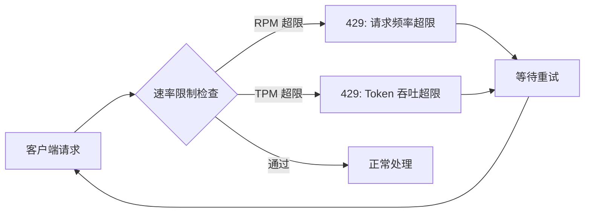
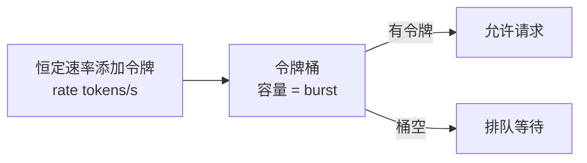
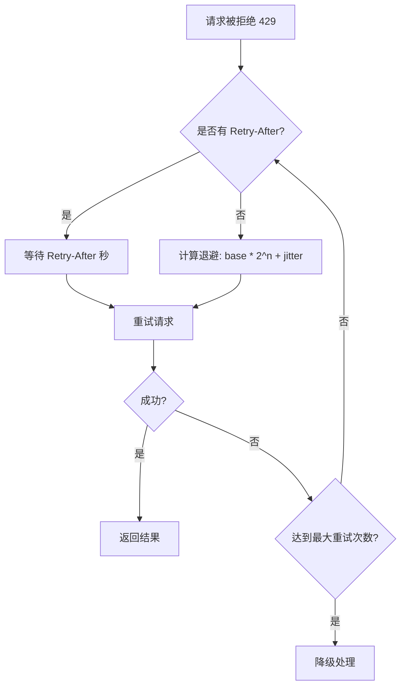
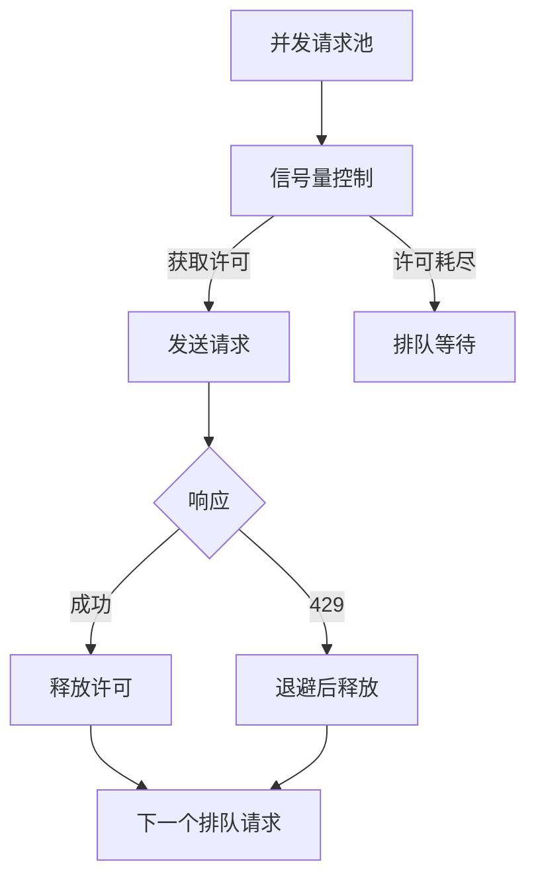
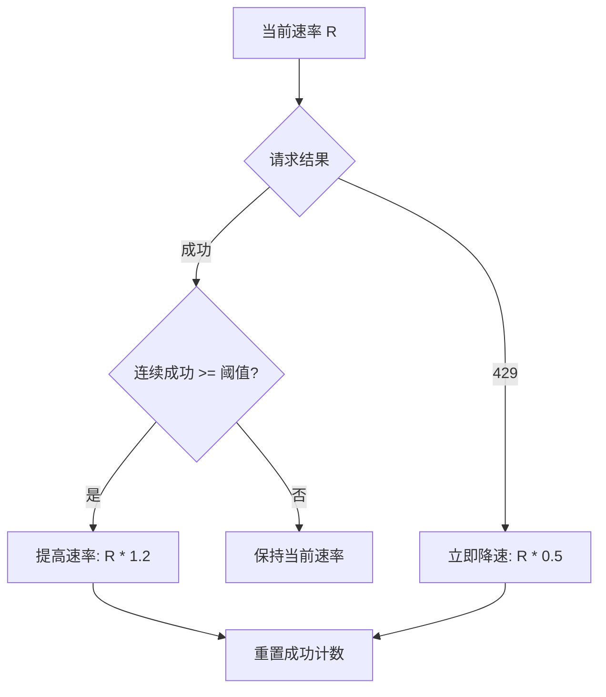
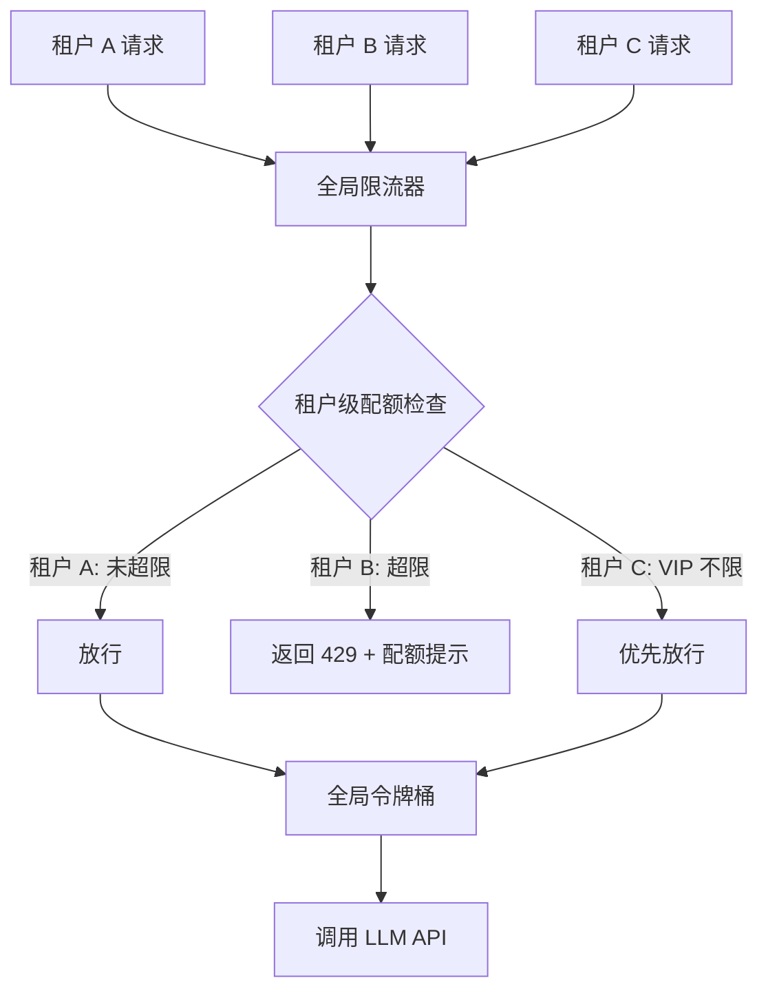

---
title: 429 速率限制怎么解决？
description: 从令牌桶到指数退避再到自适应限流，系统掌握 LLM API 429 错误的完整解决方案
date: 2026-06-18T10:00:00+08:00
lastmod: 2026-06-18T10:00:00+08:00
weight: 5
tags:
  - 面试
  - 速率限制
  - 429
  - 并发控制
categories:
  - 面试题
  - 技术分享
math: true
mermaid: true
photos:
  - https://d-sketon.top/img/backwebp/bg5.webp
---

## 面试场景描述

> **面试官**：你的系统接入了大模型 API，上线后高峰期频繁报 429 错误，用户投诉量激增。你会怎么排查和解决？
>
> **候选人**：这个问题我踩过坑。429 是 HTTP 的 "Too Many Requests"，本质是服务端限流。LLM API 的限流比普通 API 更复杂，它同时限制了请求频率（RPM）和 Token 吞吐量（TPM）。我会从客户端主动限流、指数退避重试、并发控制三个层面来解决。
>
> **面试官**：能具体说说怎么实现吗？如果突发流量来了怎么办？

这是一道考察 **LLM API 工程化能力** 的高频面试题。429 看似是一个 HTTP 状态码，背后却涉及限流算法、重试策略、并发调度、多租户配额管理等多个工程主题。本文将从问题本质出发，给出完整的解决方案。

## 问题分析：429 到底意味着什么

### 什么是 429

HTTP 429 Too Many Requests 是 RFC 6585 定义的状态码，表示用户在给定时间内发送了过多请求。对于 LLM API 而言，一个规范的 429 响应通常携带以下信息：

```http
HTTP/1.1 429 Too Many Requests
Content-Type: application/json
Retry-After: 30
X-RateLimit-Limit-Requests: 500
X-RateLimit-Remaining-Requests: 0
X-RateLimit-Reset-Requests: 30s

{
  "error": {
    "type": "rate_limit_error",
    "message": "Rate limit reached for requests",
    "code": "rate_limit_exceeded"
  }
}
```

| 响应头 | 含义 | 处理策略 |
|--------|------|---------|
| `Retry-After` | 建议的重试等待秒数 | **最高优先级**，应严格遵守 |
| `X-RateLimit-Limit-*` | 当前窗口的总配额 | 用于自适应调速 |
| `X-RateLimit-Remaining-*` | 当前窗口剩余配额 | 接近 0 时主动降速 |
| `X-RateLimit-Reset-*` | 配额重置时间 | 触发排队等待策略 |

### 为什么 LLM API 有双重限制

传统 Web API 通常只限制**请求频率**（RPM, Requests Per Minute）。但 LLM API 必须额外限制 **Token 吞吐量**（TPM, Tokens Per Minute），原因在于：

- 一次包含 8000 Token 长上下文的请求，与一次 100 Token 的请求，消耗的 GPU 算力天差地别
- Token 才是计算成本的直接度量，而非请求数
- 若只限制 RPM，攻击者可以构造超长上下文请求压垮服务端



主流 LLM 提供商的限流维度对比：

| 提供商 | RPM | TPM | 并发数 | 日/月配额 |
|--------|-----|-----|--------|----------|
| OpenAI | 按层级分层 | 按层级分层 | Tier 1 限 100 | 有月度上限 |
| Anthropic | 按订阅级别 | 按订阅级别 | 无显式限制 | 有日度上限 |
| 通义千问 | 按 QPS | 按模型 | 有限制 | 有免费额度 |
| DeepSeek | 按并发 | 按模型 | 有限制 | 按余额 |

## 解决方案一：客户端限流

### 为什么需要客户端限流

很多人的第一反应是"等服务端返回 429 再重试"。这是错误的——**客户端主动限流永远优先于被动重试**。原因有三：

1. **减少无效请求**：被拒绝的请求白白消耗网络资源和用户等待时间
2. **保护配额**：某些平台对 429 频率过高会降级账号
3. **提升体验**：主动排队比"请求-失败-重试"体验更好

### 令牌桶算法

令牌桶是工业界最广泛使用的限流算法。核心思想：以恒定速率向桶中添加令牌，请求到来时消耗令牌，桶空时拒绝或排队。



令牌桶的关键优势是允许**突发流量**（burst）：桶满时可以瞬间处理 `burst` 个请求，然后按 `rate` 速率补充。这与 API 提供商的限流模型最为匹配。

```python
import time
import threading

class TokenBucketRateLimiter:
    """令牌桶限流器：线程安全，支持突发流量"""

    def __init__(self, rate: float, capacity: int):
        """
        Args:
            rate: 令牌补充速率（令牌/秒）
            capacity: 桶容量（最大突发请求数）
        """
        self.rate = rate
        self.capacity = capacity
        self.tokens = capacity
        self.last_refill = time.time()
        self._lock = threading.Lock()

    def acquire(self, tokens: int = 1, timeout: float | None = None) -> bool:
        """
        尝试获取令牌。
        如果设置了 timeout，则会阻塞等待直到获取或超时。
        """
        deadline = time.time() + timeout if timeout else None
        while True:
            with self._lock:
                self._refill()
                if self.tokens >= tokens:
                    self.tokens -= tokens
                    return True
                # 计算还需等待多久才有足够令牌
                deficit = tokens - self.tokens
                wait_time = deficit / self.rate
            if deadline and time.time() + wait_time > deadline:
                return False
            if deadline:
                remaining = deadline - time.time()
                time.sleep(min(wait_time, remaining))
            else:
                time.sleep(wait_time)

    def _refill(self):
        now = time.time()
        elapsed = now - self.last_refill
        self.tokens = min(self.capacity, self.tokens + elapsed * self.rate)
        self.last_refill = now
```

### 限流算法对比

| 算法 | 突发流量 | 内存开销 | 精度 | 适用场景 |
|------|---------|---------|------|---------|
| 固定窗口 | 允许（边界突刺） | O(1) | 低 | 简单限流 |
| 滑动窗口 | 允许（受窗口限制） | O(n) | 高 | 精确限流 |
| **令牌桶** | **允许（受桶容量限制）** | **O(1)** | **中高** | **API 调用（推荐）** |
| 漏桶 | 不允许 | O(1) | 高 | 流量整形 |

> **实践建议**：LLM API 场景下推荐令牌桶，因为它既控制了平均速率，又允许合理的突发请求。

## 解决方案二：指数退避重试

### 退避公式与抖动

当 429 不可避免地发生时，指数退避是标准重试策略：

$$
\text{wait}_n = \min(\text{base} \times 2^n, \text{max\_delay}) + \text{jitter}
$$

其中 $n$ 是重试次数，`jitter` 是随机抖动。**抖动是必须的**——多客户端场景下，没有抖动的退避会导致"同步重试风暴"：所有客户端在同一时刻重试，再次触发 429。



### 完整重试实现

```python
import time
import random
import logging
from functools import wraps
from typing import Callable

logger = logging.getLogger("llm.retry")

def retry_with_backoff(
    max_retries: int = 5,
    base_delay: float = 1.0,
    max_delay: float = 60.0,
    retry_on: tuple = (429, 500, 502, 503),
):
    """指数退避重试装饰器，优先尊重 Retry-After 头"""
    def decorator(func: Callable) -> Callable:
        @wraps(func)
        def wrapper(*args, **kwargs):
            for attempt in range(max_retries + 1):
                try:
                    return func(*args, **kwargs)
                except Exception as e:
                    status = _get_status_code(e)
                    if status not in retry_on and attempt > 0:
                        raise  # 不可重试的错误直接抛出

                    if attempt == max_retries:
                        logger.error(f"{func.__name__} 重试 {max_retries} 次后仍失败")
                        raise

                    # 429 优先使用 Retry-After
                    if status == 429:
                        delay = _extract_retry_after(e) or _calc_backoff(
                            attempt, base_delay, max_delay
                        )
                    else:
                        delay = _calc_backoff(attempt, base_delay, max_delay)

                    logger.warning(
                        f"{func.__name__} 第 {attempt+1} 次重试，等待 {delay:.1f}s"
                    )
                    time.sleep(delay)
        return wrapper
    return decorator


def _calc_backoff(attempt: int, base: float, max_delay: float) -> float:
    """计算指数退避 + 随机抖动"""
    delay = min(base * (2 ** attempt), max_delay)
    jitter = random.uniform(0, delay * 0.1)  # 10% 抖动
    return delay + jitter


def _get_status_code(error: Exception) -> int | None:
    """从异常对象中提取 HTTP 状态码"""
    status = getattr(error, "status_code", None)
    if status is None and hasattr(error, "response"):
        status = getattr(error.response, "status_code", None)
    return status


def _extract_retry_after(error: Exception) -> float | None:
    """从错误对象中提取 Retry-After 值"""
    retry_after = getattr(error, "retry_after", None)
    if retry_after:
        return float(retry_after)
    response = getattr(error, "response", None)
    if response:
        headers = getattr(response, "headers", {})
        ra = headers.get("Retry-After") or headers.get("retry-after")
        if ra:
            try:
                return float(ra)
            except ValueError:
                pass
    return None
```

### Retry-After 头的优先级处理

`Retry-After` 是服务端给出的**最准确**的重试时机，处理优先级如下：

| 优先级 | 来源 | 可靠度 | 说明 |
|--------|------|--------|------|
| 1 | `Retry-After` 响应头 | 最高 | 服务端明确指示 |
| 2 | SDK 异常的 `retry_after` 属性 | 高 | SDK 已解析 |
| 3 | `X-RateLimit-Reset-*` 头 | 中 | 需计算差值 |
| 4 | 指数退避计算 | 兜底 | 无服务端信息时 |

## 解决方案三：并发控制

### 信号量机制

即使每次请求都在速率限制内，**大量并发请求**也可能在瞬间耗尽 Token 配额。信号量是最直接的并发控制手段：



```python
import asyncio
from asyncio import Semaphore

class AsyncLLMClient:
    """异步 LLM 客户端：信号量并发控制 + 令牌桶限流"""

    def __init__(
        self,
        max_concurrency: int = 10,
        rate: float = 8.0,  # ~480 RPM
        burst: int = 10,
    ):
        self.semaphore = Semaphore(max_concurrency)
        self.limiter = TokenBucketRateLimiter(rate=rate, capacity=burst)

    async def call(self, messages: list[dict]) -> str:
        async with self.semaphore:
            self.limiter.acquire(tokens=1, timeout=30)
            # 实际调用 LLM API...
            return "response"
```

### 并发数与速率的关系

并发数和速率是两个独立但相关的维度：

| 维度 | 控制对象 | 过高的后果 | 过低的后果 |
|------|---------|-----------|-----------|
| **并发数** | 同时在途的请求数 | 瞬间冲击大，易触发 429 | 吞吐量不足，等待时间长 |
| **速率（RPM）** | 每分钟发出的请求数 | 触发频率限制 | 资源利用率低 |
| **TPM** | 每分钟消耗的 Token 数 | 触发吞吐限制 | 无法充分利用配额 |

经验公式：并发数 ≈ `目标延迟 / 平均请求间隔`。例如平均每次请求耗时 3 秒，希望每分钟 60 次（每秒 1 次），则并发数 ≈ 3。

## 解决方案四：自适应限流

固定速率的限流器难以应对 API 配额的动态变化（如配额提升或临时降级）。自适应限流通过监控 429 频率动态调整速率：



```python
@dataclass
class AdaptiveState:
    current_rate: float       # 当前令牌补充速率
    min_rate: float           # 最小速率
    max_rate: float           # 最大速率
    success_streak: int = 0   # 连续成功次数
    rate_limit_hits: int = 0  # 429 累计次数

class AdaptiveRateLimiter:
    """
    自适应令牌桶：根据 429 频率动态调整速率。
    - 连续成功足够多次 → 逐步提高速率（探测上限）
    - 遇到 429 → 立即降低速率（保守回退）
    """

    def __init__(
        self,
        initial_rate: float = 5.0,
        min_rate: float = 1.0,
        max_rate: float = 20.0,
        increase_factor: float = 1.2,
        decrease_factor: float = 0.5,
        success_threshold: int = 20,
    ):
        self.state = AdaptiveState(
            current_rate=initial_rate, min_rate=min_rate, max_rate=max_rate,
        )
        self.increase_factor = increase_factor
        self.decrease_factor = decrease_factor
        self.success_threshold = success_threshold
        self.bucket = TokenBucketRateLimiter(
            rate=initial_rate, capacity=int(initial_rate * 2),
        )

    def acquire(self, timeout: float | None = None) -> bool:
        return self.bucket.acquire(tokens=1, timeout=timeout)

    def on_success(self):
        """请求成功时调用：连续成功达到阈值后提速"""
        self.state.success_streak += 1
        if self.state.success_streak >= self.success_threshold:
            new_rate = min(
                self.state.current_rate * self.increase_factor,
                self.state.max_rate,
            )
            if new_rate > self.state.current_rate:
                self.state.current_rate = new_rate
                self.bucket.rate = new_rate
                self.bucket.capacity = int(new_rate * 2)
                logger.info(f"自适应提速: {new_rate:.1f} tokens/s")
            self.state.success_streak = 0

    def on_rate_limit(self):
        """收到 429 时调用：立即降速"""
        self.state.rate_limit_hits += 1
        self.state.success_streak = 0
        new_rate = max(
            self.state.current_rate * self.decrease_factor,
            self.state.min_rate,
        )
        self.state.current_rate = new_rate
        self.bucket.rate = new_rate
        self.bucket.capacity = int(new_rate * 2)
        logger.warning(
            f"触发限流，降速至: {new_rate:.1f} tokens/s "
            f"(累计 {self.state.rate_limit_hits} 次)"
        )
```

## 完整的限流+重试实现

将所有组件整合为一个生产可用的 LLM 客户端：

```python
"""
生产级 LLM 客户端：令牌桶限流 + 自适应调速 + 指数退避 + 并发控制
"""
import asyncio
import logging
from dataclasses import dataclass

logger = logging.getLogger("llm.client")

@dataclass
class ClientConfig:
    """客户端配置"""
    model: str = "gpt-4o"
    max_concurrency: int = 10
    initial_rate: float = 8.0       # ~480 RPM
    min_rate: float = 1.0
    max_rate: float = 20.0
    max_retries: int = 5
    base_retry_delay: float = 1.0
    max_retry_delay: float = 60.0
    request_timeout: float = 120.0


class ProductionLLMClient:
    """生产级异步 LLM 客户端"""

    def __init__(self, config: ClientConfig | None = None):
        self.config = config or ClientConfig()
        self.semaphore = asyncio.Semaphore(self.config.max_concurrency)
        self.limiter = AdaptiveRateLimiter(
            initial_rate=self.config.initial_rate,
            min_rate=self.config.min_rate,
            max_rate=self.config.max_rate,
        )

    async def chat(
        self,
        messages: list[dict],
        model: str | None = None,
        max_tokens: int = 1024,
    ) -> str:
        """带完整限流与重试的聊天调用"""
        model = model or self.config.model
        async with self.semaphore:
            return await self._call_with_retry(messages, model, max_tokens)

    async def _call_with_retry(
        self,
        messages: list[dict],
        model: str,
        max_tokens: int,
    ) -> str:
        for attempt in range(self.config.max_retries):
            self.limiter.acquire(timeout=self.config.request_timeout)
            try:
                # resp = await self.client.chat.completions.create(...)
                self.limiter.on_success()
                return f"response for {model}"

            except Exception as e:
                status = _get_status_code(e)
                if status == 429:
                    self.limiter.on_rate_limit()
                    wait = _extract_retry_after(e) or _calc_backoff(
                        attempt,
                        self.config.base_retry_delay,
                        self.config.max_retry_delay,
                    )
                    logger.warning(f"429 限流，第 {attempt+1} 次重试，等待 {wait:.1f}s")
                    await asyncio.sleep(wait)
                elif status in (500, 502, 503):
                    wait = _calc_backoff(attempt, self.config.base_retry_delay,
                                         self.config.max_retry_delay)
                    await asyncio.sleep(wait)
                else:
                    raise

        raise RuntimeError(f"达到最大重试次数 {self.config.max_retries}")
```

## 生产实践：多租户配额管理

在 SaaS 场景中，多个租户共享 API 配额，需要更精细的配额管理：



多租户配额分配策略对比：

| 策略 | 公平性 | 实现复杂度 | 适用场景 |
|------|--------|-----------|---------|
| **固定配额** | 高 | 低 | 每个租户付费相同 |
| **按权重分配** | 中 | 中 | VIP 租户配额更高 |
| **抢占式** | 低 | 低 | 内部团队，先到先得 |
| **弹性共享** | 中 | 高 | 空闲配额可被其他租户借用 |

```python
class MultiTenantQuotaManager:
    """多租户配额管理器：按权重分配 + 弹性借用"""

    def __init__(self, total_rpm: int):
        self.total_rpm = total_rpm
        self.tenant_limits: dict[str, int] = {}  # 租户 -> 配额
        self.tenant_usage: dict[str, list[float]] = {}  # 租户 -> 请求时间戳

    def set_quota(self, tenant_id: str, weight: float, total_weight: float):
        """按权重设置租户配额"""
        self.tenant_limits[tenant_id] = int(self.total_rpm * weight / total_weight)

    def allow(self, tenant_id: str) -> bool:
        """检查租户是否可以发请求"""
        now = time.time()
        usage = self.tenant_usage.get(tenant_id, [])
        # 清理 60 秒前的记录
        usage = [t for t in usage if t > now - 60]
        limit = self.tenant_limits.get(tenant_id, 0)
        if len(usage) < limit:
            usage.append(now)
            self.tenant_usage[tenant_id] = usage
            return True
        return False
```

## 最佳实践清单

| 场景 | 推荐策略 |
|------|---------|
| **低频调用（<10 RPM）** | 固定窗口 + 基础重试 |
| **中频调用（10-500 RPM）** | 令牌桶 + 指数退避 |
| **高频调用（>500 RPM）** | 令牌桶 + 自适应限流 + 信号量并发控制 |
| **批量任务** | 批量调度器 + 令牌桶 + 降级链 |
| **多租户** | 全局限流 + 租户级配额 + 弹性借用 |

通用原则：

1. **客户端限流优先**：不要等服务端返回 429 才限流
2. **尊重 Retry-After**：服务端给出的重试时机最准确
3. **抖动是必须的**：多客户端场景下避免同步重试风暴
4. **降级优于失败**：重试耗尽时降级到更小模型或返回缓存
5. **监控驱动调优**：根据实际 429 率调整限流参数

## 追问延伸

### Q1：突发流量怎么处理？

**面试官追问**：如果突然来了一波高峰流量，你的限流器会怎么应对？

**回答要点**：

- 令牌桶天然支持突发——桶满时可以瞬间放行 `capacity` 个请求
- 配合**请求队列**：被限流的请求不直接拒绝，而是排队等待令牌
- 设置合理的 `timeout`：队列等待超时后返回降级结果，避免无限积压
- 极端场景启用**降级链**：主模型 → 小模型 → 缓存 → 默认回复

```python
# 突发流量处理：队列 + 超时降级
async def call_with_queue(self, messages, timeout=30):
    try:
        return await asyncio.wait_for(
            self._enqueue_and_call(messages),
            timeout=timeout,
        )
    except asyncio.TimeoutError:
        return "当前请求量较大，请稍后再试"  # 降级
```

### Q2：多客户端如何共享配额？

**面试官追问**：你有 3 台服务器同时调用同一个 API Key，怎么避免互相抢配额？

**回答要点**：

- **分布式限流**：使用 Redis 作为共享的令牌桶存储
- **Redis + Lua 脚本**：保证令牌的获取和补充是原子操作
- **令牌预分配**：每台服务器预分配一部分配额，减少竞争
- **请求网关统一限流**：所有请求经过一个网关，由网关统一调度

```python
# Redis 分布式令牌桶（Lua 原子操作）
LUA_SCRIPT = """
local key = KEYS[1]
local rate = tonumber(ARGV[1])
local capacity = tonumber(ARGV[2])
local now = tonumber(ARGV[3])
local tokens = tonumber(redis.call('get', key) or capacity)
tokens = math.min(capacity, tokens + (now - last_refill) * rate)
if tokens >= 1 then
    redis.call('set', key, tokens - 1)
    return 1
else
    return 0
end
"""
```

### Q3：如何平衡吞吐量和延迟？

**回答要点**：

- 高吞吐 → 提高并发数和速率，但延迟可能上升
- 低延迟 → 降低并发数，但吞吐量下降
- **自适应折中**：监控 P99 延迟，延迟过高时自动降速
- **优先级队列**：交互式请求优先，批量任务靠后

## 结语

429 速率限制是 LLM 应用从 Demo 走向生产的必经之路。解决它不是单一的技巧，而是一套**组合拳**：

- **客户端限流**（令牌桶）是预防——主动控制请求速率，避免被拒绝
- **指数退避**（含抖动）是治疗——被拒绝后智能重试，优先尊重 Retry-After
- **并发控制**（信号量）是调度——在限制内最大化吞吐量
- **自适应限流**是进化——根据实际反馈动态探测最优速率

四者协同构成完整的流量治理体系。理解它们的原理与协作方式，才能构建出既高效又稳定的 LLM 应用。

## 参考文献

1. RFC 6585 - Additional HTTP Status Codes (429). IETF, 2012.
2. OpenAI Rate Limits. https://platform.openai.com/docs/guides/rate-limits
3. Anthropic Rate Limits. https://docs.anthropic.com/en/api/rate-limits
4. Google Cloud API Quotas. https://cloud.google.com/docs/quotas
5. AWS API Gateway Throttling. https://docs.aws.amazon.com/apigateway/
