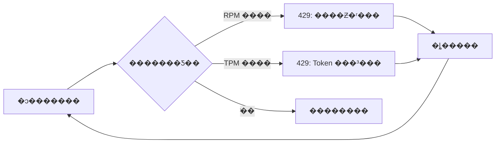
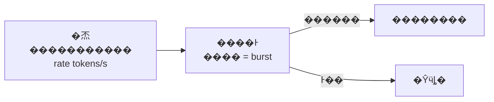
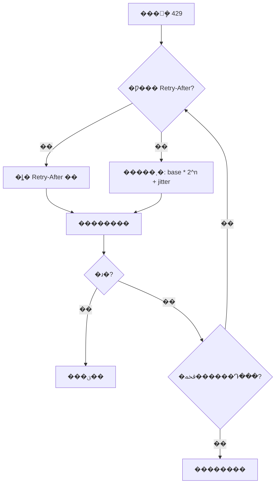
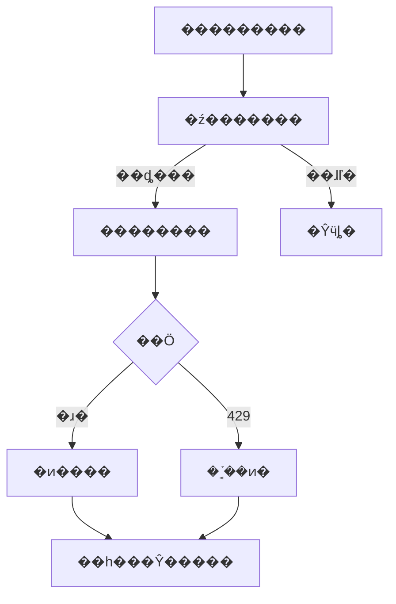
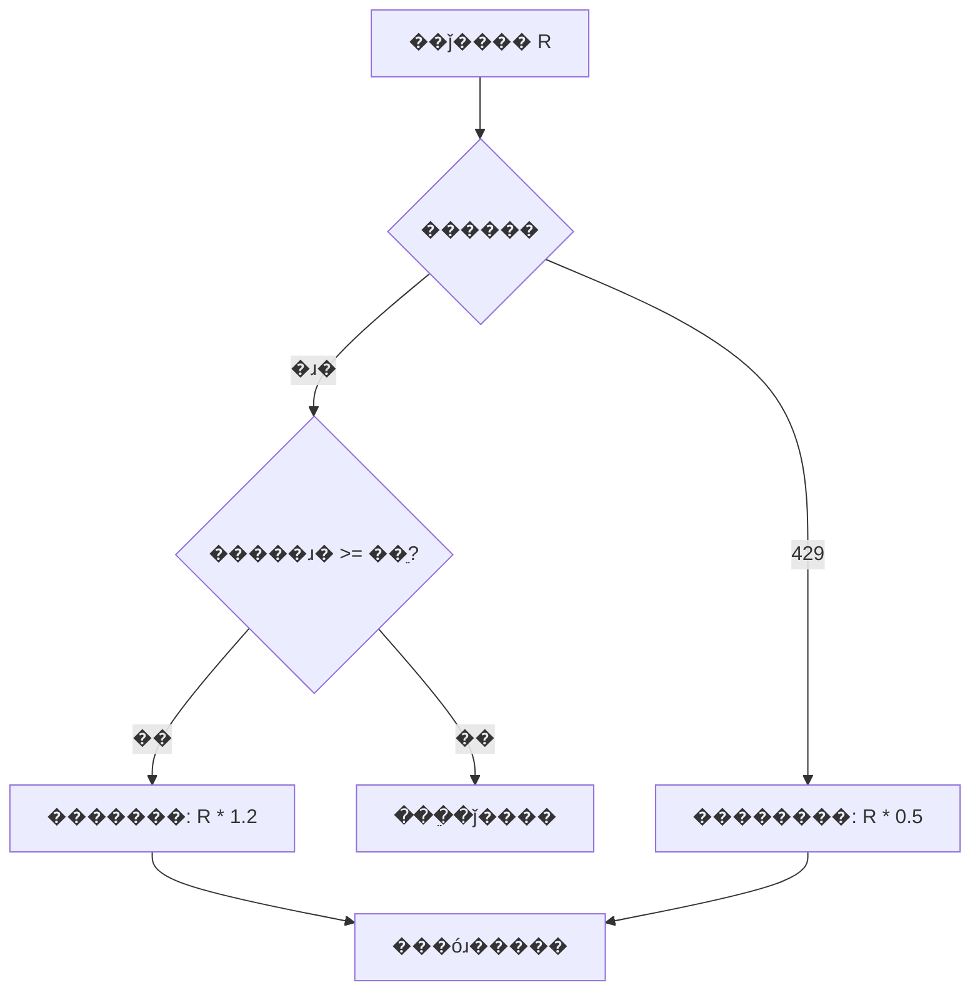
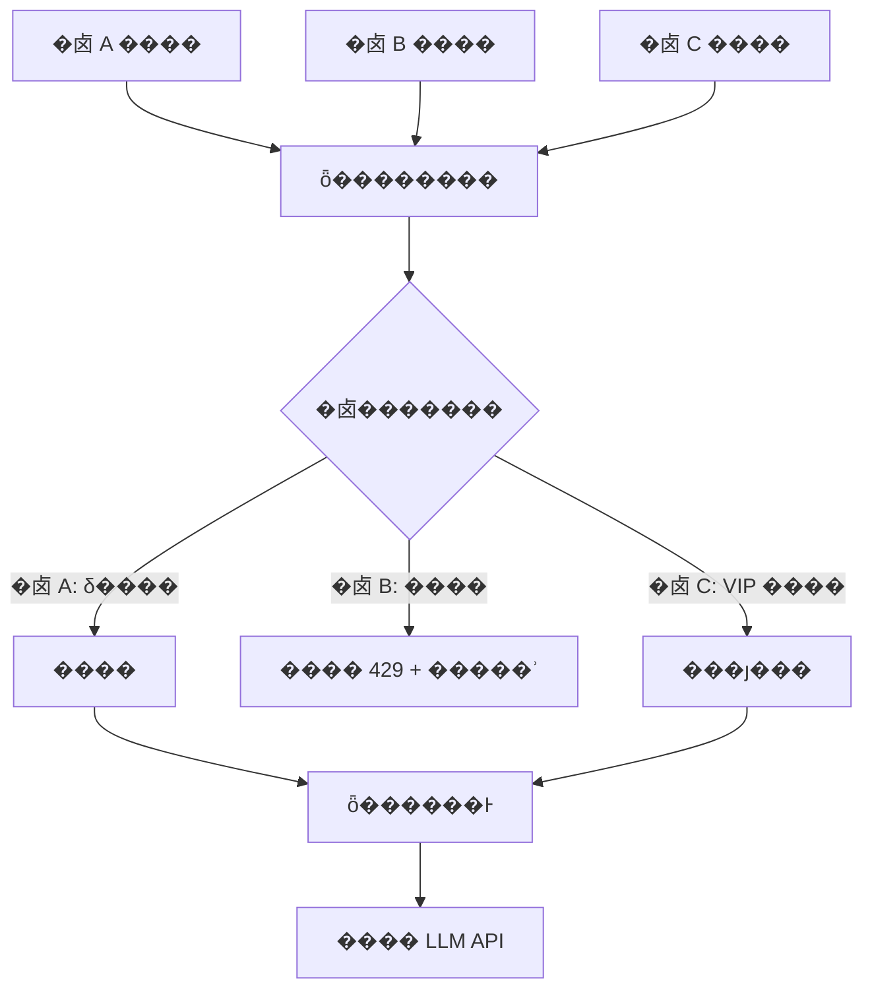

???---
title: 429 �������������
description: ������Ͱ��ָ���˱��ٵ�����Ӧ������ϵͳ���� LLM API 429 ����������������
date: 2023-08-01T18:54:26+08:00
lastmod: 2023-08-01T18:54:26+08:00
weight: 5
tags:
  - ����
  - ��������
  - 429
  - ��������
categories:
  - ������
  - ��������
math: true
mermaid: true
photos:
  - https://d-sketon.top/img/backwebp/bg5.webp
---

## ���Գ�������

> **���Թ�**�����ϵͳ�����˴�ģ�� API�����ߺ�߷���Ƶ���� 429 �����û�Ͷ���������������ô�Ų�ͽ����
>
> **��ѡ��**����������Ҳȹ��ӡ�429 �� HTTP �� "Too Many Requests"�������Ƿ����������LLM API ����������ͨ API �����ӣ���ͬʱ����������Ƶ�ʣ�RPM���� Token ��������TPM�����һ�ӿͻ�������������ָ���˱����ԡ������������������������
>
> **���Թ�**���ܾ���˵˵��ôʵ�������ͻ������������ô�죿

����һ������ **LLM API ���̻�����** �ĸ�Ƶ�����⡣429 ������һ�� HTTP ״̬�룬����ȴ�漰�����㷨�����Բ��ԡ��������ȡ����⻧������ȶ���������⡣���Ľ������Ȿ�ʳ��������������Ľ��������

## ���������429 ������ζ��ʲô

### ʲô�� 429

HTTP 429 Too Many Requests �� RFC 6585 �����״̬�룬��ʾ�û��ڸ���ʱ���ڷ����˹������󡣶��� LLM API ���ԣ�һ���淶�� 429 ��Ӧͨ��Я��������Ϣ��

```http
HTTP/1.1 429 Too Many Requests
Content-Type: application/json
Retry-After: 30
X-RateLimit-Limit-Requests: 500
X-RateLimit-Remaining-Requests: 0
X-RateLimit-Reset-Requests: 30s

{
  "error": {
    "type": "rate_limit_error",
    "message": "Rate limit reached for requests",
    "code": "rate_limit_exceeded"
  }
}
```

| ��Ӧͷ | ���� | ������� |
|--------|------|---------|
| `Retry-After` | ��������Եȴ����� | **������ȼ�**��Ӧ�ϸ����� |
| `X-RateLimit-Limit-*` | ��ǰ���ڵ������ | ��������Ӧ���� |
| `X-RateLimit-Remaining-*` | ��ǰ����ʣ����� | �ӽ� 0 ʱ�������� |
| `X-RateLimit-Reset-*` | �������ʱ�� | �����Ŷӵȴ����� |

### Ϊʲô LLM API ��˫������

��ͳ Web API ͨ��ֻ����**����Ƶ��**��RPM, Requests Per Minute������ LLM API ����������� **Token ������**��TPM, Tokens Per Minute����ԭ�����ڣ�

- һ�ΰ��� 8000 Token �������ĵ�������һ�� 100 Token ���������ĵ� GPU �������ر�
- Token ���Ǽ���ɱ���ֱ�Ӷ���������������
- ��ֻ���� RPM�������߿��Թ��쳬������������ѹ������



���� LLM �ṩ�̵�����ά�ȶԱȣ�

| �ṩ�� | RPM | TPM | ������ | ��/����� |
|--------|-----|-----|--------|----------|
| OpenAI | ���㼶�ֲ� | ���㼶�ֲ� | Tier 1 �� 100 | ���¶����� |
| Anthropic | �����ļ��� | �����ļ��� | ����ʽ���� | ���ն����� |
| ͨ��ǧ�� | �� QPS | ��ģ�� | ������ | ����Ѷ�� |
| DeepSeek | ������ | ��ģ�� | ������ | ����� |

## �������һ���ͻ�������

### Ϊʲô��Ҫ�ͻ�������

�ܶ��˵ĵ�һ��Ӧ��"�ȷ���˷��� 429 ������"�����Ǵ���ġ���**�ͻ�������������Զ�����ڱ�������**��ԭ��������

1. **������Ч����**�����ܾ�������װ�����������Դ���û��ȴ�ʱ��
2. **�������**��ijЩƽ̨�� 429 Ƶ�ʹ��߻ή���˺�
3. **��������**�������Ŷӱ�"����-ʧ��-����"�������

### ����Ͱ�㷨

����Ͱ�ǹ�ҵ����㷺ʹ�õ������㷨������˼�룺�Ժ㶨������Ͱ��������ƣ�������ʱ�������ƣ�Ͱ��ʱ�ܾ����Ŷӡ�



����Ͱ�Ĺؼ�����������**ͻ������**��burst����Ͱ��ʱ����˲�䴦�� `burst` ������Ȼ�� `rate` ���ʲ��䡣���� API �ṩ�̵�����ģ����Ϊƥ�䡣

```python
import time
import threading

class TokenBucketRateLimiter:
    """����Ͱ���������̰߳�ȫ��֧��ͻ������"""

    def __init__(self, rate: float, capacity: int):
        """
        Args:
            rate: ���Ʋ������ʣ�����/�룩
            capacity: Ͱ���������ͻ����������
        """
        self.rate = rate
        self.capacity = capacity
        self.tokens = capacity
        self.last_refill = time.time()
        self._lock = threading.Lock()

    def acquire(self, tokens: int = 1, timeout: float | None = None) -> bool:
        """
        ���Ի�ȡ���ơ�
        ��������� timeout����������ȴ�ֱ����ȡ��ʱ��
        """
        deadline = time.time() + timeout if timeout else None
        while True:
            with self._lock:
                self._refill()
                if self.tokens >= tokens:
                    self.tokens -= tokens
                    return True
                # ���㻹��ȴ���ò����㹻����
                deficit = tokens - self.tokens
                wait_time = deficit / self.rate
            if deadline and time.time() + wait_time > deadline:
                return False
            if deadline:
                remaining = deadline - time.time()
                time.sleep(min(wait_time, remaining))
            else:
                time.sleep(wait_time)

    def _refill(self):
        now = time.time()
        elapsed = now - self.last_refill
        self.tokens = min(self.capacity, self.tokens + elapsed * self.rate)
        self.last_refill = now
```

### �����㷨�Ա�

| �㷨 | ͻ������ | �ڴ濪�� | ���� | ���ó��� |
|------|---------|---------|------|---------|
| �̶����� | ������߽�ͻ�̣� | O(1) | �� | ������ |
| �������� | ������ܴ������ƣ� | O(n) | �� | ��ȷ���� |
| **����Ͱ** | **�������Ͱ�������ƣ�** | **O(1)** | **�и�** | **API ���ã��Ƽ���** |
| ©Ͱ | ������ | O(1) | �� | �������� |

> **ʵ������**��LLM API �������Ƽ�����Ͱ����Ϊ���ȿ�����ƽ�����ʣ�����������ͻ������

## �����������ָ���˱�����

### �˱ܹ�ʽ�붶��

�� 429 ���ɱ���ط���ʱ��ָ���˱��DZ�׼���Բ��ԣ�

$$
\text{wait}_n = \min(\text{base} \times 2^n, \text{max\_delay}) + \text{jitter}
$$

���� $n$ �����Դ�����`jitter` �����������**�����DZ����**������ͻ��˳����£�û�ж������˱ܻᵼ��"ͬ�����Է籩"�����пͻ�����ͬһʱ�����ԣ��ٴδ��� 429��



### ��������ʵ��

```python
import time
import random
import logging
from functools import wraps
from typing import Callable

logger = logging.getLogger("llm.retry")

def retry_with_backoff(
    max_retries: int = 5,
    base_delay: float = 1.0,
    max_delay: float = 60.0,
    retry_on: tuple = (429, 500, 502, 503),
):
    """ָ���˱�����װ�������������� Retry-After ͷ"""
    def decorator(func: Callable) -> Callable:
        @wraps(func)
        def wrapper(*args, **kwargs):
            for attempt in range(max_retries + 1):
                try:
                    return func(*args, **kwargs)
                except Exception as e:
                    status = _get_status_code(e)
                    if status not in retry_on and attempt > 0:
                        raise  # �������ԵĴ���ֱ���׳�

                    if attempt == max_retries:
                        logger.error(f"{func.__name__} ���� {max_retries} �κ���ʧ��")
                        raise

                    # 429 ����ʹ�� Retry-After
                    if status == 429:
                        delay = _extract_retry_after(e) or _calc_backoff(
                            attempt, base_delay, max_delay
                        )
                    else:
                        delay = _calc_backoff(attempt, base_delay, max_delay)

                    logger.warning(
                        f"{func.__name__} �� {attempt+1} �����ԣ��ȴ� {delay:.1f}s"
                    )
                    time.sleep(delay)
        return wrapper
    return decorator


def _calc_backoff(attempt: int, base: float, max_delay: float) -> float:
    """����ָ���˱� + �������"""
    delay = min(base * (2 ** attempt), max_delay)
    jitter = random.uniform(0, delay * 0.1)  # 10% ����
    return delay + jitter


def _get_status_code(error: Exception) -> int | None:
    """���쳣��������ȡ HTTP ״̬��"""
    status = getattr(error, "status_code", None)
    if status is None and hasattr(error, "response"):
        status = getattr(error.response, "status_code", None)
    return status


def _extract_retry_after(error: Exception) -> float | None:
    """�Ӵ����������ȡ Retry-After ֵ"""
    retry_after = getattr(error, "retry_after", None)
    if retry_after:
        return float(retry_after)
    response = getattr(error, "response", None)
    if response:
        headers = getattr(response, "headers", {})
        ra = headers.get("Retry-After") or headers.get("retry-after")
        if ra:
            try:
                return float(ra)
            except ValueError:
                pass
    return None
```

### Retry-After ͷ�����ȼ�����

`Retry-After` �Ƿ���˸�����**��׼ȷ**������ʱ�����������ȼ����£�

| ���ȼ� | ��Դ | �ɿ��� | ˵�� |
|--------|------|--------|------|
| 1 | `Retry-After` ��Ӧͷ | ��� | �������ȷָʾ |
| 2 | SDK �쳣�� `retry_after` ���� | �� | SDK �ѽ��� |
| 3 | `X-RateLimit-Reset-*` ͷ | �� | ������ֵ |
| 4 | ָ���˱ܼ��� | ���� | �޷������Ϣʱ |

## �������������������

### �ź�������

��ʹÿ�����������������ڣ�**������������**Ҳ������˲��ľ� Token ���ź�������ֱ�ӵIJ��������ֶΣ�



```python
import asyncio
from asyncio import Semaphore

class AsyncLLMClient:
    """�첽 LLM �ͻ��ˣ��ź����������� + ����Ͱ����"""

    def __init__(
        self,
        max_concurrency: int = 10,
        rate: float = 8.0,  # ~480 RPM
        burst: int = 10,
    ):
        self.semaphore = Semaphore(max_concurrency)
        self.limiter = TokenBucketRateLimiter(rate=rate, capacity=burst)

    async def call(self, messages: list[dict]) -> str:
        async with self.semaphore:
            self.limiter.acquire(tokens=1, timeout=30)
            # ʵ�ʵ��� LLM API...
            return "response"
```

### �����������ʵĹ�ϵ

��������������������������ص�ά�ȣ�

| ά�� | ���ƶ��� | ���ߵĺ�� | ���͵ĺ�� |
|------|---------|-----------|-----------|
| **������** | ͬʱ��;�������� | ˲�������״��� 429 | ���������㣬�ȴ�ʱ�䳤 |
| **���ʣ�RPM��** | ÿ���ӷ����������� | ����Ƶ������ | ��Դ�����ʵ� |
| **TPM** | ÿ�������ĵ� Token �� | ������������ | �޷����������� |

���鹫ʽ�������� �� `Ŀ���ӳ� / ƽ��������`������ƽ��ÿ�������ʱ 3 �룬ϣ��ÿ���� 60 �Σ�ÿ�� 1 �Σ����򲢷��� �� 3��

## ��������ģ�����Ӧ����

�̶����ʵ�����������Ӧ�� API ���Ķ�̬�仯���������������ʱ������������Ӧ����ͨ����� 429 Ƶ�ʶ�̬�������ʣ�



```python
@dataclass
class AdaptiveState:
    current_rate: float       # ��ǰ���Ʋ�������
    min_rate: float           # ������
    max_rate: float           # �������
    success_streak: int = 0   # �����ɹ�����
    rate_limit_hits: int = 0  # 429 �ۼƴ���

class AdaptiveRateLimiter:
    """
    ����Ӧ����Ͱ������ 429 Ƶ�ʶ�̬�������ʡ�
    - �����ɹ��㹻��� �� ��������ʣ�̽�����ޣ�
    - ���� 429 �� �����������ʣ����ػ��ˣ�
    """

    def __init__(
        self,
        initial_rate: float = 5.0,
        min_rate: float = 1.0,
        max_rate: float = 20.0,
        increase_factor: float = 1.2,
        decrease_factor: float = 0.5,
        success_threshold: int = 20,
    ):
        self.state = AdaptiveState(
            current_rate=initial_rate, min_rate=min_rate, max_rate=max_rate,
        )
        self.increase_factor = increase_factor
        self.decrease_factor = decrease_factor
        self.success_threshold = success_threshold
        self.bucket = TokenBucketRateLimiter(
            rate=initial_rate, capacity=int(initial_rate * 2),
        )

    def acquire(self, timeout: float | None = None) -> bool:
        return self.bucket.acquire(tokens=1, timeout=timeout)

    def on_success(self):
        """����ɹ�ʱ���ã������ɹ��ﵽ��ֵ������"""
        self.state.success_streak += 1
        if self.state.success_streak >= self.success_threshold:
            new_rate = min(
                self.state.current_rate * self.increase_factor,
                self.state.max_rate,
            )
            if new_rate > self.state.current_rate:
                self.state.current_rate = new_rate
                self.bucket.rate = new_rate
                self.bucket.capacity = int(new_rate * 2)
                logger.info(f"����Ӧ����: {new_rate:.1f} tokens/s")
            self.state.success_streak = 0

    def on_rate_limit(self):
        """�յ� 429 ʱ���ã���������"""
        self.state.rate_limit_hits += 1
        self.state.success_streak = 0
        new_rate = max(
            self.state.current_rate * self.decrease_factor,
            self.state.min_rate,
        )
        self.state.current_rate = new_rate
        self.bucket.rate = new_rate
        self.bucket.capacity = int(new_rate * 2)
        logger.warning(
            f"����������������: {new_rate:.1f} tokens/s "
            f"(�ۼ� {self.state.rate_limit_hits} ��)"
        )
```

## ����������+����ʵ��

�������������Ϊһ���������õ� LLM �ͻ��ˣ�

```python
"""
������ LLM �ͻ��ˣ�����Ͱ���� + ����Ӧ���� + ָ���˱� + ��������
"""
import asyncio
import logging
from dataclasses import dataclass

logger = logging.getLogger("llm.client")

@dataclass
class ClientConfig:
    """�ͻ�������"""
    model: str = "gpt-4o"
    max_concurrency: int = 10
    initial_rate: float = 8.0       # ~480 RPM
    min_rate: float = 1.0
    max_rate: float = 20.0
    max_retries: int = 5
    base_retry_delay: float = 1.0
    max_retry_delay: float = 60.0
    request_timeout: float = 120.0


class ProductionLLMClient:
    """�������첽 LLM �ͻ���"""

    def __init__(self, config: ClientConfig | None = None):
        self.config = config or ClientConfig()
        self.semaphore = asyncio.Semaphore(self.config.max_concurrency)
        self.limiter = AdaptiveRateLimiter(
            initial_rate=self.config.initial_rate,
            min_rate=self.config.min_rate,
            max_rate=self.config.max_rate,
        )

    async def chat(
        self,
        messages: list[dict],
        model: str | None = None,
        max_tokens: int = 1024,
    ) -> str:
        """���������������Ե��������"""
        model = model or self.config.model
        async with self.semaphore:
            return await self._call_with_retry(messages, model, max_tokens)

    async def _call_with_retry(
        self,
        messages: list[dict],
        model: str,
        max_tokens: int,
    ) -> str:
        for attempt in range(self.config.max_retries):
            self.limiter.acquire(timeout=self.config.request_timeout)
            try:
                # resp = await self.client.chat.completions.create(...)
                self.limiter.on_success()
                return f"response for {model}"

            except Exception as e:
                status = _get_status_code(e)
                if status == 429:
                    self.limiter.on_rate_limit()
                    wait = _extract_retry_after(e) or _calc_backoff(
                        attempt,
                        self.config.base_retry_delay,
                        self.config.max_retry_delay,
                    )
                    logger.warning(f"429 �������� {attempt+1} �����ԣ��ȴ� {wait:.1f}s")
                    await asyncio.sleep(wait)
                elif status in (500, 502, 503):
                    wait = _calc_backoff(attempt, self.config.base_retry_delay,
                                         self.config.max_retry_delay)
                    await asyncio.sleep(wait)
                else:
                    raise

        raise RuntimeError(f"�ﵽ������Դ��� {self.config.max_retries}")
```

## ����ʵ�������⻧������

�� SaaS �����У�����⻧���� API ����Ҫ����ϸ���������



���⻧��������ԶԱȣ�

| ���� | ��ƽ�� | ʵ�ָ��Ӷ� | ���ó��� |
|------|--------|-----------|---------|
| **�̶����** | �� | �� | ÿ���⻧������ͬ |
| **��Ȩ�ط���** | �� | �� | VIP �⻧������ |
| **��ռʽ** | �� | �� | �ڲ��Ŷӣ��ȵ��ȵ� |
| **���Թ���** | �� | �� | �������ɱ������⻧���� |

```python
class MultiTenantQuotaManager:
    """���⻧������������Ȩ�ط��� + ���Խ���"""

    def __init__(self, total_rpm: int):
        self.total_rpm = total_rpm
        self.tenant_limits: dict[str, int] = {}  # �⻧ -> ���
        self.tenant_usage: dict[str, list[float]] = {}  # �⻧ -> ����ʱ���

    def set_quota(self, tenant_id: str, weight: float, total_weight: float):
        """��Ȩ�������⻧���"""
        self.tenant_limits[tenant_id] = int(self.total_rpm * weight / total_weight)

    def allow(self, tenant_id: str) -> bool:
        """����⻧�Ƿ���Է�����"""
        now = time.time()
        usage = self.tenant_usage.get(tenant_id, [])
        # ���� 60 ��ǰ�ļ�¼
        usage = [t for t in usage if t > now - 60]
        limit = self.tenant_limits.get(tenant_id, 0)
        if len(usage) < limit:
            usage.append(now)
            self.tenant_usage[tenant_id] = usage
            return True
        return False
```

## ���ʵ���嵥

| ���� | �Ƽ����� |
|------|---------|
| **��Ƶ���ã�<10 RPM��** | �̶����� + �������� |
| **��Ƶ���ã�10-500 RPM��** | ����Ͱ + ָ���˱� |
| **��Ƶ���ã�>500 RPM��** | ����Ͱ + ����Ӧ���� + �ź����������� |
| **��������** | ���������� + ����Ͱ + ������ |
| **���⻧** | ȫ������ + �⻧����� + ���Խ��� |

ͨ��ԭ��

1. **�ͻ�����������**����Ҫ�ȷ���˷��� 429 ������
2. **���� Retry-After**������˸���������ʱ����׼ȷ
3. **�����DZ����**����ͻ��˳����±���ͬ�����Է籩
4. **��������ʧ��**�����Ժľ�ʱ��������Сģ�ͻ򷵻ػ���
5. **�����������**������ʵ�� 429 �ʵ�����������

## ׷������

### Q1��ͻ��������ô�����

**���Թ�׷��**�����ͻȻ����һ���߷��������������������ôӦ�ԣ�

**�ش�Ҫ��**��

- ����Ͱ��Ȼ֧��ͻ������Ͱ��ʱ����˲����� `capacity` ������
- ���**�������**��������������ֱ�Ӿܾ��������Ŷӵȴ�����
- ���ú���� `timeout`�����еȴ���ʱ�󷵻ؽ���������������޻�ѹ
- ���˳�������**������**����ģ�� �� Сģ�� �� ���� �� Ĭ�ϻظ�

```python
# ͻ��������������� + ��ʱ����
async def call_with_queue(self, messages, timeout=30):
    try:
        return await asyncio.wait_for(
            self._enqueue_and_call(messages),
            timeout=timeout,
        )
    except asyncio.TimeoutError:
        return "��ǰ�������ϴ����Ժ�����"  # ����
```

### Q2����ͻ�����ι�����

**���Թ�׷��**������ 3 ̨������ͬʱ����ͬһ�� API Key����ô���⻥������

**�ش�Ҫ��**��

- **�ֲ�ʽ����**��ʹ�� Redis ��Ϊ���������Ͱ�洢
- **Redis + Lua �ű�**����֤���ƵĻ�ȡ�Ͳ�����ԭ�Ӳ���
- **����Ԥ����**��ÿ̨������Ԥ����һ���������پ���
- **��������ͳһ����**���������󾭹�һ�����أ�������ͳһ����

```python
# Redis �ֲ�ʽ����Ͱ��Lua ԭ�Ӳ�����
LUA_SCRIPT = """
local key = KEYS[1]
local rate = tonumber(ARGV[1])
local capacity = tonumber(ARGV[2])
local now = tonumber(ARGV[3])
local tokens = tonumber(redis.call('get', key) or capacity)
tokens = math.min(capacity, tokens + (now - last_refill) * rate)
if tokens >= 1 then
    redis.call('set', key, tokens - 1)
    return 1
else
    return 0
end
"""
```

### Q3�����ƽ�����������ӳ٣�

**�ش�Ҫ��**��

- ������ �� ��߲����������ʣ����ӳٿ�������
- ���ӳ� �� ���Ͳ����������������½�
- **����Ӧ����**����� P99 �ӳ٣��ӳٹ���ʱ�Զ�����
- **���ȼ�����**������ʽ�������ȣ��������񿿺�

## ����

429 ���������� LLM Ӧ�ô� Demo ���������ıؾ�֮·����������ǵ�һ�ļ��ɣ�����һ��**���ȭ**��

- **�ͻ�������**������Ͱ����Ԥ���������������������ʣ����ⱻ�ܾ�
- **ָ���˱�**���������������ơ������ܾ����������ԣ��������� Retry-After
- **��������**���ź������ǵ��ȡ��������������������
- **����Ӧ����**�ǽ�����������ʵ�ʷ�����̬̽����������

����Эͬ��������������������ϵ��������ǵ�ԭ����Э����ʽ�����ܹ������ȸ�Ч���ȶ��� LLM Ӧ�á�

## �����

1. RFC 6585 - Additional HTTP Status Codes (429). IETF, 2012.
2. OpenAI Rate Limits. https://platform.openai.com/docs/guides/rate-limits
3. Anthropic Rate Limits. https://docs.anthropic.com/en/api/rate-limits
4. Google Cloud API Quotas. https://cloud.google.com/docs/quotas
5. AWS API Gateway Throttling. https://docs.aws.amazon.com/apigateway/
