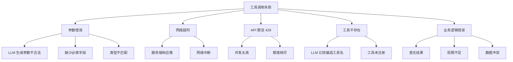
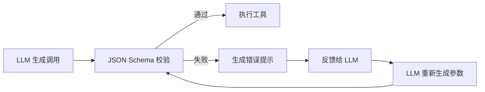
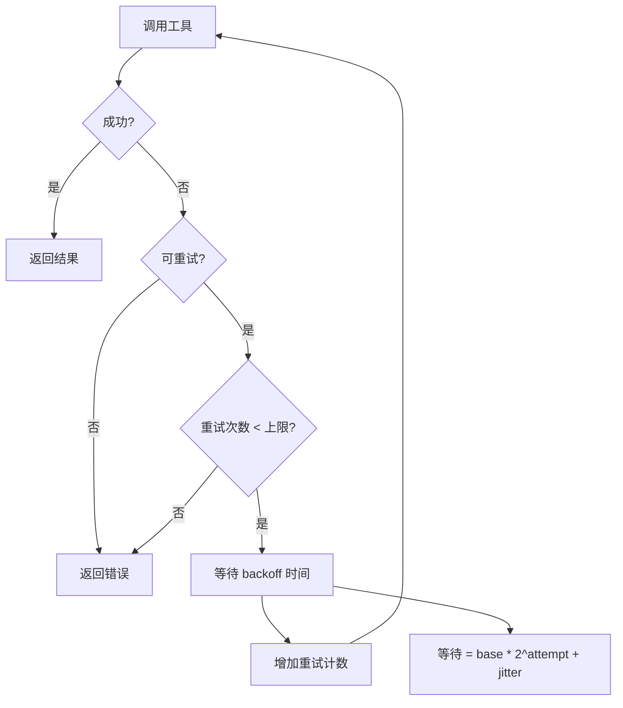
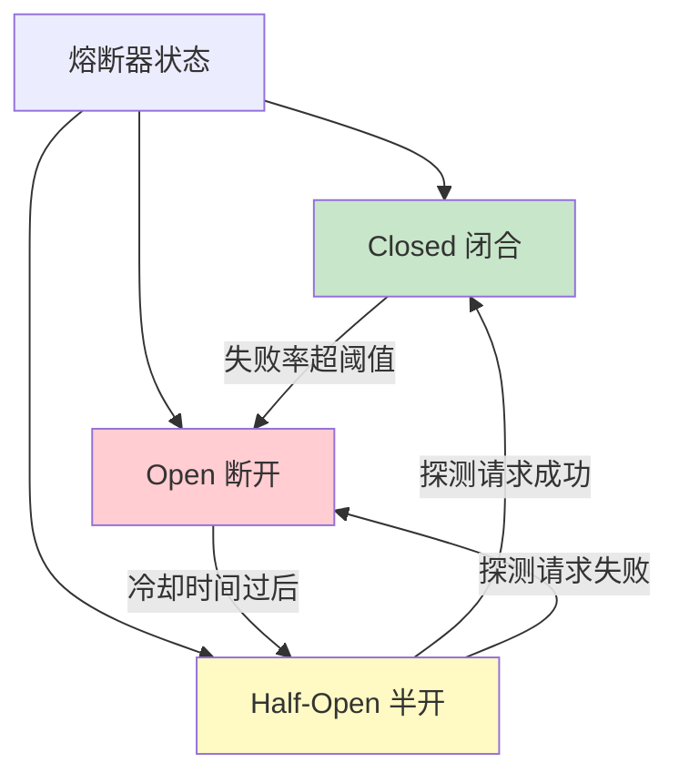
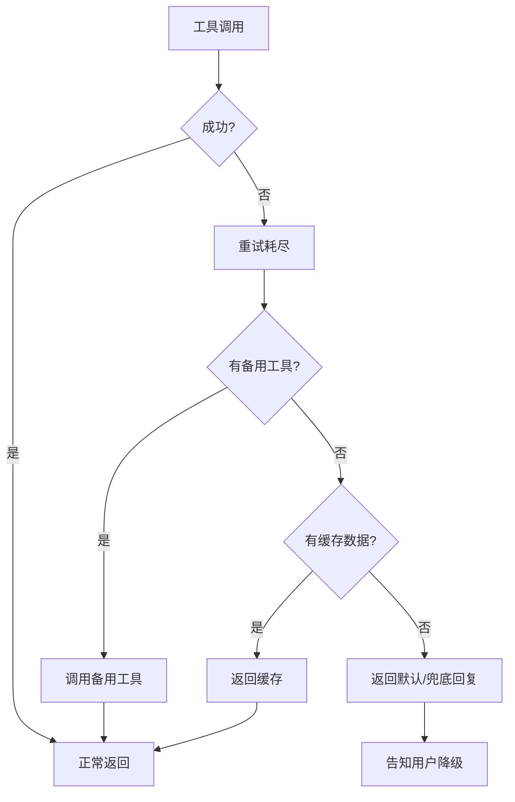
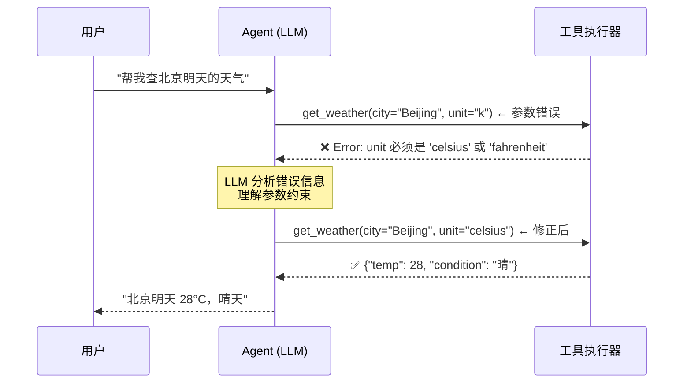
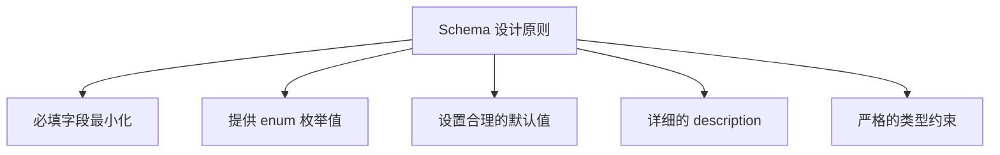
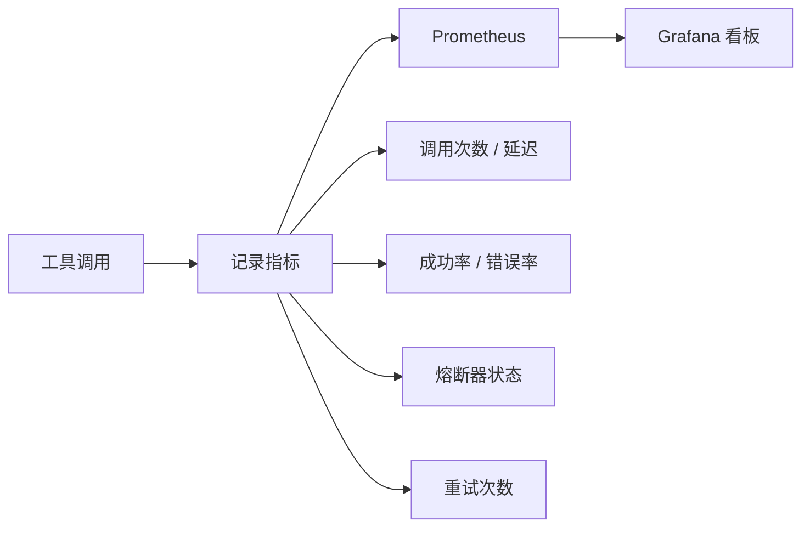
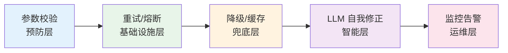

---
title: Agent 工具调用失败如何处理？
description: 从重试策略到降级方案再到超时熔断，系统掌握 Agent 工具调用的容错机制
date: 2026-06-05T10:00:00+08:00
lastmod: 2026-06-05T10:00:00+08:00
weight: 2
tags:
  - 面试
  - Agent
  - 工具调用
  - 容错
categories:
  - 面试题
  - 技术分享
math: true
mermaid: true
photos:
  - https://d-sketon.top/img/backwebp/bg2.webp
---

## 面试场景描述

> **面试官**：你设计的 AI Agent 需要调用外部工具（搜索、数据库查询、发邮件等）来完成用户任务。但在实际运行中，工具调用经常失败——有时是参数传错，有时是 API 超时，有时是第三方服务限流。请问，你会如何设计 Agent 的工具调用容错机制？让 LLM 知道调用失败后，它应该怎么做？

这道题考察的是 **AI 工程的健壮性设计**。Agent 不像普通 Chatbot 那样只做问答，它需要执行真实世界的操作，任何工具调用都可能失败。一个没有容错机制的 Agent，在生产环境中的可用性会非常低。

面试官想听到的是：你不仅理解 LLM 的能力边界，还能用工程手段弥补这些边界——让 Agent 像一个有经验的工程师一样，**遇到错误不崩溃，能重试、能降级、能自我修正**。

## 问题分析：工具调用的常见失败类型

在设计容错机制之前，先对失败类型做分类，因为不同类型的失败需要不同的处理策略。



| 失败类型 | 典型错误信息 | 发生频率 | 严重程度 | 可重试 |
|----------|-------------|----------|----------|--------|
| 参数错误 | `TypeError: missing required field` | 高 | 中 | 否（需修正参数） |
| 网络超时 | `TimeoutError` | 中 | 中 | 是 |
| API 限流 | `429 Too Many Requests` | 中 | 高 | 是（需退避） |
| 工具不存在 | `KeyError: unknown function` | 低 | 高 | 否（需选正确工具） |
| 业务逻辑错误 | `404 Not Found` / `403 Forbidden` | 中 | 低 | 视情况而定 |

**关键洞察**：参数错误和工具选择错误是 LLM 自身的问题，需要让 LLM "知道错误并修正"；而超时和限流是基础设施问题，需要工程手段（重试、熔断）来处理。

## 解决方案

### 方案一：参数校验与 Schema 验证

**预防胜于治疗**。在调用工具之前，先对 LLM 生成的参数做严格校验，不合法的参数根本不应该发往真实工具。



```python
import json
from jsonschema import validate, ValidationError
from typing import Any

# 定义工具的 JSON Schema
TOOL_SCHEMAS = {
    "search_web": {
        "type": "object",
        "properties": {
            "query": {"type": "string", "minLength": 1, "maxLength": 500},
            "num_results": {"type": "integer", "minimum": 1, "maximum": 20},
        },
        "required": ["query"],
        "additionalProperties": False,
    },
    "send_email": {
        "type": "object",
        "properties": {
            "to": {"type": "string", "format": "email"},
            "subject": {"type": "string", "maxLength": 200},
            "body": {"type": "string"},
        },
        "required": ["to", "subject", "body"],
        "additionalProperties": False,
    },
}


def validate_tool_args(tool_name: str, arguments: dict) -> tuple[bool, str]:
    """校验工具参数是否符合 Schema"""
    if tool_name not in TOOL_SCHEMAS:
        return False, f"工具 '{tool_name}' 不存在。可用工具: {list(TOOL_SCHEMAS.keys())}"
    try:
        validate(instance=arguments, schema=TOOL_SCHEMAS[tool_name])
        return True, "校验通过"
    except ValidationError as e:
        return False, f"参数校验失败: {e.message}。错误路径: {list(e.absolute_path)}"
```

### 方案二：指数退避重试（Exponential Backoff）

对于网络超时和 API 限流这类**瞬时故障**，重试是最有效的手段。但盲目重试会加重服务端负担，必须使用**指数退避 + 抖动**策略。



**指数退避的数学模型**：

$$t_n = \min(t_{\text{base}} \cdot 2^n + \text{jitter}, \ t_{\text{max}})$$

其中 $t_n$ 是第 $n$ 次重试前的等待时间，$t_{\text{base}}$ 是基础延迟，jitter 是随机抖动量（防止多个客户端同时重试导致"惊群效应"）。

```python
import asyncio
import random
from functools import wraps
from typing import Callable, Type, Tuple

def retry_with_backoff(
    max_retries: int = 3,
    base_delay: float = 1.0,
    max_delay: float = 60.0,
    retryable_exceptions: Tuple[Type[Exception], ...] = (TimeoutError, ConnectionError),
):
    """指数退避重试装饰器"""
    def decorator(func: Callable):
        @wraps(func)
        async def wrapper(*args, **kwargs):
            last_exception = None
            for attempt in range(max_retries + 1):
                try:
                    return await func(*args, **kwargs)
                except retryable_exceptions as e:
                    last_exception = e
                    if attempt == max_retries:
                        break
                    delay = min(base_delay * (2 ** attempt) + random.uniform(0, 1), max_delay)
                    print(f"  [重试] 第 {attempt+1} 次失败: {e}，{delay:.1f}s 后重试...")
                    await asyncio.sleep(delay)
            raise last_exception
        return wrapper
    return decorator


# 使用示例
@retry_with_backoff(max_retries=3, base_delay=1.0)
async def call_search_api(query: str) -> dict:
    """调用搜索 API，失败自动重试"""
    async with aiohttp.ClientSession() as session:
        async with session.post(
            "https://api.search.com/v1/search",
            json={"query": query},
            timeout=aiohttp.ClientTimeout(total=10),
        ) as resp:
            if resp.status == 429:
                raise ConnectionError("API 限流，需要退避重试")
            resp.raise_for_status()
            return await resp.json()
```

### 方案三：超时控制与熔断

长时间等待一个可能已经挂掉的服务没有意义。超时控制和熔断器模式能防止故障扩散。



```python
import time
from collections import deque
from dataclasses import dataclass, field

@dataclass
class CircuitBreaker:
    """简单的熔断器实现"""
    failure_threshold: int = 5          # 连续失败次数阈值
    recovery_timeout: float = 30.0      # 熔断后恢复等待时间（秒）
    half_open_max_calls: int = 3        # 半开状态最大探测请求数

    _state: str = "closed"              # closed / open / half_open
    _failure_count: int = 0
    _last_failure_time: float = 0.0
    _half_open_calls: int = 0

    @property
    def state(self) -> str:
        if self._state == "open":
            if time.time() - self._last_failure_time > self.recovery_timeout:
                self._state = "half_open"
                self._half_open_calls = 0
        return self._state

    def record_success(self):
        if self._state == "half_open":
            self._state = "closed"
        self._failure_count = 0

    def record_failure(self):
        self._failure_count += 1
        self._last_failure_time = time.time()
        if self._state == "half_open":
            self._state = "open"
        elif self._failure_count >= self.failure_threshold:
            self._state = "open"

    def can_execute(self) -> bool:
        state = self.state
        if state == "closed":
            return True
        if state == "half_open":
            if self._half_open_calls < self.half_open_max_calls:
                self._half_open_calls += 1
                return True
            return False
        return False  # open 状态拒绝调用
```

### 方案四：降级策略

当工具彻底不可用时，不应该让整个 Agent 任务失败，而应该有备选方案：



| 降级层级 | 策略 | 示例 |
|----------|------|------|
| 第一层 | 重试 | 网络抖动导致的超时 |
| 第二层 | 备用工具 | 主搜索 API 挂了，切换到备用搜索 |
| 第三层 | 缓存 | 返回最近一次成功调用的结果 |
| 第四层 | 默认回复 | "抱歉，该功能暂时不可用" |

```python
# 降级策略实现
class ToolExecutorWithFallback:
    """带降级策略的工具执行器"""

    def __init__(self):
        self.cache = {}          # 简单缓存
        self.breakers = {}       # 每个工具一个熔断器

    async def execute_with_fallback(
        self,
        tool_name: str,
        arguments: dict,
        primary_func: Callable,
        fallback_func: Callable = None,
        default_response: str = None,
    ) -> dict:
        """执行工具，失败时逐层降级"""
        breaker = self.breakers.setdefault(tool_name, CircuitBreaker())

        # 降级层级 0：熔断器打开时直接跳过
        if not breaker.can_execute():
            return await self._fallback(arguments, fallback_func, default_response)

        try:
            result = await primary_func(**arguments)
            breaker.record_success()
            cache_key = f"{tool_name}:{hash(str(arguments))}"
            self.cache[cache_key] = result
            return {"status": "success", "data": result}

        except Exception as e:
            breaker.record_failure()
            return await self._fallback(arguments, fallback_func, default_response, str(e))

    async def _fallback(self, arguments, fallback_func, default_response, error=None):
        """降级处理"""
        # 层级 2：备用工具
        if fallback_func:
            try:
                result = await fallback_func(**arguments)
                return {"status": "degraded", "data": result, "source": "fallback"}
            except Exception:
                pass

        # 层级 3：缓存
        cache_key = f"{hash(str(arguments))}"
        if cache_key in self.cache:
            return {"status": "degraded", "data": self.cache[cache_key], "source": "cache"}

        # 层级 4：默认回复
        return {"status": "failed", "data": default_response, "error": error}
```

### 方案五：错误反馈让 LLM 自我修正

这是 Agent 区别于普通程序的关键能力：**当工具调用失败时，将错误信息反馈给 LLM，让它分析原因并修正参数或选择其他工具**。



```python
# Agent 循环：包含错误反馈的自我修正
import json

MAX_CORRECTION_ROUNDS = 3  # 最大自我修正轮次

async def agent_loop_with_self_correction(
    llm,
    user_message: str,
    tools: list[dict],
    tool_executor: ToolExecutorWithFallback,
):
    """带自我修正能力的 Agent 循环"""

    messages = [
        {"role": "system", "content": "你是一个能调用工具的助手。如果工具返回错误，请分析错误原因并修正。"},
        {"role": "user", "content": user_message},
    ]

    for round_num in range(MAX_CORRECTION_ROUNDS + 5):
        # LLM 决策
        response = await llm.chat.completions.create(
            model="gpt-4o",
            messages=messages,
            tools=tools,
            tool_choice="auto",
        )
        msg = response.choices[0].message
        messages.append(msg)

        # 如果没有工具调用，说明 LLM 已完成回答
        if not msg.tool_calls:
            return msg.content

        # 执行所有工具调用
        for tool_call in msg.tool_calls:
            func_name = tool_call.function.name
            try:
                arguments = json.loads(tool_call.function.arguments)
            except json.JSONDecodeError as e:
                # JSON 解析失败，直接反馈
                messages.append({
                    "role": "tool",
                    "tool_call_id": tool_call.id,
                    "content": f"❌ JSON 参数解析失败: {e}。请确保返回合法的 JSON。",
                })
                continue

            # 参数校验
            is_valid, error_msg = validate_tool_args(func_name, arguments)
            if not is_valid:
                messages.append({
                    "role": "tool",
                    "tool_call_id": tool_call.id,
                    "content": f"❌ 参数校验失败: {error_msg}。请修正后重试。",
                })
                continue

            # 执行工具（带容错）
            result = await tool_executor.execute_with_fallback(
                func_name, arguments,
                primary_func=TOOL_REGISTRY[func_name],
            )

            # 将结果（含错误）反馈给 LLM
            if result["status"] == "success":
                feedback = f"✅ 执行成功: {json.dumps(result['data'], ensure_ascii=False)}"
            elif result["status"] == "degraded":
                feedback = f"⚠️ 降级执行: {json.dumps(result['data'], ensure_ascii=False)}"
            else:
                feedback = f"❌ 执行失败: {result.get('error', '未知错误')}。请尝试其他方法或修改参数。"

            messages.append({
                "role": "tool",
                "tool_call_id": tool_call.id,
                "content": feedback,
            })

    return "抱歉，经过多次尝试仍无法完成任务。"
```

## 完整容错框架代码

将上述方案整合为一个完整的工具调用容错框架：

```python
"""
Agent 工具调用容错框架
功能：Schema 校验 → 指数退避重试 → 超时熔断 → 降级策略 → LLM 自我修正
"""
import asyncio
import json
import random
import time
import aiohttp
from dataclasses import dataclass
from jsonschema import validate as jsonschema_validate, ValidationError as SchemaError
from typing import Callable, Any, Optional

# ============ 1. 熔断器 ============
@dataclass
class CircuitBreaker:
    failure_threshold: int = 5
    recovery_timeout: float = 30.0
    _state: str = "closed"
    _failures: int = 0
    _last_fail_time: float = 0.0

    def _check_state(self):
        if self._state == "open" and time.time() - self._last_fail_time > self.recovery_timeout:
            self._state, self._failures = "half_open", 0
        return self._state

    def allow(self) -> bool:
        return self._check_state() in ("closed", "half_open")

    def on_success(self):
        self._state, self._failures = "closed", 0

    def on_failure(self):
        self._failures += 1
        self._last_fail_time = time.time()
        if self._failures >= self.failure_threshold:
            self._state = "open"


# ============ 2. 带容错的工具执行器 ============
class RobustToolExecutor:
    def __init__(self):
        self.breakers: dict[str, CircuitBreaker] = {}
        self.cache: dict[str, Any] = {}

    async def call(
        self,
        name: str,
        args: dict,
        handler: Callable,
        schema: dict = None,
        max_retries: int = 3,
        timeout: float = 15.0,
        fallback: Callable = None,
    ) -> dict:
        # --- 参数校验 ---
        if schema:
            try:
                jsonschema_validate(args, schema)
            except SchemaError as e:
                return {"ok": False, "error": f"参数校验失败: {e.message}", "type": "schema"}

        breaker = self.breakers.setdefault(name, CircuitBreaker())

        # --- 熔断检查 ---
        if not breaker.allow():
            return {"ok": False, "error": "熔断器开启，工具暂不可用", "type": "circuit"}

        # --- 带重试的执行 ---
        for attempt in range(max_retries + 1):
            try:
                result = await asyncio.wait_for(handler(**args), timeout=timeout)
                breaker.on_success()
                self.cache[f"{name}:{args}"] = result
                return {"ok": True, "data": result}

            except asyncio.TimeoutError:
                breaker.on_failure()
                if attempt < max_retries:
                    delay = min(2 ** attempt + random.random(), 30)
                    await asyncio.sleep(delay)
                    continue
            except Exception as e:
                breaker.on_failure()
                if attempt < max_retries and not isinstance(e, (ValueError, KeyError)):
                    await asyncio.sleep(2 ** attempt)
                    continue

        # --- 降级：备用工具 ---
        if fallback:
            try:
                data = await fallback(**args)
                return {"ok": True, "data": data, "source": "fallback"}
            except Exception:
                pass

        # --- 降级：缓存 ---
        key = f"{name}:{args}"
        if key in self.cache:
            return {"ok": True, "data": self.cache[key], "source": "cache"}

        return {"ok": False, "error": "所有重试和降级策略均失败", "type": "exhausted"}


# ============ 3. 示例工具 ============
async def web_search(query: str, num: int = 5) -> list[dict]:
    """模拟搜索工具"""
    await asyncio.sleep(0.5)
    if "error" in query:  # 模拟错误
        raise ConnectionError("搜索服务超时")
    return [{"title": f"结果{i}", "snippet": f"关于 {query} 的内容..."} for i in range(num)]

async def web_search_fallback(query: str, num: int = 5) -> list[dict]:
    """备用搜索工具"""
    await asyncio.sleep(0.3)
    return [{"title": "备用结果", "snippet": f"来自备用源的 {query} 内容"}]


# ============ 4. 运行演示 ============
async def main():
    executor = RobustToolExecutor()

    search_schema = {
        "type": "object",
        "properties": {
            "query": {"type": "string", "minLength": 1},
            "num": {"type": "integer", "minimum": 1, "maximum": 20},
        },
        "required": ["query"],
    }

    # 正常调用
    result = await executor.call(
        "search", {"query": "Python 教程", "num": 3},
        handler=web_search, schema=search_schema, fallback=web_search_fallback,
    )
    print(f"正常调用: {result}")

    # 参数错误（会被 Schema 拦截）
    result = await executor.call(
        "search", {"query": ""},
        handler=web_search, schema=search_schema,
    )
    print(f"参数错误: {result}")

    # 模拟超时后降级到备用工具
    result = await executor.call(
        "search", {"query": "error", "num": 2},
        handler=web_search, schema=search_schema, fallback=web_search_fallback,
        max_retries=2,
    )
    print(f"降级调用: {result}")

asyncio.run(main())
```

## 追问延伸

### 追问一：如何设计工具的 JSON Schema？

好的 Schema 设计能大幅减少 LLM 的参数错误：



```json
{
  "name": "get_weather",
  "description": "查询指定城市的天气预报。支持未来 7 天的预报查询。",
  "parameters": {
    "type": "object",
    "properties": {
      "city": {
        "type": "string",
        "description": "城市名称，支持中文和英文，如 '北京' 或 'Beijing'"
      },
      "days": {
        "type": "integer",
        "description": "查询未来几天的天气，1-7",
        "minimum": 1,
        "maximum": 7,
        "default": 1
      },
      "unit": {
        "type": "string",
        "enum": ["celsius", "fahrenheit"],
        "description": "温度单位",
        "default": "celsius"
      }
    },
    "required": ["city"]
  }
}
```

> **关键原则**：description 要写清楚，LLM 是靠读 description 来理解参数含义的。枚举值优于自由字符串，有默认值的参数不要设为 required。

### 追问二：LLM 选错工具怎么办？

LLM 可能幻觉出一个不存在的工具名，或者在不需要调用工具时强行调用：

1. **工具列表约束**：在 tool_choice 中只提供与当前任务相关的工具子集，减少干扰
2. **工具描述优化**：在 description 中明确说明"什么时候该用"和"什么时候不该用"
3. **Few-shot 示例**：在 system prompt 中给出正确选择工具的示例
4. **路由层（Router）**：在 Agent 循环外层加一个轻量级分类器，先判断用户意图属于哪个工具域，再传给 LLM 对应的工具集
5. **幻觉兜底**：当 LLM 调用了不存在的工具时，返回错误信息中附带可用工具列表，引导它重新选择

### 追问三：如何监控工具调用的健康状况？

生产环境必须有可观测性：



核心监控指标：
- **工具调用成功率**：按工具维度统计，低于 95% 的工具需要排查
- **P99 延迟**：反映用户体验，超过阈值的工具考虑加超时
- **熔断器触发次数**：频繁触发说明下游服务不稳定
- **重试率**：高重试率意味着基础设施不稳定或参数设计有问题
- **降级触发率**：降级频繁说明需要优化主链路或增加容量

## 小结

Agent 工具调用的容错设计，本质上是**把传统分布式系统的容错模式（重试、熔断、降级）与 LLM 特有的自我修正能力相结合**：



面试中回答这道题，建议强调"**分层防御**"的思想——每一层处理各自擅长的错误类型，而不是指望某一层解决所有问题。同时，LLM 的自我修正是 Agent 区别于传统微服务调用的最大亮点，值得重点阐述。
