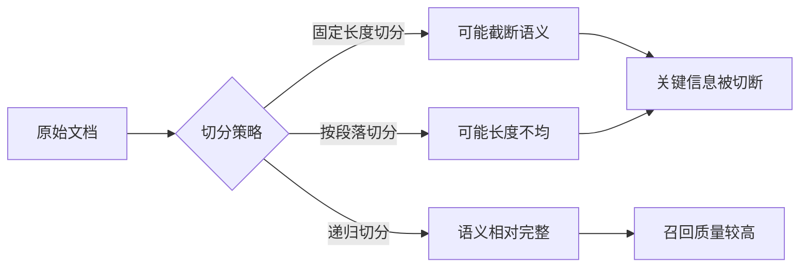
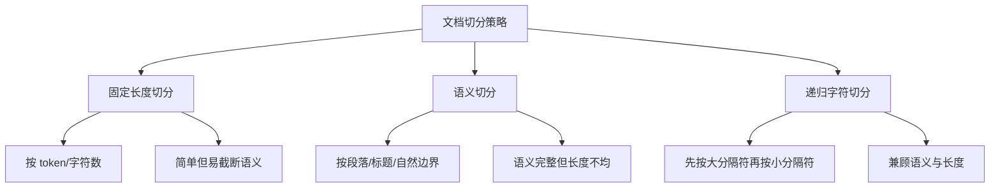
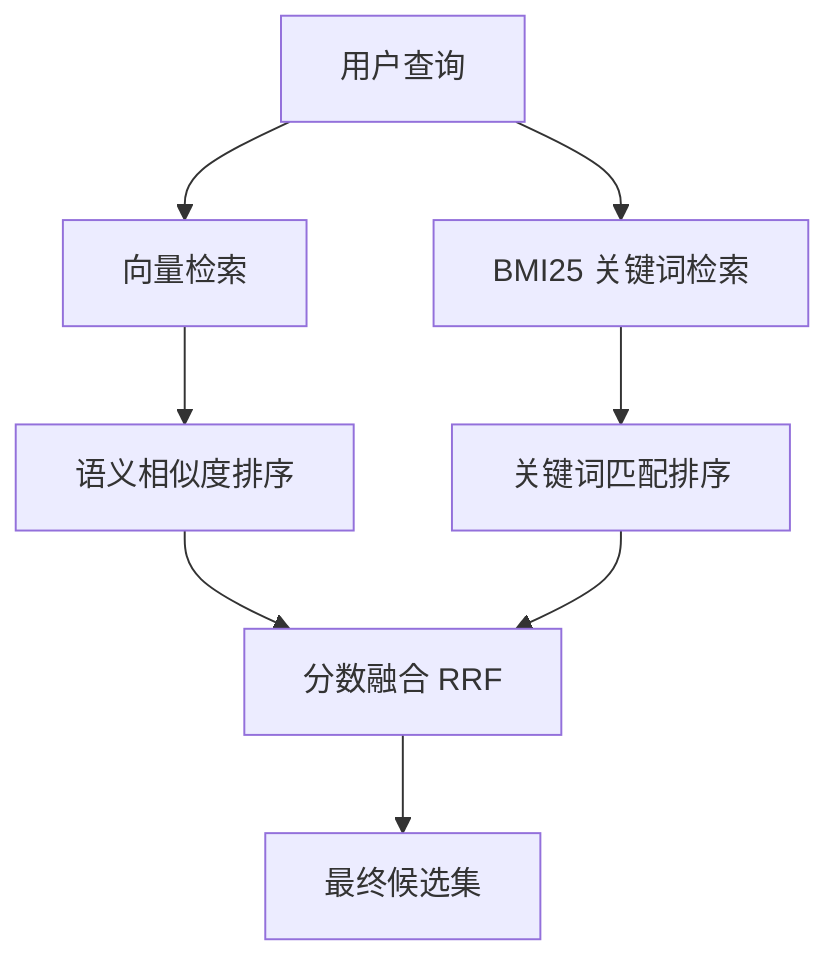
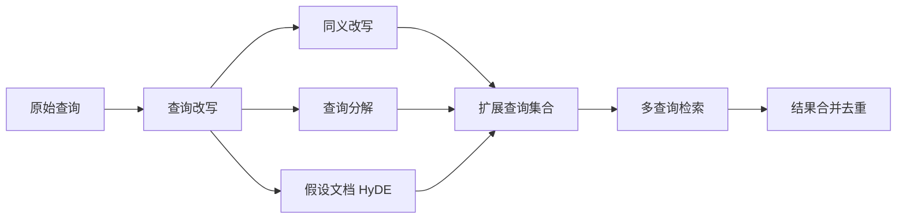
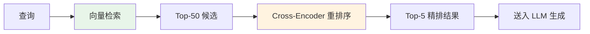
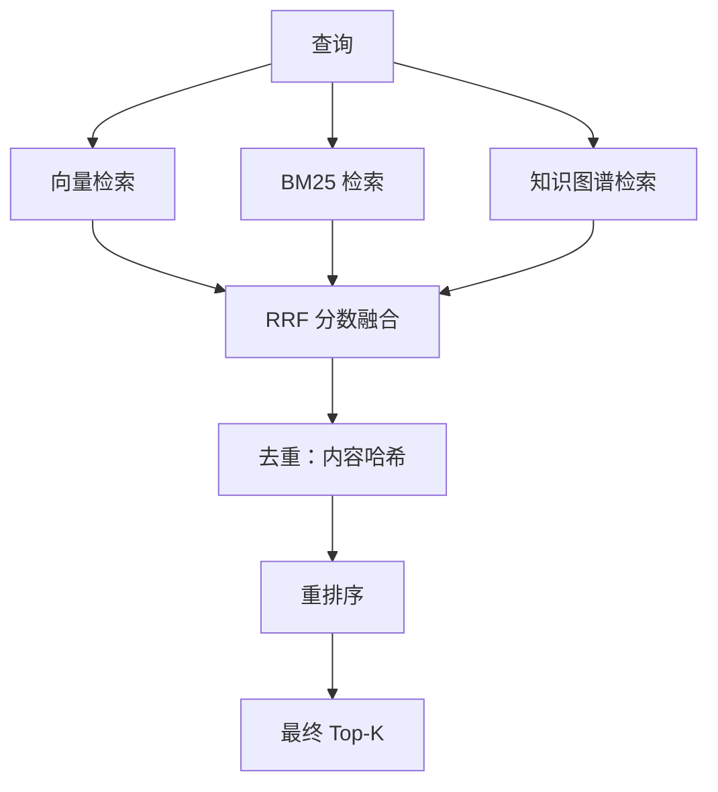
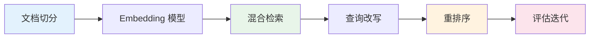

## 面试场景描述

> **面试官**：你做的 RAG 项目中，用户反馈"答非所问"的情况比较多。你排查后发现大模型生成质量没问题，问题出在检索阶段——相关的知识根本没被召回。请问，RAG 召回率低通常有哪些原因？你会从哪些维度去优化？

这是一道 RAG 方向的高频面试题，考察的不是某个孤立知识点，而是你对 **检索增强生成全链路** 的系统理解。一个优秀的回答应该从数据预处理、Embedding、检索策略、查询优化、重排序等多个环节展开，体现出工程实战经验。

召回率（Recall）是 RAG 系统的生命线。如果正确的知识片段没有被检索出来，再强的生成模型也只能"巧妇难为无米之炊"。根据业界统计，**超过 70% 的 RAG 质量问题根源在检索阶段**，而非生成阶段。

## 问题分析：召回率低的 5 大常见原因

在做优化之前，首先要能准确定位问题。以下是 RAG 召回率低最常见的 5 个原因：

### 原因一：文档切分不合理



最典型的问题：固定字符长度切分时，一个完整的概念被硬生生切成两半。比如一段描述"药物 A 的副作用包括恶心、头痛……"在"包括"后面被截断，检索时无论查询什么，这个片段都难以被准确命中。

### 原因二：Embedding 模型与领域不匹配

通用 Embedding 模型（如 `text-embedding-ada-002`）在开放域表现不错，但在垂直领域（医疗、法律、金融代码）往往力不从心。一个法律文本中"诉状"和"起诉书"的语义距离，通用模型可能无法准确捕捉。

### 原因三：纯向量检索的语义鸿沟

向量检索擅长语义匹配（"怎么退款" → "退换货政策"），但对**精确关键词**（产品型号、人名、编号）反而不如传统关键词检索。如果你的用户经常搜索具体实体名称，纯向量检索的召回率会明显不足。

### 原因四：查询表达与文档表达存在差异

用户提问的语言风格和知识库文档的写作风格往往差异很大。用户问"社保断缴了怎么办"，文档里写的是"养老保险缴费中断后的补缴流程"，虽然语义相同，但向量相似度可能不够高。

### 原因五：Top-K 过小或未做重排序

只取 Top-5 且不做重排序时，向量检索返回的候选集中，语义相近但实际无关的片段会挤掉真正有用的片段。

| 原因 | 典型表现 | 影响程度 |
|------|----------|----------|
| 文档切分不合理 | 关键信息被截断、上下文丢失 | ★★★★★ |
| Embedding 不匹配 | 专业术语无法正确匹配 | ★★★★☆ |
| 纯向量检索局限 | 精确关键词搜不到 | ★★★★☆ |
| 查询-文档表达差异 | 语义相同但相似度低 | ★★★☆☆ |
| Top-K 小/无重排序 | 相关片段被挤出候选集 | ★★★☆☆ |

## 优化方案

### 方案一：文档切分策略优化

文档切分是 RAG 的第一道工序，直接影响后续所有环节的质量。常见的切分策略有三种：



**1. 固定长度切分（Fixed-Size Chunking）**

最简单的策略，按固定 token 数切分，配合一定重叠（Overlap）：

```python
from langchain.text_splitter import RecursiveCharacterTextSplitter

# 推荐配置：chunk_size 500-1000，overlap 为 chunk_size 的 10%-20%
text_splitter = RecursiveCharacterTextSplitter(
    chunk_size=800,
    chunk_overlap=150,
    separators=["\n\n", "\n", "。", "！", "？", "；", " ", ""],
    length_function=len,
)
chunks = text_splitter.split_text(document_text)
```

**2. 语义切分（Semantic Chunking）**

根据句子之间的语义相似度动态决定切分点，语义变化大的位置就是自然边界：

```python
from langchain_experimental.text_splitter import SemanticChunker
from langchain_openai import OpenAIEmbeddings

semantic_splitter = SemanticChunker(
    OpenAIEmbeddings(),
    breakpoint_threshold_type="percentile",  # 按百分位设阈值
    breakpoint_threshold_amount=95,           # 相似度差异前 5% 作为断点
)
chunks = semantic_splitter.split_text(document_text)
```

**3. 结构化切分（针对 Markdown / HTML）**

利用文档自身结构（标题层级）进行切分，保留上下文层级信息：

```python
from langchain.text_splitter import MarkdownHeaderTextSplitter

headers_to_split_on = [
    ("#", "Header 1"),
    ("##", "Header 2"),
    ("###", "Header 3"),
]
md_splitter = MarkdownHeaderTextSplitter(headers_to_split_on)
md_chunks = md_splitter.split_text(markdown_text)
# 每个 chunk 自带 metadata: {"Header 1": "...", "Header 2": "..."}
```

> **实战建议**：对于中文文档，推荐 chunk_size 在 500-800 字符，overlap 设为 100-200。对于技术文档，优先使用 Markdown 结构化切分；对于长文叙述类内容，使用递归字符切分。

### 方案二：Embedding 模型选择

选择合适的 Embedding 模型是提升召回率的关键杠杆。以下是主流模型对比：

| 模型 | 维度 | 中文支持 | 部署方式 | 适用场景 |
|------|------|----------|----------|----------|
| `text-embedding-3-large` | 3072 | 良好 | API | 通用英文/中文 |
| `bge-large-zh-v1.5` | 1024 | 优秀 | 本地 | 中文垂直领域 |
| `bge-m3` | 1024 | 优秀 | 本地 | 多语言/长文本 |
| `gte-large-zh` | 1024 | 优秀 | 本地 | 中文通用 |
| `jina-embeddings-v3` | 1024 | 良好 | API | 多语言 |

```python
# 使用 BGE 中文模型（推荐本地部署场景）
from FlagEmbedding import FlagModel

model = FlagModel('BAAI/bge-large-zh-v1.5',
                  query_instruction_for_retrieval="为这个句子生成表示用于检索相关文章：")
embeddings = model.encode_queries(["社保断缴怎么办"])
```

> **技巧**：对垂直领域，可以用领域数据微调 Embedding 模型（如对比学习），效果提升显著。

### 方案三：混合检索（向量 + 关键词 BM25）

这是解决纯向量检索局限最有效的方法。将**向量检索（语义匹配）** 与 **关键词检索（精确匹配）** 结合，取长补短。



**BM25 关键词检索的核心公式**：

$$\text{BM25}(D, Q) = \sum_{i=1}^{n} \text{IDF}(q_i) \cdot \frac{f(q_i, D) \cdot (k_1 + 1)}{f(q_i, D) + k_1 \cdot \left(1 - b + b \cdot \frac{|D|}{\text{avgdl}}\right)}$$

其中 $f(q_i, D)$ 是词 $q_i$ 在文档 $D$ 中的词频，$|D|$ 是文档长度，$\text{avgdl}$ 是平均文档长度，$k_1$ 和 $b$ 是调节参数。

**分数融合使用 RRF（Reciprocal Rank Fusion）算法**：

$$\text{RRF}(d) = \sum_{r \in R} \frac{1}{k + r(d)}$$

其中 $r(d)$ 是文档 $d$ 在某一路检索结果中的排名，$k$ 通常取 60。

```python
from langchain.retrievers import BM25Retriever, EnsembleRetriever
from langchain.vectorstores import FAISS
from langchain_openai import OpenAIEmbeddings

# 1. 向量检索
vector_store = FAISS.from_documents(documents, OpenAIEmbeddings())
vector_retriever = vector_store.as_retriever(search_kwargs={"k": 20})

# 2. BM25 关键词检索
bm25_retriever = BM25Retriever.from_documents(documents)
bm25_retriever.k = 20

# 3. 混合检索（ensemble）
ensemble_retriever = EnsembleRetriever(
    retrievers=[vector_retriever, bm25_retriever],
    weights=[0.5, 0.5],  # 可根据场景调整权重
)

# 检索
results = ensemble_retriever.get_relevant_documents("社保断缴怎么补缴")
```

### 方案四：查询改写（Query Rewrite / Expansion）

用户原始查询往往简短模糊，直接检索效果不佳。通过 LLM 对查询进行改写和扩展，能显著提升召回率。



**HyDE（Hypothetical Document Embeddings）** 是一种巧妙的技巧：先让 LLM 基于查询生成一个"假设性答案文档"，再用这个文档去检索——因为"答案"和"文档"的语言风格更接近，相似度更高。

```python
from langchain.retrievers import ContextualCompressionRetriever, LLMChainExtractor

# 查询改写：将用户简短问题扩展为多个相关查询
def rewrite_query(llm, original_query):
    prompt = f"""请将以下搜索查询改写为 3 个不同角度的同义查询，用于提升检索召回率。

原始查询：{original_query}

输出格式（每行一个）：
1. ...
2. ...
3. ...
"""
    response = llm.invoke(prompt)
    queries = [original_query]  # 保留原始查询
    for line in response.content.strip().split("\n"):
        if line.strip() and line[0].isdigit():
            queries.append(line.split(".", 1)[1].strip())
    return queries

# HyDE：生成假设文档用于检索
from langchain.retrievers import HypotheticalDocumentRetriever

hyde_retriever = HypotheticalDocumentRetriever.from_llm(
    llm=llm,
    base_retriever=ensemble_retriever,
    custom_retriever_prompt=None,  # 使用默认 HyDE prompt
)
```

### 方案五：重排序（Cross-Encoder Rerank）

向量检索（Bi-Encoder）速度快但精度有限，重排序模型（Cross-Encoder）精度高但速度慢。两者结合：先用向量检索快速召回 Top-50，再用 Cross-Encoder 精排到 Top-5。



| 模型类型 | 架构 | 速度 | 精度 | 用途 |
|----------|------|------|------|------|
| Bi-Encoder | 查询和文档独立编码 | 快 | 中 | 初筛召回 |
| Cross-Encoder | 查询和文档拼接编码 | 慢 | 高 | 重排序精排 |

```python
from langchain.retrievers import ContextualCompressionRetriever
from langchain_cohere import CohereRerank

# 使用 Cohere Rerank（也可用 bge-reranker 本地部署）
compressor = CohereRerank(top_n=5, model="rerank-multilingual-v3.0")

compression_retriever = ContextualCompressionRetriever(
    base_compressor=compressor,
    base_retriever=ensemble_retriever,  # 在混合检索基础上重排
)

# 最终检索链路：混合检索召回 50 → 重排序取 5
final_results = compression_retriever.get_relevant_documents("查询内容")
```

**本地部署 bge-reranker（推荐生产环境）**：

```python
from FlagEmbedding import FlagReranker

reranker = FlagReranker('BAAI/bge-reranker-v2-m3', use_fp16=True)
scores = reranker.compute_score([
    ['查询文本', '候选文档1'],
    ['查询文本', '候选文档2'],
])
```

## 完整优化方案：端到端代码示例

将以上方案整合为一个完整的优化检索链路：

```python
"""
RAG 召回率优化：完整混合检索 + 重排序方案
依赖：pip install langchain langchain-openai faiss-cpu rank-bm25 FlagEmbedding
"""
from langchain_openai import OpenAIEmbeddings, ChatOpenAI
from langchain.vectorstores import FAISS
from langchain.retrievers import BM25Retriever, EnsembleRetriever
from langchain.text_splitter import RecursiveCharacterTextSplitter
from langchain.schema import Document
from FlagEmbedding import FlagReranker


class OptimizedRAGRetriever:
    """优化的 RAG 检索器：切分 → 混合检索 → 重排序"""

    def __init__(self, documents: list[str]):
        self.llm = ChatOpenAI(model="gpt-4o", temperature=0)
        self.embeddings = OpenAIEmbeddings(model="text-embedding-3-large")
        self.reranker = FlagReranker('BAAI/bge-reranker-v2-m3', use_fp16=True)

        # Step 1: 递归切分（带重叠）
        splitter = RecursiveCharacterTextSplitter(
            chunk_size=600,
            chunk_overlap=120,
            separators=["\n\n", "\n", "。", "！", "？", "；", " ", ""],
        )
        self.chunks = [
            Document(page_content=text, metadata={"source": f"doc_{i}"})
            for i, text in enumerate(splitter.split_text("\n\n".join(documents)))
        ]

        # Step 2: 构建向量库 + BM25 索引
        self.vector_store = FAISS.from_documents(self.chunks, self.embeddings)
        self.bm25_retriever = BM25Retriever.from_documents(self.chunks)
        self.bm25_retriever.k = 30

    def query_rewrite(self, question: str) -> list[str]:
        """查询改写：生成多个变体查询"""
        prompt = f"""将以下查询改写为3个语义相同但表达不同的变体，每行一个，不要编号。
查询：{question}"""
        response = self.llm.invoke(prompt).content
        queries = [question] + [q.strip() for q in response.strip().split("\n") if q.strip()]
        return queries[:4]  # 最多 4 个查询

    def hybrid_retrieve(self, query: str, top_k: int = 30) -> list[Document]:
        """混合检索：向量 + BM25"""
        vector_retriever = self.vector_store.as_retriever(
            search_kwargs={"k": top_k}
        )
        ensemble = EnsembleRetriever(
            retrievers=[vector_retriever, self.bm25_retriever],
            weights=[0.6, 0.4],
        )
        return ensemble.get_relevant_documents(query)

    def rerank(self, query: str, candidates: list[Document], top_n: int = 5) -> list[Document]:
        """Cross-Encoder 重排序"""
        pairs = [[query, doc.page_content] for doc in candidates]
        scores = self.reranker.compute_score(pairs)
        if isinstance(scores, float):
            scores = [scores]
        ranked = sorted(zip(candidates, scores), key=lambda x: x[1], reverse=True)
        return [doc for doc, _ in ranked[:top_n]]

    def retrieve(self, question: str, top_n: int = 5) -> list[Document]:
        """完整检索链路：改写 → 混合检索 → 去重 → 重排序"""
        # 1. 查询改写
        queries = self.query_rewrite(question)

        # 2. 多查询混合检索
        all_candidates = []
        seen = set()
        for q in queries:
            for doc in self.hybrid_retrieve(q):
                content_hash = hash(doc.page_content[:100])
                if content_hash not in seen:
                    seen.add(content_hash)
                    all_candidates.append(doc)

        # 3. 重排序取 Top-N
        return self.rerank(question, all_candidates, top_n)


# 使用示例
if __name__ == "__main__":
    docs = ["...你的知识库文档..."]
    retriever = OptimizedRAGRetriever(docs)
    results = retriever.retrieve("社保断缴了怎么补缴？")
    for r in results:
        print(r.page_content[:80], r.metadata)
```

## 效果评估方法

优化之后，必须有量化手段验证效果是否提升。RAG 检索评估的核心指标：

| 指标 | 公式 | 含义 |
|------|------|------|
| **Recall@K** | $\frac{\text{命中的相关文档数}}{\text{总相关文档数}}$ | Top-K 中召回了多少比例的相关文档 |
| **Precision@K** | $\frac{\text{命中的相关文档数}}{K}$ | Top-K 中有多少是相关的 |
| **MRR** | $\frac{1}{\|Q\|}\sum \frac{1}{\text{rank}_i}$ | 第一个相关文档的排名倒数 |
| **NDCG@K** | $\frac{\text{DCG}}{\text{IDCG}}$ | 考虑排序位置的归一化指标 |
| **Hit Rate** | $\frac{\text{有命中的查询数}}{\text{总查询数}}$ | 至少召回一个相关文档的查询比例 |

```python
# 使用 RAGAS 框架评估检索质量
from ragas import evaluate
from ragas.metrics import context_recall, context_precision
from datasets import Dataset

eval_data = Dataset.from_dict({
    "question": ["社保断缴怎么办？", ...],
    "ground_truth": ["需要补缴...", ...],
    "contexts": [["检索到的文档1", "检索到的文档2"], ...],
})

results = evaluate(eval_data, metrics=[context_recall, context_precision])
print(f"Context Recall: {results['context_recall']:.4f}")
print(f"Context Precision: {results['context_precision']:.4f}")
```

> **优化前后对比经验**：在一个企业知识库项目中，从"固定切分 + 纯向量检索"升级到"递归切分 + 混合检索 + Rerank"后，Recall@5 从 0.62 提升到 0.89，端到端准确率从 68% 提升到 85%。

## 追问延伸

### 追问一：如果召回率高但精度低怎么办？

召回率高说明相关文档都在候选集中，但排在前面的不一定是真正有用的。这种情况的优化方向：

1. **加强重排序**：使用更强的 Cross-Encoder 模型，或引入 LLM-as-a-Judge 进行精排
2. **减少 Top-K**：从 Top-10 减到 Top-3，只给 LLM 最相关的上下文
3. **上下文过滤**：用 LLM 对召回文档做二次过滤，剔除无关内容
4. **调整混合权重**：降低 BM25 权重（如果噪声来自关键词误匹配），或提高向量权重

### 追问二：多路召回如何合并去重？

多路召回（向量、BM25、知识图谱等）的合并策略：



- **RRF（倒数排名融合）**：最常用，不依赖原始分数，只看排名，鲁棒性强
- **加权分数融合**：需要先将不同检索器的分数归一化（Min-Max 或 Z-Score），再按权重加权
- **去重策略**：按内容前 N 个字符的哈希去重，或按相似度阈值（如余弦相似度 > 0.95 视为重复）

### 追问三：长文档（如整本书）如何处理？

- **层级检索（Parent-Document）**：先检索小片段（精准定位），再扩展到其所在的大片段（提供完整上下文）
- **摘要索引**：对每个章节生成摘要，先检索摘要定位章节，再在章节内细检索
- **多级切分**：同时构建不同粒度的 chunk（200/500/1000），根据查询类型选择粒度

## 小结

RAG 召回率优化是一个系统工程，没有银弹。核心思路是**沿检索链路逐环节排查**：



面试中回答这道题，建议按"**定位问题 → 分层优化 → 量化评估**"的逻辑展开，展示出系统思维和工程经验。记住：最好的优化策略永远是**基于数据驱动的迭代**，而非盲目堆叠技术。
