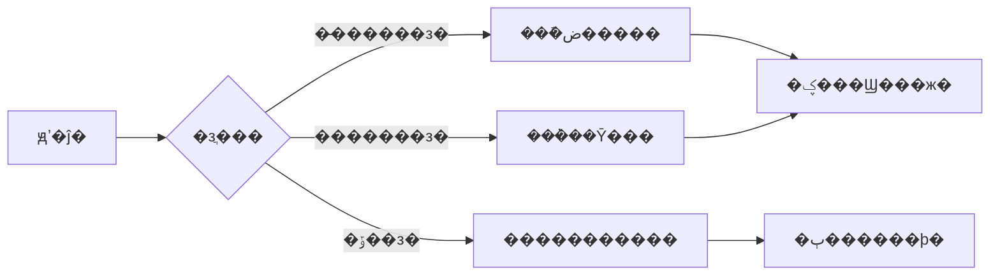
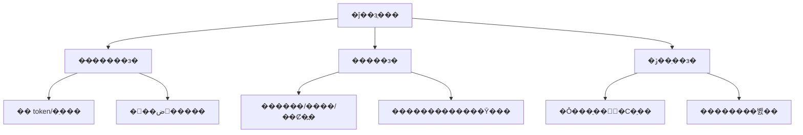
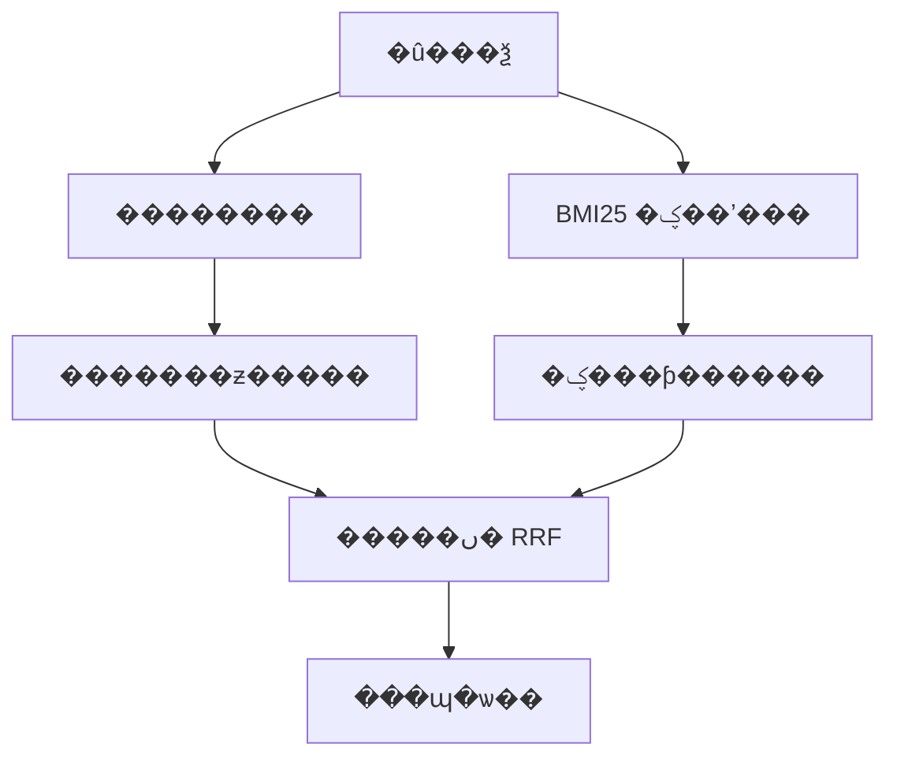
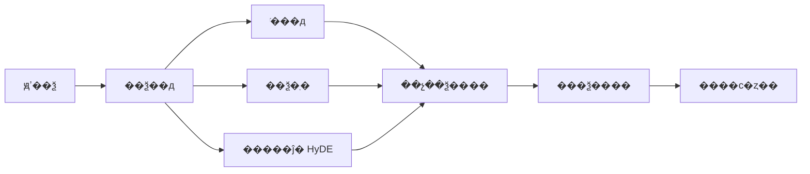
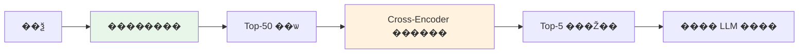
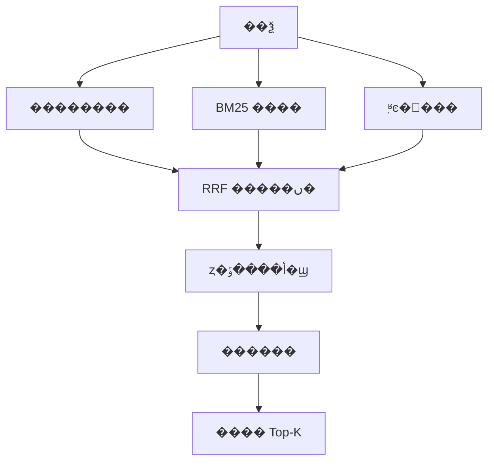
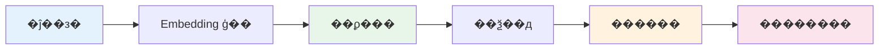

???---
title: RAG �ٻ��ʵ���ô�Ż���
description: ���ĵ��зֵ���ϼ����ٵ�������ϵͳ���� RAG �ٻ����Ż�����������
date: 2023-07-10T05:26:05+08:00
lastmod: 2023-07-10T05:26:05+08:00
weight: 1
tags:
  - ����
  - RAG
  - �ٻ���
  - �����Ż�
categories:
  - ������
  - ��������
math: true
mermaid: true
photos:
  - https://d-sketon.top/img/backwebp/bg1.webp
---

## ���Գ�������

> **���Թ�**�������� RAG ��Ŀ�У��û�����"�������"������Ƚ϶ࡣ���Ų���ִ�ģ����������û���⣬������ڼ����׶Ρ�����ص�֪ʶ����û���ٻء����ʣ�RAG �ٻ��ʵ�ͨ������Щԭ��������Щά��ȥ�Ż���

����һ�� RAG ����ĸ�Ƶ�����⣬����IJ���ij������֪ʶ�㣬������� **������ǿ����ȫ��·** ��ϵͳ��⡣һ������Ļش�Ӧ�ô�����Ԥ�����Embedding���������ԡ���ѯ�Ż���������ȶ������չ�������ֳ�����ʵս���顣

�ٻ��ʣ�Recall���� RAG ϵͳ�������ߡ������ȷ��֪ʶƬ��û�б�������������ǿ������ģ��Ҳֻ��"�ɸ���Ϊ����֮��"������ҵ��ͳ�ƣ�**���� 70% �� RAG ���������Դ�ڼ����׶�**���������ɽ׶Ρ�

## ����������ٻ��ʵ͵� 5 �󳣼�ԭ��

�����Ż�֮ǰ������Ҫ��׼ȷ��λ���⡣������ RAG �ٻ��ʵ������ 5 ��ԭ��

### ԭ��һ���ĵ��зֲ�����



����͵����⣺�̶��ַ������з�ʱ��һ�������ĸ��Ӳ�����г����롣����һ������"ҩ�� A �ĸ����ð������ġ�ͷʹ����"��"����"���汻�ضϣ�����ʱ���۲�ѯʲô�����Ƭ�ζ����Ա�׼ȷ���С�

### ԭ�����Embedding ģ��������ƥ��

ͨ�� Embedding ģ�ͣ��� `text-embedding-ada-002`���ڿ�������ֲ�������ڴ�ֱ����ҽ�ơ����ɡ����ڴ��룩�����������ġ�һ�������ı���"��״"��"������"��������룬ͨ��ģ�Ϳ����޷�׼ȷ��׽��

### ԭ����������������������蹵

���������ó�����ƥ�䣨"��ô�˿�" �� "�˻�������"��������**��ȷ�ؼ���**����Ʒ�ͺš���������ţ��������紫ͳ�ؼ��ʼ������������û�������������ʵ�����ƣ��������������ٻ��ʻ����Բ��㡣

### ԭ���ģ���ѯ������ĵ������ڲ���

�û����ʵ����Է���֪ʶ���ĵ���д�������������ܴ��û���"�籣�Ͻ�����ô��"���ĵ���д����"���ϱ��սɷ��жϺ�IJ�������"����Ȼ������ͬ�����������ƶȿ��ܲ����ߡ�

### ԭ���壺Top-K ��С��δ��������

ֻȡ Top-5 �Ҳ���������ʱ�������������صĺ�ѡ���У����������ʵ���޹ص�Ƭ�λἷ���������õ�Ƭ�Ρ�

| ԭ�� | ���ͱ��� | Ӱ��̶� |
|------|----------|----------|
| �ĵ��зֲ����� | �ؼ���Ϣ���ضϡ������Ķ�ʧ | ������ |
| Embedding ��ƥ�� | רҵ�����޷���ȷƥ�� | ������ |
| �������������� | ��ȷ�ؼ����Ѳ��� | ������ |
| ��ѯ-�ĵ������� | ������ͬ�����ƶȵ� | ������ |
| Top-K С/�������� | ���Ƭ�α�������ѡ�� | ������ |

## �Ż�����

### ����һ���ĵ��зֲ����Ż�

�ĵ��з��� RAG �ĵ�һ������ֱ��Ӱ��������л��ڵ��������������зֲ��������֣�



**1. �̶������з֣�Fixed-Size Chunking��**

��򵥵IJ��ԣ����̶� token ���з֣����һ���ص���Overlap����

```python
from langchain.text_splitter import RecursiveCharacterTextSplitter

# �Ƽ����ã�chunk_size 500-1000��overlap Ϊ chunk_size �� 10%-20%
text_splitter = RecursiveCharacterTextSplitter(
    chunk_size=800,
    chunk_overlap=150,
    separators=["\n\n", "\n", "��", "��", "��", "��", " ", ""],
    length_function=len,
)
chunks = text_splitter.split_text(document_text)
```

**2. �����з֣�Semantic Chunking��**

���ݾ���֮����������ƶȶ�̬�����зֵ㣬����仯���λ�þ�����Ȼ�߽磺

```python
from langchain_experimental.text_splitter import SemanticChunker
from langchain_openai import OpenAIEmbeddings

semantic_splitter = SemanticChunker(
    OpenAIEmbeddings(),
    breakpoint_threshold_type="percentile",  # ���ٷ�λ����ֵ
    breakpoint_threshold_amount=95,           # ���ƶȲ���ǰ 5% ��Ϊ�ϵ�
)
chunks = semantic_splitter.split_text(document_text)
```

**3. �ṹ���з֣���� Markdown / HTML��**

�����ĵ�����ṹ������㼶�������з֣����������IJ㼶��Ϣ��

```python
from langchain.text_splitter import MarkdownHeaderTextSplitter

headers_to_split_on = [
    ("#", "Header 1"),
    ("##", "Header 2"),
    ("###", "Header 3"),
]
md_splitter = MarkdownHeaderTextSplitter(headers_to_split_on)
md_chunks = md_splitter.split_text(markdown_text)
# ÿ�� chunk �Դ� metadata: {"Header 1": "...", "Header 2": "..."}
```

> **ʵս����**�����������ĵ����Ƽ� chunk_size �� 500-800 �ַ���overlap ��Ϊ 100-200�����ڼ����ĵ�������ʹ�� Markdown �ṹ���з֣����ڳ������������ݣ�ʹ�õݹ��ַ��з֡�

### ��������Embedding ģ��ѡ��

ѡ����ʵ� Embedding ģ���������ٻ��ʵĹؼ��ܸˡ�����������ģ�ͶԱȣ�

| ģ�� | ά�� | ����֧�� | ����ʽ | ���ó��� |
|------|------|----------|----------|----------|
| `text-embedding-3-large` | 3072 | ���� | API | ͨ��Ӣ��/���� |
| `bge-large-zh-v1.5` | 1024 | ���� | ���� | ���Ĵ�ֱ���� |
| `bge-m3` | 1024 | ���� | ���� | ������/���ı� |
| `gte-large-zh` | 1024 | ���� | ���� | ����ͨ�� |
| `jina-embeddings-v3` | 1024 | ���� | API | ������ |

```python
# ʹ�� BGE ����ģ�ͣ��Ƽ����ز��𳡾���
from FlagEmbedding import FlagModel

model = FlagModel('BAAI/bge-large-zh-v1.5',
                  query_instruction_for_retrieval="Ϊ����������ɱ�ʾ���ڼ���������£�")
embeddings = model.encode_queries(["�籣�Ͻ���ô��"])
```

> **����**���Դ�ֱ���򣬿�������������΢�� Embedding ģ�ͣ���Ա�ѧϰ����Ч������������

### ����������ϼ��������� + �ؼ��� BM25��

���ǽ��������������������Ч�ķ�������**��������������ƥ�䣩** �� **�ؼ��ʼ�������ȷƥ�䣩** ��ϣ�ȡ�����̡�



**BM25 �ؼ��ʼ����ĺ��Ĺ�ʽ**��

$$\text{BM25}(D, Q) = \sum_{i=1}^{n} \text{IDF}(q_i) \cdot \frac{f(q_i, D) \cdot (k_1 + 1)}{f(q_i, D) + k_1 \cdot \left(1 - b + b \cdot \frac{|D|}{\text{avgdl}}\right)}$$

���� $f(q_i, D)$ �Ǵ� $q_i$ ���ĵ� $D$ �еĴ�Ƶ��$|D|$ ���ĵ����ȣ�$\text{avgdl}$ ��ƽ���ĵ����ȣ�$k_1$ �� $b$ �ǵ��ڲ�����

**�����ں�ʹ�� RRF��Reciprocal Rank Fusion���㷨**��

$$\text{RRF}(d) = \sum_{r \in R} \frac{1}{k + r(d)}$$

���� $r(d)$ ���ĵ� $d$ ��ijһ·��������е�������$k$ ͨ��ȡ 60��

```python
from langchain.retrievers import BM25Retriever, EnsembleRetriever
from langchain.vectorstores import FAISS
from langchain_openai import OpenAIEmbeddings

# 1. ��������
vector_store = FAISS.from_documents(documents, OpenAIEmbeddings())
vector_retriever = vector_store.as_retriever(search_kwargs={"k": 20})

# 2. BM25 �ؼ��ʼ���
bm25_retriever = BM25Retriever.from_documents(documents)
bm25_retriever.k = 20

# 3. ��ϼ�����ensemble��
ensemble_retriever = EnsembleRetriever(
    retrievers=[vector_retriever, bm25_retriever],
    weights=[0.5, 0.5],  # �ɸ��ݳ�������Ȩ��
)

# ����
results = ensemble_retriever.get_relevant_documents("�籣�Ͻ���ô����")
```

### �����ģ���ѯ��д��Query Rewrite / Expansion��

�û�ԭʼ��ѯ�������ģ����ֱ�Ӽ���Ч�����ѡ�ͨ�� LLM �Բ�ѯ���и�д����չ�������������ٻ��ʡ�



**HyDE��Hypothetical Document Embeddings��** ��һ������ļ��ɣ����� LLM ���ڲ�ѯ����һ��"�����Դ��ĵ�"����������ĵ�ȥ����������Ϊ"��"��"�ĵ�"�����Է����ӽ������ƶȸ��ߡ�

```python
from langchain.retrievers import ContextualCompressionRetriever, LLMChainExtractor

# ��ѯ��д�����û����������չΪ�����ز�ѯ
def rewrite_query(llm, original_query):
    prompt = f"""�뽫����������ѯ��дΪ 3 ����ͬ�Ƕȵ�ͬ���ѯ���������������ٻ��ʡ�

ԭʼ��ѯ��{original_query}

�����ʽ��ÿ��һ������
1. ...
2. ...
3. ...
"""
    response = llm.invoke(prompt)
    queries = [original_query]  # ����ԭʼ��ѯ
    for line in response.content.strip().split("\n"):
        if line.strip() and line[0].isdigit():
            queries.append(line.split(".", 1)[1].strip())
    return queries

# HyDE�����ɼ����ĵ����ڼ���
from langchain.retrievers import HypotheticalDocumentRetriever

hyde_retriever = HypotheticalDocumentRetriever.from_llm(
    llm=llm,
    base_retriever=ensemble_retriever,
    custom_retriever_prompt=None,  # ʹ��Ĭ�� HyDE prompt
)
```

### �����壺������Cross-Encoder Rerank��

����������Bi-Encoder���ٶȿ쵫�������ޣ�������ģ�ͣ�Cross-Encoder�����ȸߵ��ٶ��������߽�ϣ������������������ٻ� Top-50������ Cross-Encoder ���ŵ� Top-5��



| ģ������ | �ܹ� | �ٶ� | ���� | ��; |
|----------|------|------|------|------|
| Bi-Encoder | ��ѯ���ĵ��������� | �� | �� | ��ɸ�ٻ� |
| Cross-Encoder | ��ѯ���ĵ�ƴ�ӱ��� | �� | �� | �������� |

```python
from langchain.retrievers import ContextualCompressionRetriever
from langchain_cohere import CohereRerank

# ʹ�� Cohere Rerank��Ҳ���� bge-reranker ���ز���
compressor = CohereRerank(top_n=5, model="rerank-multilingual-v3.0")

compression_retriever = ContextualCompressionRetriever(
    base_compressor=compressor,
    base_retriever=ensemble_retriever,  # �ڻ�ϼ�������������
)

# ���ռ�����·����ϼ����ٻ� 50 �� ������ȡ 5
final_results = compression_retriever.get_relevant_documents("��ѯ����")
```

**���ز��� bge-reranker���Ƽ�����������**��

```python
from FlagEmbedding import FlagReranker

reranker = FlagReranker('BAAI/bge-reranker-v2-m3', use_fp16=True)
scores = reranker.compute_score([
    ['��ѯ�ı�', '��ѡ�ĵ�1'],
    ['��ѯ�ı�', '��ѡ�ĵ�2'],
])
```

## �����Ż��������˵��˴���ʾ��

�����Ϸ�������Ϊһ���������Ż�������·��

```python
"""
RAG �ٻ����Ż���������ϼ��� + �����򷽰�
������pip install langchain langchain-openai faiss-cpu rank-bm25 FlagEmbedding
"""
from langchain_openai import OpenAIEmbeddings, ChatOpenAI
from langchain.vectorstores import FAISS
from langchain.retrievers import BM25Retriever, EnsembleRetriever
from langchain.text_splitter import RecursiveCharacterTextSplitter
from langchain.schema import Document
from FlagEmbedding import FlagReranker


class OptimizedRAGRetriever:
    """�Ż��� RAG ���������з� �� ��ϼ��� �� ������"""

    def __init__(self, documents: list[str]):
        self.llm = ChatOpenAI(model="gpt-4o", temperature=0)
        self.embeddings = OpenAIEmbeddings(model="text-embedding-3-large")
        self.reranker = FlagReranker('BAAI/bge-reranker-v2-m3', use_fp16=True)

        # Step 1: �ݹ��з֣����ص���
        splitter = RecursiveCharacterTextSplitter(
            chunk_size=600,
            chunk_overlap=120,
            separators=["\n\n", "\n", "��", "��", "��", "��", " ", ""],
        )
        self.chunks = [
            Document(page_content=text, metadata={"source": f"doc_{i}"})
            for i, text in enumerate(splitter.split_text("\n\n".join(documents)))
        ]

        # Step 2: ���������� + BM25 ����
        self.vector_store = FAISS.from_documents(self.chunks, self.embeddings)
        self.bm25_retriever = BM25Retriever.from_documents(self.chunks)
        self.bm25_retriever.k = 30

    def query_rewrite(self, question: str) -> list[str]:
        """��ѯ��д�����ɶ�������ѯ"""
        prompt = f"""�����²�ѯ��дΪ3��������ͬ����ﲻͬ�ı��壬ÿ��һ������Ҫ��š�
��ѯ��{question}"""
        response = self.llm.invoke(prompt).content
        queries = [question] + [q.strip() for q in response.strip().split("\n") if q.strip()]
        return queries[:4]  # ��� 4 ����ѯ

    def hybrid_retrieve(self, query: str, top_k: int = 30) -> list[Document]:
        """��ϼ��������� + BM25"""
        vector_retriever = self.vector_store.as_retriever(
            search_kwargs={"k": top_k}
        )
        ensemble = EnsembleRetriever(
            retrievers=[vector_retriever, self.bm25_retriever],
            weights=[0.6, 0.4],
        )
        return ensemble.get_relevant_documents(query)

    def rerank(self, query: str, candidates: list[Document], top_n: int = 5) -> list[Document]:
        """Cross-Encoder ������"""
        pairs = [[query, doc.page_content] for doc in candidates]
        scores = self.reranker.compute_score(pairs)
        if isinstance(scores, float):
            scores = [scores]
        ranked = sorted(zip(candidates, scores), key=lambda x: x[1], reverse=True)
        return [doc for doc, _ in ranked[:top_n]]

    def retrieve(self, question: str, top_n: int = 5) -> list[Document]:
        """����������·����д �� ��ϼ��� �� ȥ�� �� ������"""
        # 1. ��ѯ��д
        queries = self.query_rewrite(question)

        # 2. ���ѯ��ϼ���
        all_candidates = []
        seen = set()
        for q in queries:
            for doc in self.hybrid_retrieve(q):
                content_hash = hash(doc.page_content[:100])
                if content_hash not in seen:
                    seen.add(content_hash)
                    all_candidates.append(doc)

        # 3. ������ȡ Top-N
        return self.rerank(question, all_candidates, top_n)


# ʹ��ʾ��
if __name__ == "__main__":
    docs = ["...���֪ʶ���ĵ�..."]
    retriever = OptimizedRAGRetriever(docs)
    results = retriever.retrieve("�籣�Ͻ�����ô���ɣ�")
    for r in results:
        print(r.page_content[:80], r.metadata)
```

## ����������

�Ż�֮�󣬱����������ֶ���֤Ч���Ƿ�������RAG ���������ĺ���ָ�꣺

| ָ�� | ��ʽ | ���� |
|------|------|------|
| **Recall@K** | $\frac{\text{���е�����ĵ���}}{\text{������ĵ���}}$ | Top-K ���ٻ��˶��ٱ���������ĵ� |
| **Precision@K** | $\frac{\text{���е�����ĵ���}}{K}$ | Top-K ���ж�������ص� |
| **MRR** | $\frac{1}{\|Q\|}\sum \frac{1}{\text{rank}_i}$ | ��һ������ĵ����������� |
| **NDCG@K** | $\frac{\text{DCG}}{\text{IDCG}}$ | ��������λ�õĹ�һ��ָ�� |
| **Hit Rate** | $\frac{\text{�����еIJ�ѯ��}}{\text{�ܲ�ѯ��}}$ | �����ٻ�һ������ĵ��IJ�ѯ���� |

```python
# ʹ�� RAGAS ���������������
from ragas import evaluate
from ragas.metrics import context_recall, context_precision
from datasets import Dataset

eval_data = Dataset.from_dict({
    "question": ["�籣�Ͻ���ô�죿", ...],
    "ground_truth": ["��Ҫ����...", ...],
    "contexts": [["���������ĵ�1", "���������ĵ�2"], ...],
})

results = evaluate(eval_data, metrics=[context_recall, context_precision])
print(f"Context Recall: {results['context_recall']:.4f}")
print(f"Context Precision: {results['context_precision']:.4f}")
```

> **�Ż�ǰ��ԱȾ���**����һ����ҵ֪ʶ����Ŀ�У���"�̶��з� + ����������"������"�ݹ��з� + ��ϼ��� + Rerank"��Recall@5 �� 0.62 ������ 0.89���˵���׼ȷ�ʴ� 68% ������ 85%��

## ׷������

### ׷��һ������ٻ��ʸߵ����ȵ���ô�죿

�ٻ��ʸ�˵������ĵ����ں�ѡ���У�������ǰ��IJ�һ�����������õġ�����������Ż�����

1. **��ǿ������**��ʹ�ø�ǿ�� Cross-Encoder ģ�ͣ������� LLM-as-a-Judge ���о���
2. **���� Top-K**���� Top-10 ���� Top-3��ֻ�� LLM ����ص�������
3. **�����Ĺ���**���� LLM ���ٻ��ĵ������ι��ˣ��޳��޹�����
4. **�������Ȩ��**������ BM25 Ȩ�أ�����������Թؼ�����ƥ�䣩�����������Ȩ��

### ׷�ʶ�����·�ٻ���κϲ�ȥ�أ�

��·�ٻأ�������BM25��֪ʶͼ�׵ȣ��ĺϲ����ԣ�



- **RRF�����������ںϣ�**����ã�������ԭʼ������ֻ��������³����ǿ
- **��Ȩ�����ں�**����Ҫ�Ƚ���ͬ�������ķ�����һ����Min-Max �� Z-Score�����ٰ�Ȩ�ؼ�Ȩ
- **ȥ�ز���**��������ǰ N ���ַ��Ĺ�ϣȥ�أ������ƶ���ֵ�����������ƶ� > 0.95 ��Ϊ�ظ���

### ׷���������ĵ����������飩��δ����

- **�㼶������Parent-Document��**���ȼ���СƬ�Σ���׼��λ��������չ�������ڵĴ�Ƭ�Σ��ṩ���������ģ�
- **ժҪ����**����ÿ���½�����ժҪ���ȼ���ժҪ��λ�½ڣ������½���ϸ����
- **�༶�з�**��ͬʱ������ͬ���ȵ� chunk��200/500/1000�������ݲ�ѯ����ѡ������

## ��

RAG �ٻ����Ż���һ��ϵͳ���̣�û������������˼·��**�ؼ�����·�𻷽��Ų�**��



�����лش�����⣬���鰴"**��λ���� �� �ֲ��Ż� �� ��������**"���߼�չ����չʾ��ϵͳ˼ά�͹��̾��顣��ס����õ��Ż�������Զ��**�������������ĵ���**������äĿ�ѵ�������
