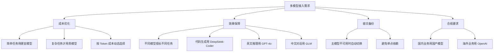
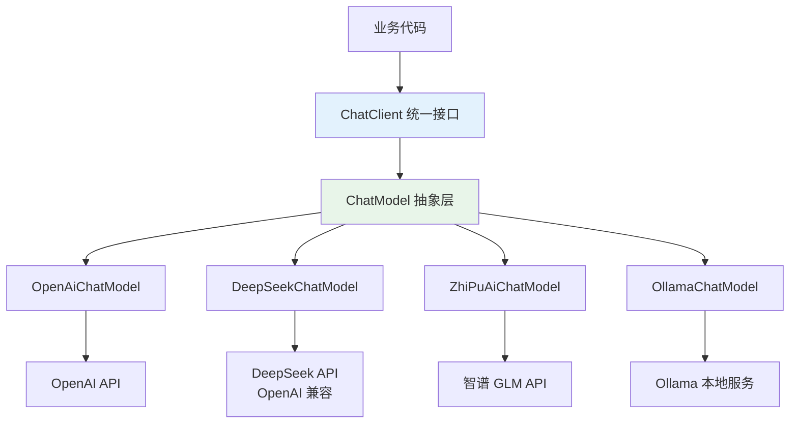
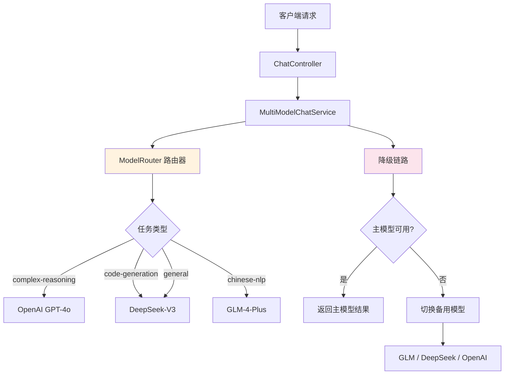
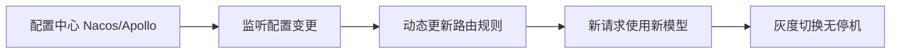
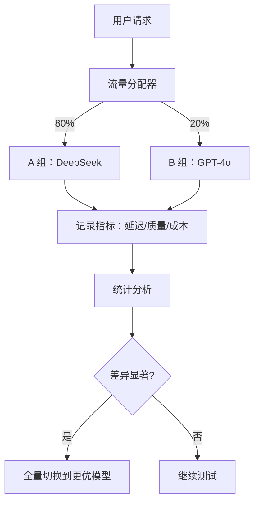
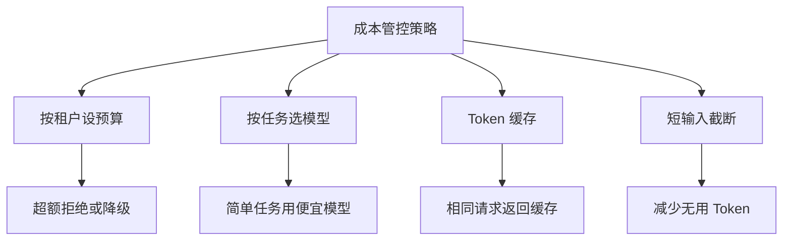
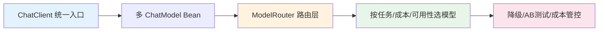

---
title: SpringAI 如何接入多种模型（OpenAI、DeepSeek、GLM）？
description: 通过统一抽象层接入 OpenAI、DeepSeek、GLM 等多种模型，实现模型可插拔切换
date: 2026-06-15T10:00:00+08:00
lastmod: 2026-06-15T10:00:00+08:00
weight: 4
tags:
  - 面试
  - SpringAI
  - 多模型
  - 后端工程
categories:
  - 面试题
  - 技术分享
math: true
mermaid: true
photos:
  - https://d-sketon.top/img/backwebp/bg4.webp
---

## 面试场景描述

> **面试官**：我们的业务需要用到多种大模型——简单任务用 DeepSeek 降成本，复杂推理用 GPT-4o 保效果，中文场景用 GLM。你们后端是 Java 技术栈，有没有了解过 SpringAI？如何在一个 Spring Boot 项目中同时接入 OpenAI、DeepSeek、GLM 三种模型，还能根据任务类型动态切换？

这道题考察的是 **后端 AI 工程化能力**。在企业级应用中，"多模型管理"是一个绕不开的话题：不同模型各有优劣，成本、效果、延迟、合规要求各不相同，业务需要灵活组合。SpringAI 作为 Spring 官方的 AI 集成框架，提供了一套优雅的抽象层来解决这些问题。

面试官想听到的是：你不仅会用 SpringAI 的 API，还理解 **模型抽象设计**、**多 Bean 注入机制**、**路由策略** 等后端工程核心概念。

## 问题分析：为什么需要接入多种模型

### 多模型的业务驱动力



### 不同模型对比

| 模型 | 提供商 | 优势 | 输入价格 | 适用场景 |
|------|--------|------|----------|----------|
| GPT-4o | OpenAI | 综合能力最强，推理优秀 | $2.5/M tokens | 复杂推理、英文场景 |
| DeepSeek-V3 | DeepSeek | 性价比极高，代码能力强 | ¥1/M tokens | 代码生成、日常对话 |
| GLM-4 | 智谱 AI | 中文理解优秀，国内合规 | ¥5/M tokens | 中文场景、国内业务 |
| Claude 3.5 | Anthropic | 长文本、安全性好 | $3/M tokens | 文档分析、合规场景 |

> **成本对比实例**：处理 100 万 Token 的请求，GPT-4o 约 ¥18，DeepSeek-V3 约 ¥1，GLM-4 约 ¥5。对于高并发的业务系统，合理选择模型可以节省 80% 以上的 API 成本。

## SpringAI 架构设计

### 核心抽象层

SpringAI 的设计哲学是 **"一套 API，多种模型"**，通过统一的抽象层屏蔽不同模型提供商的差异：



### 关键组件

| 组件 | 作用 | 说明 |
|------|------|------|
| `ChatClient` | 统一入口 | 链式 API，类似 RestClient |
| `ChatModel` | 模型抽象接口 | 底层模型接口，每个提供商一个实现 |
| `ChatLanguageModel` | 同步模型接口 | 基础对话能力 |
| `StreamingChatLanguageModel` | 流式模型接口 | 支持 SSE 流式输出 |
| `EmbeddingModel` | 向量模型接口 | 文本向量化 |
| `AutoConfiguration` | 自动配置 | 每个提供商一个 starter |

### 多模型 Bean 注入机制

SpringAI 通过 Spring 的条件装配机制，为每个提供商创建独立的 `ChatModel` Bean。当需要同时使用多个模型时，关键在于 **如何区分和管理这些 Bean**：


## 实操：接入三种模型

### 项目依赖配置

```xml
<!-- pom.xml -->
<dependencies>
    <!-- Spring Boot Starter -->
    <dependency>
        <groupId>org.springframework.boot</groupId>
        <artifactId>spring-boot-starter-web</artifactId>
    </dependency>

    <!-- SpringAI BOM -->
    <dependencyManagement>
        <dependencies>
            <dependency>
                <groupId>org.springframework.ai</groupId>
                <artifactId>spring-ai-bom</artifactId>
                <version>1.0.0</version>
                <type>pom</type>
                <scope>import</scope>
            </dependency>
        </dependencies>
    </dependencyManagement>

    <!-- SpringAI OpenAI（DeepSeek 也用此依赖，因为兼容 OpenAI 接口） -->
    <dependency>
        <groupId>org.springframework.ai</groupId>
        <artifactId>spring-ai-openai-spring-boot-starter</artifactId>
    </dependency>

    <!-- SpringAI 智谱 GLM -->
    <dependency>
        <groupId>org.springframework.ai</groupId>
        <artifactId>spring-ai-zhipuai-spring-boot-starter</artifactId>
    </dependency>
</dependencies>
```

### 多模型配置

```yaml
# application.yml
spring:
  ai:
    # OpenAI 配置（GPT-4o）
    openai:
      api-key: ${OPENAI_API_KEY}
      base-url: https://api.openai.com
      chat:
        options:
          model: gpt-4o
          temperature: 0.7
          max-tokens: 4096

    # 智谱 GLM 配置
    zhi-pu-ai:
      api-key: ${ZHIPU_API_KEY}
      chat:
        options:
          model: glm-4-plus
          temperature: 0.7
          max-tokens: 4096

# 自定义多模型配置（DeepSeek 通过 OpenAI 兼容接口）
multi-model:
  deepseek:
    api-key: ${DEEPSEEK_API_KEY}
    base-url: https://api.deepseek.com
    model: deepseek-chat
    temperature: 0.7
  routing:
    # 默认模型
    default: deepseek
    # 按任务类型路由
    task-routing:
      complex-reasoning: openai
      code-generation: deepseek
      chinese-nlp: glm
      general: deepseek
```

### 配置类：管理多模型 Bean

```java
package com.example.ai.config;

import org.springframework.ai.openai.OpenAiChatModel;
import org.springframework.ai.openai.OpenAiChatOptions;
import org.springframework.ai.openai.api.OpenAiApi;
import org.springframework.ai.zhipuai.ZhiPuAiChatModel;
import org.springframework.ai.zhipuai.api.ZhiPuAiApi;
import org.springframework.beans.factory.annotation.Qualifier;
import org.springframework.beans.factory.annotation.Value;
import org.springframework.context.annotation.Bean;
import org.springframework.context.annotation.Configuration;
import org.springframework.web.client.RestClient;

/**
 * 多模型配置类
 * 为每个模型提供商创建独立的 ChatModel Bean
 */
@Configuration
public class MultiModelConfig {

    // ========== OpenAI (GPT-4o) ==========
    @Bean
    @Qualifier("openaiChatModel")
    public OpenAiChatModel openaiChatModel(
            @Value("${spring.ai.openai.api-key}") String apiKey,
            @Value("${spring.ai.openai.base-url}") String baseUrl) {
        OpenAiApi openAiApi = OpenAiApi.builder()
                .baseUrl(baseUrl)
                .apiKey(apiKey)
                .restClientBuilder(RestClient.builder())
                .build();
        return OpenAiChatModel.builder()
                .openAiApi(openAiApi)
                .defaultOptions(OpenAiChatOptions.builder()
                        .model("gpt-4o")
                        .temperature(0.7)
                        .maxTokens(4096)
                        .build())
                .build();
    }

    // ========== DeepSeek (通过 OpenAI 兼容接口) ==========
    @Bean
    @Qualifier("deepseekChatModel")
    public OpenAiChatModel deepseekChatModel(
            @Value("${multi-model.deepseek.api-key}") String apiKey,
            @Value("${multi-model.deepseek.base-url}") String baseUrl) {
        OpenAiApi deepSeekApi = OpenAiApi.builder()
                .baseUrl(baseUrl)   // DeepSeek 的 OpenAI 兼容端点
                .apiKey(apiKey)
                .restClientBuilder(RestClient.builder())
                .build();
        return OpenAiChatModel.builder()
                .openAiApi(deepSeekApi)
                .defaultOptions(OpenAiChatOptions.builder()
                        .model("deepseek-chat")
                        .temperature(0.7)
                        .maxTokens(4096)
                        .build())
                .build();
    }

    // ========== GLM (智谱) ==========
    @Bean
    @Qualifier("glmChatModel")
    public ZhiPuAiChatModel glmChatModel(
            @Value("${spring.ai.zhi-pu-ai.api-key}") String apiKey) {
        ZhiPuAiApi zhiPuAiApi = new ZhiPuAiApi(apiKey);
        return new ZhiPuAiChatModel(zhiPuAiApi);
    }
}
```

### 模型路由策略

```java
package com.example.ai.routing;

import org.springframework.ai.chat.model.ChatModel;
import org.springframework.beans.factory.annotation.Qualifier;
import org.springframework.stereotype.Component;

import java.util.Map;

/**
 * 模型路由器：根据任务类型选择合适的模型
 */
@Component
public class ModelRouter {

    private final Map<String, ChatModel> chatModels;
    private final Map<String, String> taskRouting;

    public ModelRouter(
            @Qualifier("openaiChatModel") ChatModel openaiModel,
            @Qualifier("deepseekChatModel") ChatModel deepseekModel,
            @Qualifier("glmChatModel") ChatModel glmModel) {
        this.chatModels = Map.of(
                "openai", openaiModel,
                "deepseek", deepseekModel,
                "glm", glmModel
        );
        // 任务类型 → 模型映射
        this.taskRouting = Map.of(
                "complex-reasoning", "openai",
                "code-generation", "deepseek",
                "chinese-nlp", "glm",
                "general", "deepseek"
        );
    }

    /**
     * 根据任务类型选择模型
     */
    public ChatModel routeByTask(String taskType) {
        String modelKey = taskRouting.getOrDefault(taskType, "deepseek");
        return chatModels.get(modelKey);
    }

    /**
     * 根据输入内容自动判断任务类型
     */
    public ChatModel routeByContent(String userInput) {
        String taskType = classifyTask(userInput);
        return routeByTask(taskType);
    }

    /**
     * 简单任务分类（实际中可用 LLM 做意图识别）
     */
    private String classifyTask(String input) {
        String lower = input.toLowerCase();
        if (input.matches(".*[\\{\\}].*|.*def .*|.*public class.*|.*function.*")) {
            return "code-generation";
        }
        if (lower.contains("推理") || lower.contains("证明") || lower.contains("分析")) {
            return "complex-reasoning";
        }
        if (input.chars().filter(c -> c > 127).count() > input.length() * 0.5) {
            return "chinese-nlp";
        }
        return "general";
    }

    /**
     * 指定模型名称
     */
    public ChatModel getModel(String modelName) {
        return chatModels.getOrDefault(modelName, chatModels.get("deepseek"));
    }
}
```

### 统一服务层

```java
package com.example.ai.service;

import org.springframework.ai.chat.messages.UserMessage;
import org.springframework.ai.chat.model.ChatModel;
import org.springframework.ai.chat.prompt.Prompt;
import org.springframework.stereotype.Service;
import reactor.core.publisher.Flux;

@Service
public class MultiModelChatService {

    private final ModelRouter modelRouter;

    public MultiModelChatService(ModelRouter modelRouter) {
        this.modelRouter = modelRouter;
    }

    /**
     * 按任务类型路由对话
     */
    public String chat(String userInput, String taskType) {
        ChatModel model = modelRouter.routeByTask(taskType);
        Prompt prompt = new Prompt(new UserMessage(userInput));
        return model.call(prompt).getResult().getOutput().getText();
    }

    /**
     * 自动识别任务类型
     */
    public String chatAuto(String userInput) {
        ChatModel model = modelRouter.routeByContent(userInput);
        Prompt prompt = new Prompt(new UserMessage(userInput));
        return model.call(prompt).getResult().getOutput().getText();
    }

    /**
     * 指定模型对话
     */
    public String chatWithModel(String userInput, String modelName) {
        ChatModel model = modelRouter.getModel(modelName);
        Prompt prompt = new Prompt(new UserMessage(userInput));
        return model.call(prompt).getResult().getOutput().getText();
    }

    /**
     * 流式输出
     */
    public Flux<String> streamChat(String userInput, String taskType) {
        ChatModel model = modelRouter.routeByTask(taskType);
        Prompt prompt = new Prompt(new UserMessage(userInput));
        return model.stream(prompt)
                .map(response -> response.getResult().getOutput().getText());
    }

    /**
     * 模型降级：主模型失败时自动切换备用模型
     */
    public String chatWithFallback(String userInput, String primaryModel) {
        String[] fallbackChain = switch (primaryModel) {
            case "openai" -> new String[]{"openai", "glm", "deepseek"};
            case "glm" -> new String[]{"glm", "deepseek", "openai"};
            default -> new String[]{"deepseek", "glm", "openai"};
        };

        for (String modelName : fallbackChain) {
            try {
                return chatWithModel(userInput, modelName);
            } catch (Exception e) {
                System.err.println("模型 " + modelName + " 调用失败: " + e.getMessage());
            }
        }
        return "抱歉，所有模型均不可用，请稍后重试。";
    }
}
```

### Controller 层

```java
package com.example.ai.controller;

import org.springframework.web.bind.annotation.*;
import reactor.core.publisher.Flux;

@RestController
@RequestMapping("/api/chat")
public class ChatController {

    private final MultiModelChatService chatService;

    public ChatController(MultiModelChatService chatService) {
        this.chatService = chatService;
    }

    /** 按任务类型对话 */
    @PostMapping("/task")
    public String chatByTask(@RequestParam String message,
                              @RequestParam(defaultValue = "general") String taskType) {
        return chatService.chat(message, taskType);
    }

    /** 自动路由对话 */
    @PostMapping("/auto")
    public String chatAuto(@RequestParam String message) {
        return chatService.chatAuto(message);
    }

    /** 指定模型对话 */
    @PostMapping("/model/{modelName}")
    public String chatWithModel(@PathVariable String modelName,
                                 @RequestParam String message) {
        return chatService.chatWithModel(message, modelName);
    }

    /** 流式输出（SSE） */
    @GetMapping(value = "/stream", produces = "text/event-stream")
    public Flux<String> streamChat(@RequestParam String message,
                                    @RequestParam(defaultValue = "general") String taskType) {
        return chatService.streamChat(message, taskType);
    }

    /** 带降级的对话 */
    @PostMapping("/resilient")
    public String chatResilient(@RequestParam String message,
                                 @RequestParam(defaultValue = "deepseek") String primaryModel) {
        return chatService.chatWithFallback(message, primaryModel);
    }
}
```

## 整体架构图



## 追问延伸

### 追问一：如何实现模型动态切换？

以上方案通过重启生效配置。生产环境中，常需要**不重启即切换模型**：



```java
/**
 * 动态路由配置（结合 Nacos 配置中心）
 */
@Component
@RefreshScope  // Spring Cloud 配置自动刷新
public class DynamicModelRouter {

    private Map<String, String> routingRules;

    @Value("#{${multi-model.routing.task-routing}}")
    public void setRoutingRules(Map<String, String> rules) {
        this.routingRules = rules;
        // 配置变更时自动触发，无需重启
    }

    /**
     * 管理后台手动切换默认模型
     */
    @PostMapping("/admin/switch-model")
    public String switchDefaultModel(@RequestParam String modelName) {
        // 写入配置中心，所有节点自动生效
        configService.publishConfig("multi-model.routing.default", modelName);
        return "切换成功，新默认模型: " + modelName;
    }
}
```

### 追问二：如何做模型 A/B 测试？



```java
/**
 * A/B 测试流量分配
 */
@Component
public class ABTestRouter {

    private final Map<String, ChatModel> models;
    private final MetricsCollector metrics;

    public String chatWithABTest(String userInput, String experimentName) {
        // 基于用户 ID 做确定性分桶
        String bucket = assignBucket(userInput, experimentName);

        String modelName = switch (bucket) {
            case "control" -> "deepseek";
            case "experiment" -> "openai";
            default -> "deepseek";
        };

        long start = System.currentTimeMillis();
        String result = models.get(modelName)
                .call(new Prompt(new UserMessage(userInput)))
                .getResult().getOutput().getText();
        long latency = System.currentTimeMillis() - start;

        // 记录指标用于后续分析
        metrics.record(experimentName, modelName, latency, result.length());

        return result;
    }

    private String assignBucket(String userId, String experiment) {
        int hash = Math.abs(userId.hashCode()) % 100;
        if (hash < 80) return "control";       // 80% 对照组
        return "experiment";                     // 20% 实验组
    }
}
```

### 追问三：多模型的成本如何管控？



```java
/**
 * 成本管控拦截器
 */
@Component
public class CostGuardInterceptor {

    private final TokenCounter tokenCounter;
    private final Map<String, BigDecimal> modelPricing;  // 每模型单价

    public CostGuardInterceptor() {
        this.modelPricing = Map.of(
                "openai", new BigDecimal("0.018"),    // ¥/1K tokens
                "deepseek", new BigDecimal("0.001"),
                "glm", new BigDecimal("0.005")
        );
    }

    public String chatWithCostControl(String userId, String input,
                                       String taskType, BigDecimal budget) {
        // 预估 Token 数
        int estimatedTokens = tokenCounter.estimate(input) + 500;

        // 按预算选模型：预算低选便宜的，预算高选好的
        String selectedModel = selectModelByBudget(estimatedTokens, budget);

        // 执行
        return chatService.chatWithModel(input, selectedModel);
    }

    private String selectModelByBudget(int tokens, BigDecimal budget) {
        // 计算每个模型的花费，选预算内效果最好的
        for (String model : new String[]{"openai", "glm", "deepseek"}) {
            BigDecimal cost = modelPricing.get(model)
                    .multiply(BigDecimal.valueOf(tokens / 1000.0));
            if (cost.compareTo(budget) <= 0) {
                return model;
            }
        }
        return "deepseek"; // 最便宜的兜底
    }
}
```

## 小结

SpringAI 接入多种模型的核心思路是 **统一抽象 + 路由策略**：



| 设计要点 | 关键技术 | 价值 |
|----------|----------|------|
| 统一抽象 | `ChatModel` 接口 | 业务代码与模型解耦 |
| 多 Bean 管理 | `@Qualifier` 区分 | 同时注入多个模型 |
| 智能路由 | 任务分类 + 路由表 | 自动选最优模型 |
| 容灾降级 | Fallback 链 | 主模型故障自动切换 |
| 成本管控 | 预算感知选型 | 在预算内选最佳效果 |
| 动态切换 | 配置中心 + `@RefreshScope` | 无停机切模型 |

面试中回答这道题，建议从"**为什么要多模型 → SpringAI 架构设计 → 代码实现 → 路由与降级 → 动态切换与 AB 测试**"层层递进。展示出你不仅能写 CRUD，还能设计出具备 **可扩展性、可运维性、成本意识** 的企业级 AI 后端架构。
