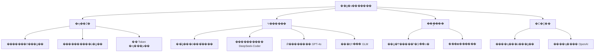
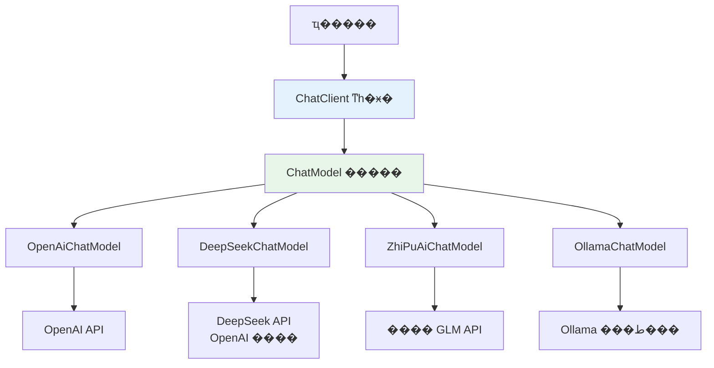
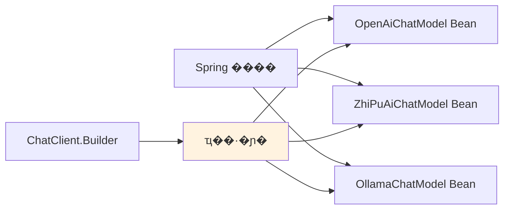
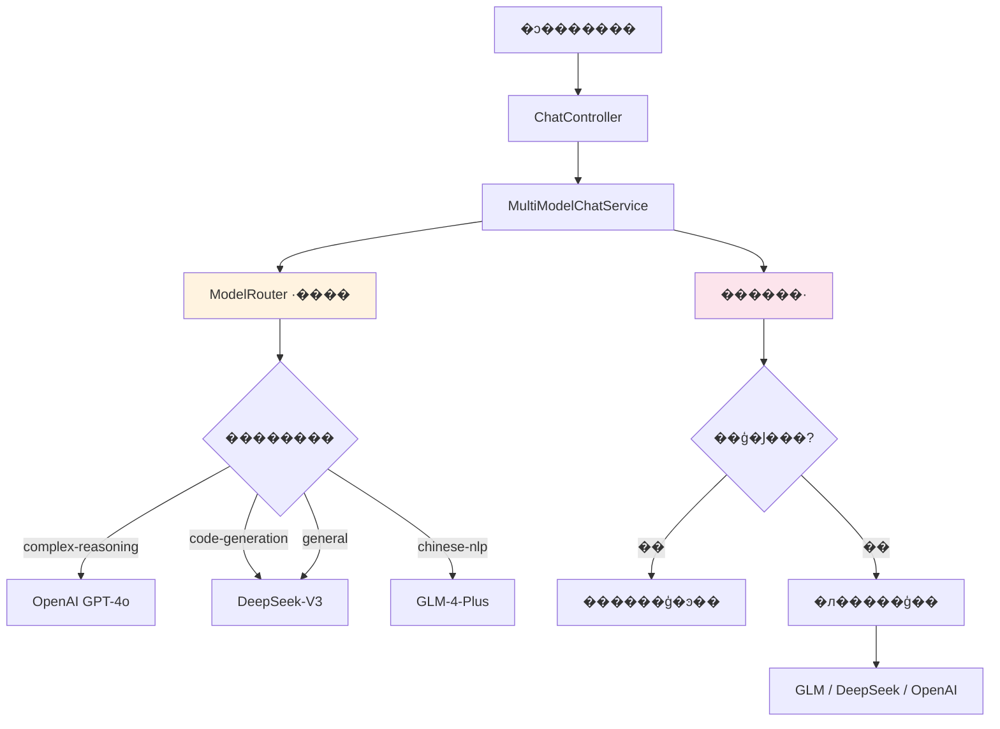
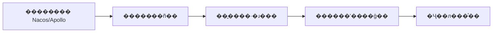
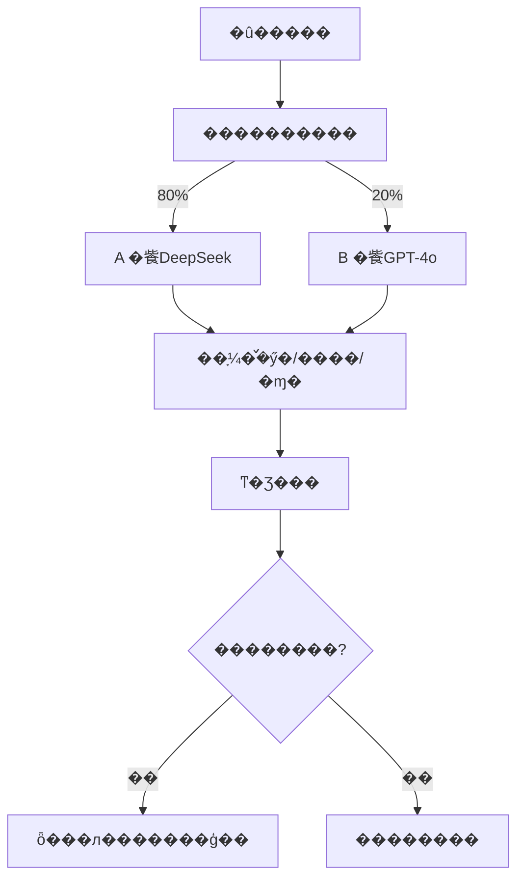
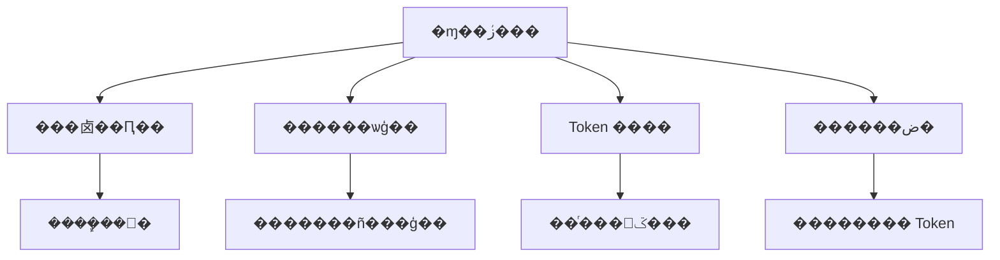
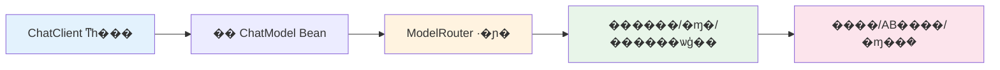

???---
title: SpringAI ��ν������ģ�ͣ�OpenAI��DeepSeek��GLM����
description: ͨ��ͳһ�������� OpenAI��DeepSeek��GLM �ȶ���ģ�ͣ�ʵ��ģ�Ϳɲ���л�
date: 2023-10-13T20:20:32+08:00
lastmod: 2023-10-13T20:20:32+08:00
weight: 4
tags:
  - ����
  - SpringAI
  - ��ģ��
  - ��˹���
categories:
  - ������
  - ��������
math: true
mermaid: true
photos:
  - https://d-sketon.top/img/backwebp/bg4.webp
---

## ���Գ�������

> **���Թ�**�����ǵ�ҵ����Ҫ�õ����ִ�ģ�͡����������� DeepSeek ���ɱ������������� GPT-4o ��Ч�������ij����� GLM�����Ǻ���� Java ����ջ����û���˽�� SpringAI�������һ�� Spring Boot ��Ŀ��ͬʱ���� OpenAI��DeepSeek��GLM ����ģ�ͣ����ܸ����������Ͷ�̬�л���

����⿼����� **��� AI ���̻�����**������ҵ��Ӧ���У�"��ģ�͹���"��һ���Ʋ����Ļ��⣺��ͬģ�͸������ӣ��ɱ���Ч�����ӳ١��Ϲ�Ҫ�������ͬ��ҵ����Ҫ�����ϡ�SpringAI ��Ϊ Spring �ٷ��� AI ���ɿ�ܣ��ṩ��һ�����ŵij�����������Щ���⡣

���Թ����������ǣ��㲻������ SpringAI �� API������� **ģ�ͳ������**��**�� Bean ע�����**��**·�ɲ���** �Ⱥ�˹��̺��ĸ��

## ���������Ϊʲô��Ҫ�������ģ��

### ��ģ�͵�ҵ��������



### ��ͬģ�ͶԱ�

| ģ�� | �ṩ�� | ���� | ����۸� | ���ó��� |
|------|--------|------|----------|----------|
| GPT-4o | OpenAI | �ۺ�������ǿ���������� | $2.5/M tokens | ���������Ӣ�ij��� |
| DeepSeek-V3 | DeepSeek | �Լ۱ȼ��ߣ���������ǿ | ��1/M tokens | �������ɡ��ճ��Ի� |
| GLM-4 | ���� AI | ����������㣬���ںϹ� | ��5/M tokens | ���ij���������ҵ�� |
| Claude 3.5 | Anthropic | ���ı�����ȫ�Ժ� | $3/M tokens | �ĵ��������Ϲ泡�� |

> **�ɱ��Ա�ʵ��**������ 100 �� Token ������GPT-4o Լ ��18��DeepSeek-V3 Լ ��1��GLM-4 Լ ��5�����ڸ߲�����ҵ��ϵͳ������ѡ��ģ�Ϳ��Խ�ʡ 80% ���ϵ� API �ɱ���

## SpringAI �ܹ����

### ���ij����

SpringAI �������ѧ�� **"һ�� API������ģ��"**��ͨ��ͳһ�ij�������β�ͬģ���ṩ�̵IJ��죺



### �ؼ����

| ��� | ���� | ˵�� |
|------|------|------|
| `ChatClient` | ͳһ��� | ��ʽ API������ RestClient |
| `ChatModel` | ģ�ͳ���ӿ� | �ײ�ģ�ͽӿڣ�ÿ���ṩ��һ��ʵ�� |
| `ChatLanguageModel` | ͬ��ģ�ͽӿ� | �����Ի����� |
| `StreamingChatLanguageModel` | ��ʽģ�ͽӿ� | ֧�� SSE ��ʽ��� |
| `EmbeddingModel` | ����ģ�ͽӿ� | �ı������� |
| `AutoConfiguration` | �Զ����� | ÿ���ṩ��һ�� starter |

### ��ģ�� Bean ע�����

SpringAI ͨ�� Spring ������װ����ƣ�Ϊÿ���ṩ�̴��������� `ChatModel` Bean������Ҫͬʱʹ�ö��ģ��ʱ���ؼ����� **������ֺ͹�����Щ Bean**��



## ʵ�٣���������ģ��

### ��Ŀ��������

```xml
<!-- pom.xml -->
<dependencies>
    <!-- Spring Boot Starter -->
    <dependency>
        <groupId>org.springframework.boot</groupId>
        <artifactId>spring-boot-starter-web</artifactId>
    </dependency>

    <!-- SpringAI BOM -->
    <dependencyManagement>
        <dependencies>
            <dependency>
                <groupId>org.springframework.ai</groupId>
                <artifactId>spring-ai-bom</artifactId>
                <version>1.0.0</version>
                <type>pom</type>
                <scope>import</scope>
            </dependency>
        </dependencies>
    </dependencyManagement>

    <!-- SpringAI OpenAI��DeepSeek Ҳ�ô���������Ϊ���� OpenAI �ӿڣ� -->
    <dependency>
        <groupId>org.springframework.ai</groupId>
        <artifactId>spring-ai-openai-spring-boot-starter</artifactId>
    </dependency>

    <!-- SpringAI ���� GLM -->
    <dependency>
        <groupId>org.springframework.ai</groupId>
        <artifactId>spring-ai-zhipuai-spring-boot-starter</artifactId>
    </dependency>
</dependencies>
```

### ��ģ������

```yaml
# application.yml
spring:
  ai:
    # OpenAI ���ã�GPT-4o��
    openai:
      api-key: ${OPENAI_API_KEY}
      base-url: https://api.openai.com
      chat:
        options:
          model: gpt-4o
          temperature: 0.7
          max-tokens: 4096

    # ���� GLM ����
    zhi-pu-ai:
      api-key: ${ZHIPU_API_KEY}
      chat:
        options:
          model: glm-4-plus
          temperature: 0.7
          max-tokens: 4096

# �Զ����ģ�����ã�DeepSeek ͨ�� OpenAI ���ݽӿڣ�
multi-model:
  deepseek:
    api-key: ${DEEPSEEK_API_KEY}
    base-url: https://api.deepseek.com
    model: deepseek-chat
    temperature: 0.7
  routing:
    # Ĭ��ģ��
    default: deepseek
    # ����������·��
    task-routing:
      complex-reasoning: openai
      code-generation: deepseek
      chinese-nlp: glm
      general: deepseek
```

### �����ࣺ�����ģ�� Bean

```java
package com.example.ai.config;

import org.springframework.ai.openai.OpenAiChatModel;
import org.springframework.ai.openai.OpenAiChatOptions;
import org.springframework.ai.openai.api.OpenAiApi;
import org.springframework.ai.zhipuai.ZhiPuAiChatModel;
import org.springframework.ai.zhipuai.api.ZhiPuAiApi;
import org.springframework.beans.factory.annotation.Qualifier;
import org.springframework.beans.factory.annotation.Value;
import org.springframework.context.annotation.Bean;
import org.springframework.context.annotation.Configuration;
import org.springframework.web.client.RestClient;

/**
 * ��ģ��������
 * Ϊÿ��ģ���ṩ�̴��������� ChatModel Bean
 */
@Configuration
public class MultiModelConfig {

    // ========== OpenAI (GPT-4o) ==========
    @Bean
    @Qualifier("openaiChatModel")
    public OpenAiChatModel openaiChatModel(
            @Value("${spring.ai.openai.api-key}") String apiKey,
            @Value("${spring.ai.openai.base-url}") String baseUrl) {
        OpenAiApi openAiApi = OpenAiApi.builder()
                .baseUrl(baseUrl)
                .apiKey(apiKey)
                .restClientBuilder(RestClient.builder())
                .build();
        return OpenAiChatModel.builder()
                .openAiApi(openAiApi)
                .defaultOptions(OpenAiChatOptions.builder()
                        .model("gpt-4o")
                        .temperature(0.7)
                        .maxTokens(4096)
                        .build())
                .build();
    }

    // ========== DeepSeek (ͨ�� OpenAI ���ݽӿ�) ==========
    @Bean
    @Qualifier("deepseekChatModel")
    public OpenAiChatModel deepseekChatModel(
            @Value("${multi-model.deepseek.api-key}") String apiKey,
            @Value("${multi-model.deepseek.base-url}") String baseUrl) {
        OpenAiApi deepSeekApi = OpenAiApi.builder()
                .baseUrl(baseUrl)   // DeepSeek �� OpenAI ���ݶ˵�
                .apiKey(apiKey)
                .restClientBuilder(RestClient.builder())
                .build();
        return OpenAiChatModel.builder()
                .openAiApi(deepSeekApi)
                .defaultOptions(OpenAiChatOptions.builder()
                        .model("deepseek-chat")
                        .temperature(0.7)
                        .maxTokens(4096)
                        .build())
                .build();
    }

    // ========== GLM (����) ==========
    @Bean
    @Qualifier("glmChatModel")
    public ZhiPuAiChatModel glmChatModel(
            @Value("${spring.ai.zhi-pu-ai.api-key}") String apiKey) {
        ZhiPuAiApi zhiPuAiApi = new ZhiPuAiApi(apiKey);
        return new ZhiPuAiChatModel(zhiPuAiApi);
    }
}
```

### ģ��·�ɲ���

```java
package com.example.ai.routing;

import org.springframework.ai.chat.model.ChatModel;
import org.springframework.beans.factory.annotation.Qualifier;
import org.springframework.stereotype.Component;

import java.util.Map;

/**
 * ģ��·������������������ѡ����ʵ�ģ��
 */
@Component
public class ModelRouter {

    private final Map<String, ChatModel> chatModels;
    private final Map<String, String> taskRouting;

    public ModelRouter(
            @Qualifier("openaiChatModel") ChatModel openaiModel,
            @Qualifier("deepseekChatModel") ChatModel deepseekModel,
            @Qualifier("glmChatModel") ChatModel glmModel) {
        this.chatModels = Map.of(
                "openai", openaiModel,
                "deepseek", deepseekModel,
                "glm", glmModel
        );
        // �������� �� ģ��ӳ��
        this.taskRouting = Map.of(
                "complex-reasoning", "openai",
                "code-generation", "deepseek",
                "chinese-nlp", "glm",
                "general", "deepseek"
        );
    }

    /**
     * ������������ѡ��ģ��
     */
    public ChatModel routeByTask(String taskType) {
        String modelKey = taskRouting.getOrDefault(taskType, "deepseek");
        return chatModels.get(modelKey);
    }

    /**
     * �������������Զ��ж���������
     */
    public ChatModel routeByContent(String userInput) {
        String taskType = classifyTask(userInput);
        return routeByTask(taskType);
    }

    /**
     * ��������ࣨʵ���п��� LLM ����ͼʶ��
     */
    private String classifyTask(String input) {
        String lower = input.toLowerCase();
        if (input.matches(".*[\\{\\}].*|.*def .*|.*public class.*|.*function.*")) {
            return "code-generation";
        }
        if (lower.contains("����") || lower.contains("֤��") || lower.contains("����")) {
            return "complex-reasoning";
        }
        if (input.chars().filter(c -> c > 127).count() > input.length() * 0.5) {
            return "chinese-nlp";
        }
        return "general";
    }

    /**
     * ָ��ģ������
     */
    public ChatModel getModel(String modelName) {
        return chatModels.getOrDefault(modelName, chatModels.get("deepseek"));
    }
}
```

### ͳһ�����

```java
package com.example.ai.service;

import org.springframework.ai.chat.messages.UserMessage;
import org.springframework.ai.chat.model.ChatModel;
import org.springframework.ai.chat.prompt.Prompt;
import org.springframework.stereotype.Service;
import reactor.core.publisher.Flux;

@Service
public class MultiModelChatService {

    private final ModelRouter modelRouter;

    public MultiModelChatService(ModelRouter modelRouter) {
        this.modelRouter = modelRouter;
    }

    /**
     * ����������·�ɶԻ�
     */
    public String chat(String userInput, String taskType) {
        ChatModel model = modelRouter.routeByTask(taskType);
        Prompt prompt = new Prompt(new UserMessage(userInput));
        return model.call(prompt).getResult().getOutput().getText();
    }

    /**
     * �Զ�ʶ����������
     */
    public String chatAuto(String userInput) {
        ChatModel model = modelRouter.routeByContent(userInput);
        Prompt prompt = new Prompt(new UserMessage(userInput));
        return model.call(prompt).getResult().getOutput().getText();
    }

    /**
     * ָ��ģ�ͶԻ�
     */
    public String chatWithModel(String userInput, String modelName) {
        ChatModel model = modelRouter.getModel(modelName);
        Prompt prompt = new Prompt(new UserMessage(userInput));
        return model.call(prompt).getResult().getOutput().getText();
    }

    /**
     * ��ʽ���
     */
    public Flux<String> streamChat(String userInput, String taskType) {
        ChatModel model = modelRouter.routeByTask(taskType);
        Prompt prompt = new Prompt(new UserMessage(userInput));
        return model.stream(prompt)
                .map(response -> response.getResult().getOutput().getText());
    }

    /**
     * ģ�ͽ�������ģ��ʧ��ʱ�Զ��л�����ģ��
     */
    public String chatWithFallback(String userInput, String primaryModel) {
        String[] fallbackChain = switch (primaryModel) {
            case "openai" -> new String[]{"openai", "glm", "deepseek"};
            case "glm" -> new String[]{"glm", "deepseek", "openai"};
            default -> new String[]{"deepseek", "glm", "openai"};
        };

        for (String modelName : fallbackChain) {
            try {
                return chatWithModel(userInput, modelName);
            } catch (Exception e) {
                System.err.println("ģ�� " + modelName + " ����ʧ��: " + e.getMessage());
            }
        }
        return "��Ǹ������ģ�;������ã����Ժ����ԡ�";
    }
}
```

### Controller ��

```java
package com.example.ai.controller;

import org.springframework.web.bind.annotation.*;
import reactor.core.publisher.Flux;

@RestController
@RequestMapping("/api/chat")
public class ChatController {

    private final MultiModelChatService chatService;

    public ChatController(MultiModelChatService chatService) {
        this.chatService = chatService;
    }

    /** ���������ͶԻ� */
    @PostMapping("/task")
    public String chatByTask(@RequestParam String message,
                              @RequestParam(defaultValue = "general") String taskType) {
        return chatService.chat(message, taskType);
    }

    /** �Զ�·�ɶԻ� */
    @PostMapping("/auto")
    public String chatAuto(@RequestParam String message) {
        return chatService.chatAuto(message);
    }

    /** ָ��ģ�ͶԻ� */
    @PostMapping("/model/{modelName}")
    public String chatWithModel(@PathVariable String modelName,
                                 @RequestParam String message) {
        return chatService.chatWithModel(message, modelName);
    }

    /** ��ʽ�����SSE�� */
    @GetMapping(value = "/stream", produces = "text/event-stream")
    public Flux<String> streamChat(@RequestParam String message,
                                    @RequestParam(defaultValue = "general") String taskType) {
        return chatService.streamChat(message, taskType);
    }

    /** �������ĶԻ� */
    @PostMapping("/resilient")
    public String chatResilient(@RequestParam String message,
                                 @RequestParam(defaultValue = "deepseek") String primaryModel) {
        return chatService.chatWithFallback(message, primaryModel);
    }
}
```

## ����ܹ�ͼ



## ׷������

### ׷��һ�����ʵ��ģ�Ͷ�̬�л���

���Ϸ���ͨ��������Ч���á����������У�����Ҫ**��������л�ģ��**��



```java
/**
 * ��̬·�����ã���� Nacos �������ģ�
 */
@Component
@RefreshScope  // Spring Cloud �����Զ�ˢ��
public class DynamicModelRouter {

    private Map<String, String> routingRules;

    @Value("#{${multi-model.routing.task-routing}}")
    public void setRoutingRules(Map<String, String> rules) {
        this.routingRules = rules;
        // ���ñ��ʱ�Զ���������������
    }

    /**
     * �����̨�ֶ��л�Ĭ��ģ��
     */
    @PostMapping("/admin/switch-model")
    public String switchDefaultModel(@RequestParam String modelName) {
        // д���������ģ����нڵ��Զ���Ч
        configService.publishConfig("multi-model.routing.default", modelName);
        return "�л��ɹ�����Ĭ��ģ��: " + modelName;
    }
}
```

### ׷�ʶ��������ģ�� A/B ���ԣ�



```java
/**
 * A/B ������������
 */
@Component
public class ABTestRouter {

    private final Map<String, ChatModel> models;
    private final MetricsCollector metrics;

    public String chatWithABTest(String userInput, String experimentName) {
        // �����û� ID ��ȷ���Է�Ͱ
        String bucket = assignBucket(userInput, experimentName);

        String modelName = switch (bucket) {
            case "control" -> "deepseek";
            case "experiment" -> "openai";
            default -> "deepseek";
        };

        long start = System.currentTimeMillis();
        String result = models.get(modelName)
                .call(new Prompt(new UserMessage(userInput)))
                .getResult().getOutput().getText();
        long latency = System.currentTimeMillis() - start;

        // ��¼ָ�����ں�������
        metrics.record(experimentName, modelName, latency, result.length());

        return result;
    }

    private String assignBucket(String userId, String experiment) {
        int hash = Math.abs(userId.hashCode()) % 100;
        if (hash < 80) return "control";       // 80% ������
        return "experiment";                     // 20% ʵ����
    }
}
```

### ׷��������ģ�͵ijɱ���ιܿأ�



```java
/**
 * �ɱ��ܿ�������
 */
@Component
public class CostGuardInterceptor {

    private final TokenCounter tokenCounter;
    private final Map<String, BigDecimal> modelPricing;  // ÿģ�͵���

    public CostGuardInterceptor() {
        this.modelPricing = Map.of(
                "openai", new BigDecimal("0.018"),    // ��/1K tokens
                "deepseek", new BigDecimal("0.001"),
                "glm", new BigDecimal("0.005")
        );
    }

    public String chatWithCostControl(String userId, String input,
                                       String taskType, BigDecimal budget) {
        // Ԥ�� Token ��
        int estimatedTokens = tokenCounter.estimate(input) + 500;

        // ��Ԥ��ѡģ�ͣ�Ԥ���ѡ���˵ģ�Ԥ���ѡ�õ�
        String selectedModel = selectModelByBudget(estimatedTokens, budget);

        // ִ��
        return chatService.chatWithModel(input, selectedModel);
    }

    private String selectModelByBudget(int tokens, BigDecimal budget) {
        // ����ÿ��ģ�͵Ļ��ѣ�ѡԤ����Ч����õ�
        for (String model : new String[]{"openai", "glm", "deepseek"}) {
            BigDecimal cost = modelPricing.get(model)
                    .multiply(BigDecimal.valueOf(tokens / 1000.0));
            if (cost.compareTo(budget) <= 0) {
                return model;
            }
        }
        return "deepseek"; // ����˵Ķ���
    }
}
```

## ��

SpringAI �������ģ�͵ĺ���˼·�� **ͳһ���� + ·�ɲ���**��



| ���Ҫ�� | �ؼ����� | ��ֵ |
|----------|----------|------|
| ͳһ���� | `ChatModel` �ӿ� | ҵ�������ģ�ͽ��� |
| �� Bean ���� | `@Qualifier` ���� | ͬʱע����ģ�� |
| ����·�� | ������� + ·�ɱ� | �Զ�ѡ����ģ�� |
| ���ֽ��� | Fallback �� | ��ģ�͹����Զ��л� |
| �ɱ��ܿ� | Ԥ���֪ѡ�� | ��Ԥ����ѡ���Ч�� |
| ��̬�л� | �������� + `@RefreshScope` | ��ͣ����ģ�� |

�����лش�����⣬�����"**ΪʲôҪ��ģ�� �� SpringAI �ܹ���� �� ����ʵ�� �� ·���뽵�� �� ��̬�л��� AB ����**"���ݽ���չʾ���㲻����д CRUD��������Ƴ��߱� **����չ�ԡ�����ά�ԡ��ɱ���ʶ** ����ҵ�� AI ��˼ܹ���
