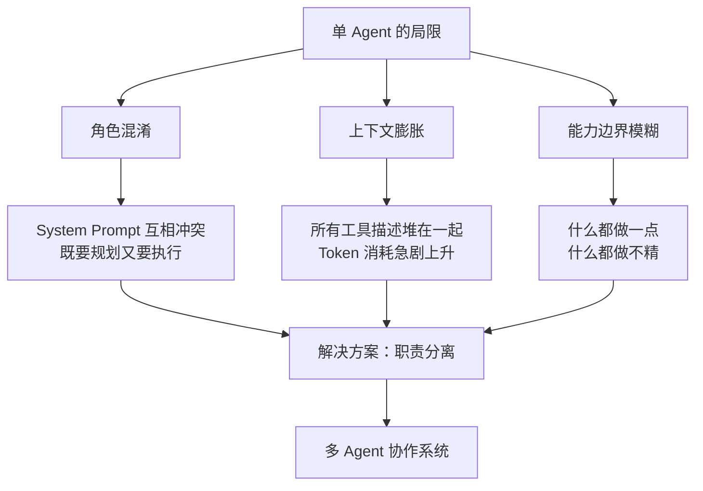
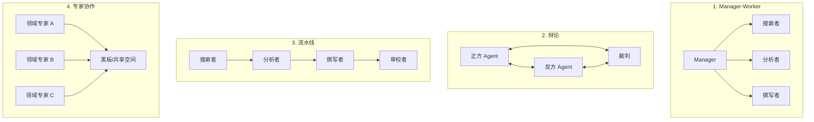
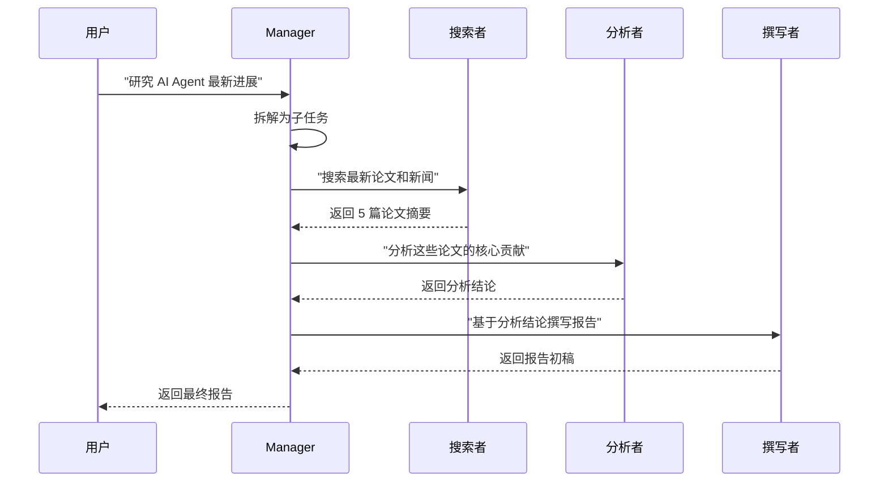
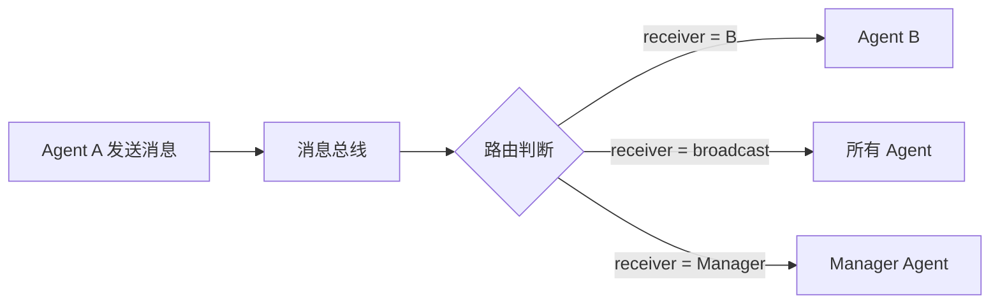
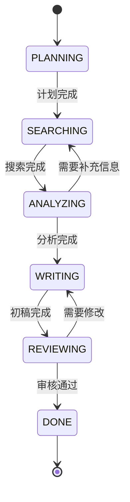
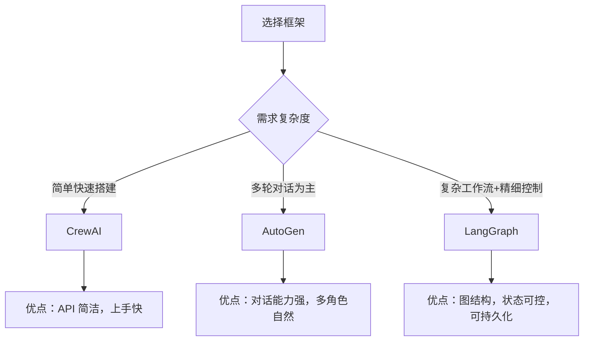
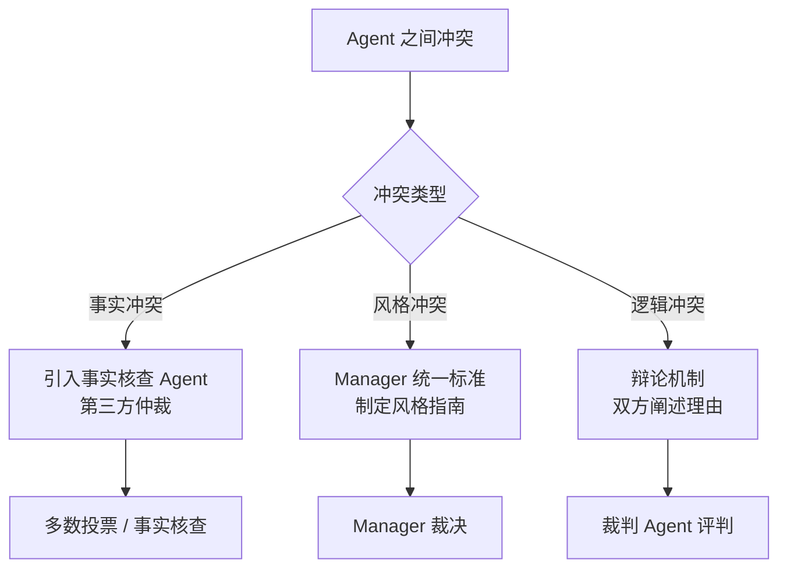
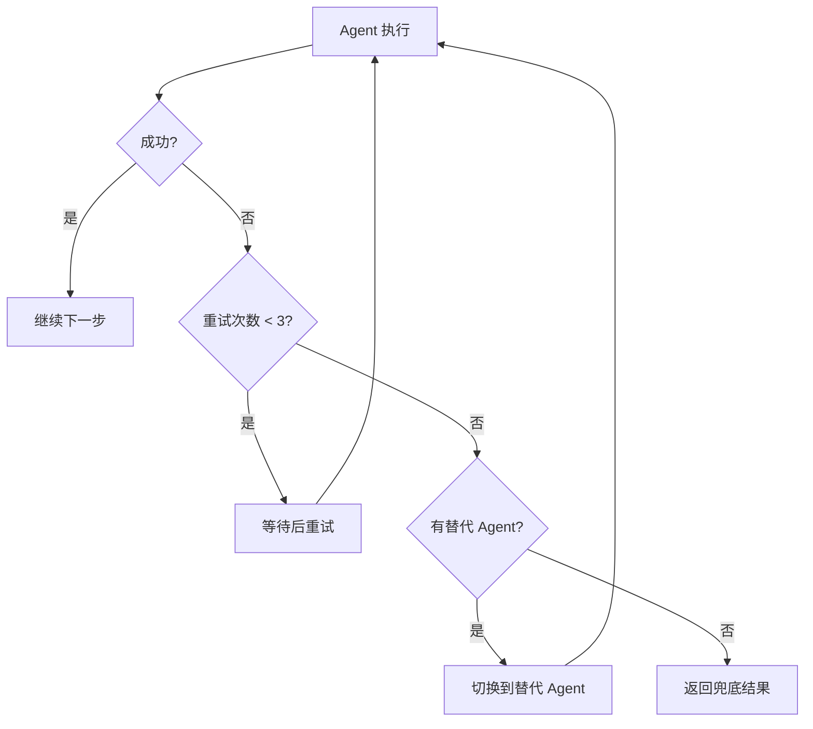

---
title: 多 Agent 系统如何设计？
description: 从角色设计到通信协议再到状态管理，系统掌握多 Agent 协作系统的设计方法
date: 2026-06-22T10:00:00+08:00
lastmod: 2026-06-22T10:00:00+08:00
weight: 7
tags:
  - 面试
  - 多Agent
  - 系统设计
  - 协作
categories:
  - 面试题
  - 技术分享
math: true
mermaid: true
photos:
  - https://d-sketon.top/img/backwebp/bg7.webp
---

## 面试场景描述

> **面试官**：假设你要设计一个"AI 研究助手"系统，能自动搜索文献、分析数据、撰写报告。你打算用单 Agent 还是多 Agent？如果用多 Agent，你会怎么设计角色和协作流程？
>
> **候选人**：这种复杂任务单 Agent 很难做好。我会拆成多个角色：规划者负责拆解任务、搜索者负责检索、分析者负责数据处理、撰写者负责输出报告。用 Manager-Worker 拓扑，规划者当 Manager 协调其他 Worker。
>
> **面试官**：Agent 之间怎么通信？如果分析者和撰写者对结论有分歧怎么办？Token 成本怎么控制？

这是一道考察 **系统设计能力 + Agent 工程能力** 的高阶面试题。多 Agent 系统是当前 AI 应用的前沿方向，涉及角色设计、通信协议、状态管理、冲突解决等多个维度。本文将系统梳理完整的设计方法论。

## 问题分析：为什么需要多 Agent

### 单 Agent 的三大局限

当任务复杂度上升时，把所有能力塞进一个 Agent 会导致三类核心问题：



| 问题 | 单 Agent 的表现 | 多 Agent 的优势 |
|------|---------------|----------------|
| **角色混淆** | 一个 Prompt 既要规划又要执行，互相冲突 | 每个角色 Prompt 聚焦单一职责 |
| **上下文膨胀** | 所有工具、历史对话堆在一个窗口 | 各角色独立上下文，按需加载 |
| **能力边界** | 什么都做，什么都做不精 | 专业化分工，能力聚焦 |
| **可维护性** | 修改一处影响全局 | 修改单个角色不影响其他 |
| **可扩展性** | 增加能力导致 Prompt 膨胀 | 新增角色即可 |

### 什么时候该用多 Agent

并非所有场景都需要多 Agent。决策依据：

| 任务复杂度 | 推荐方案 | 示例 |
|-----------|---------|------|
| 简单（1-2 步） | 单 Agent | "翻译这段话" |
| 中等（3-5 步，单领域） | 单 Agent + 工具调用 | "搜索天气并生成日报" |
| 复杂（多步骤，跨领域） | **多 Agent** | "研究市场趋势并撰写分析报告" |
| 极复杂（需要辩论/验证） | **多 Agent + 辩论拓扑** | "评估一个投资决策的风险" |

## 设计维度一：角色定义

### SRP 原则

将软件工程中的**单一职责原则（Single Responsibility Principle）** 引入 Agent 设计：每个角色应当只有一个变更的原因。

一个完整的角色定义包含四个要素：

| 要素 | 含义 | 示例（搜索者） |
|------|------|--------------|
| **身份（Identity）** | 角色是谁、擅长什么 | "你是一个学术文献搜索专家" |
| **能力（Capability）** | 能调用哪些工具 | `web_search`、`paper_download` |
| **约束（Constraint）** | 行为边界 | "只返回近 3 年的论文" |
| **目标（Goal）** | 当前任务的产出 | "找到 5 篇相关论文并提取关键信息" |

```python
from dataclasses import dataclass, field
from typing import Any

@dataclass
class RoleDefinition:
    """角色定义：身份、能力、约束、目标"""
    name: str                          # 角色名称
    identity: str                      # 身份描述
    capabilities: list[str]            # 能力声明（可用工具列表）
    constraints: list[str]             # 行为约束
    goal: str = ""                     # 角色目标

    def build_prompt(self) -> str:
        """根据四要素自动构建 System Prompt"""
        caps = "\n".join(f"  - {c}" for c in self.capabilities)
        cons = "\n".join(f"  - {c}" for c in self.constraints)
        return f"""你是「{self.name}」。
身份：{self.identity}
可用能力：
{caps}
行为约束：
{cons}
当前目标：{self.goal}"""
```

### 角色拆分信号

什么时候应该拆分角色？以下信号出现时，说明当前角色承担了过多职责：

- System Prompt 超过 500 Token 且包含"同时"这类连接词
- 一个角色需要调用超过 5 个工具
- 不同能力之间有冲突（如"创造性写作"和"严格事实核查"）

## 设计维度二：协作拓扑

### 四种主流拓扑结构



四种拓扑的详细对比：

| 拓扑结构 | 控制方式 | 优点 | 缺点 | 适用场景 |
|---------|---------|------|------|---------|
| **Manager-Worker** | 中心化 | 结构清晰，易于实现 | Manager 瓶颈 | 任务可分解的场景 |
| **辩论** | 去中心化 | 结论更严谨 | Token 消耗大 | 需要验证的决策场景 |
| **流水线** | 顺序流转 | 高效，各阶段并行准备 | 灵活性低 | 流程固定的场景 |
| **专家协作** | 共享黑板 | 灵活，专家可自由参与 | 协调复杂 | 开放式探索场景 |

### Manager-Worker 拓扑实现

这是最常用的拓扑，一个 Manager Agent 负责任务规划和分配，多个 Worker Agent 负责执行：



## 设计维度三：通信协议

### 结构化消息

Agent 之间的通信不能是自由文本，必须有结构化的消息格式，否则接收方无法可靠解析。

```python
from enum import Enum
from dataclasses import dataclass, field
from datetime import datetime
from typing import Any

class MessageType(Enum):
    """消息类型枚举"""
    TASK_ASSIGN = "task_assign"      # 任务分配
    RESULT_REPORT = "result_report"  # 结果汇报
    QUESTION = "question"            # 提问
    FEEDBACK = "feedback"            # 反馈
    HANDOFF = "handoff"              # 移交

@dataclass
class AgentMessage:
    """结构化的 Agent 间消息"""
    sender: str                        # 发送者角色名
    receiver: str                      # 接收者角色名
    msg_type: MessageType              # 消息类型
    content: str                       # 消息内容
    context: dict[str, Any] = field(default_factory=dict)  # 附加上下文
    timestamp: str = field(default_factory=lambda: datetime.now().isoformat())

    def to_dict(self) -> dict:
        return {
            "sender": self.sender,
            "receiver": self.receiver,
            "msg_type": self.msg_type.value,
            "content": self.content,
            "context": self.context,
            "timestamp": self.timestamp,
        }
```

### 消息路由



## 设计维度四：状态管理

### 状态机模式（FSM）

对于流程固定的多 Agent 系统，有限状态机（FSM）是最可靠的状态管理方式：



```python
from enum import Enum, auto

class WorkflowState(Enum):
    """工作流状态枚举"""
    PLANNING = auto()
    SEARCHING = auto()
    ANALYZING = auto()
    WRITING = auto()
    REVIEWING = auto()
    DONE = auto()

class WorkflowStateMachine:
    """有限状态机：管理多 Agent 工作流"""

    # 合法的状态转移
    TRANSITIONS = {
        WorkflowState.PLANNING: {WorkflowState.SEARCHING},
        WorkflowState.SEARCHING: {WorkflowState.ANALYZING},
        WorkflowState.ANALYZING: {
            WorkflowState.SEARCHING,  # 可能需要回退补充搜索
            WorkflowState.WRITING,
        },
        WorkflowState.WRITING: {WorkflowState.REVIEWING},
        WorkflowState.REVIEWING: {
            WorkflowState.WRITING,    # 退回修改
            WorkflowState.DONE,
        },
        WorkflowState.DONE: set(),
    }

    def __init__(self):
        self.state = WorkflowState.PLANNING
        self.history: list[WorkflowState] = []

    def transition(self, new_state: WorkflowState):
        """状态转移（带合法性检查）"""
        if new_state not in self.TRANSITIONS.get(self.state, set()):
            raise ValueError(
                f"非法状态转移: {self.state.name} -> {new_state.name}"
            )
        self.history.append(self.state)
        self.state = new_state

    def is_done(self) -> bool:
        return self.state == WorkflowState.DONE
```

### 黑板模式

对于开放式协作场景，黑板模式（Blackboard）更灵活——所有 Agent 共享一个"黑板"，各自读写自己负责的部分：

```python
from dataclasses import dataclass, field
from typing import Any

@dataclass
class Blackboard:
    """共享黑板：所有 Agent 可读写"""
    topic: str = ""                          # 研究主题
    search_results: list[dict] = field(default_factory=list)  # 搜索结果
    analysis: dict[str, Any] = field(default_factory=dict)    # 分析结论
    draft: str = ""                          # 报告初稿
    feedback: list[str] = field(default_factory=list)         # 审校反馈
    metadata: dict[str, Any] = field(default_factory=dict)    # 元数据

    def get_section(self, key: str) -> Any:
        """获取某个分区"""
        return getattr(self, key, None)

    def update_section(self, key: str, value: Any):
        """更新某个分区"""
        if hasattr(self, key):
            setattr(self, key, value)
        else:
            self.metadata[key] = value
```

两种状态管理模式的对比：

| 维度 | 状态机（FSM） | 黑板模式 |
|------|-------------|---------|
| **控制方式** | 集中式，严格流程 | 分散式，自由协作 |
| **灵活性** | 低（固定流程） | 高（动态参与） |
| **可预测性** | 高 | 低 |
| **适用场景** | 流程固定的任务 | 开放式探索 |
| **调试难度** | 低 | 中 |

## 框架对比

### LangGraph vs AutoGen vs CrewAI

| 维度 | LangGraph | AutoGen | CrewAI |
|------|-----------|---------|--------|
| **核心抽象** | 图（节点+边） | 对话（Conversation） | 角色+任务 |
| **状态管理** | 内置图状态 | 对话历史 | 任务上下文 |
| **拓扑支持** | 任意有向图 | 对话/流水线 | 流水线/层级 |
| **学习曲线** | 陡峭 | 中等 | 平缓 |
| **灵活性** | 最高 | 中 | 低 |
| **适合场景** | 复杂工作流 | 多轮对话 | 快速搭建 |
| **背后团队** | LangChain | Microsoft | CrewAI Inc. |



## 代码示例：多角色研究助手

以下实现一个完整的 Manager-Worker 拓扑的研究助手系统：

```python
"""
多角色研究助手：Manager + 搜索者 + 分析者 + 撰写者
使用 Manager-Worker 拓扑 + 有限状态机管理
"""
import json
from abc import ABC, abstractmethod

# ========== 角色基类 ==========

class BaseAgent(ABC):
    """Agent 基类"""

    def __init__(self, name: str, system_prompt: str):
        self.name = name
        self.system_prompt = system_prompt
        self.messages: list[dict] = []

    @abstractmethod
    async def run(self, task: str, context: dict) -> str:
        """执行任务，返回结果"""
        pass

    def _add_message(self, role: str, content: str):
        self.messages.append({"role": role, "content": content})

    def reset(self):
        """重置上下文"""
        self.messages = []


# ========== 具体角色实现 ==========

class SearchAgent(BaseAgent):
    """搜索者：负责检索信息"""

    def __init__(self):
        super().__init__(
            name="搜索者",
            system_prompt=(
                "你是一个学术搜索专家。"
                "根据给定的研究主题，搜索相关论文和资料。"
                "返回结构化的搜索结果列表。"
            ),
        )

    async def run(self, task: str, context: dict) -> str:
        self._add_message("user", f"搜索主题：{task}")
        # 实际调用 LLM + 搜索工具
        results = [
            {"title": "Agent 论文 1", "summary": "关于多Agent协作..."},
            {"title": "Agent 论文 2", "summary": "关于工具调用..."},
        ]
        context["search_results"] = results
        return json.dumps(results, ensure_ascii=False)


class AnalysisAgent(BaseAgent):
    """分析者：负责数据处理和结论提炼"""

    def __init__(self):
        super().__init__(
            name="分析者",
            system_prompt=(
                "你是一个数据分析专家。"
                "根据搜索结果，分析核心贡献、趋势和不足。"
                "返回结构化的分析结论。"
            ),
        )

    async def run(self, task: str, context: dict) -> str:
        search_results = context.get("search_results", [])
        self._add_message(
            "user",
            f"分析以下搜索结果：\n{json.dumps(search_results, ensure_ascii=False)}",
        )
        # 实际调用 LLM
        analysis = {
            "key_findings": ["多Agent协作是主流趋势", "工具调用可靠性是痛点"],
            "trends": "从单Agent向多Agent演进",
            "gaps": "缺少标准化通信协议",
        }
        context["analysis"] = analysis
        return json.dumps(analysis, ensure_ascii=False)


class WriterAgent(BaseAgent):
    """撰写者：负责报告生成"""

    def __init__(self):
        super().__init__(
            name="撰写者",
            system_prompt=(
                "你是一个技术写作专家。"
                "根据分析结论撰写结构化研究报告。"
                "报告应包含：概述、核心发现、趋势分析、结论。"
            ),
        )

    async def run(self, task: str, context: dict) -> str:
        analysis = context.get("analysis", {})
        self._add_message(
            "user",
            f"基于以下分析撰写报告：\n{json.dumps(analysis, ensure_ascii=False)}",
        )
        # 实际调用 LLM
        report = f"""# 研究报告：{task}

## 概述
{analysis.get('trends', '')}

## 核心发现
"""
        for finding in analysis.get("key_findings", []):
            report += f"- {finding}\n"
        report += f"\n## 研究空白\n- {analysis.get('gaps', '')}\n"
        return report


# ========== Manager Agent ==========

class ManagerAgent(BaseAgent):
    """Manager：负责任务规划、分配和结果汇总"""

    def __init__(self):
        super().__init__(
            name="规划者",
            system_prompt=(
                "你是研究团队的 Manager。"
                "你的职责是：拆解任务、分配给合适的团队成员、汇总结果。"
                "你可以决定是否需要补充信息（回退到搜索阶段）。"
            ),
        )
        self.search_agent = SearchAgent()
        self.analysis_agent = AnalysisAgent()
        self.writer_agent = WriterAgent()
        self.fsm = WorkflowStateMachine()

    async def run(self, task: str) -> str:
        """执行完整的研究工作流"""
        context: dict = {"topic": task}

        # 阶段 1：规划
        self._add_message("user", f"研究任务：{task}")
        self.fsm.transition(WorkflowState.SEARCHING)

        # 阶段 2：搜索
        await self.search_agent.run(task, context)
        self.fsm.transition(WorkflowState.ANALYZING)

        # 阶段 3：分析
        await self.analysis_agent.run(task, context)

        # Manager 判断是否需要补充搜索
        if self._needs_more_info(context):
            self.fsm.transition(WorkflowState.SEARCHING)
            await self.search_agent.run(f"{task} 补充", context)
            self.fsm.transition(WorkflowState.ANALYZING)
            await self.analysis_agent.run(task, context)

        self.fsm.transition(WorkflowState.WRITING)

        # 阶段 4：撰写
        report = await self.writer_agent.run(task, context)
        self.fsm.transition(WorkflowState.REVIEWING)

        # 阶段 5：审校（Manager 自己做）
        final_report = self._review(report)
        self.fsm.transition(WorkflowState.DONE)

        return final_report

    def _needs_more_info(self, context: dict) -> bool:
        """判断是否需要补充搜索"""
        analysis = context.get("analysis", {})
        return len(analysis.get("key_findings", [])) < 3

    def _review(self, report: str) -> str:
        """简单审校"""
        return report + "\n\n---\n*本报告由多 Agent 系统自动生成*"


# ========== 运行 ==========

import asyncio

async def main():
    manager = ManagerAgent()
    report = await manager.run("多 Agent 系统的最新进展")
    print(report)
    print(f"\n状态历史: {[s.name for s in manager.fsm.history]}")

asyncio.run(main())
```

## 追问延伸

### Q1：Agent 之间冲突怎么解决？

**面试官追问**：分析者认为结论是 A，撰写者写成 B，两者不一致怎么办？

**回答要点**：



| 冲突类型 | 解决方案 | 实现方式 |
|---------|---------|---------|
| 事实冲突 | 引入事实核查 Agent | 第三方仲裁 + 数据验证 |
| 风格冲突 | Manager 制定统一标准 | 全局风格指南 |
| 逻辑冲突 | 辩论机制 | 双方阐述理由，裁判评判 |
| 优先级冲突 | Manager 裁决 | 统一调度 |

### Q2：如何控制 Token 成本？

**面试官追问**：多 Agent 系统的 Token 消耗是单 Agent 的好几倍，怎么控制？

**回答要点**：

| 策略 | 节省比例 | 实现方式 |
|------|---------|---------|
| **模型分级** | 50%-70% | Manager 用大模型，Worker 用小模型 |
| **上下文压缩** | 30%-50% | 传递摘要而非完整历史 |
| **缓存复用** | 20%-40% | 相同请求缓存结果 |
| **提前终止** | 10%-30% | 满足条件时跳过后续 Agent |
| **批量化** | 20%-40% | 多个独立任务批量处理 |

```python
# 模型分级策略
class ModelRouter:
    """根据角色和任务复杂度选择模型"""

    MODEL_MAP = {
        "规划者": "gpt-4o",        # 复杂推理用大模型
        "搜索者": "gpt-4o-mini",   # 简单任务用小模型
        "分析者": "gpt-4o",        # 需要推理用大模型
        "撰写者": "gpt-4o-mini",   # 写作可用小模型
    }

    def get_model(self, role: str, complexity: str = "medium") -> str:
        base = self.MODEL_MAP.get(role, "gpt-4o-mini")
        if complexity == "high":
            return "gpt-4o"  # 复杂任务升级模型
        return base
```

### Q3：如何保证系统的可靠性？

**回答要点**：

- **超时控制**：每个 Agent 设置执行超时，避免无限等待
- **重试机制**：单个 Agent 失败时自动重试或降级
- **兜底策略**：所有 Agent 失败时返回默认结果而非崩溃
- **状态持久化**：关键状态持久化到数据库，支持断点恢复
- **日志追踪**：记录每个 Agent 的输入输出，便于调试



## 结语

多 Agent 系统设计是 AI 应用从"玩具"走向"生产级产品"的关键能力。核心设计原则：

1. **角色设计遵循 SRP**——每个角色职责单一，Prompt 聚焦
2. **拓扑选择看场景**——Manager-Worker 最通用，辩论适合验证，流水线适合固定流程
3. **通信必须结构化**——自由文本通信不可靠，用枚举类型 + JSON 结构
4. **状态管理选对模式**——流程固定用 FSM，开放探索用黑板模式
5. **Token 成本要控制**——模型分级 + 上下文压缩 + 缓存复用

记住：多 Agent 不是越多越好。能单 Agent 解决的问题不要过度设计为多 Agent。拆分的唯一标准是：**单 Agent 是否已经力不从心**。

## 参考文献

1. Wu Q, et al. AutoGen: Enabling Next-Gen LLM Applications via Multi-Agent Conversation. 2023.
2. LangGraph Documentation. https://langchain-ai.github.io/langgraph/
3. CrewAI Documentation. https://docs.crewai.com/
4. Park J S, et al. Generative Agents: Interactive Simulacra of Human Behavior. 2023.
5. Wang L, et al. A Survey on Large Language Model based Multi-Agents. 2024.
