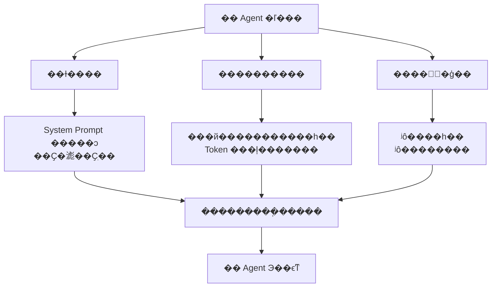
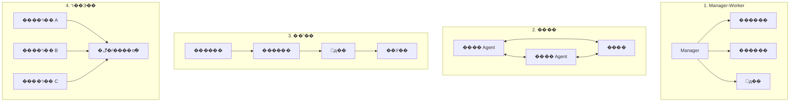
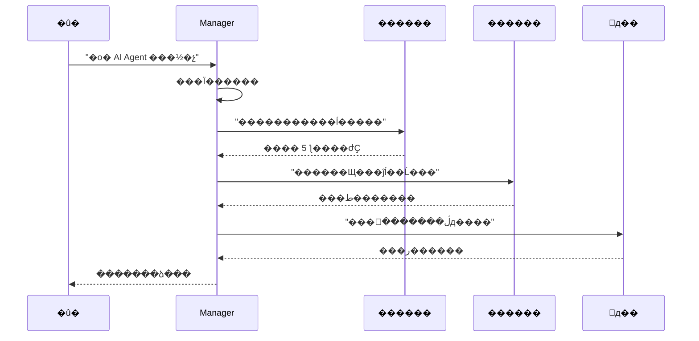
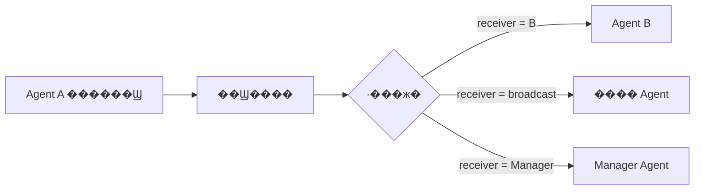
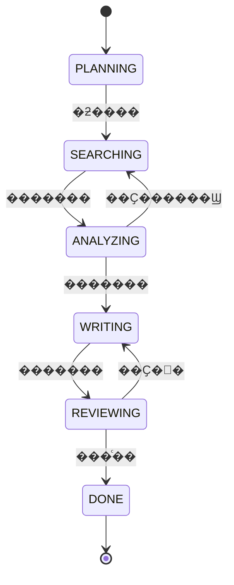
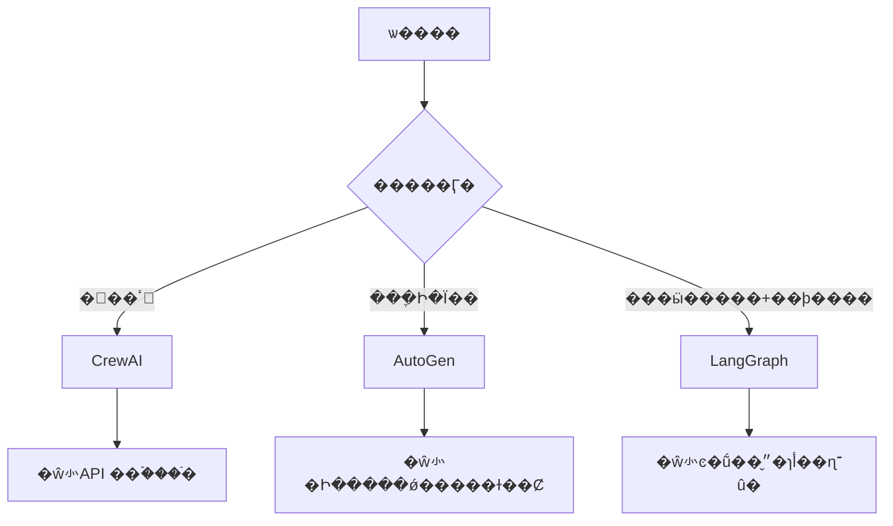
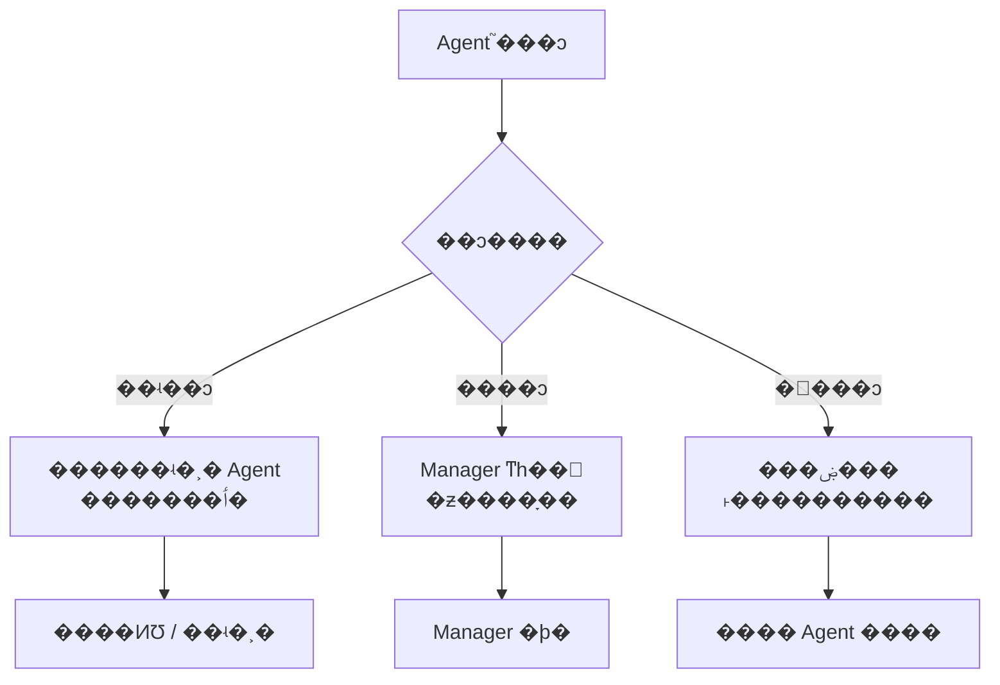
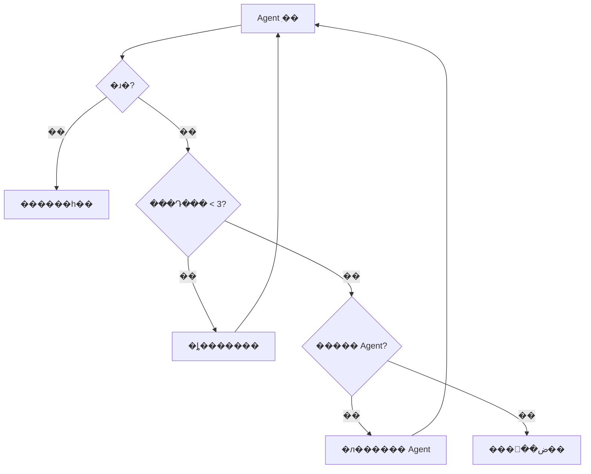

???---
title: �� Agent ϵͳ�����ƣ�
description: �ӽ�ɫ��Ƶ�ͨ��Э���ٵ�״̬�����ϵͳ���ն� Agent Э��ϵͳ����Ʒ���
date: 2024-05-17T09:38:18+08:00
lastmod: 2024-05-17T09:38:18+08:00
weight: 7
tags:
  - ����
  - ��Agent
  - ϵͳ���
  - ��
categories:
  - ������
  - ��������
math: true
mermaid: true
photos:
  - https://d-sketon.top/img/backwebp/bg7.webp
---

## ���Գ�������

> **���Թ�**��������Ҫ���һ��"AI �о�����"ϵͳ�����Զ��������ס��������ݡ�׫д���档������õ� Agent ���Ƕ� Agent������ö� Agent�������ô��ƽ�ɫ��Э�����̣�
>
> **��ѡ��**�����ָ������� Agent �������á��һ��ɶ����ɫ���滮�߸��������������߸�������������߸������ݴ����׫д�߸���������档�� Manager-Worker ���ˣ��滮�ߵ� Manager Э������ Worker��
>
> **���Թ�**��Agent ֮����ôͨ�ţ���������ߺ�׫д�߶Խ����з�����ô�죿Token �ɱ���ô���ƣ�

����һ������ **ϵͳ������� + Agent ��������** �ĸ߽������⡣�� Agent ϵͳ�ǵ�ǰ AI Ӧ�õ�ǰ�ط����漰��ɫ��ơ�ͨ��Э�顢״̬�������ͻ����ȶ��ά�ȡ����Ľ�ϵͳ������������Ʒ����ۡ�

## ���������Ϊʲô��Ҫ�� Agent

### �� Agent ���������

�������Ӷ�����ʱ����������������һ�� Agent �ᵼ������������⣺



| ���� | �� Agent �ı��� | �� Agent ������ |
|------|---------------|----------------|
| **��ɫ����** | һ�� Prompt ��Ҫ�滮��Ҫִ�У������ͻ | ÿ����ɫ Prompt �۽���һְ�� |
| **����������** | ���й��ߡ���ʷ�Ի�����һ������ | ����ɫ���������ģ�������� |
| **�����߽�** | ʲô������ʲô�������� | רҵ���ֹ��������۽� |
| **��ά����** | �޸�һ��Ӱ��ȫ�� | �޸ĵ�����ɫ��Ӱ������ |
| **����չ��** | ������������ Prompt ���� | ������ɫ���� |

### ʲôʱ����ö� Agent

�������г�������Ҫ�� Agent���������ݣ�

| �����Ӷ� | �Ƽ����� | ʾ�� |
|-----------|---------|------|
| �򵥣�1-2 ���� | �� Agent | "������λ�" |
| �еȣ�3-5 ���������� | �� Agent + ���ߵ��� | "���������������ձ�" |
| ���ӣ��ಽ�裬������ | **�� Agent** | "�о��г����Ʋ�׫д��������" |
| �����ӣ���Ҫ����/��֤�� | **�� Agent + ��������** | "����һ��Ͷ�ʾ��ߵķ���" |

## ���ά��һ����ɫ����

### SRP ԭ��

����������е�**��һְ��ԭ��Single Responsibility Principle��** ���� Agent ��ƣ�ÿ����ɫӦ��ֻ��һ�������ԭ��

һ�������Ľ�ɫ��������ĸ�Ҫ�أ�

| Ҫ�� | ���� | ʾ���������ߣ� |
|------|------|--------------|
| **��ݣ�Identity��** | ��ɫ��˭���ó�ʲô | "����һ��ѧ����������ר��" |
| **������Capability��** | �ܵ�����Щ���� | `web_search`��`paper_download` |
| **Լ����Constraint��** | ��Ϊ�߽� | "ֻ���ؽ� 3 �������" |
| **Ŀ�꣨Goal��** | ��ǰ����IJ��� | "�ҵ� 5 ƪ������IJ���ȡ�ؼ���Ϣ" |

```python
from dataclasses import dataclass, field
from typing import Any

@dataclass
class RoleDefinition:
    """��ɫ���壺��ݡ�������Լ����Ŀ��"""
    name: str                          # ��ɫ����
    identity: str                      # �������
    capabilities: list[str]            # �������������ù����б��
    constraints: list[str]             # ��ΪԼ��
    goal: str = ""                     # ��ɫĿ��

    def build_prompt(self) -> str:
        """������Ҫ���Զ����� System Prompt"""
        caps = "\n".join(f"  - {c}" for c in self.capabilities)
        cons = "\n".join(f"  - {c}" for c in self.constraints)
        return f"""���ǡ�{self.name}����
��ݣ�{self.identity}
����������
{caps}
��ΪԼ����
{cons}
��ǰĿ�꣺{self.goal}"""
```

### ��ɫ����ź�

ʲôʱ��Ӧ�ò�ֽ�ɫ�������źų���ʱ��˵����ǰ��ɫ�е��˹���ְ��

- System Prompt ���� 500 Token �Ұ���"ͬʱ"�������Ӵ�
- һ����ɫ��Ҫ���ó��� 5 ������
- ��ͬ����֮���г�ͻ����"������д��"��"�ϸ���ʵ�˲�"��

## ���ά�ȶ���Э������

### �����������˽ṹ



�������˵���ϸ�Աȣ�

| ���˽ṹ | ���Ʒ�ʽ | �ŵ� | ȱ�� | ���ó��� |
|---------|---------|------|------|---------|
| **Manager-Worker** | ���Ļ� | �ṹ����������ʵ�� | Manager ƿ�� | ����ɷֽ�ij��� |
| **����** | ȥ���Ļ� | ���۸��Ͻ� | Token ���Ĵ� | ��Ҫ��֤�ľ��߳��� |
| **��ˮ��** | ˳����ת | ��Ч�����׶β���׼�� | ����Ե� | ���̶̹��ij��� |
| **ר��Э��** | ����ڰ� | ��ר�ҿ����ɲ��� | Э������ | ����ʽ̽������ |

### Manager-Worker ����ʵ��

������õ����ˣ�һ�� Manager Agent ��������滮�ͷ��䣬��� Worker Agent ����ִ�У�



## ���ά������ͨ��Э��

### �ṹ����Ϣ

Agent ֮���ͨ�Ų����������ı��������нṹ������Ϣ��ʽ��������շ��޷��ɿ�������

```python
from enum import Enum
from dataclasses import dataclass, field
from datetime import datetime
from typing import Any

class MessageType(Enum):
    """��Ϣ����ö��"""
    TASK_ASSIGN = "task_assign"      # �������
    RESULT_REPORT = "result_report"  # ����㱨
    QUESTION = "question"            # ����
    FEEDBACK = "feedback"            # ����
    HANDOFF = "handoff"              # �ƽ�

@dataclass
class AgentMessage:
    """�ṹ���� Agent ����Ϣ"""
    sender: str                        # �����߽�ɫ��
    receiver: str                      # �����߽�ɫ��
    msg_type: MessageType              # ��Ϣ����
    content: str                       # ��Ϣ����
    context: dict[str, Any] = field(default_factory=dict)  # ����������
    timestamp: str = field(default_factory=lambda: datetime.now().isoformat())

    def to_dict(self) -> dict:
        return {
            "sender": self.sender,
            "receiver": self.receiver,
            "msg_type": self.msg_type.value,
            "content": self.content,
            "context": self.context,
            "timestamp": self.timestamp,
        }
```

### ��Ϣ·��



## ���ά���ģ�״̬����

### ״̬��ģʽ��FSM��

�������̶̹��Ķ� Agent ϵͳ������״̬����FSM������ɿ���״̬�����ʽ��



```python
from enum import Enum, auto

class WorkflowState(Enum):
    """������״̬ö��"""
    PLANNING = auto()
    SEARCHING = auto()
    ANALYZING = auto()
    WRITING = auto()
    REVIEWING = auto()
    DONE = auto()

class WorkflowStateMachine:
    """����״̬��������� Agent ������"""

    # �Ϸ���״̬ת��
    TRANSITIONS = {
        WorkflowState.PLANNING: {WorkflowState.SEARCHING},
        WorkflowState.SEARCHING: {WorkflowState.ANALYZING},
        WorkflowState.ANALYZING: {
            WorkflowState.SEARCHING,  # ������Ҫ���˲�������
            WorkflowState.WRITING,
        },
        WorkflowState.WRITING: {WorkflowState.REVIEWING},
        WorkflowState.REVIEWING: {
            WorkflowState.WRITING,    # �˻��޸�
            WorkflowState.DONE,
        },
        WorkflowState.DONE: set(),
    }

    def __init__(self):
        self.state = WorkflowState.PLANNING
        self.history: list[WorkflowState] = []

    def transition(self, new_state: WorkflowState):
        """״̬ת�ƣ����Ϸ��Լ�飩"""
        if new_state not in self.TRANSITIONS.get(self.state, set()):
            raise ValueError(
                f"�Ƿ�״̬ת��: {self.state.name} -> {new_state.name}"
            )
        self.history.append(self.state)
        self.state = new_state

    def is_done(self) -> bool:
        return self.state == WorkflowState.DONE
```

### �ڰ�ģʽ

���ڿ���ʽЭ���������ڰ�ģʽ��Blackboard������������ Agent ����һ��"�ڰ�"�����Զ�д�Լ�����IJ��֣�

```python
from dataclasses import dataclass, field
from typing import Any

@dataclass
class Blackboard:
    """����ڰ壺���� Agent �ɶ�д"""
    topic: str = ""                          # �����
    search_results: list[dict] = field(default_factory=list)  # �������
    analysis: dict[str, Any] = field(default_factory=dict)    # ��������
    draft: str = ""                          # �������
    feedback: list[str] = field(default_factory=list)         # ������
    metadata: dict[str, Any] = field(default_factory=dict)    # Ԫ����

    def get_section(self, key: str) -> Any:
        """��ȡij������"""
        return getattr(self, key, None)

    def update_section(self, key: str, value: Any):
        """����ij������"""
        if hasattr(self, key):
            setattr(self, key, value)
        else:
            self.metadata[key] = value
```

����״̬����ģʽ�ĶԱȣ�

| ά�� | ״̬����FSM�� | �ڰ�ģʽ |
|------|-------------|---------|
| **���Ʒ�ʽ** | ����ʽ���ϸ����� | ��ɢʽ������Э�� |
| **�����** | �ͣ��̶����̣� | �ߣ���̬���룩 |
| **��Ԥ����** | �� | �� |
| **���ó���** | ���̶̹������� | ����ʽ̽�� |
| **�����Ѷ�** | �� | �� |

## ��ܶԱ�

### LangGraph vs AutoGen vs CrewAI

| �� | LangGraph | AutoGen | CrewAI |
|------|-----------|---------|--------|
| **���ij���** | ͼ���ڵ�+�ߣ� | �Ի���Conversation�� | ��ɫ+���� |
| **״̬����** | ����ͼ״̬ | �Ի���ʷ | ���������� |
| **����֧��** | ��������ͼ | �Ի�/��ˮ�� | ��ˮ��/�㼶 |
| **ѧϰ����** | ���� | �е� | ƽ�� |
| **�����** | ��� | �� | �� |
| **�ʺϳ���** | ���ӹ����� | ���ֶԻ� | ���ٴ |
| **�����Ŷ�** | LangChain | Microsoft | CrewAI Inc. |



## ����ʾ�������ɫ�о�����

����ʵ��һ�������� Manager-Worker ���˵��о�����ϵͳ��

```python
"""
���ɫ�о����֣�Manager + ������ + ������ + ׫д��
ʹ�� Manager-Worker ���� + ����״̬������
"""
import json
from abc import ABC, abstractmethod

# ========== ��ɫ���� ==========

class BaseAgent(ABC):
    """Agent ����"""

    def __init__(self, name: str, system_prompt: str):
        self.name = name
        self.system_prompt = system_prompt
        self.messages: list[dict] = []

    @abstractmethod
    async def run(self, task: str, context: dict) -> str:
        """ִ�����񣬷��ؽ��"""
        pass

    def _add_message(self, role: str, content: str):
        self.messages.append({"role": role, "content": content})

    def reset(self):
        """����������"""
        self.messages = []


# ========== �����ɫʵ�� ==========

class SearchAgent(BaseAgent):
    """�����ߣ����������Ϣ"""

    def __init__(self):
        super().__init__(
            name="������",
            system_prompt=(
                "����һ��ѧ������ר�ҡ�"
                "���ݸ������о����⣬����������ĺ����ϡ�"
                "���ؽṹ������������б��"
            ),
        )

    async def run(self, task: str, context: dict) -> str:
        self._add_message("user", f"�������⣺{task}")
        # ʵ�ʵ��� LLM + ��������
        results = [
            {"title": "Agent ���� 1", "summary": "���ڶ�AgentЭ��..."},
            {"title": "Agent ���� 2", "summary": "���ڹ��ߵ���..."},
        ]
        context["search_results"] = results
        return json.dumps(results, ensure_ascii=False)


class AnalysisAgent(BaseAgent):
    """�����ߣ��������ݴ���ͽ�������"""

    def __init__(self):
        super().__init__(
            name="������",
            system_prompt=(
                "����һ�����ݷ���ר�ҡ�"
                "��������������������Ĺ��ס����ƺͲ��㡣"
                "���ؽṹ���ķ������ۡ�"
            ),
        )

    async def run(self, task: str, context: dict) -> str:
        search_results = context.get("search_results", [])
        self._add_message(
            "user",
            f"�����������������\n{json.dumps(search_results, ensure_ascii=False)}",
        )
        # ʵ�ʵ��� LLM
        analysis = {
            "key_findings": ["��AgentЭ������������", "���ߵ��ÿɿ�����ʹ��"],
            "trends": "�ӵ�Agent���Agent�ݽ�",
            "gaps": "ȱ�ٱ�׼��ͨ��Э��",
        }
        context["analysis"] = analysis
        return json.dumps(analysis, ensure_ascii=False)


class WriterAgent(BaseAgent):
    """׫д�ߣ����𱨸�����"""

    def __init__(self):
        super().__init__(
            name="׫д��",
            system_prompt=(
                "����һ������д��ר�ҡ�"
                "���ݷ�������׫д�ṹ���о����档"
                "����Ӧ���������������ķ��֡����Ʒ��������ۡ�"
            ),
        )

    async def run(self, task: str, context: dict) -> str:
        analysis = context.get("analysis", {})
        self._add_message(
            "user",
            f"�������·���׫д���棺\n{json.dumps(analysis, ensure_ascii=False)}",
        )
        # ʵ�ʵ��� LLM
        report = f"""# �о����棺{task}

## ����
{analysis.get('trends', '')}

## ���ķ���
"""
        for finding in analysis.get("key_findings", []):
            report += f"- {finding}\n"
        report += f"\n## �о��հ�\n- {analysis.get('gaps', '')}\n"
        return report


# ========== Manager Agent ==========

class ManagerAgent(BaseAgent):
    """Manager����������滮������ͽ������"""

    def __init__(self):
        super().__init__(
            name="�滮��",
            system_prompt=(
                "�����о��Ŷӵ� Manager��"
                "���ְ���ǣ�������񡢷�������ʵ��Ŷӳ�Ա�����ܽ����"
                "����Ծ����Ƿ���Ҫ������Ϣ�����˵������׶Σ���"
            ),
        )
        self.search_agent = SearchAgent()
        self.analysis_agent = AnalysisAgent()
        self.writer_agent = WriterAgent()
        self.fsm = WorkflowStateMachine()

    async def run(self, task: str) -> str:
        """ִ���������о�������"""
        context: dict = {"topic": task}

        # �׶� 1���滮
        self._add_message("user", f"�����{task}")
        self.fsm.transition(WorkflowState.SEARCHING)

        # �׶� 2������
        await self.search_agent.run(task, context)
        self.fsm.transition(WorkflowState.ANALYZING)

        # �׶� 3������
        await self.analysis_agent.run(task, context)

        # Manager �ж��Ƿ���Ҫ��������
        if self._needs_more_info(context):
            self.fsm.transition(WorkflowState.SEARCHING)
            await self.search_agent.run(f"{task} ����", context)
            self.fsm.transition(WorkflowState.ANALYZING)
            await self.analysis_agent.run(task, context)

        self.fsm.transition(WorkflowState.WRITING)

        # �׶� 4��׫д
        report = await self.writer_agent.run(task, context)
        self.fsm.transition(WorkflowState.REVIEWING)

        # �׶� 5����У��Manager �Լ�����
        final_report = self._review(report)
        self.fsm.transition(WorkflowState.DONE)

        return final_report

    def _needs_more_info(self, context: dict) -> bool:
        """�ж��Ƿ���Ҫ��������"""
        analysis = context.get("analysis", {})
        return len(analysis.get("key_findings", [])) < 3

    def _review(self, report: str) -> str:
        """����У"""
        return report + "\n\n---\n*�������ɶ� Agent ϵͳ�Զ�����*"


# ========== ���� ==========

import asyncio

async def main():
    manager = ManagerAgent()
    report = await manager.run("�� Agent ϵͳ�����½�չ")
    print(report)
    print(f"\n״̬��ʷ: {[s.name for s in manager.fsm.history]}")

asyncio.run(main())
```

## ׷������

### Q1��Agent ֮���ͻ��ô�����

**���Թ�׷��**����������Ϊ������ A��׫д��д�� B�����߲�һ����ô�죿

**�ش�Ҫ��**��



| ��ͻ���� | ������� | ʵ�ַ�ʽ |
|---------|---------|---------|
| ��ʵ��ͻ | ������ʵ�˲� Agent | �������ٲ� + ������֤ |
| ����ͻ | Manager �ƶ�ͳһ��׼ | ȫ�ַ��ָ�� |
| �߼���ͻ | ���ۻ��� | ˫���������ɣ��������� |
| ���ȼ���ͻ | Manager �þ� | ͳһ���� |

### Q2����ο��� Token �ɱ���

**���Թ�׷��**���� Agent ϵͳ�� Token �����ǵ� Agent �ĺü�������ô���ƣ�

**�ش�Ҫ��**��

| ���� | ��ʡ���� | ʵ�ַ�ʽ |
|------|---------|---------|
| **ģ�ͷּ�** | 50%-70% | Manager �ô�ģ�ͣ�Worker ��Сģ�� |
| **������ѹ��** | 30%-50% | ����ժҪ����������ʷ |
| **���渴��** | 20%-40% | ��ͬ���󻺴��� |
| **��ǰ��ֹ** | 10%-30% | ��������ʱ�������� Agent |
| **������** | 20%-40% | ������������������� |

```python
# ģ�ͷּ�����
class ModelRouter:
    """���ݽ�ɫ�������Ӷ�ѡ��ģ��"""

    MODEL_MAP = {
        "�滮��": "gpt-4o",        # ���������ô�ģ��
        "������": "gpt-4o-mini",   # ��������Сģ��
        "������": "gpt-4o",        # ��Ҫ�����ô�ģ��
        "׫д��": "gpt-4o-mini",   # д������Сģ��
    }

    def get_model(self, role: str, complexity: str = "medium") -> str:
        base = self.MODEL_MAP.get(role, "gpt-4o-mini")
        if complexity == "high":
            return "gpt-4o"  # ������������ģ��
        return base
```

### Q3����α�֤ϵͳ�Ŀɿ��ԣ�

**�ش�Ҫ��**��

- **��ʱ����**��ÿ�� Agent ����ִ�г�ʱ���������޵ȴ�
- **���Ի���**������ Agent ʧ��ʱ�Զ����Ի򽵼�
- **���ײ���**������ Agent ʧ��ʱ����Ĭ�Ͻ�����DZ���
- **״̬�־û�**���ؼ�״̬�־û������ݿ⣬֧�ֶϵ�ָ�
- **��־׷��**����¼ÿ�� Agent ��������������ڵ���



## ����

�� Agent ϵͳ����� AI Ӧ�ô�"���"����"��������Ʒ"�Ĺؼ��������������ԭ��

1. **��ɫ�����ѭ SRP**����ÿ����ɫְ��һ��Prompt �۽�
2. **����ѡ�񿴳���**����Manager-Worker ��ͨ�ã������ʺ���֤����ˮ���ʺϹ̶�����
3. **ͨ�ű���ṹ��**���������ı�ͨ�Ų��ɿ�����ö������ + JSON �ṹ
4. **״̬����ѡ��ģʽ**�������̶̹��� FSM������̽���úڰ�ģʽ
5. **Token �ɱ�Ҫ����**����ģ�ͷּ� + ������ѹ�� + ���渴��

��ס���� Agent ����Խ��Խ�á��ܵ� Agent ��������ⲻҪ�������Ϊ�� Agent����ֵ�Ψһ��׼�ǣ�**�� Agent �Ƿ��Ѿ���������**��

## �����

1. Wu Q, et al. AutoGen: Enabling Next-Gen LLM Applications via Multi-Agent Conversation. 2023.
2. LangGraph Documentation. https://langchain-ai.github.io/langgraph/
3. CrewAI Documentation. https://docs.crewai.com/
4. Park J S, et al. Generative Agents: Interactive Simulacra of Human Behavior. 2023.
5. Wang L, et al. A Survey on Large Language Model based Multi-Agents. 2024.
