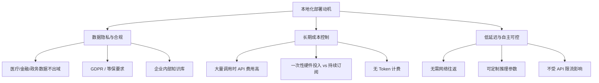
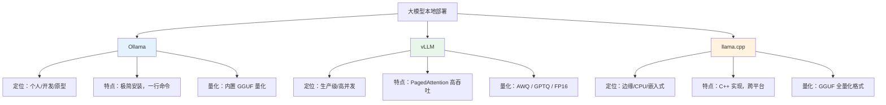
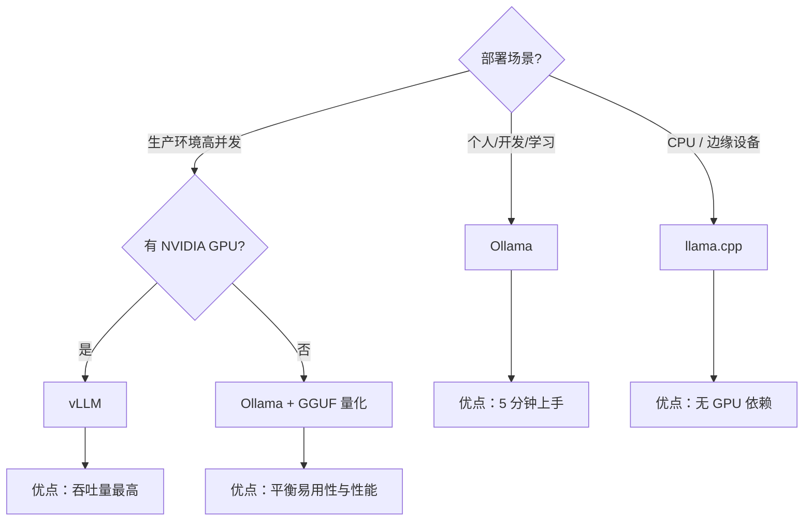
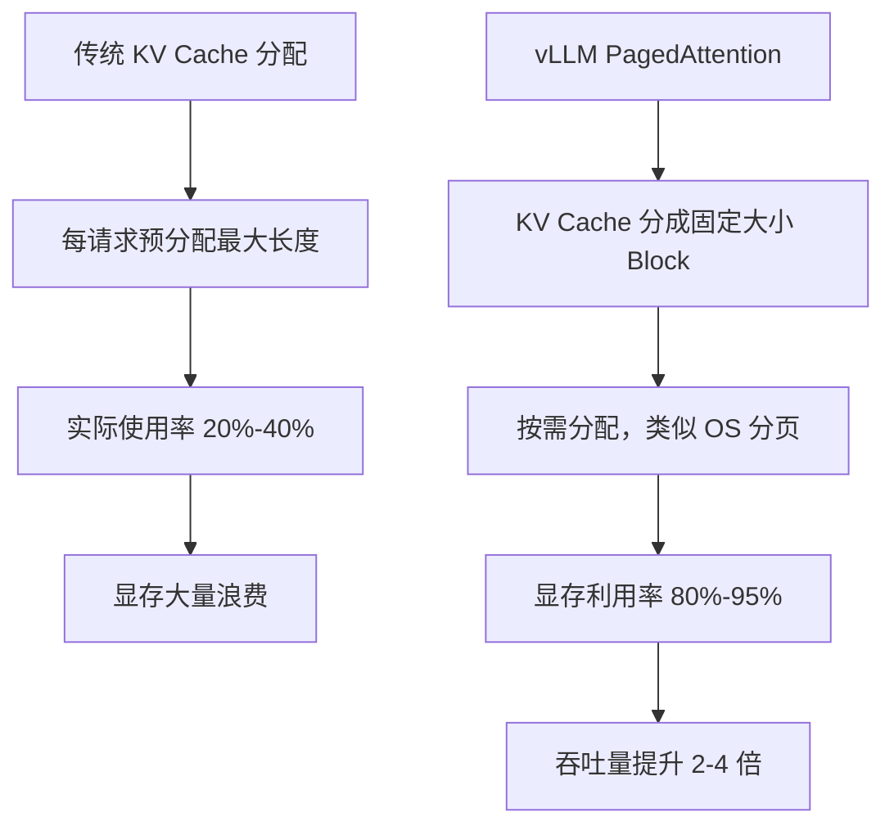
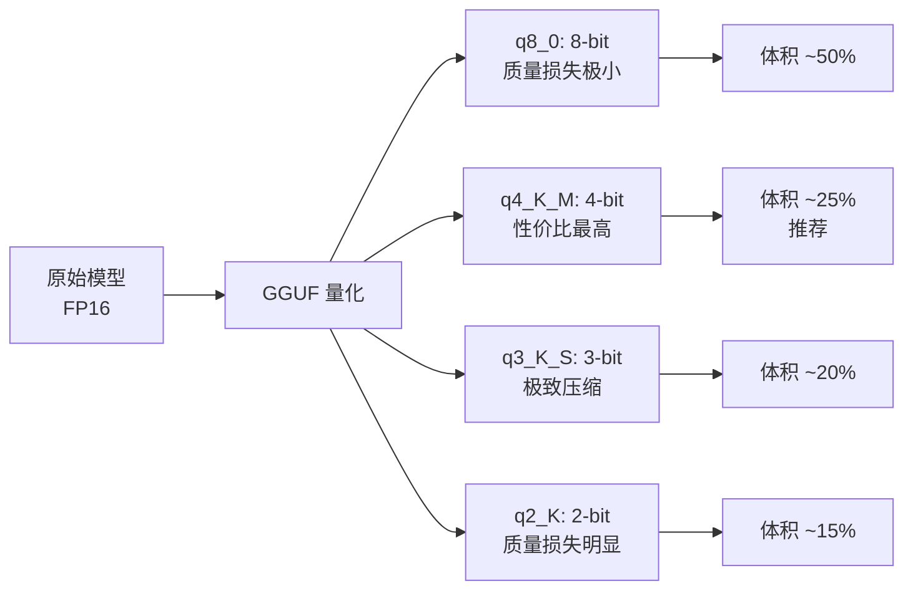
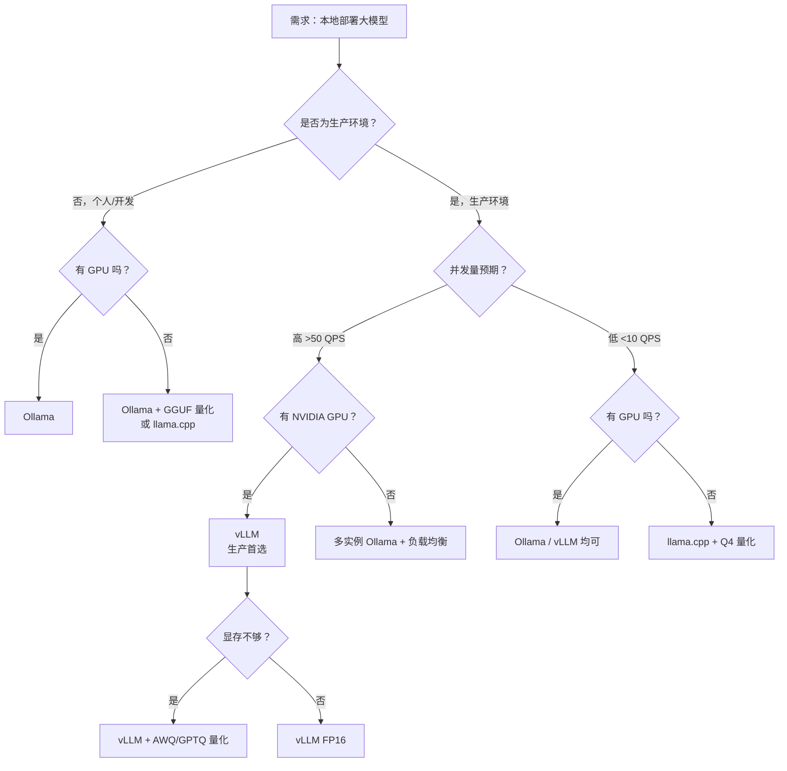
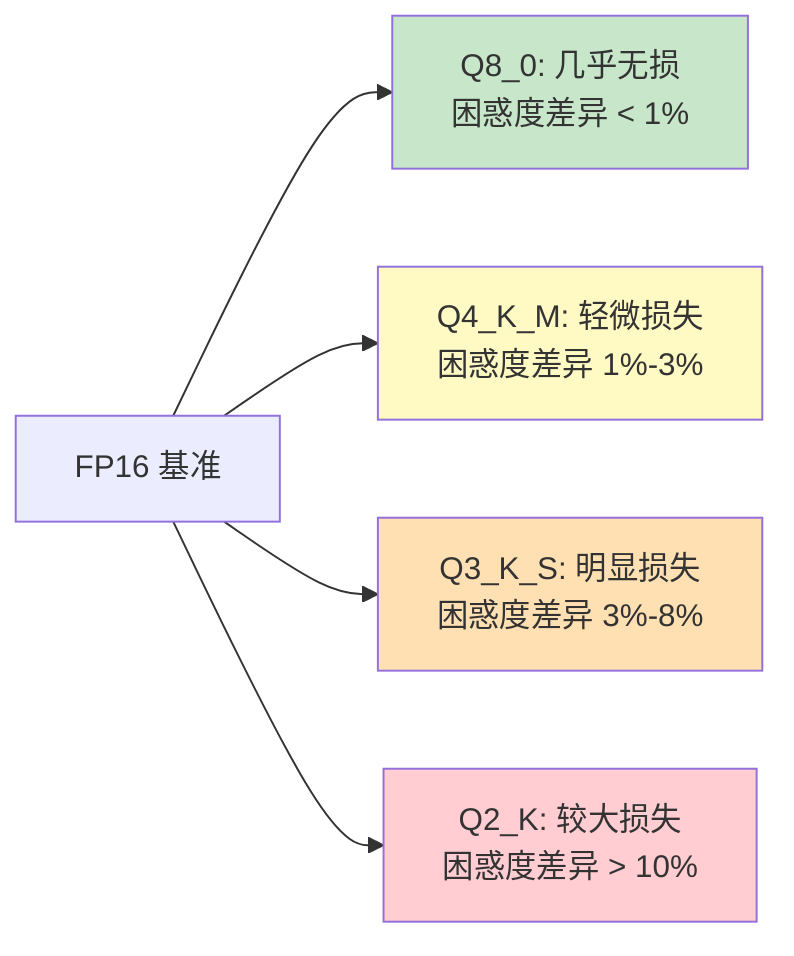
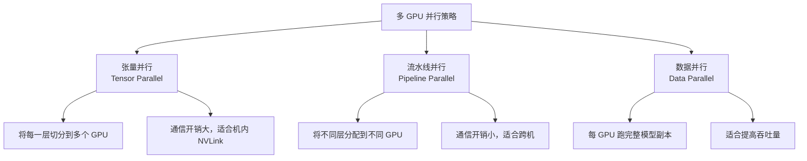
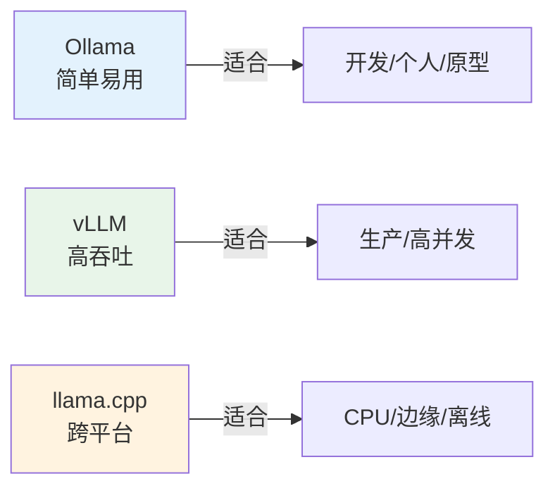

## 面试场景描述

> **面试官**：我们公司有一些敏感数据不能上云，但业务又需要用到大模型能力。你了解大模型的本地化部署方案吗？如果让你来选型，你会怎么选？Ollama、vLLM、llama.cpp 这些方案有什么区别？

这道题考察的是 **大模型工程化的全链路能力**。本地化部署不仅仅是"把模型跑起来"这么简单，它涉及模型量化、推理引擎选型、API 服务封装、资源调度、性能调优等多个环节。面试官想听到的是你对不同方案的**适用场景**和**取舍逻辑**有清晰认知。

在数据合规要求日益严格的背景下，本地化部署已经成为企业 AI 落地的刚需能力。

## 问题分析：为什么要本地部署

在讨论"怎么部署"之前，先明确"为什么要部署"。本地化部署的核心驱动力有三点：



| 维度 | 云端 API（如 GPT-4） | 本地部署 |
|------|----------------------|----------|
| 数据隐私 | 数据需传输到第三方 | **数据全程不出本地** |
| 单次成本 | 按 Token 计费，量大则贵 | 硬件一次性投入，边际成本趋近 0 |
| 延迟 | 200ms-2s（含网络） | **10ms-500ms（本地推理）** |
| 模型选择 | 限于厂商提供的模型 | **可部署任意开源模型** |
| 运维复杂度 | 零运维 | **需要 GPU/运维能力** |
| 效果上限 | 顶级商业模型 | 取决于开源模型能力 |
| 并发能力 | 受 API 限流 | **受本地算力限制** |

> **经验法则**：当日调用量超过约 50 万 Token 时，本地部署的 TCO（总拥有成本）通常低于云端 API。但数据隐私和合规要求是更优先的决策因素。

## 三大方案对比

目前主流的本地化部署方案有三种，各有定位：

### 方案全景图



### 核心对比表

| 对比维度 | Ollama | vLLM | llama.cpp |
|----------|--------|------|-----------|
| **定位** | 开发者工具/原型验证 | 生产级推理服务 | 边缘设备/CPU 推理 |
| **安装难度** | 极简（一行命令） | 中等（需 Python+CUDA 环境） | 中等（需编译） |
| **语言** | Go + C++ | Python + CUDA | C/C++ |
| **GPU 要求** | 可选（支持 CPU） | **必需**（NVIDIA GPU） | 可选（GPU 加速可选） |
| **量化格式** | GGUF（内置） | AWQ / GPTQ / FP16 | GGUF（原生支持） |
| **并发能力** | 低（单请求优化） | **极高**（PagedAttention） | 低 |
| **吞吐量** | 中 | **最高** | 低 |
| **API 兼容** | OpenAI 兼容 | OpenAI 兼容 | 需自行封装 |
| **适用模型** | 主流开源模型 | 主流开源模型 | 几乎所有 GGUF 模型 |
| **模型管理** | 内置 pull/run | 手动下载 | 手动管理 |
| **社区生态** | 非常活跃 | 非常活跃 | 活跃 |

### 如何选择



## 方案一：Ollama —— 极简部署

Ollama 是目前最易用的大模型本地运行工具，理念是"Docker for LLMs"——像管理容器一样管理模型。

### 安装与模型拉取

```bash
# macOS / Linux 安装
curl -fsSL https://ollama.com/install.sh | sh

# Windows 直接下载安装包
# https://ollama.com/download/windows

# 拉取并运行模型（自动下载量化版）
ollama run qwen2.5:7b          # 通义千问 7B
ollama run llama3.1:8b          # Llama 3.1 8B
ollama run deepseek-r1:7b       # DeepSeek-R1 蒸馏版

# 查看已下载的模型
ollama list

# 启动 API 服务（默认端口 11434）
ollama serve
```

### Modelfile 自定义

```dockerfile
# Modelfile（类似 Dockerfile）
FROM qwen2.5:7b

# 调整推理参数
PARAMETER temperature 0.7
PARAMETER top_p 0.9
PARAMETER num_ctx 4096

# 设置系统提示词
SYSTEM """
你是一个专业的中文编程助手，请用简洁清晰的中文回答问题。
"""

# 创建自定义模型
# ollama create my-assistant -f Modelfile
```

### API 调用

```python
import requests

# Ollama 原生 API
response = requests.post("http://localhost:11434/api/chat", json={
    "model": "qwen2.5:7b",
    "messages": [{"role": "user", "content": "用 Python 实现快速排序"}],
    "stream": False,
})
print(response.json()["message"]["content"])

# 也兼容 OpenAI SDK
from openai import OpenAI

client = OpenAI(base_url="http://localhost:11434/v1", api_key="ollama")
response = client.chat.completions.create(
    model="qwen2.5:7b",
    messages=[{"role": "user", "content": "解释什么是 RAG"}],
)
print(response.choices[0].message.content)
```

> **适用场景**：本地开发调试、个人助手、原型验证、中小规模内部工具。单机并发 5-10 请求时表现良好。

## 方案二：vLLM —— 生产级高吞吐

vLLM 是目前**吞吐量最高**的开源推理引擎，核心创新是 PagedAttention 技术。

### PagedAttention 原理

传统推理引擎为每个请求预分配一大块 KV Cache 显存，导致大量浪费。vLLM 借鉴操作系统的**虚拟内存分页机制**，将 KV Cache 分成固定大小的"页"（Block），按需分配：



| 指标 | 传统推理 | vLLM (PagedAttention) |
|------|----------|----------------------|
| KV Cache 利用率 | 20%-40% | **80%-95%** |
| 吞吐量 | 基准 | **2-4x** |
| 支持并发 | 有限 | **高并发** |
| Continuous Batching | 不支持 | **支持** |

**Continuous Batching（连续批处理）** 是 vLLM 的另一个关键优化：不同于传统 static batching 必须等一批中最长的请求生成完才处理下一批，vLLM 可以在任意 token 位置动态加入新请求、移除已完成请求，大幅提升 GPU 利用率。

### 安装与启动

```bash
# 安装 vLLM（需要 NVIDIA GPU + CUDA）
pip install vllm

# 启动 OpenAI 兼容 API 服务
python -m vllm.entrypoints.openai.api_server \
    --model Qwen/Qwen2.5-7B-Instruct \
    --tensor-parallel-size 1 \
    --gpu-memory-utilization 0.9 \
    --max-model-len 32768 \
    --port 8000 \
    --trust-remote-code
```

### 关键启动参数

| 参数 | 说明 | 推荐值 |
|------|------|--------|
| `--model` | 模型路径或 HuggingFace ID | 如 `Qwen/Qwen2.5-7B-Instruct` |
| `--tensor-parallel-size` | 张量并行 GPU 数 | 1/2/4（根据 GPU 数量） |
| `--gpu-memory-utilization` | GPU 显存使用比例 | 0.85-0.95 |
| `--max-model-len` | 最大上下文长度 | 根据模型支持设置 |
| `--quantization` | 量化方法 | `awq` / `gptq` / `fp8` |
| `--enable-lora` | 启用 LoRA 适配器 | 需要多 LoRA 时开启 |

### 量化模型部署

```bash
# 部署 AWQ 量化模型（显存占用减少约 50%）
python -m vllm.entrypoints.openai.api_server \
    --model Qwen/Qwen2.5-7B-Instruct-AWQ \
    --quantization awq \
    --gpu-memory-utilization 0.9

# 部署 GPTQ 量化模型
python -m vllm.entrypoints.openai.api_server \
    --model TheBloke/Llama-3-8B-Instruct-GPTQ \
    --quantization gptq
```

### API 调用

```python
from openai import OpenAI

# vLLM 完全兼容 OpenAI API
client = OpenAI(base_url="http://localhost:8000/v1", api_key="vllm")

# 对话
response = client.chat.completions.create(
    model="Qwen/Qwen2.5-7B-Instruct",
    messages=[{"role": "user", "content": "解释 PagedAttention 的原理"}],
    max_tokens=512,
    temperature=0.7,
)
print(response.choices[0].message.content)

# 嵌入向量（vLLM 也支持 Embedding 模型）
embedding = client.embeddings.create(
    model="BAAI/bge-large-zh-v1.5",
    input=["这是一个测试句子"],
)
print(f"向量维度: {len(embedding.data[0].embedding)}")
```

> **适用场景**：企业生产环境、高并发 API 服务、需要支撑大量用户同时访问的场景。单卡 A100 可支撑数十甚至上百并发。

## 方案三：llama.cpp —— CPU/边缘部署

llama.cpp 是用纯 C/C++ 实现的 LLM 推理引擎，最大优势是**不依赖 GPU**，可以在纯 CPU 环境甚至树莓派上运行模型。

### GGUF 量化格式

llama.cpp 的核心是 GGUF（GPT-Generated Unified Format）量化格式：



| 量化级别 | 位宽 | 7B 模型体积 | 质量损失 | 推荐场景 |
|----------|------|------------|----------|----------|
| FP16 | 16-bit | ~14 GB | 无 | 有 GPU，追求质量 |
| Q8_0 | 8-bit | ~7 GB | 极小 | CPU 推理，质量优先 |
| **Q4_K_M** | 4-bit | **~4 GB** | **轻微** | **★ 最佳性价比** |
| Q3_K_S | 3-bit | ~3 GB | 明显 | 内存极度受限 |
| Q2_K | 2-bit | ~2.5 GB | 较大 | 不推荐生产使用 |

### 编译与运行

```bash
# 克隆并编译
git clone https://github.com/ggerganov/llama.cpp
cd llama.cpp

# CPU 编译
cmake -B build
cmake --build build --config Release

# GPU 编译（CUDA）
cmake -B build -DGGML_CUDA=ON
cmake --build build --config Release

# 下载 GGUF 模型（从 HuggingFace）
# 例如: https://huggingface.co/Qwen/Qwen2.5-7B-Instruct-GGUF

# 启动 OpenAI 兼容 API 服务
./build/bin/llama-server \
    -m qwen2.5-7b-instruct-q4_k_m.gguf \
    --host 0.0.0.0 --port 8080 \
    -c 4096 \
    -n 512
```

### Python 绑定

```python
# 使用 llama-cpp-python
# pip install llama-cpp-python
from llama_cpp import Llama

llm = Llama(
    model_path="./models/qwen2.5-7b-instruct-q4_k_m.gguf",
    n_ctx=4096,       # 上下文长度
    n_threads=8,      # CPU 线程数
    n_gpu_layers=35,  # 放到 GPU 的层数（0 = 纯 CPU）
)

response = llm.create_chat_completion(
    messages=[{"role": "user", "content": "用三句话介绍量子计算"}],
    max_tokens=256,
    temperature=0.7,
)
print(response["choices"][0]["message"]["content"])
```

> **适用场景**：无 GPU 的服务器、边缘设备（树莓派、Jetson）、离线环境、嵌入式设备、对延迟不敏感的内部工具。

## 选型决策树

综合以上三种方案，完整的选型决策流程如下：



## 追问延伸

### 追问一：如何评估部署后的性能？

大模型推理性能评估的核心指标：

| 指标 | 含义 | 说明 |
|------|------|------|
| **TTFT**（Time To First Token） | 首 Token 延迟 | 影响用户体感，应 < 500ms |
| **TPOT**（Time Per Output Token） | 每个输出 Token 耗时 | 影响生成速度，应 < 50ms |
| **Throughput**（吞吐量） | 每秒处理 Token 数 | 影响并发能力 |
| **QPS**（Queries Per Second） | 每秒请求数 | 并发指标 |
| **显存占用** | GPU Memory | 决定最大 batch size |

```python
# 性能压测脚本
import asyncio
import time
import aiohttp

async def benchmark(url: str, num_requests: int = 20):
    """并发压测"""
    async with aiohttp.ClientSession() as session:
        tasks = []
        for i in range(num_requests):
            task = send_request(session, url, f"测试请求 {i}")
            tasks.append(task)

        start = time.time()
        results = await asyncio.gather(*tasks)
        total_time = time.time() - start

    total_tokens = sum(r[1] for r in results)
    print(f"并发数: {num_requests}")
    print(f"总耗时: {total_time:.2f}s")
    print(f"吞吐量: {total_tokens / total_time:.1f} tokens/s")
    print(f"平均延迟: {total_time / num_requests:.2f}s")

async def send_request(session, url, prompt):
    start = time.time()
    async with session.post(f"{url}/v1/chat/completions", json={
        "model": "qwen2.5:7b",
        "messages": [{"role": "user", "content": prompt}],
        "max_tokens": 100,
    }) as resp:
        data = await resp.json()
    elapsed = time.time() - start
    tokens = data["usage"]["completion_tokens"]
    return elapsed, tokens

asyncio.run(benchmark("http://localhost:11434", num_requests=20))
```

### 追问二：量化对效果影响多大？

量化本质上是用精度换空间和速度，但不同量化级别的损失差异很大：



> **经验数据**：在一个中文问答评测集上，Qwen2.5-7B 模型从 FP16 到 Q4_K_M，准确率从 72.3% 下降到 70.1%（下降 2.2 个百分点），但显存从 14GB 降到 4GB，推理速度反而提升。对于大多数应用场景，**Q4_K_M 是质量和效率的最佳平衡点**。

### 追问三：多 GPU 如何部署大模型？

当单个 GPU 装不下大模型（如 70B 模型需要约 140GB 显存），需要多 GPU 并行：



```bash
# vLLM 多 GPU 张量并行（4 卡）
python -m vllm.entrypoints.openai.api_server \
    --model Qwen/Qwen2.5-72B-Instruct-AWQ \
    --tensor-parallel-size 4 \
    --gpu-memory-utilization 0.9 \
    --max-model-len 8192

# Ollama 多 GPU（自动检测，也可手动指定）
CUDA_VISIBLE_DEVICES=0,1 ollama run qwen2.5:72b
```

## 小结

大模型本地化部署的核心是**根据场景选对工具**：



面试中回答这道题，建议按"**需求分析 → 方案对比 → 选型推荐 → 量化策略 → 性能评估**"的逻辑展开。关键是要展示出：你不是只知道一个工具，而是理解每种方案的**设计哲学**和**适用边界**，能根据实际约束做出合理取舍。
