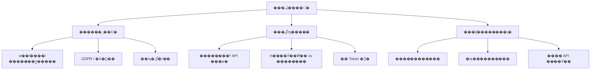
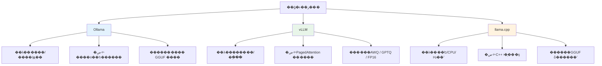
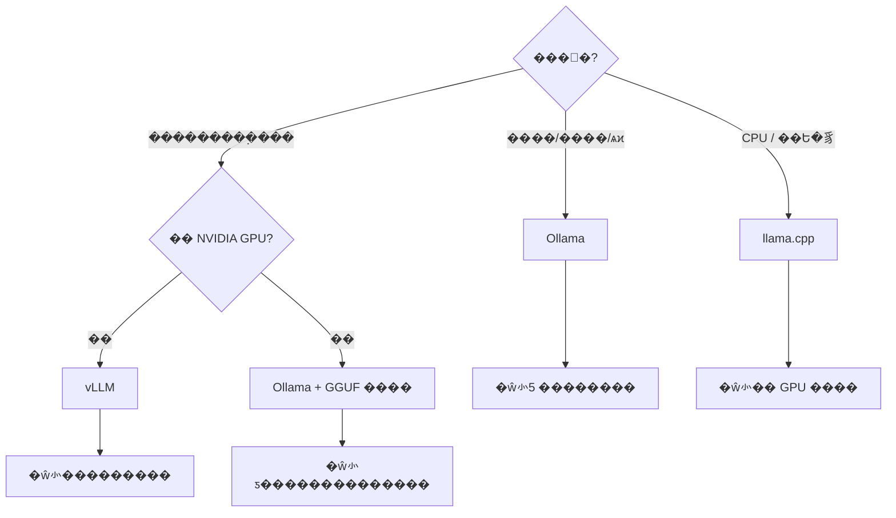
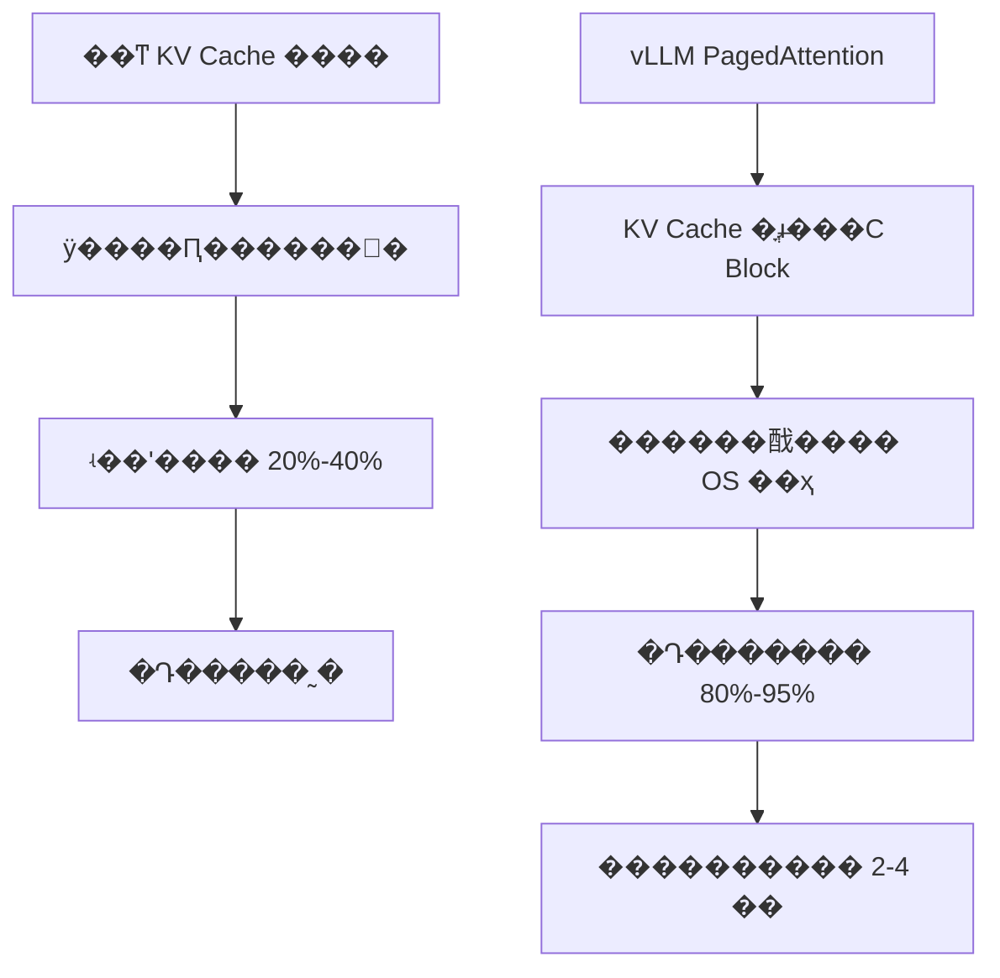
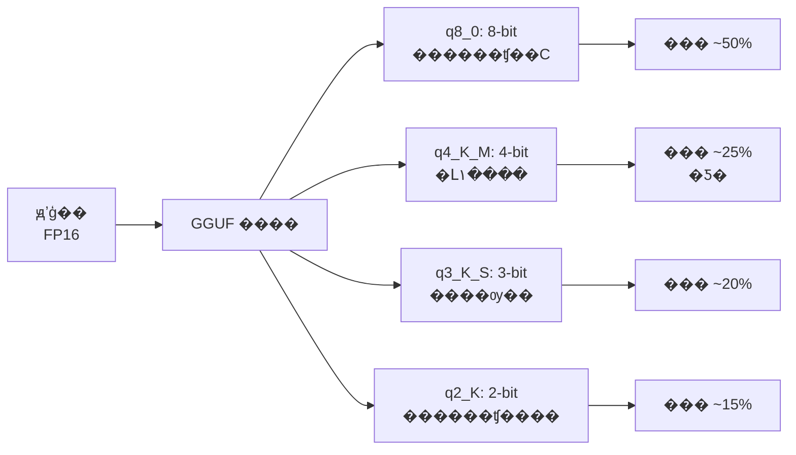
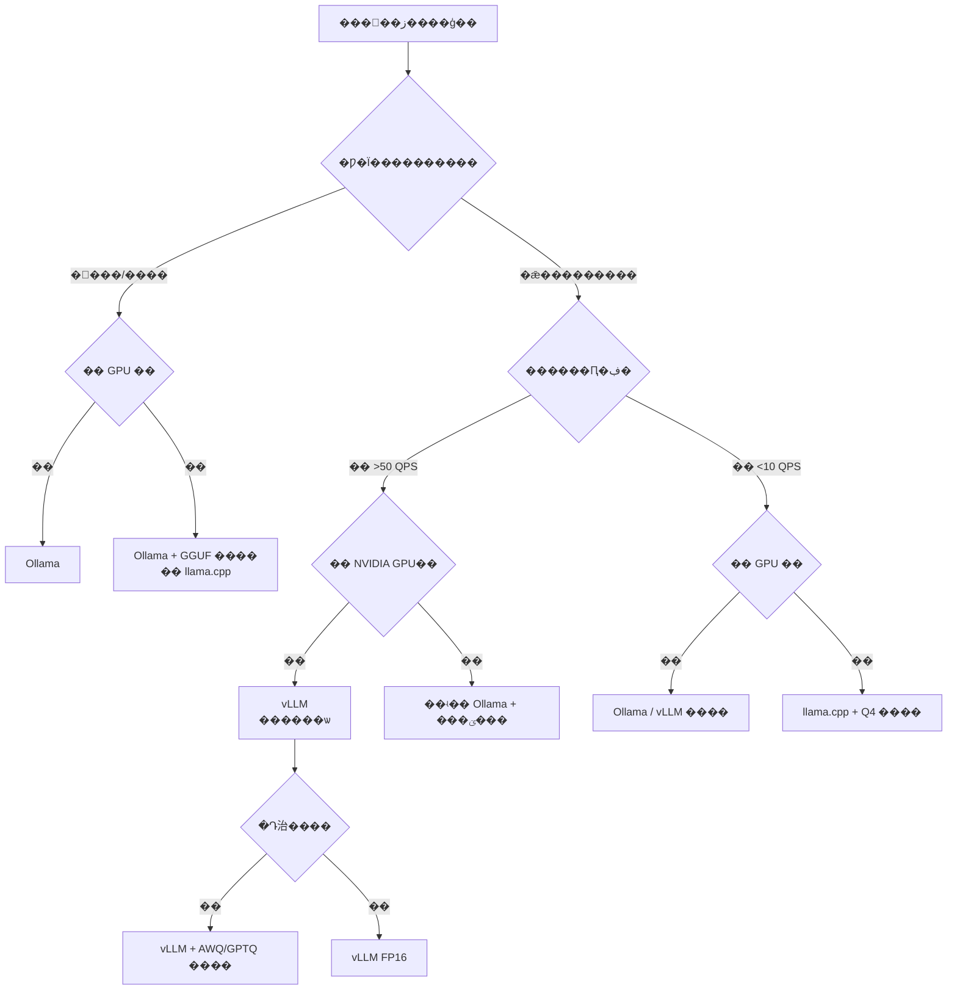
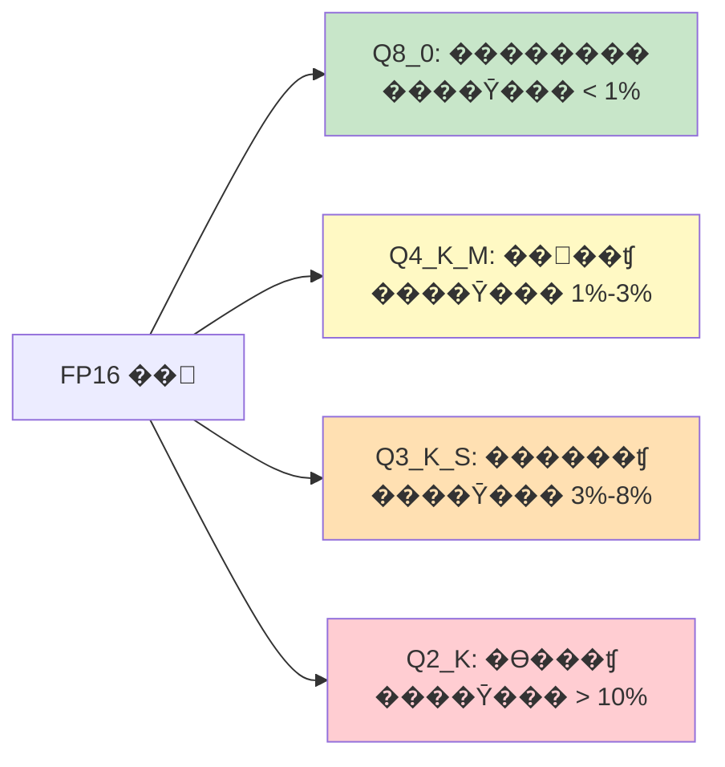
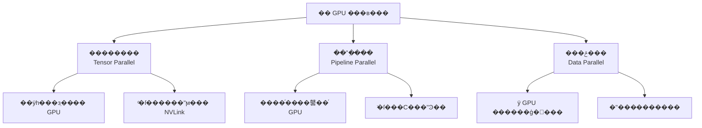
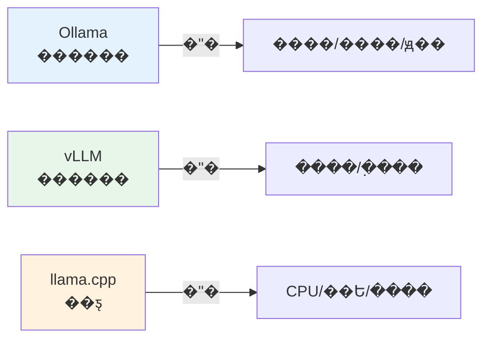

???---
title: ��ģ����������ػ�����
description: �� Ollama �� vLLM �ٵ� llama.cpp��ϵͳ���մ�ģ�ͱ��ػ��������������
date: 2023-01-25T07:59:41+08:00
lastmod: 2023-01-25T07:59:41+08:00
weight: 3
tags:
  - ����
  - ���ز���
  - Ollama
  - vLLM
categories:
  - ������
  - ��������
math: true
mermaid: true
photos:
  - https://d-sketon.top/img/backwebp/bg3.webp
---

## ���Գ�������

> **���Թ�**�����ǹ�˾��һЩ������ݲ������ƣ���ҵ������Ҫ�õ���ģ�����������˽��ģ�͵ı��ػ����𷽰������������ѡ�ͣ������ôѡ��Ollama��vLLM��llama.cpp ��Щ������ʲô����

����⿼����� **��ģ�͹��̻���ȫ��·����**�����ػ����𲻽�����"��ģ��������"��ô�򵥣����漰ģ����������������ѡ�͡�API �����װ����Դ���ȡ����ܵ��ŵȶ�����ڡ����Թ�������������Բ�ͬ������**���ó���**��**ȡ���߼�**��������֪��

�����ݺϹ�Ҫ�������ϸ�ı����£����ػ������Ѿ���Ϊ��ҵ AI ��صĸ���������

## ���������ΪʲôҪ���ز���

������"��ô����"֮ǰ������ȷ"ΪʲôҪ����"�����ػ�����ĺ��������������㣺



| ά�� | �ƶ� API���� GPT-4�� | ���ز��� |
|------|----------------------|----------|
| ������˽ | �����贫�䵽������ | **����ȫ�̲�������** |
| ���γɱ� | �� Token �Ʒѣ�������� | Ӳ��һ����Ͷ�룬�߼ʳɱ����� 0 |
| �ӳ� | 200ms-2s�������磩 | **10ms-500ms�����������** |
| ģ��ѡ�� | ���ڳ����ṩ��ģ�� | **�ɲ������⿪Դģ��** |
| ��ά���Ӷ� | ����ά | **��Ҫ GPU/��ά����** |
| Ч������ | ������ҵģ�� | ȡ���ڿ�Դģ������ |
| �������� | �� API ���� | **�ܱ�����������** |

> **���鷨��**�����յ���������Լ 50 �� Token ʱ�����ز���� TCO����ӵ�гɱ���ͨ�������ƶ� API����������˽�ͺϹ�Ҫ���Ǹ����ȵľ������ء�

## ���󷽰��Ա�

Ŀǰ�����ı��ػ����𷽰������֣����ж�λ��

### ����ȫ��ͼ



### ���ĶԱȱ�

| �Ա�ά�� | Ollama | vLLM | llama.cpp |
|----------|--------|------|-----------|
| **��λ** | �����߹���/ԭ����֤ | ������������� | ��Ե�豸/CPU ���� |
| **��װ�Ѷ�** | ����һ����� | �еȣ��� Python+CUDA ������ | �еȣ�����룩 |
| **����** | Go + C++ | Python + CUDA | C/C++ |
| **GPU Ҫ��** | ��ѡ��֧�� CPU�� | **����**��NVIDIA GPU�� | ��ѡ��GPU ���ٿ�ѡ�� |
| **������ʽ** | GGUF�����ã� | AWQ / GPTQ / FP16 | GGUF��ԭ��֧�֣� |
| **��������** | �ͣ��������Ż��� | **����**��PagedAttention�� | �� |
| **������** | �� | **���** | �� |
| **API ����** | OpenAI ���� | OpenAI ���� | �����з�װ |
| **����ģ��** | ������Դģ�� | ������Դģ�� | �������� GGUF ģ�� |
| **ģ�͹���** | ���� pull/run | �ֶ����� | �ֶ����� |
| **������̬** | �dz���Ծ | �dz���Ծ | ��Ծ |

### ���ѡ��



## ����һ��Ollama ���� ������

Ollama ��Ŀǰ�����õĴ�ģ�ͱ������й��ߣ�������"Docker for LLMs"�������������һ������ģ�͡�

### ��װ��ģ����ȡ

```bash
# macOS / Linux ��װ
curl -fsSL https://ollama.com/install.sh | sh

# Windows ֱ�����ذ�װ��
# https://ollama.com/download/windows

# ��ȡ������ģ�ͣ��Զ����������棩
ollama run qwen2.5:7b          # ͨ��ǧ�� 7B
ollama run llama3.1:8b          # Llama 3.1 8B
ollama run deepseek-r1:7b       # DeepSeek-R1 �����

# �鿴�����ص�ģ��
ollama list

# ��� API ����Ĭ�϶˿� 11434��
ollama serve
```

### Modelfile �Զ���

```dockerfile
# Modelfile������ Dockerfile��
FROM qwen2.5:7b

# �����������
PARAMETER temperature 0.7
PARAMETER top_p 0.9
PARAMETER num_ctx 4096

# ����ϵͳ��ʾ��
SYSTEM """
����һ��רҵ�����ı�����֣����ü�����������Ļش����⡣
"""

# �����Զ���ģ��
# ollama create my-assistant -f Modelfile
```

### API ����

```python
import requests

# Ollama ԭ�� API
response = requests.post("http://localhost:11434/api/chat", json={
    "model": "qwen2.5:7b",
    "messages": [{"role": "user", "content": "�� Python ʵ�ֿ�������"}],
    "stream": False,
})
print(response.json()["message"]["content"])

# Ҳ���� OpenAI SDK
from openai import OpenAI

client = OpenAI(base_url="http://localhost:11434/v1", api_key="ollama")
response = client.chat.completions.create(
    model="qwen2.5:7b",
    messages=[{"role": "user", "content": "����ʲô�� RAG"}],
)
print(response.choices[0].message.content)
```

> **���ó���**�����ؿ������ԡ��������֡�ԭ����֤����С��ģ�ڲ����ߡ��������� 5-10 ����ʱ�������á�

## ��������vLLM ���� ������������

vLLM ��Ŀǰ**���������**�Ŀ�Դ�������棬���Ĵ����� PagedAttention ������

### PagedAttention ԭ��

��ͳ��������Ϊÿ������Ԥ����һ��� KV Cache �Դ棬���´����˷ѡ�vLLM �������ϵͳ��**�����ڴ��ҳ����**���� KV Cache �ֳɹ̶���С��"ҳ"��Block����������䣺



| ָ�� | ��ͳ���� | vLLM (PagedAttention) |
|------|----------|----------------------|
| KV Cache ������ | 20%-40% | **80%-95%** |
| ������ | ��׼ | **2-4x** |
| ֧�ֲ��� | ���� | **�߲���** |
| Continuous Batching | ��֧�� | **֧��** |

**Continuous Batching�������������** �� vLLM ����һ���ؼ��Ż�����ͬ�ڴ�ͳ static batching �����һ�����������������Ŵ�����һ����vLLM ���������� token λ�ö�̬�����������Ƴ���������󣬴������ GPU �����ʡ�

### ��װ�����

```bash
# ��װ vLLM����Ҫ NVIDIA GPU + CUDA��
pip install vllm

# ��� OpenAI ���� API ����
python -m vllm.entrypoints.openai.api_server \
    --model Qwen/Qwen2.5-7B-Instruct \
    --tensor-parallel-size 1 \
    --gpu-memory-utilization 0.9 \
    --max-model-len 32768 \
    --port 8000 \
    --trust-remote-code
```

### �ؼ��������

| ���� | ˵�� | �Ƽ�ֵ |
|------|------|--------|
| `--model` | ģ��·���� HuggingFace ID | �� `Qwen/Qwen2.5-7B-Instruct` |
| `--tensor-parallel-size` | �������� GPU �� | 1/2/4������ GPU ������ |
| `--gpu-memory-utilization` | GPU �Դ�ʹ�ñ��� | 0.85-0.95 |
| `--max-model-len` | ��������ij��� | ����ģ��֧������ |
| `--quantization` | �������� | `awq` / `gptq` / `fp8` |
| `--enable-lora` | ���� LoRA ������ | ��Ҫ�� LoRA ʱ���� |

### ����ģ�Ͳ���

```bash
# ���� AWQ ����ģ�ͣ��Դ�ռ�ü���Լ 50%��
python -m vllm.entrypoints.openai.api_server \
    --model Qwen/Qwen2.5-7B-Instruct-AWQ \
    --quantization awq \
    --gpu-memory-utilization 0.9

# ���� GPTQ ����ģ��
python -m vllm.entrypoints.openai.api_server \
    --model TheBloke/Llama-3-8B-Instruct-GPTQ \
    --quantization gptq
```

### API ����

```python
from openai import OpenAI

# vLLM ��ȫ���� OpenAI API
client = OpenAI(base_url="http://localhost:8000/v1", api_key="vllm")

# �Ի�
response = client.chat.completions.create(
    model="Qwen/Qwen2.5-7B-Instruct",
    messages=[{"role": "user", "content": "���� PagedAttention ��ԭ��"}],
    max_tokens=512,
    temperature=0.7,
)
print(response.choices[0].message.content)

# Ƕ��������vLLM Ҳ֧�� Embedding ģ�ͣ�
embedding = client.embeddings.create(
    model="BAAI/bge-large-zh-v1.5",
    input=["����һ�����Ծ���"],
)
print(f"������: {len(embedding.data[0].embedding)}")
```

> **���ó���**����ҵ�����������߲��� API ������Ҫ֧�Ŵ����û�ͬʱ���ʵij��������� A100 ��֧����ʮ�����ϰٲ�����

## ��������llama.cpp ���� CPU/��Ե����

llama.cpp ���ô� C/C++ ʵ�ֵ� LLM �������棬���������**������ GPU**�������ڴ� CPU ����������ݮ��������ģ�͡�

### GGUF ������ʽ

llama.cpp �ĺ����� GGUF��GPT-Generated Unified Format��������ʽ��



| �������� | λ�� | 7B ģ����� | ������ʧ | �Ƽ����� |
|----------|------|------------|----------|----------|
| FP16 | 16-bit | ~14 GB | �� | �� GPU��׷������ |
| Q8_0 | 8-bit | ~7 GB | ��С | CPU ������������� |
| **Q4_K_M** | 4-bit | **~4 GB** | **��΢** | **�� ����Լ۱�** |
| Q3_K_S | 3-bit | ~3 GB | ���� | �ڴ漫������ |
| Q2_K | 2-bit | ~2.5 GB | �ϴ� | ���Ƽ�����ʹ�� |

### ����������

```bash
# ��¡������
git clone https://github.com/ggerganov/llama.cpp
cd llama.cpp

# CPU ����
cmake -B build
cmake --build build --config Release

# GPU ���루CUDA��
cmake -B build -DGGML_CUDA=ON
cmake --build build --config Release

# ���� GGUF ģ�ͣ��� HuggingFace��
# ����: https://huggingface.co/Qwen/Qwen2.5-7B-Instruct-GGUF

# ��� OpenAI ���� API ����
./build/bin/llama-server \
    -m qwen2.5-7b-instruct-q4_k_m.gguf \
    --host 0.0.0.0 --port 8080 \
    -c 4096 \
    -n 512
```

### Python ��

```python
# ʹ�� llama-cpp-python
# pip install llama-cpp-python
from llama_cpp import Llama

llm = Llama(
    model_path="./models/qwen2.5-7b-instruct-q4_k_m.gguf",
    n_ctx=4096,       # �����ij���
    n_threads=8,      # CPU �߳���
    n_gpu_layers=35,  # �ŵ� GPU �IJ�����0 = �� CPU��
)

response = llm.create_chat_completion(
    messages=[{"role": "user", "content": "�����仰�������Ӽ���"}],
    max_tokens=256,
    temperature=0.7,
)
print(response["choices"][0]["message"]["content"])
```

> **���ó���**���� GPU �ķ���������Ե�豸����ݮ�ɡ�Jetson�������߻�����Ƕ��ʽ�豸�����ӳٲ���е��ڲ����ߡ�

## ѡ�;�����

�ۺ��������ַ�����������ѡ�;����������£�



## ׷������

### ׷��һ������������������ܣ�

��ģ���������������ĺ���ָ�꣺

| ָ�� | ���� | ˵�� |
|------|------|------|
| **TTFT**��Time To First Token�� | �� Token �ӳ� | Ӱ���û���У�Ӧ < 500ms |
| **TPOT**��Time Per Output Token�� | ÿ����� Token ��ʱ | Ӱ�������ٶȣ�Ӧ < 50ms |
| **Throughput**���������� | ÿ�봦�� Token �� | Ӱ�첢������ |
| **QPS**��Queries Per Second�� | ÿ�������� | ����ָ�� |
| **�Դ�ռ��** | GPU Memory | ������� batch size |

```python
# ����ѹ��ű�
import asyncio
import time
import aiohttp

async def benchmark(url: str, num_requests: int = 20):
    """����ѹ��"""
    async with aiohttp.ClientSession() as session:
        tasks = []
        for i in range(num_requests):
            task = send_request(session, url, f"�������� {i}")
            tasks.append(task)

        start = time.time()
        results = await asyncio.gather(*tasks)
        total_time = time.time() - start

    total_tokens = sum(r[1] for r in results)
    print(f"������: {num_requests}")
    print(f"�ܺ�ʱ: {total_time:.2f}s")
    print(f"������: {total_tokens / total_time:.1f} tokens/s")
    print(f"ƽ���ӳ�: {total_time / num_requests:.2f}s")

async def send_request(session, url, prompt):
    start = time.time()
    async with session.post(f"{url}/v1/chat/completions", json={
        "model": "qwen2.5:7b",
        "messages": [{"role": "user", "content": prompt}],
        "max_tokens": 100,
    }) as resp:
        data = await resp.json()
    elapsed = time.time() - start
    tokens = data["usage"]["completion_tokens"]
    return elapsed, tokens

asyncio.run(benchmark("http://localhost:11434", num_requests=20))
```

### ׷�ʶ���������Ч��Ӱ����

�������������þ��Ȼ��ռ���ٶȣ�����ͬ�����������ʧ����ܴ�



> **��������**����һ�������ʴ����⼯�ϣ�Qwen2.5-7B ģ�ʹ� FP16 �� Q4_K_M��׼ȷ�ʴ� 72.3% �½��� 70.1%���½� 2.2 ���ٷֵ㣩�����Դ�� 14GB ���� 4GB�������ٶȷ������������ڴ����Ӧ�ó�����**Q4_K_M ��������Ч�ʵ����ƽ���**��

### ׷�������� GPU ��β����ģ�ͣ�

������ GPU װ���´�ģ�ͣ��� 70B ģ����ҪԼ 140GB �Դ棩����Ҫ�� GPU ���У�



```bash
# vLLM �� GPU ��������4 ����
python -m vllm.entrypoints.openai.api_server \
    --model Qwen/Qwen2.5-72B-Instruct-AWQ \
    --tensor-parallel-size 4 \
    --gpu-memory-utilization 0.9 \
    --max-model-len 8192

# Ollama �� GPU���Զ���⣬Ҳ���ֶ�ָ����
CUDA_VISIBLE_DEVICES=0,1 ollama run qwen2.5:72b
```

## ��

��ģ�ͱ��ػ�����ĺ�����**���ݳ���ѡ�Թ���**��



�����лش�����⣬���鰴"**������� �� �����Ա� �� ѡ���Ƽ� �� �������� �� ��������**"���߼�չ�����ؼ���Ҫչʾ�����㲻��ֻ֪��һ�����ߣ��������ÿ�ַ�����**�����ѧ**��**���ñ߽�**���ܸ���ʵ��Լ����������ȡ�ᡣ
