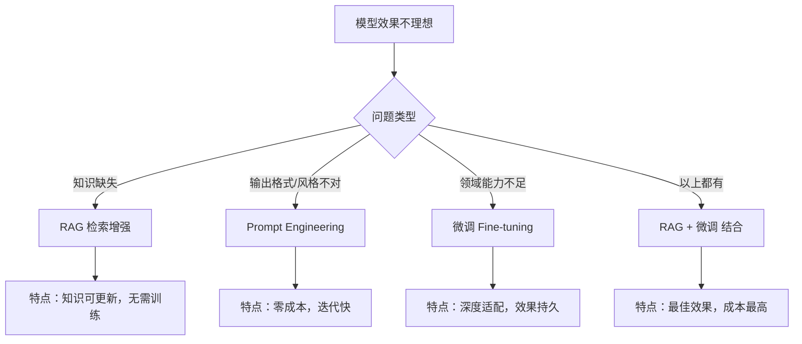
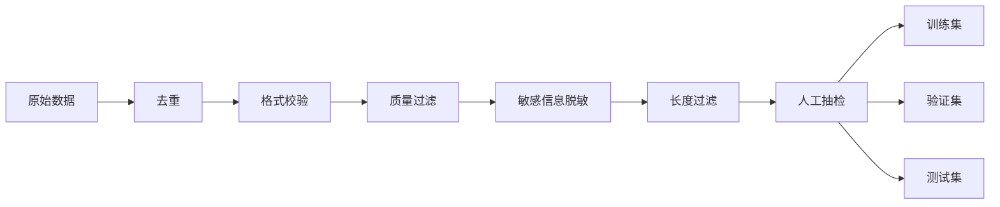
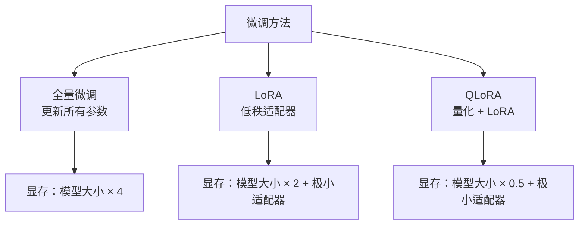
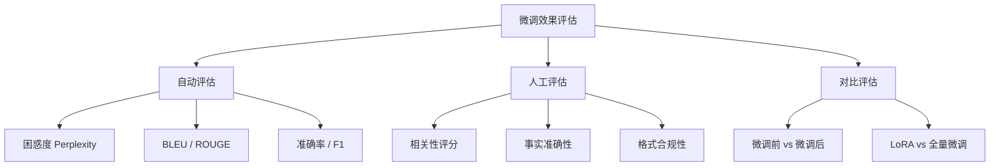
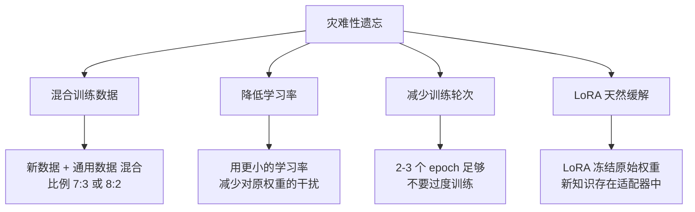

---
title: 如何做模型微调与数据集准备？
description: 从数据集构建到 LoRA/QLoRA 微调再到效果评估，系统掌握大模型微调全流程
date: 2026-06-20T10:00:00+08:00
lastmod: 2026-06-20T10:00:00+08:00
weight: 6
tags:
  - 面试
  - 模型微调
  - LoRA
  - 数据集
categories:
  - 面试题
  - 技术分享
math: true
mermaid: true
photos:
  - https://d-sketon.top/img/backwebp/bg6.webp
---

## 面试场景描述

> **面试官**：你们公司要做一个法律领域的智能助手，直接用通用大模型效果不理想。你会选择微调还是 RAG？如果微调，数据集怎么准备？用什么方法？
>
> **候选人**：首先要区分需求。如果问题是"模型不知道法律条文"，那是知识缺失，用 RAG；如果问题是"模型不会按法律文书的格式和口吻输出"，那是能力/风格问题，用微调。很多场景需要两者结合。
>
> **面试官**：假设确定要微调，数据集怎么构建？1000 条高质量数据够吗？
>
> **候选人**：1000 条高质量数据对于 LoRA 微调调整输出风格是够的。但关键不是数量，而是质量和多样性。我会用 Alpaca 格式构建指令数据集，先清洗标注，再验证。

这是一道考察 **大模型微调全流程** 的高频面试题，覆盖了从需求判断、数据准备到方法选择、效果评估的完整链路。本文将系统梳理这道题的完整答案。

## 问题分析：什么时候需要微调

### 微调 vs Prompt Engineering vs RAG

很多人一遇到效果不理想就想到微调，但微调不一定是正确选择。三种方案各有适用场景：



三者的核心区别：

| 维度 | Prompt Engineering | RAG | 微调 |
|------|-------------------|-----|------|
| **解决的问题** | 引导输出方向 | 补充外部知识 | 改变模型内在能力 |
| **训练成本** | 零 | 零（需构建索引） | 中高 |
| **迭代速度** | 秒级 | 分钟级 | 小时~天级 |
| **知识更新** | 修改 Prompt 即可 | 更新知识库即可 | 需重新训练 |
| **适用场景** | 简单任务调整 | 需要准确事实 | 领域适配、风格统一 |

### 微调的核心信号

当你观察到以下现象时，微调可能是正确的选择：

1. **Prompt 已经很长很完善，但模型仍然做不到**——能力边界问题
2. **需要一致的输出格式/风格**，Prompt 难以稳定控制
3. **特定领域的术语和推理模式**，通用模型理解偏差大
4. **需要降低推理成本**——微调小模型可以达到大模型+Prompt 的效果
5. **延迟敏感**，无法在 Prompt 中塞入大量示例

## 数据集准备

### 指令数据格式

指令微调（Instruction Tuning）是目前最主流的微调范式。核心是将数据组织为"指令-输入-输出"的三元组。

#### Alpaca 格式

```json
{
  "instruction": "将以下法律条款翻译为通俗易懂的语言",
  "input": "当事人一方不履行合同义务或者履行合同义务不符合约定的，应当承担继续履行、采取补救措施或者赔偿损失等违约责任。",
  "output": "如果签了合同的一方没做到合同里约定的事情，或者做得不好，就需要承担责任：要么继续把事情做完，要么想办法弥补，要么赔钱。"
}
```

#### ShareGPT 格式（多轮对话）

```json
{
  "conversations": [
    {"from": "human", "value": "这份合同有哪些风险条款？"},
    {"from": "gpt", "value": "我注意到第3条存在单方面解约权，建议修改为..."},
    {"from": "human", "value": "那违约金条款呢？"},
    {"from": "gpt", "value": "违约金比例为合同总额的30%，过高..."}
  ]
}
```

两种格式的适用场景对比：

| 格式 | 数据结构 | 适用场景 | 转换难度 |
|------|---------|---------|---------|
| **Alpaca** | 单轮指令 | 任务型、分类、翻译 | 简单 |
| **ShareGPT** | 多轮对话 | 对话型、助手型 | 中等 |

### 数据清洗流程



```python
import json
import re
from collections import Counter

class DatasetCleaner:
    """数据集清洗器"""

    def __init__(self):
        self.stats = {
            "total": 0, "after_dedup": 0, "after_quality": 0,
            "after_length": 0,
        }

    def clean(self, data: list[dict]) -> list[dict]:
        """完整清洗流程"""
        self.stats["total"] = len(data)

        # 1. 去重（基于指令+输入的哈希）
        data = self._deduplicate(data)
        self.stats["after_dedup"] = len(data)

        # 2. 格式校验
        data = self._validate_format(data)

        # 3. 质量过滤
        data = self._filter_quality(data)
        self.stats["after_quality"] = len(data)

        # 4. 长度过滤
        data = self._filter_length(data, min_len=10, max_len=4096)
        self.stats["after_length"] = len(data)

        self._print_stats()
        return data

    def _deduplicate(self, data: list[dict]) -> list[dict]:
        """基于内容哈希去重"""
        seen = set()
        result = []
        for item in data:
            key = hash(item.get("instruction", "") + item.get("input", ""))
            if key not in seen:
                seen.add(key)
                result.append(item)
        return result

    def _validate_format(self, data: list[dict]) -> list[dict]:
        """校验必填字段"""
        return [
            item for item in data
            if item.get("instruction") and item.get("output")
        ]

    def _filter_quality(self, data: list[dict]) -> list[dict]:
        """质量过滤：过滤过短输出、重复输出等"""
        result = []
        for item in data:
            output = item.get("output", "")
            # 过滤输出过短（可能是占位符）
            if len(output.strip()) < 5:
                continue
            # 过滤输出全是重复字符
            if len(set(output)) < 5:
                continue
            result.append(item)
        return result

    def _filter_length(
        self, data: list[dict], min_len: int, max_len: int,
    ) -> list[dict]:
        """长度过滤"""
        result = []
        for item in data:
            total_len = len(item.get("instruction", "")) + \
                        len(item.get("input", "")) + \
                        len(item.get("output", ""))
            if min_len <= total_len <= max_len:
                result.append(item)
        return result

    def _print_stats(self):
        print(f"清洗统计:")
        for key, val in self.stats.items():
            print(f"  {key}: {val}")
```

### 数据数量与质量的权衡

这是面试中最常被追问的点。经验数据：

| 数据量 | 适用场景 | 预期效果 |
|--------|---------|---------|
| 100 - 500 条 | 风格调整、格式统一 | 输出格式一致性显著提升 |
| 500 - 5,000 条 | 特定任务优化 | 任务表现明显提升 |
| 5,000 - 50,000 条 | 领域能力注入 | 领域知识显著增强 |
| 50,000+ 条 | 通用能力扩展 | 接近全量微调效果 |

> **核心原则**：质量永远大于数量。1000 条精挑细选的数据，效果往往优于 50000 条粗制滥造的数据。

数据质量检查清单：

- [ ] 指令清晰明确，无歧义
- [ ] 输出准确、完整、无错误
- [ ] 格式统一规范
- [ ] 指令多样性足够（避免高度相似）
- [ ] 难度分布合理（简单/中等/困难）
- [ ] 已去除敏感信息（姓名、电话、身份证等）

## 微调方法对比

### 全量微调 vs LoRA vs QLoRA



LoRA 的核心数学原理——用低秩矩阵近似权重更新：

$$
W = W_0 + \Delta W = W_0 + BA
$$

其中 $W_0$ 冻结，只训练 $B \in \mathbb{R}^{d \times r}$ 和 $A \in \mathbb{R}^{r \times k}$，$r \ll \min(d, k)$ 是低秩维度。训练完成后，$BA$ 可以合并到 $W_0$ 中，**推理无额外开销**。

三种方法的详细对比：

| 维度 | 全量微调 | LoRA | QLoRA |
|------|---------|------|-------|
| **可训练参数** | 100% | 0.1% - 1% | 0.1% - 1% |
| **显存需求（7B 模型）** | ~80GB | ~16GB | ~6GB |
| **训练速度** | 慢 | 快 | 中 |
| **效果** | 最好 | 接近全量 | 略低于 LoRA |
| **推理开销** | 无 | 无（可合并） | 无（可合并） |
| **多任务切换** | 需多份完整模型 | 只需切换适配器 | 只需切换适配器 |
| **适用 GPU** | A100/H100 集群 | 单张 24GB GPU | 消费级 GPU（如 RTX 4090） |

### LoRA 关键超参数

| 参数 | 含义 | 推荐值 | 影响 |
|------|------|--------|------|
| `r`（秩） | 低秩维度 | 8, 16, 64 | 越大效果越好，参数越多 |
| `lora_alpha` | 缩放因子 | 通常设为 `r` 的 2 倍 | 控制适配器的影响强度 |
| `lora_dropout` | Dropout 概率 | 0.05 - 0.1 | 防止过拟合 |
| `target_modules` | 应用 LoRA 的层 | q_proj, v_proj 或全层 | 更多层 → 更好效果 |

## 代码示例：使用 PEFT 进行 LoRA 微调

### 使用 Hugging Face PEFT 库

```python
import torch
from datasets import Dataset
from peft import LoraConfig, get_peft_model, TaskType
from transformers import (
    AutoModelForCausalLM,
    AutoTokenizer,
    TrainingArguments,
    Trainer,
    DataCollatorForSeq2Seq,
)

# ========== 1. 加载预训练模型与分词器 ==========
model_path = "Qwen/Qwen2.5-7B-Instruct"
tokenizer = AutoTokenizer.from_pretrained(model_path, trust_remote_code=True)
model = AutoModelForCausalLM.from_pretrained(
    model_path,
    torch_dtype=torch.bfloat16,
    device_map="auto",
    trust_remote_code=True,
)

# ========== 2. 配置 LoRA ==========
lora_config = LoraConfig(
    task_type=TaskType.CAUSAL_LM,
    r=16,                    # 低秩维度
    lora_alpha=32,           # 缩放因子 = r 的 2 倍
    lora_dropout=0.05,       # Dropout
    target_modules=[         # 对这些层应用 LoRA
        "q_proj", "k_proj", "v_proj", "o_proj",
        "gate_proj", "up_proj", "down_proj",
    ],
    bias="none",
)

model = get_peft_model(model, lora_config)
model.print_trainable_parameters()
# 输出示例：trainable params: 19,594,240 || all params: 7,621,877,760 || trainable%: 0.2571%

# ========== 3. 数据预处理 ==========
def format_alpaca(example: dict) -> str:
    """将 Alpaca 格式转换为模型输入"""
    if example.get("input"):
        prompt = (
            f"Below is an instruction that describes a task, "
            f"paired with an input that provides further context. "
            f"Write a response that appropriately completes the request.\n\n"
            f"### Instruction:\n{example['instruction']}\n\n"
            f"### Input:\n{example['input']}\n\n"
            f"### Response:\n{example['output']}"
        )
    else:
        prompt = (
            f"Below is an instruction that describes a task. "
            f"Write a response that appropriately completes the request.\n\n"
            f"### Instruction:\n{example['instruction']}\n\n"
            f"### Response:\n{example['output']}"
        )
    return prompt

def tokenize_function(examples, max_length=2048):
    """分词，构建标签"""
    formatted = [format_alpaca(ex) for ex in examples]
    result = tokenizer(
        formatted,
        truncation=True,
        max_length=max_length,
        padding=False,
    )
    # 自回归训练：标签 = input_ids
    result["labels"] = result["input_ids"].copy()
    return result

# 加载数据集
raw_dataset = Dataset.from_json("legal_data.json")
tokenized_dataset = raw_dataset.map(
    tokenize_function,
    batched=True,
    remove_columns=raw_dataset.column_names,
)

# 划分训练集/验证集
split = tokenized_dataset.train_test_split(test_size=0.1, seed=42)
train_dataset = split["train"]
eval_dataset = split["test"]

# ========== 4. 训练配置 ==========
training_args = TrainingArguments(
    output_dir="./lora_output",
    num_train_epochs=3,
    per_device_train_batch_size=4,
    per_device_eval_batch_size=4,
    gradient_accumulation_steps=4,    # 梯度累积模拟 batch_size=16
    learning_rate=2e-4,               # LoRA 学习率比全量微调高
    warmup_ratio=0.1,                 # Warmup
    lr_scheduler_type="cosine",       # 余弦退火
    logging_steps=10,
    eval_strategy="steps",
    eval_steps=100,
    save_strategy="steps",
    save_steps=100,
    save_total_limit=3,
    load_best_model_at_end=True,
    metric_for_best_model="eval_loss",
    greater_is_better=False,
    bf16=True,                        # 混合精度
    gradient_checkpointing=True,      # 梯度检查点，省显存
    report_to="tensorboard",
)

# ========== 5. 开始训练 ==========
data_collator = DataCollatorForSeq2Seq(
    tokenizer=tokenizer,
    padding=True,
    return_tensors="pt",
)

trainer = Trainer(
    model=model,
    args=training_args,
    train_dataset=train_dataset,
    eval_dataset=eval_dataset,
    data_collator=data_collator,
)

trainer.train()

# ========== 6. 保存适配器 ==========
model.save_pretrained("./lora_legal")
tokenizer.save_pretrained("./lora_legal")
print("LoRA 适配器已保存，仅占用几十 MB")
```

### 使用 LLaMA-Factory（零代码微调）

LLaMA-Factory 提供了 YAML 配置驱动的微调方式，适合不想写代码的场景：

```yaml
# legal_lora.yaml
### 模型配置
model_name_or_path: Qwen/Qwen2.5-7B-Instruct
trust_remote_code: true

### 微调方法
stage: sft
do_train: true
finetuning_type: lora
lora_rank: 16
lora_alpha: 32
lora_target: all

### 数据集配置
dataset: legal_alpaca
template: qwen
cutoff_len: 2048
max_samples: 10000

### 训练参数
output_dir: ./lora_legal
num_train_epochs: 3
per_device_train_batch_size: 4
gradient_accumulation_steps: 4
learning_rate: 2.0e-4
warmup_ratio: 0.1
lr_scheduler_type: cosine
logging_steps: 10
save_steps: 100
plot_loss: true

### 显存优化
bf16: true
gradient_checkpointing: true
```

```bash
# 启动训练
llamafactory-cli train legal_lora.yaml

# 合并适配器到基础模型
llamafactory-cli export \
    --model_name_or_path Qwen/Qwen2.5-7B-Instruct \
    --adapter_name_or_path ./lora_legal \
    --export_dir ./merged_legal \
    --export_size 4
```

## 效果评估

### 评估方法体系



### 对比评估实现

```python
from openai import OpenAI

client = OpenAI()

def pairwise_compare(
    prompt: str,
    response_a: str,
    response_b: str,
    criteria: str = "准确性、专业性和格式规范性",
) -> dict:
    """使用 GPT-4 作为裁判，对比两个回复"""
    judge_prompt = f"""你是一个专业评审。请根据以下标准评估两个回复：{criteria}

问题：{prompt}

回复 A：{response_a}
回复 B：{response_b}

请给出：
1. 回复 A 的评分（1-10）
2. 回复 B 的评分（1-10）
3. 哪个更好（A/B/平手）
4. 简短理由

以 JSON 格式输出。"""

    resp = client.chat.completions.create(
        model="gpt-4o",
        messages=[{"role": "user", "content": judge_prompt}],
        response_format={"type": "json_object"},
    )
    return resp.choices[0].message.content

# 评估微调前后效果
test_cases = [
    {"prompt": "分析这份合同的违约条款风险", "criteria": "法律专业性和风险识别能力"},
    {"prompt": "起草一份保密协议", "criteria": "格式规范性和法律条款完整性"},
]

results = []
for case in test_cases:
    # 微调前
    base_response = call_base_model(case["prompt"])
    # 微调后
    tuned_response = call_tuned_model(case["prompt"])
    # 对比
    comparison = pairwise_compare(
        case["prompt"],
        base_response,
        tuned_response,
        case["criteria"],
    )
    results.append(comparison)
```

## 追问延伸

### Q1：微调过拟合怎么办？

**面试官追问**：训练了 10 个 epoch 后，验证集 loss 开始上升了，怎么办？

**回答要点**：

- **提前停止（Early Stopping）**：监控验证集 loss，在开始上升时停止
- **增大 Dropout**：`lora_dropout` 从 0.05 提到 0.1
- **减少 epoch**：指令微调通常 3-5 个 epoch 足够
- **增加数据多样性**：过拟合往往是数据不够多样
- **减小 LoRA 秩**：降低 `r` 值，限制模型容量
- **学习率衰减**：使用余弦退火调度器

```python
# 提前停止的判断逻辑
if eval_loss < best_eval_loss:
    best_eval_loss = eval_loss
    patience_counter = 0
    save_best_model()
else:
    patience_counter += 1
    if patience_counter >= patience:  # 默认 patience=3
        print("触发提前停止")
        break
```

### Q2：如何选择超参数？

**回答要点**：

| 超参数 | 选择策略 | 推荐范围 |
|--------|---------|---------|
| 学习率 | 从 1e-4 开始，按 3 倍步长搜索 | 1e-5 ~ 5e-4 |
| LoRA 秩 r | 先用 8 快速实验，再调到 16/64 | 4, 8, 16, 32, 64 |
| batch size | 尽量大，用梯度累积补足 | 4-32（等效） |
| epoch | 看验证集 loss，通常 3-5 | 2-10 |
| target_modules | 先 q_proj+v_proj，效果不够再加全层 | - |

### Q3：灾难性遗忘如何缓解？

**面试官追问**：微调后模型在法律领域表现很好，但连基本的数学题都不会做了，怎么解决？

**回答要点**：

灾难性遗忘（Catastrophic Forgetting）是指模型学习新知识后遗忘了旧知识。缓解策略：



| 策略 | 原理 | 效果 |
|------|------|------|
| **数据混合** | 训练集中加入通用数据 | 最有效，但需更多数据 |
| **降低学习率** | 减小对预训练权重的干扰 | 简单有效 |
| **减少 epoch** | 不过度拟合新任务 | 简单有效 |
| **LoRA** | 冻结原始权重，只训练适配器 | 天然缓解，推荐 |
| **正则化** | KL 散度约束输出分布 | 效果好但实现复杂 |

### Q4：微调和 RAG 怎么结合？

**回答要点**：

- **微调改变"怎么回答"**（风格、格式、推理方式）
- **RAG 提供"回答什么"**（准确的知识和事实）
- 两者互补：微调让模型更擅长法律推理，RAG 提供最新的法律条文


## 结语

模型微调是连接通用大模型与具体业务场景的桥梁。掌握微调全流程的关键要点：

1. **先判断是否需要微调**——区分知识缺失（RAG）和能力不足（微调）
2. **数据质量 > 数据数量**——1000 条精选数据胜过 50000 条粗制滥造
3. **方法选择看场景**——LoRA 是性价比之王，QLoRA 适合消费级 GPU
4. **评估要全面**——自动指标 + 人工评估 + 微调前后对比
5. **警惕过拟合和遗忘**——提前停止 + 数据混合

记住：花时间打磨数据，往往比在技术上抠细节带来更大的收益。

## 参考文献

1. Hu E J, et al. LoRA: Low-Rank Adaptation of Large Language Models. ICLR 2022.
2. Dettmers T, et al. QLoRA: Efficient Finetuning of Quantized LLMs. NeurIPS 2023.
3. Taori R, et al. Stanford Alpaca. 2023.
4. LLaMA-Factory. https://github.com/hiyouga/LLaMA-Factory
5. Hugging Face PEFT. https://github.com/huggingface/peft
