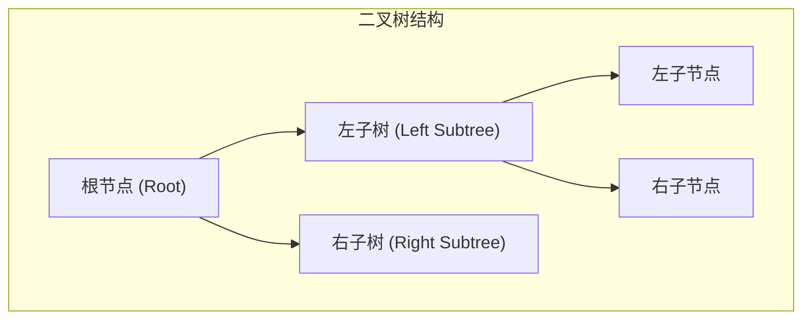
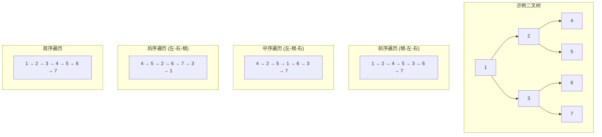
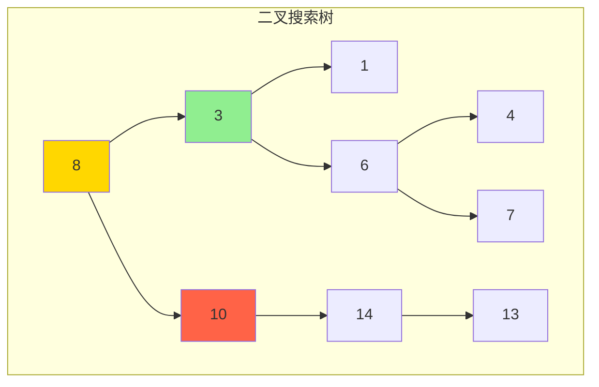
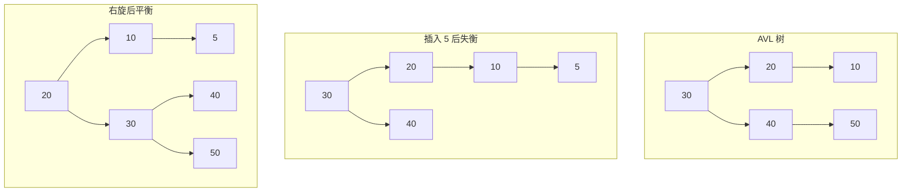
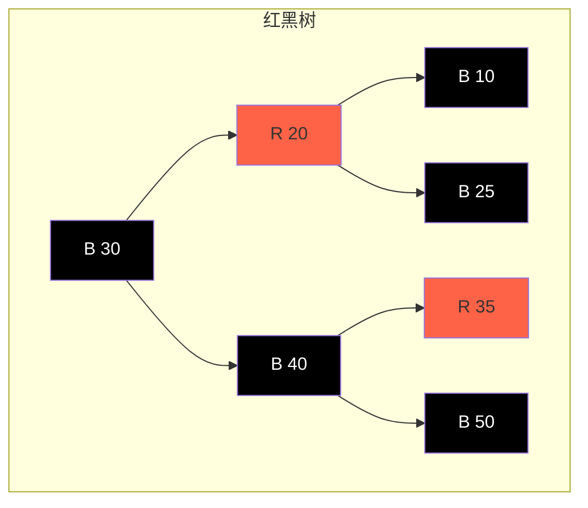

---
title: "二叉树与遍历实战"
description: "前序/中序/后序遍历、层序遍历、BST、AVL树、红黑树原理与实现"
date: 2021-02-24T14:16:44+08:00
lastmod: 2021-02-24T14:16:44+08:00
weight: 2
tags:
  - 二叉树
  - 树遍历
  - BST
  - AVL树
categories:
  - 树结构
  - 技术分享
math: true
mermaid: true
photos:
  - https://images.unsplash.com/photo-1506744038136-46273834b3fb?w=1920&q=80
---

## 引言

树是计算机科学中最重要的数据结构之一，而二叉树是树结构的基础。二叉树不仅用于组织数据，还广泛应用于编译器设计、数据库索引、表达式求值等领域。掌握二叉树的遍历方式、查找算法以及平衡树的原理，是每个程序员必备的技能。

本文将系统讲解二叉树的基本概念、四种遍历方式（前序、中序、后序、层序）、二叉搜索树（BST）、AVL 树和红黑树的原理与实现。

## 二叉树基础概念

### 树的定义



### 二叉树类型

| 类型 | 说明 | 特点 |
|------|------|------|
| **满二叉树** | 每个节点都有两个子节点 | 第 k 层有 2^(k-1) 个节点 |
| **完全二叉树** | 除最后一层外，其余层均满 | 最后一层节点从左到右排列 |
| **平衡二叉树** | 左右子树高度差不超过 1 | 查找效率高 |
| **二叉搜索树** | 左子树 < 根 < 右子树 | 有序查找 |

### 节点结构

```java
public class TreeNode {
    int val;
    TreeNode left;
    TreeNode right;
    
    TreeNode() {}
    TreeNode(int val) { this.val = val; }
    TreeNode(int val, TreeNode left, TreeNode right) {
        this.val = val;
        this.left = left;
        this.right = right;
    }
}
```

## 二叉树遍历

### 遍历方式对比



### 前序遍历

```java
// 递归实现
public void preorder(TreeNode root) {
    if (root == null) return;
    System.out.print(root.val + " ");
    preorder(root.left);
    preorder(root.right);
}

// 迭代实现
public List<Integer> preorderTraversal(TreeNode root) {
    List<Integer> result = new ArrayList<>();
    Stack<TreeNode> stack = new Stack<>();
    
    if (root != null) stack.push(root);
    
    while (!stack.isEmpty()) {
        TreeNode node = stack.pop();
        result.add(node.val);
        
        if (node.right != null) stack.push(node.right);
        if (node.left != null) stack.push(node.left);
    }
    
    return result;
}
```

### 中序遍历

```java
// 递归实现
public void inorder(TreeNode root) {
    if (root == null) return;
    inorder(root.left);
    System.out.print(root.val + " ");
    inorder(root.right);
}

// 迭代实现
public List<Integer> inorderTraversal(TreeNode root) {
    List<Integer> result = new ArrayList<>();
    Stack<TreeNode> stack = new Stack<>();
    TreeNode curr = root;
    
    while (curr != null || !stack.isEmpty()) {
        while (curr != null) {
            stack.push(curr);
            curr = curr.left;
        }
        
        curr = stack.pop();
        result.add(curr.val);
        curr = curr.right;
    }
    
    return result;
}
```

### 后序遍历

```java
// 递归实现
public void postorder(TreeNode root) {
    if (root == null) return;
    postorder(root.left);
    postorder(root.right);
    System.out.print(root.val + " ");
}

// 迭代实现（双栈法）
public List<Integer> postorderTraversal(TreeNode root) {
    List<Integer> result = new ArrayList<>();
    Stack<TreeNode> stack1 = new Stack<>();
    Stack<TreeNode> stack2 = new Stack<>();
    
    if (root != null) stack1.push(root);
    
    while (!stack1.isEmpty()) {
        TreeNode node = stack1.pop();
        stack2.push(node);
        
        if (node.left != null) stack1.push(node.left);
        if (node.right != null) stack1.push(node.right);
    }
    
    while (!stack2.isEmpty()) {
        result.add(stack2.pop().val);
    }
    
    return result;
}
```

### 层序遍历

```java
public List<List<Integer>> levelOrder(TreeNode root) {
    List<List<Integer>> result = new ArrayList<>();
    if (root == null) return result;
    
    Queue<TreeNode> queue = new LinkedList<>();
    queue.offer(root);
    
    while (!queue.isEmpty()) {
        int levelSize = queue.size();
        List<Integer> currentLevel = new ArrayList<>();
        
        for (int i = 0; i < levelSize; i++) {
            TreeNode node = queue.poll();
            currentLevel.add(node.val);
            
            if (node.left != null) queue.offer(node.left);
            if (node.right != null) queue.offer(node.right);
        }
        
        result.add(currentLevel);
    }
    
    return result;
}
```

## 二叉搜索树（BST）

### BST 特性



**BST 性质**：
- 左子树所有节点的值 < 根节点的值
- 右子树所有节点的值 > 根节点的值
- 左右子树也都是二叉搜索树

### 查找操作

```java
public TreeNode searchBST(TreeNode root, int val) {
    if (root == null || root.val == val) return root;
    
    if (val < root.val) {
        return searchBST(root.left, val);
    } else {
        return searchBST(root.right, val);
    }
}

// 迭代实现
public TreeNode searchBSTIterative(TreeNode root, int val) {
    while (root != null && root.val != val) {
        if (val < root.val) {
            root = root.left;
        } else {
            root = root.right;
        }
    }
    return root;
}
```

### 插入操作

```java
public TreeNode insertIntoBST(TreeNode root, int val) {
    if (root == null) return new TreeNode(val);
    
    if (val < root.val) {
        root.left = insertIntoBST(root.left, val);
    } else {
        root.right = insertIntoBST(root.right, val);
    }
    
    return root;
}
```

### 删除操作

```java
public TreeNode deleteNode(TreeNode root, int key) {
    if (root == null) return null;
    
    if (key < root.val) {
        root.left = deleteNode(root.left, key);
    } else if (key > root.val) {
        root.right = deleteNode(root.right, key);
    } else {
        // 情况1：叶子节点
        if (root.left == null && root.right == null) {
            return null;
        }
        // 情况2：只有一个子节点
        if (root.left == null) {
            return root.right;
        }
        if (root.right == null) {
            return root.left;
        }
        // 情况3：有两个子节点，找到后继节点
        TreeNode minNode = findMin(root.right);
        root.val = minNode.val;
        root.right = deleteNode(root.right, minNode.val);
    }
    
    return root;
}

private TreeNode findMin(TreeNode node) {
    while (node.left != null) {
        node = node.left;
    }
    return node;
}
```

### BST 验证

```java
public boolean isValidBST(TreeNode root) {
    return isValidBST(root, Long.MIN_VALUE, Long.MAX_VALUE);
}

private boolean isValidBST(TreeNode node, long lower, long upper) {
    if (node == null) return true;
    
    if (node.val <= lower || node.val >= upper) {
        return false;
    }
    
    return isValidBST(node.left, lower, node.val) 
        && isValidBST(node.right, node.val, upper);
}
```

## AVL 树

### AVL 树特性

AVL 树是一种自平衡二叉搜索树，任意节点的左右子树高度差不超过 1。



### 四种旋转操作

```java
// 左旋
private TreeNode rotateLeft(TreeNode node) {
    TreeNode rightChild = node.right;
    TreeNode rightLeftChild = rightChild.left;
    
    rightChild.left = node;
    node.right = rightLeftChild;
    
    updateHeight(node);
    updateHeight(rightChild);
    
    return rightChild;
}

// 右旋
private TreeNode rotateRight(TreeNode node) {
    TreeNode leftChild = node.left;
    TreeNode leftRightChild = leftChild.right;
    
    leftChild.right = node;
    node.left = leftRightChild;
    
    updateHeight(node);
    updateHeight(leftChild);
    
    return leftChild;
}

// 左右旋
private TreeNode rotateLeftRight(TreeNode node) {
    node.left = rotateLeft(node.left);
    return rotateRight(node);
}

// 右左旋
private TreeNode rotateRightLeft(TreeNode node) {
    node.right = rotateRight(node.right);
    return rotateLeft(node);
}
```

### 平衡因子计算

```java
private int getHeight(TreeNode node) {
    if (node == null) return 0;
    return node.height;
}

private void updateHeight(TreeNode node) {
    node.height = 1 + Math.max(getHeight(node.left), getHeight(node.right));
}

private int getBalanceFactor(TreeNode node) {
    if (node == null) return 0;
    return getHeight(node.left) - getHeight(node.right);
}
```

### AVL 插入

```java
public TreeNode insert(TreeNode node, int val) {
    // 1. 执行标准 BST 插入
    if (node == null) return new TreeNode(val);
    
    if (val < node.val) {
        node.left = insert(node.left, val);
    } else if (val > node.val) {
        node.right = insert(node.right, val);
    } else {
        return node; // 重复值不插入
    }
    
    // 2. 更新高度
    updateHeight(node);
    
    // 3. 获取平衡因子
    int balance = getBalanceFactor(node);
    
    // 4. 平衡调整
    // LL 情况
    if (balance > 1 && val < node.left.val) {
        return rotateRight(node);
    }
    // RR 情况
    if (balance < -1 && val > node.right.val) {
        return rotateLeft(node);
    }
    // LR 情况
    if (balance > 1 && val > node.left.val) {
        return rotateLeftRight(node);
    }
    // RL 情况
    if (balance < -1 && val < node.right.val) {
        return rotateRightLeft(node);
    }
    
    return node;
}
```

## 红黑树

### 红黑树特性

红黑树是一种自平衡二叉搜索树，满足以下性质：



| 性质 | 说明 |
|------|------|
| 1. 节点颜色 | 每个节点要么是红色，要么是黑色 |
| 2. 根节点 | 根节点必须是黑色 |
| 3. 叶子节点 | 所有叶子节点（NIL）都是黑色 |
| 4. 红色节点 | 红色节点的子节点必须是黑色（不能有连续红节点） |
| 5. 路径性质 | 从任意节点到其后代叶子节点的所有路径包含相同数量的黑色节点 |

### AVL 树 vs 红黑树

| 特性 | AVL 树 | 红黑树 |
|------|--------|--------|
| **平衡条件** | 高度差 ≤ 1 | 弱平衡（红黑性质） |
| **查找效率** | O(log n) | O(log n) |
| **插入/删除** | 最多旋转 1-2 次 | 最多旋转 3 次 |
| **空间开销** | 需要存储高度 | 需要存储颜色 |
| **适用场景** | 查询密集型 | 插入/删除密集型 |

## 实战题目

### LeetCode 相关题目

| 题目 | 难度 | 标签 | 链接 |
|------|------|------|------|
| 94. 二叉树的中序遍历 | 简单 | 树遍历 | https://leetcode.cn/problems/binary-tree-inorder-traversal/ |
| 102. 二叉树的层序遍历 | 中等 | 层序遍历 | https://leetcode.cn/problems/binary-tree-level-order-traversal/ |
| 104. 二叉树的最大深度 | 简单 | 递归 | https://leetcode.cn/problems/maximum-depth-of-binary-tree/ |
| 108. 将有序数组转换为二叉搜索树 | 简单 | BST | https://leetcode.cn/problems/convert-sorted-array-to-binary-search-tree/ |
| 230. 二叉搜索树中第K小的元素 | 中等 | BST | https://leetcode.cn/problems/kth-smallest-element-in-a-bst/ |

### 题解示例

```java
// LeetCode 230: 二叉搜索树中第K小的元素
public int kthSmallest(TreeNode root, int k) {
    Stack<TreeNode> stack = new Stack<>();
    TreeNode curr = root;
    
    while (curr != null || !stack.isEmpty()) {
        while (curr != null) {
            stack.push(curr);
            curr = curr.left;
        }
        
        curr = stack.pop();
        k--;
        if (k == 0) return curr.val;
        
        curr = curr.right;
    }
    
    return -1;
}
```

## 结语

二叉树是数据结构的核心，掌握二叉树的遍历方式是学习更复杂树结构的基础。

核心要点：
- **遍历方式**：前序（根-左-右）、中序（左-根-右）、后序（左-右-根）、层序
- **BST**：利用有序性实现高效查找、插入、删除
- **AVL 树**：严格平衡，适合查询密集场景
- **红黑树**：弱平衡，适合插入/删除密集场景

选择树结构时，需要根据查询和更新的频率来决定使用哪种数据结构。

---

**延伸阅读**：

1. *算法导论* - 树章节
2. LeetCode 树专题 - https://leetcode.cn/tag/tree/
3. 红黑树可视化 - https://www.cs.usfca.edu/~galles/visualization/RedBlack.html
