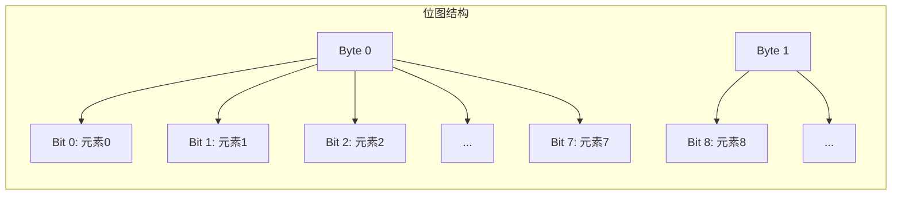
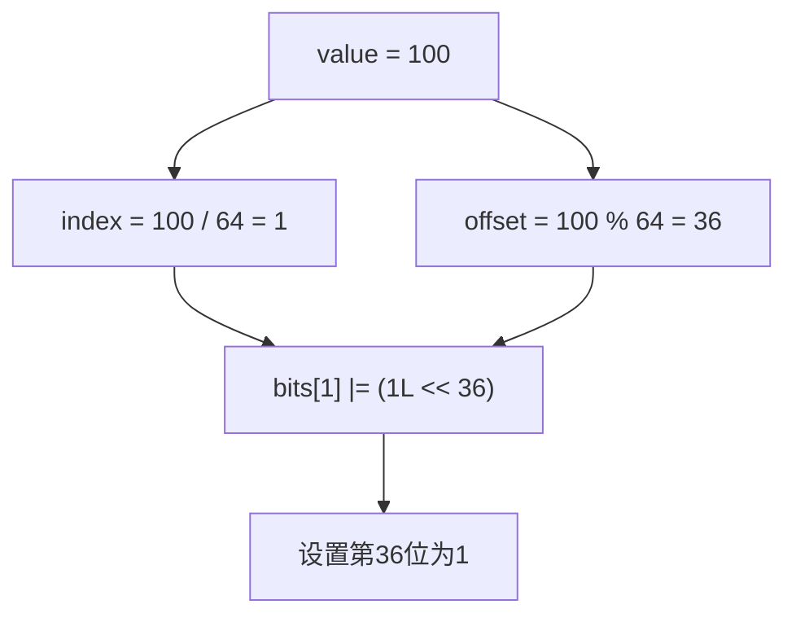
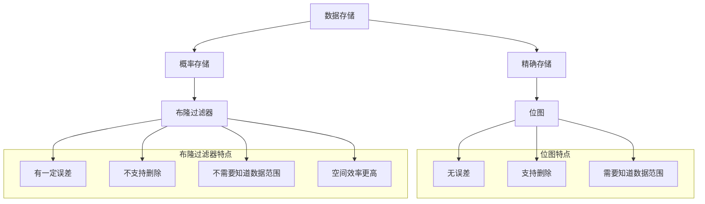

## 引言

位图（BitMap）是一种高效的数据结构，它使用位（bit）来表示元素的存在状态。相比于传统的数据结构（如数组、链表），位图在空间效率上有着巨大的优势，特别适合处理大规模数据的去重、排序、查找等场景。

本文将深入讲解位图的原理、实现、应用场景，并与布隆过滤器进行对比。

## 位图原理

### 基本概念

位图的核心思想是用一个 bit 位来表示一个元素是否存在。如果第 i 位为 1，表示元素 i 存在；如果为 0，表示元素 i 不存在。



### 空间对比

假设需要存储 1 亿个整数（0-99999999）：

| 数据结构 | 空间占用 | 计算公式 |
|---------|---------|---------|
| **普通数组** | 约 381 MB | 1亿 × 4 字节 |
| **HashSet** | 约 1 GB+ | 包含对象头、引用等额外开销 |
| **位图** | 约 12 MB | 1亿 / 8 = 12,500,000 字节 |

位图的空间效率是普通数组的 **32 倍**，是 HashSet 的 **80 倍以上**。

## 位图实现

### 核心操作

位图的基本操作包括：设置位、清除位、检查位。

```java
public class BitMap {
    private final long[] bits;
    private final int size;

    public BitMap(int maxValue) {
        this.size = maxValue + 1;
        this.bits = new long[(size + 63) / 64];
    }

    public void set(int value) {
        if (value < 0 || value >= size) {
            throw new IllegalArgumentException("Value out of range");
        }
        int index = value / 64;
        int offset = value % 64;
        bits[index] |= (1L << offset);
    }

    public void clear(int value) {
        if (value < 0 || value >= size) {
            throw new IllegalArgumentException("Value out of range");
        }
        int index = value / 64;
        int offset = value % 64;
        bits[index] &= ~(1L << offset);
    }

    public boolean contains(int value) {
        if (value < 0 || value >= size) {
            return false;
        }
        int index = value / 64;
        int offset = value % 64;
        return (bits[index] & (1L << offset)) != 0;
    }

    public int getCount() {
        int count = 0;
        for (long word : bits) {
            count += Long.bitCount(word);
        }
        return count;
    }
}
```

### 位运算详解



**设置位**：`bits[index] |= (1L << offset)`
- 将 1 左移 offset 位，得到只有第 offset 位为 1 的数
- 使用或运算，将该位设置为 1

**清除位**：`bits[index] &= ~(1L << offset)`
- 将 1 左移 offset 位，然后取反，得到只有第 offset 位为 0 的数
- 使用与运算，将该位设置为 0

**检查位**：`(bits[index] & (1L << offset)) != 0`
- 使用与运算，检查该位是否为 1

## 高级操作

### 位图交集

```java
public BitMap intersect(BitMap other) {
    int minSize = Math.min(this.size, other.size);
    BitMap result = new BitMap(minSize - 1);
    
    int minLength = Math.min(this.bits.length, other.bits.length);
    for (int i = 0; i < minLength; i++) {
        result.bits[i] = this.bits[i] & other.bits[i];
    }
    
    return result;
}
```

### 位图并集

```java
public BitMap union(BitMap other) {
    int maxSize = Math.max(this.size, other.size);
    BitMap result = new BitMap(maxSize - 1);
    
    int maxLength = Math.max(this.bits.length, other.bits.length);
    for (int i = 0; i < maxLength; i++) {
        long thisVal = i < this.bits.length ? this.bits[i] : 0;
        long otherVal = i < other.bits.length ? other.bits[i] : 0;
        result.bits[i] = thisVal | otherVal;
    }
    
    return result;
}
```

### 位图差集

```java
public BitMap difference(BitMap other) {
    BitMap result = new BitMap(this.size - 1);
    
    for (int i = 0; i < this.bits.length; i++) {
        long otherVal = i < other.bits.length ? other.bits[i] : 0;
        result.bits[i] = this.bits[i] & ~otherVal;
    }
    
    return result;
}
```

### 快速统计

```java
public int countRange(int start, int end) {
    int count = 0;
    
    int startIndex = start / 64;
    int startOffset = start % 64;
    int endIndex = end / 64;
    int endOffset = end % 64;
    
    if (startIndex == endIndex) {
        long mask = ((1L << (endOffset - startOffset + 1)) - 1) << startOffset;
        return Long.bitCount(bits[startIndex] & mask);
    }
    
    long startMask = (1L << (64 - startOffset)) - 1;
    count += Long.bitCount(bits[startIndex] & startMask);
    
    for (int i = startIndex + 1; i < endIndex; i++) {
        count += Long.bitCount(bits[i]);
    }
    
    long endMask = (1L << (endOffset + 1)) - 1;
    count += Long.bitCount(bits[endIndex] & endMask);
    
    return count;
}
```

## 应用场景

### 数据去重

```java
public int[] deduplicate(int[] nums) {
    if (nums == null || nums.length == 0) return nums;
    
    int max = Arrays.stream(nums).max().orElse(0);
    BitMap bitMap = new BitMap(max);
    
    for (int num : nums) {
        bitMap.set(num);
    }
    
    List<Integer> result = new ArrayList<>();
    for (int i = 0; i <= max; i++) {
        if (bitMap.contains(i)) {
            result.add(i);
        }
    }
    
    return result.stream().mapToInt(Integer::intValue).toArray();
}
```

### 快速排序

位图可以实现 O(n) 时间复杂度的排序：

```java
public int[] sort(int[] nums) {
    if (nums == null || nums.length == 0) return nums;
    
    int max = Arrays.stream(nums).max().orElse(0);
    int min = Arrays.stream(nums).min().orElse(0);
    
    BitMap bitMap = new BitMap(max - min);
    
    for (int num : nums) {
        bitMap.set(num - min);
    }
    
    int[] result = new int[nums.length];
    int index = 0;
    for (int i = 0; i <= max - min; i++) {
        if (bitMap.contains(i)) {
            result[index++] = i + min;
        }
    }
    
    return result;
}
```

### 海量数据查找

在搜索引擎、日志分析等场景中，需要快速判断某个 ID 是否存在：

```java
public class LogAnalyzer {
    private BitMap activeUsers;
    
    public LogAnalyzer(int maxUserId) {
        this.activeUsers = new BitMap(maxUserId);
    }
    
    public void recordAccess(int userId) {
        activeUsers.set(userId);
    }
    
    public boolean isActive(int userId) {
        return activeUsers.contains(userId);
    }
    
    public int getActiveUserCount() {
        return activeUsers.getCount();
    }
}
```

### 布隆过滤器基础

位图是布隆过滤器的核心组件：

```java
public class BloomFilter {
    private final BitMap bitMap;
    private final int hashCount;
    private final int capacity;

    public BloomFilter(int capacity, double falsePositiveRate) {
        this.capacity = capacity;
        this.hashCount = (int) Math.ceil(Math.log(1 / falsePositiveRate) / Math.log(2));
        int bitSize = (int) Math.ceil(capacity * Math.log(1 / falsePositiveRate) / Math.log(2) / Math.log(2));
        this.bitMap = new BitMap(bitSize - 1);
    }

    public void add(String key) {
        for (int i = 0; i < hashCount; i++) {
            int hash = hash(key, i);
            bitMap.set(hash);
        }
    }

    public boolean mightContain(String key) {
        for (int i = 0; i < hashCount; i++) {
            int hash = hash(key, i);
            if (!bitMap.contains(hash)) {
                return false;
            }
        }
        return true;
    }

    private int hash(String key, int seed) {
        int hash = 0;
        for (char c : key.toCharArray()) {
            hash = seed * hash + c;
        }
        return Math.abs(hash) % bitMap.size;
    }
}
```

## 位图 vs 布隆过滤器

| 特性 | 位图 | 布隆过滤器 |
|------|------|-----------|
| **存储方式** | 精确存储 | 概率存储 |
| **误判率** | 0% | 有一定误判率 |
| **删除操作** | 支持 | 不支持（标准实现） |
| **空间效率** | 高 | 更高 |
| **适用场景** | 精确查找、去重、排序 | 去重、缓存穿透防护 |



## Java 中的位图实现

### BitSet

Java 标准库提供了 `BitSet` 类：

```java
BitSet bitSet = new BitSet(1000);

bitSet.set(100);
bitSet.set(200);
bitSet.set(300);

System.out.println(bitSet.get(100));  // true
System.out.println(bitSet.get(150));  // false

bitSet.clear(200);
System.out.println(bitSet.get(200));  // false

// 位运算
BitSet other = new BitSet(1000);
other.set(200);
other.set(300);

bitSet.and(other);
System.out.println(bitSet.get(300));  // true
```

### 注意事项

1. **数据范围**：位图需要预先知道数据的最大范围
2. **稀疏数据**：对于稀疏数据，位图可能浪费空间
3. **并发安全**：`BitSet` 不是线程安全的，需要额外同步

## 实战题目

### LeetCode 相关题目

| 题目 | 难度 | 标签 | 链接 |
|------|------|------|------|
| 349. 两个数组的交集 | 简单 | 位图/哈希表 | https://leetcode.cn/problems/intersection-of-two-arrays/ |
| 350. 两个数组的交集 II | 简单 | 位图/哈希表 | https://leetcode.cn/problems/intersection-of-two-arrays-ii/ |
| 268. 丢失的数字 | 简单 | 位图/数学 | https://leetcode.cn/problems/missing-number/ |
| 41. 缺失的第一个正数 | 困难 | 位图 | https://leetcode.cn/problems/first-missing-positive/ |

### 题解示例

```java
// LeetCode 41: 缺失的第一个正数
public int firstMissingPositive(int[] nums) {
    int n = nums.length;
    
    for (int i = 0; i < n; i++) {
        while (nums[i] > 0 && nums[i] <= n && nums[nums[i] - 1] != nums[i]) {
            int temp = nums[nums[i] - 1];
            nums[nums[i] - 1] = nums[i];
            nums[i] = temp;
        }
    }
    
    for (int i = 0; i < n; i++) {
        if (nums[i] != i + 1) {
            return i + 1;
        }
    }
    
    return n + 1;
}
```

## 结语

位图是一种极其高效的数据结构，在处理大规模数据时具有不可替代的优势。

核心要点：
- **空间效率**：用 bit 位表示状态，比普通数组节省 32 倍空间
- **操作高效**：位运算速度快，O(1) 时间复杂度
- **适用场景**：数据去重、排序、快速查找、布隆过滤器

选择位图时需要注意：
1. 数据范围是否已知且可控
2. 数据分布是否密集（稀疏数据可能浪费空间）
3. 是否需要支持删除操作

结合布隆过滤器，可以进一步扩展位图的应用场景，在空间和准确性之间取得平衡。

---

**延伸阅读**：

1. *算法导论* - 位图章节
2. Java BitSet 文档 - https://docs.oracle.com/en/java/javase/21/docs/api/java.base/java/util/BitSet.html
3. 布隆过滤器原理 - https://en.wikipedia.org/wiki/Bloom_filter