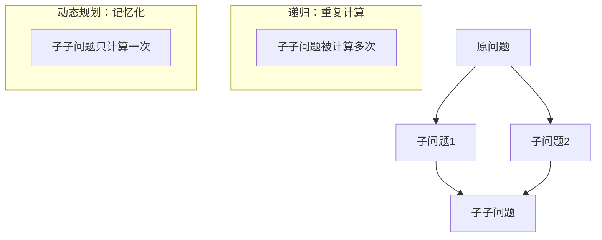
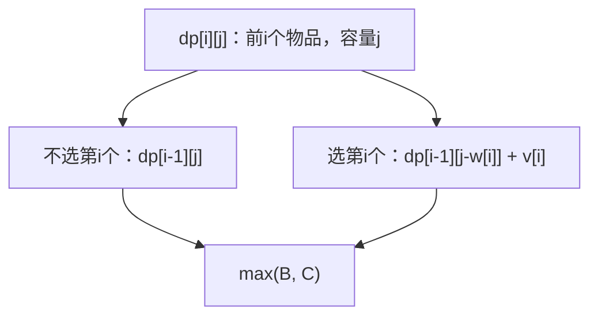
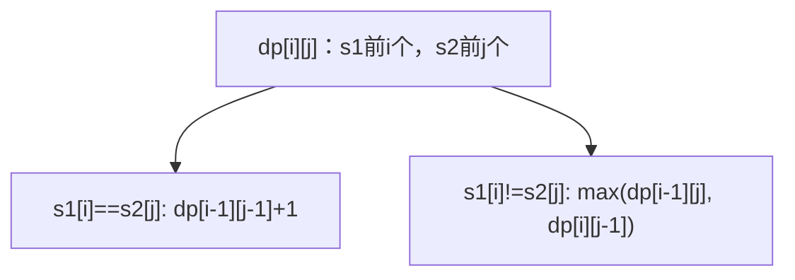

## 引言

动态规划（Dynamic Programming，简称 DP）是一种解决复杂问题的高效算法思想。它通过将问题分解为子问题，利用子问题的解来构建原问题的解，从而避免重复计算。

动态规划的核心要素：
1. **最优子结构**：原问题的最优解包含子问题的最优解
2. **重叠子问题**：子问题会被重复计算多次
3. **状态转移方程**：描述如何从子问题的解得到原问题的解

本文将系统讲解动态规划的基本思想，并深入分析背包问题、最长公共子序列、编辑距离、爬楼梯、股票买卖等经典 DP 问题。

## 动态规划基础

### 递归 vs 动态规划



### 解题步骤

1. **定义状态**：确定 DP 数组的含义
2. **状态转移**：推导状态转移方程
3. **初始状态**：设置边界条件
4. **计算顺序**：确定遍历顺序

### 两种实现方式

```java
// 方式一：递归 + 记忆化（自顶向下）
public int fib(int n, int[] memo) {
    if (n <= 1) return n;
    if (memo[n] != 0) return memo[n];
    memo[n] = fib(n - 1, memo) + fib(n - 2, memo);
    return memo[n];
}

// 方式二：迭代 + DP数组（自底向上）
public int fibDP(int n) {
    if (n <= 1) return n;
    int[] dp = new int[n + 1];
    dp[0] = 0;
    dp[1] = 1;
    for (int i = 2; i <= n; i++) {
        dp[i] = dp[i - 1] + dp[i - 2];
    }
    return dp[n];
}
```

## 背包问题

### 0-1 背包

#### 问题描述

有 `n` 个物品，每个物品有重量 `w[i]` 和价值 `v[i]`，背包容量为 `C`。每个物品只能选一次，求最大价值。

#### 状态转移



#### 代码实现

```java
public int knapsack01(int[] weights, int[] values, int capacity) {
    int n = weights.length;
    int[][] dp = new int[n + 1][capacity + 1];
    
    for (int i = 1; i <= n; i++) {
        for (int j = 1; j <= capacity; j++) {
            if (j >= weights[i - 1]) {
                dp[i][j] = Math.max(dp[i - 1][j], dp[i - 1][j - weights[i - 1]] + values[i - 1]);
            } else {
                dp[i][j] = dp[i - 1][j];
            }
        }
    }
    
    return dp[n][capacity];
}
```

#### 空间优化

```java
public int knapsack01Optimize(int[] weights, int[] values, int capacity) {
    int n = weights.length;
    int[] dp = new int[capacity + 1];
    
    for (int i = 0; i < n; i++) {
        for (int j = capacity; j >= weights[i]; j--) {
            dp[j] = Math.max(dp[j], dp[j - weights[i]] + values[i]);
        }
    }
    
    return dp[capacity];
}
```

### 完全背包

#### 问题描述

每个物品可以选多次，求最大价值。

#### 代码实现

```java
public int knapsackComplete(int[] weights, int[] values, int capacity) {
    int n = weights.length;
    int[] dp = new int[capacity + 1];
    
    for (int i = 0; i < n; i++) {
        for (int j = weights[i]; j <= capacity; j++) {
            dp[j] = Math.max(dp[j], dp[j - weights[i]] + values[i]);
        }
    }
    
    return dp[capacity];
}
```

### 多重背包

#### 问题描述

每个物品有数量限制，求最大价值。

#### 代码实现

```java
public int knapsackMulti(int[] weights, int[] values, int[] counts, int capacity) {
    int n = weights.length;
    int[] dp = new int[capacity + 1];
    
    for (int i = 0; i < n; i++) {
        for (int j = capacity; j >= weights[i]; j--) {
            for (int k = 1; k <= counts[i] && j >= k * weights[i]; k++) {
                dp[j] = Math.max(dp[j], dp[j - k * weights[i]] + k * values[i]);
            }
        }
    }
    
    return dp[capacity];
}
```

## 最长公共子序列（LCS）

### 问题描述

给定两个字符串 `s1` 和 `s2`，求它们的最长公共子序列长度。

### 状态转移



### 代码实现

```java
public int longestCommonSubsequence(String s1, String s2) {
    int m = s1.length();
    int n = s2.length();
    int[][] dp = new int[m + 1][n + 1];
    
    for (int i = 1; i <= m; i++) {
        for (int j = 1; j <= n; j++) {
            if (s1.charAt(i - 1) == s2.charAt(j - 1)) {
                dp[i][j] = dp[i - 1][j - 1] + 1;
            } else {
                dp[i][j] = Math.max(dp[i - 1][j], dp[i][j - 1]);
            }
        }
    }
    
    return dp[m][n];
}
```

### 空间优化

```java
public int lcsOptimize(String s1, String s2) {
    int m = s1.length();
    int n = s2.length();
    int[] dp = new int[n + 1];
    
    for (int i = 1; i <= m; i++) {
        int prev = 0;
        for (int j = 1; j <= n; j++) {
            int temp = dp[j];
            if (s1.charAt(i - 1) == s2.charAt(j - 1)) {
                dp[j] = prev + 1;
            } else {
                dp[j] = Math.max(dp[j], dp[j - 1]);
            }
            prev = temp;
        }
    }
    
    return dp[n];
}
```

## 编辑距离

### 问题描述

将字符串 `s1` 转换为 `s2` 所需的最少操作次数（插入、删除、替换）。

### 状态转移

```java
if (s1[i] == s2[j]) {
    dp[i][j] = dp[i-1][j-1];
} else {
    dp[i][j] = min(
        dp[i-1][j] + 1,    // 删除
        dp[i][j-1] + 1,    // 插入
        dp[i-1][j-1] + 1   // 替换
    );
}
```

### 代码实现

```java
public int editDistance(String s1, String s2) {
    int m = s1.length();
    int n = s2.length();
    int[][] dp = new int[m + 1][n + 1];
    
    for (int i = 0; i <= m; i++) dp[i][0] = i;
    for (int j = 0; j <= n; j++) dp[0][j] = j;
    
    for (int i = 1; i <= m; i++) {
        for (int j = 1; j <= n; j++) {
            if (s1.charAt(i - 1) == s2.charAt(j - 1)) {
                dp[i][j] = dp[i - 1][j - 1];
            } else {
                dp[i][j] = Math.min(Math.min(dp[i - 1][j], dp[i][j - 1]), dp[i - 1][j - 1]) + 1;
            }
        }
    }
    
    return dp[m][n];
}
```

## 爬楼梯问题

### 问题描述

楼梯有 `n` 阶，每次可以爬 1 阶或 2 阶，求有多少种不同的方法。

### 状态转移

```
dp[i] = dp[i-1] + dp[i-2]
```

### 代码实现

```java
public int climbStairs(int n) {
    if (n <= 2) return n;
    
    int[] dp = new int[n + 1];
    dp[1] = 1;
    dp[2] = 2;
    
    for (int i = 3; i <= n; i++) {
        dp[i] = dp[i - 1] + dp[i - 2];
    }
    
    return dp[n];
}
```

### 空间优化

```java
public int climbStairsOptimize(int n) {
    if (n <= 2) return n;
    
    int prev2 = 1;
    int prev1 = 2;
    
    for (int i = 3; i <= n; i++) {
        int curr = prev1 + prev2;
        prev2 = prev1;
        prev1 = curr;
    }
    
    return prev1;
}
```

## 股票买卖问题

### 买卖一次

```java
public int maxProfit(int[] prices) {
    int minPrice = Integer.MAX_VALUE;
    int maxProfit = 0;
    
    for (int price : prices) {
        minPrice = Math.min(minPrice, price);
        maxProfit = Math.max(maxProfit, price - minPrice);
    }
    
    return maxProfit;
}
```

### 买卖多次

```java
public int maxProfitII(int[] prices) {
    int profit = 0;
    
    for (int i = 1; i < prices.length; i++) {
        if (prices[i] > prices[i - 1]) {
            profit += prices[i] - prices[i - 1];
        }
    }
    
    return profit;
}
```

### 买卖两次

```java
public int maxProfitIII(int[] prices) {
    int n = prices.length;
    int[][] dp = new int[n][4];
    
    dp[0][0] = -prices[0];  // 第一次买入
    dp[0][1] = 0;           // 第一次卖出
    dp[0][2] = -prices[0];  // 第二次买入
    dp[0][3] = 0;           // 第二次卖出
    
    for (int i = 1; i < n; i++) {
        dp[i][0] = Math.max(dp[i - 1][0], -prices[i]);
        dp[i][1] = Math.max(dp[i - 1][1], dp[i - 1][0] + prices[i]);
        dp[i][2] = Math.max(dp[i - 1][2], dp[i - 1][1] - prices[i]);
        dp[i][3] = Math.max(dp[i - 1][3], dp[i - 1][2] + prices[i]);
    }
    
    return dp[n - 1][3];
}
```

### 买卖 k 次

```java
public int maxProfitIV(int k, int[] prices) {
    int n = prices.length;
    int[][] dp = new int[n][2 * k + 1];
    
    for (int i = 1; i < 2 * k; i += 2) {
        dp[0][i] = -prices[0];
    }
    
    for (int i = 1; i < n; i++) {
        for (int j = 0; j < 2 * k - 1; j += 2) {
            dp[i][j + 1] = Math.max(dp[i - 1][j + 1], dp[i - 1][j] - prices[i]);
            dp[i][j + 2] = Math.max(dp[i - 1][j + 2], dp[i - 1][j + 1] + prices[i]);
        }
    }
    
    return dp[n - 1][2 * k];
}
```

### 含冷冻期

```java
public int maxProfitWithCooldown(int[] prices) {
    int n = prices.length;
    int[][] dp = new int[n][3];
    
    dp[0][0] = -prices[0];  // 持有
    dp[0][1] = 0;           // 冷冻期
    dp[0][2] = 0;           // 不持有且非冷冻期
    
    for (int i = 1; i < n; i++) {
        dp[i][0] = Math.max(dp[i - 1][0], dp[i - 1][2] - prices[i]);
        dp[i][1] = dp[i - 1][0] + prices[i];
        dp[i][2] = Math.max(dp[i - 1][2], dp[i - 1][1]);
    }
    
    return Math.max(dp[n - 1][1], dp[n - 1][2]);
}
```

## 最长递增子序列（LIS）

### 问题描述

给定数组，求最长递增子序列的长度。

### 动态规划解法

```java
public int lengthOfLIS(int[] nums) {
    int n = nums.length;
    int[] dp = new int[n];
    Arrays.fill(dp, 1);
    
    for (int i = 1; i < n; i++) {
        for (int j = 0; j < i; j++) {
            if (nums[i] > nums[j]) {
                dp[i] = Math.max(dp[i], dp[j] + 1);
            }
        }
    }
    
    return Arrays.stream(dp).max().orElse(0);
}
```

### 贪心 + 二分优化

```java
public int lengthOfLISOptimize(int[] nums) {
    List<Integer> tails = new ArrayList<>();
    
    for (int num : nums) {
        int left = 0, right = tails.size();
        while (left < right) {
            int mid = left + (right - left) / 2;
            if (tails.get(mid) < num) {
                left = mid + 1;
            } else {
                right = mid;
            }
        }
        
        if (left == tails.size()) {
            tails.add(num);
        } else {
            tails.set(left, num);
        }
    }
    
    return tails.size();
}
```

## 最大子数组和

### 问题描述

给定数组，求最大连续子数组的和。

### Kadane 算法

```java
public int maxSubArray(int[] nums) {
    int maxSum = nums[0];
    int currentSum = nums[0];
    
    for (int i = 1; i < nums.length; i++) {
        currentSum = Math.max(nums[i], currentSum + nums[i]);
        maxSum = Math.max(maxSum, currentSum);
    }
    
    return maxSum;
}
```

## 算法对比

### DP 问题类型总结

| 类型 | 典型问题 | 状态定义 | 转移方程特征 |
|------|---------|---------|-------------|
| **线性 DP** | 爬楼梯、最大子数组 | dp[i] | 依赖前面状态 |
| **区间 DP** | 最长回文子串 | dp[i][j] | 依赖小区间 |
| **二维 DP** | LCS、编辑距离 | dp[i][j] | 二维状态 |
| **背包 DP** | 0-1背包、完全背包 | dp[j] | 容量维度 |
| **状态机 DP** | 股票买卖 | dp[i][state] | 状态转移 |
| **树形 DP** | 树的直径 | dp[root] | 后序遍历 |

### 空间优化技巧

| 技巧 | 适用场景 | 效果 |
|------|---------|------|
| **滚动数组** | 只依赖前一行 | O(n) → O(1) |
| **一维优化** | 背包问题 | O(n×m) → O(m) |
| **变量代替数组** | Fibonacci、爬楼梯 | O(n) → O(1) |

## 实战题目

### LeetCode 相关题目

| 题目 | 难度 | 标签 | 链接 |
|------|------|------|------|
| 53. 最大子数组和 | 中等 | 线性DP | https://leetcode.cn/problems/maximum-subarray/ |
| 300. 最长递增子序列 | 中等 | 线性DP | https://leetcode.cn/problems/longest-increasing-subsequence/ |
| 1143. 最长公共子序列 | 中等 | 二维DP | https://leetcode.cn/problems/longest-common-subsequence/ |
| 72. 编辑距离 | 困难 | 二维DP | https://leetcode.cn/problems/edit-distance/ |
| 121. 买卖股票的最佳时机 | 简单 | 状态机DP | https://leetcode.cn/problems/best-time-to-buy-and-sell-stock/ |
| 123. 买卖股票的最佳时机 III | 困难 | 状态机DP | https://leetcode.cn/problems/best-time-to-buy-and-sell-stock-iii/ |
| 322. 零钱兑换 | 中等 | 完全背包 | https://leetcode.cn/problems/coin-change/ |
| 416. 分割等和子集 | 中等 | 0-1背包 | https://leetcode.cn/problems/partition-equal-subset-sum/ |

### 题解示例

```java
// LeetCode 322: 零钱兑换
public int coinChange(int[] coins, int amount) {
    int[] dp = new int[amount + 1];
    Arrays.fill(dp, amount + 1);
    dp[0] = 0;
    
    for (int i = 1; i <= amount; i++) {
        for (int coin : coins) {
            if (i >= coin) {
                dp[i] = Math.min(dp[i], dp[i - coin] + 1);
            }
        }
    }
    
    return dp[amount] > amount ? -1 : dp[amount];
}
```

## 结语

动态规划是算法面试中最重要的知识点之一。掌握动态规划的关键在于：

核心要点：
1. **理解问题本质**：分析是否具备最优子结构和重叠子问题
2. **定义清晰状态**：状态的定义决定了后续的转移方程
3. **推导转移方程**：找到状态之间的递推关系
4. **优化空间复杂度**：考虑是否可以使用滚动数组或一维优化

常见套路：
- **线性 DP**：从左到右或从右到左遍历
- **二维 DP**：两个维度分别表示两个序列的状态
- **背包问题**：外层物品，内层容量，注意遍历顺序
- **状态机 DP**：定义多个状态，处理有约束的问题

多练习、多总结，才能在面试中快速识别 DP 问题并给出高效的解决方案。

---

**延伸阅读**：

1. *算法导论* - 动态规划章节
2. LeetCode 动态规划专题 - https://leetcode.cn/tag/dynamic-programming/
3. 动态规划可视化 - https://algorithm-visualizer.org/dynamic-programming