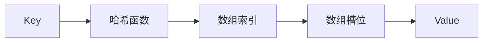
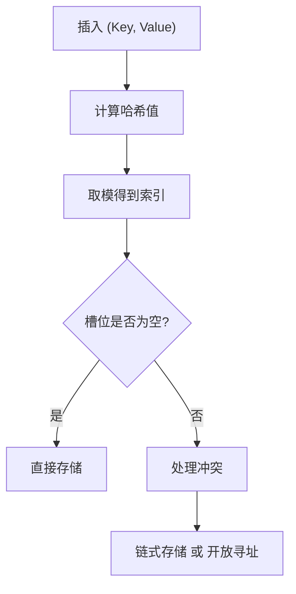
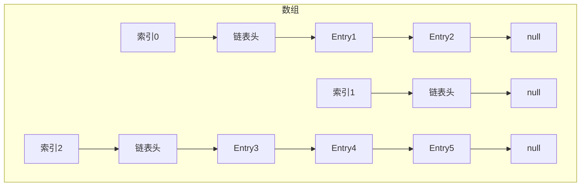
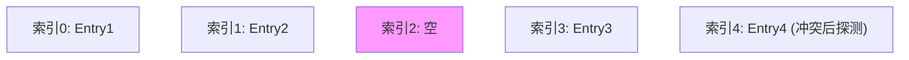
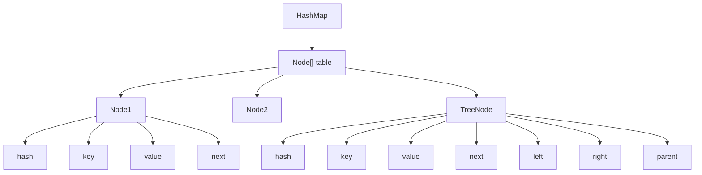
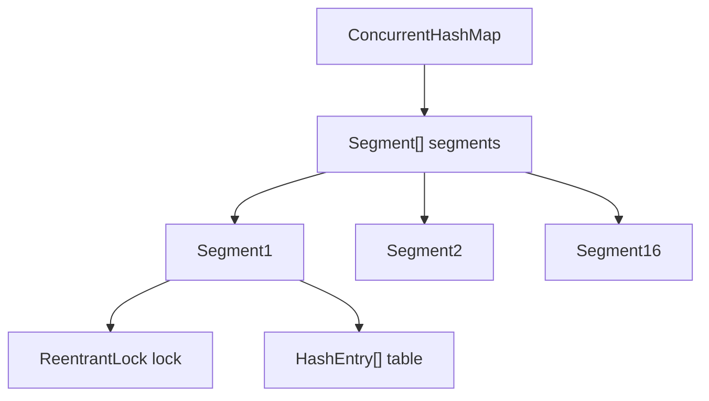
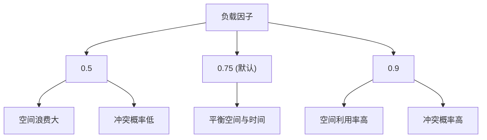

---
title: "哈希?HashMap 详解"
description: "哈希表原理、哈希函数、冲突处理、Java HashMap实现及ConcurrentHashMap"
date: 2023-01-26T17:10:48+08:00
lastmod: 2023-01-26T17:10:48+08:00
weight: 7
tags:
  - 哈希
  - HashMap
  - 数据结构
  - ConcurrentHashMap
categories:
  - 数据结构
  - 技术分享
math:  true
mermaid: true
photos:
  - https://images.unsplash.com/photo-1544005313-94ddf0286df2?w=1920&q=80
---

## 引言

哈希表（Hash Table）是一种高效的数据结构，通过哈希函数将键映射到数组索引，实现 O(1) 平均时间复杂度的查找、插入和删除操作。它是计算机科学中最重要的数据结构之一，广泛应用于缓存、数据库索引、编译器符号表等领域。

本文将深入讲解哈希表的原理、哈希函数设计、冲突处理策略、Java HashMap 的实现细节，以及 ConcurrentHashMap 的并发安全机制。

## 哈希表原理

### 基本概念

哈希表的核心思想是通过哈希函数将键转换为数组索引，从而实现快速访问。



### 工作流程



### 核心要素

| 要素 | 说明 |
|------|------|
| **哈希函数** | 将 Key 转换为整数索引 |
| **数组** | 存储数据的主结构 |
| **冲突处理** | 解决不同 Key 映射到同一索引的问题 |
| **负载因子** | 控制扩容时机 |

## 哈希函数设计

### 设计原则

1. **均匀分布**：哈希值应均匀分布在数组范围内
2. **快速计算**：哈希函数应简单高效
3. **确定性**：相同的 Key 应产生相同的哈希值

### 常见哈希函数

```java
public class HashFunctions {
    public static int simpleHash(String key, int capacity) {
        int hash = 0;
        for (char c : key.toCharArray()) {
            hash = hash * 31 + c;
        }
        return Math.abs(hash) % capacity;
    }

    public static int polynomialHash(String key, int capacity) {
        int hash = 0;
        int base = 911382629;
        for (char c : key.toCharArray()) {
            hash = (hash * base + c) % Integer.MAX_VALUE;
        }
        return Math.abs(hash) % capacity;
    }

    public static int fnvHash(String key, int capacity) {
        int hash = 0x811C9DC5;
        for (char c : key.toCharArray()) {
            hash ^= c;
            hash *= 0x01000193;
        }
        return Math.abs(hash) % capacity;
    }
}
```

### Java String 哈希函数

```java
public int hashCode() {
    int h = hash;
    if (h == 0 && value.length > 0) {
        char val[] = value;
        for (int i = 0; i < value.length; i++) {
            h = 31 * h + val[i];
        }
        hash = h;
    }
    return h;
}
```

选择 31 的原因：
- 31 是质数，能减少哈希冲突
- 31 * h = (h << 5) - h，计算效率高

## 冲突处理

### 链式地址法



### 开放寻址法



### 再哈希法

```java
public class DoubleHashing {
    private static final int[] PRIMES = {7, 13, 17, 31, 61};
    
    public static int hash1(String key, int capacity) {
        return Math.abs(key.hashCode()) % capacity;
    }
    
    public static int hash2(String key, int capacity) {
        int hash = 0;
        for (char c : key.toCharArray()) {
            hash = hash * 37 + c;
        }
        return PRIMES[hash % PRIMES.length];
    }
    
    public static int findSlot(String key, int capacity, int[] table) {
        int slot = hash1(key, capacity);
        int step = hash2(key, capacity);
        
        while (table[slot] != 0) {
            slot = (slot + step) % capacity;
        }
        
        return slot;
    }
}
```

### 冲突处理对比

| 方法 | 优点 | 缺点 |
|------|------|------|
| **链式地址法** | 实现简单，支持删除 | 额外空间开销，缓存友好性差 |
| **开放寻址法** | 缓存友好，无额外空间 | 删除复杂，容易聚集 |
| **再哈希法** | 减少聚集 | 计算开销大 |

## Java HashMap 实现

### 内部结构



### 核心字段

```java
public class HashMap<K, V> extends AbstractMap<K, V>
    implements Map<K, V>, Cloneable, Serializable {
    
    static final int DEFAULT_INITIAL_CAPACITY = 1 << 4;
    static final int MAXIMUM_CAPACITY = 1 << 30;
    static final float DEFAULT_LOAD_FACTOR = 0.75f;
    static final int TREEIFY_THRESHOLD = 8;
    static final int UNTREEIFY_THRESHOLD = 6;
    static final int MIN_TREEIFY_CAPACITY = 64;
    
    transient Node<K,V>[] table;
    transient Set<Map.Entry<K,V>> entrySet;
    transient int size;
    transient int modCount;
    int threshold;
    final float loadFactor;
}
```

### get 方法

```java
public V get(Object key) {
    Node<K,V> e;
    return (e = getNode(hash(key), key)) == null ? null : e.value;
}

final Node<K,V> getNode(int hash, Object key) {
    Node<K,V>[] tab; Node<K,V> first, e; int n; K k;
    if ((tab = table) != null && (n = tab.length) > 0 &&
        (first = tab[(n - 1) & hash]) != null) {
        if (first.hash == hash && 
            ((k = first.key) == key || (key != null && key.equals(k))))
            return first;
        if ((e = first.next) != null) {
            if (first instanceof TreeNode)
                return ((TreeNode<K,V>)first).getTreeNode(hash, key);
            do {
                if (e.hash == hash &&
                    ((k = e.key) == key || (key != null && key.equals(k))))
                    return e;
            } while ((e = e.next) != null);
        }
    }
    return null;
}
```

### put 方法

```java
public V put(K key, V value) {
    return putVal(hash(key), key, value, false, true);
}

final V putVal(int hash, K key, V value, boolean onlyIfAbsent,
               boolean evict) {
    Node<K,V>[] tab; Node<K,V> p; int n, i;
    if ((tab = table) == null || (n = tab.length) == 0)
        n = (tab = resize()).length;
    if ((p = tab[i = (n - 1) & hash]) == null)
        tab[i] = newNode(hash, key, value, null);
    else {
        Node<K,V> e; K k;
        if (p.hash == hash &&
            ((k = p.key) == key || (key != null && key.equals(k))))
            e = p;
        else if (p instanceof TreeNode)
            e = ((TreeNode<K,V>)p).putTreeVal(this, tab, hash, key, value);
        else {
            for (int binCount = 0; ; ++binCount) {
                if ((e = p.next) == null) {
                    p.next = newNode(hash, key, value, null);
                    if (binCount >= TREEIFY_THRESHOLD - 1)
                        treeifyBin(tab, hash);
                    break;
                }
                if (e.hash == hash &&
                    ((k = e.key) == key || (key != null && key.equals(k))))
                    break;
                p = e;
            }
        }
        if (e != null) {
            V oldValue = e.value;
            if (!onlyIfAbsent || oldValue == null)
                e.value = value;
            afterNodeAccess(e);
            return oldValue;
        }
    }
    ++modCount;
    if (++size > threshold)
        resize();
    afterNodeInsertion(evict);
    return null;
}
```

### 扩容机制

```java
final Node<K,V>[] resize() {
    Node<K,V>[] oldTab = table;
    int oldCap = (oldTab == null) ? 0 : oldTab.length;
    int oldThr = threshold;
    int newCap, newThr = 0;
    
    if (oldCap > 0) {
        if (oldCap >= MAXIMUM_CAPACITY) {
            threshold = Integer.MAX_VALUE;
            return oldTab;
        }
        else if ((newCap = oldCap << 1) < MAXIMUM_CAPACITY &&
                 oldCap >= DEFAULT_INITIAL_CAPACITY)
            newThr = oldThr << 1;
    }
    else if (oldThr > 0)
        newCap = oldThr;
    else {
        newCap = DEFAULT_INITIAL_CAPACITY;
        newThr = (int)(DEFAULT_LOAD_FACTOR * DEFAULT_INITIAL_CAPACITY);
    }
    
    if (newThr == 0) {
        float ft = (float)newCap * loadFactor;
        newThr = (newCap < MAXIMUM_CAPACITY && ft < (float)MAXIMUM_CAPACITY ?
                  (int)ft : Integer.MAX_VALUE);
    }
    
    threshold = newThr;
    @SuppressWarnings({"rawtypes","unchecked"})
    Node<K,V>[] newTab = (Node<K,V>[])new Node[newCap];
    table = newTab;
    
    if (oldTab != null) {
        for (int j = 0; j < oldCap; ++j) {
            Node<K,V> e;
            if ((e = oldTab[j]) != null) {
                oldTab[j] = null;
                if (e.next == null)
                    newTab[e.hash & (newCap - 1)] = e;
                else if (e instanceof TreeNode)
                    ((TreeNode<K,V>)e).split(this, newTab, j, oldCap);
                else {
                    Node<K,V> loHead = null, loTail = null;
                    Node<K,V> hiHead = null, hiTail = null;
                    Node<K,V> next;
                    do {
                        next = e.next;
                        if ((e.hash & oldCap) == 0) {
                            if (loTail == null)
                                loHead = e;
                            else
                                loTail.next = e;
                            loTail = e;
                        }
                        else {
                            if (hiTail == null)
                                hiHead = e;
                            else
                                hiTail.next = e;
                            hiTail = e;
                        }
                    } while ((e = next) != null);
                    if (loTail != null) {
                        loTail.next = null;
                        newTab[j] = loHead;
                    }
                    if (hiTail != null) {
                        hiTail.next = null;
                        newTab[j + oldCap] = hiHead;
                    }
                }
            }
        }
    }
    
    return newTab;
}
```

## ConcurrentHashMap

### 并发安全机制



### 关键改进

| 特性 | HashMap | ConcurrentHashMap |
|------|---------|-------------------|
| **线程安全** | 非线程安全 | 线程安全 |
| **锁机制** | 无 | 分段锁/CAS |
| **迭代器** | 快速失败 | 弱一致性 |
| **性能** | 高 | 较高（并发场景） |

### Java 8 优化

```java
// Java 8 使用 synchronized + CAS
public V put(K key, V value) {
    return putVal(key, value, false);
}

final V putVal(K key, V value, boolean onlyIfAbsent) {
    if (key == null || value == null) throw new NullPointerException();
    int hash = spread(key.hashCode());
    int binCount = 0;
    
    for (Node<K,V>[] tab = table;;) {
        Node<K,V> f; int n, i, fh;
        if (tab == null || (n = tab.length) == 0)
            tab = initTable();
        else if ((f = tabAt(tab, i = (n - 1) & hash)) == null) {
            if (casTabAt(tab, i, null,
                         new Node<K,V>(hash, key, value, null)))
                break;
        }
        else if ((fh = f.hash) == MOVED)
            tab = helpTransfer(tab, f);
        else {
            V oldVal = null;
            synchronized (f) {
                if (tabAt(tab, i) == f) {
                    if (fh >= 0) {
                        binCount = 1;
                        for (Node<K,V> e = f;; ++binCount) {
                            K ek;
                            if (e.hash == hash &&
                                ((ek = e.key) == key ||
                                 (ek != null && key.equals(ek)))) {
                                oldVal = e.val;
                                if (!onlyIfAbsent)
                                    e.val = value;
                                break;
                            }
                            Node<K,V> pred = e;
                            if ((e = e.next) == null) {
                                pred.next = new Node<K,V>(hash, key,
                                                          value, null);
                                break;
                            }
                        }
                    }
                    else if (f instanceof TreeBin) {
                        Node<K,V> p;
                        binCount = 2;
                        if ((p = ((TreeBin<K,V>)f).putTreeVal(hash, key,
                                                       value)) != null) {
                            oldVal = p.val;
                            if (!onlyIfAbsent)
                                p.val = value;
                        }
                    }
                }
            }
            if (binCount != 0) {
                if (binCount >= TREEIFY_THRESHOLD)
                    treeifyBin(tab, i);
                if (oldVal != null)
                    return oldVal;
                break;
            }
        }
    }
    addCount(1L, binCount);
    return null;
}
```

## 哈希表应用

### 缓存实现

```java
public class LRUCache<K, V> {
    private final int capacity;
    private final Map<K, Node<K, V>> map;
    private final Node<K, V> head;
    private final Node<K, V> tail;

    public LRUCache(int capacity) {
        this.capacity = capacity;
        this.map = new HashMap<>();
        this.head = new Node<>();
        this.tail = new Node<>();
        head.next = tail;
        tail.prev = head;
    }

    public V get(K key) {
        Node<K, V> node = map.get(key);
        if (node == null) return null;
        
        remove(node);
        addToHead(node);
        
        return node.value;
    }

    public void put(K key, V value) {
        Node<K, V> node = map.get(key);
        
        if (node != null) {
            node.value = value;
            remove(node);
            addToHead(node);
        } else {
            Node<K, V> newNode = new Node<>(key, value);
            map.put(key, newNode);
            addToHead(newNode);
            
            if (map.size() > capacity) {
                Node<K, V> tailNode = tail.prev;
                remove(tailNode);
                map.remove(tailNode.key);
            }
        }
    }

    private void remove(Node<K, V> node) {
        node.prev.next = node.next;
        node.next.prev = node.prev;
    }

    private void addToHead(Node<K, V> node) {
        node.next = head.next;
        node.prev = head;
        head.next.prev = node;
        head.next = node;
    }

    private static class Node<K, V> {
        K key;
        V value;
        Node<K, V> prev;
        Node<K, V> next;
        
        Node() {}
        Node(K key, V value) {
            this.key = key;
            this.value = value;
        }
    }
}
```

### 去重统计

```java
public class DeduplicationCounter {
    private Map<String, Integer> counter;

    public DeduplicationCounter() {
        this.counter = new HashMap<>();
    }

    public void add(String item) {
        counter.put(item, counter.getOrDefault(item, 0) + 1);
    }

    public int getCount(String item) {
        return counter.getOrDefault(item, 0);
    }

    public Set<String> getUniqueItems() {
        return counter.keySet();
    }

    public int getUniqueCount() {
        return counter.size();
    }
}
```

### 两数之和

```java
public int[] twoSum(int[] nums, int target) {
    Map<Integer, Integer> map = new HashMap<>();
    
    for (int i = 0; i < nums.length; i++) {
        int complement = target - nums[i];
        if (map.containsKey(complement)) {
            return new int[]{map.get(complement), i};
        }
        map.put(nums[i], i);
    }
    
    throw new IllegalArgumentException("No two sum solution");
}
```

## 性能分析

### 时间复杂度

| 操作 | 平均情况 | 最坏情况 |
|------|---------|---------|
| **查找** | O(1) | O(n) |
| **插入** | O(1) | O(n) |
| **删除** | O(1) | O(n) |

### 影响因素

| 因素 | 影响 |
|------|------|
| **哈希函数** | 决定分布均匀性 |
| **负载因子** | 影响冲突概率 |
| **冲突处理** | 影响最坏情况性能 |
| **扩容策略** | 影响插入性能 |

### 负载因子选择



## 实战题目

### LeetCode 相关题目

| 题目 | 难度 | 标签 | 链接 |
|------|------|------|------|
| 1. 两数之和 | 简单 | 哈希表 | https://leetcode.cn/problems/two-sum/ |
| 49. 字母异位词分组 | 中等 | 哈希表 | https://leetcode.cn/problems/group-anagrams/ |
| 3. 无重复字符的最长子串 | 中等 | 哈希表 | https://leetcode.cn/problems/longest-substring-without-repeating-characters/ |
| 128. 最长连续序列 | 困难 | 哈希表 | https://leetcode.cn/problems/longest-consecutive-sequence/ |

### 题解示例

```java
// LeetCode 49: 字母异位词分组
public List<List<String>> groupAnagrams(String[] strs) {
    Map<String, List<String>> map = new HashMap<>();
    
    for (String str : strs) {
        char[] chars = str.toCharArray();
        Arrays.sort(chars);
        String key = new String(chars);
        
        map.computeIfAbsent(key, k -> new ArrayList<>()).add(str);
    }
    
    return new ArrayList<>(map.values());
}
```

## 结语

哈希表是一种高效的数据结构，在计算机科学中有着广泛的应用。

核心要点：
- **O(1) 平均复杂度**：哈希函数直接定位，访问速度快
- **冲突处理**：链式地址法和开放寻址法是两种主要策略
- **Java HashMap**：使用链式地址法，链表转红黑树优化
- **ConcurrentHashMap**：线程安全的哈希表实现

选择哈希表时需要注意：
1. Key 需要正确实现 hashCode() 和 equals() 方法
2. 负载因子的选择影响性能和空间
3. 并发场景需要使用 ConcurrentHashMap

掌握哈希表的原理和实现，对于理解 Java 集合框架和解决实际问题都非常重要。

---

**延伸阅读**：

1. *算法导论* - 哈希表章节
2. Java HashMap 源码分析
3. ConcurrentHashMap 源码分析
