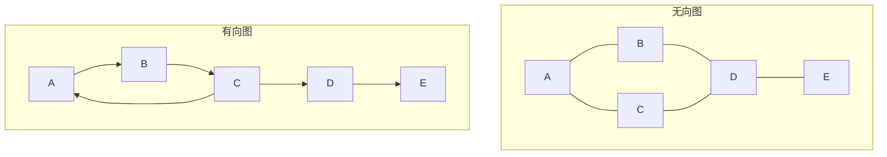
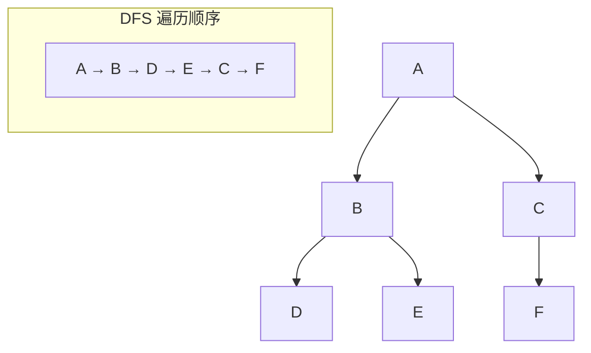
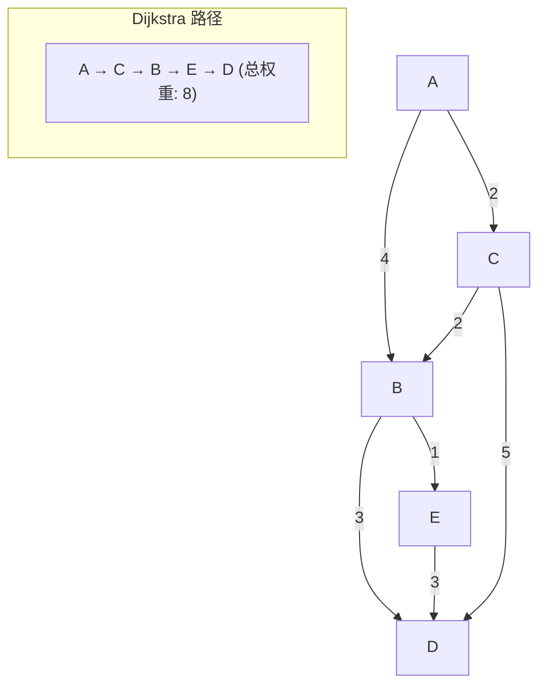
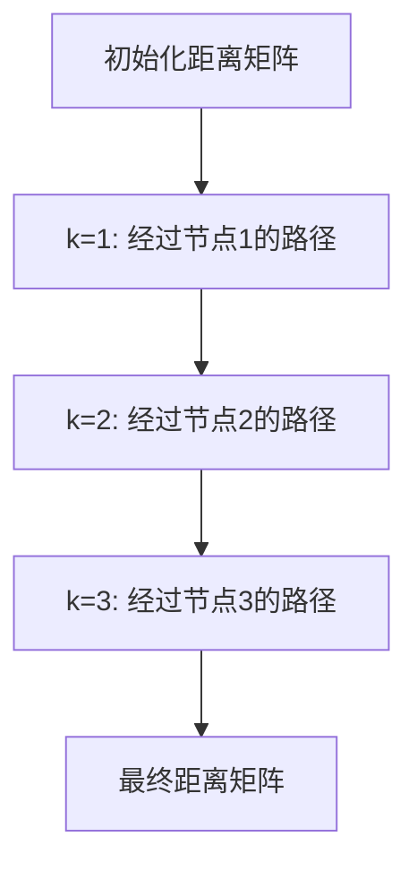
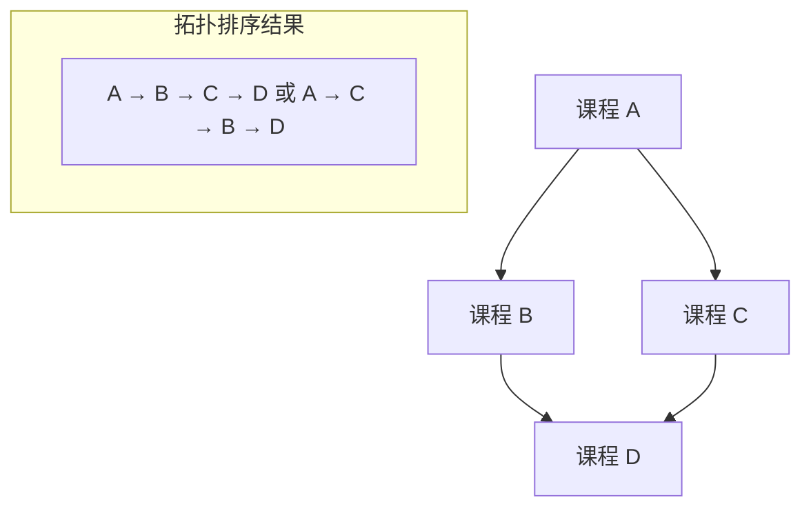
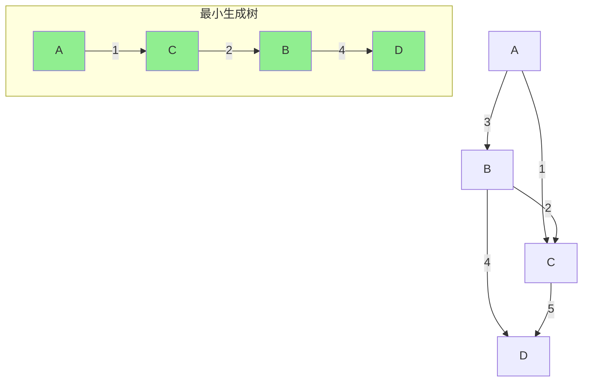

## 引言

图是一种强大的数据结构，用于表示对象之间的关系。图算法在社交网络、地图导航、网络路由、推荐系统等领域有着广泛的应用。掌握图的遍历、最短路径、拓扑排序和最小生成树等核心算法，是解决复杂问题的关键。

本文将系统讲解图的基本概念、BFS/DFS 遍历、Dijkstra 最短路径算法、Floyd-Warshall 算法、拓扑排序和最小生成树（Prim/Kruskal）。

## 图的基础概念

### 图的定义



### 图的类型

| 类型 | 说明 | 特点 |
|------|------|------|
| **无向图** | 边没有方向 | (u, v) = (v, u) |
| **有向图** | 边有方向 | <u, v> ≠ <v, u> |
| **加权图** | 边带有权重 | 用于最短路径 |
| **连通图** | 任意两点可达 | 无孤立节点 |
| **有环图** | 存在环路 | DAG 的反面 |
| **DAG** | 有向无环图 | 可拓扑排序 |

### 图的表示

```java
// 邻接矩阵
int[][] adjMatrix = {
    {0, 1, 1, 0},
    {1, 0, 0, 1},
    {1, 0, 0, 1},
    {0, 1, 1, 0}
};

// 邻接表
List<List<Integer>> adjList = new ArrayList<>();
adjList.add(Arrays.asList(1, 2));  // 0 的邻居
adjList.add(Arrays.asList(0, 3));  // 1 的邻居
adjList.add(Arrays.asList(0, 3));  // 2 的邻居
adjList.add(Arrays.asList(1, 2));  // 3 的邻居
```

## 深度优先搜索（DFS）

### 原理

DFS 是一种先尽可能深地探索分支，再回溯的遍历方式。



### 递归实现

```java
public void dfs(int node, boolean[] visited, List<List<Integer>> adj) {
    visited[node] = true;
    System.out.print(node + " ");
    
    for (int neighbor : adj.get(node)) {
        if (!visited[neighbor]) {
            dfs(neighbor, visited, adj);
        }
    }
}
```

### 迭代实现

```java
public void dfsIterative(int start, List<List<Integer>> adj) {
    boolean[] visited = new boolean[adj.size()];
    Stack<Integer> stack = new Stack<>();
    stack.push(start);
    
    while (!stack.isEmpty()) {
        int node = stack.pop();
        
        if (!visited[node]) {
            visited[node] = true;
            System.out.print(node + " ");
            
            // 逆序入栈，保证顺序
            List<Integer> neighbors = adj.get(node);
            for (int i = neighbors.size() - 1; i >= 0; i--) {
                int neighbor = neighbors.get(i);
                if (!visited[neighbor]) {
                    stack.push(neighbor);
                }
            }
        }
    }
}
```

### 应用：检测环路

```java
public boolean hasCycle(List<List<Integer>> adj) {
    int n = adj.size();
    boolean[] visited = new boolean[n];
    boolean[] onStack = new boolean[n];
    
    for (int i = 0; i < n; i++) {
        if (dfsCycle(i, visited, onStack, adj)) {
            return true;
        }
    }
    
    return false;
}

private boolean dfsCycle(int node, boolean[] visited, boolean[] onStack, List<List<Integer>> adj) {
    if (onStack[node]) return true;
    if (visited[node]) return false;
    
    visited[node] = true;
    onStack[node] = true;
    
    for (int neighbor : adj.get(node)) {
        if (dfsCycle(neighbor, visited, onStack, adj)) {
            return true;
        }
    }
    
    onStack[node] = false;
    return false;
}
```

## 广度优先搜索（BFS）

### 原理

BFS 是一种逐层遍历的方式，先访问当前节点的所有邻居，再访问邻居的邻居。


### 代码实现

```java
public void bfs(int start, List<List<Integer>> adj) {
    boolean[] visited = new boolean[adj.size()];
    Queue<Integer> queue = new LinkedList<>();
    
    visited[start] = true;
    queue.offer(start);
    
    while (!queue.isEmpty()) {
        int node = queue.poll();
        System.out.print(node + " ");
        
        for (int neighbor : adj.get(node)) {
            if (!visited[neighbor]) {
                visited[neighbor] = true;
                queue.offer(neighbor);
            }
        }
    }
}
```

### 应用：最短路径（无权图）

```java
public int[] shortestPathBFS(int start, List<List<Integer>> adj) {
    int n = adj.size();
    int[] dist = new int[n];
    Arrays.fill(dist, -1);
    
    Queue<Integer> queue = new LinkedList<>();
    dist[start] = 0;
    queue.offer(start);
    
    while (!queue.isEmpty()) {
        int node = queue.poll();
        
        for (int neighbor : adj.get(node)) {
            if (dist[neighbor] == -1) {
                dist[neighbor] = dist[node] + 1;
                queue.offer(neighbor);
            }
        }
    }
    
    return dist;
}
```

## Dijkstra 最短路径算法

### 原理

Dijkstra 算法用于在加权图中寻找从起点到所有其他节点的最短路径。



### 代码实现

```java
public int[] dijkstra(int start, List<List<int[]>> adj) {
    int n = adj.size();
    int[] dist = new int[n];
    Arrays.fill(dist, Integer.MAX_VALUE);
    dist[start] = 0;
    
    PriorityQueue<int[]> pq = new PriorityQueue<>(Comparator.comparingInt(a -> a[1]));
    pq.offer(new int[]{start, 0});
    
    while (!pq.isEmpty()) {
        int[] curr = pq.poll();
        int node = curr[0];
        int distance = curr[1];
        
        if (distance > dist[node]) continue;
        
        for (int[] edge : adj.get(node)) {
            int neighbor = edge[0];
            int weight = edge[1];
            
            if (dist[neighbor] > dist[node] + weight) {
                dist[neighbor] = dist[node] + weight;
                pq.offer(new int[]{neighbor, dist[neighbor]});
            }
        }
    }
    
    return dist;
}
```

### 复杂度分析

| 指标 | 说明 |
|------|------|
| **时间复杂度** | O((V + E) log V) |
| **空间复杂度** | O(V) |
| **适用场景** | 非负权边的加权图 |

## Floyd-Warshall 算法

### 原理

Floyd-Warshall 算法用于计算图中所有节点对之间的最短路径。



### 代码实现

```java
public int[][] floydWarshall(int[][] graph) {
    int n = graph.length;
    int[][] dist = new int[n][n];
    
    // 初始化距离矩阵
    for (int i = 0; i < n; i++) {
        for (int j = 0; j < n; j++) {
            dist[i][j] = graph[i][j];
        }
    }
    
    // 动态规划
    for (int k = 0; k < n; k++) {
        for (int i = 0; i < n; i++) {
            for (int j = 0; j < n; j++) {
                if (dist[i][k] != Integer.MAX_VALUE && 
                    dist[k][j] != Integer.MAX_VALUE &&
                    dist[i][j] > dist[i][k] + dist[k][j]) {
                    dist[i][j] = dist[i][k] + dist[k][j];
                }
            }
        }
    }
    
    return dist;
}
```

### 复杂度分析

| 指标 | 说明 |
|------|------|
| **时间复杂度** | O(V³) |
| **空间复杂度** | O(V²) |
| **适用场景** | 小规模图、含负权边但无负权环 |

## 拓扑排序

### 原理

拓扑排序是对有向无环图（DAG）的节点进行排序，使得所有边的起点在终点之前。



### Kahn 算法（BFS 方式）

```java
public List<Integer> topologicalSort(int n, int[][] edges) {
    List<List<Integer>> adj = new ArrayList<>();
    int[] inDegree = new int[n];
    
    for (int i = 0; i < n; i++) {
        adj.add(new ArrayList<>());
    }
    
    for (int[] edge : edges) {
        int from = edge[0];
        int to = edge[1];
        adj.get(from).add(to);
        inDegree[to]++;
    }
    
    Queue<Integer> queue = new LinkedList<>();
    for (int i = 0; i < n; i++) {
        if (inDegree[i] == 0) {
            queue.offer(i);
        }
    }
    
    List<Integer> result = new ArrayList<>();
    while (!queue.isEmpty()) {
        int node = queue.poll();
        result.add(node);
        
        for (int neighbor : adj.get(node)) {
            inDegree[neighbor]--;
            if (inDegree[neighbor] == 0) {
                queue.offer(neighbor);
            }
        }
    }
    
    return result.size() == n ? result : new ArrayList<>();
}
```

## 最小生成树

### 原理

最小生成树（MST）是连接图中所有节点的最小权重边集合。



### Prim 算法

```java
public int prim(int n, List<List<int[]>> adj) {
    boolean[] visited = new boolean[n];
    PriorityQueue<int[]> pq = new PriorityQueue<>(Comparator.comparingInt(a -> a[1]));
    pq.offer(new int[]{0, 0});
    
    int totalWeight = 0;
    int count = 0;
    
    while (!pq.isEmpty() && count < n) {
        int[] curr = pq.poll();
        int node = curr[0];
        int weight = curr[1];
        
        if (visited[node]) continue;
        
        visited[node] = true;
        totalWeight += weight;
        count++;
        
        for (int[] edge : adj.get(node)) {
            int neighbor = edge[0];
            int edgeWeight = edge[1];
            if (!visited[neighbor]) {
                pq.offer(new int[]{neighbor, edgeWeight});
            }
        }
    }
    
    return count == n ? totalWeight : -1;
}
```

### Kruskal 算法

```java
public int kruskal(int n, int[][] edges) {
    Arrays.sort(edges, Comparator.comparingInt(a -> a[2]));
    
    int[] parent = new int[n];
    for (int i = 0; i < n; i++) {
        parent[i] = i;
    }
    
    int totalWeight = 0;
    int count = 0;
    
    for (int[] edge : edges) {
        int u = edge[0];
        int v = edge[1];
        int weight = edge[2];
        
        if (find(parent, u) != find(parent, v)) {
            union(parent, u, v);
            totalWeight += weight;
            count++;
            
            if (count == n - 1) {
                break;
            }
        }
    }
    
    return count == n - 1 ? totalWeight : -1;
}

private int find(int[] parent, int x) {
    if (parent[x] != x) {
        parent[x] = find(parent, parent[x]);
    }
    return parent[x];
}

private void union(int[] parent, int x, int y) {
    parent[find(parent, x)] = find(parent, y);
}
```

## 算法对比

### 最短路径算法对比

| 算法 | 时间复杂度 | 适用场景 | 负权边 |
|------|-----------|---------|:-----:|
| **Dijkstra** | O((V+E)logV) | 非负权边 | ❌ |
| **Bellman-Ford** | O(VE) | 含负权边 | ✅ |
| **Floyd-Warshall** | O(V³) | 所有节点对 | ✅ |
| **BFS** | O(V+E) | 无权图 | - |

### 最小生成树算法对比

| 算法 | 时间复杂度 | 适用场景 |
|------|-----------|---------|
| **Prim** | O((V+E)logV) | 稠密图 |
| **Kruskal** | O(E log E) | 稀疏图 |

## 实战题目

### LeetCode 相关题目

| 题目 | 难度 | 标签 | 链接 |
|------|------|------|------|
| 200. 岛屿数量 | 中等 | DFS/BFS | https://leetcode.cn/problems/number-of-islands/ |
| 785. 判断二分图 | 中等 | BFS/DFS | https://leetcode.cn/problems/is-graph-bipartite/ |
| 743. 网络延迟时间 | 中等 | Dijkstra | https://leetcode.cn/problems/network-delay-time/ |
| 207. 课程表 | 中等 | 拓扑排序 | https://leetcode.cn/problems/course-schedule/ |
| 1584. 连接所有点的最小费用 | 中等 | 最小生成树 | https://leetcode.cn/problems/min-cost-to-connect-all-points/ |

### 题解示例

```java
// LeetCode 743: 网络延迟时间
public int networkDelayTime(int[][] times, int n, int k) {
    List<List<int[]>> adj = new ArrayList<>();
    for (int i = 0; i <= n; i++) {
        adj.add(new ArrayList<>());
    }
    
    for (int[] time : times) {
        adj.get(time[0]).add(new int[]{time[1], time[2]});
    }
    
    int[] dist = new int[n + 1];
    Arrays.fill(dist, Integer.MAX_VALUE);
    dist[k] = 0;
    
    PriorityQueue<int[]> pq = new PriorityQueue<>(Comparator.comparingInt(a -> a[1]));
    pq.offer(new int[]{k, 0});
    
    while (!pq.isEmpty()) {
        int[] curr = pq.poll();
        int node = curr[0];
        int time = curr[1];
        
        if (time > dist[node]) continue;
        
        for (int[] edge : adj.get(node)) {
            int neighbor = edge[0];
            int weight = edge[1];
            
            if (dist[neighbor] > dist[node] + weight) {
                dist[neighbor] = dist[node] + weight;
                pq.offer(new int[]{neighbor, dist[neighbor]});
            }
        }
    }
    
    int maxTime = 0;
    for (int i = 1; i <= n; i++) {
        if (dist[i] == Integer.MAX_VALUE) return -1;
        maxTime = Math.max(maxTime, dist[i]);
    }
    
    return maxTime;
}
```

## 结语

图算法是计算机科学中最具挑战性也最有价值的领域之一。掌握图的遍历、最短路径、拓扑排序和最小生成树等算法，能够帮助你解决各种复杂的实际问题。

核心要点：
- **DFS**：深度优先，适合连通性检测、环路检测
- **BFS**：广度优先，适合无权图最短路径
- **Dijkstra**：加权图最短路径，非负权边
- **Floyd-Warshall**：所有节点对最短路径
- **拓扑排序**：DAG 的线性排序，适合任务调度
- **最小生成树**：连接所有节点的最小权重边集合

选择图算法时，需要根据图的规模、边的权重特性和具体问题场景来决定。

---

**延伸阅读**：

1. *算法导论* - 图算法章节
2. LeetCode 图专题 - https://leetcode.cn/tag/graph/
3. 图算法可视化 - https://visualgo.net/zh/graphds