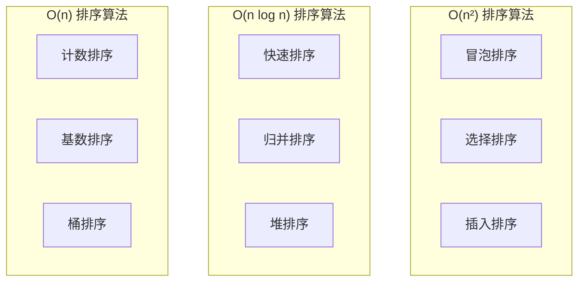
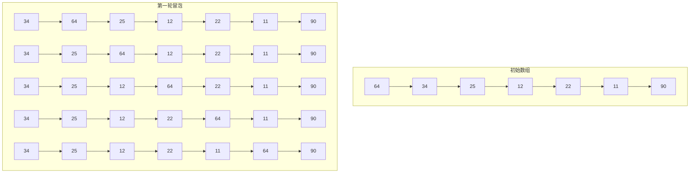
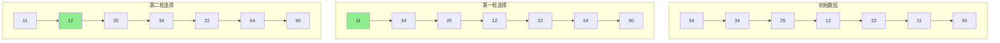
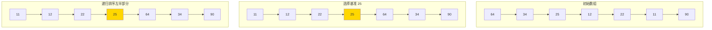
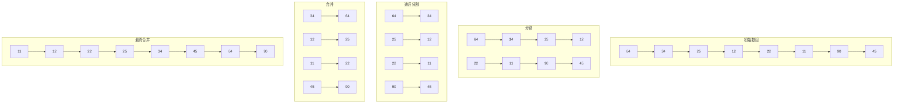
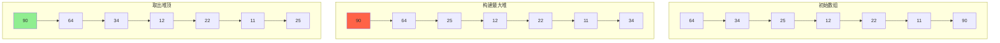
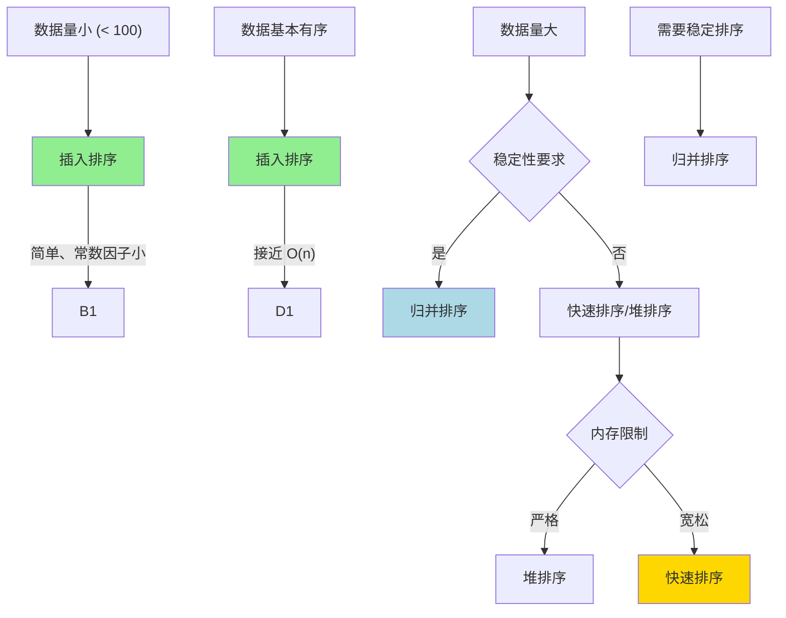

## 引言

排序算法是计算机科学中最基础也是最重要的算法之一。无论是数据检索、数据统计还是数据展示，排序都是不可或缺的步骤。理解各种排序算法的原理、复杂度和适用场景，是每个程序员的必修课。

本文将系统讲解六大经典排序算法：冒泡排序、选择排序、插入排序、快速排序、归并排序和堆排序。每种算法都配有原理图解、代码实现和复杂度分析。

## 排序算法分类

### 按时间复杂度分类



### 按稳定性分类

| 算法 | 稳定性 | 说明 |
|------|:-----:|------|
| 冒泡排序 | 稳定 | 相等元素相对顺序不变 |
| 选择排序 | 不稳定 | 交换可能改变相对顺序 |
| 插入排序 | 稳定 | 相等元素不交换 |
| 快速排序 | 不稳定 | 分区交换可能改变顺序 |
| 归并排序 | 稳定 | 合并时相等元素先取左半部分 |
| 堆排序 | 不稳定 | 堆调整可能改变顺序 |

## 冒泡排序

### 原理

冒泡排序通过重复遍历数组，比较相邻元素并交换顺序错误的元素，直到整个数组有序。



### 代码实现

```java
public class BubbleSort {
    public static void bubbleSort(int[] arr) {
        int n = arr.length;
        boolean swapped;
        
        for (int i = 0; i < n - 1; i++) {
            swapped = false;
            
            for (int j = 0; j < n - 1 - i; j++) {
                if (arr[j] > arr[j + 1]) {
                    // 交换
                    int temp = arr[j];
                    arr[j] = arr[j + 1];
                    arr[j + 1] = temp;
                    swapped = true;
                }
            }
            
            // 如果没有发生交换，说明已经有序
            if (!swapped) break;
        }
    }
}
```

### 复杂度分析

| 指标 | 最好情况 | 最坏情况 | 平均情况 |
|------|---------|---------|---------|
| **时间复杂度** | O(n) | O(n²) | O(n²) |
| **空间复杂度** | O(1) | O(1) | O(1) |

## 选择排序

### 原理

选择排序每次从未排序部分选择最小（或最大）的元素，放到已排序部分的末尾。



### 代码实现

```java
public class SelectionSort {
    public static void selectionSort(int[] arr) {
        int n = arr.length;
        
        for (int i = 0; i < n - 1; i++) {
            int minIdx = i;
            
            // 找到未排序部分的最小值
            for (int j = i + 1; j < n; j++) {
                if (arr[j] < arr[minIdx]) {
                    minIdx = j;
                }
            }
            
            // 交换到已排序部分末尾
            int temp = arr[minIdx];
            arr[minIdx] = arr[i];
            arr[i] = temp;
        }
    }
}
```

### 复杂度分析

| 指标 | 最好情况 | 最坏情况 | 平均情况 |
|------|---------|---------|---------|
| **时间复杂度** | O(n²) | O(n²) | O(n²) |
| **空间复杂度** | O(1) | O(1) | O(1) |

## 插入排序

### 原理

插入排序将数组分为已排序和未排序两部分，每次从未排序部分取一个元素插入到已排序部分的正确位置。

```mermaid
graph TD
    subgraph "初始状态"
        A[64]:::sorted --> B[34] --> C[25] --> D[12] --> E[22] --> F[11] --> G[90]
    end

    subgraph "插入 34"
        B2[34]:::sorted --> A2[64]:::sorted --> C2[25] --> D2[12] --> E2[22] --> F2[11] --> G2[90]
    end

    subgraph "插入 25"
        C3[25]:::sorted --> B3[34]:::sorted --> A3[64]:::sorted --> D3[12] --> E3[22] --> F3[11] --> G3[90]
    end

    style A fill:#ADD8E6
    style A2 fill:#ADD8E6
    style B2 fill:#ADD8E6
    style A3 fill:#ADD8E6
    style B3 fill:#ADD8E6
    style C3 fill:#ADD8E6
```



### 代码实现

```java
public class InsertionSort {
    public static void insertionSort(int[] arr) {
        int n = arr.length;
        
        for (int i = 1; i < n; i++) {
            int key = arr[i];
            int j = i - 1;
            
            // 将大于 key 的元素向后移动
            while (j >= 0 && arr[j] > key) {
                arr[j + 1] = arr[j];
                j--;
            }
            
            // 插入到正确位置
            arr[j + 1] = key;
        }
    }
}
```

### 复杂度分析

| 指标 | 最好情况 | 最坏情况 | 平均情况 |
|------|---------|---------|---------|
| **时间复杂度** | O(n) | O(n²) | O(n²) |
| **空间复杂度** | O(1) | O(1) | O(1) |

## 快速排序

### 原理

快速排序采用分治策略，选择一个基准元素，将数组分为小于基准和大于基准两部分，然后递归排序。



### 代码实现

```java
public class QuickSort {
    public static void quickSort(int[] arr) {
        quickSort(arr, 0, arr.length - 1);
    }

    private static void quickSort(int[] arr, int low, int high) {
        if (low < high) {
            int pi = partition(arr, low, high);
            quickSort(arr, low, pi - 1);
            quickSort(arr, pi + 1, high);
        }
    }

    private static int partition(int[] arr, int low, int high) {
        int pivot = arr[high];
        int i = low - 1;
        
        for (int j = low; j < high; j++) {
            if (arr[j] <= pivot) {
                i++;
                // 交换
                int temp = arr[i];
                arr[i] = arr[j];
                arr[j] = temp;
            }
        }
        
        // 将基准放到正确位置
        int temp = arr[i + 1];
        arr[i + 1] = arr[high];
        arr[high] = temp;
        
        return i + 1;
    }
}
```

### 复杂度分析

| 指标 | 最好情况 | 最坏情况 | 平均情况 |
|------|---------|---------|---------|
| **时间复杂度** | O(n log n) | O(n²) | O(n log n) |
| **空间复杂度** | O(log n) | O(n) | O(log n) |

### 优化策略

```java
// 三数取中优化
private static int medianOfThree(int[] arr, int low, int high) {
    int mid = low + (high - low) / 2;
    if (arr[low] > arr[mid]) swap(arr, low, mid);
    if (arr[low] > arr[high]) swap(arr, low, high);
    if (arr[mid] > arr[high]) swap(arr, mid, high);
    swap(arr, mid, high - 1);
    return arr[high - 1];
}

// 小数组使用插入排序
private static void quickSortOptimized(int[] arr, int low, int high) {
    if (high - low + 1 <= 10) {
        insertionSort(arr, low, high);
        return;
    }
    
    int pivot = medianOfThree(arr, low, high);
    // ... 后续逻辑
}
```

## 归并排序

### 原理

归并排序采用分治策略，将数组分成两半分别排序，然后将两个有序部分合并。



### 代码实现

```java
public class MergeSort {
    public static void mergeSort(int[] arr) {
        if (arr.length > 1) {
            int mid = arr.length / 2;
            int[] left = Arrays.copyOfRange(arr, 0, mid);
            int[] right = Arrays.copyOfRange(arr, mid, arr.length);
            
            mergeSort(left);
            mergeSort(right);
            
            merge(arr, left, right);
        }
    }

    private static void merge(int[] arr, int[] left, int[] right) {
        int i = 0, j = 0, k = 0;
        
        while (i < left.length && j < right.length) {
            if (left[i] <= right[j]) {
                arr[k++] = left[i++];
            } else {
                arr[k++] = right[j++];
            }
        }
        
        while (i < left.length) {
            arr[k++] = left[i++];
        }
        
        while (j < right.length) {
            arr[k++] = right[j++];
        }
    }
}
```

### 复杂度分析

| 指标 | 最好情况 | 最坏情况 | 平均情况 |
|------|---------|---------|---------|
| **时间复杂度** | O(n log n) | O(n log n) | O(n log n) |
| **空间复杂度** | O(n) | O(n) | O(n) |

## 堆排序

### 原理

堆排序利用堆这种数据结构，将数组构建成最大堆，然后依次取出堆顶元素放到数组末尾。



### 代码实现

```java
public class HeapSort {
    public static void heapSort(int[] arr) {
        int n = arr.length;
        
        // 构建最大堆
        for (int i = n / 2 - 1; i >= 0; i--) {
            heapify(arr, n, i);
        }
        
        // 依次取出堆顶元素
        for (int i = n - 1; i > 0; i--) {
            // 将堆顶元素放到数组末尾
            int temp = arr[0];
            arr[0] = arr[i];
            arr[i] = temp;
            
            // 调整剩余堆
            heapify(arr, i, 0);
        }
    }

    private static void heapify(int[] arr, int n, int i) {
        int largest = i;
        int left = 2 * i + 1;
        int right = 2 * i + 2;
        
        if (left < n && arr[left] > arr[largest]) {
            largest = left;
        }
        
        if (right < n && arr[right] > arr[largest]) {
            largest = right;
        }
        
        if (largest != i) {
            int temp = arr[i];
            arr[i] = arr[largest];
            arr[largest] = temp;
            
            heapify(arr, n, largest);
        }
    }
}
```

### 复杂度分析

| 指标 | 最好情况 | 最坏情况 | 平均情况 |
|------|---------|---------|---------|
| **时间复杂度** | O(n log n) | O(n log n) | O(n log n) |
| **空间复杂度** | O(1) | O(1) | O(1) |

## 算法对比

### 复杂度对比

| 算法 | 时间复杂度(平均) | 时间复杂度(最坏) | 空间复杂度 | 稳定性 |
|------|-----------------|-----------------|-----------|:-----:|
| **冒泡排序** | O(n²) | O(n²) | O(1) | 稳定 |
| **选择排序** | O(n²) | O(n²) | O(1) | 不稳定 |
| **插入排序** | O(n²) | O(n²) | O(1) | 稳定 |
| **快速排序** | O(n log n) | O(n²) | O(log n) | 不稳定 |
| **归并排序** | O(n log n) | O(n log n) | O(n) | 稳定 |
| **堆排序** | O(n log n) | O(n log n) | O(1) | 不稳定 |

### 选择策略



## 实战题目

### LeetCode 相关题目

| 题目 | 难度 | 标签 | 链接 |
|------|------|------|------|
| 215. 数组中的第K个最大元素 | 中等 | 堆排序 | https://leetcode.cn/problems/kth-largest-element-in-an-array/ |
| 75. 颜色分类 | 中等 | 排序 | https://leetcode.cn/problems/sort-colors/ |
| 148. 排序链表 | 中等 | 归并排序 | https://leetcode.cn/problems/sort-list/ |
| 912. 排序数组 | 中等 | 快速排序 | https://leetcode.cn/problems/sort-an-array/ |
| 31. 下一个排列 | 中等 | 排序 | https://leetcode.cn/problems/next-permutation/ |

### 题解示例

```java
// LeetCode 215: 数组中的第K个最大元素
public int findKthLargest(int[] nums, int k) {
    int n = nums.length;
    k = n - k; // 转换为第 n-k 小的元素
    
    int left = 0, right = n - 1;
    while (left <= right) {
        int pivot = partition(nums, left, right);
        if (pivot == k) return nums[pivot];
        else if (pivot < k) left = pivot + 1;
        else right = pivot - 1;
    }
    
    return -1;
}
```

## 结语

排序算法是算法学习的基石。掌握各种排序算法的原理和适用场景，不仅能帮助你在面试中应对各种问题，更能培养你的算法思维和问题解决能力。

核心要点：
- **O(n²) 算法**：简单但效率低，适合小规模数据
- **O(n log n) 算法**：高效，适合大规模数据
- **稳定性**：相等元素相对顺序是否保持
- **空间复杂度**：是否需要额外空间

选择排序算法时，需要综合考虑数据规模、数据特征、稳定性要求和内存限制。

---

**延伸阅读**：

1. *算法导论* - 排序算法章节
2. LeetCode 排序专题 - https://leetcode.cn/tag/sort/
3. 排序算法可视化 - https://visualgo.net/zh/sorting