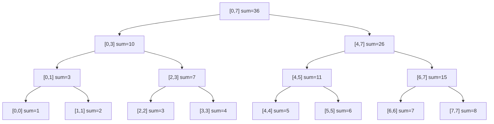
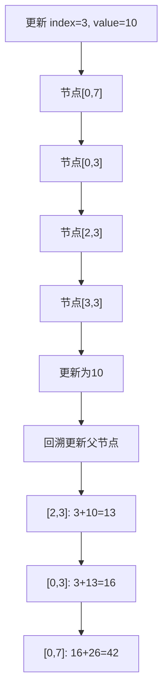
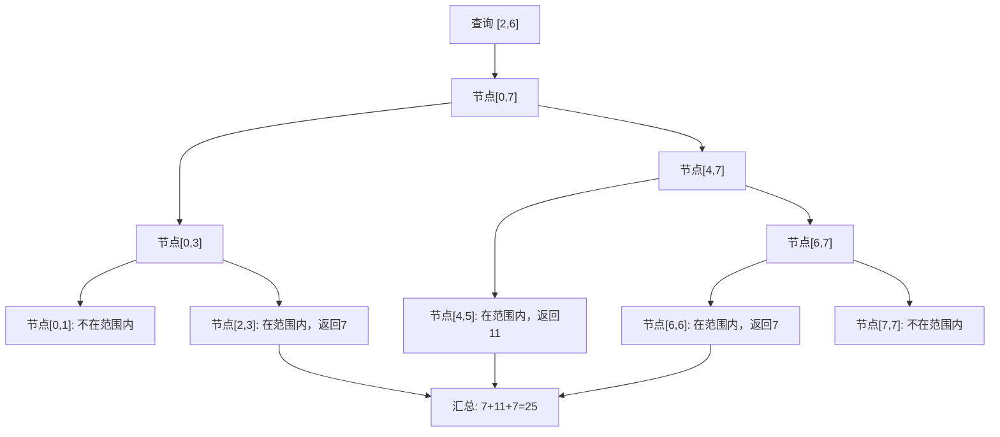
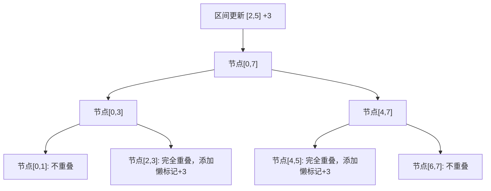
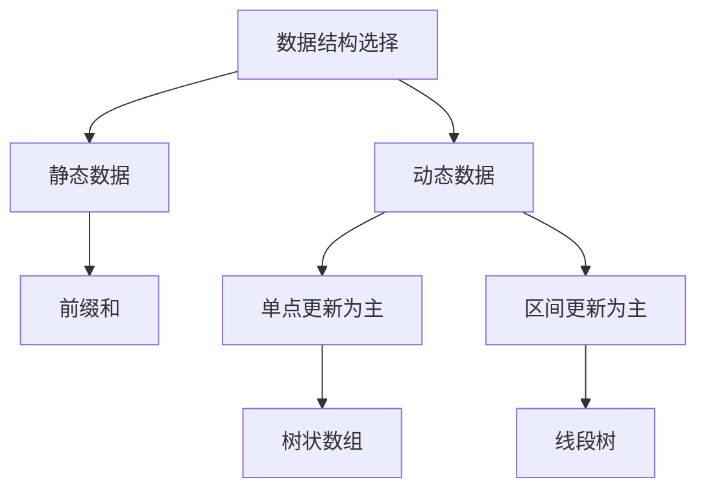

## 引言

线段树（Segment Tree）是一种高效的数据结构，用于处理区间查询和区间更新问题。它可以在 O(log n) 的时间复杂度内完成单点更新、区间查询、区间更新等操作，是算法竞赛和实际工程中常用的数据结构。

本文将深入讲解线段树的原理、构建过程、区间查询、单点更新、区间更新（懒标记）等核心内容。

## 线段树原理

### 基本概念

线段树是一棵二叉树，每个节点代表一个区间。根节点代表整个区间 [0, n-1]，每个叶子节点代表一个单独的元素。



### 核心特点

| 特点 | 说明 |
|------|------|
| **结构** | 完全二叉树，通常用数组存储 |
| **构建** | 自底向上或自顶向下递归构建 |
| **查询** | O(log n) 时间复杂度 |
| **更新** | O(log n) 时间复杂度 |
| **空间** | 4 × n 的数组空间 |

## 线段树实现

### 基础实现（区间求和）

```java
public class SegmentTree {
    private final int[] tree;
    private final int n;

    public SegmentTree(int[] arr) {
        this.n = arr.length;
        this.tree = new int[4 * n];
        build(arr, 0, 0, n - 1);
    }

    private void build(int[] arr, int node, int start, int end) {
        if (start == end) {
            tree[node] = arr[start];
        } else {
            int mid = (start + end) / 2;
            build(arr, 2 * node + 1, start, mid);
            build(arr, 2 * node + 2, mid + 1, end);
            tree[node] = tree[2 * node + 1] + tree[2 * node + 2];
        }
    }

    public void update(int idx, int value) {
        update(0, 0, n - 1, idx, value);
    }

    private void update(int node, int start, int end, int idx, int value) {
        if (start == end) {
            tree[node] = value;
        } else {
            int mid = (start + end) / 2;
            if (idx <= mid) {
                update(2 * node + 1, start, mid, idx, value);
            } else {
                update(2 * node + 2, mid + 1, end, idx, value);
            }
            tree[node] = tree[2 * node + 1] + tree[2 * node + 2];
        }
    }

    public int query(int l, int r) {
        return query(0, 0, n - 1, l, r);
    }

    private int query(int node, int start, int end, int l, int r) {
        if (r < start || end < l) {
            return 0;
        }
        if (l <= start && end <= r) {
            return tree[node];
        }
        int mid = (start + end) / 2;
        int leftSum = query(2 * node + 1, start, mid, l, r);
        int rightSum = query(2 * node + 2, mid + 1, end, l, r);
        return leftSum + rightSum;
    }
}
```

### 单点更新流程



### 区间查询流程



## 懒标记（Lazy Propagation）

### 原理

懒标记用于优化区间更新操作，将更新延迟到需要时才执行。



### 实现

```java
public class SegmentTreeWithLazy {
    private final int[] tree;
    private final int[] lazy;
    private final int n;

    public SegmentTreeWithLazy(int[] arr) {
        this.n = arr.length;
        this.tree = new int[4 * n];
        this.lazy = new int[4 * n];
        build(arr, 0, 0, n - 1);
    }

    private void build(int[] arr, int node, int start, int end) {
        if (start == end) {
            tree[node] = arr[start];
        } else {
            int mid = (start + end) / 2;
            build(arr, 2 * node + 1, start, mid);
            build(arr, 2 * node + 2, mid + 1, end);
            tree[node] = tree[2 * node + 1] + tree[2 * node + 2];
        }
    }

    private void push(int node, int start, int end) {
        if (lazy[node] != 0) {
            tree[node] += lazy[node] * (end - start + 1);
            
            if (start != end) {
                lazy[2 * node + 1] += lazy[node];
                lazy[2 * node + 2] += lazy[node];
            }
            
            lazy[node] = 0;
        }
    }

    public void rangeUpdate(int l, int r, int value) {
        rangeUpdate(0, 0, n - 1, l, r, value);
    }

    private void rangeUpdate(int node, int start, int end, int l, int r, int value) {
        push(node, start, end);
        
        if (r < start || end < l) {
            return;
        }
        
        if (l <= start && end <= r) {
            lazy[node] += value;
            push(node, start, end);
            return;
        }
        
        int mid = (start + end) / 2;
        rangeUpdate(2 * node + 1, start, mid, l, r, value);
        rangeUpdate(2 * node + 2, mid + 1, end, l, r, value);
        tree[node] = tree[2 * node + 1] + tree[2 * node + 2];
    }

    public int query(int l, int r) {
        return query(0, 0, n - 1, l, r);
    }

    private int query(int node, int start, int end, int l, int r) {
        if (r < start || end < l) {
            return 0;
        }
        
        push(node, start, end);
        
        if (l <= start && end <= r) {
            return tree[node];
        }
        
        int mid = (start + end) / 2;
        int leftSum = query(2 * node + 1, start, mid, l, r);
        int rightSum = query(2 * node + 2, mid + 1, end, l, r);
        return leftSum + rightSum;
    }
}
```

## 扩展应用

### 区间最大值

```java
public class SegmentTreeMax {
    private final int[] tree;
    private final int[] lazy;
    private final int n;
    private static final int INF = Integer.MIN_VALUE;

    public SegmentTreeMax(int[] arr) {
        this.n = arr.length;
        this.tree = new int[4 * n];
        this.lazy = new int[4 * n];
        Arrays.fill(lazy, INF);
        build(arr, 0, 0, n - 1);
    }

    private void build(int[] arr, int node, int start, int end) {
        if (start == end) {
            tree[node] = arr[start];
        } else {
            int mid = (start + end) / 2;
            build(arr, 2 * node + 1, start, mid);
            build(arr, 2 * node + 2, mid + 1, end);
            tree[node] = Math.max(tree[2 * node + 1], tree[2 * node + 2]);
        }
    }

    private void push(int node, int start, int end) {
        if (lazy[node] != INF) {
            tree[node] = Math.max(tree[node], lazy[node]);
            
            if (start != end) {
                lazy[2 * node + 1] = Math.max(lazy[2 * node + 1], lazy[node]);
                lazy[2 * node + 2] = Math.max(lazy[2 * node + 2], lazy[node]);
            }
            
            lazy[node] = INF;
        }
    }

    public void rangeUpdate(int l, int r, int value) {
        rangeUpdate(0, 0, n - 1, l, r, value);
    }

    private void rangeUpdate(int node, int start, int end, int l, int r, int value) {
        push(node, start, end);
        
        if (r < start || end < l) {
            return;
        }
        
        if (l <= start && end <= r) {
            lazy[node] = Math.max(lazy[node], value);
            push(node, start, end);
            return;
        }
        
        int mid = (start + end) / 2;
        rangeUpdate(2 * node + 1, start, mid, l, r, value);
        rangeUpdate(2 * node + 2, mid + 1, end, l, r, value);
        tree[node] = Math.max(tree[2 * node + 1], tree[2 * node + 2]);
    }

    public int query(int l, int r) {
        return query(0, 0, n - 1, l, r);
    }

    private int query(int node, int start, int end, int l, int r) {
        if (r < start || end < l) {
            return INF;
        }
        
        push(node, start, end);
        
        if (l <= start && end <= r) {
            return tree[node];
        }
        
        int mid = (start + end) / 2;
        int leftMax = query(2 * node + 1, start, mid, l, r);
        int rightMax = query(2 * node + 2, mid + 1, end, l, r);
        return Math.max(leftMax, rightMax);
    }
}
```

### 区间最小值

```java
public class SegmentTreeMin {
    private final int[] tree;
    private final int[] lazy;
    private final int n;
    private static final int INF = Integer.MAX_VALUE;

    public SegmentTreeMin(int[] arr) {
        this.n = arr.length;
        this.tree = new int[4 * n];
        this.lazy = new int[4 * n];
        Arrays.fill(lazy, INF);
        build(arr, 0, 0, n - 1);
    }

    private void build(int[] arr, int node, int start, int end) {
        if (start == end) {
            tree[node] = arr[start];
        } else {
            int mid = (start + end) / 2;
            build(arr, 2 * node + 1, start, mid);
            build(arr, 2 * node + 2, mid + 1, end);
            tree[node] = Math.min(tree[2 * node + 1], tree[2 * node + 2]);
        }
    }

    private void push(int node, int start, int end) {
        if (lazy[node] != INF) {
            tree[node] = Math.min(tree[node], lazy[node]);
            
            if (start != end) {
                lazy[2 * node + 1] = Math.min(lazy[2 * node + 1], lazy[node]);
                lazy[2 * node + 2] = Math.min(lazy[2 * node + 2], lazy[node]);
            }
            
            lazy[node] = INF;
        }
    }

    public void rangeUpdate(int l, int r, int value) {
        rangeUpdate(0, 0, n - 1, l, r, value);
    }

    private void rangeUpdate(int node, int start, int end, int l, int r, int value) {
        push(node, start, end);
        
        if (r < start || end < l) {
            return;
        }
        
        if (l <= start && end <= r) {
            lazy[node] = Math.min(lazy[node], value);
            push(node, start, end);
            return;
        }
        
        int mid = (start + end) / 2;
        rangeUpdate(2 * node + 1, start, mid, l, r, value);
        rangeUpdate(2 * node + 2, mid + 1, end, l, r, value);
        tree[node] = Math.min(tree[2 * node + 1], tree[2 * node + 2]);
    }

    public int query(int l, int r) {
        return query(0, 0, n - 1, l, r);
    }

    private int query(int node, int start, int end, int l, int r) {
        if (r < start || end < l) {
            return INF;
        }
        
        push(node, start, end);
        
        if (l <= start && end <= r) {
            return tree[node];
        }
        
        int mid = (start + end) / 2;
        int leftMin = query(2 * node + 1, start, mid, l, r);
        int rightMin = query(2 * node + 2, mid + 1, end, l, r);
        return Math.min(leftMin, rightMin);
    }
}
```

### 区间 GCD

```java
public class SegmentTreeGCD {
    private final int[] tree;
    private final int n;

    public SegmentTreeGCD(int[] arr) {
        this.n = arr.length;
        this.tree = new int[4 * n];
        build(arr, 0, 0, n - 1);
    }

    private int gcd(int a, int b) {
        while (b != 0) {
            int temp = b;
            b = a % b;
            a = temp;
        }
        return a;
    }

    private void build(int[] arr, int node, int start, int end) {
        if (start == end) {
            tree[node] = arr[start];
        } else {
            int mid = (start + end) / 2;
            build(arr, 2 * node + 1, start, mid);
            build(arr, 2 * node + 2, mid + 1, end);
            tree[node] = gcd(tree[2 * node + 1], tree[2 * node + 2]);
        }
    }

    public void update(int idx, int value) {
        update(0, 0, n - 1, idx, value);
    }

    private void update(int node, int start, int end, int idx, int value) {
        if (start == end) {
            tree[node] = value;
        } else {
            int mid = (start + end) / 2;
            if (idx <= mid) {
                update(2 * node + 1, start, mid, idx, value);
            } else {
                update(2 * node + 2, mid + 1, end, idx, value);
            }
            tree[node] = gcd(tree[2 * node + 1], tree[2 * node + 2]);
        }
    }

    public int query(int l, int r) {
        return query(0, 0, n - 1, l, r);
    }

    private int query(int node, int start, int end, int l, int r) {
        if (r < start || end < l) {
            return 0;
        }
        if (l <= start && end <= r) {
            return tree[node];
        }
        int mid = (start + end) / 2;
        int leftGcd = query(2 * node + 1, start, mid, l, r);
        int rightGcd = query(2 * node + 2, mid + 1, end, l, r);
        return gcd(leftGcd, rightGcd);
    }
}
```

## 应用场景

### 动态区间统计

```java
public class RangeStatistic {
    private SegmentTree sumTree;
    private SegmentTreeMax maxTree;
    private SegmentTreeMin minTree;

    public RangeStatistic(int[] arr) {
        this.sumTree = new SegmentTree(arr);
        this.maxTree = new SegmentTreeMax(arr);
        this.minTree = new SegmentTreeMin(arr);
    }

    public int getSum(int l, int r) {
        return sumTree.query(l, r);
    }

    public int getMax(int l, int r) {
        return maxTree.query(l, r);
    }

    public int getMin(int l, int r) {
        return minTree.query(l, r);
    }

    public void update(int idx, int value) {
        sumTree.update(idx, value);
        maxTree.rangeUpdate(idx, idx, value);
        minTree.rangeUpdate(idx, idx, value);
    }
}
```

### 区间染色问题

```java
public class RangeColor {
    private SegmentTreeWithLazy colorTree;

    public RangeColor(int n, int initialColor) {
        int[] arr = new int[n];
        Arrays.fill(arr, initialColor);
        this.colorTree = new SegmentTreeWithLazy(arr);
    }

    public void paint(int l, int r, int color) {
        colorTree.rangeUpdate(l, r, color);
    }

    public int getColor(int idx) {
        return colorTree.query(idx, idx);
    }
}
```

### 在线算法

线段树可以用于在线处理动态数据：

```java
public class OnlineProcessor {
    private SegmentTreeWithLazy tree;

    public OnlineProcessor(int maxSize) {
        int[] arr = new int[maxSize];
        this.tree = new SegmentTreeWithLazy(arr);
    }

    public void addValue(int idx, int value) {
        int current = tree.query(idx, idx);
        tree.rangeUpdate(idx, idx, current + value);
    }

    public int getRangeSum(int l, int r) {
        return tree.query(l, r);
    }

    public void addRange(int l, int r, int value) {
        tree.rangeUpdate(l, r, value);
    }
}
```

## 线段树 vs 其他数据结构

| 数据结构 | 单点更新 | 区间查询 | 区间更新 | 适用场景 |
|---------|---------|---------|---------|---------|
| **前缀和** | O(n) | O(1) | O(n) | 静态数组查询 |
| **树状数组** | O(log n) | O(log n) | O(log n) | 前缀和、单点更新 |
| **线段树** | O(log n) | O(log n) | O(log n) | 复杂区间操作 |
| **块状数组** | O(√n) | O(√n) | O(√n) | 平衡性能 |



## 实战题目

### LeetCode 相关题目

| 题目 | 难度 | 标签 | 链接 |
|------|------|------|------|
| 307. 区域和检索 - 数组可修改 | 中等 | 线段树/树状数组 | https://leetcode.cn/problems/range-sum-query-mutable/ |
| 1109. 航班预订统计 | 中等 | 线段树/差分数组 | https://leetcode.cn/problems/corporate-flight-bookings/ |
| 715. Range 模块 | 困难 | 线段树 | https://leetcode.cn/problems/range-module/ |
| 699. 掉落的方块 | 困难 | 线段树 | https://leetcode.cn/problems/falling-squares/ |

### 题解示例

```java
// LeetCode 307: 区域和检索 - 数组可修改
class NumArray {
    private SegmentTree tree;

    public NumArray(int[] nums) {
        this.tree = new SegmentTree(nums);
    }

    public void update(int index, int val) {
        tree.update(index, val);
    }

    public int sumRange(int left, int right) {
        return tree.query(left, right);
    }
}
```

## 结语

线段树是一种功能强大的数据结构，能够高效处理各种区间操作。

核心要点：
- **O(log n) 复杂度**：单点更新、区间查询、区间更新都能在对数时间完成
- **懒标记**：优化区间更新，延迟传递更新操作
- **通用性**：支持求和、最大/最小值、GCD 等多种聚合操作

选择线段树时需要注意：
1. 空间复杂度为 O(4n)，需要预先分配足够空间
2. 递归深度为 O(log n)，对于极端情况可能需要迭代实现
3. 懒标记需要正确传递和清除，否则会导致错误

线段树是算法竞赛和实际工程中的必备工具，掌握它将极大提升你的问题解决能力。

---

**延伸阅读**：

1. *算法导论* - 线段树章节
2. LeetCode 线段树专题 - https://leetcode.cn/tag/segment-tree/
3. 线段树可视化 - https://visualgo.net/zh/segmenttree