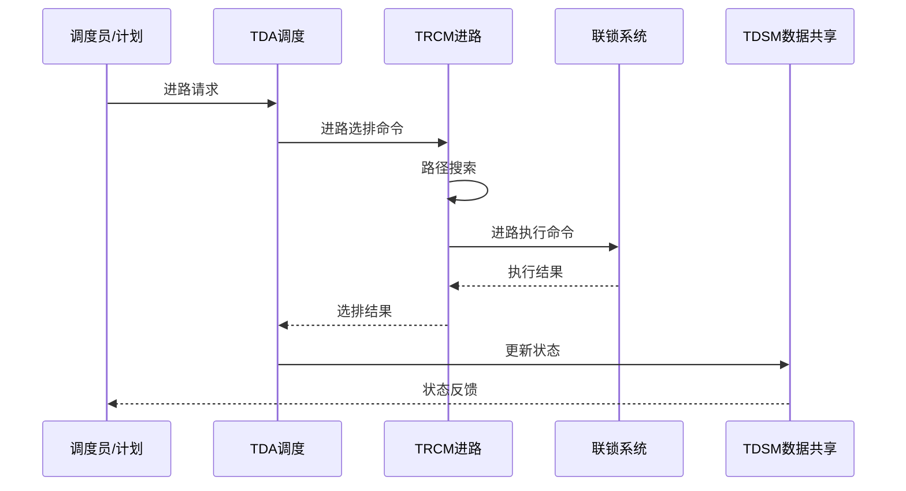
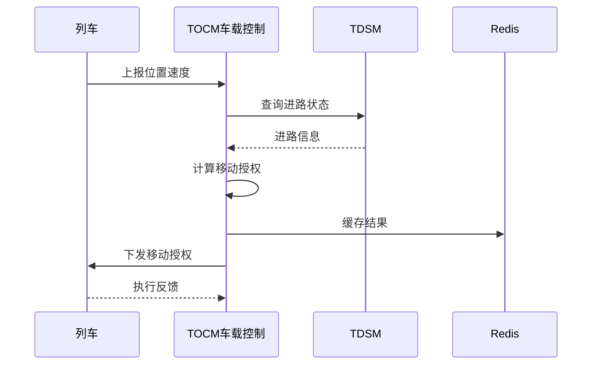
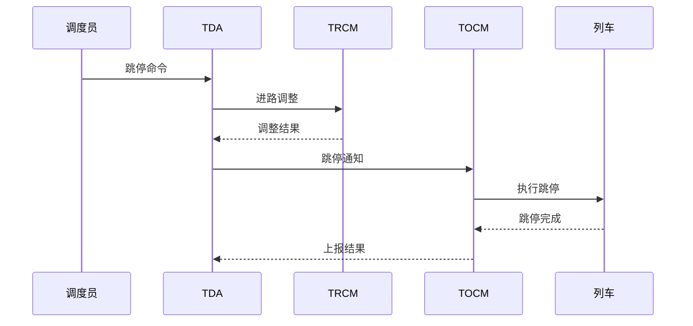

# HFS1 业务信息流分析

## 1. 业务信息流概述

HFS1 轨道交通列车自动监控系统采用"调度-进路-车载-显示"的典型业务信息流模式。各业务功能涉及多个模块协作，通过消息总线、Redis共享内存、协议转换等多种方式实现信息流转。

本文档详细分析系统中核心业务的实现流程、涉及的模块、关键代码位置。

---

## 2. 核心业务信息流详解

### 2.1 进路自动选排业务

#### 2.1.1 业务描述
进路自动选排是根据列车运行计划，自动为列车选择、排列进路，确保列车按计划安全运行的核心业务。

#### 2.1.2 涉及模块与职责
- **TDA（调度自动化模块）**：根据运行图生成列车进路请求，下发到TRCM
- **IDEC（集中站接口）**：接收联锁系统的进路状态反馈
- **ODCI（输出控制接口）**：向联锁系统输出进路控制命令
- **TRCM（列车进路控制模块）**：执行进路选排算法和路径搜索
- **base/msg**：提供模块间消息通信基础

#### 2.1.3 信息流
```
1. IDEC → TDA: 上报当前进路状态、信号机状态、区段占用状态
2. ODCI → TDA: 上报输出控制状态
3. TDA → TRCM: 下发进路自动选排请求（含列车信息、目标车站）
4. TRCM → TDA: 返回进路选排结果（成功/失败、所选进路）
5. TDA → IDEC: 转发进路执行命令到联锁
6. IDEC → TDA: 反馈进路执行结果
7. TDA → RedisMgr: 更新进路状态到共享内存
```

#### 2.1.4 核心逻辑位置
- **进路选排业务逻辑**：在TRCM模块的`PathSearch.cpp`和`PathSearch.h`中实现，使用路径搜索算法计算最优进路
- **进路管理业务逻辑**：在TRCM模块的`RoutesMgr.cpp`和`RoutesMgr.h`中实现，负责进路生命周期管理
- **进路自动触发逻辑**：在TDA模块的`tda.cpp`和`tda.h`中实现，根据运行图自动触发进路选排

#### 2.1.5 关键代码文件
- `trcm/PathSearch.cpp`: 进路搜索算法实现
- `trcm/RoutesMgr.cpp`: 进路管理实现
- `trcm/AutoTriggerTask.cpp`: 自动触发任务（10,577行，核心业务）
- `trcm/RouteSelectTask.cpp`: 进路选排任务
- `tda/tda.cpp`: 调度自动化主逻辑
- `idci/idci.cpp`: 集中站接口客户端

---

### 2.2 移动授权业务

#### 2.2.1 业务描述
移动授权（Movement Authority，MA）是ATP系统中的核心概念，是列车安全运行的权限凭证。移动授权规定了列车可以运行到的最远位置。

#### 2.2.2 涉及模块与职责
- **TOCM（列车车载控制模块）**：处理移动授权，控制列车运行
- **TDSM（列车数据共享模块）**：共享移动授权相关数据
- **TRCM（列车进路控制模块）**：提供进路状态作为移动授权计算依据
- **RedisMgr**：跨进程共享移动授权数据

#### 2.2.3 信息流
```
1. TOCM → TDSM: 请求当前列车的移动授权信息
2. TOCM → TRCM: 查询列车前方进路状态、区段状态
3. TRCM → TOCM: 返回进路和区段占用情况
4. TOCM → TOCM: 计算移动授权终点（基于进路、限速等）
5. TOCM → RedisMgr: 缓存移动授权结果
6. TOCM → 车载: 通过VOBC协议下发移动授权
7. 车载 → TOCM: 反馈列车位置、速度信息
```

#### 2.2.4 核心逻辑位置
- **移动授权计算业务逻辑**：在TOCM模块的`tocm.cpp`和`tocm.h`中实现，综合进路、限速、列车位置计算移动授权
- **车载通信业务逻辑**：基于AtsVobcProtocol协议与车载系统通信
- **移动授权更新逻辑**：实时根据列车位置和进路状态更新

#### 2.2.5 关键代码文件
- `tocm/tocm.cpp`: 移动授权计算与下发
- `tocm/CmdObj.cpp`: 命令对象实现（12,659行）
- `tdsm/Tds.cpp`: 列车数据共享
- `trcm/RoutesMgr.cpp`: 进路状态查询
- `AtsVobcProtocol/`: ATS-VOBC通信协议

---

### 2.3 列车监控业务

#### 2.3.1 业务描述
列车监控业务实时监视线路上所有列车的运行状态，包括位置、速度、运行方向、车次号等，并在HMI上显示。

#### 2.3.2 涉及模块与职责
- **TDA（调度自动化模块）**：监控全局列车运行状态
- **TICM（列车综合控制模块）**：监控单列车的详细状态
- **TOCM（列车车载控制模块）**：获取车载实时数据
- **IDEC（集中站接口）**：获取列车位置相关轨道信息

#### 2.3.3 信息流
```
1. 调度员/系统 → TDA: 查询列车状态请求
2. TDA → TICM: 查询特定列车状态
3. TICM → TOCM: 查询车载详细信息（位置、速度等）
4. TOCM → 车载: 获取实时车载数据
5. TOCM → TICM: 返回车载状态信息
6. TICM → TDA: 返回完整列车状态
7. TDA → RedisMgr: 更新列车状态到共享内存
8. TDA → HMI模块: 推送状态用于显示
```

#### 2.3.4 核心逻辑位置
- **列车监控主流程**：在TDA模块的`tda.cpp`中实现，定时获取所有列车状态
- **单列车监控逻辑**：在TICM模块的`ticm.cpp`中实现，处理单列车的状态变化
- **车载数据采集逻辑**：在TOCM模块的`tocm.cpp`中实现，从车载系统采集数据

#### 2.3.5 关键代码文件
- `tda/tda.cpp`: 全局列车监控
- `ticm/ticm.cpp`: 单列车监控（78,988行模块）
- `tocm/tocm.cpp`: 车载数据采集
- `ticm/Task.cpp`: TICM定时任务

---

### 2.4 跳停业务

#### 2.4.1 业务描述
跳停是指列车在运行过程中，根据调度命令或运行计划，不停车通过本应停靠的车站，直接驶向下一个停靠站。

#### 2.4.2 涉及模块与职责
- **TDA（调度自动化模块）**：根据运行图生成跳停命令
- **TICM（列车综合控制模块）**：执行跳停命令
- **TOCM（列车车载控制模块）**：通知车载系统执行跳停
- **TRCM（列车进路控制模块）**：处理跳停后的进路调整

#### 2.4.3 信息流
```
1. 调度员/计划 → TDA: 下发跳停命令
2. TDA → TRCM: 跳停后进路自动调整
3. TRCM → TDA: 返回进路调整结果
4. TDA → TICM: 下发跳停命令到列车
5. TICM → TOCM: 转发跳停命令
6. TOCM → 车载: 通知VOBC执行跳停
7. TOCM → TICM: 反馈跳停执行状态
8. TICM → TDA: 上报跳停执行结果
9. TDA → RedisMgr: 更新跳停状态
```

#### 2.4.4 核心逻辑位置
- **跳停命令处理主流程**：在TDA模块的`tda.cpp`中实现，解析跳停命令
- **进路调整业务逻辑**：在TRCM模块的`PathSearch.cpp`中，根据跳停重新计算进路
- **跳停车载命令下发逻辑**：在TOCM模块的`tocm.cpp`中，下发到车载

#### 2.4.5 关键代码文件
- `tda/tda.cpp`: 跳停命令处理
- `trcm/PathSearch.cpp`: 跳停后进路搜索
- `tocm/tocm.cpp`: 跳停车载命令下发
- `trcm/RouteCancelTask.cpp`: 进路取消任务

---

### 2.5 清客业务

#### 2.5.1 业务描述
清客是指列车到达终点站或因故障需要退出服务时，通知乘客下车并清空列车的业务流程。

#### 2.5.2 涉及模块与职责
- **TDA（调度自动化模块）**：根据运行图生成清客命令
- **TICM（列车综合控制模块）**：执行清客命令
- **TOCM（列车车载控制模块）**：通知车载系统执行清客
- **PSDInter（屏蔽门接口模块）**：协调屏蔽门动作
- **HmiTransInfo**：显示清客状态

#### 2.5.3 信息流
```
1. 调度员 → TDA: 下发清客命令
2. TDA → TICM: 转发清客命令
3. TICM → TOCM: 通知车载清客
4. TOCM → 车载: 触发清客广播
5. TOCM → PSDInter: 协调屏蔽门开启
6. PSDInter → TOCM: 屏蔽门状态反馈
7. 车载 → TOCM: 反馈清客完成
8. TOCM → TICM: 清客完成通知
9. TICM → TDA: 上报清客结果
10. TDA → RedisMgr: 更新清客状态
```

#### 2.5.4 核心逻辑位置
- **清客命令处理主流程**：在TDA模块的`tda.cpp`中实现，清客命令的解析和下发
- **清客执行业务逻辑**：在TICM模块的`ticm.cpp`中，处理清客的整个流程
- **清客与屏蔽门协调逻辑**：在TOCM模块的`tocm.cpp`和PSDInter模块中，协调屏蔽门动作

> **重要**：清客业务与制动力不足判断相关。根据报警故障原因第22位（制动重故障）判断紧急制动不缓解，用于中心执行清客相关功能。详见`HmiTransInfo/HmiTransTask.cpp`。

#### 2.5.5 关键代码文件
- `tda/tda.cpp`: 清客命令处理
- `ticm/ticm.cpp`: 清客执行流程
- `tocm/tocm.cpp`: 清客车载通知
- `PSDInter/PsdInter.h`: 屏蔽门接口
- `HmiTransInfo/HmiTransTask.cpp`: 清客状态显示

---

### 2.6 列车自动驾驶（ATO）业务

#### 2.6.1 业务描述
列车自动驾驶（ATO）业务负责列车在ATP安全保护下的自动驾驶功能，包括自动启动、加速、巡航、减速、停车等。

#### 2.6.2 涉及模块与职责
- **TOCM（列车车载控制模块）**：ATO核心控制逻辑
- **ATP（列车自动保护）**：提供安全保护
- **TDA（调度自动化模块）**：提供运行图和停站信息
- **PSDInter（屏蔽门接口）**：停车后屏蔽门协调

#### 2.6.3 信息流
```
1. TDA → TOCM: 下发运行图、停站时间、区间运行等级
2. ATP → TOCM: 提供安全保护限制（限速、移动授权）
3. TOCM → 车载: 计算牵引/制动命令，控制车速
4. 车载 → TOCM: 反馈实际车速、位置
5. TOCM → TOCM: ATO闭环控制（速度调整）
6. TOCM → 车载: 控制列车停车精度
7. 车载 → TOCM: 停车完成反馈
8. TOCM → PSDInter: 触发屏蔽门开启
9. TOCM → 车载: 停站时间到，触发发车
10. TOCM → TDA: 上报ATO运行状态
```

#### 2.6.4 核心逻辑位置
- **ATO核心控制业务逻辑**：在TOCM模块中实现，采用PID控制算法
- **速度曲线计算业务逻辑**：根据ATP限制和运行图计算速度曲线
- **停车精度控制业务逻辑**：精准控制列车停车位置

#### 2.6.5 关键代码文件
- `tocm/tocm.cpp`: ATO控制算法
- `tocm/AtoTask.cpp`: ATO任务
- `PSDInter/PsdInter.h`: 屏蔽门接口
- `tda/tda.cpp`: 运行图管理

---

### 2.7 列车自动保护（ATP）业务

#### 2.7.1 业务描述
列车自动保护（ATP）是列车运行的安全基石，负责确保列车在安全速度、安全距离内运行，防止超速、追尾等事故。

#### 2.7.2 涉及模块与职责
- **TRCM（列车进路控制模块）**：提供进路状态、移动授权依据
- **TOCM（列车车载控制模块）**：执行ATP保护逻辑
- **TDSM（列车数据共享模块）**：共享限速、列车位置等数据

#### 2.7.3 信息流
```
1. TRCM → TOCM: 提供进路状态、前方区段状态
2. 车载 → TOCM: 反馈列车实际位置、速度
3. TOCM → TDSM: 查询限速信息
4. TDSM → TOCM: 返回当前区段限速
5. TOCM → TOCM: 计算紧急制动触发曲线
6. TOCM → 车载: 下发ATP限速和制动命令
7. 车载 → TOCM: 反馈制动执行状态
8. TOCM → RedisMgr: 缓存ATP状态
```

#### 2.7.4 核心逻辑位置
- **ATP核心保护逻辑**：确保列车在安全速度和距离内运行
- **紧急制动逻辑**：超速或越限时触发紧急制动
- **限速处理逻辑**：根据临时限速、固定限速调整列车速度

#### 2.7.5 关键代码文件
- `tocm/tocm.cpp`: ATP保护算法
- `trcm/RouteMgr.cpp`: 进路状态查询
- `tdsm/Tds.cpp`: 限速数据共享
- `CtrlCmdProtocol/VobcCmdProtocol.cpp`: 控制命令协议（7,854行）

---

### 2.8 列车自动监控（ATS）业务

#### 2.8.1 业务描述
列车自动监控（ATS）是系统的最上层业务，负责整个线路列车的监视、调度、控制，是调度员与系统交互的接口。

#### 2.8.2 涉及模块与职责
- **TDA（调度自动化模块）**：ATS业务核心
- **IDEC（集中站接口）**：采集现场设备状态
- **RedisMgr**：全局状态共享

#### 2.8.3 信息流
```
1. 调度员 → IDEC: 下发调度命令
2. IDEC → TDA: 上报现场设备状态（信号机、道岔、轨道）
3. TDA → RedisMgr: 更新全局状态到共享内存
4. TDA → 监控终端: 推送表示信息用于显示
5. 监控终端 → TDA: 调度员操作请求（人工干预）
6. TDA → IDEC: 转发调度命令到现场
7. IDEC → 调度员: 反馈执行结果
8. 调度员 → IDEC: 确认或调整
9. IDEC → TDA: 上报最终状态
```

#### 2.8.4 核心逻辑位置
- **ATS核心业务逻辑**：监视全局、调度决策
- **表示信息处理业务逻辑**：将设备状态转换为可视化表示
- **调度员交互业务逻辑**：处理调度员命令

#### 2.8.5 关键代码文件
- `tda/tda.cpp`: ATS主业务逻辑
- `idci/idci.cpp`: 集中站状态采集
- `RedisMgr/RedisMgr.h`: 全局状态共享

---

### 2.9 屏蔽门控制业务

#### 2.9.1 业务描述
屏蔽门（PSD）控制业务负责列车到站后屏蔽门与车门的同步开启和关闭，确保乘客安全上下车。

#### 2.9.2 涉及模块与职责
- **TOCM（列车车载控制模块）**：触发屏蔽门控制
- **PSDInter（屏蔽门接口模块）**：屏蔽门通信接口
- **车载**：车门控制

#### 2.9.3 信息流
```
1. 车载 → TOCM: 列车停稳，停车精度满足
2. TOCM → PSDInter: 触发屏蔽门开启
3. PSDInter → TOCM: 屏蔽门状态反馈
4. TOCM → 车载: 通知开启车门
5. 车载 → TOCM: 车门状态反馈
6. TOCM → TDA: 上报屏蔽门和车门状态
7. 调度员/计划 → TDA: 停站时间到
8. TDA → TOCM: 触发关闭车门和屏蔽门
9. TOCM → 车载: 关闭车门命令
10. 车载 → TOCM: 车门关闭完成
11. TOCM → PSDInter: 关闭屏蔽门命令
12. PSDInter → TOCM: 屏蔽门关闭完成
```

#### 2.9.4 核心逻辑位置
- **屏蔽门控制主流程**：列车与屏蔽门同步控制
- **停车精度**：精准停车才能开启屏蔽门
- **安全联锁逻辑**：屏蔽门与车门的安全联锁保护

#### 2.9.5 关键代码文件
- `PSDInter/PsdInter.h`: 屏蔽门接口
- `tocm/tocm.cpp`: 屏蔽门控制与列车联锁

---

### 2.10 换向与折返业务

#### 2.10.1 业务描述
换向与折返业务负责列车到达终点站或折返站后，改变运行方向，包括列车换端、进路调整等。

#### 2.10.2 涉及模块与职责
- **TDA（调度自动化模块）**：根据运行图生成换向命令
- **TRCM（列车进路控制模块）**：处理换向进路
- **TICM（列车综合控制模块）**：执行列车换端
- **TOCM（列车车载控制模块）**：通知车载换向

#### 2.10.3 信息流
```
1. TDA → TRCM: 下发换向进路请求
2. TRCM → TDA: 返回换向进路选排结果
3. TDA → TICM: 下发列车换端命令
4. TICM → TOCM: 转发换端命令
5. TOCM → 车载: 执行换端操作
6. 车载 → TOCM: 换端完成反馈
7. TOCM → TICM: 上报换端状态
8. TICM → TDA: 上报换端完成
9. TDA → TICM: 触发反向运行
10. TICM → TOCM: 下发反向运行命令
11. TOCM → 车载: 控制列车反向运行
```

#### 2.10.4 核心逻辑位置
- **换向业务主流程**：在TDA模块中实现，协调换向的各个步骤
- **换向进路业务逻辑**：在TRCM模块中，搜索换向进路
- **换端逻辑**：在TICM模块中，控制列车换端

#### 2.10.5 关键代码文件
- `tda/DealPlan.cpp`: 换向命令处理
- `trcm/PathSearch.cpp`: 换向进路搜索
- `ticm/ticm.cpp`: 列车换端

---

### 2.11 列车实际运行监控（TACTCM）

#### 2.11.1 业务描述
列车实际运行监控业务实时采集、计算、显示列车的实际运行数据，与计划运行图对比，发现偏差时告警。

#### 2.11.2 涉及模块与职责
- **tactcm（列车实际运行控制模块）**：实际运行数据采集
- **ifstate（接口状态模块）**：接口状态监控
- **tda（调度自动化模块）**：偏差告警和处理
- **trcm（列车进路控制模块）**：实际进路状态

#### 2.11.3 信息流
```
1. 现场/车载 → tactcm: 上报实际运行数据
2. tactcm → 监控终端: 显示实际运行图
3. tactcm → tda: 上报实际运行偏差
4. tda → trcm: 触发偏差处理（如进路调整）
5. trcm → tda: 返回处理结果
6. tda → tda: 更新运行图偏差分析
7. tda → TICM: 下发运行调整命令
8. TICM → TOCM: 转发调整命令
9. TOCM → 车载: 执行调整
10. 车载 → TOCM: 反馈执行状态
11. TOCM → TICM: 调整执行反馈
12. TICM → tda: 上报调整结果
13. tda → tactcm: 更新实际运行状态
```

#### 2.11.4 核心逻辑位置
- **实际运行数据采集**：实时采集
- **实际与计划对比**：偏差检测
- **偏差告警与处理**：触发调整

#### 2.11.5 关键代码文件
- `tactcm/tactcm.cpp`: 实际运行监控
- `tactcm/TacPlanData.cpp`: 实际运行数据（7,259行）
- `ifstate/ifstate.cpp`: 接口状态
- `tda/tda.cpp`: 偏差处理

---

### 2.12 运行图调整业务

#### 2.12.1 业务描述
运行图调整业务根据实际运行情况（晚点、故障等），动态调整运行图，确保系统恢复正常运行。

#### 2.12.2 涉及模块与职责
- **TDA（调度自动化模块）**：运行图调整核心
- **TDSM（列车数据共享模块）**：实际运行数据共享
- **TICM（列车综合控制模块）**：执行调整命令

#### 2.12.3 信息流
```
1. 调度员 → TDA: 下发运行图调整请求
2. TDA → tdsm: 查询实际运行数据
3. TDA → TICM: 下发运行图调整命令
4. TICM → TOCM: 转发调整命令
5. TOCM → 车载: 执行调整（如变更停站）
6. 车载 → TOCM: 反馈调整执行
7. TOCM → TICM: 调整执行反馈
8. TICM → TDA: 上报调整结果
9. TDA → TDA: 更新运行图，重新计算后续计划
10. TDA → tdsm: 发布新运行图
```

#### 2.12.4 核心逻辑位置
- **运行图调整主流程**：在TDA模块中实现
- **运行图重新计算**：根据实际数据重算
- **调整命令下发**：通知各模块执行

#### 2.12.5 关键代码文件
- `tda/DealPlan.cpp`: 运行图调整
- `tdsm/Tds.cpp`: 实际数据共享
- `ticm/ticm.cpp`: 调整执行
- `TrainDiagramPlug/TrainDiagramPlug.cpp`: 运行图插件（4,458行）

---

### 2.13 列车晚点告警业务

#### 2.13.1 业务描述
列车晚点告警业务监控列车实际运行与计划的偏差，超过阈值时触发告警，通知调度员处理。

#### 2.13.2 涉及模块与职责
- **TDA（调度自动化模块）**：晚点告警计算
- **infoTrans（信息传输模块）**：告警信息传输
- **TDSM（列车数据共享模块）**：实时数据

#### 2.13.3 信息流
```
1. 调度终端 → infoTrans: 订阅晚点告警
2. infoTrans → tdsm: 查询实际运行数据
3. tdsm → TDA: 提供实际数据
4. TDA → TDA: 计算晚点偏差
5. TDA → TICM: 触发晚点调整
6. TICM → TOCM: 下发调整命令
7. TOCM → 车载: 执行调整
8. 车载 → TOCM: 反馈执行
9. TOCM → TICM: 调整反馈
10. TICM → TDA: 调整结果
11. TDA → infoTrans: 发布晚点告警状态
```

#### 2.13.4 核心逻辑位置
- **晚点计算业务逻辑**：在TDA模块中实现
- **告警发布**：通过infoTrans发布
- **晚点调整触发**：触发运行图调整

#### 2.13.5 关键代码文件
- `tda/DealPlan.cpp`: 晚点计算
- `infoTrans/infoTrans.cpp`: 告警传输
- `tdsm/Tds.cpp`: 实时数据

---

### 2.14 扣车业务

#### 2.14.1 业务描述
扣车业务是调度员强制列车在车站停车等待的业务，常用于处理前方故障、运行图调整等场景。

#### 2.14.2 涉及模块与职责
- **TDA（调度自动化模块）**：扣车命令下发
- **TRCM（列车进路控制模块）**：扣车后进路处理
- **TICM（列车综合控制模块）**：扣车执行

#### 2.14.3 信息流
```
1. 调度员 → TDA: 下发扣车命令（含列车、车站）
2. TDA → TRCM: 通知扣车，调整进路
3. TRCM → TDA: 返回进路调整结果
4. TDA → TICM: 下发扣车命令
5. TICM → TOCM: 转发扣车命令
6. TOCM → 车载: 执行扣车（不发牵引命令）
7. 车载 → TOCM: 反馈扣车状态
8. TOCM → TICM: 扣车执行反馈
9. TICM → TDA: 上报扣车完成
10. TDA → 调度员: 显示扣车状态
```

#### 2.14.4 核心逻辑位置
- **扣车命令处理主流程**：在TDA模块中实现
- **扣车进路调整业务逻辑**：在TRCM模块中
- **扣车执行逻辑**：在TICM/TOCM模块中

#### 2.14.5 关键代码文件
- `tda/DealPlan.cpp`: 扣车命令处理
- `trcm/PathSearch.cpp`: 扣车进路调整
- `ticm/ticm.cpp`: 扣车执行
- `HmiTransInfo/HmiTransQuickTask.cpp`: 扣车状态快速显示

---

## 3. 模块间通信机制汇总

### 3.1 通信机制分类

HFS1 系统中模块间通信主要采用以下几种机制：

1. **消息总线**：基于msg模块的`CMsgPack`、`CMsgHead`进行消息封装和传输
2. **共享内存**：基于RedisMgr模块进行跨进程数据共享
3. **协议通信**：通过各类Protocol模块进行结构化协议交互
4. **回调机制**：模块内部通过回调函数实现事件通知

### 3.2 同步与异步通信

系统中大量采用异步通信模式，提高系统响应性：

1. **请求-响应**：调度员请求 → 系统响应（同步）
2. **发布-订阅**：状态变化 → 多订阅者（异步）
3. **事件驱动**：事件触发 → 处理（异步）
4. **定时轮询**：定时器 → 采集数据（异步）

### 3.3 数据一致性保障

为保证多模块间的数据一致性，采用以下机制：

1. **Redis事务**：保证原子性操作
2. **主备同步**：mssync模块保证主备数据一致
3. **消息确认**：关键消息需要确认
4. **状态机校验**：业务状态机校验合法性

---

## 4. 关键业务流程图

### 4.1 进路选排流程



### 4.2 移动授权流程



### 4.3 跳停业务流程



---

## 5. 总结

HFS1 系统的业务信息流呈现以下特点：

1. **清晰的信息流**：每个业务都有明确的"调度-进路-车载-显示"信息流路径
2. **模块职责明确**：每个模块承担特定职责，避免功能重叠
3. **松耦合设计**：模块间通过消息、共享内存等方式松耦合
4. **可靠性保障**：通过多种机制保证业务可靠执行

通过深入理解这些业务信息流，可以更好地把握系统的整体架构和核心逻辑，为后续的维护、优化和扩展提供指导。

---

**文档生成时间**：2026-06-19  
**文档版本**：v2.0（重新生成）
