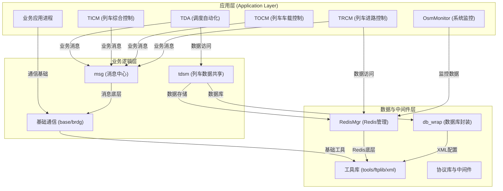
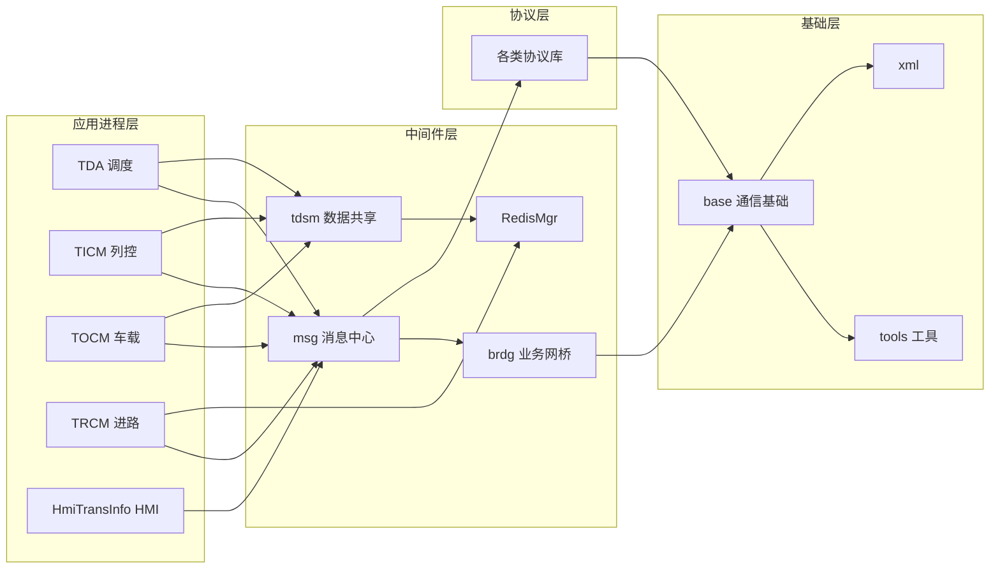
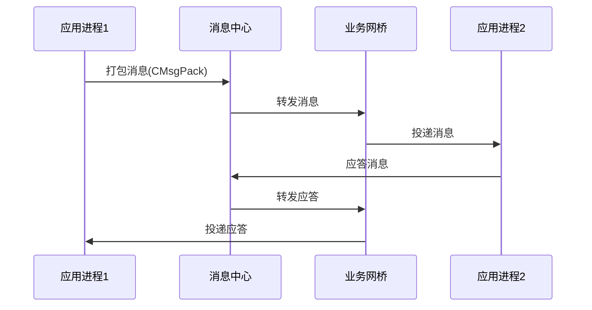
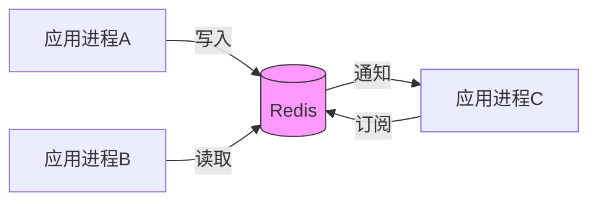
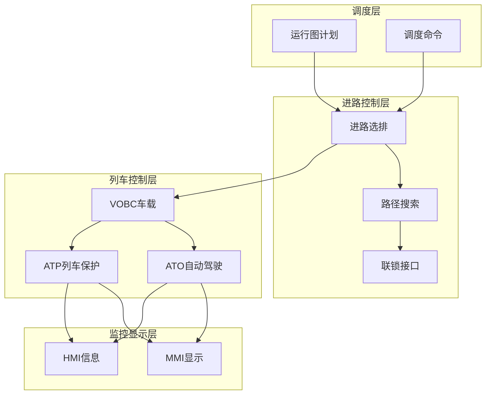
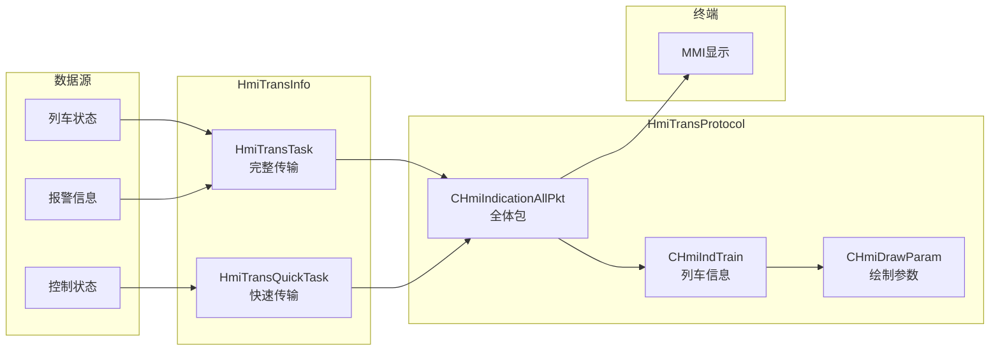

# HFS1 系统模块关系与架构分析

## 1. 系统总体架构

### 1.1 系统设计原则

HFS1 轨道交通列车自动监控系统遵循以下设计原则：

| 设计原则 | 描述 | 实现方式 |
|----------|------|----------|
| **模块化** | 高内聚、低耦合的模块划分 | 每个目录对应独立功能模块 |
| **分层架构** | 清晰的层次结构，职责分明 | 基础库→通信→协议→业务→应用 |
| **松耦合** | 模块间通过消息和接口通信 | 基于msg/brdg消息总线 |
| **高可靠性** | 故障检测、冗余备份 | 1+N主备、双网冗余、SIL2 |
| **可扩展性** | 易于新增功能和模块 | 插件化设计、配置驱动 |

### 1.2 系统分层架构



### 1.3 系统版本演进

| 版本 | 时间 | 主要变化 | 关键改进 |
|------|------|----------|----------|
| 1.0 | 2018年初 | 系统初始版本 | 基础架构建立 |
| 2.0 | 2018-2020 | 模块化重构完善 | 协议层独立 |
| 3.0 | 2020-2022 | 业务功能扩展 | 新增多项业务 |
| 4.0 | 2022-至今 | 性能优化Redis引入 | 数据共享优化 |
| 5.0 | 持续演进 | 安全性增强SIL2 | 安全完整性提升 |

## 2. 模块功能分类

### 2.1 模块分类总览

| 模块类别 | 模块名称 | 功能描述 | 核心文件 | 依赖 | 目录 |
|---------|---------|----------|----------|------|------|
| **基础通信** | base | 基础通信框架，TCP/IP/Unix socket | base/client_base.h, base/server_base.h | tools | base/ |
| | msg | 消息封装、传输、解析中心 | msg/CMsgPack.h, msg/CMsgHead.h | base, tools | msg/ |
| | brdg | 业务网桥，进程间业务消息桥接 | brdg/brdg.h, brdg/brdg_client.h | msg, base | brdg/ |
| | nbrdg | 网络网桥，跨节点网络消息桥接 | nbrdg/brdg.h | msg, base | nbrdg/ |
| | xbrdg | 扩展网桥，跨平台扩展消息桥接 | xbrdg/brdg.h | msg, base | xbrdg/ |
| **数据中间件** | tdsm | 列车数据共享与内存数据库管理 | tdsm/Tds.h, tdsm/Tds.cpp | msg, RedisMgr | tdsm/ |
| | RedisMgr | Redis连接池与数据管理 | RedisMgr/RedisMgr.h | hiredis | RedisMgr/ |
| | db_wrap | ODBC数据库操作封装 | db_wrap/db_wrap.h, db_wrap/odbc.cpp | xml, tools | db_wrap/ |
| **核心应用** | tda | 调度自动化，计划生成与分发 | tda/tda.h, tda/DealPlan.cpp | msg, tdsm, TRCM | tda/ |
| | ticm | 列车综合控制，多定时任务 | ticm/ticm.h, ticm/Task.cpp | msg, tdsm | ticm/ |
| | tocm | 列车车载控制（ATO/ATP） | tocm/tocm.h, tocm/AtoTask.cpp | msg, tdsm, TRCM | tocm/ |
| | trcm | 列车进路控制，路径搜索 | trcm/trcm.h, trcm/PathSearch.cpp | msg, RedisMgr | trcm/ |
| **接口适配** | edci | EDC（设备控制）接口 | edci/edci.h | msg, base | edci/ |
| | idci | IDC（车站标识）接口 | idci/idci.h | msg, base | idci/ |
| | idec | IDE（集中站）接口 | idec/idec.h | msg, base | idec/ |
| | odci | ODC（输出控制）接口 | odci/odci.h | msg, base | odci/ |
| **基础工具** | tools | 通用工具集（CRC、字符串、文件） | tools/utility.h, tools/CRC16.h | - | tools/ |

### 2.2 完整模块清单

#### 核心业务模块（7个）
- **TDA** - 调度自动化模块
- **TICM** - 列车综合控制模块
- **TOCM** - 列车车载控制模块
- **TRCM** - 列车进路控制模块
- **TACTCM** - 列车实际运行控制模块
- **TDSM** - 列车数据共享模块
- **CMSM** - 中心管理服务模块

#### 监控与人机界面（12个）
- **HmiTransInfo** - HMI信息传输
- **HmiTransProtocol** - HMI传输协议
- **osm_plot** - OSM绘图
- **osm_ind** - OSM表示
- **osm_user** - OSM用户
- **osm_dict** - OSM字典
- **osm_bmp** - OSM位图
- **osm_hisinfo** - OSM历史信息
- **osm_dispplan** - OSM显示计划
- **osm_statisinfo** - OSM统计信息
- **osm_maintain** - OSM维护
- **OsmMonitor** - OSM系统监控

#### 通信与消息（9个）
- **msg** - 消息模块
- **base** - 基础通信
- **brdg** - 业务网桥
- **nbrdg** - 网络网桥
- **xbrdg** - 扩展网桥
- **cluster** / **cluster_new** - 集群通信
- **mssync** - 主备同步
- **nicmon** - 网卡监控
- **ifstate** - 接口状态

#### 数据存储与访问（5个）
- **RedisMgr** - Redis管理
- **RedisClient** - Redis客户端
- **hiredis** - Redis C客户端基础库
- **db_wrap** - 数据库封装
- **PublicTd** - 公共数据

#### 协议模块（21个）
- **AtsVobcProtocol** - ATS-VOBC协议
- **CtrlCmdProtocol** - 控制命令协议
- **IndicationProtocol** - 表示协议
- **HmiTransProtocol** - HMI协议
- **DispatchProtocol** - 调度协议
- **SyncProtocol** - 同步协议
- **AtsZcProtocol** - ATS-ZC协议
- **AtsToAtsProtocol** - ATS-ATS协议
- **RmProtocol** - 远程监控协议
- **DiagramProtocol** - 运行图协议
- **InterfaceProtocol** - 接口协议
- **InfoProcessProtocol** - 信息处理协议
- **PublicProtocol** - 公共协议
- **ParamMtnProtocol** - 参数维护协议
- **StatAnalProtocol** - 统计分析协议
- **DiagramSyncProtocol** - 运行图同步协议
- **ExtSysConnProtocol** - 外部系统连接协议
- **MatcAtsZcProtocol** - MATC ATS-ZC协议
- **DagProtocol** - DAG协议
- **BaseProtocol** - 协议基础
- **PSDInter** - 屏蔽门接口

#### 接口适配器（8个）
- **edci** - EDC接口
- **idci** - IDC接口
- **idec** - IDE接口
- **odci** - ODC接口
- **PSDInter** - 屏蔽门接口
- **dtiinter** - DTI接口
- **tcmsinter_A** - TCMS接口
- **imcinter_A** - IMC接口

#### 基础库（17个）
- **base** - 基础通信库
- **tools** / **tools-lock** - 工具集
- **xml** - XML库（基于tinyxml）
- **ftplib** - FTP库
- **Framework** - 框架
- **applib** - 应用库
- **CheckLib** - 检查库
- **packqueue** / **pack_selector** - 包队列
- **AppInterface** - 应用接口
- **PublicSys** - 公共系统
- **PublicConfig** - 公共配置
- **ServerConfig** - 服务器配置
- **NetworkPlug** - 网络插件
- **InterfaceBase** - 接口基础
- **BaseProtocol** - 协议基础

#### 插件模块（6个）
- **TrainDiagramPlug** - 运行图插件
- **LogicTrainTrackPlug** - 逻辑列车轨道插件
- **AtoTrainVerifyPlug** - ATO列车校验插件
- **ReportTimePlug** - 报表时间插件
- **NetworkPlug** - 网络插件
- **SyncChannelPlug** - 同步通道插件

#### SIL2 安全模块
- **SIL2_code/** - 安全完整性等级2代码
  - SIL2_AtsVobcProtocol
  - SIL2_traininter
  - SIL2_SpeedLimitProtocol

## 3. 模块依赖关系

### 3.1 核心依赖关系图



### 3.2 关键模块依赖矩阵

| 模块 | msg | base | tools | xml | RedisMgr | tdsm | brdg |
|------|-----|------|-------|-----|----------|------|------|
| **TDA** | ✓ | ✓ | ✓ | ✓ | - | ✓ | ✓ |
| **TICM** | ✓ | ✓ | ✓ | ✓ | - | ✓ | ✓ |
| **TOCM** | ✓ | ✓ | ✓ | ✓ | - | ✓ | ✓ |
| **TRCM** | ✓ | ✓ | ✓ | ✓ | ✓ | - | ✓ |
| **HmiTransInfo** | ✓ | ✓ | ✓ | ✓ | - | - | ✓ |
| **msg** | - | ✓ | ✓ | - | - | - | - |
| **brdg** | ✓ | ✓ | ✓ | - | - | - | - |
| **tdsm** | ✓ | ✓ | ✓ | ✓ | ✓ | - | - |

> ✓ 表示有依赖关系

## 4. 通信机制分析

### 4.1 进程间通信（IPC）



### 4.2 数据共享机制



### 4.3 主备同步机制

- **mssync** 模块负责主备机数据实时同步
- 基于 Redis 的 pub/sub 机制
- 主机故障时备机自动接管

## 5. 关键业务架构

### 5.1 列车控制业务架构



### 5.2 HMI信息传输架构



## 6. 框架优势与不足

### 6.1 框架优势

| 优势 | 描述 |
|------|------|
| **模块化清晰** | 每个目录对应一个功能模块，独立编译 |
| **分层合理** | 基础→通信→协议→业务→应用，职责分明 |
| **高可靠性** | 1+N主备、双网冗余、SIL2安全等级 |
| **可扩展性** | 插件化设计，易于新增功能 |
| **跨平台** | 主要支持Linux，部分兼容Windows |
| **配置驱动** | XML配置文件管理参数 |
| **消息解耦** | 基于msg/brdg实现进程间松耦合 |

### 6.2 框架不足

| 不足 | 改进方向 |
|------|----------|
| **代码量大** | 124万行代码，维护成本高 |
| **大型文件多** | otlv4.h 3.3万行，CmdObj.cpp 1.3万行 |
| **耦合点较多** | 模块间通过Redis共享状态，调试困难 |
| **缺少单元测试** | 未见明显的测试框架 |
| **文档不全** | 部分核心文档损坏，缺少API文档 |
| **构建复杂** | 多个Makefile，依赖管理复杂 |

### 6.3 优化建议

#### 短期优化
1. **完善文档**：修复损坏文档，补充API说明
2. **拆分大文件**：CmdObj.cpp等大文件按功能拆分
3. **统一编码**：所有源文件统一UTF-8编码
4. **依赖管理**：引入CMake或conan管理依赖

#### 中期优化
1. **增加单元测试**：引入GoogleTest框架
2. **持续集成**：建立CI/CD流水线
3. **代码静态分析**：引入cppcheck、clang-tidy
4. **性能监控**：增加性能埋点

#### 长期优化
1. **微服务化**：核心模块拆分为独立服务
2. **容器化部署**：Docker容器化
3. **配置中心**：统一配置管理
4. **监控告警**：Prometheus + Grafana

## 7. 业务设计与模块关系

### 7.1 业务功能矩阵

| 业务功能 | 主要模块 | 辅助模块 | 协议支持 |
|----------|----------|----------|----------|
| **跳停** | TRCM, TOCM | TDA, HmiTransInfo | CtrlCmdProtocol |
| **清客** | TDA, TRCM | HmiTransInfo | CtrlCmdProtocol |
| **扣车** | TRCM | TDA, HmiTransInfo | CtrlCmdProtocol |
| **进路选排** | TRCM | TDA, interlock | SyncProtocol |
| **移动授权** | TOCM, TICM | AtsZcProtocol | AtsVobcProtocol |
| **列车监控** | TICM | HmiTransInfo | IndicationProtocol |
| **屏蔽门控制** | PSDInter | TOCM | InterfaceProtocol |
| **运行图管理** | TDA, TrainDiagramPlug | DiagramProtocol | DiagramProtocol |
| **告警处理** | TICM, TOCM | HmiTransInfo | IndicationProtocol |
| **数据同步** | mssync | tdsm | SyncProtocol |

### 7.2 模块协作模式

#### 模式1：请求-应答
```
调度员 → OSM → TDA → TRCM → 联锁 → 状态返回
```

#### 模式2：发布-订阅
```
列车状态 → tdsm → Redis → 订阅者（HmiTransInfo、TICM等）
```

#### 模式3：定时巡检
```
定时器 → TOCM → 采集列车状态 → 更新Redis → 通知订阅者
```

## 8. 总结

HFS1 系统是一个功能完整、架构清晰的轨道交通ATS系统：

1. **架构成熟**：采用经典的分层架构，模块化设计
2. **功能完备**：覆盖调度、控制、监控、协议等核心功能
3. **可靠性高**：通过主备、冗余、SIL2等多重保障
4. **可维护性**：需要持续优化文档、测试和构建

系统经过多年演进，已形成稳定的核心架构，未来可通过容器化、微服务化等手段进一步提升可维护性和可扩展性。

---

**文档生成时间**：2026-06-19  
**文档版本**：v2.0（重新生成）
