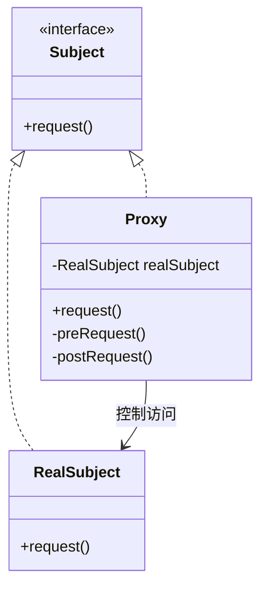
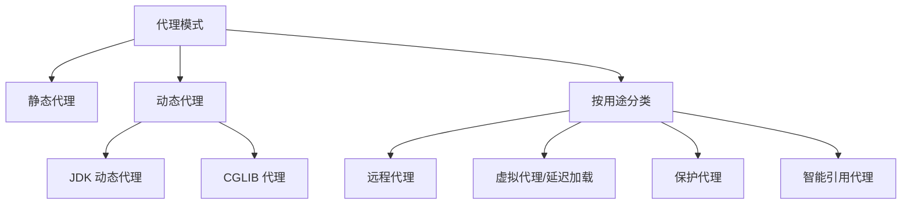
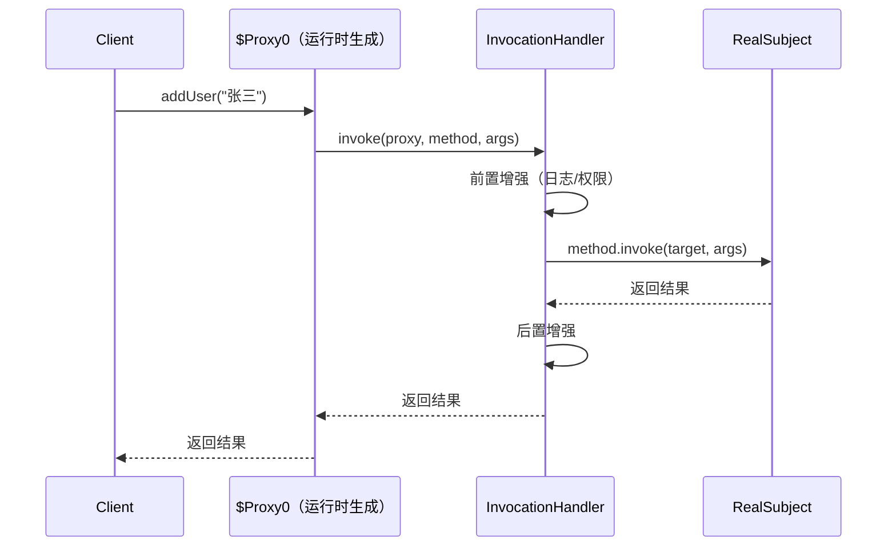
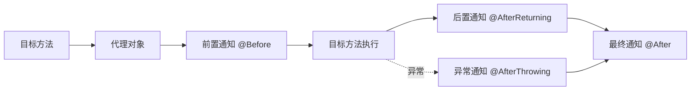

---

title: "代理模式详解"

description: "静态代理、JDK 动态代理、CGLIB 代理Spring AOP 原理深度剖析"

date: 2024-10-05T17:06:26+08:00

lastmod: 2024-10-05T17:06:26+08:00

weight: 10

tags:

  - 设计模式

  - Java

categories:

  - 结构型模式

  - 技术分享

math:  true

mermaid: true

photos:

  - https://images.unsplash.com/photo-15017858041-af3ef285b470?w=1920&q=80

---

## 模式定义

代理模式（Proxy Pattern）为其他对象提供一种代理以控制对这个对象的访问。

> **GoF 定义**：为其他对象提供一种代理以控制对这个对象的访问。

通俗地说：**代理模式就是找一个"中间人"来替你做事**。代理对象在客户端和目标对象之间起到中介作用，可以在不改变目标对象的前提下，增加额外的控制逻辑（如权限校验、延迟加载、日志记录等）。

### 类图



### 代理模式的核心结构

- **Subject（抽象主题）**：定义 RealSubject 和 Proxy 共同的接口
- **RealSubject（真实主题）**：被代理的实际对象
- **Proxy（代理）**：持有 RealSubject 的引用，控制对其的访问

## 代理模式的分类



## 一、静态代理

静态代理是最基本的代理形式，代理类在编译期就确定。

```java
// 抽象主题
public interface UserService {
    void addUser(String name);
    void deleteUser(Long id);
}

// 真实主题
public class UserServiceImpl implements UserService {
    @Override
    public void addUser(String name) {
        System.out.println("添加用户：" + name);
    }

    @Override
    public void deleteUser(Long id) {
        System.out.println("删除用户，ID：" + id);
    }
}

// 静态代理
public class UserServiceProxy implements UserService {
    private final UserService target;

    public UserServiceProxy(UserService target) {
        this.target = target;
    }

    @Override
    public void addUser(String name) {
        before();                        // 前置增强
        target.addUser(name);            // 委托给真实对象
        after();                         // 后置增强
    }

    @Override
    public void deleteUser(Long id) {
        before();
        target.deleteUser(id);
        after();
    }

    private void before() {
        System.out.println("[日志] 方法开始执行，时间：" + System.currentTimeMillis());
        System.out.println("[权限] 校验用户权限...");
    }

    private void after() {
        System.out.println("[日志] 方法执行完毕，时间：" + System.currentTimeMillis());
    }
}

// 客户端
public class Client {
    public static void main(String[] args) {
        UserService proxy = new UserServiceProxy(new UserServiceImpl());
        proxy.addUser("张三");
    }
}
```

### 静态代理的缺点

1. **一个接口需要一个代理类**：接口方法多时代码冗余
2. **接口变更需同步修改代理类**：维护成本高
3. **无法动态切换增强逻辑**：增强代码写死在代理类中

## 二、JDK 动态代理

JDK 动态代理通过 `Proxy` 类和 `InvocationHandler` 接口，在**运行时**动态生成代理类，解决了静态代理的缺点。

### 核心要求

JDK 动态代理**要求目标对象必须实现接口**（基于接口代理）。

### 实现

```java
// InvocationHandler：定义代理逻辑
public class LoggingInvocationHandler implements InvocationHandler {
    private final Object target;  // 被代理的真实对象

    public LoggingInvocationHandler(Object target) {
        this.target = target;
    }

    @Override
    public Object invoke(Object proxy, Method method, Object[] args) throws Throwable {
        // 前置增强
        System.out.println("[日志] 调用 " + method.getName() + "，参数：" + Arrays.toString(args));

        long start = System.currentTimeMillis();
        try {
            // 执行真实方法
            Object result = method.invoke(target, args);

            // 返回增强
            System.out.println("[日志] " + method.getName() + " 返回：" + result);
            return result;
        } catch (InvocationTargetException e) {
            // 异常增强
            System.out.println("[日志] " + method.getName() + " 抛出异常：" + e.getTargetException());
            throw e.getTargetException();
        } finally {
            System.out.println("[日志] " + method.getName() + " 耗时：" + (System.currentTimeMillis() - start) + "ms");
        }
    }
}

// 创建代理对象
public class ProxyFactory {
    @SuppressWarnings("unchecked")
    public static <T> T createProxy(Object target) {
        return (T) Proxy.newProxyInstance(
                target.getClass().getClassLoader(),   // 类加载器
                target.getClass().getInterfaces(),     // 目标对象实现的接口
                new LoggingInvocationHandler(target)   // 调用处理器
        );
    }
}

// 客户端使用
public class Client {
    public static void main(String[] args) {
        UserService proxy = ProxyFactory.createProxy(new UserServiceImpl());
        proxy.addUser("张三");
        proxy.deleteUser(1L);
    }
}
```

### JDK 动态代理的原理



JDK 在运行时通过字节码生成技术，动态创建了一个名为 `$Proxy0` 的类，该类实现了目标接口，并将所有方法调用转发给 `InvocationHandler.invoke()`。

## 三、CGLIB 代理

CGLIB（Code Generation Library）通过**生成目标类的子类**来实现代理，**不要求目标对象实现接口**。

### 添加依赖

```xml
<dependency>
    <groupId>cglib</groupId>
    <artifactId>cglib</artifactId>
    <version>3.3.0</version>
</dependency>
```

### 实现

```java
// CGLIB 不需要接口
public class OrderService {  // 注意：没有实现任何接口
    public void createOrder(String orderId) {
        System.out.println("创建订单：" + orderId);
    }

    public String queryOrder(Long id) {
        System.out.println("查询订单：" + id);
        return "Order-" + id;
    }
}

// 方法拦截器
public class LoggingMethodInterceptor implements MethodInterceptor {

    @Override
    public Object intercept(Object obj, Method method, Object[] args,
                            MethodProxy methodProxy) throws Throwable {
        System.out.println("[CGLIB 日志] 调用 " + method.getName());

        long start = System.currentTimeMillis();
        Object result = methodProxy.invokeSuper(obj, args);  // 调用父类（原始）方法
        System.out.println("[CGLIB 日志] " + method.getName()
            + " 耗时：" + (System.currentTimeMillis() - start) + "ms");

        return result;
    }
}

// 创建 CGLIB 代理
public class CglibProxyFactory {
    @SuppressWarnings("unchecked")
    public static <T> T createProxy(Class<T> targetClass) {
        Enhancer enhancer = new Enhancer();
        enhancer.setSuperclass(targetClass);           // 设置父类（目标类）
        enhancer.setCallback(new LoggingMethodInterceptor()); // 设置拦截器
        return (T) enhancer.create();                   // 创建代理对象
    }
}

// 客户端
public class Client {
    public static void main(String[] args) {
        OrderService proxy = CglibProxyFactory.createProxy(OrderService.class);
        proxy.createOrder("ORD-001");
        String result = proxy.queryOrder(100L);
    }
}
```

### CGLIB 的限制

1. **不能代理 final 类**：因为 CGLIB 通过继承创建子类
2. **不能代理 final 方法**：final 方法无法被子类覆盖
3. **不能代理 private 方法**：子类无法访问

## JDK 动态代理 vs CGLIB 代理

| 维度 | JDK 动态代理 | CGLIB 代理 |
|------|------------|-----------|
| 代理机制 | 基于接口（实现同一接口） | 基于继承（生成子类） |
| 要求 | 目标必须实现接口 | 无需接口 |
| 性能 | 创建快，执行稍慢 | 创建慢，执行快 |
| 生成类 | `$Proxy0` | 目标类的子类 |
| 依赖 | JDK 内置 | 需引入 CGLIB 库 |
| Spring 默认 | 有接口时使用 | 无接口时使用 |

> Spring AOP 的策略：**有接口用 JDK 动态代理，无接口用 CGLIB**（Spring Boot 2.x 后默认使用 CGLIB）。

## 代理模式的常见用途

### 1. 远程代理（Remote Proxy）

为远程对象提供本地代表，如 RPC 调用：

```java
// Dubbo/RPC 中的远程代理
// 消费者调用的是本地代理对象，代理对象负责网络通信
@DubboReference
private UserService userService;  // 实际是远程代理对象

// 调用时：userService.findById(1)
// 代理对象：序列化参数 → 网络请求 → 反序列化结果
```

### 2. 虚拟代理（Virtual Proxy / 延迟加载）

按需创建开销大的对象：

```java
// 延迟加载图片
public class ImageProxy implements Image {
    private RealImage realImage;
    private final String filename;

    public ImageProxy(String filename) {
        this.filename = filename;
    }

    @Override
    public void display() {
        if (realImage == null) {
            realImage = new RealImage(filename); // 第一次显示时才加载
        }
        realImage.display();
    }
}
```

### 3. 保护代理（Protection Proxy）

控制访问权限：

```java
public class ProtectedProxy implements Service {
    private final RealService realService;
    private final User currentUser;

    @Override
    public void sensitiveOperation() {
        if (!currentUser.hasRole("ADMIN")) {
            throw new SecurityException("无权限访问");
        }
        realService.sensitiveOperation();
    }
}
```

## Spring AOP 原理

Spring AOP 是代理模式在框架层面的最大规模应用。

### AOP 核心概念



### Spring AOP 使用示例

```java
// 定义切面
@Aspect
@Component
public class LoggingAspect {

    // 切入点：所有 Service 类的所有方法
    @Pointcut("execution(* com.example.service.*.*(..))")
    public void serviceLayer() {}

    // 前置通知
    @Before("serviceLayer()")
    public void beforeLog(JoinPoint joinPoint) {
        String method = joinPoint.getSignature().getName();
        System.out.println("[AOP] 调用方法：" + method);
    }

    // 后置通知
    @AfterReturning(pointcut = "serviceLayer()", returning = "result")
    public void afterLog(JoinPoint joinPoint, Object result) {
        System.out.println("[AOP] 方法返回：" + result);
    }

    // 环绕通知（最强大，等同于 InvocationHandler）
    @Around("serviceLayer()")
    public Object around(ProceedingJoinPoint pjp) throws Throwable {
        long start = System.currentTimeMillis();
        try {
            Object result = pjp.proceed();  // 执行目标方法
            System.out.println("[AOP] 耗时：" + (System.currentTimeMillis() - start) + "ms");
            return result;
        } catch (Throwable e) {
            System.out.println("[AOP] 方法异常：" + e.getMessage());
            throw e;
        }
    }
}
```

### Spring AOP 的代理选择策略

```java
// Spring AOP 创建代理的核心逻辑（简化版）
public class DefaultAopProxyFactory {
    public AopProxy createAopProxy(AdvisedSupport config) {
        // 条件一：有接口 或 配置了使用 JDK 代理
        // 条件二：非 GraalVM 原生镜像
        if (config.hasInterfaces() && !config.isProxyTargetClass()) {
            return new JdkDynamicAopProxy(config);     // JDK 动态代理
        } else {
            return new CglibAopProxy(config);           // CGLIB 代理
        }
    }
}
```

## 适用场景

1. **AOP 切面编程**：日志、事务、权限、缓存等横切关注点
2. **远程调用**：RPC、RMI 的本地代理
3. **延迟加载**：Hibernate 懒加载、大对象按需创建
4. **权限控制**：方法级别的访问控制
5. **智能引用**：引用计数、缓存等

## 优缺点

### 优点

1. **职责清晰**：代理类专注于控制逻辑，目标类专注于业务
2. **开闭原则**：不修改目标类即可增加控制逻辑
3. **解耦**：客户端不直接接触目标对象

### 缺点

1. **性能损耗**：多了一层方法调用
2. **复杂度增加**：增加了代理类的维护成本
3. **调试困难**：调用栈中多了代理层

## 代理模式 vs 装饰器模式

这两种模式结构几乎相同，区别在于**设计意图**：

| 维度 | 代理模式 | 装饰器模式 |
|------|---------|-----------|
| 意图 | 控制对对象的访问 | 增强对象的功能 |
| 创建者 | 代理自己创建/持有对象 | 客户端创建并传入对象 |
| 关注点 | "能不能访问" | "做得更多" |
| 典型场景 | Spring AOP、远程代理 | Java IO 流 |
| 使用者感知 | 不知道在用代理 | 知道在装饰 |

> 区分关键：**代理强调"控制"，装饰器强调"增强"**。

## 实战案例

### MyBatis Mapper 代理

```java
// Mapper 接口（没有实现类！）
public interface UserMapper {
    User findById(Long id);
}

// MyBatis 通过 JDK 动态代理生成 Mapper 实现
// MapperProxy 实现了 InvocationHandler
UserMapper mapper = sqlSession.getMapper(UserMapper.class);
// mapper 实际是代理对象，invoke() 中执行 SQL 解析和数据库查询
```

### Spring 事务管理

```java
// @Transactional 背后就是 AOP 代理
@Transactional
public void transferMoney(Long from, Long to, BigDecimal amount) {
    // 代理对象在方法前：开启事务
    accountDao.debit(from, amount);
    accountDao.credit(to, amount);
    // 代理对象在方法后：提交事务（异常时回滚）
}
```

### Feign 远程调用

```java
// Spring Cloud Feign 声明式 HTTP 客户端
// 本质是动态代理
@FeignClient(name = "user-service")
public interface UserFeignClient {
    @GetMapping("/users/{id}")
    User getById(@PathVariable Long id);
}

// 调用时：userFeignClient.getById(1L)
// 代理对象：构造 HTTP 请求 → 发送 → 解析响应
```

## 总结

代理模式是 Spring 框架的基石之一。理解了代理模式，就能理解：

- **Spring AOP** 是如何在不修改业务代码的前提下织入日志、事务、缓存等横切逻辑的
- **MyBatis Mapper** 是如何让接口自动执行 SQL 的
- **Feign/Dubbo** 是如何让远程调用像本地方法一样简单的

掌握代理模式的三种形式：

| 类型 | 适用场景 | 关键技术 |
|------|---------|---------|
| 静态代理 | 简单场景、代理类少 | 手动编写代理类 |
| JDK 动态代理 | 目标有接口 | `Proxy` + `InvocationHandler` |
| CGLIB 代理 | 目标无接口 | `Enhancer` + `MethodInterceptor` |

代理模式的精髓在于：**在不改变原对象的前提下，通过中间层控制对其的访问**。这正是 AOP 编程范式的核心思想。
