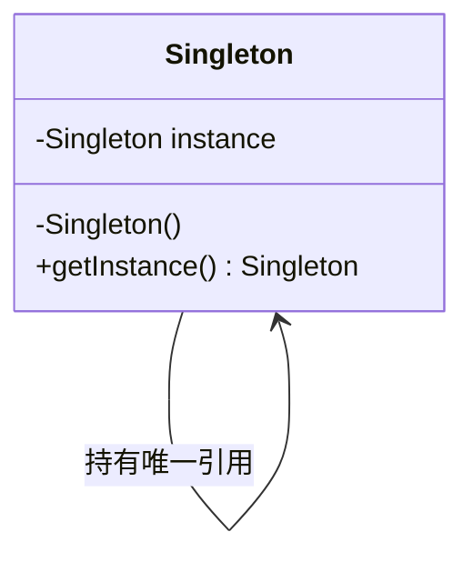

## 模式定义

单例模式（Singleton Pattern）是最简单也是最常用的设计模式之一。它保证一个类在内存中只有一个实例，并提供一个全局访问点来获取该实例。

> **GoF 定义**：确保一个类只有一个实例，并提供一个全局访问点。

单例模式的三个核心要素：

1. **私有构造方法**：防止外部通过 `new` 创建实例
2. **类内部持有唯一实例**：以静态变量形式保存
3. **提供静态获取方法**：向外界返回该唯一实例

### 类图



## 五种实现方式

### 1. 饿汉式（Eager Initialization）

饿汉式在类加载时就完成实例化，天生线程安全。

```java
public class Singleton {
    // 类加载时即创建实例
    private static final Singleton INSTANCE = new Singleton();

    // 私有构造
    private Singleton() {
        // 防止通过反射破坏单例（可选）
        if (INSTANCE != null) {
            throw new IllegalStateException("单例已存在，禁止反射创建");
        }
    }

    public static Singleton getInstance() {
        return INSTANCE;
    }
}
```

**线程安全分析**：JVM 类加载阶段会通过 `ClassLoader` 的锁机制保证类的初始化只执行一次，因此饿汉式**天生线程安全**。

**优点**：实现简单，线程安全，调用效率高  
**缺点**：类加载时就创建实例，若该实例从未使用则会造成资源浪费；不支持延迟加载

### 2. 懒汉式（Lazy Initialization）

懒汉式在第一次调用 `getInstance()` 时才创建实例，实现延迟加载。

#### 2.1 线程不安全的懒汉式

```java
public class Singleton {
    private static Singleton instance;

    private Singleton() {}

    public static Singleton getInstance() {
        if (instance == null) {         // ① 多线程下可能同时判断为 null
            instance = new Singleton(); // ② 多个线程各创建一个实例
        }
        return instance;
    }
}
```

**线程安全分析**：在多线程环境下，两个线程可能同时执行到 ① 处判断为 `null`，随后各自创建实例，**破坏单例**。

#### 2.2 线程安全的懒汉式（同步方法）

```java
public static synchronized Singleton getInstance() {
    if (instance == null) {
        instance = new Singleton();
    }
    return instance;
}
```

**缺点**：每次获取实例都要加锁，性能开销大。实际上只有第一次创建时才需要同步。

### 3. 双重检查锁（Double-Checked Locking, DCL）

双重检查锁是懒汉式的优化版本，兼顾了延迟加载和性能。

```java
public class Singleton {
    // volatile 防止指令重排序
    private static volatile Singleton instance;

    private Singleton() {}

    public static Singleton getInstance() {
        if (instance == null) {                 // 第一次检查，避免不必要的加锁
            synchronized (Singleton.class) {
                if (instance == null) {         // 第二次检查，防止重复创建
                    instance = new Singleton();
                }
            }
        }
        return instance;
    }
}
```

#### 为什么必须加 volatile？

`instance = new Singleton()` 并非原子操作，它分为三步：

1. 分配对象内存空间
2. 初始化对象（调用构造方法）
3. 将 `instance` 引用指向内存地址

如果不加 `volatile`，JVM 可能将步骤重排序为 1 → 3 → 2。此时另一个线程在第一次检查时发现 `instance != null`（步骤 3 已执行），直接返回一个**尚未初始化完成**的对象，导致 NPE。

`volatile` 通过内存屏障禁止了这种重排序，保证了对象的完整可见性。

**优点**：延迟加载、性能高、线程安全  
**缺点**：实现相对复杂，依赖 `volatile` 语义

### 4. 静态内部类（Initialization-on-demand Holder）

静态内部类方式利用了 JVM 的类加载机制来保证线程安全，同时实现了延迟加载。

```java
public class Singleton {

    private Singleton() {}

    // 静态内部类，只有在 getInstance() 被调用时才会被加载
    private static class Holder {
        private static final Singleton INSTANCE = new Singleton();
    }

    public static Singleton getInstance() {
        return Holder.INSTANCE;
    }
}
```

**线程安全分析**：`Holder` 类在 `getInstance()` 首次被调用时才会触发类加载。JVM 在类初始化阶段（执行 `<clinit>()` 方法）会加锁，保证 `Holder.INSTANCE` 只被创建一次。

**优点**：延迟加载、线程安全、无需同步锁、实现优雅  
**缺点**：无法通过传参进行初始化

> 这是**推荐使用**的单例实现方式之一。

### 5. 枚举实现（Enum Singleton）

Effective Java 作者 Joshua Bloch 强烈推荐的方式：

```java
public enum Singleton {
    INSTANCE;

    // 可以添加属性和方法
    private int value;

    public void doSomething() {
        System.out.println("枚举单例工作正常");
    }

    public int getValue() {
        return value;
    }
}

// 使用方式
Singleton instance = Singleton.INSTANCE;
```

**优点**：
- **天生线程安全**：枚举实例的创建由 JVM 保证
- **天然防反射攻击**：JVM 禁止通过反射创建枚举对象
- **天然防序列化破坏**：枚举的序列化机制保证了反序列化后仍是同一实例
- 代码最简洁

**缺点**：不能延迟加载；枚举类不能继承其他类

## 单例的破坏与防御

### 反射攻击

通过反射可以调用私有构造方法创建新实例，破坏单例。防御方式是在构造方法中抛出异常：

```java
private Singleton() {
    if (Holder.INSTANCE != null) {
        throw new IllegalStateException("单例已存在，禁止反射创建");
    }
}
```

> 枚举实现天然免疫反射攻击，这是其一大优势。

### 序列化破坏

反序列化时会创建新对象，破坏单例。防御方式是实现 `readResolve()` 方法：

```java
public class Singleton implements Serializable {
    private static final long serialVersionUID = 1L;

    protected Object readResolve() {
        return getInstance(); // 返回已有实例，而非新建
    }
}
```

## 适用场景

- **配置管理**：系统全局配置只需要一份
- **日志管理**：日志写入器需保证全局唯一
- **数据库连接池**：连接池作为共享资源应唯一
- **线程池**：全局线程池管理
- **Windows 任务管理器**：经典案例，不能打开两个
- **Runtime 类**：JDK 中 `Runtime.getRuntime()` 就是饿汉式单例

## 优缺点

### 优点

1. **保证唯一实例**：避免对资源的多重占用
2. **全局访问点**：方便共享状态管理
3. **延迟加载**：部分实现支持按需创建

### 缺点

1. **扩展困难**：没有接口，难以扩展（枚举除外）
2. **职责过重**：既管创建又管业务，违背单一职责原则
3. **测试困难**：单例的全局状态不利于单元测试
4. **滥用风险**：过度使用相当于面向过程编程

## 实战案例：JDK 与框架中的单例

### java.lang.Runtime

```java
// JDK 源码中的饿汉式单例
public class Runtime {
    private static final Runtime currentRuntime = new Runtime();

    public static Runtime getRuntime() {
        return currentRuntime;
    }

    private Runtime() {}
}
```

### Spring 中的单例

Spring 容器管理的 Bean 默认就是单例的（单例作用域），但 Spring 的单例与 GoF 单例不同——它是**每个 IoC 容器一个实例**，而非每个 ClassLoader 一个实例。

```java
@Component // 默认 scope = singleton
public class UserService {
    // Spring 容器保证全局唯一
}
```

## 五种实现对比

| 实现方式 | 线程安全 | 延迟加载 | 性能 | 防反射 | 防序列化 | 推荐度 |
|---------|:-------:|:-------:|:----:|:------:|:--------:|:-----:|
| 饿汉式 | ✅ | ❌ | 高 | ❌ | ❌ | ⭐⭐⭐ |
| 懒汉式（同步） | ✅ | ✅ | 低 | ❌ | ❌ | ⭐ |
| 双重检查锁 | ✅ | ✅ | 高 | ❌ | ❌ | ⭐⭐⭐⭐ |
| 静态内部类 | ✅ | ✅ | 高 | ❌ | ❌ | ⭐⭐⭐⭐⭐ |
| 枚举 | ✅ | ❌ | 高 | ✅ | ✅ | ⭐⭐⭐⭐⭐ |

## 总结

单例模式虽小，但其中涉及的并发编程知识（指令重排序、volatile、类加载机制、内存可见性）却非常深入。选择实现方式时：

- **首选枚举**：最简洁、最安全，Effective Java 力荐
- **次选静态内部类**：需要延迟加载时的最佳选择
- **双重检查锁**：适用于需要传参初始化的场景

理解单例背后的原理，比记住五种写法更重要。
