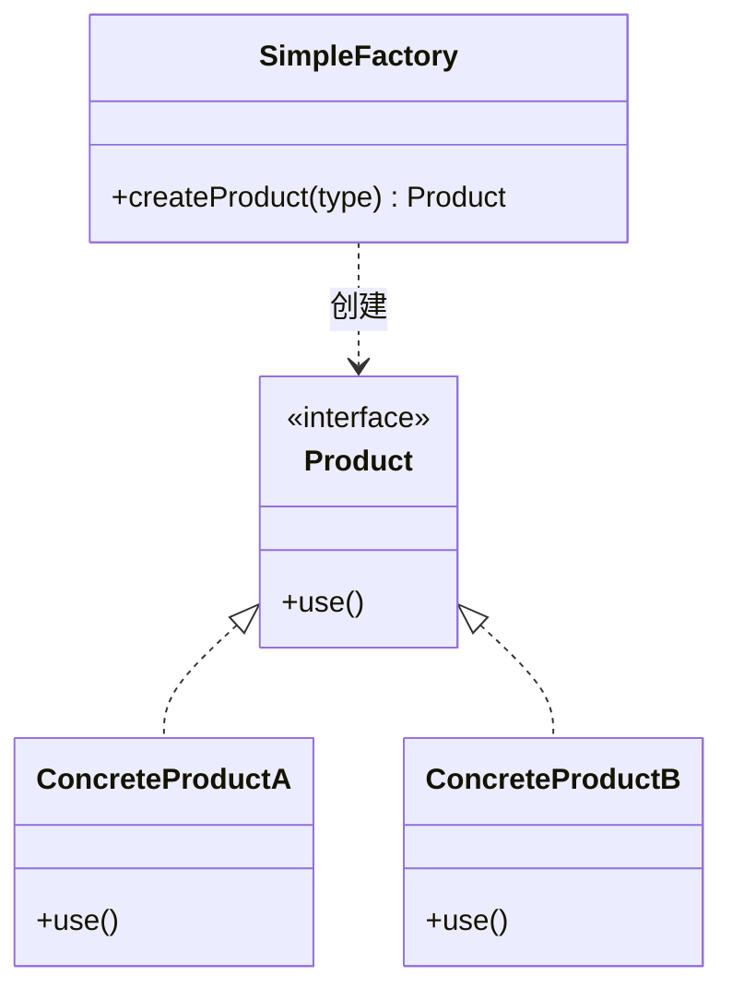
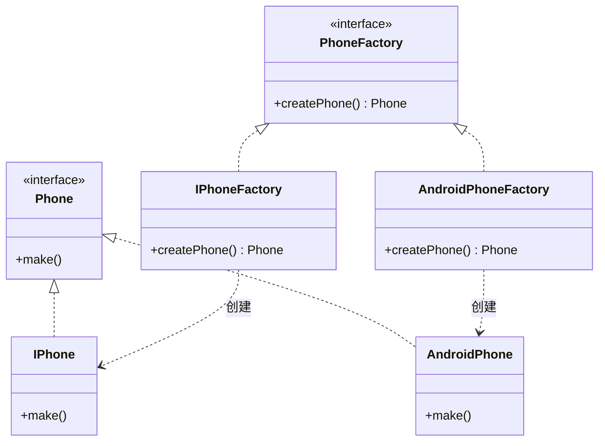
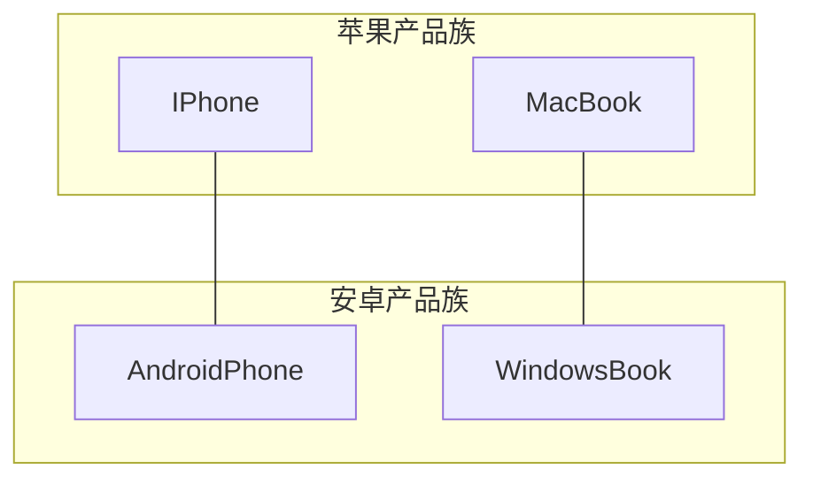
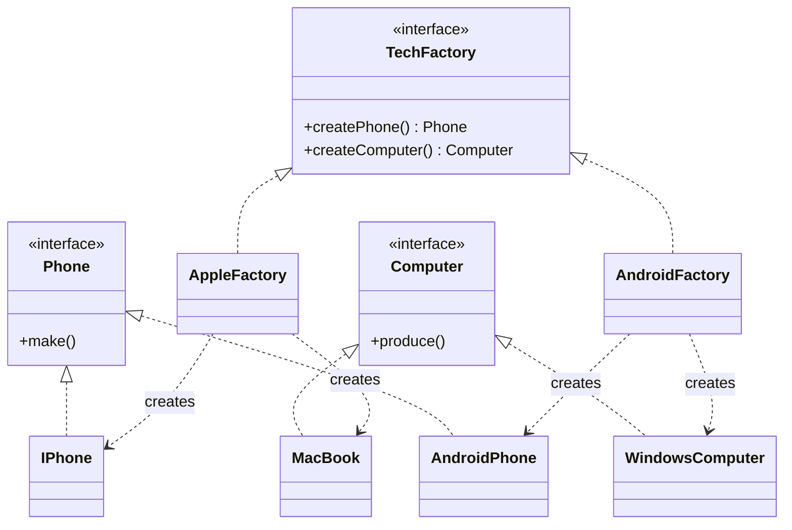
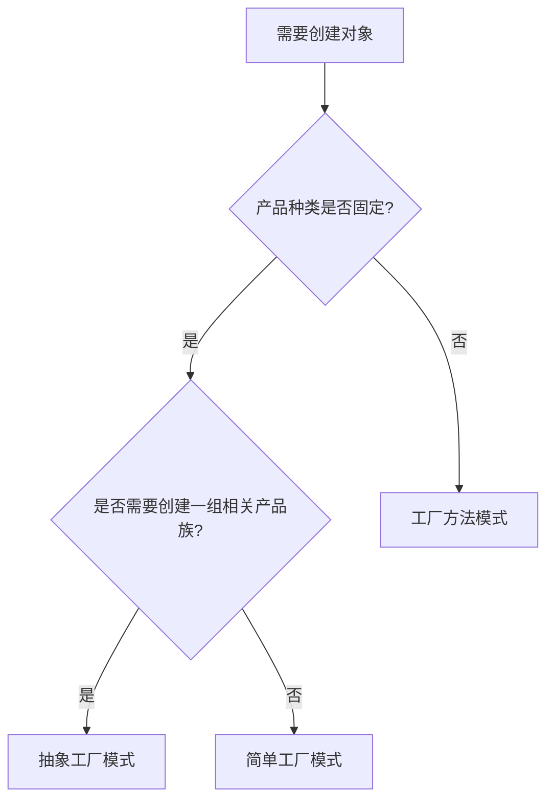

## 模式定义

工厂模式是创建型模式中最重要的一种，其核心思想是**将对象的创建过程封装起来，让客户端无需关心对象的创建细节**，只需要告诉工厂需要什么对象即可。

工厂模式有三种形态：

| 模式 | 特点 | 复杂度 |
|------|------|:------:|
| 简单工厂 | 一个工厂方法，通过参数决定创建哪种产品 | 低 |
| 工厂方法 | 每种产品对应一个工厂类，符合开闭原则 | 中 |
| 抽象工厂 | 创建一系列相关的产品族 | 高 |

## 一、简单工厂（Simple Factory）

简单工厂又称为静态工厂方法模式，它不属于 GoF 23 种设计模式，但却是理解工厂模式的起点。

### 类图



### 代码示例

```java
// 抽象产品
public interface Phone {
    void make();
}

// 具体产品
public class IPhone implements Phone {
    @Override
    public void make() {
        System.out.println("制造苹果手机");
    }
}

public class AndroidPhone implements Phone {
    @Override
    public void make() {
        System.out.println("制造安卓手机");
    }
}

// 简单工厂
public class PhoneFactory {
    public static Phone createPhone(String type) {
        switch (type) {
            case "apple":
                return new IPhone();
            case "android":
                return new AndroidPhone();
            default:
                throw new IllegalArgumentException("未知手机类型: " + type);
        }
    }
}

// 客户端
public class Client {
    public static void main(String[] args) {
        Phone phone = PhoneFactory.createPhone("apple");
        phone.make(); // 制造苹果手机
    }
}
```

### 优缺点

**优点**：结构简单，客户端无需关心创建过程  
**缺点**：违反开闭原则——每新增一种产品，都需要修改工厂类的 `switch` 分支

## 二、工厂方法模式（Factory Method）

工厂方法模式将工厂抽象化，让每种产品都拥有自己的专属工厂。

> **GoF 定义**：定义一个用于创建对象的接口，但让子类决定实例化哪一个类。工厂方法使一个类的实例化延迟到其子类。

### 类图



### 代码示例

```java
// 抽象产品
public interface Phone {
    void make();
}

// 具体产品
public class IPhone implements Phone {
    @Override
    public void make() {
        System.out.println("制造苹果手机");
    }
}

public class AndroidPhone implements Phone {
    @Override
    public void make() {
        System.out.println("制造安卓手机");
    }
}

// 抽象工厂
public interface PhoneFactory {
    Phone createPhone();
}

// 具体工厂
public class IPhoneFactory implements PhoneFactory {
    @Override
    public Phone createPhone() {
        return new IPhone();
    }
}

public class AndroidPhoneFactory implements PhoneFactory {
    @Override
    public Phone createPhone() {
        return new AndroidPhone();
    }
}

// 客户端
public class Client {
    public static void main(String[] args) {
        PhoneFactory factory = new IPhoneFactory();
        Phone phone = factory.createPhone();
        phone.make(); // 制造苹果手机
    }
}
```

### 优缺点

**优点**：
- 符合开闭原则：新增产品只需新增产品类和对应工厂类，无需修改已有代码
- 符合单一职责原则：每个工厂只负责创建一种产品

**缺点**：类的数量成倍增加，系统复杂度上升

## 三、抽象工厂模式（Abstract Factory）

抽象工厂模式用于创建一组相关或相互依赖的产品族。

> **GoF 定义**：提供一个创建一系列相关或相互依赖对象的接口，而无需指定它们具体的类。

### 核心概念：产品等级与产品族

- **产品等级结构**：同一种产品的不同品牌（如手机这一产品等级下有苹果手机、安卓手机）
- **产品族**：同一个品牌下的不同产品（如苹果品牌下的手机、电脑、手表）



### 类图



### 代码示例

```java
// 抽象产品
public interface Phone {
    void make();
}
public interface Computer {
    void produce();
}

// 具体产品
public class IPhone implements Phone {
    @Override
    public void make() { System.out.println("制造 iPhone"); }
}
public class AndroidPhone implements Phone {
    @Override
    public void make() { System.out.println("制造安卓手机"); }
}
public class MacBook implements Computer {
    @Override
    public void produce() { System.out.println("制造 MacBook"); }
}
public class WindowsComputer implements Computer {
    @Override
    public void produce() { System.out.println("制造 Windows 电脑"); }
}

// 抽象工厂
public interface TechFactory {
    Phone createPhone();
    Computer createComputer();
}

// 具体工厂：苹果产品族
public class AppleFactory implements TechFactory {
    @Override
    public Phone createPhone() { return new IPhone(); }
    @Override
    public Computer createComputer() { return new MacBook(); }
}

// 具体工厂：安卓产品族
public class AndroidFactory implements TechFactory {
    @Override
    public Phone createPhone() { return new AndroidPhone(); }
    @Override
    public Computer createComputer() { return new WindowsComputer(); }
}

// 客户端
public class Client {
    public static void main(String[] args) {
        TechFactory factory = new AppleFactory();
        factory.createPhone().make();       // 制造 iPhone
        factory.createComputer().produce(); // 制造 MacBook
    }
}
```

### 优缺点

**优点**：
- 保证同一产品族的产品一起使用，避免不一致
- 客户端与具体产品解耦

**缺点**：**难以扩展新的产品种类**——如果要在抽象工厂中新增一个产品（如手表），所有具体工厂类都需要修改，违反开闭原则。这就是抽象工厂的"开闭原则倾斜"特性。

## 三种工厂模式对比

| 维度 | 简单工厂 | 工厂方法 | 抽象工厂 |
|------|---------|---------|---------|
| 产品种类 | 单一产品 | 单一产品 | 产品族（多种产品） |
| 工厂数量 | 一个 | 每种产品一个 | 每个产品族一个 |
| 扩展产品 | 修改工厂代码（违反 OCP） | 新增产品类和工厂类（符合 OCP） | 新增产品族符合 OCP，新增产品种类违反 OCP |
| 复杂度 | 低 | 中 | 高 |
| 适用场景 | 产品种类少且稳定 | 产品种类可能频繁扩展 | 需要创建一组相关产品 |

## 选型策略



## 适用场景

- **简单工厂**：产品种类少且基本不会变化，如日志工厂创建不同级别的 Logger
- **工厂方法**：需要灵活扩展产品种类，客户端不关心创建细节
- **抽象工厂**：需要创建一组配套使用的产品族，如跨平台 UI 组件（Windows 风格按钮+文本框、Mac 风格按钮+文本框）

## 实战案例

### JDK 中的工厂模式

```java
// Calendar.getInstance() 是简单工厂
Calendar cal = Calendar.getInstance(); // 根据地区和时区返回不同的 Calendar

// java.util.Collection.iterator() 是工厂方法
List<String> list = new ArrayList<>();
Iterator<String> it = list.iterator(); // ArrayList 重写了 iterator() 返回具体迭代器
```

### Spring 中的工厂模式

Spring 的 `BeanFactory` 和 `FactoryBean` 是工厂模式的经典应用：

```java
// FactoryBean：用户自定义 Bean 的创建逻辑
public class ConnectionFactoryBean implements FactoryBean<Connection> {
    @Override
    public Connection getObject() {
        // 自定义创建逻辑
        return DriverManager.getConnection(url, user, password);
    }
    @Override
    public Class<?> getObjectType() {
        return Connection.class;
    }
}
```

### MyBatis 中的工厂模式

```java
// SqlSessionFactory 是工厂模式的体现
SqlSessionFactory factory = new SqlSessionFactoryBuilder()
        .build(Resources.getResourceAsStream("mybatis-config.xml"));
SqlSession session = factory.openSession();
```

## 总结

工厂模式的本质是**将对象的创建与使用分离**。理解了简单工厂 → 工厂方法 → 抽象工厂的演进过程，就能根据实际需求做出合理选择：

- 产品少且稳定 → 简单工厂
- 产品可能扩展 → 工厂方法
- 一组产品配套使用 → 抽象工厂

不要盲目追求抽象工厂的"高大上"，**最适合场景的模式才是最好的模式**。
