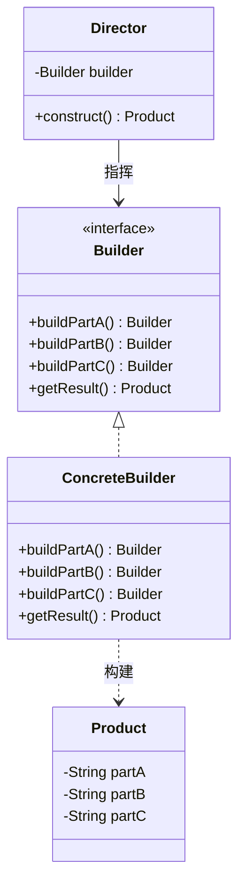

## 模式定义

建造者模式（Builder Pattern）将一个复杂对象的构建过程与它的表示分离，使得同样的构建过程可以创建不同的表示。

> **GoF 定义**：将一个复杂对象的构建与它的表示分离，使得同样的构建过程可以创建不同的表示。

简单来说：当一个对象有很多可选参数时，与其写一个有十几个参数的构造方法，不如一步步地"建造"它。

### 类图



## 为什么需要建造者模式？

### 问题：重叠构造器模式（Telescoping Constructor）

当一个类有很多可选参数时，传统做法是提供多个构造方法重载：

```java
// 噩梦般的构造方法重载
public class User {
    private String name;      // 必填
    private String password;  // 必填
    private String email;     // 可选
    private String phone;     // 可选
    private int age;          // 可选
    private String address;   // 可选

    public User(String name, String password) {
        this(name, password, null);
    }
    public User(String name, String password, String email) {
        this(name, password, email, null);
    }
    public User(String name, String password, String email, String phone) {
        this(name, password, email, phone, 0);
    }
    public User(String name, String password, String email, String phone, int age) {
        this(name, password, email, phone, age, null);
    }
    public User(String name, String password, String email, String phone, int age, String address) {
        this.name = name;
        this.password = password;
        // ...
    }
}

// 调用时难以阅读，参数顺序容易搞错
User user = new User("张三", "123456", null, "13800138000", 25, "北京");
```

### 问题：JavaBean 模式（Setter 方法）

```java
User user = new User();
user.setName("张三");
user.setPassword("123456");
user.setAge(25);
// 问题：对象在构建过程中处于不完整状态，且无法做参数校验
// 多线程下不安全
```

### 解决方案：建造者模式

```java
User user = new User.Builder("张三", "123456")
        .age(25)
        .phone("13800138000")
        .address("北京")
        .build();
```

清晰、优雅、可读性强。

## 经典建造者模式实现

### 完整的 Director + Builder 实现

```java
// 产品类
public class Computer {
    private String cpu;
    private String ram;
    private String disk;
    private String gpu;

    // 私有构造，只能通过 Builder 创建
    private Computer(Builder builder) {
        this.cpu = builder.cpu;
        this.ram = builder.ram;
        this.disk = builder.disk;
        this.gpu = builder.gpu;
    }

    // 静态内部类 Builder
    public static class Builder {
        private String cpu;
        private String ram;
        private String disk;
        private String gpu;

        public Builder cpu(String cpu) {
            this.cpu = cpu;
            return this;
        }

        public Builder ram(String ram) {
            this.ram = ram;
            return this;
        }

        public Builder disk(String disk) {
            this.disk = disk;
            return this;
        }

        public Builder gpu(String gpu) {
            this.gpu = gpu;
            return this;
        }

        public Computer build() {
            // 在此处可以进行参数校验
            if (cpu == null || ram == null) {
                throw new IllegalStateException("CPU 和 RAM 为必填项");
            }
            return new Computer(this);
        }
    }

    @Override
    public String toString() {
        return String.format("Computer{cpu=%s, ram=%s, disk=%s, gpu=%s}", cpu, ram, disk, gpu);
    }
}

// 客户端使用（链式调用）
public class Client {
    public static void main(String[] args) {
        Computer computer = new Computer.Builder()
                .cpu("Intel i9-13900K")
                .ram("32GB DDR5")
                .disk("2TB NVMe SSD")
                .gpu("RTX 4090")
                .build();
        System.out.println(computer);
    }
}
```

## Lombok @Builder 注解

Lombok 让建造者模式的使用变得极为简单，只需一个注解即可自动生成 Builder：

```java
import lombok.Builder;
import lombok.Getter;
import lombok.ToString;

@Builder
@Getter
@ToString
public class User {
    private String name;
    private String password;
    @Builder.Default
    private int age = 18;  // 默认值
    private String email;
    private String phone;
    private String address;
}

// 使用方式完全一致
User user = User.builder()
        .name("张三")
        .password("123456")
        .age(25)
        .address("北京")
        .build();
```

### Lombok @Builder 的底层原理

Lombok 在编译期自动生成了类似上面的静态内部类 `Builder`，包括所有字段的 setter 方法和 `build()` 方法。反编译后可以看到它与手写的 Builder 结构一致。

> **注意**：使用 `@Builder` 时，如果类中有必填字段需要校验，可以在类上添加 `@NonNull` 或手动补充 `build()` 的校验逻辑。

## 带参数校验的增强 Builder

```java
public static class Builder {
    // ... 字段省略

    public Computer build() {
        // 必填校验
        Objects.requireNonNull(cpu, "CPU 不能为空");
        Objects.requireNonNull(ram, "RAM 不能为空");

        // 业务校验
        if (ram.contains("DDR3")) {
            throw new IllegalArgumentException("不支持 DDR3 内存");
        }

        Computer computer = new Computer(this);
        // 构建后清空 Builder，使其可复用
        return computer;
    }
}
```

## 适用场景

1. **对象参数多**：当一个类有超过 4 个参数（尤其是可选参数）时
2. **不可变对象**：需要创建不可变对象（所有字段 final）时
3. **分步构建**：对象需要按特定步骤组装（如 SQL 构建器、HTML 构建器）
4. **参数校验**：需要在构建时统一校验参数合法性时

## 优缺点

### 优点

1. **链式调用，可读性强**：每个方法名即参数说明
2. **参数灵活**：可选参数可任意组合
3. **不可变对象**：构建完成后对象不可变，线程安全
4. **统一校验**：在 `build()` 中集中校验

### 缺点

1. **代码量增加**：需要额外编写 Builder 类（Lombok 可解决）
2. **对象创建开销**：多创建了一个 Builder 对象
3. **不适用于简单对象**：参数少时反而过度设计

## 建造者模式 vs 工厂模式

| 维度 | 工厂模式 | 建造者模式 |
|------|---------|-----------|
| 关注点 | 创建**单个**产品 | **分步**构建复杂产品 |
| 创建方式 | 一步到位 | 多步组装 |
| 返回时机 | 立即返回完整产品 | 最后一步 `build()` 返回 |
| 参数 | 通常参数少 | 通常参数多且有可选项 |
| 典型场景 | 根据类型创建不同产品 | 组装复杂配置对象 |

> 简记：**工厂关心"创建什么"，建造者关心"怎么创建"**。

## 实战案例

### StringBuilder / StringBuffer

```java
// JDK 中的建造者模式，逐步构建字符串
String result = new StringBuilder()
        .append("SELECT * FROM users")
        .append(" WHERE age > 18")
        .append(" ORDER BY name")
        .toString();
```

### MyBatis 的 SqlSessionFactoryBuilder

```java
SqlSessionFactory factory = new SqlSessionFactoryBuilder()
        .build(inputStream);  // 分步构建配置对象
```

### OkHttp 的 Request.Builder

```java
Request request = new Request.Builder()
        .url("https://api.example.com/data")
        .addHeader("Authorization", "Bearer token")
        .post(RequestBody.create(json, MediaType.parse("application/json")))
        .build();
```

### Spring Security 的 HttpSecurity

```java
@Configuration
@EnableWebSecurity
public class SecurityConfig {
    @Bean
    public SecurityFilterChain filterChain(HttpSecurity http) throws Exception {
        http.authorizeHttpRequests(auth -> auth
                    .requestMatchers("/public/**").permitAll()
                    .anyRequest().authenticated())
            .formLogin(form -> form.loginPage("/login").permitAll())
            .logout(logout -> logout.logoutUrl("/logout"));
        return http.build();  // 典型的建造者模式
    }
}
```

## 总结

建造者模式是日常开发中使用频率极高的模式，尤其在构建 DTO、配置对象、请求/响应体时几乎无处不在。借助 Lombok `@Builder`，我们可以用极少的代码获得建造者模式的所有好处。

核心原则：**当一个对象的构建过程涉及多个可选参数时，优先考虑建造者模式**。
