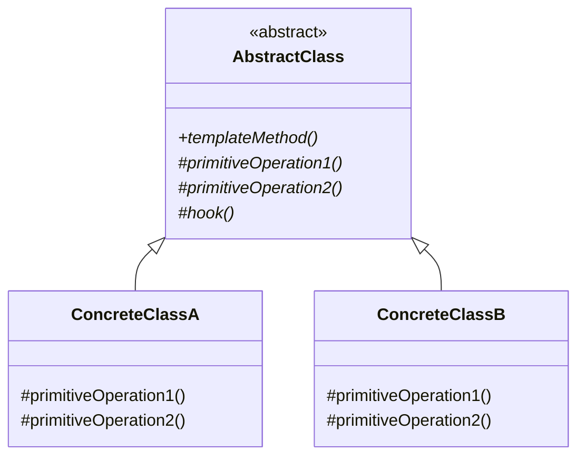

## 模式定义

模板方法模式（Template Method Pattern）在一个方法中定义一个算法的骨架，而将一些步骤延迟到子类中实现。模板方法使得子类可以在不改变算法结构的情况下，重新定义算法中的某些特定步骤。

> **GoF 定义**：定义一个操作中的算法骨架，而将一些步骤延迟到子类中。模板方法使得子类可以不改变一个算法的结构即可重定义该算法的某些特定步骤。

通俗地说：**父类定义流程"做什么"和"按什么顺序做"，子类定义每一步"怎么做"**。

### 类图



### 核心概念

- **模板方法**：定义算法骨架的具体方法（通常为 `final`，防止子类覆盖）
- **基本方法（抽象方法）**：由子类实现的步骤
- **钩子方法（Hook Method）**：父类提供默认实现（空方法或返回布尔值），子类可选择覆盖

## 手写模板方法模式

### 经典示例：制作饮料

```java
// 抽象模板类
public abstract class Beverage {
    // 模板方法：定义为 final，防止子类修改流程
    public final void prepareRecipe() {
        boilWater();          // 烧水
        brew();               // 冲泡（抽象方法，子类实现）
        pourInCup();          // 倒入杯中
        if (customerWantsCondiments()) {  // 钩子方法
            addCondiments();  // 加调料（抽象方法，子类实现）
        }
    }

    // 具体方法（所有子类共用，不需要覆盖）
    private void boilWater() {
        System.out.println("将水煮沸");
    }

    private void pourInCup() {
        System.out.println("将饮料倒入杯中");
    }

    // 抽象方法：子类必须实现
    protected abstract void brew();
    protected abstract void addCondiments();

    // 钩子方法：子类可以选择覆盖（默认返回 true）
    protected boolean customerWantsCondiments() {
        return true;
    }
}

// 咖啡
public class Coffee extends Beverage {
    @Override
    protected void brew() {
        System.out.println("用沸水冲泡咖啡粉");
    }

    @Override
    protected void addCondiments() {
        System.out.println("加入糖和牛奶");
    }
}

// 茶
public class Tea extends Beverage {
    @Override
    protected void brew() {
        System.out.println("用 80°C 热水浸泡茶叶");
    }

    @Override
    protected void addCondiments() {
        System.out.println("加入柠檬片");
    }

    // 覆盖钩子方法：不加调料
    @Override
    protected boolean customerWantsCondiments() {
        return false;
    }
}

// 客户端
public class Client {
    public static void main(String[] args) {
        System.out.println("=== 制作咖啡 ===");
        Beverage coffee = new Coffee();
        coffee.prepareRecipe();

        System.out.println("\n=== 制作茶 ===");
        Beverage tea = new Tea();
        tea.prepareRecipe();
    }
}
```

输出：
```
=== 制作咖啡 ===
将水煮沸
用沸水冲泡咖啡粉
将饮料倒入杯中
加入糖和牛奶

=== 制作茶 ===
将水煮沸
用 80°C 热水浸泡茶叶
将饮料倒入杯中
（不加调料，钩子返回 false）
```

## 钩子方法详解

钩子方法让子类有能力**影响模板方法的流程**，而不需要改变算法结构：

```java
// 钩子方法类型一：控制流程（返回 boolean）
protected boolean shouldExecuteStep() {
    return true; // 默认执行
}

// 钩子方法类型二：空实现（子类可选覆盖）
protected void beforeProcess() {
    // 默认什么都不做
}

protected void afterProcess() {
    // 默认什么都不做
}
```

## 实战案例：数据库查询模板

### 未使用模板方法的痛点

```java
// 重复代码地狱
public User findById(Long id) {
    Connection conn = null;
    PreparedStatement ps = null;
    ResultSet rs = null;
    try {
        conn = dataSource.getConnection();
        ps = conn.prepareStatement("SELECT * FROM users WHERE id = ?");
        ps.setLong(1, id);
        rs = ps.executeQuery();
        if (rs.next()) {
            User user = new User();
            user.setId(rs.getLong("id"));
            user.setName(rs.getString("name"));
            return user;
        }
    } catch (SQLException e) {
        throw new RuntimeException(e);
    } finally {
        // 关闭资源的重复代码...
        close(rs, ps, conn);
    }
    return null;
}

// 每个查询方法都要重复连接管理、异常处理、资源关闭的逻辑
```

### 使用模板方法重构

```java
// 抽象模板
public abstract class JdbcTemplate {

    // 模板方法：封装不变的流程
    public final <T> T execute(String sql, PreparedStatementSetter pss,
                                ResultSetExtractor<T> rse) {
        Connection conn = null;
        PreparedStatement ps = null;
        ResultSet rs = null;
        try {
            conn = getConnection();
            ps = conn.prepareStatement(sql);
            if (pss != null) {
                pss.setValues(ps);  // 变化点：参数设置
            }
            rs = ps.executeQuery();
            return rse.extractData(rs);  // 变化点：结果映射
        } catch (SQLException e) {
            throw new RuntimeException("数据库操作失败", e);
        } finally {
            close(rs, ps, conn);  // 不变的资源清理
        }
    }

    // 由子类或配置提供连接
    protected abstract Connection getConnection() throws SQLException;

    // 不变的方法
    private void close(AutoCloseable... closeables) {
        for (AutoCloseable c : closeables) {
            if (c != null) {
                try { c.close(); } catch (Exception ignored) {}
            }
        }
    }
}

// 回调接口（基本方法）
@FunctionalInterface
public interface PreparedStatementSetter {
    void setValues(PreparedStatement ps) throws SQLException;
}

@FunctionalInterface
public interface ResultSetExtractor<T> {
    T extractData(ResultSet rs) throws SQLException;
}
```

### 客户端使用

```java
JdbcTemplate jdbc = new MyJdbcTemplate(dataSource);

// 查询用户
User user = jdbc.execute(
    "SELECT * FROM users WHERE id = ?",
    ps -> ps.setLong(1, 1L),
    rs -> {
        if (rs.next()) {
            User u = new User();
            u.setId(rs.getLong("id"));
            u.setName(rs.getString("name"));
            return u;
        }
        return null;
    }
);
```

## 模板方法 + Lambda（回调模式）

在 Java 8 之后，模板方法模式经常用 **Lambda + 函数式接口** 替代继承，更加灵活：

```java
// 用函数式接口替代抽象方法
public class QueryTemplate {

    public <T> T query(String sql, StatementSetter setter, RowMapper<T> mapper) {
        // 不变的骨架逻辑
        Connection conn = null;
        // ...
        try {
            conn = getConnection();
            PreparedStatement ps = conn.prepareStatement(sql);
            setter.set(ps);      // 传入 Lambda
            ResultSet rs = ps.executeQuery();
            List<T> results = new ArrayList<>();
            while (rs.next()) {
                results.add(mapper.map(rs));  // 传入 Lambda
            }
            return results.isEmpty() ? null : results.get(0);
        } catch (SQLException e) {
            throw new RuntimeException(e);
        } finally {
            // 清理资源
        }
    }
}

// 使用
User user = queryTemplate.query(
    "SELECT * FROM users WHERE id = ?",
    ps -> ps.setLong(1, id),
    rs -> new User(rs.getLong("id"), rs.getString("name"))
);
```

## 适用场景

1. **固定流程，可变步骤**：算法骨架固定，某些步骤的实现可变
2. **消除重复代码**：多个子类有相似流程，提取到父类
3. **框架扩展点**：框架定义流程，用户实现扩展点
4. **生命周期钩子**：Spring Bean 的生命周期方法

## 优缺点

### 优点

1. **消除重复代码**：不变的部分集中在父类
2. **扩展方便**：新增子类即可扩展行为，符合开闭原则
3. **流程可控**：父类通过 `final` 控制流程不被篡改

### 缺点

1. **类数量增多**：每个变体都需要一个子类
2. **继承耦合**：依赖继承体系，子类受父类约束
3. **修改困难**：修改模板方法需要修改父类，影响所有子类

## 实战案例

### Spring JdbcTemplate

Spring 的 `JdbcTemplate` 是模板方法模式的最佳实践，它将 JDBC 的样板代码封装在模板中：

```java
@Repository
public class UserDao {

    @Autowired
    private JdbcTemplate jdbcTemplate;

    public User findById(Long id) {
        return jdbcTemplate.queryForObject(
            "SELECT id, name, email FROM users WHERE id = ?",
            new Object[]{id},
            (rs, rowNum) -> {  // RowMapper Lambda
                User user = new User();
                user.setId(rs.getLong("id"));
                user.setName(rs.getString("name"));
                user.setEmail(rs.getString("email"));
                return user;
            }
        );
    }
}
```

Spring 还提供了多个模板类：

| 模板类 | 封装的内容 |
|--------|-----------|
| `JdbcTemplate` | JDBC 操作 |
| `RedisTemplate` | Redis 操作 |
| `RestTemplate` | HTTP 请求 |
| `TransactionTemplate` | 事务管理 |
| `KafkaTemplate` | Kafka 消息发送 |

### Servlet 的 HttpServlet

```java
// HttpServlet 就是模板方法模式
// service() 方法根据请求类型分发到 doGet/doPost 等方法
public class MyServlet extends HttpServlet {
    @Override
    protected void doGet(HttpServletRequest req, HttpServletResponse resp) {
        // 实现 GET 请求处理逻辑
    }

    @Override
    protected void doPost(HttpServletRequest req, HttpServletResponse resp) {
        // 实现 POST 请求处理逻辑
    }
}
```

### Spring AbstractApplicationContext

```java
// Spring 容器刷新流程 refresh() 就是模板方法
@Override
public void refresh() throws BeansException, IllegalStateException {
    prepareRefresh();                    // 准备刷新
    obtainFreshBeanFactory();            // 获取 BeanFactory
    prepareBeanFactory();                // 准备 BeanFactory
    postProcessBeanFactory(beanFactory); // 钩子方法：子类扩展
    invokeBeanFactoryPostProcessors();   // 执行后置处理器
    registerBeanPostProcessors();        // 注册后置处理器
    initMessageSource();                 // 初始化消息源
    initApplicationEventMulticaster();   // 初始化事件广播器
    onRefresh();                         // 钩子方法：子类初始化特殊 Bean
    registerListeners();                 // 注册监听器
    finishBeanFactoryInitialization();   // 完成 Bean 初始化
    finishRefresh();                     // 完成刷新
}
```

### MyBatis 的 SqlSessionTemplate

```java
// MyBatis 中执行 SQL 的模板方法
sqlSessionTemplate.selectList("com.example.UserMapper.selectAll", params);
// 内部封装了 SqlSession 的获取、执行、提交、关闭等流程
```

## 模板方法 vs 策略模式

| 维度 | 模板方法模式 | 策略模式 |
|------|------------|---------|
| 实现方式 | 继承（is-a） | 组合（has-a） |
| 控制权 | 父类控制流程 | 客户端控制选择 |
| 变化点 | 部分步骤可变 | 整个算法可替换 |
| 灵活性 | 受限于继承层次 | 更灵活 |
| 原则 | 依赖继承 | 优先组合 |

> 设计原则建议**优先使用组合而非继承**，因此 Java 8+ 推荐用 Lambda 回调的方式实现模板方法。

## 总结

模板方法模式是最自然、最常用的设计模式之一。它的核心思想是：

> **将不变的流程封装为模板，将变化的步骤延迟到子类或回调中实现。**

我们在使用 Spring 的 `JdbcTemplate`、`RestTemplate` 时，其实就是在使用模板方法模式——框架帮我们处理了繁琐的样板代码，我们只需关注业务逻辑。

理解了模板方法模式，就能理解"**控制反转**"（IoC）的雏形——框架掌控流程，开发者只负责填空。
