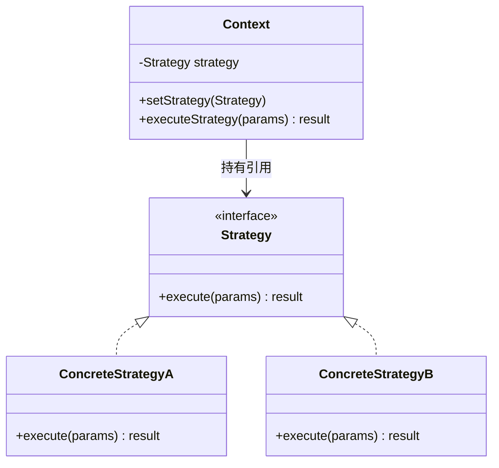

---
title: "策略模式详解"
description: "消除 if-else 地狱，支付方式选择实战，Spring 中的策略模式详解应用"
date: 2023-08-26T12:18:06+08:00
lastmod: 2023-08-26T12:18:06+08:00
weight: 4
tags:
  - 设计模式
  - Java
categories:
  - 行为型模式
  - 技术分享
math:  true
mermaid: true
photos:
  - https://images.unsplash.com/photo-1485846234645-a62644f84728?w=1920&q=80
---

## 模式定义

策略模式（Strategy Pattern）定义了一系列算法，将每一个算法封装起来，并使它们可以互相替换。策略模式让算法的变化不会影响到使用算法的客户端。

> **GoF 定义**：定义一系列算法，把它们一个个封装起来，并且使它们可相互替换。本模式使得算法可独立于使用它的客户端而变化。

通俗地说：**策略模式就是用多态替代 if-else**。

### 类图



## 问题引入：if-else 地狱

假设我们要实现一个支付系统，支持微信、支付宝、银行卡三种支付方式：

```java
// 反面教材：臃肿的 if-else
public class PaymentService {
    public void pay(String type, BigDecimal amount) {
        if ("wechat".equals(type)) {
            System.out.println("调用微信支付 API，金额：" + amount);
            // 微信支付逻辑...
        } else if ("alipay".equals(type)) {
            System.out.println("调用支付宝支付 API，金额：" + amount);
            // 支付宝逻辑...
        } else if ("bankcard".equals(type)) {
            System.out.println("调用银行卡支付接口，金额：" + amount);
            // 银行卡逻辑...
        } else {
            throw new IllegalArgumentException("不支持的支付方式: " + type);
        }
    }
}
```

问题显而易见：
1. 每新增一种支付方式，都要修改 `PaymentService`，违反开闭原则
2. 所有支付逻辑堆在一起，类越来越臃肿
3. 无法单独测试某种支付方式

## 策略模式重构

### 第一步：定义策略接口

```java
public interface PaymentStrategy {
    /**
     * 执行支付
     */
    boolean pay(BigDecimal amount);

    /**
     * 获取策略标识，用于策略工厂注册
     */
    String getType();
}
```

### 第二步：实现具体策略

```java
@Component("wechatPay")
public class WeChatPayStrategy implements PaymentStrategy {
    @Override
    public boolean pay(BigDecimal amount) {
        System.out.println("调用微信支付 API，金额：" + amount);
        // 调用微信支付 SDK...
        return true;
    }

    @Override
    public String getType() {
        return "wechat";
    }
}

@Component("aliPay")
public class AliPayStrategy implements PaymentStrategy {
    @Override
    public boolean pay(BigDecimal amount) {
        System.out.println("调用支付宝支付 API，金额：" + amount);
        // 调用支付宝 SDK...
        return true;
    }

    @Override
    public String getType() {
        return "alipay";
    }
}

@Component("bankCardPay")
public class BankCardPayStrategy implements PaymentStrategy {
    @Override
    public boolean pay(BigDecimal amount) {
        System.out.println("调用银行卡支付接口，金额：" + amount);
        // 调用银行接口...
        return true;
    }

    @Override
    public String getType() {
        return "bankcard";
    }
}
```

### 第三步：创建上下文 + 策略工厂

```java
@Service
public class PaymentContext {

    // 使用 Map 存储所有策略，Spring 自动注入
    private final Map<String, PaymentStrategy> strategyMap;

    // Spring 会自动将所有 PaymentStrategy 实现注入到 List 中
    public PaymentContext(List<PaymentStrategy> strategies) {
        this.strategyMap = strategies.stream()
                .collect(Collectors.toMap(
                        PaymentStrategy::getType,
                        Function.identity()
                ));
    }

    public boolean pay(String payType, BigDecimal amount) {
        PaymentStrategy strategy = strategyMap.get(payType);
        if (strategy == null) {
            throw new IllegalArgumentException("不支持的支付方式: " + payType);
        }
        return strategy.pay(amount);
    }
}
```

### 客户端调用

```java
@RestController
@RequestMapping("/order")
public class OrderController {

    @Autowired
    private PaymentContext paymentContext;

    @PostMapping("/pay")
    public Result pay(@RequestParam String payType, @RequestParam BigDecimal amount) {
        boolean success = paymentContext.pay(payType, amount);
        return success ? Result.success("支付成功") : Result.fail("支付失败");
    }
}
```

**对比重构前后**：新增支付方式时，只需要新增一个实现 `PaymentStrategy` 的类，**无需修改任何已有代码**，完全符合开闭原则。

## Spring 中的策略模式应用

### 方式一：利用 Spring 依赖注入自动注册策略

上面的例子已经展示了最优雅的方式——利用 Spring 的 `List<Interface>` 自动注入，无需手动维护策略注册表。

### 方式二：通过 @Qualifier / Bean 名称

```java
@Service
public class PaymentContext implements ApplicationContextAware {

    private Map<String, PaymentStrategy> strategyMap;

    @Override
    public void setApplicationContext(ApplicationContext ctx) {
        // 获取所有 PaymentStrategy 类型的 Bean
        strategyMap = ctx.getBeansOfType(PaymentStrategy.class);
    }

    public PaymentStrategy getStrategy(String beanName) {
        return strategyMap.get(beanName);
    }
}
```

### Spring 源码中的策略模式

```java
// Resource 接口就是策略模式的体现
// 同一个 getResource()，根据路径返回不同策略
Resource resource = resourceLoader.getResource("classpath:config.xml");  // ClassPathResource
Resource resource2 = resourceLoader.getResource("file:///etc/config");  // FileUrlResource
Resource resource3 = resourceLoader.getResource("https://example.com"); // UrlResource
```

## 进阶：策略模式 + 工厂模式 + 单例

在更复杂的场景中，可以将策略模式与工厂模式结合，并使用枚举定义策略类型：

```java
// 策略类型枚举
public enum PayType {
    WECHAT("wechat"),
    ALIPAY("alipay"),
    BANKCARD("bankcard");

    private final String code;
    PayType(String code) { this.code = code; }
    public String getCode() { return code; }
}

// 策略工厂（结合策略 + 工厂）
public class PaymentStrategyFactory {
    private static final Map<String, PaymentStrategy> STRATEGY_MAP = new ConcurrentHashMap<>();

    // 注册策略
    public static void register(String type, PaymentStrategy strategy) {
        STRATEGY_MAP.put(type, strategy);
    }

    // 获取策略
    public static PaymentStrategy getStrategy(String type) {
        PaymentStrategy strategy = STRATEGY_MAP.get(type);
        if (strategy == null) {
            throw new IllegalArgumentException("未找到支付策略: " + type);
        }
        return strategy;
    }
}
```

## 适用场景

1. **消除多重条件判断**：系统中有多种行为根据条件选择执行
2. **多种算法可互换**：排序策略、压缩策略、加密策略
3. **支付/折扣/促销**：电商系统中不同的促销规则
4. **路由/分发**：消息路由、请求分发
5. **权限控制**：不同的权限校验策略

## 优缺点

### 优点

1. **开闭原则**：新增策略无需修改已有代码
2. **消除 if-else**：代码结构清晰，可维护性强
3. **算法可替换**：运行时动态切换策略
4. **易于测试**：每个策略可独立测试

### 缺点

1. **类数量增多**：每个策略一个类
2. **客户端需了解策略**：客户端需要知道有哪些策略可选
3. **策略选择逻辑**：仍需在某个地方决定使用哪种策略

## 策略模式 vs 状态模式

这两个模式结构几乎一模一样（都是"接口 + 多个实现 + Context"），但意图完全不同：

| 维度 | 策略模式 | 状态模式 |
|------|---------|---------|
| 意图 | 客户端**主动选择**算法 | 对象**内部状态**驱动行为变化 |
| 切换者 | 由客户端设置 | 由状态自身自动切换 |
| 关注点 | "做什么"不同 | "状态"不同导致行为不同 |
| 示例 | 选择支付方式 | 订单状态机（待付款→已付款→已发货） |

## 实战案例

### Comparator——JDK 中的策略模式

```java
// Comparator 就是典型的策略接口
List<User> users = getUsers();

// 策略一：按年龄排序
users.sort(Comparator.comparingInt(User::getAge));

// 策略二：按姓名排序
users.sort(Comparator.comparing(User::getName));

// 同一个 sort 方法，传入不同的策略实现不同的排序逻辑
```

### Spring 的 InstantiationStrategy

```java
// Spring 用两种策略来实例化 Bean
// SimpleInstantiationStrategy —— 通过反射调用构造方法
// CglibSubclassingInstantiationStrategy —— 通过 CGLIB 生成子类
```

### ThreadPoolExecutor 的拒绝策略

```java
// 四种拒绝策略就是策略模式的体现
new ThreadPoolExecutor(
    corePoolSize, maxPoolSize, keepAliveTime, TimeUnit.SECONDS,
    workQueue,
    new ThreadPoolExecutor.CallerRunsPolicy() // 拒绝策略
);
// AbortPolicy（默认）、CallerRunsPolicy、DiscardPolicy、DiscardOldestPolicy
```

## 总结

策略模式是日常开发中最实用的设计模式之一。它的核心价值在于：

1. **用多态代替条件分支**，让代码更清晰
2. **新增行为不修改老代码**，符合开闭原则
3. **结合 Spring 依赖注入**，实现策略的自动注册与发现

当你的代码中出现一长串的 if-else，且每个分支都在做相似的事情时，就是策略模式登场的信号。
