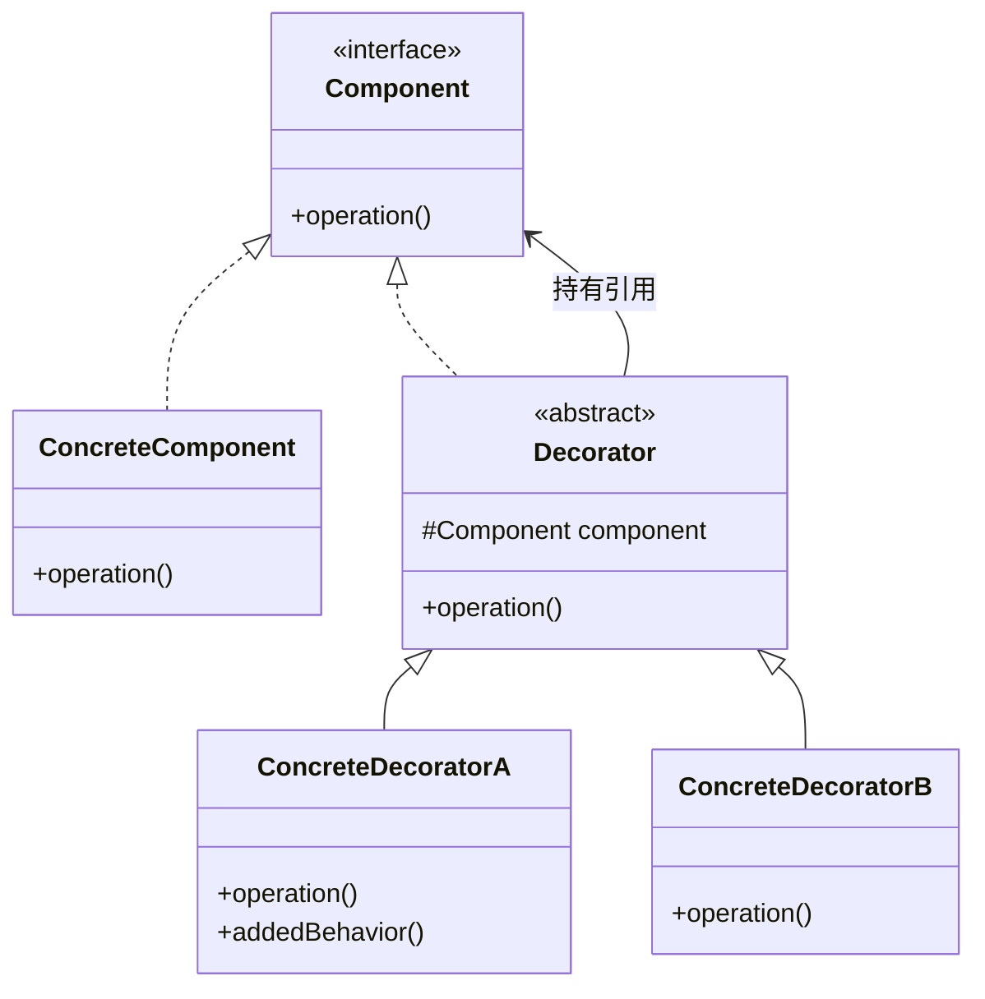
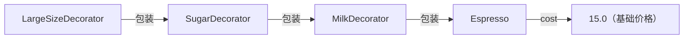
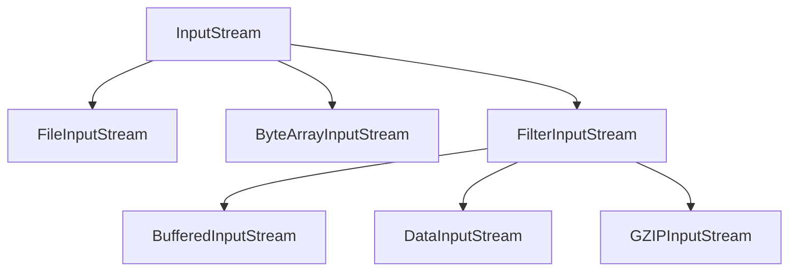

## 模式定义

装饰器模式（Decorator Pattern）动态地给一个对象添加一些额外的职责，就增加功能而言，装饰器模式比生成子类（继承）更加灵活。

> **GoF 定义**：动态地给一个对象添加一些额外的职责。就增加功能来说，装饰器模式相比生成子类更为灵活。

通俗地说：**装饰器模式就是用"包装"的方式给对象增加新功能，而不改变原有对象**。就像给手机套上手机壳、贴上贴纸，手机本身没有变，但功能增强了。

### 类图



### 核心特征

- 装饰器和被装饰对象**实现同一个接口**
- 装饰器**持有**被装饰对象的引用
- 装饰器在调用被装饰对象方法的前后，**添加自己的行为**

## 手写装饰器模式

### 经典示例：咖啡配料系统

```java
// 抽象组件：饮品
public interface Beverage {
    String getDescription();
    double cost();
}

// 具体组件：基础咖啡
public class Espresso implements Beverage {
    @Override
    public String getDescription() {
        return "浓缩咖啡";
    }

    @Override
    public double cost() {
        return 15.0;
    }
}

public class Decaf implements Beverage {
    @Override
    public String getDescription() {
        return "无咖啡因咖啡";
    }

    @Override
    public double cost() {
        return 18.0;
    }
}

// 抽象装饰器
public abstract class CondimentDecorator implements Beverage {
    protected Beverage beverage;  // 被装饰的对象

    public CondimentDecorator(Beverage beverage) {
        this.beverage = beverage;
    }

    @Override
    public String getDescription() {
        return beverage.getDescription();  // 默认委托给被装饰对象
    }
}

// 具体装饰器：牛奶
public class MilkDecorator extends CondimentDecorator {
    public MilkDecorator(Beverage beverage) {
        super(beverage);
    }

    @Override
    public String getDescription() {
        return beverage.getDescription() + " + 牛奶";
    }

    @Override
    public double cost() {
        return beverage.cost() + 3.0;  // 在原有价格上增加
    }
}

// 具体装饰器：糖
public class SugarDecorator extends CondimentDecorator {
    public SugarDecorator(Beverage beverage) {
        super(beverage);
    }

    @Override
    public String getDescription() {
        return beverage.getDescription() + " + 糖";
    }

    @Override
    public double cost() {
        return beverage.cost() + 1.0;
    }
}

// 具体装饰器：大杯
public class LargeSizeDecorator extends CondimentDecorator {
    public LargeSizeDecorator(Beverage beverage) {
        super(beverage);
    }

    @Override
    public String getDescription() {
        return beverage.getDescription() + "（大杯）";
    }

    @Override
    public double cost() {
        return beverage.cost() * 1.3;
    }
}
```

### 客户端：自由组合

```java
public class Client {
    public static void main(String[] args) {
        // 一杯浓缩咖啡
        Beverage coffee1 = new Espresso();
        System.out.println(coffee1.getDescription() + " → ¥" + coffee1.cost());

        // 浓缩咖啡 + 牛奶
        Beverage coffee2 = new MilkDecorator(new Espresso());
        System.out.println(coffee2.getDescription() + " → ¥" + coffee2.cost());

        // 浓缩咖啡 + 牛奶 + 糖 + 大杯（层层嵌套）
        Beverage coffee3 = new LargeSizeDecorator(
                new SugarDecorator(
                        new MilkDecorator(
                                new Espresso())));
        System.out.println(coffee3.getDescription() + " → ¥" + String.format("%.2f", coffee3.cost()));
    }
}
```

输出：
```
浓缩咖啡 → ¥15.0
浓缩咖啡 + 牛奶 → ¥18.0
浓缩咖啡 + 牛奶 + 糖（大杯） → ¥24.70
```

### 嵌套结构示意图



## Java IO 流：装饰器模式的经典应用

Java IO 流的设计是装饰器模式最经典的案例：



```java
// 层层装饰，功能逐步增强
InputStream input = new FileInputStream("data.txt");           // 基础：读文件
input = new BufferedInputStream(input);                         // 增强：加缓冲区
input = new GZIPInputStream(input);                             // 增强：GZIP 解压

// 还可以继续包装
Reader reader = new InputStreamReader(input, "UTF-8");         // 转为字符流
BufferedReader br = new BufferedReader(reader);                 // 增加按行读取

String line;
while ((line = br.readLine()) != null) {
    System.out.println(line);
}
```

**每一层装饰器都添加了新功能**：
- `FileInputStream`：从文件读取字节
- `BufferedInputStream`：添加缓冲区，减少 IO 次数
- `GZIPInputStream`：添加 GZIP 解压功能
- `InputStreamReader`：字节流转字符流
- `BufferedReader`：添加按行读取功能

## 装饰器 vs 继承

| 维度 | 继承 | 装饰器 |
|------|------|--------|
| 扩展方式 | 编译时静态确定 | 运行时动态组合 |
| 灵活性 | 低（类爆炸） | 高（自由组合） |
| 多功能组合 | N 个功能需要 $2^N$ 个子类 | N 个装饰器自由组合 |
| 修改原类 | 是（通过子类覆盖） | 否（不改变原对象） |

例如，咖啡有 4 种配料（牛奶、糖、大杯、奶油），用继承需要 $2^4 = 16$ 个子类，而装饰器只需 4 个装饰器类即可任意组合。

## 适用场景

1. **功能增强**：在不修改原有类的前提下增加功能
2. **动态组合**：需要运行时灵活组合多种功能
3. **IO 处理**：Java IO 流的经典设计
4. **缓存增强**：给数据访问层添加缓存
5. **日志/权限**：给业务方法添加日志或权限检查

## 优缺点

### 优点

1. **开闭原则**：扩展功能不修改原有代码
2. **灵活组合**：多个装饰器可以自由搭配
3. **替代继承**：避免类爆炸问题
4. **单一职责**：每个装饰器只负责一种增强

### 缺点

1. **对象增多**：多层装饰会产生很多小对象
2. **调试困难**：嵌套层次深时，排查问题需要逐层追踪
3. **顺序依赖**：装饰器的顺序可能影响结果（如先加缓冲还是先解压）
4. **初始化繁琐**：多层嵌套的构造代码可读性差

## 装饰器模式 vs 代理模式

装饰器模式和代理模式的结构几乎一模一样（都是"实现同一接口 + 持有引用"），但意图截然不同：

| 维度 | 装饰器模式 | 代理模式 |
|------|-----------|---------|
| **意图** | 增强/添加功能 | 控制访问 |
| **关注点** | "怎么做更多" | "能不能做" |
| **对象创建** | 客户端创建并传入 | 代理内部创建或持有 |
| **使用者** | 客户端知道在装饰 | 客户端以为在用真实对象 |
| **典型场景** | IO 流增强 | 远程代理、延迟加载、权限控制 |

> 经验法则：**装饰器关注"加功能"，代理关注"加控制"**。

## 实战案例

### Spring 的 BeanWrapper

```java
// Spring 的 BeanWrapper 对 Bean 进行功能增强
BeanWrapper wrapper = new BeanWrapperImpl(new User());
wrapper.setPropertyValue("name", "张三");  // 增强了属性设置功能
```

### Spring Cache

```java
// 给方法添加缓存，本质是装饰
@Cacheable(value = "users", key = "#id")
public User findById(Long id) {
    return userRepository.findById(id);  // 原始查询被缓存装饰
}
```

### Servlet API 的 HttpServletRequestWrapper

```java
// 装饰 HttpServletRequest，添加自定义功能
public class XssRequestWrapper extends HttpServletRequestWrapper {
    public XssRequestWrapper(HttpServletRequest request) {
        super(request);
    }

    @Override
    public String getParameter(String name) {
        String value = super.getParameter(name);
        return value != null ? cleanXss(value) : null;  // 增强：过滤 XSS
    }

    private String cleanXss(String value) {
        return value.replaceAll("<script>", "")
                     .replaceAll("</script>", "");
    }
}

// 在过滤器中使用
public class XssFilter implements Filter {
    @Override
    public void doFilter(ServletRequest req, ServletResponse res, FilterChain chain) {
        chain.doFilter(new XssRequestWrapper((HttpServletRequest) req), res);
    }
}
```

### Collections.synchronizedList

```java
// 将非线程安全的 List 装饰为线程安全的
List<String> syncList = Collections.synchronizedList(new ArrayList<>());
// SynchronizedList 持有原 List 的引用，在每个方法上加 synchronized
```

## 总结

装饰器模式的核心价值在于：

> **通过"包装"而非"继承"来扩展功能，让功能可以自由组合。**

当我们需要给一个对象动态添加多种功能，且这些功能可以自由组合时，装饰器模式就是最佳选择。Java IO 流的设计完美诠释了这一思想——`FileInputStream` + `BufferedInputStream` + `DataInputStream` 的层层包装，让 IO 功能既丰富又灵活。

记住装饰器的口诀：**同接口、持引用、加行为**。
