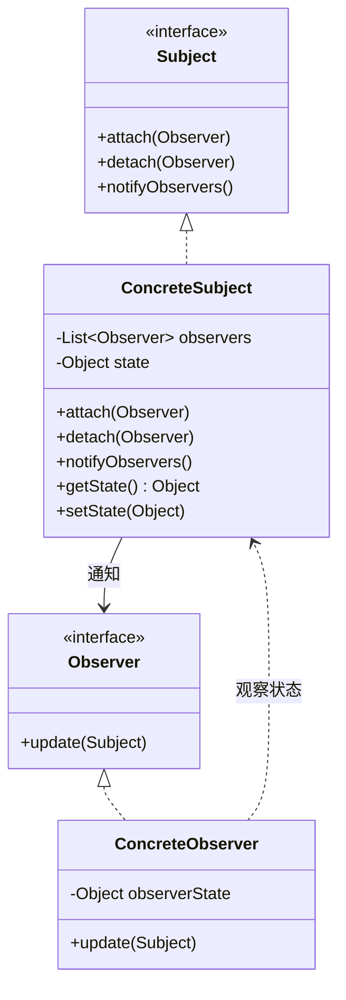
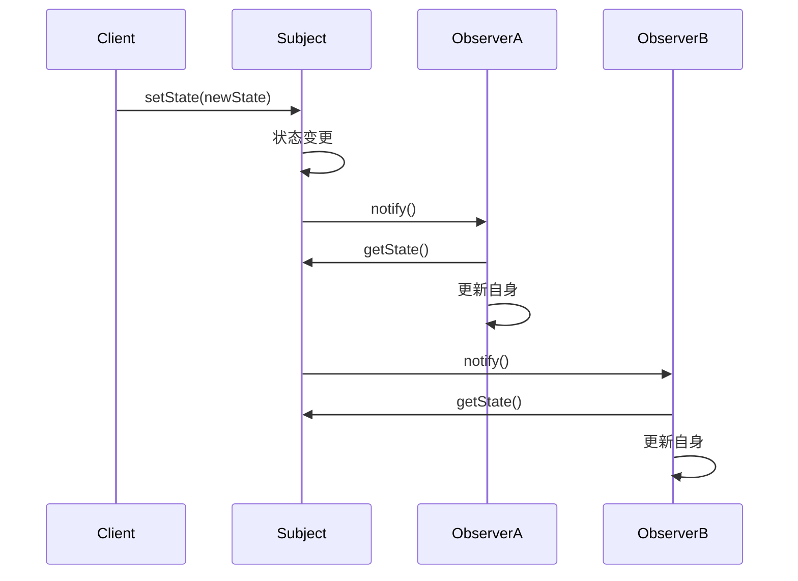
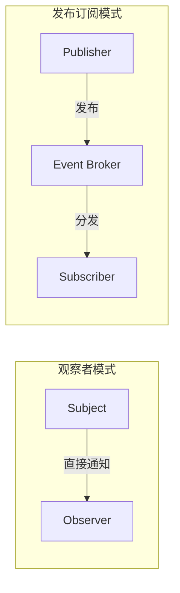

## 模式定义

观察者模式（Observer Pattern）定义了对象之间的一对多依赖关系，当一个对象的状态发生变化时，所有依赖于它的对象都会得到通知并自动更新。

> **GoF 定义**：定义对象间的一种一对多的依赖关系，以便当一个对象的状态发生改变时，所有依赖于它的对象都得到通知并自动更新。

观察者模式又称**发布-订阅模式**（Publish-Subscribe）、**模型-视图模式**（Model-View）。

### 类图



### 时序图



## 手写观察者模式

### 基础实现

```java
// 观察者接口
public interface Observer {
    void update(String event, Object data);
}

// 主题（被观察者）
public class Subject {
    private final List<Observer> observers = new ArrayList<>();
    private String state;

    // 注册观察者
    public void attach(Observer observer) {
        observers.add(observer);
    }

    // 移除观察者
    public void detach(Observer observer) {
        observers.remove(observer);
    }

    // 通知所有观察者
    public void notifyObservers() {
        for (Observer observer : observers) {
            observer.update("STATE_CHANGE", state);
        }
    }

    public String getState() {
        return state;
    }

    public void setState(String state) {
        this.state = state;
        System.out.println("主题状态变更为：" + state);
        notifyObservers(); // 状态变更后自动通知
    }
}

// 具体观察者
public class EmailNotifier implements Observer {
    @Override
    public void update(String event, Object data) {
        System.out.println("[邮件通知] 收到状态变更：" + data);
    }
}

public class SmsNotifier implements Observer {
    @Override
    public void update(String event, Object data) {
        System.out.println("[短信通知] 收到状态变更：" + data);
    }
}

// 客户端
public class Client {
    public static void main(String[] args) {
        Subject subject = new Subject();
        subject.attach(new EmailNotifier());
        subject.attach(new SmsNotifier());
        subject.setState("订单已支付"); // 自动通知所有观察者
    }
}
// 输出：
// 主题状态变更为：订单已支付
// [邮件通知] 收到状态变更：订单已支付
// [短信通知] 收到状态变更：订单已支付
```

## Java 内置观察者模式（已废弃）

Java 早期在 `java.util` 中提供了 `Observable` 类和 `Observer` 接口，但存在诸多设计缺陷（如 `Observable` 是类而非接口，且非线程安全），在 **Java 9 中已被废弃**。推荐使用更现代的事件驱动框架。

## Spring 事件机制（推荐）

Spring 提供了一套完善的事件驱动机制，是观察者模式在企业级开发中的最佳实践。

### 核心组件

| 组件 | 说明 |
|------|------|
| `ApplicationEvent` | 事件基类 |
| `ApplicationListener` | 观察者接口（事件监听器） |
| `ApplicationEventPublisher` | 主题（事件发布者） |
| `@EventListener` | 注解式监听器（更简洁） |

### 完整示例：订单事件驱动

#### 第一步：定义事件

```java
// 自定义事件
public class OrderCreatedEvent extends ApplicationEvent {
    private final String orderId;
    private final String userId;
    private final BigDecimal amount;

    public OrderCreatedEvent(Object source, String orderId, String userId, BigDecimal amount) {
        super(source);
        this.orderId = orderId;
        this.userId = userId;
        this.amount = amount;
    }

    // getter 省略
    public String getOrderId() { return orderId; }
    public String getUserId() { return userId; }
    public BigDecimal getAmount() { return amount; }
}
```

#### 第二步：发布事件（主题）

```java
@Service
public class OrderService {

    @Autowired
    private ApplicationEventPublisher eventPublisher;

    public void createOrder(OrderDTO orderDTO) {
        // 1. 创建订单
        Order order = saveOrder(orderDTO);
        System.out.println("订单创建成功：" + order.getId());

        // 2. 发布事件，通知所有监听者（解耦核心逻辑与副作用）
        eventPublisher.publishEvent(
            new OrderCreatedEvent(this, order.getId(), order.getUserId(), order.getAmount())
        );
    }
}
```

#### 第三步：监听事件（观察者）

```java
// 方式一：注解方式（推荐）
@Component
public class OrderEventListener {

    @EventListener
    public void handleOrderCreated(OrderCreatedEvent event) {
        System.out.println("[积分服务] 为用户 " + event.getUserId() + " 增加积分");
    }

    @EventListener
    public void sendEmail(OrderCreatedEvent event) {
        System.out.println("[邮件服务] 发送订单确认邮件，订单号：" + event.getOrderId());
    }

    @EventListener
    public void sendSms(OrderCreatedEvent event) {
        System.out.println("[短信服务] 发送订单通知短信");
    }

    @EventListener
    public void pushToMQ(OrderCreatedEvent event) {
        System.out.println("[消息队列] 推送订单到 MQ 进行异步处理");
    }
}
```

### 异步事件处理

默认情况下 Spring 事件是**同步**的（发布者阻塞等待所有监听器执行完毕）。要实现异步：

```java
// 配置异步支持
@Configuration
@EnableAsync
public class AsyncConfig {
    @Bean("eventExecutor")
    public Executor eventExecutor() {
        ThreadPoolTaskExecutor executor = new ThreadPoolTaskExecutor();
        executor.setCorePoolSize(2);
        executor.setMaxPoolSize(5);
        executor.setQueueCapacity(100);
        executor.setThreadNamePrefix("event-");
        return executor;
    }
}

// 在监听器上使用 @Async
@Component
public class AsyncOrderListener {

    @Async("eventExecutor")
    @EventListener
    public void handleOrder(OrderCreatedEvent event) {
        // 异步执行，不阻塞主流程
        System.out.println("异步处理订单：" + event.getOrderId()
            + "，线程：" + Thread.currentThread().getName());
    }
}
```

### 条件监听

```java
// 只监听金额大于 1000 的大额订单
@EventListener(condition = "#event.amount > 1000")
public void handleLargeOrder(OrderCreatedEvent event) {
    System.out.println("[大额订单告警] 金额：" + event.getAmount());
}
```

## Push 模式 vs Pull 模式

| 模式 | 说明 | 优点 | 缺点 |
|------|------|------|------|
| **推模式**（Push） | 主题将数据主动推给观察者 | 观察者无需主动查询 | 可能推送观察者不需要的数据 |
| **拉模式**（Pull） | 主题只发通知，观察者自行拉取数据 | 观察者按需获取 | 需要多次方法调用 |

Spring 事件机制默认使用**推模式**（将 Event 对象推给监听器）。

## 适用场景

1. **事件驱动系统**：订单创建后触发积分、通知、物流等
2. **消息广播**：配置变更通知所有节点刷新
3. **GUI 系统**：按钮点击、文本变化等 UI 事件
4. **数据同步**：主数据变更同步到缓存、搜索引擎
5. **日志审计**：业务操作记录审计日志

## 优缺点

### 优点

1. **解耦**：主题与观察者松耦合，互不感知
2. **开闭原则**：新增观察者无需修改主题
3. **广播通信**：一次状态变更通知多个对象

### 缺点

1. **性能问题**：观察者过多或处理过慢会影响主题
2. **循环依赖**：观察者之间可能形成循环通知
3. **执行顺序不确定**：多个观察者的执行顺序不可控
4. **内存泄漏风险**：忘记取消注册会导致观察者无法被 GC

## 实战案例

### Guava EventBus

```java
// Guava 提供了更简洁的事件总线
EventBus eventBus = new EventBus();

// 注册订阅者
eventBus.register(new Object() {
    @Subscribe
    public void handle(String message) {
        System.out.println("收到消息：" + message);
    }
});

// 发布事件
eventBus.post("Hello EventBus");
```

### Spring ApplicationListener 接口方式

```java
@Component
public class StartupListener implements ApplicationListener<ContextRefreshedEvent> {
    @Override
    public void onApplicationEvent(ContextRefreshedEvent event) {
        System.out.println("Spring 容器启动完成！");
    }
}
```

### Redis 的 Pub/Sub

```java
// 发布者
redisTemplate.convertAndSend("orderChannel", "订单已创建");

// 订阅者
@Component
public class OrderSubscriber extends MessageListenerAdapter {
    @Override
    public void onMessage(Message message, byte[] pattern) {
        System.out.println("收到 Redis 消息：" + message);
    }
}
```

## 观察者模式 vs 发布-订阅模式

严格来说，两者有细微区别：



| 维度 | 观察者模式 | 发布-订阅模式 |
|------|-----------|-------------|
| 耦合 | Subject 直接持有 Observer 引用 | 通过中间件（Broker）解耦 |
| 通信 | 同步 | 通常异步 |
| 跨进程 | 不支持 | 支持（如 Kafka、RabbitMQ） |

## 总结

观察者模式是构建**事件驱动架构**（EDA）的基石。通过 Spring 事件机制，我们可以轻松实现业务逻辑与副作用的解耦：

- 订单服务只管创建订单
- 积分、通知、物流各自监听事件，互不干扰
- 新增副作用（如风控检查）只需新增一个监听器

**关键原则：核心业务逻辑与衍生操作通过事件解耦，让系统更灵活、更易扩展**。
