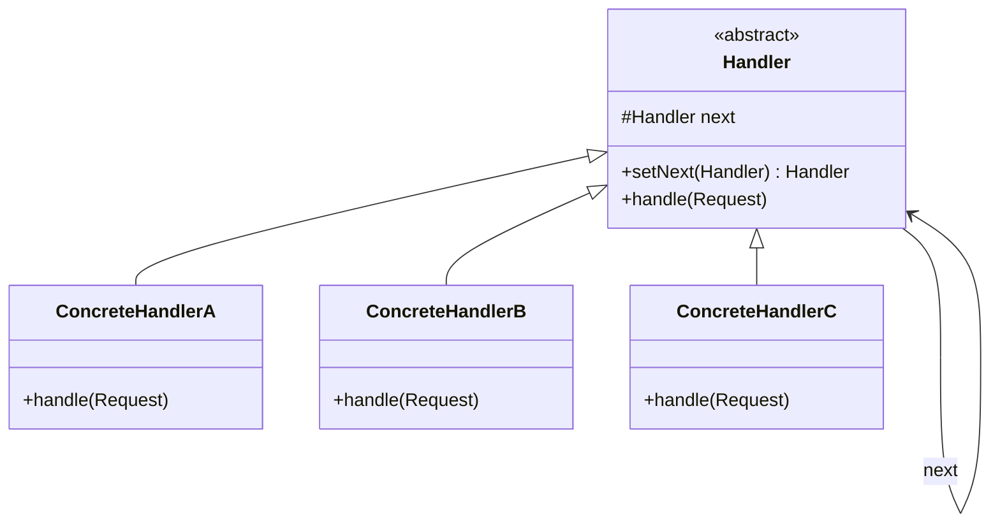
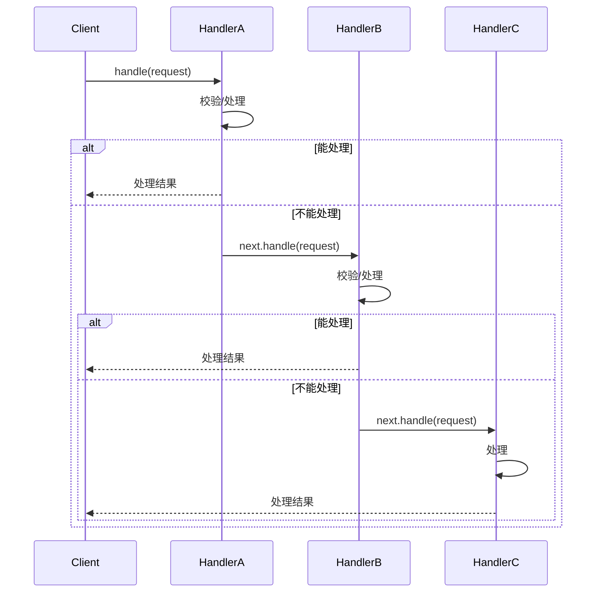

---
title: "责任链模式详解"
description: "审批流程、过滤器链、Spring 拦截器中的责任链应用"
date: 2023-11-09T22:53:20+08:00
lastmod: 2023-11-09T22:53:20+08:00
weight: 6
tags:
  - 设计模式
  - Java
categories:
  - 行为型模式
  - 技术分享
math:  true
mermaid: true
photos:
  - https://images.unsplash.com/photo-1504384308090-c894fdcc538d?w=1920&q=80
---

## 模式定义

责任链模式（Chain of Responsibility Pattern）为请求创建一个接收者对象的链。每个接收者都包含对另一个接收者的引用，如果一个对象不能处理该请求，它就会把请求传递给链中的下一个接收者，依此类推。

> **GoF 定义**：使多个对象都有机会处理请求，从而避免请求的发送者和接收者之间的耦合关系。将这些对象连成一条链，并沿着这条链传递请求，直到有一个对象处理它为止。

### 类图



### 请求流转时序图



## 手写责任链模式

### 基础实现

```java
// 抽象处理器
public abstract class Handler {
    protected Handler next;

    // 返回 this 以支持链式调用
    public Handler setNext(Handler next) {
        this.next = next;
        return next;
    }

    // 处理请求
    public abstract void handle(Request request);

    // 传递给下一个处理器
    protected void passToNext(Request request) {
        if (next != null) {
            next.handle(request);
        }
    }
}

// 请求数据
public class Request {
    private String name;
    private int days;  // 请假天数
    private String reason;

    // getter/setter 省略
    public Request(String name, int days, String reason) {
        this.name = name;
        this.days = days;
        this.reason = reason;
    }
    public String getName() { return name; }
    public int getDays() { return days; }
    public String getReason() { return reason; }
}
```

### 实战案例：请假审批流程

```java
// 组长：处理 1 天以内
public class TeamLeaderHandler extends Handler {
    @Override
    public void handle(Request request) {
        if (request.getDays() <= 1) {
            System.out.println("组长审批通过：" + request.getName()
                + " 请假 " + request.getDays() + " 天");
        } else {
            System.out.println("组长：超出权限，转交部门经理");
            passToNext(request);
        }
    }
}

// 部门经理：处理 3 天以内
public class ManagerHandler extends Handler {
    @Override
    public void handle(Request request) {
        if (request.getDays() <= 3) {
            System.out.println("经理审批通过：" + request.getName()
                + " 请假 " + request.getDays() + " 天");
        } else {
            System.out.println("经理：超出权限，转交总经理");
            passToNext(request);
        }
    }
}

// 总经理：处理 7 天以内
public class DirectorHandler extends Handler {
    @Override
    public void handle(Request request) {
        if (request.getDays() <= 7) {
            System.out.println("总经理审批通过：" + request.getName()
                + " 请假 " + request.getDays() + " 天");
        } else {
            System.out.println("总经理：请假天数过多，需 HR 特批");
            passToNext(request);
        }
    }
}

// HR：最终处理
public class HrHandler extends Handler {
    @Override
    public void handle(Request request) {
        System.out.println("HR 记录备案：" + request.getName()
            + " 请假 " + request.getDays() + " 天，原因：" + request.getReason());
    }
}
```

### 组装责任链

```java
public class Client {
    public static void main(String[] args) {
        // 构建责任链
        Handler chain = new TeamLeaderHandler();
        chain.setNext(new ManagerHandler())
             .setNext(new DirectorHandler())
             .setNext(new HrHandler());

        // 发起请求
        System.out.println("=== 请假 1 天 ===");
        chain.handle(new Request("张三", 1, "身体不适"));

        System.out.println("\n=== 请假 5 天 ===");
        chain.handle(new Request("李四", 5, "家中有事"));

        System.out.println("\n=== 请假 15 天 ===");
        chain.handle(new Request("王五", 15, "婚假"));
    }
}
```

输出：
```
=== 请假 1 天 ===
组长审批通过：张三 请假 1 天

=== 请假 5 天 ===
组长：超出权限，转交部门经理
经理：超出权限，转交总经理
总经理审批通过：李四 请假 5 天

=== 请假 15 天 ===
组长：超出权限，转交部门经理
经理：超出权限，转交总经理
总经理：请假天数过多，需 HR 特批
HR 记录备案：王五 请假 15 天，原因：婚假
```

## 变体：纯责任链 vs 不纯责任链

| 类型 | 说明 |
|------|------|
| **纯责任链** | 每个处理器要么完整处理请求后返回，要么传给下一个。一个请求只被一个处理器处理 |
| **不纯责任链** | 每个处理器处理一部分，然后继续传递。如过滤器链——每个过滤器都执行，然后传给下一个 |

## 不纯责任链：请求过滤器

```java
// 过滤器接口
public interface Filter {
    void doFilter(Request request, Response response, FilterChain chain);
}

// 过滤器链
public class FilterChain {
    private final List<Filter> filters = new ArrayList<>();
    private int index = 0;

    public FilterChain addFilter(Filter filter) {
        filters.add(filter);
        return this;
    }

    public void doFilter(Request request, Response response) {
        if (index == filters.size()) {
            return; // 所有过滤器执行完毕
        }
        Filter filter = filters.get(index);
        index++;
        filter.doFilter(request, response, this);
    }
}

// 具体过滤器
public class AuthFilter implements Filter {
    @Override
    public void doFilter(Request request, Response response, FilterChain chain) {
        System.out.println("[认证过滤器] 检查用户身份");
        if (request.getToken() == null) {
            response.setError("未认证");
            return; // 短路：不调用 chain.doFilter()，链条终止
        }
        chain.doFilter(request, response); // 放行到下一个过滤器
        System.out.println("[认证过滤器] 后置处理");
    }
}

public class LogFilter implements Filter {
    @Override
    public void doFilter(Request request, Response response, FilterChain chain) {
        long start = System.currentTimeMillis();
        System.out.println("[日志过滤器] 记录请求开始");
        chain.doFilter(request, response);
        System.out.println("[日志过滤器] 请求耗时：" + (System.currentTimeMillis() - start) + "ms");
    }
}

public class RateLimitFilter implements Filter {
    @Override
    public void doFilter(Request request, Response response, FilterChain chain) {
        System.out.println("[限流过滤器] 检查请求频率");
        chain.doFilter(request, response);
    }
}
```

## Spring 中的责任链模式

### Spring MVC HandlerInterceptor

```java
public class AuthInterceptor implements HandlerInterceptor {
    @Override
    public boolean preHandle(HttpServletRequest request,
                             HttpServletResponse response, Object handler) {
        String token = request.getHeader("Authorization");
        if (token == null) {
            response.setStatus(401);
            return false; // 中断链条
        }
        return true; // 继续执行下一个拦截器
    }
}

// 注册拦截器
@Configuration
public class WebConfig implements WebMvcConfigurer {
    @Override
    public void addInterceptors(InterceptorRegistry registry) {
        registry.addInterceptor(new AuthInterceptor())
                .addPathPatterns("/api/**")
                .order(1);
        registry.addInterceptor(new LogInterceptor())
                .addPathPatterns("/api/**")
                .order(2);
    }
}
```

### Spring Security FilterChain

```java
// Spring Security 的核心就是一条过滤器链
@Configuration
@EnableWebSecurity
public class SecurityConfig {
    @Bean
    public SecurityFilterChain filterChain(HttpSecurity http) throws Exception {
        http
            .addFilterBefore(new JwtAuthFilter(), UsernamePasswordAuthenticationFilter.class)
            .addFilterBefore(new RateLimitFilter(), JwtAuthFilter.class)
            .authorizeHttpRequests(auth -> auth.anyRequest().authenticated());
        return http.build();
    }
}
```

执行顺序：`RateLimitFilter → JwtAuthFilter → UsernamePasswordAuthenticationFilter → ...`

### Spring Cloud Gateway 过滤器

```java
@Component
public class CustomGlobalFilter implements GlobalFilter, Ordered {
    @Override
    public Mono<Void> filter(ServerWebExchange exchange, GatewayFilterChain chain) {
        // 前置处理
        System.out.println("请求进入网关");
        return chain.filter(exchange)  // 传递给下一个过滤器
                .then(Mono.fromRunnable(() -> {
                    // 后置处理
                    System.out.println("请求处理完成");
                }));
    }

    @Override
    public int getOrder() {
        return -1; // 优先级，数字越小越先执行
    }
}
```

## 适用场景

1. **审批流程**：多级审批（组长→经理→总监→CEO）
2. **请求过滤**：认证、鉴权、日志、限流、CORS 等多个过滤器串联
3. **异常处理**：不同类型的异常由不同的 Handler 处理
4. **数据校验**：多个校验规则按顺序执行
5. **工作流引擎**：Activiti、Camunda 中的流程节点

## 优缺点

### 优点

1. **解耦**：发送者无需知道哪个接收者会处理请求
2. **开闭原则**：新增/删除处理器不影响其他处理器
3. **灵活组合**：可动态调整链的顺序和组成
4. **职责单一**：每个处理器只关注自己的职责

### 缺点

1. **请求可能无人处理**：如果链的末端没有兜底处理器，请求可能被丢弃
2. **性能损耗**：请求可能遍历整条链
3. **调试困难**：链条较长时，排查问题需要跟踪整个调用链
4. **循环引用风险**：错误配置可能导致死循环

## 责任链模式 vs 策略模式

| 维度 | 责任链模式 | 策略模式 |
|------|-----------|---------|
| 执行方式 | 沿链条传递，直到被处理 | 根据条件选择一个策略执行 |
| 处理者数量 | 可能多个处理器都参与处理 | 只有一个策略被执行 |
| 关注点 | "谁来处理" | "用什么方式处理" |
| 典型场景 | 过滤器链、审批流 | 支付方式选择、排序算法 |

## 实战案例

### Netty 的 ChannelPipeline

```java
// Netty 的 Pipeline 就是一条责任链
ChannelPipeline pipeline = ch.pipeline();
pipeline.addLast("decoder", new StringDecoder());
pipeline.addLast("encoder", new StringEncoder());
pipeline.addLast("businessHandler", new BusinessHandler());
// 数据依次经过每个 Handler 处理
```

### Dubbo 的 Filter 链

```java
// Dubbo 的调用过程也是一条过滤器链
// Consumer 端: Filter1 → Filter2 → ... → Invoker
// Provider 端: Filter1 → Filter2 → ... → Invoker
```

### Apache Chain / Commons Chain

```java
// Apache 提供的责任链框架
Command process = new ProcessSaleCommand();
Command verify = new VerifyCustomerCommand();
ChainBase chain = new ChainBase();
chain.addCommand(verify);
chain.addCommand(process);
chain.execute(context);
```

## 总结

责任链模式在 Web 开发中无处不在——从 Servlet Filter 到 Spring Interceptor，从 Spring Security FilterChain 到网关过滤器，都是责任链思想的应用。

掌握责任链模式的关键在于理解两个核心：
1. **每个处理器持有下一个处理器的引用**（链条的连接）
2. **处理器决定是处理请求还是传递下去**（流程的控制）

当你面对"多个处理步骤按顺序执行，且步骤可灵活增减"的场景时，责任链模式就是最佳选择。
