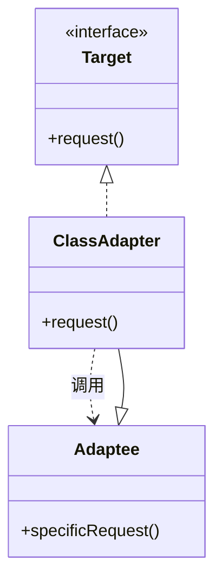
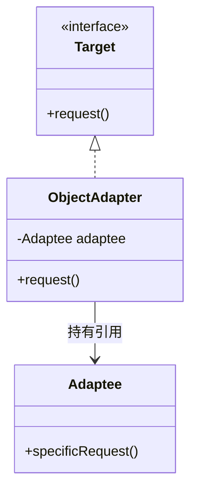

## 模式定义

适配器模式（Adapter Pattern）将一个类的接口转换成客户端期望的另一个接口。适配器模式让原本接口不兼容的类可以一起工作。

> **GoF 定义**：将一个类的接口转换成客户希望的另外一个接口。适配器模式使得原本由于接口不兼容而不能一起工作的那些类可以一起工作。

通俗地说：**适配器模式就是"转接头"**。就像 Type-C 转 USB 的转换器，让旧设备能连上新接口。

### 类图

#### 类适配器（通过继承实现）



#### 对象适配器（通过组合实现）



## 两种实现方式

### 一、类适配器（Class Adapter）

类适配器通过**继承**被适配类并实现目标接口：

```java
// 目标接口（客户端期望的接口）
public interface Target {
    void request();
}

// 被适配者（已有类，接口不兼容）
public class Adaptee {
    public void specificRequest() {
        System.out.println("被适配者的特殊方法被调用");
    }
}

// 类适配器：继承 Adaptee + 实现 Target
public class ClassAdapter extends Adaptee implements Target {
    @Override
    public void request() {
        // 将 Target.request() 转换为 Adaptee.specificRequest()
        super.specificRequest();
    }
}

// 客户端
public class Client {
    public static void main(String[] args) {
        Target target = new ClassAdapter();
        target.request(); // 客户端调用 request()，实际执行 specificRequest()
    }
}
```

**限制**：Java 不支持多重继承，如果 Target 是类而非接口，类适配器将无法使用。

### 二、对象适配器（Object Adapter）—— 推荐

对象适配器通过**组合**被适配对象：

```java
// 对象适配器：实现 Target + 持有 Adaptee 引用
public class ObjectAdapter implements Target {
    private final Adaptee adaptee;

    public ObjectAdapter(Adaptee adaptee) {
        this.adaptee = adaptee;
    }

    @Override
    public void request() {
        adaptee.specificRequest(); // 委托给被适配对象
    }
}

// 客户端
public class Client {
    public static void main(String[] args) {
        Adaptee adaptee = new Adaptee();
        Target target = new ObjectAdapter(adaptee);
        target.request();
    }
}
```

### 两种方式对比

| 维度 | 类适配器 | 对象适配器 |
|------|---------|-----------|
| 实现方式 | 继承 Adaptee | 组合 Adaptee |
| 灵活性 | 低（Java 单继承限制） | 高（推荐使用） |
| 适配子类 | 可以直接继承覆盖 | 需要传入不同实例 |
| 设计原则 | 违背合成复用原则 | 符合合成复用原则 |

> **结论：优先使用对象适配器**，它更灵活、更符合"多用组合少用继承"的设计原则。

## 实战案例

### 案例一：日志框架适配

系统中已有自定义日志接口，但想切换到 Log4j2：

```java
// 目标接口：系统定义的日志接口
public interface LogService {
    void debug(String message);
    void info(String message);
    void error(String message, Throwable t);
}

// 被适配者：Log4j2 的 Logger（接口不兼容）
import org.apache.logging.log4j.Logger;
import org.apache.logging.log4j.LogManager;

// 适配器：将 Log4j2 适配为系统日志接口
public class Log4j2Adapter implements LogService {
    private final Logger logger;

    public Log4j2Adapter(String name) {
        this.logger = LogManager.getLogger(name);
    }

    @Override
    public void debug(String message) {
        logger.debug(message);
    }

    @Override
    public void info(String message) {
        logger.info(message);
    }

    @Override
    public void error(String message, Throwable t) {
        logger.error(message, t);
    }
}

// 使用：系统代码无需修改，只需切换适配器实现
LogService log = new Log4j2Adapter("MyApp");
log.info("系统启动成功");
```

### 案例二：支付网关适配

对接第三方支付系统，各家接口不同：

```java
// 统一支付接口（目标接口）
public interface PaymentGateway {
    PaymentResult pay(PaymentRequest request);
    PaymentResult refund(String orderId, BigDecimal amount);
}

// 被适配者 A：微信支付 SDK（接口不兼容）
public class WeChatPayClient {
    public WeChatPayResponse doUnifiedPay(WeChatPayRequest request) {
        // 微信支付逻辑...
        return new WeChatPayResponse("SUCCESS", "wx_" + request.getOutTradeNo());
    }
}

// 被适配者 B：支付宝 SDK
public class AlipayClient {
    public AlipayResult tradePay(AlipayParam param) {
        // 支付宝逻辑...
        return new AlipayResult("success", "ali_" + param.getTradeNo());
    }
}

// 微信支付适配器
public class WeChatPayAdapter implements PaymentGateway {
    private final WeChatPayClient client = new WeChatPayClient();

    @Override
    public PaymentResult pay(PaymentRequest request) {
        // 转换参数
        WeChatPayRequest wxRequest = new WeChatPayRequest();
        wxRequest.setOutTradeNo(request.getOrderId());
        wxRequest.setTotalFee(request.getAmount());

        // 调用被适配者
        WeChatPayResponse response = client.doUnifiedPay(wxRequest);

        // 转换结果
        return new PaymentResult(
            "SUCCESS".equals(response.getCode()),
            response.getTransactionId()
        );
    }

    @Override
    public PaymentResult refund(String orderId, BigDecimal amount) {
        // ...
        return null;
    }
}

// 支付宝适配器
public class AlipayAdapter implements PaymentGateway {
    private final AlipayClient client = new AlipayClient();

    @Override
    public PaymentResult pay(PaymentRequest request) {
        AlipayParam param = new AlipayParam();
        param.setTradeNo(request.getOrderId());
        param.setAmount(request.getAmount());
        AlipayResult result = client.tradePay(param);
        return new PaymentResult("success".equals(result.getStatus()), result.getTradeNo());
    }

    @Override
    public PaymentResult refund(String orderId, BigDecimal amount) {
        // ...
        return null;
    }
}

// 客户端：面向统一接口编程，不关心底层实现
public class OrderService {
    private PaymentGateway gateway;

    public void setGateway(PaymentGateway gateway) {
        this.gateway = gateway;
    }

    public void processPayment(PaymentRequest request) {
        PaymentResult result = gateway.pay(request);
        // 统一处理支付结果
    }
}
```

### 案例三：默认适配器（接口适配器）

当一个接口有很多方法，而实现类只需要其中几个时，可以使用**默认适配器**（抽象类提供空实现）：

```java
// 大接口：有很多方法
public interface LifecycleListener {
    void onStart();
    void onStop();
    void onPause();
    void onResume();
    void onDestroy();
}

// 默认适配器：所有方法提供空实现
public abstract class LifecycleAdapter implements LifecycleListener {
    @Override public void onStart() {}
    @Override public void onStop() {}
    @Override public void onPause() {}
    @Override public void onResume() {}
    @Override public void onDestroy() {}
}

// 只关心 onStart 和 onDestroy，其他不用实现
public class MyListener extends LifecycleAdapter {
    @Override
    public void onStart() {
        System.out.println("应用启动");
    }

    @Override
    public void onDestroy() {
        System.out.println("应用销毁");
    }
    // 不需要实现 onPause/onResume/onStop
}
```

## 适用场景

1. **接口不兼容**：已有类的接口与系统要求的接口不匹配
2. **第三方库适配**：封装第三方 SDK，统一接口
3. **遗留系统集成**：旧系统接口适配到新架构
4. **接口瘦身**：大接口只需要部分方法时使用默认适配器
5. **多数据源/多支付**：统一不同实现的调用方式

## 优缺点

### 优点

1. **开闭原则**：不修改原有类，通过适配器接入
2. **解耦**：客户端与被适配者通过适配器间接关联
3. **复用性**：让不兼容的类重新发挥作用
4. **灵活性**：可以为被适配者创建多个适配器

### 缺点

1. **增加复杂度**：多了适配器类，系统类数量增加
2. **过度使用**：如果可以直接重构接口，不应滥用适配器
3. **性能损耗**：多了一层方法调用

## 实战案例

### JDK 中的适配器

```java
// InputStreamReader：字节流 → 字符流的适配器
InputStream is = new FileInputStream("file.txt");  // 字节流
Reader reader = new InputStreamReader(is, "UTF-8");  // 适配为字符流

// OutputStreamWriter：字符流 → 字节流的适配器
Writer writer = new OutputStreamWriter(new FileOutputStream("out.txt"), "UTF-8");

// Arrays.asList()：数组 → List 的适配器
List<String> list = Arrays.asList("a", "b", "c");

// Collections.enumeration()：Collection → Enumeration 的适配器
Enumeration<String> e = Collections.enumeration(new ArrayList<>());
```

### Spring MVC 的 HandlerAdapter

```java
// Spring MVC 用适配器模式支持多种处理器类型
// Controller、HttpRequestHandler、HandlerMethod 等接口各不相同
// HandlerAdapter 将它们统一适配为可执行的处理器
public interface HandlerAdapter {
    boolean supports(Object handler);
    ModelAndView handle(HttpServletRequest req,
                        HttpServletResponse resp, Object handler);
}

// RequestMappingHandlerAdapter 适配 @RequestMapping 方法
// SimpleControllerHandlerAdapter 适配 Controller 接口
// HttpRequestHandlerAdapter 适配 HttpRequestHandler 接口
```

### Spring AOP 的 AdvisorAdapter

```java
// Spring AOP 将不同类型的 Advice 适配为统一的拦截器
// MethodBeforeAdviceAdapter → 将 BeforeAdvice 适配为拦截器
// AfterReturningAdviceAdapter → 将 AfterAdvice 适配为拦截器
// ThrowsAdviceAdapter → 将 ThrowsAdvice 适配为拦截器
```

## 适配器模式 vs 装饰器模式 vs 代理模式 vs 外观模式

这四种结构型模式容易混淆，关键在于**意图**：

| 模式 | 意图 | 类比 |
|------|------|------|
| **适配器** | 转换接口，让不兼容的类协作 | Type-C 转 USB 转接头 |
| **装饰器** | 增强功能，不改接口 | 给手机加保护壳 |
| **代理** | 控制访问，不改接口 | 明星经纪人 |
| **外观** | 简化接口，提供一个统一入口 | 一键启动按钮 |

> 判断技巧：
> - 接口**变了** → 适配器
> - 功能**多了** → 装饰器
> - 访问**受限** → 代理
> - 接口**简化了** → 外观

## 总结

适配器模式是**解决接口不兼容问题**的利器。在系统集成、第三方对接、遗留代码迁移等场景中，适配器模式让我们无需修改原有代码就能接入新系统。

核心思想：**不改变已有的类，通过中间层转换接口**。

在 Java 中，优先使用**对象适配器**（组合优于继承），这样既能适配类也能适配接口，更加灵活。
