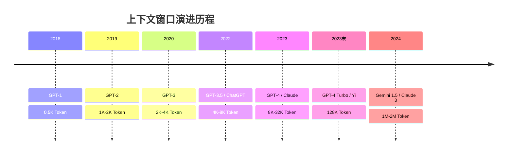
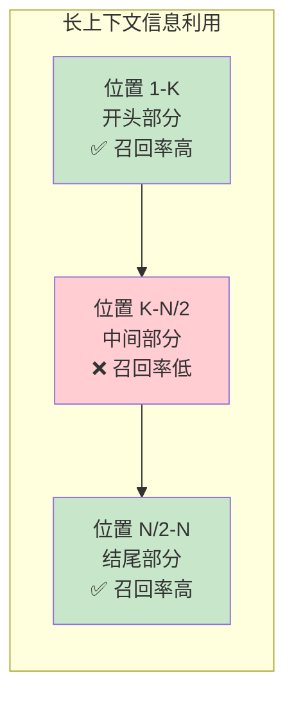
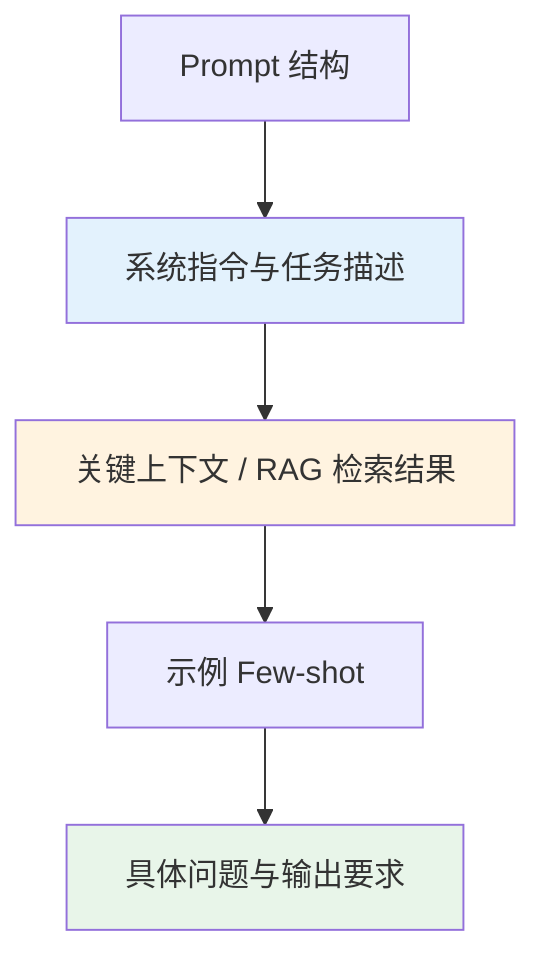
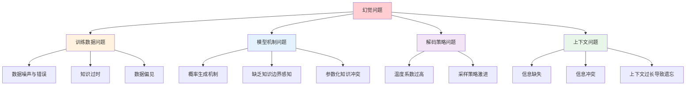
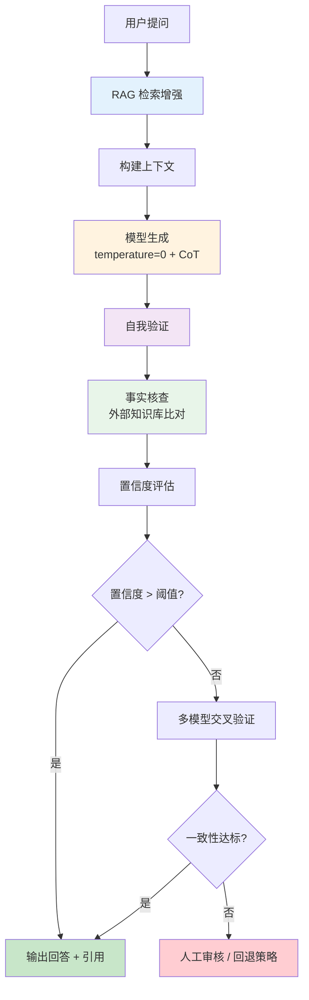
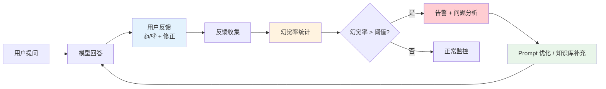

## 引言

大语言模型（LLM）的能力边界，在很大程度上由三个基础但至关重要的因素共同决定：**上下文窗口**决定了模型一次能"看到"多少信息，**Token** 是模型处理文本的最小单位且直接关系到推理成本，而**幻觉（Hallucination）**则是模型"一本正经地胡说八道"的顽疾，是 LLM 落地应用的核心障碍。

这三者并非孤立存在。上下文窗口的扩大让模型能够处理更长的输入，但也带来了注意力稀释与"中间遗忘"问题，反而可能加剧幻觉；Token 计算的效率影响着长上下文的可行性，低效的 Token 化会白白消耗宝贵的上下文空间；而对幻觉的系统性缓解，又往往需要依赖更大的上下文窗口来承载外部知识。

本文将从上下文窗口的机制出发，深入解析 Token 与 Tokenization 的原理，系统性地探讨幻觉问题的成因、检测与缓解策略，并给出构建低幻觉应用的工程实践。

## 上下文窗口（Context Window）

### 什么是上下文窗口

上下文窗口（Context Window）是指大语言模型在单次推理过程中能够处理的最大 Token 序列长度，包括输入（Prompt）和输出（Generation）两部分。它本质上是模型注意力机制能够"同时关注"的信息容量上限。

用形式化的语言描述，若模型的上下文窗口为 $N$，则对于输入序列 $\mathbf{x} = (x_1, x_2, \dots, x_n)$ 和生成的输出序列 $\mathbf{y} = (y_1, y_2, \dots, y_m)$，必须满足：

$$
n + m \leq N
$$

上下文窗口的意义体现在以下几个方面：

1. **信息承载力**：决定了模型能一次性处理的文档长度、对话轮数和任务复杂度
2. **推理能力**：更长的上下文允许更多的推理步骤（如 CoT 链），有助于复杂任务
3. **应用边界**：直接决定了 RAG 能检索多少文档、Agent 能保留多少历史记忆
4. **成本约束**：上下文越长，计算成本越高，对 KV Cache 的压力越大

#### 主流模型上下文窗口对比

| 模型 | 上下文窗口 | 发布方 | 注意力机制 | 备注 |
|------|-----------|--------|-----------|------|
| GPT-4o | 128K | OpenAI | 稀疏注意力 | 输出上限 16K |
| Claude 3.5 Sonnet | 200K | Anthropic | 滑动窗口 + 全局 | 长文本召回优秀 |
| Qwen2.5 | 128K | 阿里通义 | GQA + RoPE | 支持 1M 扩展 |
| Llama 3.1 | 128K | Meta | GQA + RoPE | 开源标杆 |
| Gemini 1.5 Pro | 2M | Google | 混合注意力 | 业界最长 |
| Mistral Large 2 | 128K | Mistral AI | 滑动窗口 + GQA | 高效推理 |

可以看到，128K 已成为当前主流模型的"标配"上下文长度，而 Gemini 1.5 Pro 以 2M Token 的窗口将边界推向了新的高度。

### 上下文窗口的技术演进

大语言模型的上下文窗口在过去几年经历了爆发式增长：



从 GPT-1 的 512 Token 到 Gemini 1.5 Pro 的 200 万 Token，上下文窗口在 6 年间增长了约 4000 倍。这一增长背后是多项关键技术的突破。

### 长上下文技术

#### 位置编码扩展

Transformer 架构本身对序列长度没有固有的上限，但模型在训练时只见过有限长度的序列，直接外推到更长序列会导致性能急剧下降。位置编码扩展技术的目标就是让模型在训练长度之外仍能保持性能。

**RoPE（Rotary Position Embedding，旋转位置编码）** 是目前最主流的位置编码方案。其核心思想是通过旋转矩阵将位置信息编码到 Query 和 Key 向量中：

$$
\begin{pmatrix} q_m' \\ q_{m+d}' \end{pmatrix} = \begin{pmatrix} \cos m\theta & -\sin m\theta \\ \sin m\theta & \cos m\theta \end{pmatrix} \begin{pmatrix} q_m \\ q_{m+d} \end{pmatrix}
$$

其中 $m$ 是位置索引，$\theta_i = 10000^{-2i/d}$ 是频率参数。RoPE 的优美之处在于：两个位置 $m$ 和 $n$ 的注意力分数只取决于它们的相对距离 $m - n$，天然具备相对位置编码的特性。

**位置插值（Position Interpolation, PI）** 是最简单的扩展方法，通过将位置索引缩放到训练范围内：

$$
m' = \frac{m \cdot L_{train}}{L_{target}}
$$

其中 $L_{train}$ 是训练时的最大长度，$L_{target}$ 是目标长度。该方法简单有效，但会损失短距离位置的分辨率。

**NTK-aware Scaling** 通过调整 RoPE 的频率基数来适应更长序列：

$$
\theta_i' = \theta_i \cdot s^{2i/d}, \quad s = \frac{L_{target}}{L_{train}}
$$

该方法对不同频率维度进行差异化缩放，低频维度（捕捉长距离）被大幅缩放，高频维度（捕捉短距离）几乎不变，从而在保持短距离性能的同时扩展长距离能力。

**YaRN（Yet another RoPE extensioN）** 在 NTK-aware 的基础上进一步引入分段插值策略，对不同频率范围采用不同的缩放因子，是目前效果最好的 RoPE 扩展方法之一。

| 方法 | 核心思路 | 优点 | 缺点 |
|------|---------|------|------|
| 直接外推 | 直接使用训练外的位置 | 无需额外训练 | 性能急剧下降 |
| 位置插值（PI） | 线性缩放位置索引 | 简单易实现 | 短距离分辨率损失 |
| NTK-aware | 调整频率基数 | 短距离性能好 | 长距离仍需微调 |
| YaRN | 分段差异化缩放 | 效果最佳 | 实现较复杂 |

#### 注意力优化

标准自注意力的计算复杂度为 $O(n^2)$，当序列长度达到 128K 时，计算和内存开销将变得不可接受。以下技术使长上下文在工程上成为可能：

**稀疏注意力（Sparse Attention）** 只计算部分 Query-Key 对的注意力分数，将复杂度降低到 $O(n\sqrt{n})$ 或 $O(n)$。常见的稀疏模式包括局部窗口、跨步（strided）和随机连接等。

**滑动窗口注意力（Sliding Window Attention）** 限制每个 Token 只关注前后 $w$ 个 Token，复杂度降为 $O(n \cdot w)$。通过堆叠多层，感受野可以指数级扩展：$L$ 层的等效感受野为 $L \times w$。Mistral 系列模型采用了这一方案。

**分组查询注意力（GQA, Grouped-Query Attention）** 将多个 Query 头共享同一组 Key/Value 头，在几乎不损失性能的前提下大幅减少 KV Cache 的内存占用，是长上下文场景的标配技术。

**Ring Attention** 将长序列切分到多个设备上，通过环形通信实现跨设备的注意力计算，使单设备无法容纳的超长序列（如 1M+ Token）成为可能。

#### KV Cache 管理

在自回归生成中，每生成一个新 Token 都需要对之前所有 Token 计算 Attention。为了避免重复计算，模型将每层的 Key 和 Value 缓存起来，这就是 **KV Cache**。

KV Cache 的内存占用与序列长度成正比。对于隐藏维度 $d$、层数 $L$、序列长度 $n$ 的模型，KV Cache 的内存占用为：

$$
\text{Memory}_{KV} = 2 \times n \times L \times d \times \text{size\_of(dtype)}
$$

以 Llama 3.1 70B（$L=80, d=8192$）为例，128K 上下文的 KV Cache 仅 fp16 就需要约 320 GB，远超单卡显存。因此，**PagedAttention**（将 KV Cache 分页管理，类似操作系统的虚拟内存）、**KV Cache 量化**（将 fp16 压缩为 int8/int4）和 **KV Cache 驱逐**（基于注意力分数淘汰不重要的 Token）等技术应运而生。

### 长上下文的挑战

#### "Lost in the Middle" 问题

拥有超长上下文并不意味着模型能同等有效地利用其中的所有信息。Liu 等人的研究揭示了一个普遍存在的现象：**模型对位于上下文开头和结尾的信息利用效果远好于中间部分**，这被称为"Lost in the Middle"问题。



实验表明，当关键信息被放置在长上下文的中间位置时，模型的回答准确率可能下降 20%-30%。这一现象的成因与注意力分布有关：模型倾向于将更高的注意力权重分配给序列的开头（首 Token 偏置）和结尾（recency bias），而中间位置的信号容易被"稀释"。

#### 注意力稀释

在标准注意力机制中，所有 Key 共享同一个 Query 的注意力预算（softmax 归一化后总和为 1）。当上下文长度增加时，注意力被分配到更多的 Token 上，每个 Token 获得的平均注意力权重下降：

$$
\bar{\alpha} = \frac{1}{n} \sum_{i=1}^{n} \alpha_i \approx \frac{1}{n}
$$

这意味着真正重要的信息可能被大量无关信息"淹没"。研究表明，当上下文中填充大量无关内容时，即使关键信息存在，模型的召回率也会显著下降。

#### 实验数据说明

在一项经典的多文档问答实验中，研究者在 20 篇文档中放置了包含答案的文档，并改变其位置：

| 答案文档位置 | 模型准确率 | 说明 |
|-------------|-----------|------|
| 开头（第 1 篇） | ~75% | 接近短上下文基线 |
| 中间（第 10 篇） | ~55% | 显著下降 |
| 结尾（第 20 篇） | ~72% | 接近开头性能 |

这组数据清晰地展示了位置对信息利用效率的影响，也直接指导了实践中的 Prompt 结构设计。

### 上下文窗口的有效利用

#### Prompt 结构优化

基于"Lost in the Middle"现象，Prompt 的信息排布应遵循以下原则：



1. **首因效应利用**：将最重要的指令和系统级 Prompt 放在最前面
2. **近因效应利用**：将具体问题和输出要求放在最后面
3. **中间保护**：避免将关键信息放在上下文正中间，或通过重复强调来对抗稀释
4. **结构化标记**：使用清晰的分隔符（如 `---`、XML 标签）帮助模型定位信息

#### 信息密度与位置安排

长上下文中并非信息越多越好。研究表明，**高信息密度的精简 Prompt 往往优于冗长但松散的 Prompt**，因为前者减少了噪声对注意力的干扰。

实践建议：

- RAG 检索结果按相关性降序排列，最相关的放在末尾（近问题处）
- 对长文档进行摘要压缩，保留高密度信息
- 使用结构化格式（表格、列表、JSON）提高信息密度
- 对关键信息进行适当重复或强调

## Token 与 Tokenization

### 什么是 Token

Token 是大语言模型处理文本的最小单位。模型并不直接理解字符或单词，而是将文本切分为一系列 Token，每个 Token 对应词表中的一个整数 ID。

文本的表示层次可以分为三级：

| 层次 | 单位 | 示例（"hello world"） | 特点 |
|------|------|----------------------|------|
| 词级（Word） | 完整单词 | ["hello", "world"] | 词表过大，OOV 问题严重 |
| 子词级（Subword） | 词的部分 | ["hello", "world"] 或 ["hel", "lo", "wor", "ld"] | 平衡词表大小和序列长度 |
| 字符级（Character） | 单个字符 | ["h","e","l","l","o"," ","w",...] | 词表极小，但序列过长 |

现代大语言模型普遍采用**子词级 Tokenization**，它在词表大小和序列长度之间取得了良好的平衡：常见词保持完整，罕见词被拆分为有意义的子词。

### Tokenization 方法

#### BPE（Byte Pair Encoding）

BPE 最初是一种数据压缩算法，由 Sennrich 等人在 2016 年引入神经机器翻译领域。其核心思想是从字符级开始，迭代地合并最高频的相邻 Token 对，直到达到预设的词表大小。

BPE 的优点是词表可控、对未见词（OOV）鲁棒性强，已成为 GPT 系列、LLaMA 系列等主流模型的标准选择。

#### WordPiece

WordPiece 与 BPE 类似，但合并标准不同：BPE 选择频率最高的相邻对，而 WordPiece 选择使语言模型似然概率最大化的相邻对。BERT 系列模型使用了这一方法。

合并的评分函数为：

$$
\text{score}(A, B) = \frac{P(AB)}{P(A) \cdot P(B)}
$$

#### SentencePiece

SentencePiece 是 Google 开源的 Tokenization 工具库，它将文本视为原始字节流，不依赖空格分词，因此特别适合中文、日文等无空格分隔的语言。它支持 BPE 和 Unigram 两种算法，T5、LLaMA 等模型采用了这一方案。

#### Tiktoken

Tiktoken 是 OpenAI 开发的高效 BPE 分词器，用于 GPT-3.5/GPT-4 等模型。它以字节级 BPE 为基础，支持多语言，且速度极快（C++ 实现，Python 绑定）。

| 方法 | 合并标准 | 词表大小 | 语言支持 | 代表模型 |
|------|---------|---------|---------|---------|
| BPE | 频率最高 | 30K-100K | 依赖预处理 | GPT-2/3/4, LLaMA |
| WordPiece | 似然最大化 | 30K | 依赖空格分词 | BERT, DistilBERT |
| SentencePiece (BPE) | 频率最高 | 32K-128K | 原生多语言 | T5, LLaMA, Qwen |
| SentencePiece (Unigram) | 概率最大 | 32K-128K | 原生多语言 | XLNet, ALBERT |
| Tiktoken | 频率最高 | 100K | 字节级，多语言 | GPT-3.5/4o |

### BPE 算法详解

BPE 算法的训练过程可以概括为以下步骤：

1. 将所有训练文本预处理为字符序列，并在词尾添加特殊标记 `</w>`
2. 统计所有相邻字符对的频率
3. 选择频率最高的字符对，合并为新 Token
4. 更新词表和频率统计
5. 重复步骤 2-4，直到词表达到目标大小

以下是一个简化的 BPE 实现：

```python
import re
from collections import Counter, defaultdict

def get_word_freqs(text):
    """将文本拆分为词并统计频率，词尾添加 </w> 标记"""
    words = re.findall(r'\S+', text)
    word_freqs = Counter(words)
    # 将每个词转为字符元组，末尾加 </w>
    return {tuple(w) + ('</w>',): f for w, f in word_freqs.items()}

def get_pair_freqs(word_freqs):
    """统计所有相邻 Token 对的频率"""
    pair_freqs = Counter()
    for word, freq in word_freqs.items():
        for i in range(len(word) - 1):
            pair_freqs[(word[i], word[i + 1])] += freq
    return pair_freqs

def merge_pair(pair, word_freqs):
    """合并指定的 Token 对"""
    new_word_freqs = {}
    bigram = re.escape(' '.join(pair))
    pattern = re.compile(r'(?<!\S)' + bigram + r'(?!\S)')
    for word, freq in word_freqs.items():
        word_str = ' '.join(word)
        word_str = pattern.sub(''.join(pair), word_str)
        new_word_freqs[tuple(word_str.split())] = freq
    return new_word_freqs

def train_bpe(text, vocab_size=100):
    """训练 BPE，返回词表和合并规则"""
    word_freqs = get_word_freqs(text)
    merges = []
    # 初始词表：所有单字符 + </w>
    vocab = set()
    for word in word_freqs:
        vocab.update(word)
    
    while len(vocab) < vocab_size:
        pair_freqs = get_pair_freqs(word_freqs)
        if not pair_freqs:
            break
        # 选择频率最高的 Token 对
        best_pair = max(pair_freqs, key=pair_freqs.get)
        word_freqs = merge_pair(best_pair, word_freqs)
        merges.append(best_pair)
        vocab.add(''.join(best_pair))
    
    return sorted(vocab), merges

# 示例：在小语料上训练 BPE
corpus = "low lower newest widest low lower newest widest low lower newest widest"
vocab, merges = train_bpe(corpus, vocab_size=50)

print("合并规则（按顺序）:")
for i, (a, b) in enumerate(merges, 1):
    print(f"  {i}. {a} + {b} -> {a + b}")
print(f"\n最终词表 ({len(vocab)} tokens): {vocab}")
```

上述代码展示了 BPE 的核心逻辑。在实际的 LLM 训练中，BPE 在数十 GB 的语料上训练，产生数万到十万级别的词表。GPT-4 的 Tiktoken 词表大小为 100,256，LLaMA 3 的词表为 128,256。

### Token 计算实践

#### 不同语言的 Token 效率

Token 效率是指表达相同语义内容所需的 Token 数量。由于大多数模型的词表以英文为主，非英文语言的 Token 效率通常较低。

| 语言 | 示例文本 | 字符数 | Token 数（GPT-4） | Token/字符 | 相对英文效率 |
|------|---------|-------|------------------|-----------|-------------|
| 英文 | "The quick brown fox" | 19 | 4 | 0.21 | 1.00× |
| 中文 | "敏捷的棕色狐狸" | 7 | 6 | 0.86 | ~0.25× |
| 日文 | "素早い茶色の狐" | 7 | 7 | 1.00 | ~0.21× |
| 韩文 | "빠른 갈색 여우" | 7 | 8 | 1.14 | ~0.18× |
| 代码 | "def hello(): return" | 19 | 6 | 0.32 | ~0.66× |

可以看到，中文的 Token 效率约为英文的 1/4，这意味着同样的内容，中文需要约 4 倍的 Token 来表达。这不仅增加了 API 调用成本，也更快地消耗上下文窗口。这也是为什么 Qwen、DeepSeek 等国产模型会专门扩大中文 Token 的词表比例。

#### 用 Tiktoken 计算 Token

```python
import tiktoken

# 加载 GPT-4o 的编码器
enc = tiktoken.encoding_for_model("gpt-4o")

# 编码文本
text_en = "The quick brown fox jumps over the lazy dog."
text_zh = "敏捷的棕色狐狸跳过了那只懒狗。"

tokens_en = enc.encode(text_en)
tokens_zh = enc.encode(text_zh)

print(f"英文: {len(text_en)} 字符 -> {len(tokens_en)} tokens")
print(f"  Token IDs: {tokens_en}")
print(f"  解码还原: {enc.decode(tokens_en)}")
print()
print(f"中文: {len(text_zh)} 字符 -> {len(tokens_zh)} tokens")
print(f"  Token IDs: {tokens_zh}")
print(f"  解码还原: {enc.decode(tokens_zh)}")
print()

# 估算对话 Token 消耗
def estimate_tokens(messages, model="gpt-4o"):
    """估算多轮对话的总 Token 数"""
    encoding = tiktoken.encoding_for_model(model)
    tokens_per_message = 3  # 每条消息的固定开销
    tokens_per_conversation = 3  # 对话级别的固定开销
    total = tokens_per_conversation
    for msg in messages:
        total += tokens_per_message
        for key, value in msg.items():
            total += len(encoding.encode(value))
    return total

messages = [
    {"role": "system", "content": "你是一个有帮助的助手。"},
    {"role": "user", "content": "请解释什么是大语言模型的上下文窗口。"},
    {"role": "assistant", "content": "上下文窗口是大语言模型在单次推理中能处理的最大Token序列长度..."},
]
print(f"对话总 Token 估算: {estimate_tokens(messages)}")
```

#### Token 计算对成本的影响

API 调用的成本直接与 Token 数量挂钩：

$$
\text{Cost} = N_{input} \times P_{input} + N_{output} \times P_{output}
$$

其中 $N_{input}$ 和 $N_{output}$ 分别是输入和输出的 Token 数，$P_{input}$ 和 $P_{output}$ 是对应的单价。

| 模型 | 输入价格 ($/1M Token) | 输出价格 ($/1M Token) | 上下文窗口 |
|------|---------------------|----------------------|-----------|
| GPT-4o | $5.00 | $15.00 | 128K |
| GPT-4o-mini | $0.15 | $0.60 | 128K |
| Claude 3.5 Sonnet | $3.00 | $15.00 | 200K |
| Claude 3 Haiku | $0.25 | $1.25 | 200K |
| Qwen-Plus | $0.40 | $1.20 | 128K |
| DeepSeek-V3 | $0.14 | $0.28 | 128K |

以一个日均处理 10 万次请求、每次平均输入 2000 Token、输出 500 Token 的应用为例，使用 GPT-4o 的月成本约为：

$$
\text{Cost}_{month} = 30 \times 100000 \times (2000 \times 5 + 500 \times 15) \times 10^{-6} = \$42,750
$$

而切换到 GPT-4o-mini 后：

$$
\text{Cost}_{month}^{mini} = 30 \times 100000 \times (2000 \times 0.15 + 500 \times 0.60) \times 10^{-6} = \$1,800
$$

成本相差近 24 倍。因此，在满足质量要求的前提下选择合适的模型、优化 Token 使用，是控制成本的关键。

### Token 优化策略

#### Prompt 压缩

通过去除冗余信息、使用更简洁的表达方式来减少输入 Token 数：

- 用简洁指令替代冗长描述（"总结以下文本" 优于 "请你帮我将下面这段文字进行一个简要的概括和总结"）
- 使用缩写和符号约定（如用 "Q:" / "A:" 替代 "Question:" / "Answer:"）
- 对长文档先进行摘要，再传入模型

#### 上下文裁剪

在多轮对话或 RAG 场景中，主动裁剪不重要的上下文：

- 滑动窗口：只保留最近 $K$ 轮对话
- 相关性过滤：基于向量相似度只保留 Top-$K$ 相关文档
- 摘要替换：将早期对话压缩为摘要后替换原始内容

#### 缓存复用

利用 **Prompt Caching** 机制，将频繁使用的系统 Prompt 或知识库前缀缓存起来，避免重复计算：

- OpenAI 的 Prompt Caching 可对前缀命中部分提供 50% 的输入价格折扣
- Anthropic 的 Prompt Caching 提供最高 90% 的延迟降低和 90% 的成本降低

缓存命中时的有效输入成本为：

$$
\text{Cost}_{cached} = N_{cached} \times P_{input} \times 0.5 + N_{uncached} \times P_{input}
$$

## Hallucination（幻觉问题）

### 什么是幻觉

**幻觉（Hallucination）** 是指大语言模型生成的内容看似流畅合理，但实际上与事实不符、与输入不一致或缺乏依据。这是 LLM 落地应用中最棘手的问题之一。

幻觉可以分为两大类：

| 幻觉类型 | 定义 | 示例 |
|---------|------|------|
| **事实性幻觉**（Factuality Hallucination） | 生成的内容与客观事实不符 | "爱因斯坦于 1921 年获得诺贝尔物理学奖，因为相对论"（实际因光电效应获奖） |
| **忠实性幻觉**（Faithfulness Hallucination） | 生成的内容与给定输入/上下文不一致 | 摘要任务中，摘要包含原文未提及的信息 |

事实性幻觉又可以细分为：

- **实体幻觉**：生成不存在的人物、地点、机构等
- **关系幻觉**：实体间关系错误（如"A 是 B 的父亲"，实际并非如此）
- **数值幻觉**：具体的数字、日期、统计量错误

### 幻觉的成因分析

幻觉的根源是多方面的，涉及训练数据、模型机制、解码策略和上下文四个层面：



#### 训练数据问题

- **噪声与错误**：训练语料中不可避免地包含错误信息，模型会"学习"并复现这些错误
- **知识过时**：模型的知识截止于训练数据的时间点，对于训练后发生的事件一无所知
- **数据偏见**：训练数据中某些观点或信息被过度代表，导致模型输出带有偏见

#### 模型机制问题

- **概率生成本质**：LLM 本质上是在预测"下一个最可能的 Token"，而非在"检索事实"。当模型对某个问题不确定时，它倾向于生成一个"看起来合理"的答案，而非承认不知道
- **缺乏知识边界感知**：模型无法准确区分"自己知道的"和"自己不知道的"，导致在知识边界外仍然自信地生成内容
- **参数化知识冲突**：模型的知识以参数形式存储在权重中，当不同来源的知识发生冲突时，模型可能混淆或融合出错误信息

#### 解码策略问题

- **温度系数（Temperature）**：温度越高，生成的多样性越大，但也越容易偏离事实。温度 $T$ 对概率分布的影响为：

$$
p_i' = \frac{\exp(\logit_i / T)}{\sum_j \exp(\logit_j / T)}
$$

当 $T \to 0$ 时，分布趋向于 one-hot（贪心解码）；当 $T \to \infty$ 时，分布趋向于均匀分布。

- **Top-p / Top-k 采样**：过于激进的采样策略会增加低概率但可能错误的 Token 被选中的机会

#### 上下文问题

- **信息缺失**：当上下文中缺少回答问题所需的关键信息时，模型倾向于"编造"信息来填补空白
- **信息冲突**：当上下文中的信息与模型参数化知识冲突时，模型可能选择错误的信息源
- **上下文遗忘**：在长上下文中，模型可能"忘记"之前提供的信息，转而依赖参数化知识生成内容

### 幻觉检测方法

#### 自一致性检测（Self-Consistency）

对同一问题多次采样生成（使用较高温度），如果多次回答高度一致，则可信度较高；如果分歧较大，则可能存在幻觉。一致性度量的一个简单指标为：

$$
\text{Consistency} = \frac{\text{多数投票一致的回答数}}{\text{总采样数}}
$$

#### 外部知识验证

将模型生成的声明与外部知识库（如 Wikipedia、知识图谱）进行比对，验证其事实性。这通常需要先进行**声明抽取**（Claim Extraction），将生成内容拆解为可验证的原子声明，再逐一验证。

#### 不确定性估计

通过模型自身的输出概率或多个模型间的分歧来估计生成内容的不确定性。一种常用的置信度估计方法基于 Token 级别的对数概率：

$$
\text{Confidence} = \frac{1}{n} \sum_{i=1}^{n} \log p(y_i | y_{<i}, \mathbf{x})
$$

置信度越低，幻觉的可能性越高。但需要注意的是，模型可能对错误内容也表现出高置信度（"自信的错误"），因此该方法需要与其他方法结合使用。

#### 检测方法对比

| 方法 | 原理 | 优点 | 缺点 | 适用场景 |
|------|------|------|------|---------|
| 自一致性检测 | 多次采样比较一致性 | 无需外部资源，实现简单 | 计算成本高（多次推理） | 事实性问答 |
| 外部知识验证 | 与知识库比对 | 准确率高，可溯源 | 依赖知识库质量与覆盖度 | 事实性声明验证 |
| 不确定性估计 | 输出概率分析 | 计算成本低 | 对"自信的错误"无效 | 初步筛查 |
| 交叉验证 | 多模型互相验证 | 减少单模型偏差 | 需要多个模型 | 高可靠性场景 |
| SelfCheckGPT | 多次采样 + NLI 检验 | 零资源黑盒检测 | 依赖 NLI 模型质量 | 通用场景 |

### 幻觉缓解策略

幻觉的缓解需要贯穿模型的训练、推理、后处理和系统设计全流程。

#### 训练阶段

**RLHF 对齐**：通过人类反馈强化学习，让模型学会在不确定时说"我不知道"，而非编造答案。RLHF 的优化目标为：

$$
\max_{\pi_\theta} \mathbb{E}_{\mathbf{x} \sim \mathcal{D}, \mathbf{y} \sim \pi_\theta(\cdot|\mathbf{x})} \left[ r(\mathbf{x}, \mathbf{y}) \right] - \beta \cdot \text{KL}(\pi_\theta \| \pi_{ref})
$$

其中 $r(\mathbf{x}, \mathbf{y})$ 是奖励模型对回答的评分，$\beta$ 是 KL 散度惩罚系数，用于防止模型偏离参考策略过远。

**RAG 增强**：在训练数据中引入检索增强的样本，让模型学会依赖检索到的上下文而非仅依赖参数化知识。

**事实性微调**：使用经过事实验证的高质量数据集进行微调，增强模型的事实性知识。

#### 推理阶段

**温度调节**：对于事实性任务，将温度设为 0（贪心解码），减少随机性：

```python
# 低温度 / 贪心解码配置
generation_config_factual = {
    "temperature": 0.0,    # 贪心解码，最确定性的输出
    "top_p": 1.0,          # 不限制
    "max_tokens": 512,
}

# 创意性任务可使用较高温度
generation_config_creative = {
    "temperature": 0.8,
    "top_p": 0.95,
    "max_tokens": 1024,
}
```

**Top-p / Top-k 采样**：通过限制候选 Token 的范围来控制生成质量。Top-p（核采样）只保留累积概率超过 $p$ 的 Token：

$$
\mathcal{V}_p = \min \left\{ S \subseteq \mathcal{V} : \sum_{i \in S} p_i \geq p \right\}
$$

较低的 $p$ 值（如 0.9）可以过滤掉低概率的"噪声" Token。

**Chain-of-Thought 引导**：让模型先展示推理过程，再给出最终答案。分步推理可以减少"跳步"导致的错误：

```
请按以下步骤回答：
1. 首先，分析问题中涉及的关键实体和关系
2. 然后，逐步推理，引用已知事实
3. 最后，给出结论
如果信息不足以确定答案，请明确说明"信息不足"。
```

**自我验证（Self-Verification）**：让模型对自己的生成结果进行验证和修正：

```python
import openai

def generate_with_self_verification(question, context, model="gpt-4o"):
    """带自验证的生成流程：生成 -> 验证 -> 修正"""
    
    # 第一步：初始生成
    gen_prompt = f"""基于以下上下文回答问题。如果上下文中没有足够信息，请回答"信息不足"。

上下文：
{context}

问题：{question}

回答："""
    
    initial_answer = openai.chat.completions.create(
        model=model,
        messages=[{"role": "user", "content": gen_prompt}],
        temperature=0.0,
    ).choices[0].message.content
    
    # 第二步：自我验证 —— 检查回答中的每个声明是否有上下文支撑
    verify_prompt = f"""请验证以下回答中的每个事实声明是否被上下文支撑。

上下文：
{context}

回答：
{initial_answer}

请逐条列出回答中的事实声明，并标注：
- [支撑]：上下文中有明确依据
- [未支撑]：上下文中找不到依据
- [矛盾]：与上下文内容矛盾

验证结果："""
    
    verification = openai.chat.completions.create(
        model=model,
        messages=[{"role": "user", "content": verify_prompt}],
        temperature=0.0,
    ).choices[0].message.content
    
    # 第三步：基于验证结果修正回答
    revise_prompt = f"""基于验证结果，修正原始回答。只保留有上下文支撑的内容，删除未支撑或矛盾的声明。

原始回答：
{initial_answer}

验证结果：
{verification}

上下文：
{context}

修正后的回答："""
    
    final_answer = openai.chat.completions.create(
        model=model,
        messages=[{"role": "user", "content": revise_prompt}],
        temperature=0.0,
    ).choices[0].message.content
    
    return {
        "initial": initial_answer,
        "verification": verification,
        "final": final_answer,
    }

# 使用示例
result = generate_with_self_verification(
    question="GPT-4 的上下文窗口是多少？",
    context="GPT-4o 支持最大 128K Token 的上下文窗口，输出上限为 16K Token。",
)
print("初始回答:", result["initial"])
print("验证结果:", result["verification"])
print("最终回答:", result["final"])
```

这种"生成-验证-修正"的三步流程通过让模型显式地审视自己的输出，能有效减少忠实性幻觉。

#### 后处理阶段

**事实核查（Fact-Checking）**：将生成内容中的事实声明抽取出来，与外部知识源进行自动比对，标记可疑声明。

**引用标注**：要求模型为每个关键声明标注信息来源（如文档编号、段落位置），便于人工核查。没有来源支撑的声明即为潜在幻觉。

**置信度标注**：为生成内容附加置信度分数，低于阈值的回答触发人工审核或回退策略。

#### 系统级方案

单一策略往往不足以彻底解决幻觉问题，需要多层次的系统级方案：



这一架构通过 RAG 提供事实基础、CoT 引导推理、自我验证检查一致性、事实核查比对外部知识、多模型交叉验证兜底，构建了从生成到输出的完整防幻觉链路。

### 幻觉评估基准

评估模型的幻觉水平需要标准化的基准数据集：

| 评估基准 | 评估维度 | 数据规模 | 评估方式 | 特点 |
|---------|---------|---------|---------|------|
| TruthfulQA | 事实性幻觉 | 817 题 | 人工 + 自动 | 专门针对常见误区 |
| HaluEval | 多类型幻觉 | 35K+ 样本 | 自动 | 涵盖 QA、对话、摘要 |
| FACTOR | 事实性 | 4K+ 声明 | 自动 | 开放/封闭式 |
| FEVER | 事实核查 | 185K 声明 | 自动 | 三分类：支撑/反驳/不足 |
| SelfCheckGPT Benchmark | 忠实性 | 多领域 | 自动 | 零资源黑盒检测 |

TruthfulQA 的设计尤为巧妙：它专门收集了人类容易产生误解的问题，测试模型是否会"模仿人类的错误"。例如"感冒是因为受寒引起的吗？"——模型如果回答"是"，则被视为幻觉（感冒由病毒引起，受寒只是诱因）。

## 实践：构建低幻觉应用

### RAG + 自验证方案

以下是一个结合 RAG 检索、CoT 推理和自我验证的完整低幻觉问答系统示例：

```python
import openai
import numpy as np
from dataclasses import dataclass

@dataclass
class Document:
    content: str
    source: str
    score: float = 0.0

class LowHallucinationRAG:
    """低幻觉 RAG 问答系统"""
    
    def __init__(self, model="gpt-4o", embedding_model="text-embedding-3-small"):
        self.model = model
        self.embedding_model = embedding_model
        self.documents = []
        self.embeddings = []
    
    def add_documents(self, docs):
        """添加文档并生成向量索引"""
        self.documents = docs
        for doc in docs:
            resp = openai.embeddings.create(
                model=self.embedding_model,
                input=doc.content,
            )
            self.embeddings.append(resp.data[0].embedding)
        self.embeddings = np.array(self.embeddings)
    
    def retrieve(self, query, top_k=3):
        """向量检索相关文档"""
        resp = openai.embeddings.create(model=self.embedding_model, input=query)
        query_emb = np.array(resp.data[0].embedding)
        # 余弦相似度
        scores = self.embeddings @ query_emb / (
            np.linalg.norm(self.embeddings, axis=1) * np.linalg.norm(query_emb)
        )
        top_idx = np.argsort(scores)[::-1][:top_k]
        results = []
        for idx in top_idx:
            doc = self.documents[idx]
            doc.score = float(scores[idx])
            results.append(doc)
        return results
    
    def generate(self, query, retrieved_docs):
        """基于检索结果生成回答（带 CoT + 自验证）"""
        context = "\n\n".join(
            f"[文档{i+1}] (来源: {doc.source}, 相关度: {doc.score:.2f})\n{doc.content}"
            for i, doc in enumerate(retrieved_docs)
        )
        
        prompt = f"""你是一个严谨的问答助手。请严格基于以下检索文档回答问题，遵循以下规则：

1. 只使用文档中明确提及的信息
2. 为每个关键声明标注来源文档编号，如 [文档1]
3. 如果文档中没有足够信息，回答"根据现有资料，无法回答该问题"
4. 先进行简要推理，再给出最终答案

检索文档：
{context}

问题：{query}

请按以下格式回答：
推理过程：（逐步分析问题与文档内容）
最终答案：（简洁回答，附引用标注）
信息充分性：（充分/部分充分/不足）"""
        
        resp = openai.chat.completions.create(
            model=self.model,
            messages=[{"role": "user", "content": prompt}],
            temperature=0.0,
        )
        return resp.choices[0].message.content
    
    def check_hallucination(self, query, answer, retrieved_docs):
        """幻觉检测：检查回答中的声明是否被文档支撑"""
        context = "\n\n".join(f"[文档{i+1}] {doc.content}" for i, doc in enumerate(retrieved_docs))
        
        check_prompt = f"""请检查以下回答中的每个事实声明是否被检索文档支撑。

检索文档：
{context}

回答：
{answer}

请输出 JSON 格式的检查结果：
{{
  "claims": [
    {{"claim": "声明内容", "status": "支撑|未支撑|矛盾", "source": "文档编号或null"}},
    ...
  ],
  "hallucination_risk": "低|中|高",
  "hallucination_rate": 0.0
}}"""
        
        resp = openai.chat.completions.create(
            model=self.model,
            messages=[{"role": "user", "content": check_prompt}],
            temperature=0.0,
            response_format={"type": "json_object"},
        )
        return resp.choices[0].message.content
    
    def answer(self, query, top_k=3):
        """完整问答流程：检索 -> 生成 -> 幻觉检测"""
        # 1. 检索
        docs = self.retrieve(query, top_k=top_k)
        
        # 2. 生成
        answer = self.generate(query, docs)
        
        # 3. 幻觉检测
        check_result = self.check_hallucination(query, answer, docs)
        
        return {
            "answer": answer,
            "sources": [{"content": d.content[:100], "source": d.source, "score": d.score} for d in docs],
            "hallucination_check": check_result,
        }

# 使用示例
rag = LowHallucinationRAG()
rag.add_documents([
    Document(content="GPT-4o 于 2024 年 5 月发布，支持 128K 上下文窗口，输出上限为 16K Token。", source="OpenAI 官方博客"),
    Document(content="Claude 3.5 Sonnet 由 Anthropic 于 2024 年 6 月发布，支持 200K 上下文窗口。", source="Anthropic 官网"),
    Document(content="Gemini 1.5 Pro 支持 200 万 Token 的上下文窗口，是当前上下文最长的商用模型。", source="Google AI 博客"),
])

result = rag.answer("GPT-4o 的上下文窗口是多少？")
print("回答:", result["answer"])
print("幻觉检测:", result["hallucination_check"])
```

### Prompt 工程最佳实践

合理的 Prompt 设计是减少幻觉的第一道防线：

| Prompt 模式 | 示例 | 减少幻觉的原理 |
|------------|------|--------------|
| **明确知识边界** | "如果不确定，请回答'我不知道'" | 鼓励模型承认不确定性 |
| **要求引用来源** | "为每个声明标注来源文档" | 约束模型使用已知信息 |
| **分步推理** | "先分析，再回答" | 减少跳步错误 |
| **负面约束** | "不要编造未提及的信息" | 显式禁止幻觉行为 |
| **角色设定** | "你是一个严谨的事实核查员" | 激活模型的审慎模式 |
| **结构化输出** | "按 JSON 格式输出，包含 confidence 字段" | 强制模型评估自身确定性 |
| **Few-shot 示范** | 提供包含"我不知道"的示例 | 示范安全行为模式 |

### 监控与反馈

在生产环境中，需要建立持续的幻觉监控和反馈闭环：



关键监控指标包括：

- **幻觉率**：被用户标记为错误的回答比例
- **拒答率**：模型回答"不知道"的比例（过高可能过于保守）
- **引用覆盖率**：回答中带有来源引用的声明比例
- **领域分布**：幻觉高发的领域或问题类型
- **时间趋势**：幻觉率随时间的变化（Prompt 更新或模型升级后）

## 前沿方向

### 无限上下文研究

当前的长上下文技术虽然已将窗口推至 2M Token，但距离"无限上下文"仍有距离。前沿研究方向包括：

- **层次化记忆**：模拟人类大脑的短期/长期记忆机制，将上下文分层管理，近期信息保留细节，远期信息保留摘要
- **检索增强注意力**：不将所有上下文放入注意力窗口，而是在推理时动态检索相关片段
- **压缩上下文**：使用专门的压缩模型将长上下文压缩为紧凑的表示

### 多模态 Token 化

随着多模态大模型的发展，Token 的概念已从纯文本扩展到图像、音频、视频等领域。如何高效地将不同模态的信息统一为 Token 序列，是多模态 Token 化的核心问题：

- 图像 Token 化：ViT 将图像切分为 Patch 并编码为 Token
- 音频 Token 化：EnCodec 等将音频编码为离散 Token
- 统一 Token 空间：如 Gemini 的原生多模态 Token 化，不同模态共享词表

### 幻觉的根因治理

当前幻觉缓解多停留在"症状治疗"层面，根因治理的前沿方向包括：

- **知识边界感知**：让模型内化"我知道什么"和"我不知道什么"的边界，在知识边界外主动拒答
- **参数化知识编辑**：精确地修改模型权重中的特定知识，而非通过微调间接影响
- **因果推理能力**：让模型从模式匹配升级为因果推理，减少基于相关性的"合理猜测"

### 可信 AI

幻觉问题的终极解决指向**可信 AI**（Trustworthy AI）的构建，这要求模型在以下维度全面提升：

- **事实性**：生成内容与客观事实一致
- **忠实性**：严格遵循输入指令和上下文
- **可解释性**：能解释其推理过程和知识来源
- **鲁棒性**：面对对抗性输入和分布偏移时保持稳定
- **可控性**：行为可预测、可干预、可审计

## 结语

上下文窗口、Token 计算与幻觉缓解是大语言模型工程化落地的三大基石。上下文窗口决定了模型的信息处理边界，Token 是衡量这个边界内信息容量和成本的基本单位，而幻觉则是这个边界内信息质量的核心挑战。

这三者构成了一个相互制约的三角关系：更大的上下文窗口提供了更多信息空间，但也带来了注意力稀释和中间遗忘的风险，可能加剧幻觉；更高效的 Token 化能节省上下文空间和成本，为更丰富的上下文留出余量；而系统性的幻觉缓解策略——从 RAG 到自验证，从温度调节到事实核查——则需要在上下文空间和计算成本之间寻找平衡。

对于实践者而言，关键在于建立**系统性的思维**：不依赖单一银弹，而是构建从数据准备、Prompt 设计、模型选择、推理控制到后处理验证的多层防线。在具体工程实践中：

1. **根据任务选择合适的上下文长度**——并非越长越好，关键信息的质量比数量更重要
2. **关注 Token 效率**——尤其是中文等非英文场景，选择词表优化过的模型能显著降低成本
3. **建立幻觉检测与反馈闭环**——将幻觉率作为核心质量指标持续监控和优化

随着模型能力的不断提升和工程方法的日益成熟，我们有理由相信，大语言模型的幻觉问题将逐步从"不可控的顽疾"变为"可管理的风险"，真正实现从"能说会道"到"言之有据"的跨越。

## 参考文献

1. Liu N F, Lin K, Hewitt J, et al. Lost in the Middle: How Language Models Use Long Contexts[J]. Transactions of the Association for Computational Linguistics (TACL), 2024.
2. Ji Z, Yu X, Yu N, et al. Survey of Hallucination in Natural Language Generation[J]. ACM Computing Surveys, 2023.
3. Sennrich R, Haddow B, Birch A. Neural Machine Translation of Rare Words with Subword Units[C]. Proceedings of ACL, 2016.
4. Su J, Lu Y, Pan S, et al. RoFormer: Enhanced Transformer with Rotary Position Embedding[J]. arXiv preprint arXiv:2104.09864, 2021.
5. Manakul P, Liusie A, Gales M J F. SelfCheckGPT: Zero-Resource Black-Box Hallucination Detection for Generative Large Language Models[C]. Proceedings of EMNLP, 2023.
6. Lewis P, Perez E, Piktus A, et al. Retrieval-Augmented Generation for Knowledge-Intensive NLP Tasks[C]. Advances in Neural Information Processing Systems (NeurIPS), 2020.
