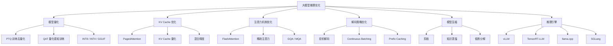
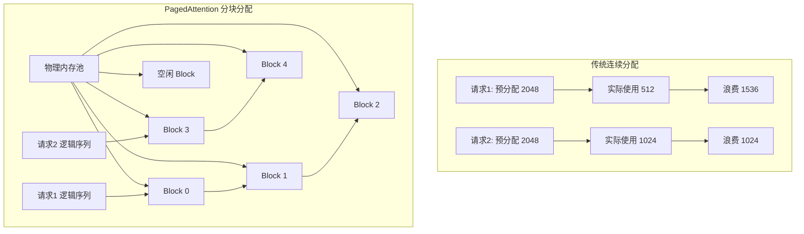
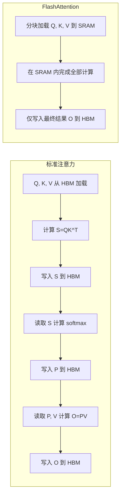
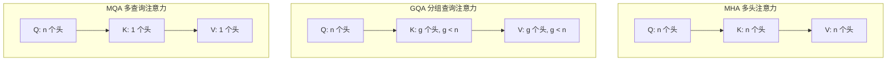
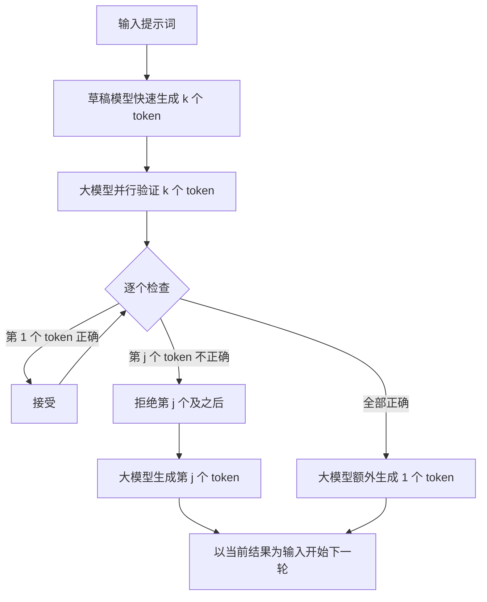
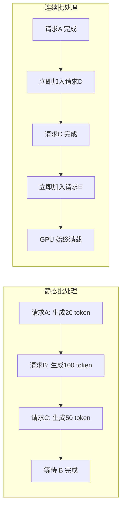
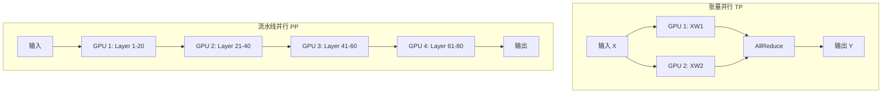
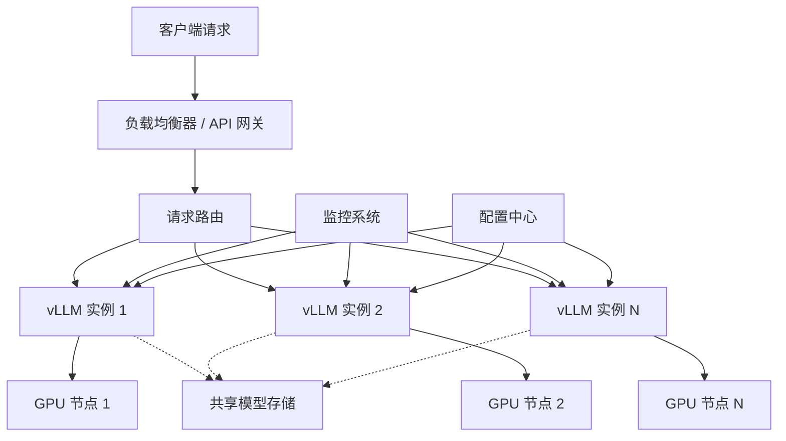

## 引言

大语言模型在各项任务上展现出卓越的能力，但将它们从实验室推向生产环境却面临着严峻的工程挑战。一个千亿参数的模型，仅模型权重就需要数百 GB 的存储空间，推理时还需要额外的显存来存放激活值和 KV Cache。如何在有限的硬件资源下实现低延迟、高吞吐的推理服务，成为了大模型落地的关键瓶颈。

大模型推理面临的核心挑战可以归结为三个方面：

1. **显存墙**：模型参数和 KV Cache 随上下文长度线性增长，显存往往成为第一道门槛
2. **延迟瓶颈**：自回归解码的逐 token 生成特性导致延迟难以压缩，首 token 延迟（TTFT）和每 token 延迟（TPOT）直接影响用户体验
3. **吞吐量限制**：在保证延迟的前提下最大化吞吐量，是降低单次推理成本的关键

推理优化的意义不仅在于"跑得快"，更在于"跑得起"。优秀的优化方案可以让原本需要 8 卡 A100 才能运行的模型，在单卡甚至消费级 GPU 上流畅运行，从而大幅降低部署成本，让更多应用场景成为可能。

本文将从量化压缩、KV Cache 优化、注意力机制优化、解码策略、模型压缩、推理引擎选型和部署架构等多个维度，系统梳理大模型推理优化的技术体系，并提供实践指南。

## 推理优化技术全景图

大模型推理优化是一个多层次的技术体系，涉及从底层算子到上层调度系统的各个环节。下图展示了主要的技术分类：



这些技术并非彼此孤立，而是可以组合使用。例如，一个典型的生产部署方案可能同时采用 INT4 量化、PagedAttention、FlashAttention-2 和 Continuous Batching，在各个层面榨取性能。

## 模型量化

### 量化基本原理

量化是将模型中高精度的浮点数（通常为 FP16/BF16）映射到低精度整数（如 INT8、INT4）的过程，其核心目的是减少显存占用并加速计算。

量化的基本公式为：

$$
x_q = \text{round}\left(\frac{x}{s}\right) + z
$$

反量化过程为：

$$
x \approx s \cdot (x_q - z)
$$

其中 $x$ 是原始浮点数，$x_q$ 是量化后的整数值，$s$ 是缩放因子（scale），$z$ 是零点（zero point）。缩放因子决定了量化范围与浮点范围的映射关系，零点用于处理非对称分布。

对于对称量化，零点 $z = 0$，缩放因子为：

$$
s = \frac{\max(|x|)}{2^{b-1} - 1}
$$

其中 $b$ 是量化位宽。对于非对称量化，缩放因子和零点分别为：

$$
s = \frac{x_{\max} - x_{\min}}{2^b - 1}, \quad z = \text{round}\left(\frac{-x_{\min}}{s}\right)
$$

### 量化分类

根据量化发生的时机，可以分为训练后量化（Post-Training Quantization, PTQ）和量化感知训练（Quantization-Aware Training, QAT）两大类。

| 特性 | PTQ（训练后量化） | QAT（量化感知训练） |
|------|-------------------|---------------------|
| **时机** | 模型训练完成后 | 训练过程中模拟量化 |
| **数据需求** | 少量校准数据（几百条） | 完整训练数据 |
| **精度损失** | 较大（低比特时明显） | 较小 |
| **训练成本** | 几乎无 | 需要额外训练 |
| **实现难度** | 简单 | 复杂 |
| **适用场景** | 快速部署、资源有限 | 追求极致精度、低比特量化 |
| **典型方法** | GPTQ、AWQ、SmoothQuant | LLM-QAT、BitNet |

在实际应用中，PTQ 因其便捷性而更为常用。大多数开源量化模型（如 GPTQ 量化版、AWQ 量化版）都采用 PTQ 方案。

### 主流量化方法

#### INT8 量化

INT8 量化是最成熟的量化方案，将 FP16 权重和激活值量化到 INT8。由于 GPU 拥有高效的 INT8 Tensor Core，INT8 量化不仅能减少显存，还能获得实际的推理加速。

INT8 量化分为对称和非对称两种模式：

- **对称量化**：量化范围以 0 为中心，适合权重（通常近似对称分布）
- **非对称量化**：量化范围不对称，适合激活值（ReLU 后均为非负）

对称 INT8 量化的效果取决于权重的分布。当权重存在明显离群值时，对称量化会导致大量正常值被压缩到极小的整数范围，精度损失较大。

#### GPTQ

GPTQ 是一种基于二阶信息的训练后权重量化方法。其核心思想是利用 Hessian 矩阵的信息来补偿量化误差，逐列量化权重并更新尚未量化的权重以最小化总体误差。

GPTQ 的量化目标是最小化量化前后的输出误差：

$$
\arg\min_{W_q} \| XW - XW_q \|_F^2
$$

其中 $X$ 是校准数据输入，$W$ 是原始权重，$W_q$ 是量化权重。GPTQ 利用 Hessian 矩阵 $H = X^T X$ 的信息来指导权重的量化顺序和误差补偿。

GPTQ 的主要特点：

- 支持 INT4 甚至 INT3 量化，精度损失较小
- 仅量化权重，激活值保持 FP16（W4A16 方案）
- 量化过程需要少量校准数据（约 128 条）
- 量化速度较快，可在数小时内完成 70B 模型的量化

#### AWQ

AWQ（Activation-aware Weight Quantization）是一种激活感知的权重量化方法。其核心发现是：并非所有权重都同等重要，与显著激活值（大激活值）对应的权重对量化误差更敏感。

AWQ 通过引入每通道缩放因子来保护重要权重：

$$
W' = W \cdot s, \quad Q(W') = \text{Quantize}(W'), \quad \hat{W} = Q(W') / s
$$

通过将重要权重放大后再量化，可以减少这些权重的相对量化误差。缩放因子 $s$ 通过网格搜索确定，以最小化量化前后的输出差异。

AWQ 的主要特点：

- 不依赖反向传播，量化速度快
- 对不同模型结构泛化性好
- INT4 量化下性能优于 GPTQ
- 支持与多种推理框架集成

#### GGUF / GGML 格式

GGUF（GPT-Generated Unified Format）是 llama.cpp 生态使用的模型格式，前身是 GGML。GGUF 最大的特点是支持在 CPU 上运行量化模型，并支持 GPU/CPU 混合推理。

GGUF 提供了多种量化级别，命名规则为 `Q{bits}_{variant}`：

| 量化级别 | 位宽 | 说明 |
|---------|------|------|
| Q8_0 | 8-bit | 几乎无损，体积约为 FP16 的一半 |
| Q6_K | 6-bit | 高质量，体积约为 FP16 的 40% |
| Q5_K_M | 5-bit | 质量与体积的良好平衡 |
| Q4_K_M | 4-bit | 最常用的级别，性价比高 |
| Q3_K_M | 3-bit | 体积小，有一定精度损失 |
| Q2_K | 2-bit | 体积最小，精度损失较大 |

GGUF 采用块量化策略，将权重分成小块独立量化，每块保存自己的缩放因子，从而更好地适应权重的局部分布差异。

### 量化效果对比表

| 方法 | 量化方案 | 最低位宽 | 精度保持 | 推理加速 | 适用硬件 | 主要优势 |
|------|---------|---------|---------|---------|---------|---------|
| INT8 对称 | W8A8 | 8-bit | 优秀 | 2x | GPU Tensor Core | 成熟稳定 |
| GPTQ | W4A16 | 4-bit | 良好 | 依赖实现 | GPU | 二阶补偿，精度高 |
| AWQ | W4A16 | 4-bit | 优秀 | 依赖实现 | GPU | 激活感知，泛化好 |
| GGUF Q4_K_M | W4 | 4-bit | 良好 | 中等 | CPU/GPU 混合 | 灵活部署 |
| SmoothQuant | W8A8 | 8-bit | 优秀 | 2x | GPU | 激活值平滑 |
| QAT | W4A4 | 4-bit | 优秀 | 3x+ | GPU | 精度最高 |

选择量化方法时，需要在精度、速度和部署灵活性之间权衡。一般建议：GPU 部署优先考虑 AWQ 或 GPTQ 的 INT4 方案；CPU 或混合部署优先考虑 GGUF 格式。

## KV Cache 优化

### KV Cache 原理

在自回归生成中，每生成一个新 token，都需要计算它与之前所有 token 的注意力。如果不缓存中间结果，计算复杂度为 $O(n^2)$。KV Cache 通过缓存每层的 Key 和 Value 矩阵，将生成阶段每步的计算复杂度降为 $O(n)$。

对于第 $t$ 步生成，注意力计算为：

$$
\text{Attention}(q_t, K_{1:t}, V_{1:t}) = \text{softmax}\left(\frac{q_t K_{1:t}^T}{\sqrt{d_k}}\right) V_{1:t}
$$

KV Cache 存储了 $K_{1:t-1}$ 和 $V_{1:t-1}$，每步只需计算新的 $k_t$ 和 $v_t$ 并追加到缓存中。

KV Cache 的显存占用为：

$$
M_{\text{kv}} = 2 \times n_{\text{layer}} \times n_{\text{head}} \times d_{\text{head}} \times \text{seq\_len} \times \text{batch} \times \text{dtype\_size}
$$

以 LLaMA-2-70B 为例（80 层、64 头、128 维、FP16），单条请求上下文长度 4096 时 KV Cache 就需要约 10GB 显存。当 batch size 增大或上下文变长时，KV Cache 的显存占用会迅速成为瓶颈。

### PagedAttention

PagedAttention 是 vLLM 的核心创新，灵感来自操作系统的虚拟内存管理。传统 KV Cache 采用连续内存分配，存在两个严重问题：

1. **内部碎片**：预先分配最大长度，实际使用不足导致浪费
2. **外部碎片**：不同请求长度不一，频繁分配释放导致内存碎片化

PagedAttention 将 KV Cache 划分为固定大小的块（block），每个块包含固定数量 token 的 KV 数据。逻辑上连续的序列在物理上由多个不连续的块组成，通过块表（block table）维护映射关系。



PagedAttention 的优势：

| 特性 | 传统连续分配 | PagedAttention |
|------|------------|----------------|
| 内存碎片 | 严重（60%-80% 浪费） | 几乎无 |
| 显存利用率 | 低 | 接近 100% |
| 动态长度 | 需预分配最大长度 | 按需分配 |
| 共享前缀 | 不支持 | 支持（Copy-on-Write） |
| Beam Search | 难以共享 | 高效共享 |

PagedAttention 使得 vLLM 的吞吐量相比 HuggingFace Transformers 提升了 2-4 倍，是大模型推理引擎的里程碑式创新。

### KV Cache 量化与压缩

随着上下文长度增加，KV Cache 的显存占用甚至可能超过模型权重本身。KV Cache 量化是缓解这一问题的有效手段。

KV Cache INT8 量化的核心思路是将 FP16 的 Key 和 Value 量化到 INT8，显存占用减半。由于注意力计算对 Key 的精度较为敏感，通常采用每通道量化（per-channel）而非每 token 量化。

更激进的方案是将 KV Cache 量化到 INT4 或 FP8：

$$
K_{\text{int4}} = \text{round}\left(\frac{K}{s_k}\right), \quad s_k = \frac{\max(|K|)}{7}
$$

KV Cache 量化在精度和显存之间需要权衡。实验表明，INT8 KV Cache 量化几乎无损，INT4 量化在长文本场景下可能有轻微精度下降。

### KV Cache 混合精度

不同位置的 KV Cache 对注意力精度的影响不同。近期 token 的 KV Cache 对当前生成影响更大，而早期 token 的影响相对较小。基于这一观察，混合精度策略应运而生：

- **近期 token**：保留 FP16 精度，确保生成质量
- **中期 token**：使用 INT8 量化，平衡精度与显存
- **远期 token**：使用 INT4 量化或直接丢弃，节省显存

此外，还有一些基于重要性的 KV Cache 淘汰策略，如 H2O（Heavy-Hitter Oracle）通过识别注意力分数中的"重击者"token 来决定保留哪些 KV Cache，在保持性能的同时大幅减少缓存占用。

## 注意力机制优化

### FlashAttention

FlashAttention 是一种 IO 感知的精确注意力计算方法，通过减少 GPU 高带宽内存（HBM）的读写次数来加速注意力计算。它不改变注意力的数学结果，而是优化了计算过程。

标准注意力计算需要将 $N \times N$ 的注意力矩阵写入 HBM 再读回，内存访问量为 $O(N^2)$。FlashAttention 采用 tiling 技术，将 Q、K、V 分块加载到高速的 SRAM 中计算，避免中间矩阵的落盘。

标准注意力的计算过程：

$$
S = QK^T, \quad P = \text{softmax}(S), \quad O = PV
$$

FlashAttention 的分块计算需要解决 softmax 的数值稳定性问题。对于分块计算，需要跟踪全局最大值和归一化因子：

$$
m_i = \max(m_i, \max(s_{ij})), \quad p_{ij} = e^{s_{ij} - m_i}
$$

$$
\ell_i = \sum_j p_{ij}, \quad o_i = \frac{\sum_j p_{ij} v_j}{\ell_i}
$$

通过在线 softmax 算法，FlashAttention 可以在分块计算时正确维护这些统计量，保证结果与标准注意力完全一致。



FlashAttention 的核心优势：

- **精确计算**：结果与标准注意力完全一致，非近似
- **内存高效**：无需存储 $N \times N$ 注意力矩阵，显存从 $O(N^2)$ 降为 $O(N)$
- **IO 高效**：减少 HBM 读写，实际加速 2-4 倍
- **支持长序列**：显存降低使得更长的上下文成为可能

### FlashAttention-2 / 3

FlashAttention-2 在初版基础上进一步优化：

1. **减少非矩阵乘法运算**：重新组织计算顺序，将 rescaling 和 softmax 等非 GEMM 运算占比从 50% 降到更低
2. **优化并行度**：沿序列维度和注意力头维度双重并行，更好地利用 GPU 的并行计算能力
3. **更好的线程分配**：优化 warp 级别的线程分工，减少同步开销

FlashAttention-2 相比初版获得了约 2 倍的加速，使注意力计算接近理论 FLOPS 上限。

FlashAttention-3 专门针对 Hopper 架构（H100）优化：

- 利用异步数据拷贝（TMA）和异步矩阵乘法重叠计算与访存
- 使用 FP8 Tensor Core 进行低精度注意力计算
- 利用硬件的 softmax 硬件加速单元

在 H100 GPU 上，FlashAttention-3 相比 FlashAttention-2 获得了 1.5-2 倍的加速，FP8 模式下可达近 1200 TFLOPS。

### 稀疏注意力

稀疏注意力通过减少注意力计算的覆盖范围来降低复杂度，适用于超长上下文场景。

#### Sliding Window Attention

滑动窗口注意力只计算每个 token 与其局部窗口内 token 的注意力：

$$
\text{Attn}_{\text{SWA}}(q_i) = \text{softmax}\left(\frac{q_i K_{i-w:i}^T}{\sqrt{d_k}}\right) V_{i-w:i}
$$

其中 $w$ 是窗口大小。滑动窗口将注意力复杂度从 $O(N^2)$ 降为 $O(Nw)$，同时通过多层堆叠仍能间接捕捉远距离依赖（每层窗口扩展 $w$ 的范围）。

Mistral 系列模型采用 SWA，在保持长文本能力的同时大幅降低了推理成本。

#### GQA 与 MQA

标准多头注意力（MHA）中，每个注意力头都有独立的 Key 和 Value。GQA 和 MQA 通过共享 KV 头来减少 KV Cache 的显存占用。



| 注意力类型 | KV 头数 | KV Cache 大小 | 质量影响 | 典型应用 |
|-----------|--------|-------------|---------|---------|
| MHA | $n_{\text{head}}$ | 1x | 基准 | 早期模型 |
| GQA | $g$（$1 < g < n$） | $g/n$ | 轻微下降 | LLaMA-2/3 |
| MQA | 1 | $1/n$ | 有一定下降 | PaLM, Falcon |

GQA 是 MHA 和 MQA 之间的良好折中。LLaMA-2 70B 使用 8 个 KV 头（64 个查询头），KV Cache 减少了 8 倍，而质量几乎无损。

## 解码策略优化

### 投机解码

投机解码（Speculative Decoding）是一种利用小模型加速大模型推理的方法。其核心思想是：用一个小而快的草稿模型快速生成多个候选 token，然后用大模型并行验证这些 token，接受正确的、拒绝错误的。

投机解码的关键优势在于将大模型的逐 token 串行计算转化为批量并行验证，且**不改变输出的概率分布**——它是精确的，而非近似。



投机解码的加速比取决于草稿模型的接受率（acceptance rate）。如果草稿模型与大模型分布接近，接受率高，可以获得显著加速。设每轮生成 $k$ 个草稿 token，接受率为 $\alpha$，则期望每轮接受的 token 数为：

$$
E[\text{accepted}] = \frac{1 - \alpha^{k+1}}{1 - \alpha}
$$

当 $\alpha = 0.8$，$k = 4$ 时，期望接受约 3.3 个 token，相比逐 token 生成可获得约 2-3 倍加速。

### 投机解码变体

#### Medusa

Medusa 不依赖独立的草稿模型，而是在大模型的隐藏层上训练多个"头"（head），每个头预测后续不同位置的 token。Medusa 的优势在于：

- 无需额外的小模型，训练和部署更简单
- 利用大模型自身的表示能力，预测质量有保障
- 通过树状注意力（Tree Attention）并行验证多条候选路径

#### EAGLE

EAGLE 在 Medusa 的基础上进一步改进，使用大模型隐藏层的特征（而非仅 token 嵌入）来预测后续 token。由于隐藏层特征包含更丰富的语义信息，EAGLE 的接受率更高，加速效果更显著。

EAGLE 还引入了动态草稿树策略，根据上下文自适应调整候选路径的数量和结构，在不同场景下都能保持高效。

### 其他解码优化

#### Continuous Batching

传统静态批处理要求同一批次的请求同时到达、同时完成。由于不同请求的生成长度差异巨大，短请求需要等待长请求完成，导致 GPU 利用率低下。

Continuous Batching（连续批处理）在 token 级别进行批处理：每当一个请求完成生成，立即将其移出批次并加入新请求，使 GPU 始终保持满载。配合 PagedAttention，vLLM 实现了高效的连续批处理。



#### Prefix Caching

在多轮对话或 RAG 场景中，不同请求往往共享相同的前缀（如系统提示词、文档上下文）。Prefix Caching 将这些共享前缀的 KV Cache 缓存起来，避免重复计算。

vLLM 的 Automatic Prefix Caching 可以自动识别请求间的公共前缀并复用其 KV Cache。对于 RAG 场景，这可以将首 token 延迟降低 50% 以上。

## 模型压缩

### 剪枝

剪枝通过移除模型中不重要的参数来减少模型大小和计算量，可分为结构化剪枝和非结构化剪枝。

**非结构化剪枝**将个别权重置零，基于权重大小或梯度信息判断重要性：

$$
W_{\text{pruned}} = W \odot M, \quad M_{ij} = \mathbb{1}(|W_{ij}| > \tau)
$$

其中 $M$ 是二值掩码，$\tau$ 是阈值。非结构化剪枝可以达到很高的稀疏率（90%+），但稀疏矩阵在 GPU 上的计算效率低下，难以获得实际加速。

**结构化剪枝**移除整个结构单元（如注意力头、整行/整列、整个层），保持稠密矩阵的存储和计算格式：

- **通道剪枝**：移除整个神经元通道
- **头剪枝**：移除不重要的注意力头
- **层剪肢**：移除整层 Transformer Block

LLM-Pruner 等方法通过依赖关系分析和梯度信息指导结构化剪枝，在保持性能的同时减少模型参数。SliceGPT 则通过正交变换将剪枝转化为矩阵截断问题，实现了更优雅的结构化压缩。

| 剪枝类型 | 压缩率 | 加速效果 | 精度保持 | 硬件友好 |
|---------|--------|---------|---------|---------|
| 非结构化 | 高（90%+） | 需稀疏硬件 | 良好 | 差 |
| 半结构化（2:4） | 中（50%） | GPU 原生支持 | 良好 | 好 |
| 结构化 | 中（20%-50%） | 直接加速 | 有一定损失 | 优秀 |

### 知识蒸馏

知识蒸馏通过让小模型（学生）学习大模型（教师）的输出分布来压缩模型。在大模型场景中，蒸馏可以在保持大部分能力的前提下大幅减少参数量。

关于知识蒸馏的详细技术，请参考本专栏的[大模型微调技术全攻略](./大模型微调技术全攻略/)中关于蒸馏的相关内容。

### 低秩分解

低秩分解将大权重矩阵分解为两个小矩阵的乘积，利用权重的低秩特性减少参数量：

$$
W \approx A \cdot B, \quad W \in \mathbb{R}^{m \times n}, A \in \mathbb{R}^{m \times r}, B \in \mathbb{R}^{r \times n}
$$

其中 $r \ll \min(m, n)$ 是秩。参数量从 $mn$ 降为 $r(m+n)$。

TensorGPT 将权重矩阵分解为多组低秩矩阵，在 INT4 量化基础上进一步压缩。低秩分解与量化结合可以实现极高的压缩率，但需要在精度和压缩之间仔细权衡。

## 推理引擎选型

### 主流推理框架对比

| 框架 | 开发方 | 性能 | 易用性 | 量化支持 | 部署方式 | 核心优势 |
|------|--------|------|--------|---------|---------|---------|
| vLLM | UC Berkeley | 极高 | 高 | AWQ, GPTQ, FP8 | GPU 服务 | PagedAttention, 生态丰富 |
| TensorRT-LLM | NVIDIA | 极高 | 中 | INT8, INT4, FP8 | GPU 服务 | 极致优化, NVIDIA 硬件最优 |
| llama.cpp | 社区 | 中高 | 高 | GGUF 全系列 | CPU/GPU | 零依赖, 消费级硬件 |
| TGI | HuggingFace | 高 | 高 | GPTQ, AWQ, BitsAndBytes | GPU 服务 | 与 HF 生态深度集成 |
| SGLang | 社区 | 极高 | 中 | AWQ, GPTQ, FP8 | GPU 服务 | RadixAttention, 结构化生成 |

选型建议：

- **追求极致吞吐量**：vLLM 或 TensorRT-LLM
- **快速原型验证**：TGI 或 vLLM
- **消费级 GPU / CPU 部署**：llama.cpp
- **复杂结构化生成**：SGLang
- **NVIDIA 专用环境**：TensorRT-LLM

### vLLM 实践

vLLM 是当前最流行的大模型推理引擎，其 OpenAI 兼容的 API 服务可以快速部署。

**离线批量推理**：

```python
from vllm import LLM, SamplingParams

# 加载模型，指定量化方式
llm = LLM(
    model="meta-llama/Llama-2-7b-chat-hf",
    quantization="awq",          # 使用 AWQ 量化
    tensor_parallel_size=1,      # 张量并行数
    gpu_memory_utilization=0.9,  # GPU 显存利用率上限
    max_model_len=4096,          # 最大上下文长度
)

# 设置采样参数
sampling_params = SamplingParams(
    temperature=0.7,
    top_p=0.9,
    max_tokens=512,
)

# 批量推理
prompts = [
    "请用中文解释什么是 Transformer 架构",
    "写一个 Python 快速排序的实现",
    "总结以下文章的要点：...",
]
outputs = llm.generate(prompts, sampling_params)

for output in outputs:
    prompt = output.prompt
    generated_text = output.outputs[0].text
    print(f"Prompt: {prompt[:50]}...")
    print(f"Generated: {generated_text}\n")
```

**启动 OpenAI 兼容 API 服务**：

```python
# 使用 vLLM 启动 API 服务
# 命令行执行: python -m vllm.entrypoints.openai.api_server

# 客户端调用示例
from openai import OpenAI

client = OpenAI(
    base_url="http://localhost:8000/v1",
    api_key="your-api-key",
)

response = client.chat.completions.create(
    model="meta-llama/Llama-2-7b-chat-hf",
    messages=[
        {"role": "system", "content": "你是一个专业的技术助手"},
        {"role": "user", "content": "解释 PagedAttention 的原理"},
    ],
    temperature=0.7,
    max_tokens=1024,
)

print(response.choices[0].message.content)
```

**启用高级优化**：

```python
from vllm import LLM, SamplingParams

llm = LLM(
    model="meta-llama/Meta-Llama-3-8B-Instruct",
    # 启用_prefix caching，加速多轮对话和 RAG_
    enable_prefix_caching=True,
    # 启用 Chunked Prefill，优化长 prompt 处理_
    enable_chunked_prefill=True,
    # 使用 FP8 量化（需 H100 等 Hopper 架构 GPU）
    quantization="fp8",
    # 张量并行
    tensor_parallel_size=2,
    gpu_memory_utilization=0.92,
    max_model_len=8192,
)

# 使用投机解码加速
sampling_params = SamplingParams(
    temperature=0.0,
    max_tokens=256,
    # 指定草稿模型
    # 需在启动时通过 --speculative-model 参数配置
)
```

### llama.cpp 实践

llama.cpp 是轻量级推理方案的代表，适合在消费级硬件或边缘设备上部署。

**模型转换与量化**：

```bash
# 将 HuggingFace 模型转换为 GGUF 格式
python convert_hf_to_gguf.py \
    ./models/llama-2-7b-hf \
    --outfile ./models/llama-2-7b.gguf

# 量化为 Q4_K_M
./llama-quantize \
    ./models/llama-2-7b.gguf \
    ./models/llama-2-7b-Q4_K_M.gguf \
    Q4_K_M
```

**启动推理服务**：

```bash
# CPU 推理
./llama-cli \
    -m ./models/llama-2-7b-Q4_K_M.gguf \
    -p "解释什么是大模型量化" \
    -n 512

# GPU 推理（CUDA 加速）
./llama-cli \
    -m ./models/llama-2-7b-Q4_K_M.gguf \
    -p "解释什么是大模型量化" \
    -n 512 \
    -ngl 32  # 将 32 层卸载到 GPU

# 启动 OpenAI 兼容 API 服务
./llama-server \
    -m ./models/llama-2-7b-Q4_K_M.gguf \
    --host 0.0.0.0 \
    --port 8080 \
    -ngl 32 \
    -c 4096  # 上下文长度
```

llama.cpp 的 `-ngl` 参数控制 GPU 层数，可以在显存不足时将部分层保留在 CPU 上计算，实现灵活的混合推理。

## 部署架构

### 单机部署

单机部署是最简单的方案，适用于模型规模在单卡显存范围内（如 7B 模型在单张 24GB 显卡上）的场景。

单机部署的关键配置：

| 配置项 | 说明 | 推荐值 |
|--------|------|--------|
| 量化方式 | 权重量化精度 | AWQ INT4 或 GGUF Q4_K_M |
| GPU 显存利用率 | vLLM KV Cache 预留比例 | 0.85-0.92 |
| 最大上下文长度 | 根据业务需求设定 | 4096-8192 |
| Continuous Batching | 是否启用连续批处理 | 启用 |
| Prefix Caching | 是否启用前缀缓存 | 启用（多轮对话场景） |

### 分布式部署

当模型规模超过单卡显存时，需要采用分布式部署策略。

**张量并行（Tensor Parallelism, TP）**将模型的权重矩阵按维度切分到多张 GPU 上，每张 GPU 计算矩阵的一部分，通过 AllReduce 通信汇总结果。

$$
Y = XW \approx X \begin{bmatrix} W_1 \\ W_2 \end{bmatrix} = \begin{bmatrix} XW_1 & XW_2 \end{bmatrix} \xrightarrow{\text{AllReduce}} XW
$$

张量并行通信频繁，要求 GPU 间有高带宽互联（如 NVLink），通常限制在同一节点内（2-8 卡）。

**流水线并行（Pipeline Parallelism, PP）**将模型按层切分到多张 GPU 上，数据依次流经各 GPU。流水线并行通信量小，适合跨节点部署，但会引入流水线气泡（bubble）降低利用率。



实际部署中通常组合使用：TP 用于节点内加速，PP 用于跨节点扩展。例如部署 70B 模型可采用 TP=4 + PP=1 的方案（4 卡同一节点）。

### 服务化部署

生产环境的服务化部署需要考虑高可用、负载均衡和弹性伸缩。



服务化部署的关键考量：

1. **请求路由**：根据请求的 prompt 长度和预估生成长度路由到不同实例，提高批次均衡性
2. **模型加载**：使用共享存储（如 NFS）或模型预热，减少冷启动时间
3. **弹性伸缩**：根据 GPU 利用率和请求队列长度动态调整实例数
4. **优雅降级**：在显存不足时自动降低 batch size 或启用更激进的量化
5. **监控告警**：实时监控 TTFT、TPOT、吞吐量、显存利用率等核心指标

## 性能评估指标

评估大模型推理性能需要关注多个维度的指标：

| 指标 | 全称 | 含义 | 典型目标 |
|------|------|------|---------|
| TTFT | Time To First Token | 首 token 延迟，从请求到返回第一个 token 的时间 | < 500ms |
| TPOT | Time Per Output Token | 每个输出 token 的生成时间 | < 50ms |
| E2E Latency | End-to-End Latency | 端到端延迟，从请求到完整响应的时间 | 视场景而定 |
| Throughput | Tokens/s | 单位时间生成的 token 总数 | 越高越好 |
| QPS | Queries Per Second | 每秒处理的请求数 | 越高越好 |
| GPU Utilization | GPU 利用率 | GPU 计算单元的忙碌程度 | > 80% |
| Memory Utilization | 显存利用率 | 已用显存占总显存的比例 | 85%-95% |

这些指标之间存在权衡关系。例如，增大 batch size 可以提高吞吐量，但会增加 TTFT 和 TPOT。优化的目标是在满足延迟 SLA 的前提下最大化吞吐量。

关键指标的测量方法：

```python
import time
from vllm import LLM, SamplingParams

llm = LLM(model="meta-llama/Llama-2-7b-chat-hf", quantization="awq")

# 测量 TTFT 和 TPOT
prompt = "请详细介绍大模型推理优化的主要技术方向"
sampling_params = SamplingParams(temperature=0.7, max_tokens=256)

# 预热
llm.generate([prompt], sampling_params)

# 正式测量
start = time.time()
outputs = llm.generate([prompt] * 32, sampling_params)  # batch=32
total_time = time.time() - start

total_tokens = sum(len(o.outputs[0].token_ids) for o in outputs)
throughput = total_tokens / total_time
print(f"总耗时: {total_time:.2f}s")
print(f"总 token 数: {total_tokens}")
print(f"吞吐量: {throughput:.1f} tokens/s")
print(f"平均 TPOT: {total_time / 256 * 1000:.1f} ms/token")
```

## 调优实践清单

针对不同场景的推荐配置：

| 场景 | 模型规模 | 推荐量化 | 推理引擎 | 并行策略 | 关键优化 |
|------|---------|---------|---------|---------|---------|
| 个人本地体验 | 7B | GGUF Q4_K_M | llama.cpp | 单卡/CPU | GPU 层卸载 |
| 低延迟对话 | 7B-13B | AWQ INT4 | vLLM | TP=1 | Prefix Caching |
| 高并发服务 | 7B-13B | AWQ INT4 | vLLM | TP=1-2 | Continuous Batching |
| 长文本处理 | 13B-70B | GPTQ INT4 | vLLM | TP=2-4 | FlashAttention-2 |
| 超大模型服务 | 70B+ | FP8/INT4 | TensorRT-LLM | TP=4-8 | TP+PP 组合 |
| RAG 应用 | 7B-13B | AWQ INT4 | vLLM/SGLang | TP=1 | Prefix Caching |
| 代码生成 | 13B-33B | AWQ INT4 | vLLM | TP=1-2 | 投机解码 |
| 边缘设备 | 1B-7B | GGUF Q3/Q4 | llama.cpp | CPU | 量化+层卸载 |

通用调优建议：

1. **先量化再优化**：INT4 量化是最具性价比的优化，通常可减少 50%-75% 显存
2. **优先启用 PagedAttention 和 Continuous Batching**：这是 vLLM 的核心优势，免费获得 2-4 倍吞吐提升
3. **长文本场景务必使用 FlashAttention-2**：不仅加速，还能支持更长的上下文
4. **多轮对话启用 Prefix Caching**：显著降低 TTFT
5. **合理设置 `gpu_memory_utilization`**：留出 10%-15% 显存余量，避免 OOM
6. **监控并调优 batch size**：根据实际负载动态调整，找到延迟与吞吐的平衡点
7. **考虑投机解码**：当有合适的草稿模型时，可获得 2-3 倍加速

## 结语

大模型推理优化是一个快速演进的技术领域。从 PagedAttention 到 FlashAttention，从 INT4 量化到投机解码，每一项技术突破都在不断拓宽大模型落地的边界。

推理优化没有万能方案，需要根据具体的模型规模、硬件条件、延迟要求和成本预算来组合选择。理解各项技术的原理和适用场景，才能做出合理的工程决策。

值得强调的是，优化的核心思路始终是减少不必要的计算和访存：量化减少数据搬运量，FlashAttention 减少 HBM 读写，PagedAttention 减少内存浪费，Continuous Batching 减少 GPU 空闲。所有这些技术本质上都在追求同一个目标——让有限的硬件资源发挥最大的价值。

随着硬件的发展（如 H100/Blackwell 的 FP8 支持）和算法的进步（如更高效的投机解码、更精确的低比特量化），大模型推理的成本将持续下降，性能将持续提升，让大模型真正走进每一个应用场景。

---

**参考文献**：

1. Kwon W, et al. Efficient Memory Management for Large Language Model Serving with PagedAttention. SOSP 2023.
2. Dao T, et al. FlashAttention: Fast and Memory-Efficient Exact Attention with IO-Awareness. NeurIPS 2022.
3. Frantar E, et al. GPTQ: Accurate Post-Training Quantization for Generative Pre-trained Transformers. ICLR 2023.
4. Lin J, et al. AWQ: Activation-aware Weight Quantization for LLM Compression and Acceleration. MLSys 2024.
5. Leviathan Y, et al. Fast Inference from Transformers via Speculative Decoding. ICML 2023.
6. Dao T. FlashAttention-2: Faster Attention with Better Parallelism and Work Partitioning. 2023.
7. Shazeer N. Fast Transformer Decoding: One Write-Head is All You Need. 2019.
8. Ainslie J, et al. GQA: Training Generalized Multi-Query Transformer Models from Multi-Head Checkpoints. EMNLP 2023.
9. Cai T, et al. Medusa: Simple LLM Inference Acceleration Framework with Multiple Decoding Heads. 2024.
10. Li Y, et al. EAGLE: Speculative Sampling Requires Rethinking Feature Uncertainty. ICML 2024.
