## 引言

大语言模型（LLM）的能力随着参数规模的增大而显著提升，但庞大的模型也带来了高昂的部署成本：推理延迟高、显存占用大、服务费用昂贵。与之相对，小模型部署轻快、成本低，但能力往往不足。这就形成了一个核心矛盾——**能力与成本难以兼得**。

知识蒸馏（Knowledge Distillation, KD）正是缓解这一矛盾的关键技术。其核心思想源于「教师-学生」（Teacher-Student）范式：让一个能力强但庞大的 Teacher 模型指导一个轻量但高效的 Student 模型学习，使 Student 在参数量大为减少的情况下，尽可能继承 Teacher 的能力。

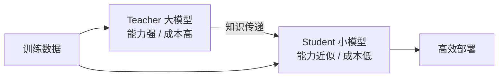

与微调（Fine-tuning）不同，蒸馏的目标不是让模型适配特定任务，而是**压缩模型**——将大模型的知识迁移到小模型中。这使得蒸馏成为大模型落地部署的重要工具链环节。

本文将系统梳理大模型知识蒸馏的技术体系，从 Hinton 的经典方法到面向 LLM 的序列级蒸馏与黑盒蒸馏，帮助读者全面掌握这一技术。

## 知识蒸馏技术全景图

大模型蒸馏方法众多，按照信息传递的粒度和 Teacher 的可访问程度，可分为以下几大类：

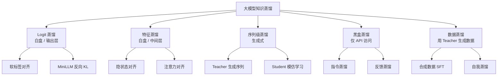

各类方法的核心区别如下：

| 方法类别 | 访问权限 | 传递信息 | 适用场景 |
|---------|---------|---------|---------|
| Logit 蒸馏 | 白盒（需权重） | 输出概率分布 | 同构模型压缩 |
| 特征蒸馏 | 白盒（需权重） | 中间层表示 | 深层知识迁移 |
| 序列级蒸馏 | 灰盒（需生成） | 完整输出序列 | 生成任务蒸馏 |
| 黑盒蒸馏 | 黑盒（仅 API） | 输入-输出对 | 闭源模型蒸馏 |
| 数据蒸馏 | 黑盒（仅 API） | 合成训练数据 | 大规模数据增强 |

## 经典知识蒸馏基础

### KD 的基本原理（Hinton 2015）

知识蒸馏的概念最早由 Hinton 等人在 2015 年系统化提出。其核心洞察是：**软标签（soft label）比硬标签（hard label）蕴含更丰富的信息**。

对于分类问题，Teacher 模型的输出经过 Softmax 后，会得到各类别的概率分布。直接取最大概率类别得到的是硬标签，它丢弃了其他类别的相对关系；而软标签保留了完整的概率分布，包含了 Teacher 对所有类别的"看法"——即**暗知识（Dark Knowledge）**。

为了使软标签更加平滑、信息更丰富，Hinton 引入了温度系数 $T$。带温度的 Softmax 定义为：

$$
p_i^T = \frac{\exp(z_i / T)}{\sum_j \exp(z_j / T)}
$$

其中 $z_i$ 是 Teacher 输出的 logit，$T$ 是温度系数。当 $T > 1$ 时，概率分布变得更加平滑，各类别间的差异被放大，暗知识更加明显。

完整的 KD 损失函数将硬标签损失与软标签损失加权组合：

$$
\mathcal{L}_{KD} = (1-\alpha) \mathcal{L}_{CE}(y, f_S(x)) + \alpha T^2 \mathcal{L}_{KL}(f_T^T(x), f_S^T(x))
$$

其中：
- $y$ 是真实硬标签，$f_S(x)$ 是 Student 的标准输出（$T=1$）
- $f_T^T(x)$ 和 $f_S^T(x)$ 分别是 Teacher 和 Student 在温度 $T$ 下的软标签
- $\alpha$ 是平衡因子，控制两项损失的权重
- $\mathcal{L}_{CE}$ 是交叉熵损失，$\mathcal{L}_{KL}$ 是 KL 散度损失
- $T^2$ 因子用于补偿温度对梯度缩放的影响

#### 温度系数的作用

温度系数 $T$ 是 KD 中最关键的超参数之一：

- $T = 1$：退化为标准 Softmax，软标签接近 one-hot，暗知识很少
- $T$ 较大：分布趋于均匀，暗知识丰富但信号过弱
- $T$ 适中（通常 2~10）：在信息丰富度和信号强度之间取得平衡

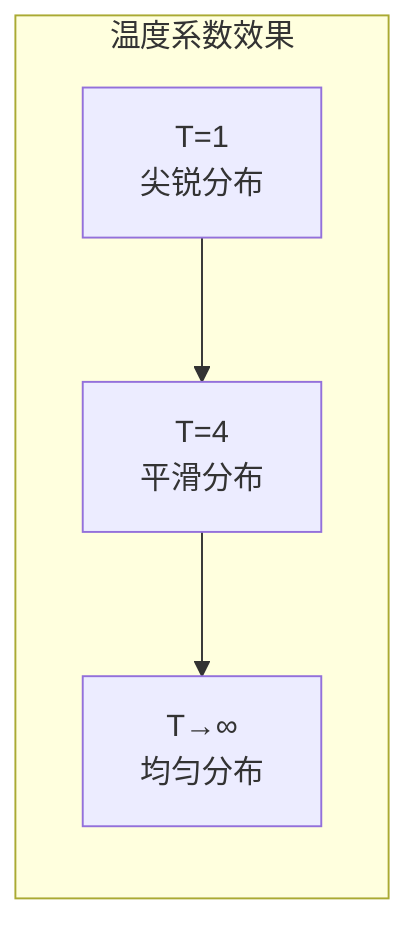

### 软标签 vs 硬标签

| 特性 | 硬标签（Hard Label） | 软标签（Soft Label） |
|------|---------------------|---------------------|
| 形式 | one-hot 向量 | 概率分布 |
| 信息量 | 仅含正确类别 | 含所有类别间关系 |
| 梯度信号 | 稀疏 | 稠密 |
| 训练稳定性 | 易过拟合 | 更平滑、更鲁棒 |
| 计算成本 | 低 | 需要 Teacher 前向传播 |
| 适用场景 | 标注数据训练 | 蒸馏、半监督学习 |

软标签的价值在于它传递了 Teacher 的"不确定性"和"类间关系"。例如在情感分类中，一个样本可能是 70% 正面、25% 中性、5% 负面，这种细粒度的分布信息对 Student 的学习远比一个简单的"正面"标签更有价值。

## 大模型蒸馏的核心方法

### Logit 蒸馏（白盒）

Logit 蒸馏是最直接的蒸馏方式，要求能够访问 Teacher 模型的权重和输出 logits。其核心是对齐 Teacher 和 Student 在输出层的概率分布。

#### 基本原理

给定输入 $x$，Teacher 和 Student 分别输出 logit 向量 $z^T$ 和 $z^S$。Logit 蒸馏通过最小化两者软标签分布的 KL 散度来传递知识：

$$
\mathcal{L}_{logit} = T^2 \cdot D_{KL}\left(p^T(x) \| p^S(x)\right)
$$

其中 $p^T$ 和 $p^S$ 分别是 Teacher 和 Student 在温度 $T$ 下的软标签。

对于大语言模型，MiniLLM（ICLR 2024）指出传统正向 KL 散度存在 mode-covering 问题——Student 会试图覆盖 Teacher 所有模式，导致生成质量下降。因此 MiniLLM 提出使用**反向 KL 散度**：

$$
\mathcal{L}_{reverse} = T^2 \cdot D_{KL}\left(p^S(x) \| p^T(x)\right)
$$

反向 KL 具有 mode-seeking 特性，使 Student 聚焦于 Teacher 的高概率模式，生成更加锐利的分布。

#### 代码示例

```python
import torch
import torch.nn.functional as F

def distillation_loss(student_logits, teacher_logits, labels,
                      temperature=4.0, alpha=0.5):
    """
    Logit 蒸馏损失函数
    :param student_logits: Student 模型输出 logits [B, V]
    :param teacher_logits: Teacher 模型输出 logits [B, V]
    :param labels: 真实标签 [B]
    :param temperature: 温度系数
    :param alpha: 软硬标签平衡因子
    """
    # 软标签损失：KL 散度
    soft_teacher = F.log_softmax(teacher_logits / temperature, dim=-1)
    soft_student = F.log_softmax(student_logits / temperature, dim=-1)
    loss_kd = F.kl_div(
        input=soft_student,
        target=soft_teacher.exp(),
        reduction="batchmean"
    ) * (temperature ** 2)

    # 硬标签损失：交叉熵
    loss_ce = F.cross_entropy(student_logits, labels)

    # 加权组合
    total_loss = (1 - alpha) * loss_ce + alpha * loss_kd
    return total_loss, loss_ce, loss_kd


# 训练步示例
def train_step(student, teacher, batch, optimizer, temperature=4.0, alpha=0.5):
    student.train()
    teacher.eval()

    input_ids = batch["input_ids"]
    labels = batch["labels"]

    # Teacher 前向传播（不计算梯度）
    with torch.no_grad():
        teacher_outputs = teacher(input_ids)
        teacher_logits = teacher_outputs.logits

    # Student 前向传播
    student_outputs = student(input_ids)
    student_logits = student_outputs.logits

    # 计算蒸馏损失
    loss, loss_ce, loss_kd = distillation_loss(
        student_logits, teacher_logits, labels,
        temperature=temperature, alpha=alpha
    )

    # 反向传播
    optimizer.zero_grad()
    loss.backward()
    optimizer.step()

    return {"loss": loss.item(), "loss_ce": loss_ce.item(), "loss_kd": loss_kd.item()}
```

#### 优势与局限

| 优势 | 局限 |
|------|------|
| 信息传递最直接、最充分 | 需要白盒访问 Teacher 权重 |
| 理论基础扎实 | Teacher 和 Student 词汇表需对齐 |
| 可与 SFT 无缝结合 | 大模型前向传播开销大 |
| 软标签提供稠密梯度信号 | 对 Teacher 质量高度依赖 |

### 序列级蒸馏（Sequence-Level Distillation）

对于生成任务，逐 token 的 Logit 蒸馏虽然有效，但存在一个根本问题：**Student 在训练时看到的是 Teacher 的软标签分布，而推理时需要自回归地生成完整序列**。这种训练与推理的分布差异（exposure bias）会影响生成质量。

序列级蒸馏（Kim et al., EMNLP 2016）提供了一种更简洁的方案：让 Teacher 先生成完整的输出序列，再用这些序列作为训练数据对 Student 进行监督学习。

#### 工作流程

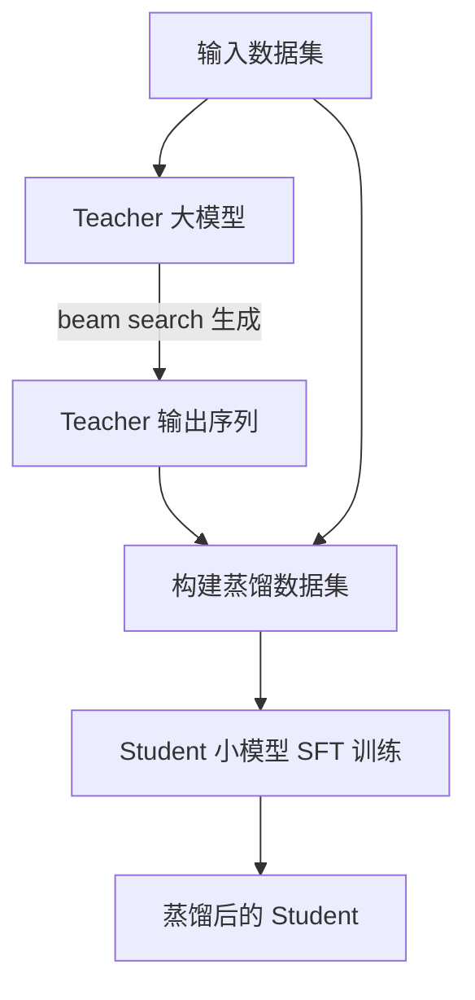

具体步骤如下：

1. **数据生成**：用 Teacher 模型对训练集中的每个输入进行推理（通常使用 beam search），生成高质量输出序列
2. **数据构建**：将「输入 + Teacher 输出」组成新的训练数据对
3. **Student 训练**：用标准的交叉熵损失对 Student 进行 SFT 训练

序列级蒸馏的损失函数即标准的语言模型交叉熵：

$$
\mathcal{L}_{seq} = -\sum_{t=1}^{N} \log p_S(y_t^T | x, y_{<t}^T)
$$

其中 $y^T$ 是 Teacher 生成的序列。

#### 优势

- **实现简单**：只需 Teacher 的输出，不需要访问权重，本质是 SFT
- **训练高效**：无需 Teacher 参与训练过程，离线生成数据即可
- **效果显著**：在很多生成任务上效果优于 Logit 蒸馏
- **通用性强**：适用于任何能生成的 Teacher 模型

### 黑盒蒸馏

在实际场景中，我们经常只能通过 API 访问 Teacher 模型（如 GPT-4、Claude），无法获取其权重和 logits。这时需要依赖黑盒蒸馏方法。

#### 数据蒸馏

数据蒸馏是黑盒蒸馏最常见的形式：利用 Teacher 的强大能力生成高质量训练数据，再用这些数据训练 Student。

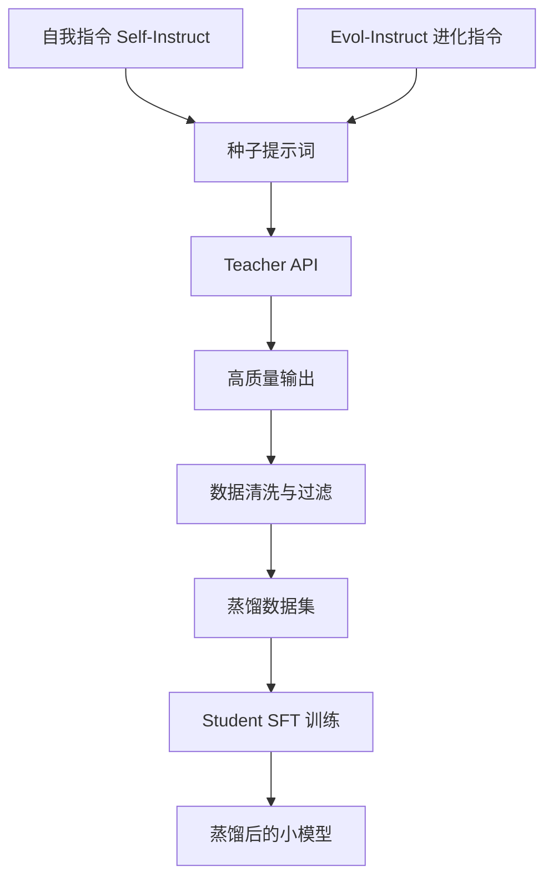

数据蒸馏的关键在于**如何生成多样化、高质量的训练数据**，常见策略包括：

1. **Self-Instruct**：让 Teacher 基于少量种子指令自动生成更多指令和回答
2. **Evol-Instruct**：对已有指令进行进化（加深难度、增加约束），提升数据复杂度分布
3. **领域覆盖**：确保数据覆盖代码、数学、推理、对话等多个能力维度
4. **质量过滤**：使用 Teacher 自身或奖励模型对生成数据进行质量打分和过滤

#### 代码示例：用大模型生成蒸馏数据集

```python
import json
import random
from openai import OpenAI

client = OpenAI(base_url="https://api.example.com/v1", api_key="your-api-key")

# 种子提示词模板
SEED_PROMPTS = [
    "请解释什么是梯度下降算法",
    "用 Python 实现一个快速排序",
    "分析红楼梦的主要人物关系",
    "推导贝叶斯定理",
]

EVOLVE_TEMPLATES = [
    "请将以下问题增加一个约束条件：{prompt}",
    "请将以下问题改写得更具挑战性：{prompt}",
    "请将以下问题扩展为多步骤推理问题：{prompt}",
]


def generate_with_teacher(prompt, model="gpt-4"):
    """调用 Teacher 模型生成回答"""
    response = client.chat.completions.create(
        model=model,
        messages=[
            {"role": "system", "content": "你是一位知识渊博的助手，请给出详细、准确的回答。"},
            {"role": "user", "content": prompt}
        ],
        temperature=0.7,
        max_tokens=2048,
    )
    return response.choices[0].message.content


def build_distillation_dataset(num_samples=5000):
    """构建蒸馏数据集"""
    dataset = []
    prompts = SEED_PROMPTS.copy()

    for i in range(num_samples):
        # 随机选择生成策略
        if i < len(SEED_PROMPTS) or random.random() < 0.3:
            prompt = random.choice(SEED_PROMPTS)
        else:
            base = random.choice(prompts)
            template = random.choice(EVOLVE_TEMPLATES)
            # 用 Teacher 进化指令
            evolved = generate_with_teacher(template.format(prompt=base))
            prompt = evolved.strip()

        # 用 Teacher 生成回答
        answer = generate_with_teacher(prompt)

        # 简单质量过滤：过滤过短回答
        if len(answer) > 50:
            dataset.append({
                "id": f"distill_{i:05d}",
                "instruction": prompt,
                "output": answer,
            })
            prompts.append(prompt)  # 扩展种子池

        if (i + 1) % 100 == 0:
            print(f"已生成 {i + 1}/{num_samples} 条数据")

    return dataset


# 生成并保存
data = build_distillation_dataset(num_samples=5000)
with open("distillation_data.jsonl", "w", encoding="utf-8") as f:
    for item in data:
        f.write(json.dumps(item, ensure_ascii=False) + "\n")

print(f"蒸馏数据集生成完成，共 {len(data)} 条")
```

### 特征蒸馏

特征蒸馏（Feature Distillation）不仅对齐输出层，还对齐 Teacher 和 Student 的中间层表示。其核心假设是：**模型的中间层蕴含了比输出更丰富的语义信息**。

#### 基本原理

对于 Teacher 的第 $l$ 层隐状态 $h^T_l$ 和 Student 的第 $l'$ 层隐状态 $h^S_{l'}$，特征蒸馏通过一个可学习的变换矩阵 $W$ 对齐两者：

$$
\mathcal{L}_{feature} = \sum_{l} \left\| h^T_l - W_l \cdot h^S_{l'} \right\|^2_2
$$

由于 Teacher 和 Student 的隐藏维度可能不同，变换矩阵 $W_l \in \mathbb{R}^{d_T \times d_S}$ 负责维度对齐。

除了隐状态对齐，还可以对齐注意力权重：

$$
\mathcal{L}_{attn} = \sum_{l} D_{KL}\left(A^T_l \| A^S_{l'}\right)
$$

其中 $A^T_l$ 和 $A^S_{l'}$ 分别是 Teacher 和 Student 第 $l$ 层的注意力分布。

#### 总损失

特征蒸馏的总损失通常是多项的加权组合：

$$
\mathcal{L}_{total} = \mathcal{L}_{CE} + \lambda_1 \mathcal{L}_{logit} + \lambda_2 \mathcal{L}_{feature} + \lambda_3 \mathcal{L}_{attn}
$$

特征蒸馏在 BERT 系列（如 TinyBERT、DistilBERT）中取得了显著效果，但在超大模型上由于中间层维度巨大，计算和存储开销较高。

## 主流蒸馏策略

### on-policy vs off-policy 蒸馏

蒸馏按照 Student 训练数据的来源，可分为 on-policy 和 off-policy 两种策略：

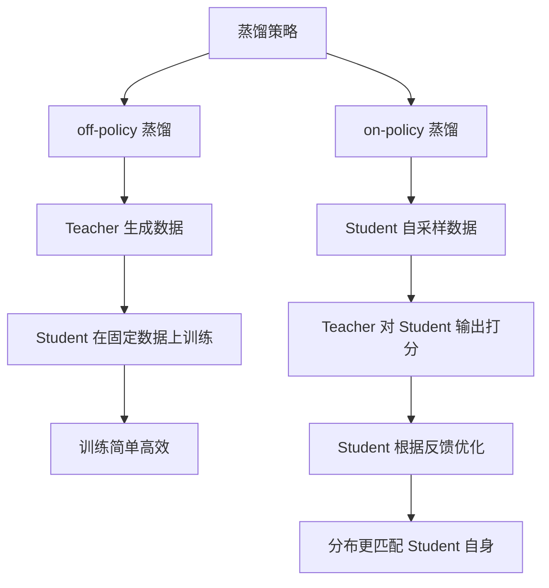

| 特性 | off-policy 蒸馏 | on-policy 蒸馏 |
|------|----------------|----------------|
| 数据来源 | Teacher 预先生成 | Student 实时采样 |
| 训练效率 | 高（离线数据） | 低（需在线交互） |
| 分布匹配 | Teacher 分布，可能偏离 Student | Student 自身分布 |
| 训练稳定性 | 稳定 | 可能不稳定 |
| 实现复杂度 | 低 | 高 |
| 适用场景 | 大规模数据蒸馏 | 精细化能力迁移 |
| 代表方法 | SeqKD、Self-Instruct | GKD、on-policy MiniLLM |

off-policy 蒸馏是工程上最实用的方案，而 on-policy 蒸馏在理论上能更好地对齐 Student 的推理分布。

### 逐步蒸馏（Step-level Distillation）

针对推理任务（如数学、代码），逐步蒸馏将复杂问题分解为中间推理步骤，让 Student 学习每一步的生成过程。

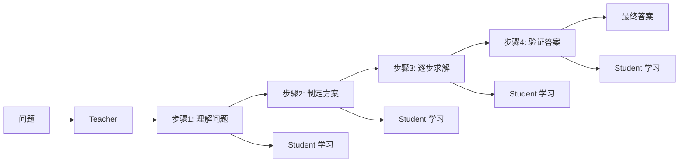

逐步蒸馏的关键在于：

1. **CoT 数据生成**：让 Teacher 输出详细的思维链（Chain-of-Thought）
2. **步骤对齐**：对每个推理步骤进行监督，而非只看最终答案
3. **过程奖励**：可结合过程奖励模型（PRM）对每步质量打分

逐步蒸馏的损失函数可以分解为：

$$
\mathcal{L}_{step} = \sum_{t=1}^{N} \mathcal{L}_{CE}(y_t^T, p_S(\cdot | x, y_{<t}^T))
$$

其中 $y_t^T$ 是 Teacher 在第 $t$ 步的输出 token。

### 对比蒸馏（Contrastive Distillation）

对比蒸馏利用对比学习思想，让 Student 学会区分 Teacher 认为好的输出和坏的输出。其核心是构建正负样本对，通过对比损失拉近正样本、推远负样本：

$$
\mathcal{L}_{contrast} = -\log \frac{\exp(sim(h_S^+, h_T) / \tau)}{\exp(sim(h_S^+, h_T) / \tau) + \sum_{k} \exp(sim(h_S^-, h_T) / \tau)}
$$

其中 $h_S^+$ 和 $h_S^-$ 分别是 Student 对正例和负例的表示，$h_T$ 是 Teacher 的表示，$\tau$ 是温度系数，$sim(\cdot)$ 是相似度函数。

对比蒸馏的优势在于：

- 不需要严格的 token 级对齐
- 能传递 Teacher 的偏好信息
- 对生成质量敏感，适合偏好对齐场景

### 强化学习蒸馏

强化学习蒸馏将 Teacher 的反馈作为奖励信号，通过 RL 算法优化 Student。这种方法在偏好对齐和能力迁移方面表现出色。

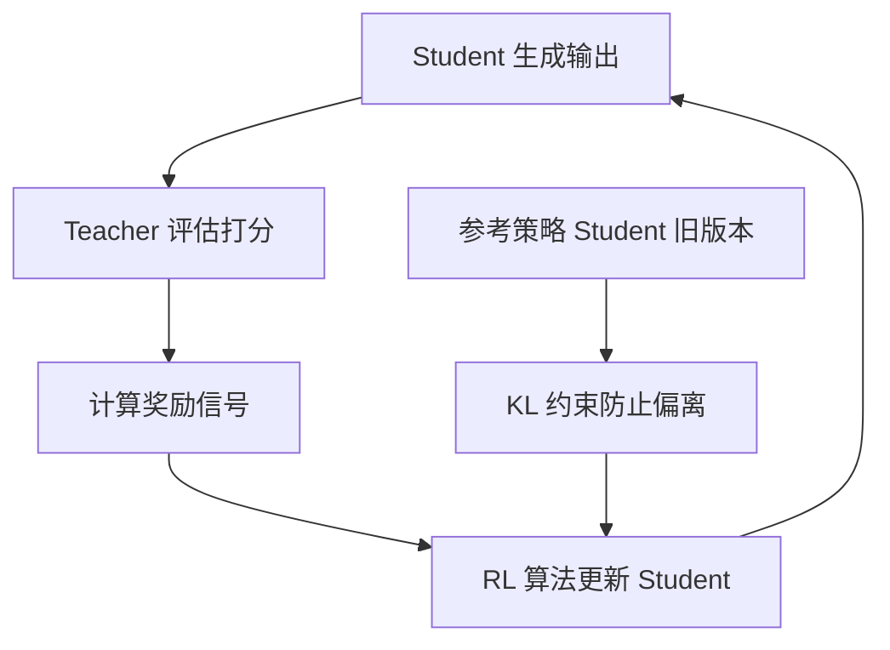

常见的强化学习蒸馏方法包括：

1. **Teacher 作为奖励模型**：Teacher 对 Student 输出打分，分数作为 RL 奖励
2. **DPO 风格蒸馏**：用 Teacher 构建偏好对，通过 DPO 优化 Student
3. **GKD（Generalized Knowledge Distillation）**：结合 on-policy 采样与 Teacher 反馈

以 GKD 为例，其目标函数为：

$$
\mathcal{L}_{GKD} = \mathbb{E}_{x \sim \mathcal{D}, y \sim \pi_S(\cdot|x)} \left[ D_{KL}(\pi_T(\cdot|x, y_{<t}) \| \pi_S(\cdot|x, y_{<t})) \right]
$$

关键区别在于 $y$ 是从 Student 自身分布 $\pi_S$ 中采样的，而非 Teacher 分布，从而实现了 on-policy 蒸馏。

## 蒸馏实践

### Teacher-Student 选型

蒸馏的第一步是选择合适的 Teacher 和 Student 模型。

#### Teacher 选型

Teacher 应具备足够强的能力，且与目标任务的能力域匹配：

| Teacher 类型 | 代表模型 | 优势 | 注意事项 |
|-------------|---------|------|---------|
| 闭源大模型 | GPT-4、Claude | 能力最强 | 仅黑盒蒸馏，API 成本高 |
| 开源大模型 | Qwen2.5-72B、Llama-3-70B | 白盒可访问 | 需要充足算力部署 |
| 同系列大模型 | Qwen2.5-72B → 7B | 词汇表对齐 | Logit 蒸馏首选 |
| 多 Teacher 集成 | 多模型投票 | 能力更全面 | 工程复杂度高 |

#### Student 选型

Student 应在部署成本和能力之间取得平衡：

| Student 规模 | 参数量 | 适用场景 | 代表模型 |
|-------------|-------|---------|---------|
| 极小模型 | 0.5B~1.5B | 端侧部署、实时场景 | Qwen2.5-0.5B、TinyLlama |
| 小模型 | 1.5B~7B | 通用服务、成本敏感 | Qwen2.5-7B、Llama-3-8B |
| 中模型 | 7B~14B | 平衡性能与成本 | Qwen2.5-14B |
| 同架构压缩 | - | 白盒 Logit 蒸馏 | DistilBERT、TinyBERT |

**选型建议**：Teacher 和 Student 最好同源同架构，便于 Logit 蒸馏和词汇表对齐；若只能黑盒蒸馏，则 Student 选型更自由。

### 数据准备

蒸馏数据的质量直接决定蒸馏效果。以下是数据准备的关键环节：

#### 数据来源

1. **开源指令数据集**：如 Alpaca、ShareGPT、OpenOrca
2. **Teacher 生成数据**：用 Teacher 对种子指令扩展生成
3. **领域数据**：根据目标场景收集领域特定数据
4. **合成数据增强**：通过 Evol-Instruct 等方法提升数据复杂度

#### 数据质量过滤

```python
import re

def quality_filter(instruction, output, min_len=20, max_len=4096):
    """简单的数据质量过滤"""
    # 长度过滤
    if len(output) < min_len or len(output) > max_len:
        return False
    # 重复过滤
    if instruction.strip() == output.strip():
        return False
    # 乱码检测
    if re.search(r'[^\w\s\u4e00-\u9fff.,!?;:\'"(){}\[\]@#$%^&*+-=/<>\|`~]', output):
        pass  # 根据实际需求调整
    # 检查是否包含实质内容
    if len(set(output.split())) < 5:
        return False
    return True


def deduplicate(data, key="instruction", threshold=0.9):
    """基于简单文本相似度的去重"""
    seen = []
    result = []
    for item in data:
        text = item[key]
        is_dup = False
        for s in seen:
            # 简单的 Jaccard 相似度
            set_a = set(text.split())
            set_b = set(s.split())
            if set_a and set_b:
                sim = len(set_a & set_b) / len(set_a | set_b)
                if sim > threshold:
                    is_dup = True
                    break
        if not is_dup:
            seen.append(text)
            result.append(item)
    return result


# 使用示例
raw_data = [json.loads(line) for line in open("distillation_data.jsonl", encoding="utf-8")]
filtered = [d for d in raw_data if quality_filter(d["instruction"], d["output"])]
deduped = deduplicate(filtered)
print(f"原始: {len(raw_data)} → 过滤后: {len(filtered)} → 去重后: {len(deduped)}")
```

### 训练配置

以下是一个使用 Hugging Face Transformers 实现 LLM 蒸馏的完整示例：

```python
import torch
from transformers import (
    AutoModelForCausalLM,
    AutoTokenizer,
    TrainingArguments,
    Trainer,
)
from datasets import load_dataset


class DistillationTrainer(Trainer):
    """自定义蒸馏 Trainer"""

    def __init__(self, teacher=None, temperature=4.0, alpha=0.5, *args, **kwargs):
        super().__init__(*args, **kwargs)
        self.teacher = teacher
        self.temperature = temperature
        self.alpha = alpha
        # 冻结 Teacher
        if self.teacher is not None:
            self.teacher.eval()
            for p in self.teacher.parameters():
                p.requires_grad = False

    def compute_loss(self, model, inputs, return_outputs=False, **kwargs):
        labels = inputs.pop("labels")
        # Student 前向传播
        student_outputs = model(**inputs)
        student_logits = student_outputs.logits

        # 硬标签损失（标准交叉熵）
        loss_ce = torch.nn.functional.cross_entropy(
            student_logits.view(-1, student_logits.size(-1)),
            labels.view(-1),
            ignore_index=-100,
        )

        # 软标签损失（KL 散度）
        if self.teacher is not None:
            with torch.no_grad():
                teacher_outputs = self.teacher(**inputs)
                teacher_logits = teacher_outputs.logits

            # 带温度的软标签
            soft_teacher = torch.nn.functional.log_softmax(
                teacher_logits / self.temperature, dim=-1
            )
            soft_student = torch.nn.functional.log_softmax(
                student_logits / self.temperature, dim=-1
            )
            loss_kd = torch.nn.functional.kl_div(
                input=soft_student,
                target=soft_teacher.exp(),
                reduction="batchmean",
            ) * (self.temperature ** 2)

            total_loss = (1 - self.alpha) * loss_ce + self.alpha * loss_kd
        else:
            total_loss = loss_ce

        return (total_loss, student_outputs) if return_outputs else total_loss


def main():
    teacher_name = "Qwen/Qwen2.5-72B-Instruct"
    student_name = "Qwen/Qwen2.5-7B"

    tokenizer = AutoTokenizer.from_pretrained(student_name)
    if tokenizer.pad_token is None:
        tokenizer.pad_token = tokenizer.eos_token

    # 加载 Student（可训练）
    student = AutoModelForCausalLM.from_pretrained(
        student_name,
        torch_dtype=torch.bfloat16,
        device_map="auto",
    )

    # 加载 Teacher（冻结）
    teacher = AutoModelForCausalLM.from_pretrained(
        teacher_name,
        torch_dtype=torch.bfloat16,
        device_map="auto",
    )

    # 加载蒸馏数据集
    dataset = load_dataset("json", data_files="distillation_data.jsonl", split="train")

    def tokenize_fn(examples):
        # 拼接 instruction 和 output
        texts = [
            f"### 指令:\n{inst}\n\n### 回答:\n{out}"
            for inst, out in zip(examples["instruction"], examples["output"])
        ]
        result = tokenizer(
            texts,
            truncation=True,
            max_length=2048,
            padding="max_length",
        )
        result["labels"] = result["input_ids"].copy()
        return result

    tokenized = dataset.map(tokenize_fn, batched=True, remove_columns=dataset.column_names)

    # 训练参数
    training_args = TrainingArguments(
        output_dir="./distilled-student",
        num_train_epochs=3,
        per_device_train_batch_size=4,
        gradient_accumulation_steps=8,
        learning_rate=2e-5,
        warmup_ratio=0.03,
        lr_scheduler_type="cosine",
        logging_steps=20,
        save_strategy="epoch",
        bf16=True,
        gradient_checkpointing=True,
        report_to="tensorboard",
    )

    # 初始化蒸馏 Trainer
    trainer = DistillationTrainer(
        teacher=teacher,
        temperature=4.0,
        alpha=0.5,
        model=student,
        args=training_args,
        train_dataset=tokenized,
        tokenizer=tokenizer,
    )

    # 开始训练
    trainer.train()

    # 保存蒸馏后的模型
    trainer.save_model("./distilled-student-final")
    tokenizer.save_pretrained("./distilled-student-final")


if __name__ == "__main__":
    main()
```

### 超参数调优

蒸馏过程中的关键超参数及其推荐范围：

| 超参数 | 推荐范围 | 作用 | 调优建议 |
|-------|---------|------|---------|
| 温度 $T$ | 2~10 | 控制软标签平滑度 | 从 4 开始，能力差距大时增大 |
| 平衡因子 $\alpha$ | 0.3~0.7 | 软硬标签权重 | 数据少时增大 $\alpha$ |
| 学习率 | 1e-5~5e-5 | 训练步长 | 比 SFT 略小 |
| Batch Size | 32~128（等效） | 梯度估计稳定性 | 尽量大，配合梯度累积 |
| 训练轮数 | 2~5 | 训练充分度 | 监控验证集损失 |
| 预热比例 | 0.03~0.1 | 训练初期稳定 | 配合余弦退火 |

**调优经验**：

1. 温度 $T$ 与 $\alpha$ 需要联合调优，$T$ 越大通常需要 $\alpha$ 略小
2. 当 Teacher 和 Student 能力差距大时，适当增大 $T$ 以传递更多暗知识
3. 学习率不宜过大，否则容易破坏 Student 预训练知识
4. 使用早停策略防止过拟合 Teacher 的特定模式

## 蒸馏效果评估

### 评估指标

蒸馏效果需要从多个维度评估：

| 评估维度 | 指标 | 说明 |
|---------|------|------|
| 任务准确率 | MMLU、CMMLU、C-Eval | 综合知识能力 |
| 数学推理 | GSM8K、MATH | 推理能力保持度 |
| 代码生成 | HumanEval、MBPP | 代码能力 |
| 生成质量 | MT-Bench、AlpacaEval | 对话与指令跟随 |
| 推理速度 | tokens/s | 部署效率提升 |
| 模型大小 | 参数量、显存占用 | 压缩比 |

### 蒸馏效果对比

以下为典型蒸馏案例的效果对比（数据为示意性参考）：

| 模型 | 参数量 | MMLU | GSM8K | 推理速度 | 蒸馏方法 |
|------|-------|------|-------|---------|---------|
| Teacher (72B) | 72B | 82.3 | 89.5 | 1x | - |
| Student 原始 (7B) | 7B | 68.5 | 72.1 | 10x | - |
| + SeqKD | 7B | 73.2 | 78.6 | 10x | 序列级蒸馏 |
| + Logit KD | 7B | 74.8 | 80.3 | 10x | Logit 蒸馏 |
| + RL 蒸馏 | 7B | 75.5 | 82.1 | 10x | GKD + DPO |
| Student (1.5B) | 1.5B | 55.2 | 48.3 | 25x | - |
| + 黑盒蒸馏 | 1.5B | 62.8 | 58.7 | 25x | GPT-4 数据蒸馏 |

可以看出，经过有效蒸馏，Student 在保持 10x~25x 推理速度优势的同时，能力可逼近 Teacher 的 80%~90%。

## 蒸馏的挑战与前沿

### 能力丢失问题

蒸馏过程中最普遍的问题是**能力丢失**（Capability Loss）：Student 无法完全继承 Teacher 的所有能力，尤其在以下方面：

- **长尾知识**：低频出现的知识容易被 Student 遗忘
- **复杂推理**：多步推理能力难以通过简单 SFT 迁移
- **指令遵循**：细微的指令理解差异在蒸馏中可能丢失
- **安全对齐**：Teacher 的安全边界可能无法完整迁移

缓解能力丢失的策略包括：

1. **多轮迭代蒸馏**：分阶段蒸馏不同能力维度
2. **混合数据**：蒸馏数据中混入原始预训练数据
3. **能力加权采样**：对弱能力领域增加数据权重
4. **混合精度蒸馏**：对不同能力使用不同蒸馏强度

### 多能力蒸馏

现实场景中，Student 需要同时具备多种能力（代码、数学、对话、推理等）。多能力蒸馏的挑战在于：

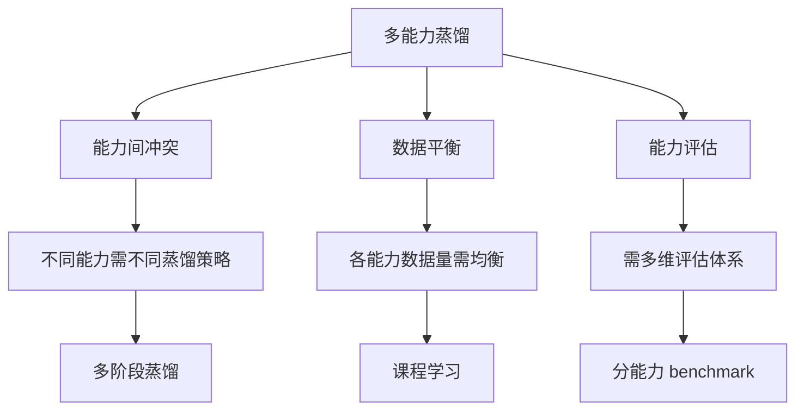

常见做法是采用**课程学习**（Curriculum Learning）：先蒸馏基础能力（如语言理解），再逐步加入高级能力（如推理、代码），最后进行综合能力对齐。

### 自蒸馏与迭代蒸馏

自蒸馏（Self-Distillation）是指模型将自身的知识蒸馏给自己或自身的不同部分，无需外部 Teacher：

- **Self-KD**：模型将自己作为 Teacher，通过不同 dropout / 数据增强产生软标签
- **迭代蒸馏**：将蒸馏后的 Student 作为新的 Teacher，再蒸馏更小的模型

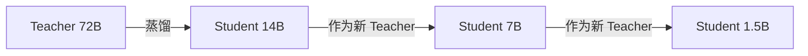

迭代蒸馏的风险是**误差累积**——每一轮蒸馏都会损失部分能力，越靠后的 Student 能力越弱。缓解方法是在每轮迭代中混入原始 Teacher 的数据。

### 跨模态蒸馏

跨模态蒸馏将一种模态的知识迁移到另一种模态。例如：

- **视觉 → 语言**：用视觉模型蒸馏多模态语言模型
- **文本 → 图像**：用文本模型的语义理解辅助图像生成
- **大模型 → 小模型（跨架构）**：Decoder-only Teacher 蒸馏 Encoder-Decoder Student

跨模态蒸馏的核心挑战在于**模态对齐**——不同模态的特征空间不同，需要设计合适的对齐机制。

## 经典案例

### DistilBERT

DistilBERT 是知识蒸馏在 NLP 领域最经典的成功案例之一。它将 BERT-base（1.1 亿参数）蒸馏为仅有 6600 万参数的小模型。

**技术要点**：

- 采用 Logit 蒸馏，损失函数为 $\mathcal{L} = 0.5 \cdot \mathcal{L}_{CE} + 0.5 \cdot T^2 \cdot \mathcal{L}_{KD}$
- 温度 $T$ 设为 4
- Student 保留 BERT 的一半层数（6 层 vs 12 层）
- 引入 cosine embedding loss 对齐隐状态

**效果**：

| 指标 | BERT-base | DistilBERT | 变化 |
|------|-----------|------------|------|
| 参数量 | 110M | 66M | -40% |
| 推理速度 | 1x | 1.6x | +60% |
| GLUE 平均 | 79.5 | 77.0 | -2.5 |

DistilBERT 以极小的性能损失换取了 40% 的参数压缩和 60% 的速度提升，验证了蒸馏在模型压缩上的巨大价值。

### TinyLlama

TinyLlama 是一个 1.1B 参数的小型语言模型，通过大规模预训练和蒸馏实现了远超同规模模型的能力。

**技术要点**：

- 基于 Llama-2 架构，参数量 1.1B
- 在 1T token 上进行预训练
- 结合知识蒸馏和持续预训练
- 采用课程学习策略逐步提升数据复杂度

**效果**：TinyLlama 在多个 benchmark 上超越了同等规模的 Pythia-1B 和 OPT-1.3B，证明了蒸馏 + 大规模预训练对小模型的重要性。

### GPT-4 → 小模型蒸馏实践

在实际工程中，将 GPT-4 的能力蒸馏到开源小模型是最常见的黑盒蒸馏场景。

**典型流程**：

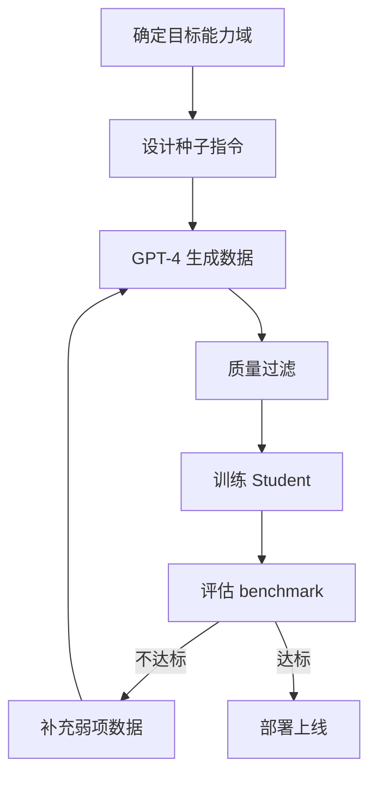

**实践要点**：

1. **数据多样性优先**：宁可数据少但多样，不要多但重复
2. **质量重于数量**：1 万条高质量数据 > 10 万条低质量数据
3. **分能力蒸馏**：针对代码、数学、对话分别构建数据集
4. **迭代优化**：基于评估结果持续补充弱项数据
5. **混合策略**：序列级蒸馏 + DPO 对齐效果最佳

## 结语

知识蒸馏是大模型从「能力强大」走向「高效落地」的关键桥梁。从 Hinton 2015 年的经典 KD 方法，到面向大语言模型的序列级蒸馏、黑盒蒸馏和强化学习蒸馏，蒸馏技术体系日益丰富。

回顾全文，几个核心要点值得铭记：

1. **Logit 蒸馏**信息最丰富但需要白盒访问，**序列级蒸馏**工程最友好，**黑盒蒸馏**适用性最广
2. **数据质量**是蒸馏成功的第一要素，远比方法选择更重要
3. **温度系数**和**平衡因子**是最关键的超参数，需要联合调优
4. 蒸馏不是一蹴而就的，**迭代蒸馏**和**多能力蒸馏**是前沿方向
5. 蒸馏的本质是**知识迁移**，而非简单的模型压缩

在实践层面，建议从最简单的序列级蒸馏（Teacher 生成数据 + Student SFT）入手，逐步引入 Logit 蒸馏和 RL 蒸馏以追求更高性能。同时，始终将数据质量放在首位——这是所有蒸馏实践成功的共同基石。

大模型时代，蒸馏技术让强大的人工智能能力不再被少数巨头垄断，而是能够以低成本、高效率的方式服务于千行百业。掌握蒸馏技术，就是掌握了将 AI 能力规模化落地的钥匙。

---

**参考文献**：

1. Hinton G, et al. Distilling the Knowledge in a Neural Network. NeurIPS Workshop 2015.
2. Sanh V, et al. DistilBERT, a distilled version of BERT. 2019.
3. Kim S, et al. Sequence-Level Knowledge Distillation. EMNLP 2016.
4. Gu T, et al. MiniLLM: Knowledge Distillation of Large Language Models. ICLR 2024.
5. Xu Y, et al. A Survey on Knowledge Distillation of Large Language Models. 2024.
6. Jiao X, et al. TinyBERT: Distilling BERT for Natural Language Understanding. Findings of EMNLP 2020.
7. Agarwal R, et al. On-Policy Distillation of Language Models: Learning from Self-Generated Mistakes. ICLR 2024.
8. Wang Y, et al. Self-Instruct: Aligning Language Models with Self-Generated Instructions. ACL 2023.
