## 引言

大语言模型（LLM）的训练并非一蹴而就，而是一个多阶段、多目标的复杂工程。从原始的互联网文本到最终能够安全、有用、诚实地回答用户问题的对话助手，模型需要经历一条精心设计的训练链路。

典型的现代大模型训练流程可以分为三个核心阶段：

1. **预训练（Pre-training）**：在海量无标注文本上学习语言的通用规律和世界知识
2. **监督微调（SFT, Supervised Fine-Tuning）**：在高质量指令-响应对上学习跟随指令的能力
3. **对齐（Alignment）**：通过 RLHF 或 DPO 等方法，使模型的输出符合人类偏好与价值观

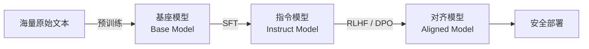

### 为什么需要多阶段训练

有人可能会问：为什么不直接在预训练阶段就让模型学会所有能力？多阶段训练的必要性在于：

- **目标冲突**：预训练的目标是「预测下一个词」，而用户需要的是「给出有帮助的回答」，两者的优化方向并不完全一致
- **数据差异**：预训练数据是海量但低质量的无标注文本，SFT 和对齐阶段需要少量但高质量的标注数据
- **效率考量**：分阶段训练可以让每个阶段专注于一个子目标，避免在冲突目标之间反复拉扯
- **安全可控**：对齐阶段为模型注入了安全约束，防止模型输出有害内容

本文将系统拆解大模型训练的每个阶段，从理论原理到代码实践，帮助读者建立完整的训练链路认知。

## 训练全流程全景图

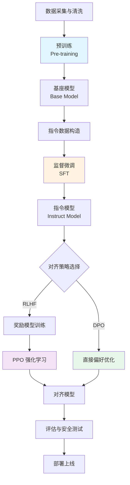

全景图展示了从原始数据到最终部署的完整链路。值得注意的是，RLHF 和 DPO 是两条可选的对齐路径——RLHF 需要先训练奖励模型再进行强化学习，而 DPO 则绕过奖励模型直接优化偏好。后续章节将详细解析每个环节。

## 预训练（Pre-training）

预训练是大模型训练链路中计算量最大、耗时最长、成本最高的阶段。一个千亿参数模型的预训练通常需要数千张 GPU 运行数月，消耗数百万美元的算力资源。

### 预训练目标

现代大语言模型几乎都采用**因果语言建模（Causal Language Modeling, CLM）**作为预训练目标，即自回归地预测下一个 token。给定一个文本序列 $W = w_1, w_2, \ldots, w_T$，模型需要最大化该序列的似然：

$$
\mathcal{L}_{\text{CLM}} = -\sum_{t=1}^{T} \log P(w_t \mid w_{<t}; \theta)
$$

其中 $\theta$ 是模型参数，$w_{<t}$ 表示第 $t$ 个 token 之前的所有 token。这个目标函数本质上是负对数似然（NLL），通过最小化它，模型学会了根据历史上下文预测下一个词。

除了 CLM 之外，还有一些变体目标：

- **掩码语言建模（MLM）**：BERT 使用的方法，随机遮盖部分 token 并预测它们，但不适合生成式模型
- **去噪目标**：对输入文本加入噪声，让模型学习恢复原始文本
- **填充目标**：FIM（Fill-In-the-Middle），在文档中间留空让模型补全，增强代码补全能力

> 对于现代 decoder-only 架构（如 GPT、LLaMA），CLM 是绝对的预训练主流。

### 数据工程

预训练数据的质量直接决定了模型的能力上限。业界有一句格言：**"Garbage In, Garbage Out"**。数据工程的投入往往比模型架构的调优更加重要。

#### 数据处理流水线

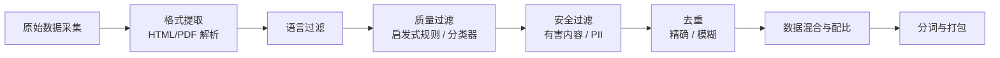

各环节的核心要点：

| 环节 | 方法 | 说明 |
|------|------|------|
| 格式提取 | Trafilatura、resiliparse | 从 HTML 中提取正文，去除导航、广告等噪声 |
| 语言过滤 | fastText 分类器 | 保留目标语言文本，过滤语言混杂内容 |
| 质量过滤 | 启发式规则 + ML 分类器 | 过滤乱码、重复模板、低质量内容 |
| 安全过滤 | 正则 + 模型 | 移除个人隐私信息（PII）和有害内容 |
| 去重 | MinHash + LSH | 精确去重和模糊去重，减少数据冗余 |

#### 数据配比策略

不同类型数据对模型能力的影响不同，合理的数据配比至关重要：

| 数据类型 | 典型占比 | 培养的能力 |
|----------|----------|------------|
| 网页文本 | 40-60% | 通用语言能力、常识知识 |
| 书籍 | 10-20% | 长文本理解、逻辑推理 |
| 代码 | 10-20% | 编程能力、结构化思维 |
| 学术论文 | 5-10% | 专业知识、学术写作 |
| 对话数据 | 5-10% | 多轮对话能力 |

> LLaMA 2 的预训练数据中代码占比约 4.5%，而 DeepSeek-Coder 等代码模型则将代码占比提升至 80% 以上。

### 训练配置

#### 分布式训练策略

大模型的预训练无法在单张 GPU 上完成，必须采用分布式训练。三种核心并行策略如下：

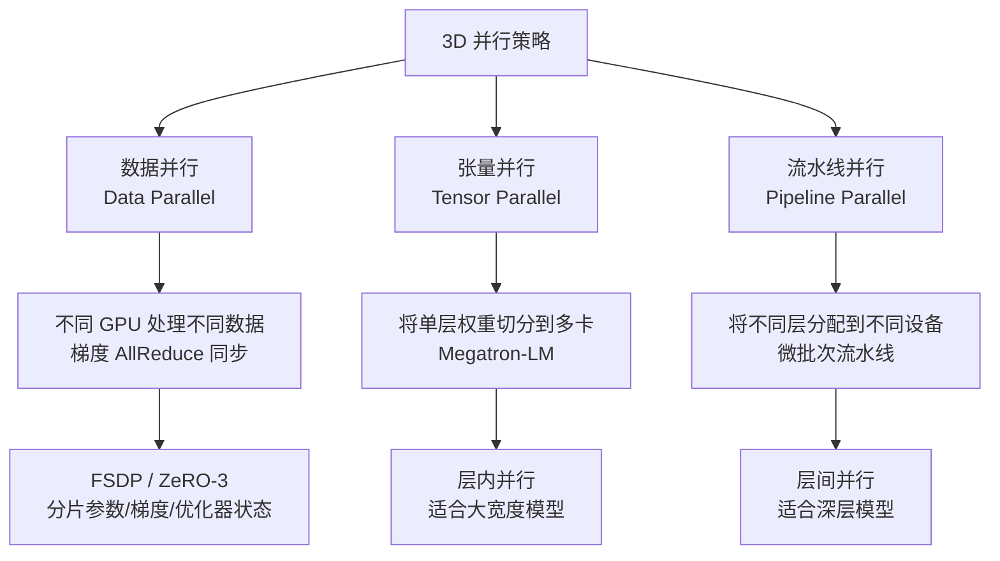

三者的对比如下：

| 并行策略 | 切分维度 | 通信开销 | 显存节省 | 典型工具 |
|----------|----------|----------|----------|----------|
| 数据并行（DP） | 数据 | 高（AllReduce） | 低 | DDP、FSDP |
| 张量并行（TP） | 权重矩阵 | 中（层内通信） | 中 | Megatron-LM |
| 流水线并行（PP） | 模型层 | 低（层间通信） | 高 | PipeDream、GPipe |

实际训练中通常组合使用，形成 **3D 并行**：数据并行 × 张量并行 × 流水线并行。例如，在 1024 张 GPU 上训练时，可以配置为 DP=8, TP=8, PP=16。

#### ZeRO 优化

DeepSpeed 提出的 ZeRO（Zero Redundancy Optimizer）通过分片存储消除数据并行中的冗余：

| 阶段 | 分片内容 | 显存节省 | 通信开销 |
|------|----------|----------|----------|
| ZeRO-1 | 优化器状态 | 4x | 与 DP 相同 |
| ZeZero-2 | 优化器状态 + 梯度 | 8x | 略高于 DP |
| ZeRO-3 | 优化器状态 + 梯度 + 参数 | ~Nx | 显著增加 |

> FSDP（Fully Sharded Data Parallel）是 PyTorch 原生的 ZeRO-3 实现，已成为大规模训练的事实标准。

### Scaling Law

Scaling Law 描述了模型性能与计算量、数据量、参数规模之间的幂律关系。OpenAI 提出的经典形式为：

$$
L(N, D) = \left(\frac{N_c}{N}\right)^{\alpha_N} + \left(\frac{D_c}{D}\right)^{\alpha_D} + L_\infty
$$

其中 $N$ 为参数量，$D$ 为数据量，$L$ 为损失，$N_c$、$D_c$、$\alpha_N$、$\alpha_D$、$L_\infty$ 为拟合常数。

Chinchilla 论文进一步指出，在固定计算预算 $C$ 下，最优的参数量 $N^*$ 和数据量 $D^*$ 应近似满足：

$$
N^* \propto C^{0.5}, \quad D^* \propto C^{0.5}
$$

即**模型参数和训练数据应等比例增长**。这意味着一个 70B 参数的模型应该用约 1.4 万亿 token 来训练（每个参数约 20 个 token）。

### 训练监控

预训练过程中的关键监控指标：

| 指标 | 正常表现 | 异常信号 |
|------|----------|----------|
| 训练 Loss | 持续下降，逐渐收敛 | 突然飙升（梯度爆炸）或停滞 |
| 梯度范数 | 稳定在合理范围 | 趋近于零（梯度消失）或突增 |
| 学习率 | Warmup 后按 cosine 衰减 | 过高导致震荡，过低导致收敛慢 |
| 吞吐量 | 稳定的 tokens/s | 突然下降（I/O 瓶颈或硬件故障） |
| 验证 Loss | 与训练 Loss 趋势一致 | 明显偏离训练 Loss（过拟合） |

典型的学习率调度策略：

$$
\eta(t) = \begin{cases}
\eta_{\max} \cdot \frac{t}{T_{\text{warmup}}} & \text{if } t < T_{\text{warmup}} \\
\eta_{\min} + \frac{1}{2}\left(\eta_{\max} - \eta_{\min}\right)\left(1 + \cos\left(\pi \cdot \frac{t - T_{\text{warmup}}}{T - T_{\text{warmup}}}\right)\right) & \text{otherwise}
\end{cases}
$$

其中 $T_{\text{warmup}}$ 通常为总步数的 0.1%-1%，$\eta_{\max}$ 通常在 $1 \times 10^{-4}$ 到 $5 \times 10^{-4}$ 之间。

## 监督微调（SFT）

预训练后的基座模型虽然具备丰富的知识和语言能力，但它学到的是「续写文本」而非「回答问题」。如果直接向基座模型提问"什么是光合作用？"，它可能会续写更多问题而非给出答案。SFT 的任务就是让模型学会**跟随指令**。

### SFT 的目标

SFT 通过高质量的指令-响应对（Instruction-Response pairs）来微调模型，使其学会在给定指令时生成恰当的回答。形式化地，给定输入 $x$ 和目标输出 $y = y_1, y_2, \ldots, y_T$，SFT 的损失函数为：

$$
\mathcal{L}_{\text{SFT}} = -\sum_{t=1}^{T} \log P(y_t \mid x, y_{<t}; \theta)
$$

注意，这里只对**响应部分**计算损失，输入指令 $x$ 的 token 不参与损失计算。这被称为 **completion-only loss** 或 **masked loss**。

### 指令数据构造

#### Self-Instruct 方法

Self-Instruct 是一种利用模型自身生成训练数据的方法：

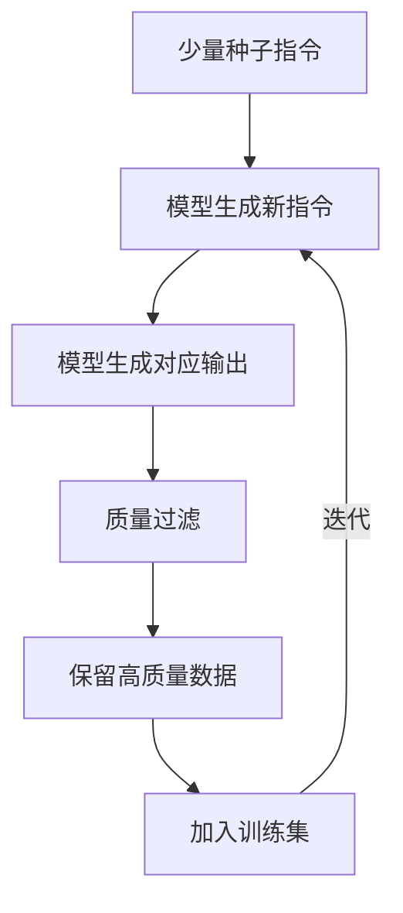

#### 数据格式

常见的指令数据格式有两种：

**Alpaca 格式**：

```json
{
  "instruction": "解释什么是递归",
  "input": "",
  "output": "递归是一种编程技术，函数在执行过程中调用自身..."
}
```

**ShareGPT 格式**（支持多轮对话）：

```json
{
  "conversations": [
    {"role": "user", "content": "什么是递归？"},
    {"role": "assistant", "content": "递归是一种编程技术..."},
    {"role": "user", "content": "给我一个 Python 例子"},
    {"role": "assistant", "content": "def factorial(n): ..."}
  ]
}
```

#### 人工标注 vs 模型生成

| 维度 | 人工标注 | 模型生成 |
|------|----------|----------|
| 质量 | 高，但受标注者水平限制 | 依赖种子模型质量 |
| 成本 | 极高（每条 $5-20） | 低（API 调用费用） |
| 规模 | 有限（万级） | 大（百万级） |
| 多样性 | 受标注者思维限制 | 可通过提示控制多样性 |
| 典型案例 | LIMA（1K 条） | Alpaca（52K 条） |

> LIMA 论文证明，仅需 1,000 条高质量人工标注数据就能显著提升模型的指令跟随能力，说明**数据质量远比数量重要**。

### SFT 训练实践

以下是一个使用 Hugging Face Transformers 进行 SFT 的完整代码示例：

```python
import torch
from datasets import Dataset
from transformers import (
    AutoModelForCausalLM,
    AutoTokenizer,
    TrainingArguments,
    Trainer,
    DataCollatorForSeq2Seq,
)

# =====================
# 1. 加载模型和分词器
# =====================
model_path = "meta-llama/Llama-3-8B"
tokenizer = AutoTokenizer.from_pretrained(model_path, trust_remote_code=True)
tokenizer.pad_token = tokenizer.eos_token

model = AutoModelForCausalLM.from_pretrained(
    model_path,
    torch_dtype=torch.bfloat16,
    device_map="auto",
)

# =====================
# 2. 准备数据
# =====================
data = [
    {
        "instruction": "将下面的句子翻译成英文",
        "input": "今天天气真好",
        "output": "The weather is really nice today.",
    },
    # ... 更多数据
]

def format_prompt(example):
    """构造提示模板"""
    if example.get("input"):
        prompt = (
            f"Below is an instruction that describes a task, "
            f"paired with an input that provides further context. "
            f"Write a response that appropriately completes the request.\n\n"
            f"### Instruction:\n{example['instruction']}\n\n"
            f"### Input:\n{example['input']}\n\n"
            f"### Response:\n"
        )
    else:
        prompt = (
            f"Below is an instruction that describes a task. "
            f"Write a response that appropriately completes the request.\n\n"
            f"### Instruction:\n{example['instruction']}\n\n"
            f"### Response:\n"
        )
    return prompt

def preprocess(example):
    """对单条数据进行编码，仅对响应部分计算损失"""
    prompt = format_prompt(example)
    response = example["output"]

    # 编码完整序列
    prompt_ids = tokenizer(prompt, add_special_tokens=False)["input_ids"]
    response_ids = tokenizer(response + tokenizer.eos_token, add_special_tokens=False)["input_ids"]
    input_ids = prompt_ids + response_ids

    # 构造 labels：prompt 部分设为 -100（不计算损失）
    labels = [-100] * len(prompt_ids) + response_ids

    return {
        "input_ids": input_ids,
        "labels": labels,
        "attention_mask": [1] * len(input_ids),
    }

dataset = Dataset.from_list(data)
tokenized_dataset = dataset.map(preprocess, remove_columns=dataset.column_names)

# =====================
# 3. 训练配置
# =====================
training_args = TrainingArguments(
    output_dir="./sft_output",
    num_train_epochs=3,
    per_device_train_batch_size=4,
    gradient_accumulation_steps=4,  # 有效 batch size = 16
    learning_rate=2e-5,
    warmup_ratio=0.03,
    lr_scheduler_type="cosine",
    logging_steps=10,
    save_strategy="epoch",
    bf16=True,                       # 使用 bfloat16 混合精度
    gradient_checkpointing=True,     # 节省显存
    report_to="tensorboard",
)

data_collator = DataCollatorForSeq2Seq(
    tokenizer=tokenizer,
    padding=True,
    return_tensors="pt",
)

# =====================
# 4. 启动训练
# =====================
trainer = Trainer(
    model=model,
    args=training_args,
    train_dataset=tokenized_dataset,
    data_collator=data_collator,
)

trainer.train()
trainer.save_model("./sft_output/final")
```

> 如果使用 LoRA 进行参数高效微调，只需在加载模型后添加 PEFT 配置，可将可训练参数降至原模型的 0.1%-1%。

### SFT 的注意事项

#### 灾难性遗忘

微调过程中模型可能遗忘预训练阶段获得的知识。缓解方法：

- 使用较小的学习率（$1 \times 10^{-5}$ 到 $5 \times 10^{-5}$）
- 在训练数据中混入部分预训练数据
- 使用 LoRA 等参数高效方法，冻结原始权重
- 采用多任务训练，避免单任务过拟合

#### 过拟合

SFT 数据量通常较小（数千到数万条），容易过拟合。建议：

- 监控验证集 Loss，使用 early stopping
- 训练 2-5 个 epoch，不宜过多
- 使用 dropout 正则化
- 保证数据多样性，避免模板化

#### 数据质量 > 数量

| 数据规模 | 数据质量 | 效果 |
|----------|----------|------|
| 52K 条 | 一般（模型生成） | 基本可用 |
| 10K 条 | 高（人工精标） | 表现优秀 |
| 1K 条 | 极高（专家标注） | 接近大模型 |

> 经验法则：宁可花时间精标 1,000 条高质量数据，也不要用 50,000 条低质量数据"灌水"。

## 基于人类反馈的强化学习（RLHF）

SFT 让模型学会了跟随指令，但"跟随指令"不等于"给出好的回答"。什么才是"好"的回答？这涉及到人类的主观偏好——有用性、诚实性、无害性（HHH）。RLHF 通过引入人类反馈来优化这一目标。

### RLHF 三阶段

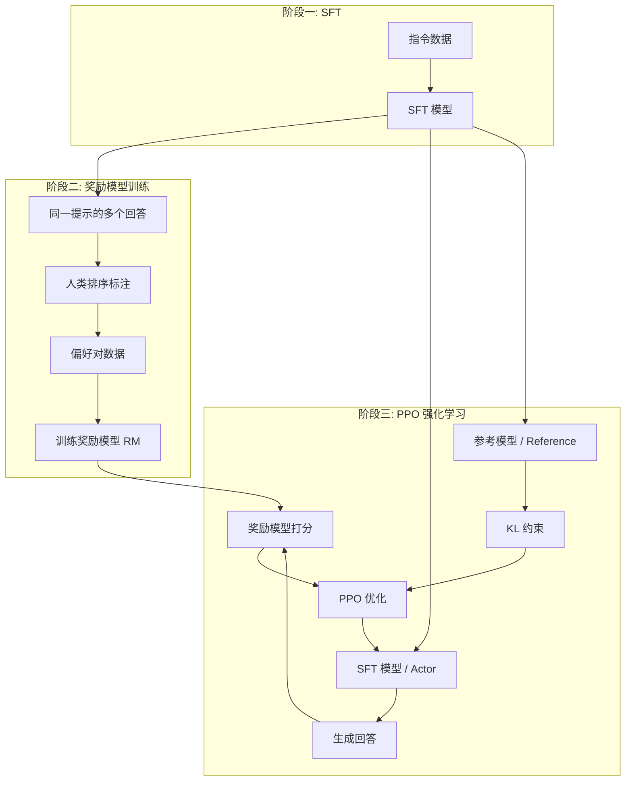

### 奖励模型训练

#### 偏好数据收集

对于同一个提示 $x$，让模型生成多个回答 $y_1, y_2, \ldots, y_k$，然后由人类标注员对这些回答进行排序。从排序中可以构造偏好对 $(x, y_w, y_l)$，其中 $y_w$ 是更好的回答（winner），$y_l$ 是较差的回答（loser）。

#### Bradley-Terry 模型

奖励模型采用 Bradley-Terry 模型将排序转化为概率：

$$
P(y_w \succ y_l \mid x) = \sigma(r(x, y_w) - r(x, y_l))
$$

其中 $r(x, y)$ 是奖励模型对输入 $x$ 和输出 $y$ 给出的标量奖励值，$\sigma$ 是 sigmoid 函数。

对应的损失函数为：

$$
\mathcal{L}_{\text{RM}} = -\log \sigma(r(x, y_w) - r(x, y_l))
$$

奖励模型通常使用 SFT 模型初始化，将最后的语言建模头替换为一个输出标量的回归头。

### PPO 优化

#### PPO 算法原理

PPO（Proximal Policy Optimization）是 OpenAI 提出的策略优化算法，通过限制策略更新幅度来保证训练稳定性。核心思想是计算新旧策略的比率：

$$
r_t(\theta) = \frac{\pi_\theta(a_t \mid s_t)}{\pi_{\theta_{\text{old}}}(a_t \mid s_t)}
$$

然后使用 clipped surrogate objective：

$$
\mathcal{L}_{\text{PPO}} = \mathbb{E}\left[\min\left(r_t A_t, \; \text{clip}(r_t, 1-\epsilon, 1+\epsilon) A_t\right)\right]
$$

其中 $A_t$ 是优势函数（Advantage），$\epsilon$ 是裁剪参数（通常取 0.2）。

#### KL 散度惩罚

在 RLHF 中，为了避免策略模型偏离 SFT 模型太远（导致语言能力退化），需要加入 KL 散度惩罚：

$$
\mathcal{L}_{\text{RLHF}} = \mathcal{L}_{\text{PPO}} - \beta \, \mathbb{E}\left[D_{\text{KL}}\left(\pi_\theta(\cdot \mid x) \;\|\; \pi_{\text{ref}}(\cdot \mid x)\right)\right]
$$

其中 $\pi_{\text{ref}}$ 是冻结的参考模型（通常是 SFT 模型），$\beta$ 是 KL 惩罚系数（通常取 0.01-0.5）。

#### PPO 训练流程

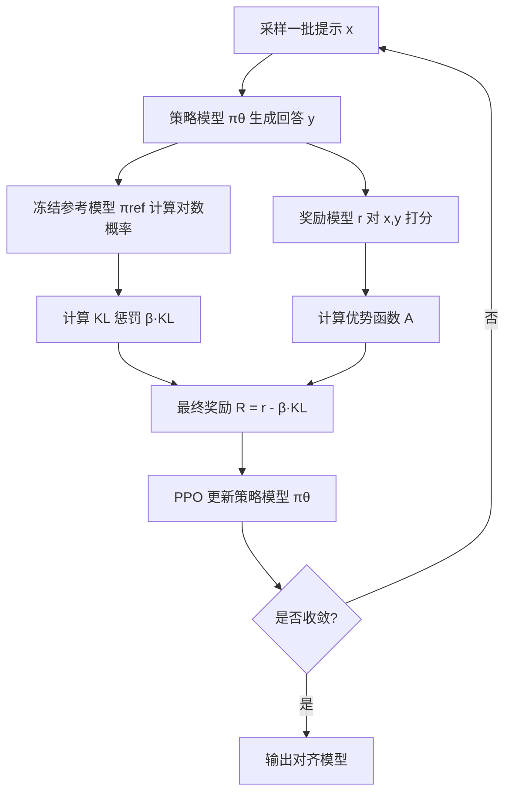

### PPO 实践

以下是使用 TRL（Transformer Reinforcement Learning）库进行 PPO 训练的代码示例：

```python
import torch
from trl import PPOTrainer, PPOConfig, AutoModelForCausalLMWithValueHead
from transformers import AutoTokenizer
from datasets import Dataset

# =====================
# 1. 加载模型
# =====================
model_name = "your-sft-model-path"

# 策略模型（带 Value Head）
model = AutoModelForCausalLMWithValueHead.from_pretrained(
    model_name,
    torch_dtype=torch.bfloat16,
)

# 参考模型（冻结）
ref_model = AutoModelForCausalLMWithValueHead.from_pretrained(
    model_name,
    torch_dtype=torch.bfloat16,
)

tokenizer = AutoTokenizer.from_pretrained(model_name)
tokenizer.pad_token = tokenizer.eos_token

# =====================
# 2. PPO 配置
# =====================
ppo_config = PPOConfig(
    model_name=model_name,
    learning_rate=1.5e-5,
    batch_size=32,
    mini_batch_size=4,
    gradient_accumulation_steps=8,
    ppo_epochs=4,
    kl_penalty="kl",
    target_kl=6.0,          # 目标 KL 散度
    init_kl_coef=0.2,       # 初始 KL 系数
    adaptive_kl=True,       # 自适应 KL 系数
    cliprange=0.2,          # PPO 裁剪范围
    vf_coef=0.1,            # Value 函数损失系数
)

# =====================
# 3. 准备数据
# =====================
# 假设已有奖励模型（或使用 sentiment 模型作为示例）
dataset = Dataset.from_dict({
    "query": [
        "写一首关于春天的诗",
        "解释什么是量子纠缠",
        # ... 更多提示
    ]
})

def tokenize_fn(sample):
    sample["input_ids"] = tokenizer.encode(sample["query"], return_tensors="pt")
    return sample

dataset = dataset.map(tokenize_fn)

# =====================
# 4. 初始化 PPO Trainer
# =====================
ppo_trainer = PPOTrainer(
    config=ppo_config,
    model=model,
    ref_model=ref_model,
    tokenizer=tokenizer,
    dataset=dataset,
)

# =====================
# 5. 奖励函数（示例：使用奖励模型）
# =====================
def reward_model_score(prompts, responses):
    """用奖励模型对 (prompt, response) 打分"""
    # 实际使用时替换为你的奖励模型推理逻辑
    scores = []
    for p, r in zip(prompts, responses):
        inputs = reward_tokenizer(p + r, return_tensors="pt", truncation=True)
        with torch.no_grad():
            score = reward_model(**inputs).logits.item()
        scores.append(score)
    return scores

# =====================
# 6. 训练循环
# =====================
generation_kwargs = {
    "min_length": -1,
    "top_k": 0.0,
    "top_p": 1.0,
    "do_sample": True,
    "pad_token_id": tokenizer.eos_token_id,
    "max_new_tokens": 256,
}

for epoch in range(10):
    for batch in ppo_trainer.dataloader:
        # 获取提示
        query_tensors = batch["input_ids"]

        # 策略模型生成回答
        response_tensors = ppo_trainer.generate(
            query_tensors,
            return_prompt=False,
            **generation_kwargs,
        )
        responses = tokenizer.batch_decode(response_tensors)

        # 奖励模型打分
        queries = tokenizer.batch_decode(query_tensors)
        rewards = reward_model_score(queries, responses)

        # PPO 优化步
        stats = ppo_trainer.step(
            queries=query_tensors,
            responses=response_tensors,
            scores=rewards,
        )
        print(f"Epoch {epoch}: KL={stats.get('objective/kl', 0):.4f}, "
              f"reward={stats.get('ppo/returns/mean', 0):.4f}")

# 保存最终模型
ppo_trainer.save_model("./ppo_output/final")
```

### RLHF 的挑战

| 挑战 | 描述 | 缓解方法 |
|------|------|----------|
| 训练不稳定 | PPO 对超参数极其敏感，容易发散 | 仔细调参，自适应 KL 系数，gradient clipping |
| 奖励黑客 | 模型学会利用奖励模型的漏洞获取高分而非真正提升质量 | 多个奖励模型集成，定期更新奖励模型 |
| 计算成本高 | 需要同时维护 4 个模型（策略、参考、奖励、价值） | 使用 LoRA 减少显存，或转向 DPO |
| 标注成本高 | 需要大量人工偏好标注 | RLAIF、合成偏好数据 |
| 探索效率低 | 模型容易陷入局部最优 | 增大采样温度，多样性采样策略 |

> 有研究表明，PPO 训练中约 30% 的实验会因为超参数设置不当而失败，这也是 DPO 等简化方法兴起的重要原因。

## DPO（Direct Preference Optimization）

RLHF 虽然效果显著，但其训练流程复杂、不稳定且成本高昂。DPO 的出现提供了一种优雅的替代方案——**绕过奖励模型和强化学习，直接从偏好数据优化策略模型**。

### DPO 的动机

RLHF 的核心假设是：存在一个奖励函数 $r(x, y)$ 可以衡量回答质量。但 DPO 的作者指出，在特定的 RL 目标下，最优策略 $\pi^*$ 可以直接用奖励函数表示：

$$
\pi^*(y \mid x) = \frac{1}{Z(x)} \pi_{\text{ref}}(y \mid x) \exp\left(\frac{r(x, y)}{\beta}\right)
$$

反过来，奖励函数可以用策略模型表示：

$$
r(x, y) = \beta \log \frac{\pi^*(y \mid x)}{\pi_{\text{ref}}(y \mid x)} + \beta \log Z(x)
$$

这意味着我们可以**跳过奖励模型的训练，直接从偏好数据优化策略模型**。

### DPO 原理

将上面的奖励函数代入 Bradley-Terry 模型，$Z(x)$ 项在偏好对中消去，得到：

$$
P(y_w \succ y_l \mid x) = \sigma\left(\beta \log \frac{\pi_\theta(y_w \mid x)}{\pi_{\text{ref}}(y_w \mid x)} - \beta \log \frac{\pi_\theta(y_l \mid x)}{\pi_{\text{ref}}(y_l \mid x)}\right)
$$

因此 DPO 的损失函数为：

$$
\mathcal{L}_{\text{DPO}} = -\log \sigma\left(\beta \log \frac{\pi_\theta(y_w \mid x)}{\pi_{\text{ref}}(y_w \mid x)} - \beta \log \frac{\pi_\theta(y_l \mid x)}{\pi_{\text{ref}}(y_l \mid x)}\right)
$$

其中：
- $\pi_\theta$ 是待训练的策略模型
- $\pi_{\text{ref}}$ 是冻结的参考模型（通常是 SFT 模型）
- $\beta$ 是温度参数，控制偏离参考模型的程度（通常取 0.1-0.5）
- $y_w$ 和 $y_l$ 分别是偏好数据中的好回答和差回答

DPO 的巧妙之处在于：它将一个强化学习问题转化为了一个**简单的二分类问题**——让模型学会给好回答分配比差回答更高的概率（相对于参考模型）。

### DPO vs PPO

| 维度 | PPO | DPO |
|------|-----|-----|
| 训练阶段 | 3 阶段（SFT + RM + PPO） | 2 阶段（SFT + DPO） |
| 需要奖励模型 | 是 | 否 |
| 需要参考模型 | 是 | 是（仅前向传播，不训练） |
| 同时加载模型数 | 4（策略+参考+奖励+价值） | 2（策略+参考） |
| 训练稳定性 | 低，需精细调参 | 高，类似标准交叉熵 |
| 超参数敏感度 | 高 | 低 |
| 在线/离线 | 在线（需要采样生成） | 离线（直接用预存数据） |
| 探索能力 | 强（可发现新策略） | 弱（受限于离线数据） |
| 计算成本 | 高 | 低（约为 PPO 的 1/3-1/2） |
| 典型效果 | 上限略高 | 接近 PPO，部分场景更优 |

### DPO 实践

以下是使用 TRL 库进行 DPO 训练的代码示例：

```python
import torch
from datasets import Dataset
from transformers import AutoModelForCausalLM, AutoTokenizer
from trl import DPOTrainer, DPOConfig

# =====================
# 1. 加载模型和分词器
# =====================
model_path = "your-sft-model-path"
tokenizer = AutoTokenizer.from_pretrained(model_path)
tokenizer.pad_token = tokenizer.eos_token

# 策略模型（可训练）
model = AutoModelForCausalLM.from_pretrained(
    model_path,
    torch_dtype=torch.bfloat16,
    device_map="auto",
)

# 参考模型（冻结，TRL 会自动创建冻结副本）
ref_model = AutoModelForCausalLM.from_pretrained(
    model_path,
    torch_dtype=torch.bfloat16,
    device_map="auto",
)

# =====================
# 2. 准备偏好数据
# =====================
# DPO 需要的偏好数据格式：(prompt, chosen, rejected)
dataset = Dataset.from_dict({
    "prompt": [
        "写一个 Python 函数计算斐波那契数列",
        "解释什么是梯度下降",
    ],
    "chosen": [
        "```python\ndef fibonacci(n):\n    if n <= 1:\n        return n\n    a, b = 0, 1\n    for _ in range(n - 1):\n        a, b = b, a + b\n    return b\n```",
        "梯度下降是一种优化算法，通过沿损失函数的负梯度方向迭代更新参数，逐步找到损失最小值。",
    ],
    "rejected": [
        "```python\ndef fib(n):\n    return fib(n-1) + fib(n-2)\n```",
        "梯度下降就是往下走找最低点。",
    ],
})

# =====================
# 3. DPO 配置
# =====================
dpo_config = DPOConfig(
    output_dir="./dpo_output",
    num_train_epochs=3,
    per_device_train_batch_size=2,
    gradient_accumulation_steps=8,
    learning_rate=5e-6,        # DPO 通常用较小的学习率
    warmup_ratio=0.1,
    lr_scheduler_type="cosine",
    logging_steps=10,
    save_strategy="epoch",
    bf16=True,
    beta=0.1,                   # DPO 温度参数
    max_prompt_length=512,
    max_length=1024,
    loss_type="sigmoid",         # 标准 DPO 损失
)

# =====================
# 4. 初始化 DPO Trainer 并训练
# =====================
dpo_trainer = DPOTrainer(
    model=model,
    ref_model=ref_model,
    args=dpo_config,
    train_dataset=dataset,
    tokenizer=tokenizer,
)

dpo_trainer.train()
dpo_trainer.save_model("./dpo_output/final")
```

### DPO 变体

DPO 的简洁框架催生了一系列变体，各自针对 DPO 的某些局限进行改进：

| 方法 | 核心改进 | 损失函数特点 | 适用场景 |
|------|----------|-------------|----------|
| **IPO**（Identity PO） | 解决 DPO 过拟合偏好数据的问题 | $\mathcal{L} = \left(\log\sigma(\hat{r}) - \frac{1}{2}\right)^2$ | 偏好数据较少时 |
| **KTO**（Kahneman-Tversky Opt.） | 不需要成对数据，只需二元反馈（好/坏） | 基于前景理论的损失 | 只有点赞/点踩数据 |
| **ORPO**（Odds Ratio PO） | 将 SFT 和偏好优化合为一步 | SFT Loss + 惨率比惩罚 | 省去 SFT 阶段 |
| **SimPO**（Simple PO） | 去除参考模型，用长度归一化奖励 | $\mathcal{L} = -\log\sigma\left(\frac{\beta}{|y_w|}\log\pi(y_w) - \frac{\beta}{|y_l|}\log\pi(y_l) - \gamma\right)$ | 降低推理和训练成本 |
| **cDPO**（Conservative DPO） | 考虑偏好标签噪声 | 加入标签翻转概率 | 标注质量不均时 |

#### KTO 的独特优势

KTO 的最大特点是**不需要成对的偏好数据**。它只需要知道某个回答是"好的"还是"坏的"：

$$
\mathcal{L}_{\text{KTO}} = \begin{cases}
-\log\sigma\left(\beta \log\frac{\pi_\theta(y|x)}{\pi_{\text{ref}}(y|x)} - z_{\text{ref}}\right) & \text{if } y \text{ is desirable} \\
-\log\sigma\left(z_{\text{ref}} - \beta \log\frac{\pi_\theta(y|x)}{\pi_{\text{ref}}(y|x)}\right) & \text{if } y \text{ is undesirable}
\end{cases}
$$

这使得 KTO 可以直接利用用户的点赞/点踩数据，大幅降低了数据收集成本。

#### SimPO 的简化

SimPO 完全去除了参考模型，用回答自身的对数概率作为隐式奖励，并加入长度归一化：

$$
\mathcal{L}_{\text{SimPO}} = -\log\sigma\left(\frac{\beta}{|y_w|}\log\pi_\theta(y_w \mid x) - \frac{\beta}{|y_l|}\log\pi_\theta(y_l \mid x) - \gamma\right)
$$

其中 $\gamma$ 是目标奖励间隔。这使得训练时只需加载一个模型，进一步降低了显存需求。

## 其他对齐方法

### RLAIF（AI 反馈强化学习）

RLAIF 用 AI 代替人类进行偏好标注，将 RLHF 中最昂贵的环节自动化：

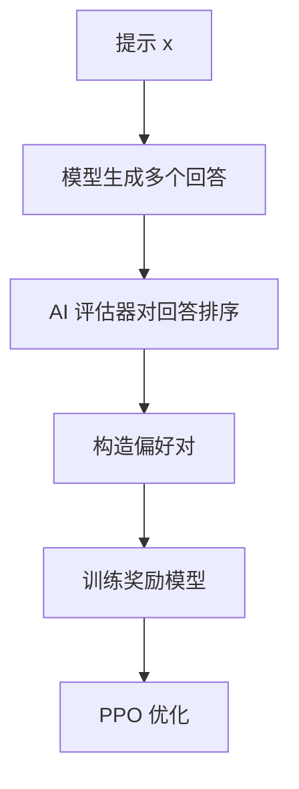

研究表明，在某些任务上 RLAIF 的效果可以接近 RLHF，而成本仅为后者的极小部分。但 AI 评估器自身的偏见可能被传递到最终模型中。

### Constitutional AI

Anthropic 提出的 Constitutional AI（CAI）结合了 RLAIF 和规则约束：

1. **监督阶段**：给模型一组"宪法"原则（如"不要输出有害内容"），让模型根据这些原则修改自己的回答，然后用修改后的数据进行 SFT
2. **RLAIF 阶段**：让模型根据宪法原则对回答进行偏好排序，再进行 RLHF

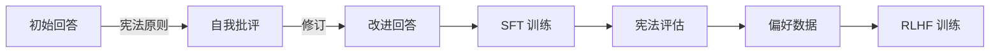

> Claude 系列模型正是基于 Constitutional AI 方法训练的，其"宪法"包含约 200 条原则。

### SPA（Self-Play Alignment）

自博弈对齐让两个模型实例互相博弈来提升能力：

- **生成器**：尝试产生好的回答
- **判别器**：尝试区分好回答和坏回答

两者交替训练，形成类似 GAN 的对抗结构。SPIN（Self-Play fIne-tuNing）是该方向的代表方法，通过让模型区分自身生成的内容和人类参考回答来实现自我提升。

## 训练流程实践指南

### 各阶段推荐配置

| 配置项 | 预训练 | SFT | DPO | PPO |
|--------|--------|-----|-----|-----|
| 学习率 | $1\text{-}5 \times 10^{-4}$ | $1\text{-}5 \times 10^{-5}$ | $5 \times 10^{-7}\text{-}5 \times 10^{-6}$ | $1\text{-}5 \times 10^{-5}$ |
| Batch Size | 数百万 token | $32\text{-}128$ | $16\text{-}64$ | $32\text{-}128$ |
| Epoch | 1 | $2\text{-}5$ | $1\text{-}3$ | 持续训练 |
| 优化器 | AdamW | AdamW | AdamW | AdamW |
| 学习率调度 | Cosine + Warmup | Cosine + Warmup | Linear + Warmup | Constant / Linear |
| 精度 | BF16 | BF16 | BF16 | BF16 |
| 梯度裁剪 | 1.0 | 1.0 | 1.0 | 0.2-1.0 |
| 预热比例 | 0.1%-1% | 3% | 10% | - |

### 数据规模建议

| 阶段 | 数据量 | 数据质量要求 | 说明 |
|------|--------|-------------|------|
| 预训练 | 1T-15T tokens | 中等 | 规模比质量更关键，但仍需清洗 |
| SFT | 1K-100K 条 | 极高 | 质量远比数量重要 |
| 偏好数据（DPO/PPO） | 5K-100K 对 | 高 | 多样性和标注一致性 |
| 奖励模型 | 10K-1M 对 | 高 | 标注一致性至关重要 |

> 经验法则：SFT 数据每增加 10 倍，效果提升递减。从 1K 到 10K 的提升远大于从 10K 到 100K。

### 常见问题排查

| 问题 | 可能原因 | 解决方案 |
|------|----------|----------|
| 预训练 Loss 不下降 | 学习率过高/过低 | 检查学习率，检查梯度是否爆炸 |
| 预训练 Loss 突然飙升 | 梯度爆炸 | 降低学习率，增加 gradient clipping，检查数据 |
| SFT 后模型回答重复 | 过拟合 / 数据质量问题 | 减少 epoch，检查数据多样性 |
| SFT 后语言能力退化 | 灾难性遗忘 | 降低学习率，使用 LoRA，混入预训练数据 |
| DPO 训练 Loss 不下降 | 学习率过低 / 数据质量问题 | 调高学习率，检查偏好数据标注质量 |
| DPO 后模型过于保守 | $\beta$ 过大 | 降低 $\beta$（如 0.1 → 0.05） |
| PPO 奖励不提升 | 探索不足 / 奖励模型问题 | 增大采样温度，检查奖励模型 |
| PPO 后模型输出乱码 | KL 约束失效 | 增大 $\beta$，减小 PPO cliprange |
| 对齐后模型过于啰嗦 | 奖励偏好长回答 | 在奖励中加入长度惩罚 |

## 前沿方向

### 预训练创新

#### 数据飞轮

数据飞轮是指利用部署后的模型收集用户反馈数据，经过清洗后反哺训练，形成正向循环：

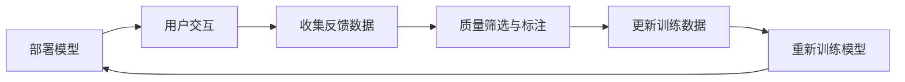

#### 课程学习

按照难度递增的顺序喂入训练数据，让模型从简单到复杂逐步学习：

- 初期：简单、短文本、高质量数据
- 中期：增加文本长度和复杂度
- 后期：引入困难样本和长尾知识

研究表明，课程学习可以在相同计算预算下获得更好的性能。

### 对齐新方法

#### 在线 DPO

标准 DPO 是离线的——它只能从预收集的偏好数据中学习。在线 DPO 则在训练过程中动态生成回答并收集反馈：

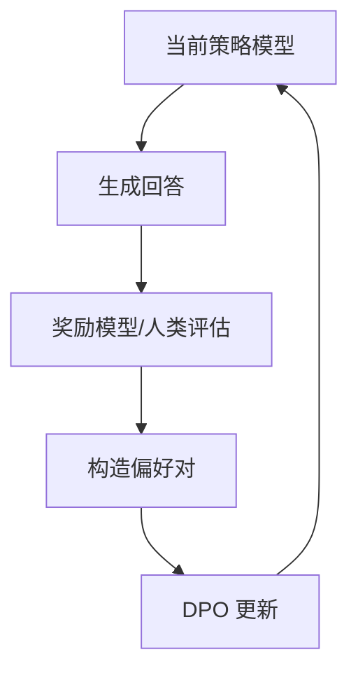

在线 DPO 结合了 PPO 的探索能力和 DPO 的训练稳定性，是当前的研究热点之一。

#### 迭代 DPO

迭代 DPO 进行多轮 DPO 训练，每轮用上一轮的模型生成新的回答：

1. 用 SFT 模型生成回答，收集偏好 → DPO 训练得到模型 v1
2. 用模型 v1 生成回答，收集偏好 → DPO 训练得到模型 v2
3. 重复...

这种方法可以在没有 PPO 复杂性的情况下逐步提升模型质量。

### 合并预训练与对齐

传统流程中预训练和对齐是严格分离的。最新的研究尝试将两者融合：

- **在预训练阶段加入指令数据**：在预训练数据的后期阶段混入高质量指令数据
- **持续训练**：在对齐后继续进行预训练，防止知识遗忘
- **联合优化**：同时优化 CLM 和对齐目标

这种方法可以减少训练阶段数，降低总体成本，但需要更精细的超参数调节。

## 结语

大模型训练是一个系统工程，每个阶段都有其独特的目标和方法：

- **预训练**赋予模型知识和语言能力，是整个流程的基础
- **SFT**让模型学会跟随指令，从"续写者"变成"回答者"
- **对齐**（RLHF/DPO）让模型变得有用、诚实、无害，从"回答者"变成"助手"

选择哪种对齐方法取决于具体场景：

- 追求最高效果且有充足资源 → **PPO**
- 追求稳定性和效率 → **DPO**
- 只有二元反馈数据 → **KTO**
- 希望省去 SFT → **ORPO**
- 希望去除参考模型 → **SimPO**

> 无论选择哪种方法，记住一个原则：**数据质量是模型能力的天花板**。再好的算法也无法弥补低质量数据带来的缺陷。

随着研究的不断推进，大模型训练的流程正在变得更简洁、更高效、更民主化。从 GPT-3 的纯预训练到 InstructGPT 的 RLHF，再到 DPO 的直接优化，每一次简化都让更多人能够参与到模型训练中来。未来，我们有理由期待更加优雅和高效的训练范式出现。

## 参考文献

1. Ouyang L, et al. Training language models to follow instructions with human feedback. NeurIPS 2022.
2. Rafailov R, et al. Direct Preference Optimization: Your Language Model is Secretly a Reward Model. NeurIPS 2023.
3. Schulman J, et al. Proximal Policy Optimization Algorithms. arXiv:1707.06347, 2017.
4. Bai Y, et al. Constitutional AI: Harmlessness from AI Feedback. arXiv:2212.08073, 2022.
5. Yuan W, et al. Self-Rewarding Language Models. ICML 2024.
6. Hu E J, et al. LoRA: Low-Rank Adaptation of Large Language Models. ICLR 2022.
7. Ethayarajh K, et al. KTO: Model Alignment as Prospect Theoretic Optimization. ICML 2024.
8. Meng Y, et al. SimPO: Simple Preference Optimization with a Reference-Free Reward. NeurIPS 2024.
9. Hong J, et al. ORPO: Monolithic Preference Optimization without Reference Model. EMNLP 2024.
10. Hoffmann J, et al. Training Compute-Optimal Large Language Models (Chinchilla). NeurIPS 2022.
