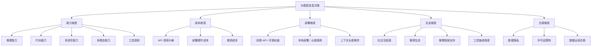
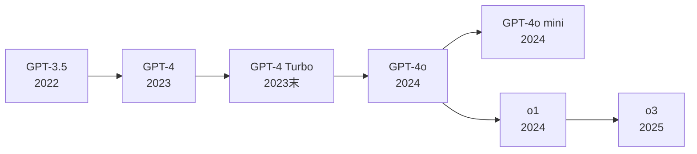
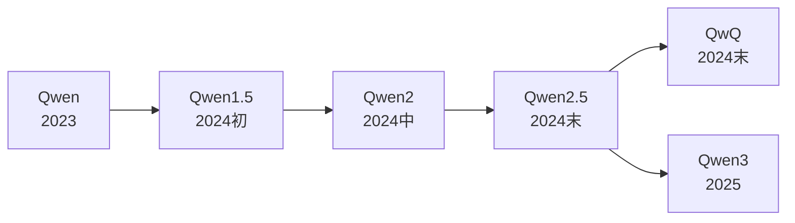
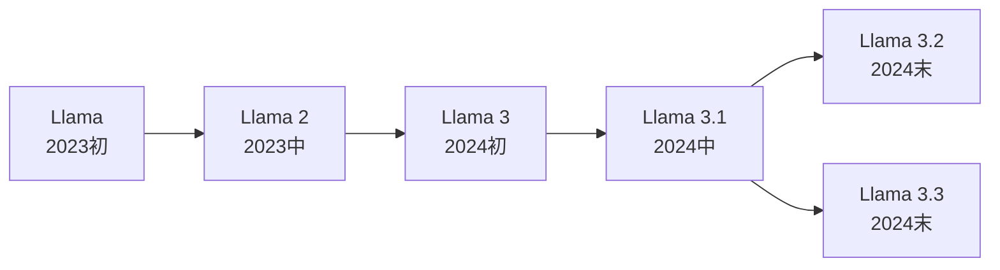
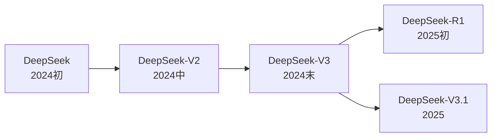
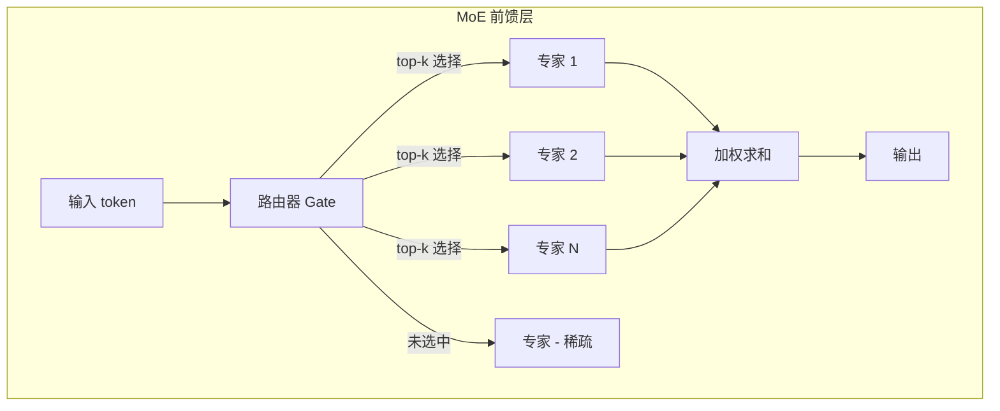
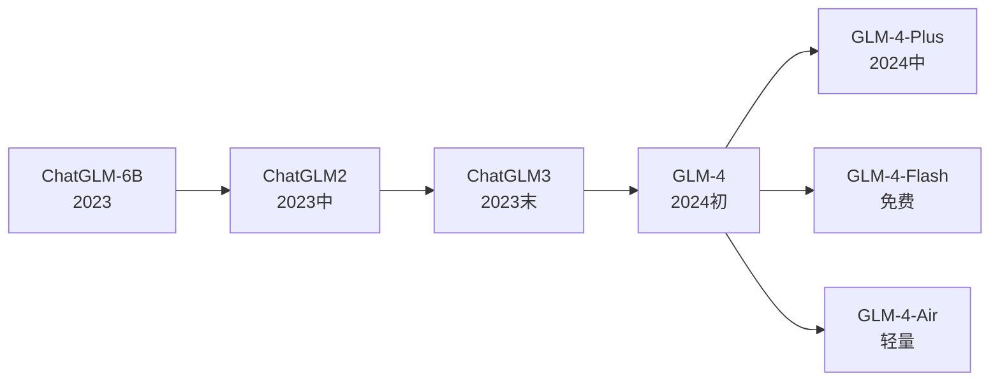
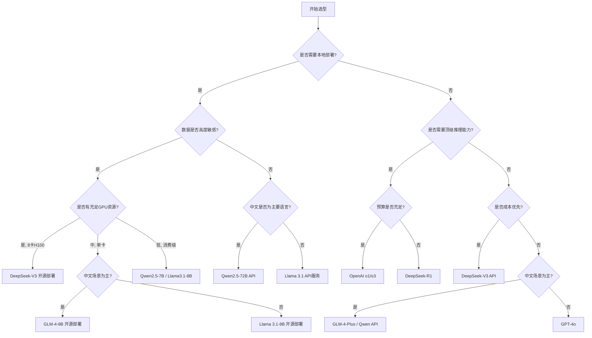

## 引言

2025 年以来，大语言模型领域呈现出前所未有的百花齐放态势。OpenAI 的 GPT 系列持续领跑闭源阵营，Meta 的 Llama、阿里巴巴的 Qwen、深度求索的 DeepSeek 以及智谱 AI 的 GLM 则在开源与商用之间开辟了各自的差异化路线。对于开发者和企业而言，面对如此众多的选择，**模型选型已经成为一项关键的技术决策**——它直接影响产品的能力上限、运营成本、数据合规和技术自主性。

选型的核心矛盾在于**闭源与开源的权衡**。闭源模型（如 GPT 系列）通常能力最强、生态最成熟，但存在数据隐私风险、API 依赖和长期成本不可控等问题；开源模型（如 Llama、Qwen）则提供了数据主权和部署灵活性，但在顶尖能力上可能存在差距。DeepSeek 和 GLM 则介于两者之间，以开源权重配合极低 API 价格的方式提供了独特的性价比路线。

本文将从选型维度框架出发，逐一深入解析 GPT、Qwen、Llama、DeepSeek、GLM 五大模型系列的技术特点，通过横向对比和决策树，为读者提供一份系统、可操作的选型指南。

## 选型维度框架

### 五大评估维度

大模型选型不是简单的"谁强选谁"，而是一个多维度的综合决策过程。我们将选型维度归纳为五个核心方面：



### 各维度详细说明

| 维度 | 关键考量点 | 适用场景 |
|------|-----------|---------|
| **能力** | 推理深度、代码生成质量、中英文表现、多模态支持、工具调用稳定性 | 对输出质量要求高的核心业务 |
| **成本** | API 每百万 token 价格、本地部署的 GPU 显存需求、微调数据与算力成本 | 大规模调用、预算敏感项目 |
| **部署** | 是否开源、支持本地部署、上下文窗口大小、并发吞吐能力 | 数据敏感场景、离线环境 |
| **生态** | HuggingFace 下载量、微调工具支持（LoRA/QLoRA）、推理引擎适配（vLLM/SGLang） | 需要深度定制和二次开发 |
| **合规** | 开源协议限制、数据出境风险、企业内部安全策略 | 金融、医疗、政务等强监管行业 |

> **实践建议**：选型时应首先明确"不可妥协的硬约束"（如必须本地部署、数据不可出境），在此基础上再对各候选模型的能力和成本进行权衡。

## GPT 系列（OpenAI）

### 模型谱系

GPT 系列是大语言模型时代的开创者，其发展历程清晰地映射了整个行业的技术演进：



| 模型 | 发布时间 | 核心特点 | 定位 |
|------|---------|---------|------|
| GPT-3.5 | 2022.11 | ChatGPT 的初始模型，对话能力强 | 入门级 |
| GPT-4 | 2023.03 | 多模态输入，推理能力大幅提升 | 旗舰级 |
| GPT-4 Turbo | 2023.11 | 128K 上下文，知识截止更新 | 高性能 |
| GPT-4o | 2024.05 | 原生多模态（文本/音频/图像），速度提升 2 倍 | 全能旗舰 |
| GPT-4o mini | 2024.07 | 轻量版，价格仅为 4o 的 1/15 | 高性价比 |
| o1 | 2024.09 | 推理模型，内置思维链，数学/代码极强 | 深度推理 |
| o3 | 2025.01 | 推理能力进一步增强，ARC-AGI 突破 | 顶尖推理 |

### 架构特点

GPT 系列采用经典的 **Dense Transformer** 解码器架构，其核心设计包括：

- **密集参数**：所有参数在每次推理中全部激活，不做稀疏路由（与 MoE 架构不同）
- **多模态融合**：GPT-4o 原生支持文本、图像、音频的统一编码与生成，而非外接模块
- **思维链推理**：o1/o3 系列引入了隐式思维链（Chain-of-Thought），在输出最终答案前进行内部推理，显著提升了复杂数学和编程任务的表现

GPT-4o 的多模态架构可以表示为：

$$
\text{output} = \text{Transformer}\left(\text{Embed}_{\text{text}}(x_t) \oplus \text{Embed}_{\text{vision}}(x_v) \oplus \text{Embed}_{\text{audio}}(x_a)\right)
$$

其中 $\oplus$ 表示模态特征的拼接融合，$\text{Embed}_{\text{modality}}$ 为各模态的编码器。

### 能力特点

GPT 系列在以下方面表现突出：

1. **综合推理**：GPT-4o 和 o1/o3 在 MMLU、GPQA 等综合推理基准上长期处于第一梯队
2. **代码生成**：HumanEval、LiveCodeBench 成绩领先，尤其 o1 在竞赛级编程上表现优异
3. **多模态理解**：GPT-4o 支持图像理解、语音对话，多模态融合能力业界最强
4. **工具调用**：Function Calling 机制成熟稳定，是构建 Agent 应用的首选
5. **指令遵循**：对复杂指令的理解和遵循能力出色，输出格式可控性强

### API 与定价

| 模型 | 上下文长度 | 输入价格 ($/1M tokens) | 输出价格 ($/1M tokens) | 特点 |
|------|-----------|----------------------|----------------------|------|
| GPT-4o | 128K | $2.50 | $10.00 | 全能旗舰 |
| GPT-4o mini | 128K | $0.15 | $0.60 | 极高性价比 |
| o1 | 200K | $15.00 | $60.00 | 深度推理 |
| o3 | 200K | $10.00 | $40.00 | 推理增强 |
| GPT-4 Turbo | 128K | $10.00 | $30.00 | 旧版旗舰 |

> **注意**：o1/o3 的输出价格包含推理 token，实际使用中推理 token 可能占总 token 的 50% 以上，需特别注意成本控制。

### 适用场景

- **通用对话与内容生成**：GPT-4o 是最稳妥的全能选择
- **复杂推理与数学证明**：o1/o3 在需要深度思考的场景中优势明显
- **多模态应用**：图像理解、语音交互等场景首选 GPT-4o
- **Agent 与工具调用**：成熟的 Function Calling 生态使其成为 Agent 开发的事实标准
- **快速原型验证**：GPT-4o mini 以极低成本提供接近旗舰的能力，适合 MVP 阶段

## Qwen 系列（阿里巴巴）

### 模型谱系

Qwen（通义千问）是阿里巴巴推出的大语言模型系列，以其全面的开源策略和均衡的中英文能力著称：



Qwen2.5 提供了从 0.5B 到 72B 的完整参数规模覆盖：

| 参数规模 | 模型名称 | 适用场景 | 显存需求 (FP16) |
|---------|---------|---------|----------------|
| 0.5B | Qwen2.5-0.5B | 端侧/移动设备 | ~1 GB |
| 1.5B | Qwen2.5-1.5B | 轻量级本地部署 | ~3 GB |
| 3B | Qwen2.5-3B | 边缘设备推理 | ~6 GB |
| 7B | Qwen2.5-7B | 通用本地部署 | ~14 GB |
| 14B | Qwen2.5-14B | 高质量本地推理 | ~28 GB |
| 32B | Qwen2.5-32B | 企业级部署 | ~64 GB |
| 72B | Qwen2.5-72B | 旗舰开源模型 | ~144 GB |

### 架构特点

Qwen 系列在标准 Transformer 架构基础上引入了多项优化：

- **GQA（分组查询注意力）**：将 Query 头分组共享 Key/Value，在保持性能的同时显著减少 KV Cache 显存占用
- **SwiGLU 激活函数**：结合 Swish 和 Gated Linear Unit，相比传统 ReLU 在大模型上表现更优
- **RoPE（旋转位置编码）**：支持长度外推，原生支持长上下文
- **Tie Embedding**：小模型（<3B）中绑定输入输出嵌入层参数，减少参数量
- **Dual Chunk Attention**：Qwen2.5 引入的长上下文注意力优化，支持 128K 上下文

SwiGLU 激活函数的定义为：

$$
\text{SwiGLU}(x, W, V) = \text{Swish}(xW) \otimes (xV)
$$

其中 $\text{Swish}(x) = x \cdot \sigma(\beta x)$，$\otimes$ 为逐元素乘法。

### 能力特点

Qwen 系列的能力特点体现在以下方面：

1. **中英文均衡**：在中文理解、中国文化常识方面表现突出，同时英文能力不逊于同规模竞品
2. **代码能力**：Qwen2.5-Coder 系列在 HumanEval 等代码基准上达到甚至超越同规模闭源模型
3. **数学推理**：Qwen2.5-Math 专门针对数学推理优化，QwQ 进一步引入思维链推理
4. **工具调用**：原生支持 Function Calling，ReAct 格式输出稳定
5. **多模态扩展**：Qwen-VL（视觉）、Qwen-Audio（语音）等多模态变体覆盖全面

### 开源策略

Qwen 采用了业界最开放的开源策略之一：

| 方面 | 详情 |
|------|------|
| 许可证 | Apache 2.0（绝大多数模型） |
| 商业使用 | 完全允许，无限制 |
| 模型权重 | HuggingFace / ModelScope 公开下载 |
| 训练细节 | 公开技术报告，含数据处理方法 |
| 衍生模型 | 允许微调后以自有协议发布 |

> Apache 2.0 是最宽松的开源协议之一，不限制商业使用、不要求开源衍生作品，对企业极其友好。

### 部署方式

Qwen 支持多种部署方案，覆盖从消费级 GPU 到企业集群的全场景：

```python
# 方式一：使用 Ollama 快速本地部署（适合个人开发者）
# 命令行: ollama run qwen2.5:7b

# 方式二：使用 vLLM 高性能部署（适合生产环境）
from vllm import LLM, SamplingParams

llm = LLM(
    model="Qwen/Qwen2.5-7B-Instruct",
    # 以下为可选优化参数
    tensor_parallel_size=1,        # GPU 并行数
    max_model_len=32768,           # 最大上下文长度
    quantization="awq",            # AWQ 量化，减少显存占用
    gpu_memory_utilization=0.9,    # GPU 显存利用率
)

sampling_params = SamplingParams(
    temperature=0.7,
    top_p=0.8,
    max_tokens=2048,
)

# 批量推理
prompts = ["请用三句话介绍量子计算。", "写一个 Python 快速排序函数。"]
outputs = llm.generate(prompts, sampling_params)
for output in outputs:
    print(output.outputs[0].text)
```

```python
# 方式三：使用 llama.cpp CPU/GPU 混合推理（适合资源受限环境）
# 需先下载 GGUF 格式模型文件
# 命令行: llama-cli -m qwen2.5-7b-instruct-q4_k_m.gguf -p "你好" -n 512

# Python 绑定调用
from llama_cpp import Llama

llm = Llama(
    model_path="./qwen2.5-7b-instruct-q4_k_m.gguf",
    n_ctx=4096,        # 上下文长度
    n_gpu_layers=35,   # 卸载到 GPU 的层数，0 表示纯 CPU
    verbose=False,
)

response = llm(
    "请解释什么是梯度消失问题。",
    max_tokens=512,
    temperature=0.7,
    stop=["<|im_end|>"],
)
print(response["choices"][0]["text"])
```

## Llama 系列（Meta）

### 模型谱系

Llama 是 Meta 推出的开源大语言模型系列，被公认为开源 LLM 生态的奠基者：



| 版本 | 参数规模 | 上下文长度 | 关键改进 |
|------|---------|-----------|---------|
| Llama | 7B / 13B / 33B / 65B | 2K | 初始版本，研究用途泄漏 |
| Llama 2 | 7B / 13B / 70B | 4K | 商用许可，Chat 版本 |
| Llama 3 | 8B / 70B | 8K | 训练数据量达 15T tokens |
| Llama 3.1 | 8B / 70B / 405B | 128K | 405B 旗舰，性能逼近 GPT-4 |
| Llama 3.2 | 1B / 3B / 11B / 90B | 128K | 多模态（视觉）+ 端侧小模型 |
| Llama 3.3 | 70B | 128K | 70B 参数达到 405B 级别性能 |

### 架构特点

Llama 系列采用标准的 **Dense Transformer** 解码器架构，技术选型稳健而成熟：

- **GQA（分组查询注意力）**：从 Llama 2 70B 起引入，后续版本全面采用
- **RoPE 位置编码**：全系列使用旋转位置编码，Llama 3.1 通过 RoPE 缩放扩展至 128K 上下文
- **SwiGLU 激活函数**：从初代 Llama 即采用，成为后续开源模型的标配
- **RMSNorm**：使用 Root Mean Square Normalization 替代 LayerNorm，计算更高效
- **词表扩展**：Llama 3 将词表从 32K 扩展至 128K，显著提升多语言编码效率

RMSNorm 的计算公式为：

$$
\text{RMSNorm}(x) = \frac{x}{\sqrt{\frac{1}{d}\sum_{i=1}^{d} x_i^2 + \epsilon}} \cdot \gamma
$$

相比标准 LayerNorm，RMSNorm 去除了均值减法操作，计算量减少约 7%-64%，且在大模型上效果几乎无损。

### 能力特点

Llama 系列的能力特点包括：

1. **英文最强开源**：Llama 3.1 405B 在 MMLU、HumanEval 等英文基准上接近或达到 GPT-4 水平
2. **社区生态丰富**：拥有最多的微调变体、量化方案和推理优化工具
3. **多语言支持**：Llama 3 系列训练数据涵盖 8% 的非英语数据，中文能力有所提升但仍不如 Qwen
4. **多模态扩展**：Llama 3.2 引入 Llama Vision，支持图像理解
5. **指令遵循**：Instruct 版本经过大量 RLHF 训练，对话和指令遵循能力优秀

### 许可证

Llama 采用**自定义许可证**（Llama License），并非标准的 Apache 2.0 或 MIT：

| 条款 | 详情 |
|------|------|
| 商业使用 | 允许（有条件） |
| 月活限制 | 7 亿月活以下免费使用，超过需向 Meta 申请许可 |
| 衍生模型 | 允许微调和衍生，但需标注 "Built with Llama" |
| 商标使用 | 禁止使用 Llama 名称命名衍生模型 |
| 合规要求 | 禁止用于违法用途，需遵守使用政策 |

> **注意**：7 亿月活的限制对绝大多数企业不构成实际影响，但对于超大规模平台（如月活数亿的社交应用）需要特别关注。

### 社区生态

Llama 拥有开源 LLM 中最庞大的社区生态，这是其最大的差异化优势：

| 生态维度 | 具体表现 |
|---------|---------|
| **微调模型** | 海量社区微调版本：CodeLlama（代码）、Llama Guard（安全）、Alpaca/Vicuna（对话）等 |
| **量化方案** | GGUF、AWQ、GPTQ、EXL2 等所有主流量化格式均首发支持 Llama |
| **推理框架** | vLLM、SGLang、TGI、llama.cpp、Ollama 等均以 Llama 为一等公民 |
| **教程资源** | HuggingFace 课程、社区博客、视频教程数量远超其他模型 |
| **评估基准** | 几乎所有新基准测试都会将 Llama 作为参考基线 |

## DeepSeek 系列（深度求索）

### 模型谱系

DeepSeek（深度求索）凭借在架构创新上的大胆突破，以极高的性价比在开源社区异军突起：



| 版本 | 参数量 | 激活参数 | 上下文 | 核心亮点 |
|------|-------|---------|--------|---------|
| DeepSeek-V2 | 236B | 21B | 128K | 首创 MLA 注意力，API 价格仅为 GPT-4 的 1% |
| DeepSeek-V3 | 671B | 37B | 128K | MoE 架构，性价比极致 |
| DeepSeek-R1 | 671B | 37B | 128K | 推理模型，纯 RL 训练达到 o1 水平 |

### 架构创新

DeepSeek 的核心竞争力在于其原创的架构创新，主要体现在三个方面：

#### MoE（混合专家）架构

DeepSeek-V3 采用了 671B 总参数、37B 激活参数的 MoE 架构，即每次推理只激活约 5.5% 的参数：



DeepSeek-V3 采用 256 个路由专家 + 1 个共享专家的细粒度 MoE 设计，每个 token 激活 8 个路由专家加 1 个共享专家。共享专家始终激活，负责通用知识；路由专家则根据输入动态选择，负责专精能力。

MoE 路由的数学表达为：

$$
\text{MoE}(x) = \text{Shared}(x) + \sum_{i \in \text{TopK}} g_i \cdot \text{Expert}_i(x)
$$

其中 $g_i$ 为路由权重，$\text{Shared}(x)$ 为共享专家的输出。

#### MLA（Multi-Head Latent Attention）

MLA 是 DeepSeek 独创的注意力机制，通过将 KV Cache 压缩到低维潜在空间，大幅减少推理时的显存占用：

标准注意力中，KV Cache 的大小为：

$$
\text{KV Cache} = 2 \times n_{\text{layers}} \times n_{\text{heads}} \times d_{\text{head}} \times \text{seq\_len}
$$

MLA 通过将 Key 和 Value 联合压缩为低维潜在向量 $c_{KV}$，将 KV Cache 大小降低为：

$$
\text{KV Cache}_{\text{MLA}} = n_{\text{layers}} \times d_c \times \text{seq\_len}
$$

其中 $d_c$ 为压缩维度，远小于 $2 \times n_{\text{heads}} \times d_{\text{head}}$。实测中 MLA 可将 KV Cache 减少至标准 MHA 的约 1/4，同时保持甚至超越 GQA 的性能。

#### 辅助损失自由负载均衡

传统 MoE 训练需要辅助损失（auxiliary loss）来均衡专家负载，但辅助损失会干扰主训练目标。DeepSeek-V3 提出了**无辅助损失的负载均衡策略**：通过为每个专家引入一个可学习的偏置项（bias），在路由时将 bias 加到路由分数上，动态调整专家选择概率。这种方法不改变训练梯度，实现了更干净的优化过程。

### 能力特点

DeepSeek 系列的能力亮点：

1. **推理能力突出**：DeepSeek-R1 通过纯强化学习训练（无 SFT 冷启动的 R1-Zero 版本），在 AIME、MATH-500 等数学推理基准上达到 o1 水平
2. **代码能力极强**：DeepSeek-V3 在 LiveCodeBench 等代码生成基准上表现优异
3. **中英文兼顾**：训练数据中包含大量中文语料，中文能力不逊于英文
4. **性价比极致**：V3 的 API 价格仅为 GPT-4o 的约 1/10，R1 仅为 o1 的约 1/30

### 开源与定价

| 方面 | 详情 |
|------|------|
| 权重开源 | V3 和 R1 均以 MIT License 开源 |
| 商业使用 | 完全允许 |
| API 价格（V3） | 输入 ¥1/1M tokens（缓存命中 ¥0.1），输出 ¥2/1M tokens |
| API 价格（R1） | 输入 ¥4/1M tokens（缓存命中 ¥1），输出 ¥16/1M tokens |
| 对比 GPT-4o | V3 价格约为 GPT-4o 的 1/10 |
| 对比 o1 | R1 价格约为 o1 的 1/30 |

> DeepSeek 以 MIT License 开源 671B 参数的模型权重，这是截至 2025 年最大规模的开源模型之一，对开源社区产生了深远影响。

### 适用场景

- **大规模低成本推理**：V3 以极低价格提供接近 GPT-4o 的能力，适合高并发调用场景
- **深度推理任务**：R1 适合数学证明、算法设计、复杂逻辑推理等需要思维链的任务
- **本地部署（有条件）**：671B 参数全量部署需要约 8 张 H100，但通过量化可在 4 张 H100 上运行
- **研究与教育**：MIT License 和公开的技术报告使其成为学术研究的理想对象

## GLM 系列（智谱AI）

### 模型谱系

GLM（General Language Model）是智谱AI推出的大语言模型系列，以其独特的架构设计和强大的中文能力著称：



| 模型 | 参数量 | 上下文 | 特点 | 开源情况 |
|------|-------|--------|------|---------|
| ChatGLM-6B | 6B | 32K | 首个开源中英双语模型 | 开源 |
| ChatGLM2-6B | 6B | 32K | 性能提升，推理加速 | 开源 |
| ChatGLM3-6B | 6B | 32K | 工具调用、代码解释器 | 开源 |
| GLM-4 | ~130B | 128K | 接近 GPT-4 水平 | 部分开源 |
| GLM-4-Plus | ~130B | 128K | 旗舰版，中文最强 | 闭源 API |
| GLM-4-Flash | - | 128K | 免费调用 | 闭源 API |
| GLM-4-Air | - | 128K | 低成本版 | 闭源 API |
| GLM-4V | - | 2K | 多模态（视觉） | 部分开源 |

### 架构特点

GLM 系列在架构上与其他主流模型有显著差异，其核心创新是 **GLM（自回归空白填充）** 框架：

传统的自回归模型（如 GPT）仅支持从左到右的生成，而 GLM 通过**空白填充**任务统一了理解和生成：

$$
\mathcal{L}_{\text{GLM}} = \mathbb{E}_{\mathbf{x} \sim \mathcal{D}} \left[ \sum_{i \in S} -\log p(x_i | \mathbf{x}_{\backslash S}) \right]
$$

其中 $S$ 为被遮蔽的 token 集合，$\mathbf{x}_{\backslash S}$ 为剩余的上下文。模型需要根据上下文预测被遮蔽的部分，这种设计天然支持双向注意力与生成任务的统一。

GLM 的其他架构特点包括：

- **Prefix-LM**：对输入前缀（prompt）使用双向注意力，对生成部分使用单向注意力，兼顾理解与生成
- **二维位置编码**：区分段内位置和段间位置，支持多段文本的灵活组合
- **RMSNorm + RoPE**：后续版本（GLM-4）也采用了与 Llama 类似的现代化组件
- **GQA**：GLM-4 引入分组查询注意力以优化推理效率

Prefix-LM 的注意力模式可以表示为：

$$
A_{ij} = \begin{cases} 1, & \text{if } j \leq i \text{ or } i, j \in \text{Prefix} \\ 0, & \text{otherwise} \end{cases}
$$

即前缀区域内为双向注意力，生成区域为因果（单向）注意力。

### 能力特点

GLM 系列的能力优势：

1. **中文能力顶尖**：GLM-4-Plus 在 C-Eval、CMMLU 等中文基准上长期领先
2. **多模态能力**：GLM-4V 支持图像理解，CogView 系列支持图像生成
3. **Agent 能力**：ChatGLM3 起原生支持代码执行器、工具调用和 Web 搜索
4. **长文档处理**：128K 上下文配合 All Tools 能力，适合文档分析和 RAG 场景
5. **代码能力**：CodeGeeX 系列在代码补全和生成方面有专门优化

### 开源情况

| 模型 | 开源状态 | 许可证 | 商用情况 |
|------|---------|--------|---------|
| ChatGLM-6B | 开源 | 自定义（允许商用） | 允许 |
| ChatGLM2-6B | 开源 | 自定义（允许商用） | 允许 |
| ChatGLM3-6B | 开源 | 自定义（允许商用） | 允许 |
| GLM-4-9B | 开源 | 自定义（允许商用） | 允许 |
| GLM-4-Plus | 闭源 | 仅 API | - |
| GLM-4V-9B | 开源 | 自定义（允许商用） | 允许 |

> 智谱AI的开源策略是"小模型开源，大模型API"，9B 及以下模型开源权重，旗舰模型通过 API 提供服务。

### 适用场景

- **中文场景**：GLM-4-Plus 在中文理解、中国文化、中文法律等领域表现最佳
- **Agent 应用**：All Tools 能力和代码执行器使其适合构建智能体
- **教育与企业**：智谱AI在国内政企市场有深厚积累，合规性强
- **本地部署**：ChatGLM3-6B 和 GLM-4-9B 可在单张消费级 GPU 上运行
- **多模态需求**：GLM-4V 提供开源的视觉理解能力

## 横向对比

### 能力对比

以下基于公开基准测试数据，对五大模型系列的旗舰版本进行综合能力评估（评分区间 1-10，10 为最高）：

| 能力维度 | GPT-4o | Qwen2.5-72B | Llama 3.1-405B | DeepSeek-V3 | GLM-4-Plus |
|---------|--------|-------------|----------------|-------------|------------|
| 综合推理 | 9.5 | 8.5 | 9.0 | 9.0 | 8.5 |
| 数学推理 | 8.5 | 8.0 | 8.5 | 9.0 | 8.0 |
| 代码生成 | 9.0 | 8.5 | 8.5 | 9.0 | 8.0 |
| 中文理解 | 8.0 | 9.0 | 7.0 | 8.5 | 9.5 |
| 英文理解 | 9.5 | 8.5 | 9.5 | 8.5 | 8.0 |
| 多模态 | 9.5 | 7.5 | 7.0 | 6.0 | 8.0 |
| 工具调用 | 9.5 | 8.5 | 8.0 | 8.0 | 8.5 |
| 长上下文 | 8.5 | 8.5 | 8.5 | 8.5 | 8.5 |
| 指令遵循 | 9.5 | 8.5 | 8.5 | 8.5 | 8.5 |

> **说明**：以上评分为基于 MMLU、C-Eval、HumanEval、GSM8K、MATH 等公开基准的综合评估，仅供参考。实际表现因任务类型和提示词设计而异。

### 架构对比

| 架构特征 | GPT-4o | Qwen2.5 | Llama 3.1 | DeepSeek-V3 | GLM-4 |
|---------|--------|---------|-----------|-------------|-------|
| 架构类型 | Dense | Dense | Dense | MoE | Dense |
| 参数量 | 未公开 | 0.5B-72B | 8B-405B | 671B(37B激活) | ~130B |
| 注意力机制 | MHA/GQA | GQA | GQA | MLA | GQA |
| 位置编码 | RoPE | RoPE | RoPE | RoPE | 2D-RoPE |
| 激活函数 | SwiGLU | SwiGLU | SwiGLU | SwiGLU | SwiGLU |
| 归一化 | RMSNorm | RMSNorm | RMSNorm | RMSNorm | RMSNorm |
| 训练范式 | AR | AR | AR | AR+MoE | Prefix-LM |
| 词表大小 | ~100K | 152K | 128K | 128K | ~150K |

### 成本对比

| 成本项目 | GPT-4o | Qwen2.5-72B | Llama 3.1-405B | DeepSeek-V3 | GLM-4-Plus |
|---------|--------|-------------|----------------|-------------|------------|
| API 输入 ($/1M) | $2.50 | ¥4 (~$0.55) | 自部署 | ¥1 (~$0.14) | ¥0.5 (~$0.07) |
| API 输出 ($/1M) | $10.00 | ¥12 (~$1.65) | 自部署 | ¥2 (~$0.28) | ¥0.5 (~$0.07) |
| 开源部署 | 不支持 | 支持 | 支持 | 支持 | 部分支持 |
| 最低部署显存 | - | 14GB(7B) | 16GB(8B) | ~800GB(全量) | 18GB(9B) |
| 量化后显存 | - | 5GB(7B AWQ) | 6GB(8B AWQ) | ~200GB(4卡) | 6GB(9B AWQ) |
| 性价比排名 | 4 | 2 | 5 | 1 | 3 |

> **注意**：Llama 3.1-405B 全量部署需要约 8 张 H100（约 320GB 显存），成本极高。但 Llama 3.1-8B 部署成本极低，适合资源受限场景。DeepSeek-V3 虽然总参数 671B，但 MoE 架构使得单次推理仅激活 37B，API 性价比极高。

### 生态对比

| 生态维度 | GPT | Qwen | Llama | DeepSeek | GLM |
|---------|------|------|-------|----------|-----|
| 开源协议 | 闭源 | Apache 2.0 | Llama License | MIT | 自定义(商用) |
| HuggingFace 下载量 | - | 高 | 最高 | 高 | 中 |
| 社区活跃度 | 最高(API生态) | 高 | 最高 | 快速增长 | 中 |
| 微调生态 | 不适用 | LoRA/QLoRA | 最丰富 | 增长中 | 有一定积累 |
| vLLM 支持 | 原生API | 一等公民 | 一等公民 | 一等公民 | 支持 |
| llama.cpp 支持 | 不适用 | 支持 | 一等公民 | 支持 | 支持 |
| Ollama 支持 | 不适用 | 支持 | 一等公民 | 支持 | 支持 |
| Function Calling | 最成熟 | 成熟 | 良好 | 良好 | 成熟 |
| 多模态变体 | 原生 | Qwen-VL/Audio | Llama 3.2 Vision | 无 | GLM-4V/CogView |

### 中文能力专项对比

中文能力是许多国内应用场景的核心考量。以下基于主流中文基准测试的对比：

| 基准测试 | GPT-4o | Qwen2.5-72B | Llama 3.1-405B | DeepSeek-V3 | GLM-4-Plus | 测试内容 |
|---------|--------|-------------|----------------|-------------|------------|---------|
| C-Eval | 87.6 | 91.2 | 78.5 | 90.1 | 92.3 | 中文综合能力 |
| CMMLU | 84.0 | 88.5 | 73.2 | 87.8 | 90.1 | 中文知识理解 |
| GSM8K(中文) | 92.0 | 91.5 | 85.0 | 93.2 | 89.0 | 中文数学推理 |
| MMLU(中文) | 82.5 | 86.0 | 75.0 | 85.2 | 88.5 | 中文多任务 |
| AlignBench | 7.8 | 7.5 | 6.5 | 7.6 | 8.0 | 中文对齐度 |
| C-MTEB | 65.0 | 68.5 | 55.0 | 67.0 | 70.2 | 中文文本嵌入 |

> **结论**：中文场景下 GLM-4-Plus 和 Qwen2.5-72B 明显领先，DeepSeek-V3 紧随其后，GPT-4o 表现尚可但不及国产模型，Llama 3.1 在中文能力上存在明显短板。

## 选型决策树

### 决策流程图



### 场景化推荐

| 场景 | 首选模型 | 备选方案 | 推荐理由 |
|------|---------|---------|---------|
| **闭源 API 场景** | GPT-4o | GLM-4-Plus | 综合能力最强，生态最成熟 |
| **开源部署场景** | Qwen2.5-7B | Llama 3.1-8B | Apache 2.0 许可，部署门槛低 |
| **中文场景** | GLM-4-Plus | Qwen2.5-72B | 中文基准测试领先 |
| **推理场景** | o1/o3 | DeepSeek-R1 | 推理能力最强，R1 性价比极高 |
| **成本优先场景** | DeepSeek-V3 | Qwen2.5-72B | API 价格极低，开源可自部署 |
| **多模态场景** | GPT-4o | Qwen-VL | 原生多模态支持最完善 |
| **Agent 场景** | GPT-4o | GLM-4-Plus | Function Calling 最成熟 |
| **端侧部署** | Qwen2.5-0.5B | Llama 3.2-1B | 超小参数，适合移动设备 |
| **学术研究** | DeepSeek-V3/R1 | Llama 3.1 | MIT 开源，技术报告详尽 |
| **企业私有化** | Qwen2.5-72B | GLM-4-9B | 商用许可宽松，中文能力强 |

## 实践：快速切换不同模型

在实际开发中，经常需要在多个模型之间切换以进行对比测试。以下示例展示了如何使用统一接口调用不同模型：

```python
"""
统一 LLM 调用接口：支持 GPT / Qwen / Llama / DeepSeek / GLM
通过适配 OpenAI 兼容 API 格式，实现一套代码调用多个模型
"""
import os
from openai import OpenAI
from dataclasses import dataclass, field
from typing import Optional


@dataclass
class ModelConfig:
    """模型配置"""
    name: str                    # 显示名称
    model: str                   # 模型标识
    base_url: str                # API 地址
    api_key_env: str             # 环境变量名
    max_tokens: int = 4096       # 最大输出 token
    temperature: float = 0.7     # 温度


# 五大模型的配置（均兼容 OpenAI API 格式）
MODEL_CONFIGS = {
    "gpt": ModelConfig(
        name="GPT-4o",
        model="gpt-4o",
        base_url="https://api.openai.com/v1",
        api_key_env="OPENAI_API_KEY",
    ),
    "qwen": ModelConfig(
        name="Qwen2.5-72B",
        model="qwen-plus",
        base_url="https://dashscope.aliyuncs.com/compatible-mode/v1",
        api_key_env="DASHSCOPE_API_KEY",
    ),
    "llama": ModelConfig(
        name="Llama-3.1-70B",
        model="meta-llama/Llama-3.1-70B-Instruct",
        base_url="https://api.together.xyz/v1",  # Together AI 托管
        api_key_env="TOGETHER_API_KEY",
    ),
    "deepseek": ModelConfig(
        name="DeepSeek-V3",
        model="deepseek-chat",
        base_url="https://api.deepseek.com/v1",
        api_key_env="DEEPSEEK_API_KEY",
    ),
    "glm": ModelConfig(
        name="GLM-4-Plus",
        model="glm-4-plus",
        base_url="https://open.bigmodel.cn/api/paas/v4",
        api_key_env="ZHIPU_API_KEY",
    ),
}


def chat(model_key: str, prompt: str, system: str = "你是一个有帮助的AI助手。") -> str:
    """统一调用接口"""
    config = MODEL_CONFIGS[model_key]
    api_key = os.environ.get(config.api_key_env, "")

    if not api_key:
        return f"[错误] 未设置环境变量: {config.api_key_env}"

    client = OpenAI(
        api_key=api_key,
        base_url=config.base_url,
    )

    response = client.chat.completions.create(
        model=config.model,
        messages=[
            {"role": "system", "content": system},
            {"role": "user", "content": prompt},
        ],
        max_tokens=config.max_tokens,
        temperature=config.temperature,
    )

    return response.choices[0].message.content


# ===== 使用示例 =====

if __name__ == "__main__":
    question = "请用三句话解释什么是 Transformer 架构。"

    # 调用单个模型
    print("=" * 60)
    print("调用 GPT-4o:")
    print(chat("gpt", question))
    print("=" * 60)

    # 调用 DeepSeek（性价比最高）
    print("调用 DeepSeek-V3:")
    print(chat("deepseek", question))
    print("=" * 60)

    # 调用 GLM（中文最强）
    print("调用 GLM-4-Plus:")
    print(chat("glm", question))
    print("=" * 60)
```

以下示例展示如何批量对比多个模型的输出，用于选型评估：

```python
"""
批量模型对比：同一问题调用多个模型，对比输出质量
适用于选型评估阶段
"""
import time
from concurrent.futures import ThreadPoolExecutor, as_completed


def compare_models(prompt: str, model_keys: list[str]) -> dict[str, dict]:
    """批量调用多个模型并收集结果

    Args:
        prompt: 测试问题
        model_keys: 模型标识列表，如 ["gpt", "qwen", "deepseek"]

    Returns:
        {model_key: {"name": str, "response": str, "latency_ms": int, "error": str|None}}
    """
    results = {}

    def _call(key: str) -> tuple[str, dict]:
        config = MODEL_CONFIGS[key]
        start = time.time()
        try:
            response = chat(key, prompt)
            latency = int((time.time() - start) * 1000)
            return key, {
                "name": config.name,
                "response": response,
                "latency_ms": latency,
                "error": None,
            }
        except Exception as e:
            latency = int((time.time() - start) * 1000)
            return key, {
                "name": config.name,
                "response": "",
                "latency_ms": latency,
                "error": str(e),
            }

    # 并发调用所有模型
    with ThreadPoolExecutor(max_workers=5) as executor:
        futures = {executor.submit(_call, k): k for k in model_keys}
        for future in as_completed(futures):
            key, result = future.result()
            results[key] = result

    return results


# 评估用例集
EVAL_CASES = [
    {
        "category": "中文理解",
        "prompt": "解释「庄周梦蝶」的哲学含义，不超过200字。",
    },
    {
        "category": "代码生成",
        "prompt": "用 Python 实现一个线程安全的单例模式，并添加注释。",
    },
    {
        "category": "数学推理",
        "prompt": "一个水池有两个进水管和一个出水管。A管单独注满需6小时，B管需8小时，"
                  "出水管单独排空需12小时。三管同时开放，几小时能注满？请给出详细推导。",
    },
    {
        "category": "工具调用",
        "prompt": "帮我查询北京今天的天气，并给出穿衣建议。（使用 function calling）",
    },
]


if __name__ == "__main__":
    models = ["gpt", "qwen", "deepseek", "glm"]

    for case in EVAL_CASES:
        print(f"\n{'=' * 70}")
        print(f"评估类别: {case['category']}")
        print(f"问题: {case['prompt']}")
        print(f"{'=' * 70}")

        results = compare_models(case["prompt"], models)

        for key, result in results.items():
            print(f"\n--- {result['name']} ({result['latency_ms']}ms) ---")
            if result["error"]:
                print(f"  [错误] {result['error']}")
            else:
                print(result["response"][:500])  # 截断显示
```

## 结语

大模型选型没有"唯一正确答案"，关键在于**明确需求约束、理解模型差异、做出合理权衡**。回顾本文的五大模型系列：

- **GPT 系列**：综合能力最强、生态最成熟，适合追求上限和快速落地的场景，但成本较高且存在数据依赖
- **Qwen 系列**：开源最彻底（Apache 2.0）、中英文均衡、参数覆盖全，是本地部署和多语言场景的优选
- **Llama 系列**：英文最强开源、社区生态最丰富，适合英文为主且需要深度定制的场景
- **DeepSeek 系列**：架构创新最激进（MoE + MLA）、性价比极致，适合大规模低成本推理和深度推理任务
- **GLM 系列**：中文能力顶尖、Agent 能力突出，适合中文为核心的政企应用场景

展望未来，大模型领域的发展趋势值得关注：

1. **推理模型普及化**：o1/R1 开创的推理范式正在向更多模型扩散，推理能力将成为标配
2. **MoE 成为主流**：DeepSeek 的成功证明了 MoE 在性价比上的巨大优势，更多厂商将跟进
3. **开源与闭源趋同**：开源模型与闭源模型的能力差距正在快速缩小，甚至在部分维度已经反超
4. **多模态融合深化**：从文本+图像扩展到文本+音频+视频的统一理解和生成
5. **端侧部署成熟**：0.5B-3B 级别模型的成熟使得端侧 AI 成为现实

最终，选型的核心原则是：**没有最好的模型，只有最适合场景的模型**。建议在实际选型中，先通过本文的决策框架缩小候选范围，再通过实际业务数据对候选模型进行 A/B 测试，用数据驱动最终决策。

## 参考文献

1. OpenAI. *GPT-4 Technical Report*. arXiv:2303.08774, 2023.
2. Qwen Team. *Qwen2.5 Technical Report*. arXiv:2412.15115, 2024.
3. Meta. *The Llama 3 Herd of Models*. arXiv:2407.21783, 2024.
4. DeepSeek-AI. *DeepSeek-V3 Technical Report*. arXiv:2412.19437, 2024.
5. Zhipu AI. *GLM-4 Technical Report*. arXiv:2406.12793, 2024.
6. DeepSeek-AI. *DeepSeek-R1: Incentivizing Reasoning Capability in LLMs via Reinforcement Learning*. arXiv:2501.12948, 2025.
7. Du, Z. et al. *GLM: General Language Model Pretraining with Autoregressive Blank Infilling*. ACL 2022.
8. Fedus, W. et al. *Switch Transformers: Scaling to Trillion Parameter Models with Simple and Efficient Sparsity*. JMLR, 2022.
9. Su, J. et al. *RoFormer: Enhanced Transformer with Rotary Position Embedding*. Neurocomputing, 2024.
10. Shazeer, N. *GLU Variants Improve Transformer*. arXiv:2002.05202, 2020.
