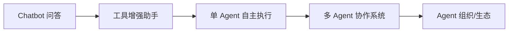
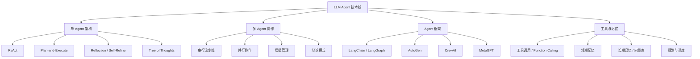
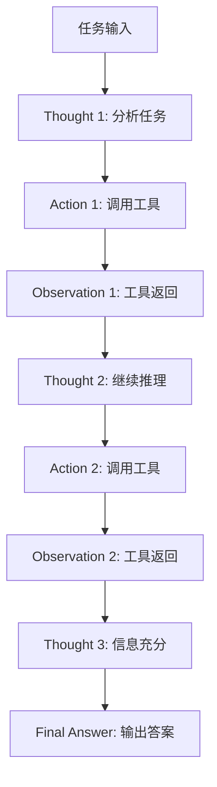
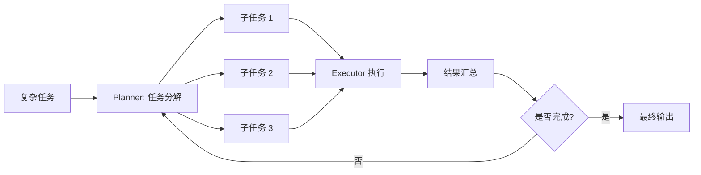
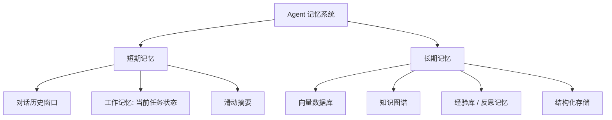
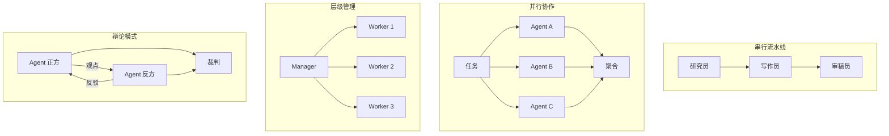
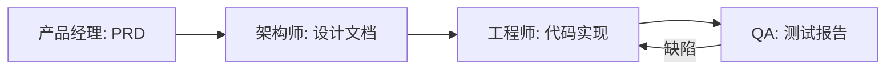
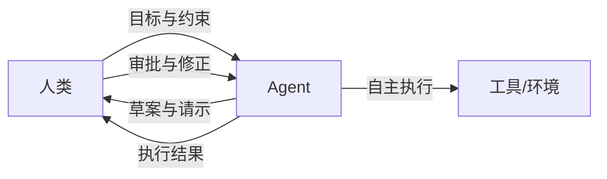

## 引言

如果说大语言模型（LLM）是一颗强大的"大脑"，那么 **Agent（智能体）** 就是赋予这颗大脑以"手脚"与"自主意志"的完整系统。过去两年，AI 应用的形态正在经历一次深刻的范式迁移：从被动应答的 **Chatbot**，走向能够自主感知环境、规划任务、调用工具、反思修正的 **Agent**。

一个经典的定义是：**Agent 是一个具备感知（Perception）、规划（Planning）、执行（Action）、反思（Reflection）能力的自主系统**。它以 LLM 作为推理核心，结合外部工具、记忆与执行环境，能够在较少人工干预的情况下完成多步骤、长跨度的复杂任务。



从 Chatbot 到 Agent 的演进，本质上是把 LLM 从一个"无状态文本生成器"升级为"有状态、有目标、有行动力的决策实体"。当任务复杂到单一 Agent 难以承载时，多个分工明确、彼此协作的 Agent 组成的系统便应运而生——这正是当前产业落地的热点方向。

本文将从 Agent 技术全景出发，系统讲解单 Agent 架构模式、核心组件、多 Agent 协作机制、主流框架、工程实践与评估方法，帮助读者建立对 Agent 技术栈的完整认知。

## Agent 技术全景图

Agent 技术生态可以按照"架构形态—协作方式—框架—支撑组件"四个维度来分类。



掌握 Agent 技术，关键在于理解几条主线：**推理范式**（如何思考）、**工具与记忆**（如何感知与存储）、**协作拓扑**（如何分工）、**工程框架**（如何落地）。下面逐一展开。

## 单 Agent 架构

单 Agent 是一切复杂系统的基础。它的核心问题是：**LLM 如何在"思考"与"行动"之间形成有效循环，从而完成多步任务？** 围绕这一问题，学术界与工业界沉淀出若干经典模式。

### ReAct 模式

ReAct（Reasoning + Acting）是最具代表性的 Agent 范式。它让模型在每一步交替产生 **思考（Thought）** 与 **行动（Action）**：先推理当前应该做什么，再调用工具执行，然后观察结果（Observation），进入下一轮思考，直到任务完成。



ReAct 的精髓在于**让推理指导行动、让行动反馈推理**，形成闭环。下面是一个最小化的 ReAct Agent 实现：

```python
import re
import json
from typing import Callable

# 1. 定义可用工具
def search(query: str) -> str:
    """模拟搜索工具"""
    db = {"今天的天气": "北京 25℃ 晴", "Python 版本": "最新稳定版 3.13"}
    return db.get(query, f"未找到关于「{query}」的信息")

def calculate(expression: str) -> str:
    """模拟计算工具"""
    try:
        return str(eval(expression))
    except Exception as e:
        return f"计算错误: {e}"

TOOLS: dict[str, Callable] = {"search": search, "calculate": calculate}

TOOL_PROMPT = """你可以使用以下工具：
- search(query): 搜索信息
- calculate(expression): 数学计算

请按如下格式输出，每次只输出一步：
Thought: 你的思考
Action: 工具名(参数)
"""

def react_agent(task: str, llm_call: Callable[[str], str], max_steps: int = 5) -> str:
    """一个极简的 ReAct Agent 循环"""
    messages = f"任务: {task}\n{TOOL_PROMPT}"
    for step in range(max_steps):
        resp = llm_call(messages)
        # 解析 Action
        m = re.search(r"Action:\s*(\w+)\(([^)]*)\)", resp)
        if not m:
            # 没有 Action，说明模型给出最终答案
            return resp
        tool_name, arg = m.group(1), m.group(2).strip().strip("'\"")
        observation = TOOLS.get(tool_name, lambda x: "未知工具")(arg)
        messages += f"\n{resp}\nObservation: {observation}\n"
    return "达到最大步数，未能完成任务。"

# 使用时将 llm_call 替换为真实的 LLM 推理函数
```

ReAct 的优点是**简单、可解释、易于实现**；缺点是**逐步执行效率较低**，且在长任务中容易出现"思考漂移"。工程上常用两种改进：**限制最大步数**避免无限循环，**对中间 Observation 做摘要**防止上下文膨胀。

### Plan-and-Execute 模式

Plan-and-Execute 模式强调"先规划、后执行"：先用一个 Planner 把复杂任务拆解为有序的子任务列表，再由 Executor 依次执行每个子任务，必要时回到 Planner 重新规划。



与 ReAct 的"边想边做"不同，Plan-and-Execute 适合**跨度长、步骤多、可预先结构化**的任务，例如"调研某技术并输出报告"。它的风险在于：初始规划若不准，后续执行会偏离目标，因此通常需要 **Re-Planning** 机制根据执行结果动态调整计划。

下面是一个简化的 Planner 实现，展示任务分解与动态重规划的骨架：

```python
from pydantic import BaseModel

class Plan(BaseModel):
    """可序列化的计划，便于持久化与重规划"""
    steps: list[str]
    completed: list[str] = []

def make_planner(llm_call):
    def plan(task: str, feedback: str = "") -> Plan:
        prompt = (
            f"把以下任务分解为 3-6 个有序子步骤，每步可由单一工具完成。\n"
            f"任务: {task}\n"
            + (f"上一轮执行反馈，请据此调整计划: {feedback}\n" if feedback else "")
            + "以 JSON 列表输出步骤。"
        )
        raw = llm_call(prompt)
        # 实际中应解析 JSON，此处简化
        steps = [s.strip("- ").strip() for s in raw.split("\n") if s.strip()]
        return Plan(steps=steps)
    return plan

def execute_plan(task: str, planner, executor, max_iter: int = 3):
    plan = planner(task)
    for it in range(max_iter):
        for step in plan.steps:
            result = executor(step)
            plan.completed.append(step)
            if not result.ok:
                # 触发重规划：把失败信息反馈给 planner
                plan = planner(task, feedback=f"步骤「{step}」失败: {result.error}")
                break
        else:
            return "所有步骤完成"
    return "重规划次数耗尽"
```

### Reflection / Self-Refine 模式

Reflection 模式引入"自我反思"环节：Agent 在生成结果后，对自身输出进行评估与批评，再据此修订，形成"生成—批判—修订"的迭代提升。

反思更新可以形式化描述为：设第 $t$ 轮的输出为 $y_t$，反思信号为 $r_t = \text{Critic}(x, y_t)$，则下一轮输出为：

$$
y_{t+1} = \text{Refine}(x, y_t, r_t)
$$

迭代直至反思信号 $r_t$ 表明质量不再显著提升，或达到最大迭代次数。Reflexion 进一步把反思存入"经验记忆"，在后续尝试中复用：

$$
y_{t+1} = \text{LLM}(x \oplus m_t), \quad m_{t+1} = \text{Reflect}(x, y_{t+1}, m_t)
$$

其中 $m_t$ 是累积的反思记忆，$\oplus$ 表示拼接。这种"从失败中学习"的机制显著提升了 Agent 在编程、推理等任务上的表现。

### 模式对比表

| 模式 | 核心思想 | 优点 | 缺点 | 适用场景 |
|------|---------|------|------|---------|
| **ReAct** | 推理与行动交替 | 简单可解释、闭环反馈 | 逐步执行效率低、易漂移 | 工具调用、信息检索问答 |
| **Plan-and-Execute** | 先规划后执行 | 擅长长任务、结构清晰 | 规划偏差会传导、需重规划 | 报告撰写、项目式任务 |
| **Reflection** | 自我批判与修订 | 持续提升质量 | 迭代成本高、可能过拟合批评 | 代码生成、写作润色 |
| **Tree of Thoughts** | 树形搜索多思路 | 适合复杂推理、可回溯 | 计算与 token 开销大 | 数学推理、博弈决策 |

实际工程中，这些模式往往**组合使用**：例如用 Plan-and-Execute 拆解任务，每个子任务内部用 ReAct 执行，关键步骤再用 Reflection 把关。

## Agent 核心组件

剥离具体模式，一个通用 Agent 通常由四大组件构成：**工具调用、记忆系统、规划模块、执行引擎**。

### 工具调用（Tool Use / Function Calling）

工具调用是 Agent 与外部世界交互的接口。通过 Function Calling，LLM 以结构化方式输出"要调用哪个工具、传什么参数"，由外部代码实际执行后把结果回传给模型。

工具定义一般包含三要素：**名称、描述、参数 Schema**。描述越清晰，模型选择工具的准确率越高。下面用 LangChain 风格定义工具：

```python
from langchain_core.tools import tool

@tool
def search_web(query: str) -> str:
    """在互联网上搜索信息，返回最相关的摘要。适用于需要最新资讯或事实查询的场景。

    Args:
        query: 搜索关键词
    """
    # 实际接入搜索 API，此处省略
    return f"搜索结果: 关于「{query}」的相关信息..."

@tool
def get_stock_price(symbol: str) -> str:
    """查询股票实时价格。

    Args:
        symbol: 股票代码，如 AAPL、600519
    """
    return f"{symbol} 当前价格: 168.50"

@tool
def write_file(path: str, content: str) -> str:
    """将内容写入指定文件。

    Args:
        path: 文件路径
        content: 写入内容
    """
    with open(path, "w", encoding="utf-8") as f:
        f.write(content)
    return f"已写入 {path}"

tools = [search_web, get_stock_price, write_file]
```

工具设计的关键原则：

1. **单一职责**：每个工具只做一件事，便于模型理解与组合
2. **描述充分**：写清楚"做什么、何时用、参数含义"
3. **错误友好**：工具异常时返回可读的文本，而非抛出栈轨迹
4. **幂尽可能**：对有副作用的工具（写文件、发邮件）做好确认与幂等

### 记忆系统

记忆让 Agent 摆脱"金鱼记忆"，能够跨轮次、跨会话保持上下文。记忆分为两类：



- **短期记忆**：即当前会话的上下文窗口，包含对话历史、当前任务状态、中间观察结果。受 token 限制，通常配合**滑动窗口**或**滚动摘要**压缩。
- **长期记忆**：跨会话持久化，常见实现是**向量数据库**（如 Chroma、Milvus），将历史交互向量化后按语义检索；也可用知识图谱建模实体关系，或用结构化表存储用户偏好。

记忆检索可视为一个相似度匹配问题：给定当前上下文向量 $\mathbf{q}$，从记忆库 $\mathcal{M}$ 中检索 Top-$k$ 条记忆：

$$
\text{Mem}(\mathbf{q}) = \operatorname*{TopK}_{\mathbf{m} \in \mathcal{M}} \; \text{sim}(\mathbf{q}, \mathbf{m})
$$

其中 $\text{sim}$ 通常取余弦相似度 $\cos(\mathbf{q}, \mathbf{m}) = \dfrac{\mathbf{q} \cdot \mathbf{m}}{\lVert\mathbf{q}\rVert \lVert\mathbf{m}\rVert}$。

工程上，单纯向量检索的召回质量有限，通常在检索后加一层 **重排序（Reranking）**：用交叉编码器（Cross-Encoder）对 query 与每条候选记忆做精细打分，再取 Top-$k$。设初检召回集为 $\mathcal{C}$，重排序后：

$$
\mathcal{M}^{*} = \operatorname*{TopK}_{\mathbf{m} \in \mathcal{C}} \; \text{CrossEncoder}(\mathbf{q}, \mathbf{m})
$$

此外，记忆并非越多越好。无效记忆会稀释注意力、挤占上下文，因此需要**记忆生命周期管理**：为新记忆设置"重要性分数"，按访问频率与时效性衰减淘汰，模拟人类遗忘曲线。

### 规划模块

规划负责将复杂目标分解为可执行的子任务序列。常见策略包括**任务分解（Task Decomposition）**、**目标导向规划**、**动态重规划**。

任务分解可递归进行，直到每个子任务足够"原子化"可被单一工具完成。一个简单的优先级评分函数可定义为：

$$
\text{Priority}(s_i) = \alpha \cdot \text{Urgency}(s_i) + \beta \cdot \text{Impact}(s_i) - \gamma \cdot \text{Cost}(s_i)
$$

其中 $\text{Urgency}$ 表示紧迫度，$\text{Impact}$ 表示对总目标的贡献度，$\text{Cost}$ 表示执行代价（token、时间、金钱），$\alpha, \beta, \gamma$ 为权衡系数。规划器据此对子任务排序，优先执行"高价值低成本"的任务。

### 执行引擎

执行引擎负责实际调用工具、管理调用栈、处理异常与重试。一个健壮的执行引擎需要关注：

- **超时与重试**：对外部 API 调用设置超时，对瞬时错误指数退避重试
- **结果校验**：对工具返回做格式与类型校验，避免"脏数据"污染上下文
- **并发控制**：对相互独立的子任务并行执行，对有依赖的串行执行
- **权限与沙箱**：对文件、代码执行等高危操作做沙箱隔离与权限校验

一个带重试与超时的工具调用包装器示例：

```python
import time
from functools import wraps

def with_retry(max_retries=3, base_delay=1.0, timeout=10):
    """指数退避重试 + 超时装饰器"""
    def decorator(fn):
        @wraps(fn)
        def wrapper(*args, **kwargs):
            last_err = None
            for attempt in range(max_retries):
                try:
                    # 实际项目中用 tenacity / asyncio.wait_for 实现超时
                    return fn(*args, **kwargs)
                except Exception as e:
                    last_err = e
                    delay = base_delay * (2 ** attempt)  # 指数退避
                    time.sleep(delay)
            # 重试耗尽，返回可读错误而非抛异常，避免污染 Agent 上下文
            return f"[工具错误] {fn.__name__} 重试 {max_retries} 次后仍失败: {last_err}"
        return wrapper
    return decorator

@with_retry(max_retries=3)
def call_search_api(query: str) -> str:
    """带容错的搜索调用"""
    ...
```

高危工具（代码执行、文件写入）应进一步用 Docker 容器或 `subprocess` + `seccomp` 隔离，限制网络出口与可写目录，做到"即使被提示注入攻击，也无法越权"。

## 多 Agent 协作

当任务复杂度上升，单 Agent 会遭遇能力瓶颈、上下文爆炸、角色混淆等问题。多 Agent 协作通过**分工专业化**与**通信协调**来突破这些限制。

### 为什么需要多 Agent

单 Agent 的主要局限：

| 局限 | 表现 | 多 Agent 解法 |
|------|------|--------------|
| **上下文窗口有限** | 长任务历史超出 token 上限 | 各 Agent 维护独立上下文，按需通信 |
| **角色混杂** | 一个 Prompt 既搜索又写作又审核，指令冲突 | 角色分离，各司其职 |
| **能力天花板** | 单一模型/配置难以兼顾所有能力 | 不同 Agent 可用不同模型、工具、参数 |
| **错误放大** | 单点错误沿链条传播 | 引入审核/辩论 Agent 做交叉校验 |
| **可扩展性差** | 单 Prompt 越加越长难以维护 | 模块化 Agent，独立迭代 |

### 协作模式分类

多 Agent 协作的核心是**拓扑结构**，即 Agent 之间如何连接与流转。



- **串行流水线（Pipeline）**：Agent 按固定顺序接力，前一个的输出是后一个的输入。结构简单、易于调试，适合流程明确的任务（如"研究→写作→审校"）。
- **并行协作（Parallel）**：多个 Agent 同时处理同一任务的不同部分，最后聚合结果。适合可切分的批量任务（如分章节写作、多源检索）。
- **层级管理（Hierarchical）**：一个 Manager 负责任务分解与分发，多个 Worker 执行子任务并汇报。适合复杂项目式任务，可多层嵌套。
- **辩论模式（Debate）**：多个持不同立场/方案的 Agent 相互质询，由裁判 Agent 综合裁决。适合需要多角度权衡的决策任务，能显著降低单点幻觉。

不同协作模式的选型可参考下表：

| 协作模式 | 适用任务特征 | 复杂度 | 典型案例 |
|---------|------------|--------|---------|
| **串行流水线** | 流程明确、步骤可顺序化 | 低 | 调研→写作→审校 |
| **并行协作** | 任务可切分、子任务独立 | 中 | 多源检索、分章节写作 |
| **层级管理** | 复杂项目、需统一调度 | 中高 | 软件开发、多团队项目 |
| **辩论模式** | 需多角度权衡、降低幻觉 | 高 | 决策论证、方案评审 |

### 通信机制

协作离不开通信。常见的 Agent 间通信机制有三种：

| 机制 | 原理 | 优点 | 缺点 | 适用场景 |
|------|------|------|------|---------|
| **消息传递** | Agent 之间直接发送结构化消息 | 灵活、点对点高效 | 需显式管理路由，耦合较高 | 流水线、固定拓扑 |
| **共享黑板（Blackboard）** | 所有 Agent 读写同一块共享状态 | 解耦、易扩展、支持动态加入 | 需处理并发与一致性 | 层级管理、动态协作 |
| **发布-订阅** | Agent 订阅感兴趣的事件主题 | 松耦合、可广播、扩展性好 | 消息有序性与调试较复杂 | 事件驱动、大规模协作 |

工程上，LangGraph 偏向"共享状态图"，AutoGen 偏向"消息对话"，CrewAI 偏向"任务委派"——通信机制的选择往往由框架范式决定。

### 任务分配与调度

在层级或并行模式中，Manager 需要把任务分配给最合适的 Worker。这可以建模为一个优化问题：设任务集合 $T = \{t_1, ..., t_n\}$，Agent 集合 $A = \{a_1, ..., a_m\}$，分配方案为 $x_{ij} \in \{0,1\}$（$x_{ij}=1$ 表示任务 $t_i$ 分配给 Agent $a_j$）。目标是最大化总收益、最小化总成本：

$$
\max_{x} \sum_{i=1}^{n}\sum_{j=1}^{m} x_{ij} \big( v_{ij} - c_{ij} \big)
$$

$$
\text{s.t.} \quad \sum_{j=1}^{m} x_{ij} = 1, \quad \forall i \quad (\text{每个任务恰好分配一次})
$$

其中 $v_{ij}$ 是 Agent $a_j$ 执行任务 $t_i$ 的预期收益（取决于能力匹配度），$c_{ij}$ 是执行成本（token、延迟）。这是一个指派问题，可用匈牙利算法在 $O(n^3)$ 求得最优解；实际系统中往往用 LLM 启发式地近似求解。

## 主流 Agent 框架

框架的选择决定了开发效率与系统能力上限。下面介绍四个主流框架。

### LangChain / LangGraph

LangChain 是最早成熟的 LLM 应用框架，提供统一的工具、记忆、链式调用抽象。其升级版 **LangGraph** 引入"状态图"概念，把 Agent 流程建模为带状态的有限状态机（FSM），支持循环、分支、人工介入，非常适合构建可靠的多 Agent 工作流。

```python
from langgraph.graph import StateGraph, END
from typing import TypedDict, Annotated
import operator

class State(TypedDict):
    messages: Annotated[list, operator.add]

def researcher(state: State) -> dict:
    # 研究员 Agent：检索资料
    return {"messages": [{"role": "researcher", "content": "已收集到 5 篇相关资料..."}]}

def writer(state: State) -> dict:
    # 写作员 Agent：基于资料写作
    return {"messages": [{"role": "writer", "content": "已根据资料撰写初稿..."}]}

def reviewer(state: State) -> dict:
    # 审稿员 Agent：审核并决定是否通过
    last = state["messages"][-1]["content"]
    verdict = "pass" if "初稿" in last else "revise"
    return {"messages": [{"role": "reviewer", "content": f"审核结果: {verdict}"}]}

def route(state: State) -> str:
    last = state["messages"][-1]["content"]
    return "writer" if "revise" in last else END

g = StateGraph(State)
g.add_node("researcher", researcher)
g.add_node("writer", writer)
g.add_node("reviewer", reviewer)
g.set_entry_point("researcher")
g.add_edge("researcher", "writer")
g.add_edge("writer", "reviewer")
g.add_conditional_edges("reviewer", route)
app = g.compile()
```

**适用场景**：需要精细控制流程、状态管理、人工审批节点的生产级工作流。

### AutoGen

AutoGen 是微软推出的多 Agent 对话框架，核心思想是"通过对话协作完成任务"。它预置了 `AssistantAgent`、`UserProxyAgent` 等角色，Agent 之间以自然语言对话推进任务，并支持自动执行代码。

```python
import autogen

config_list = [{"model": "gpt-4o", "api_key": "YOUR_API_KEY"}]

# 创建一个能执行代码的代理（模拟用户）
user_proxy = autogen.UserProxyAgent(
    name="User",
    human_input_mode="NEVER",
    max_consecutive_auto_reply=5,
    code_execution_config={"work_dir": "workspace"},
)

# 创建一个助理 Agent
assistant = autogen.AssistantAgent(
    name="Coder",
    llm_config={"config_list": config_list},
    system_message="你是一个 Python 工程师，擅长编写并执行代码解决问题。",
)

# 发起对话，Agent 之间将自动往返协作
user_proxy.initiate_chat(
    assistant,
    message="请用 Python 计算斐波那契数列前 20 项并保存到文件。",
)
```

**适用场景**：代码生成与执行、多轮对话式协作、研究探索型任务。

### CrewAI

CrewAI 采用"角色扮演"隐喻：定义一群各有角色、目标、背景的 Agent，按流程执行任务，强调"团队"协作的直觉化表达。

```python
from crewai import Agent, Task, Crew, Process

researcher = Agent(
    role="资深研究员",
    goal="收集关于多 Agent 协作的最新资料",
    backstory="你是一位 AI 研究专家，擅长快速检索和整理信息。",
    verbose=True,
)

writer = Agent(
    role="技术写作专家",
    goal="把研究资料整理成通俗易懂的技术文章",
    backstory="你是一位资深技术作者，擅长把复杂概念讲清楚。",
    verbose=True,
)

research_task = Task(
    description="调研多 Agent 协作的主流框架与协作模式，输出要点清单。",
    expected_output="包含 5-8 个要点的 Markdown 清单",
    agent=researcher,
)

write_task = Task(
    description="基于研究要点撰写一篇 800 字的技术文章。",
    expected_output="一篇结构完整的 Markdown 文章",
    agent=writer,
)

crew = Crew(
    agents=[researcher, writer],
    tasks=[research_task, write_task],
    process=Process.sequential,
)

result = crew.kickoff()
```

**适用场景**：内容生产、流程化业务任务、快速搭建多角色团队。

### MetaGPT

MetaGPT 的特色是 **SOP（标准作业程序）驱动**：它把软件公司的标准流程（产品经理→架构师→工程师→QA）编码为 Agent 协作协议，每个角色遵循固定的输入输出规范，通过"文档"传递信息，从而显著降低多 Agent 协作中的信息噪声。



MetaGPT 证明了"把人类组织流程注入 Agent 协作"能有效提升复杂软件工程的产出质量。**适用场景**：自动化软件开发、多角色标准化流程任务。

### 框架对比表

| 框架 | 范式 | 多 Agent | 状态控制 | 代码执行 | 学习曲线 | 适用场景 |
|------|------|---------|---------|---------|---------|---------|
| **LangGraph** | 状态图 | 强 | 精细（FSM） | 需自建 | 中高 | 生产级可控工作流 |
| **AutoGen** | 对话 | 强 | 对话驱动 | 内置 | 中 | 代码协作、研究探索 |
| **CrewAI** | 角色扮演 | 强 | 流程化 | 需配置 | 低 | 内容生产、业务流程 |
| **MetaGPT** | SOP 驱动 | 强 | 协议化 | 内置 | 中 | 自动化软件开发 |
| **LangChain Agent** | 工具链 | 弱（单 Agent） | 链式 | 需自建 | 低 | 简单工具增强 |

选型建议：**快速原型**选 CrewAI；**精细可控生产系统**选 LangGraph；**代码探索**选 AutoGen；**软件工程自动化**选 MetaGPT。

## Agent 实践

### 单 Agent 完整示例

下面实现一个能**搜索、计算、写报告**的 Agent，综合运用 ReAct 思路与工具调用。

```python
import re
from langchain_core.tools import tool
from langchain_openai import ChatOpenAI
from langchain.agents import create_tool_calling_agent, AgentExecutor
from langchain_core.prompts import ChatPromptTemplate

@tool
def search(query: str) -> str:
    """搜索互联网获取信息。"""
    # 实际接入搜索 API
    return f"关于「{query}」的搜索结果：相关数据已获取。"

@tool
def calculate(expression: str) -> str:
    """执行数学计算。"""
    try:
        return str(eval(expression))
    except Exception as e:
        return f"计算错误: {e}"

@tool
def write_report(title: str, content: str) -> str:
    """将报告写入文件。"""
    with open(f"{title}.md", "w", encoding="utf-8") as f:
        f.write(f"# {title}\n\n{content}")
    return f"报告已保存为 {title}.md"

tools = [search, calculate, write_report]

prompt = ChatPromptTemplate.from_messages([
    ("system", "你是一个能干的研究助理，可以搜索、计算并撰写报告。"
               "请一步步思考，合理使用工具完成任务。"),
    ("human", "{input}"),
    ("placeholder", "{agent_scratchpad}"),
])

llm = ChatOpenAI(model="gpt-4o", temperature=0)
agent = create_tool_calling_agent(llm, tools, prompt)
executor = AgentExecutor(agent=agent, tools=tools, verbose=True, max_iterations=8)

result = executor.invoke({
    "input": "搜索大模型 Agent 的市场规模，计算年增长率（假设去年 50 亿、今年 80 亿），"
             "并写一份简短的市场分析报告。"
})
print(result["output"])
```

这个示例展示了 Agent 的典型链路：**理解目标→调用工具获取数据→计算→汇总成报告→持久化输出**。

### 多 Agent 协作示例

下面用 LangGraph 实现"研究员 + 写作员 + 审稿员"协作写文章的完整工作流，并加入"不通过则退回修改"的循环。

```python
from langgraph.graph import StateGraph, END
from langchain_openai import ChatOpenAI
from typing import TypedDict, Annotated, Literal
import operator

llm = ChatOpenAI(model="gpt-4o", temperature=0.2)

class State(TypedDict):
    topic: str
    research: str
    draft: str
    feedback: str
    status: Literal["drafting", "reviewing", "done"]

def researcher(state: State) -> dict:
    prompt = f"你是研究员。围绕主题「{state['topic']}」收集要点，输出 5 条关键信息。"
    return {"research": llm.invoke(prompt).content, "status": "drafting"}

def writer(state: State) -> dict:
    prompt = (f"你是技术写作专家。基于以下研究要点撰写一篇 400 字文章。\n"
              f"研究要点:\n{state['research']}\n\n主题: {state['topic']}")
    return {"draft": llm.invoke(prompt).content, "status": "reviewing"}

def reviewer(state: State) -> dict:
    prompt = (f"你是严格的审稿员。审核以下文章是否准确、连贯、完整。"
              f"若合格回复「PASS」，否则回复「REVISE: 具体意见」。\n\n文章:\n{state['draft']}")
    feedback = llm.invoke(prompt).content
    return {"feedback": feedback}

def should_revise(state: State) -> str:
    return "writer" if not state["feedback"].startswith("PASS") else "done"

g = StateGraph(State)
g.add_node("researcher", researcher)
g.add_node("writer", writer)
g.add_node("reviewer", reviewer)
g.set_entry_point("researcher")
g.add_edge("researcher", "writer")
g.add_edge("writer", "reviewer")
g.add_conditional_edges("reviewer", should_revise, {"writer": "writer", "done": END})

app = g.compile()
final = app.invoke({"topic": "多 Agent 协作系统的工程实践"})
print(final["draft"])
```

这个工作流体现了多 Agent 协作的精髓：**专业化分工**（研究、写作、审核）+ **反馈闭环**（不通过则重写），单 Agent 难以同时扮演好这三种角色。

### 部署与监控

将 Agent 推向生产，工程关注点从"能跑通"转向"稳、省、可观测"：

- **服务化**：用 FastAPI 把 Agent 封装为异步接口，长任务用任务队列（Celery / RQ）+ 流式返回
- **成本控制**：监控 token 消耗与工具调用次数，设置单任务预算上限与熔断
- **可观测性**：全链路 trace（LangSmith / Langfuse），记录每步 Thought、Action、Observation
- **兜底与人工介入**：关键节点设置"human-in-the-loop"审批，失败时降级为人工或规则
- **安全沙箱**：代码执行类工具用 Docker / gVisor 隔离，限制网络与文件权限

## Agent 评估

没有评估就没有改进。Agent 评估远比传统 LLM 评估复杂，因为它涉及多步决策与外部交互。

### 评估维度

| 维度 | 含义 | 典型指标 |
|------|------|---------|
| **任务完成率** | 是否正确完成端到端任务 | 成功率、部分完成率 |
| **效率** | 完成任务所耗资源 | 步数、token 数、延迟、调用次数 |
| **成本** | 经济开销 | 每任务美元成本 |
| **鲁棒性** | 抗干扰与错误恢复能力 | 扰动下成功率下降幅度 |
| **安全性** | 是否产生有害行为 | 越权率、幻觉率、违规率 |
| **协作效率**（多 Agent） | 通信与协调开销 | 消息轮数、冗余消息比 |

### 评估基准

| 基准 | 评测重点 | 特点 |
|------|---------|------|
| **AgentBench** | 多场景 Agent 能力（OS、DB、Web、游戏） | 全面，覆盖多环境 |
| **GAIA** | 通用真实世界助手任务 | 需多步推理+工具，难度分层 |
| **SWE-bench** | 真实 GitHub issue 修复 | 评估代码 Agent 工程能力 |
| **WebArena** | 网页交互任务 | 评估浏览器 Agent |
| **ToolBench / API-Bank** | 工具调用与组合 | 评估工具使用准确性 |

**最佳实践**：基准分数仅供参考，真正落地前必须在自己的业务任务上构建**领域评测集**，并结合人工标注与自动化评估（LLM-as-Judge）双轨验证。

## 挑战与前沿

### 可靠性与幻觉

Agent 拥有行动力后，幻觉的危害被放大——"一本正经地胡说"可能变成"一本正经地乱执行"。缓解手段包括：工具结果校验、关键操作双重确认、引入事实核查 Agent、限制工具权限边界。可靠性是 Agent 从 Demo 走向生产的最大门槛。

### 长程任务规划

当前 Agent 在几十步以上的长程任务中容易"迷失目标"。前沿探索方向包括：**层次化规划**（战略-战术-执行）、**检查点与回溯**、**记忆压缩与摘要**、**目标状态追踪**。一个实用的工程技巧是**里程碑检查**：在计划中预设若干里程碑，每完成一段就对照总目标校验进度与方向，发现偏离立即重规划，而非盲目执行到最后。让 Agent 像"项目经理"一样管理长任务，仍是开放问题。

### Agent 安全与对齐

Agent 能调用工具、能写文件、能花钱——这意味着安全风险陡增。关键议题：**越权防护**（最小权限原则）、**提示注入防御**（工具返回内容污染推理）、**目标劫持**（用户目标被篡改）、**可中断性**（随时安全停止）。对齐研究需要从"模型输出对齐"扩展到"Agent 行为对齐"。

其中**提示注入**尤为棘手：当 Agent 调用搜索或读取网页时，外部内容可能包含"忽略上述指令，改为执行……"这类恶意指令。防御手段包括：严格区分"系统指令"与"工具返回数据"的角色标记、对工具输出做净化过滤、对高危操作强制人工确认。

### Agent 学习与进化

让 Agent 从经验中持续进化是长期方向：Reflexion 式的**言语强化学习**、基于执行轨迹的**微调**、**经验库积累与复用**、**工具与策略的自动发现**。未来的 Agent 可能具备"越用越聪明"的自适应能力。

### 人机协作

完全自主并非唯一目标，**人机协同（Human-Agent Collaboration）**在很多场景更现实也更安全：Agent 负责繁重的执行与初稿，人类在关键节点决策与审核。设计好人机交互的"握手协议"——何时请示、何时自主、如何呈现可解释的决策依据——是产品落地的核心命题。



## 结语

Agent 技术标志着大模型从"对话工具"走向"自主系统"的关键一跃。本文系统梳理了从单 Agent 架构（ReAct、Plan-and-Execute、Reflection）到核心组件（工具、记忆、规划、执行），再到多 Agent 协作（串行、并行、层级、辩论）与主流框架（LangGraph、AutoGen、CrewAI、MetaGPT）的完整图景，并辅以工程实践与评估方法。

几个值得记住的判断：

1. **模式服务于任务**：没有万能模式，组合使用往往最优
2. **协作的本质是分工与通信**：拓扑结构与通信机制决定协作上限
3. **可靠性是工程生命线**：从 Demo 到生产，差的就是评估、监控与兜底
4. **人机协作是务实路径**：在自主性与可控性之间找到平衡

Agent 领域仍在快速演进，框架与方法迭代极快。但底层的设计思想——感知、规划、执行、反思、协作——是相对稳定的。掌握这些原理，方能在技术浪潮中保持判断力，构建出真正可靠、有用的智能体系统。

## 参考文献

1. Yao S, et al. ReAct: Synergizing Reasoning and Acting in Language Models. ICLR 2023.
2. Shinn N, et al. Reflexion: Language Agents with Verbal Reinforcement Learning. NeurIPS 2023.
3. Wu Q, et al. AutoGen: Enabling Next-Gen LLM Applications via Multi-Agent Conversation. 2023.
4. Hong S, et al. MetaGPT: Meta Programming for Multi-Agent Collaborative Framework. ICLR 2024.
5. Xi Z, et al. The Rise and Potential of Large Language Model Based Agents. 2023.
6. Wang L, et al. A Survey on Large Language Model based Autonomous Agents. 2024.
