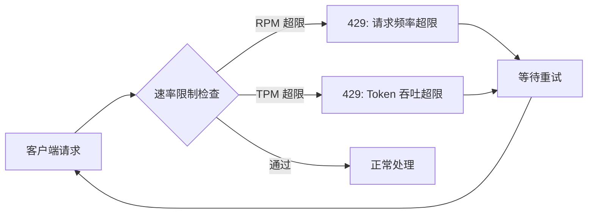
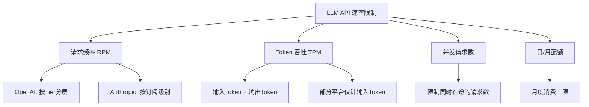
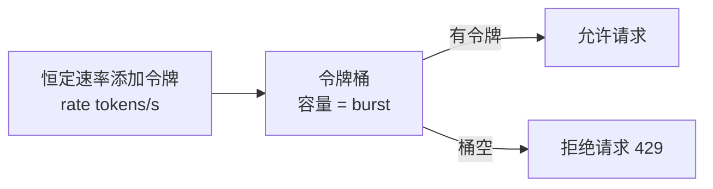
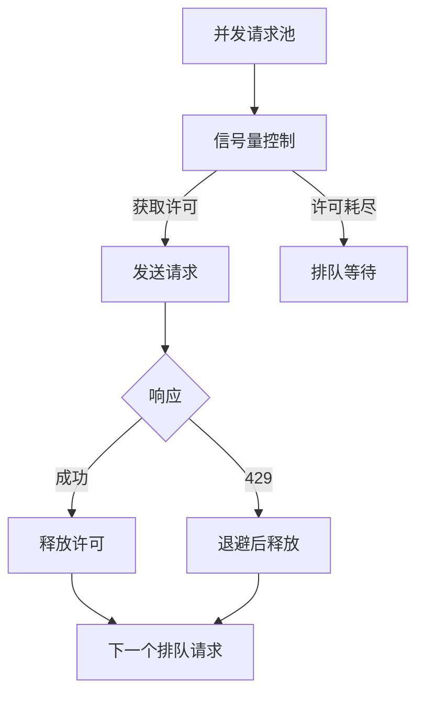
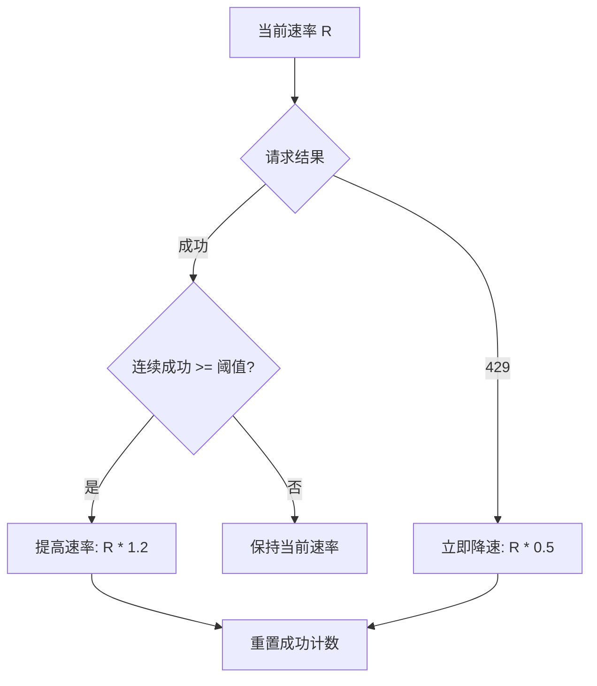

## 引言

当你的 Agent 系统从"单次调用 Demo"走向"高并发生产服务"时，最先撞上的墙往往不是模型能力，而是 **HTTP 429 Too Many Requests**。这个状态码的含义简单粗暴：你在短时间内发送了太多请求，被服务端拒绝了。

LLM API 的速率限制与传统的 Web API 限流有本质区别。传统 API 通常只限制**请求频率**（RPM, Requests Per Minute），而 LLM API 还要限制**Token 吞吐量**（TPM, Tokens Per Minute），因为一次包含 8000 Token 上下文的请求与一次 100 Token 的请求，对服务端的计算成本天差地别。



本文将从三个层面系统展开：**速率限制的原理与策略**（理解限流机制）、**429 错误的鲁棒处理**（重试与降级）、**并发控制与调度**（在限制内最大化吞吐），最后给出完整的工程实践。

## 速率限制的原理

### 为什么需要速率限制

速率限制对服务端和客户端都有保护作用：

| 视角 | 服务端原因 | 客户端原因 |
|------|-----------|-----------|
| **资源保护** | GPU 算力有限，过载会导致所有请求变慢 | 避免意外消耗大量 API 费用 |
| **公平性** | 防止单一用户独占资源 | 确保多租户共享配额 |
| **稳定性** | 防止突发流量压垮基础设施 | 防止级联故障扩散 |
| **成本控制** | 按层级分配计算资源 | 控制月度 API 支出 |

### 主流 LLM API 的限流策略

不同提供商的限流维度和规则差异显著：



以 OpenAI 为例，其限流采用 **Tier（层级）体系**，不同层级有不同的 RPM/TPM 配额：

| Tier | 资质要求 | RPM | TPM | 并发 |
|------|---------|-----|-----|------|
| Free | 注册即得 | 3-15 | 10K-40K | 有限 |
| Tier 1 | 充值 $5+ | 500 | 30K-200K | 100 |
| Tier 2 | 充值 $50+ | 5,000 | 150K-1M | 不限 |
| Tier 3 | 充值 $100+ | 5,000 | 1M-3M | 不限 |
| Tier 4 | 充值 $250+ | 10,000 | 2M-10M | 不限 |

> **注意**：以上为示例数据，实际配额请参考各平台最新文档。不同模型（如 GPT-4o vs GPT-3.5）的配额也可能不同。

### Token 预估

由于 TPM 限制的存在，客户端在发送请求前需要预估 Token 消耗。一个粗略但实用的估算方法：

$$
T_{\text{total}} = T_{\text{input}} + T_{\text{output\_expected}}
$$

其中输入 Token 可通过 tokenizer 精确计算，输出 Token 通常按 `max_tokens` 或经验值预估：

```python
import tiktoken

def estimate_tokens(text: str, model: str = "gpt-4o") -> int:
    """使用 tiktoken 精确计算输入 Token 数"""
    enc = tiktoken.encoding_for_model(model)
    return len(enc.encode(text))

def estimate_request_cost(
    messages: list[dict],
    max_output_tokens: int = 1024,
    model: str = "gpt-4o",
) -> dict:
    """预估单次请求的 Token 消耗"""
    input_text = " ".join(m["content"] for m in messages)
    input_tokens = estimate_tokens(input_text, model)
    return {
        "input_tokens": input_tokens,
        "estimated_output_tokens": max_output_tokens,
        "estimated_total": input_tokens + max_output_tokens,
    }
```

## 限流算法

### 固定窗口计数器

最简单的限流算法：在固定时间窗口（如 1 分钟）内维护一个计数器，每来一个请求计数器加 1，超过阈值则拒绝。

```python
import time
from collections import deque

class FixedWindowRateLimiter:
    """固定窗口计数器限流"""

    def __init__(self, max_requests: int, window_seconds: int = 60):
        self.max_requests = max_requests
        self.window = window_seconds
        self.requests: deque = deque()

    def allow(self) -> bool:
        now = time.time()
        # 清除窗口外的请求记录
        while self.requests and self.requests[0] < now - self.window:
            self.requests.popleft()
        if len(self.requests) < self.max_requests:
            self.requests.append(now)
            return True
        return False
```

固定窗口的致命缺陷是**边界突刺**：在窗口切换的瞬间，可能短时间内通过 2 倍阈值的请求。

### 滑动窗口日志

滑动窗口记录每个请求的精确时间戳，统计当前时刻往前推一个窗口内的请求数：

```python
class SlidingWindowRateLimiter:
    """滑动窗口日志限流"""

    def __init__(self, max_requests: int, window_seconds: int = 60):
        self.max_requests = max_requests
        self.window = window_seconds
        self.requests: deque = deque()

    def allow(self) -> bool:
        now = time.time()
        cutoff = now - self.window
        # 移除窗口外的旧请求
        while self.requests and self.requests[0] < cutoff:
            self.requests.popleft()
        if len(self.requests) < self.max_requests:
            self.requests.append(now)
            return True
        # 计算需要等待的时间
        wait = self.requests[0] + self.window - now
        return False
```

滑动窗口解决了边界突刺问题，但内存开销随请求量线性增长。

### 令牌桶

令牌桶是工业界最广泛使用的限流算法。核心思想：以恒定速率向桶中添加令牌，请求到来时消耗令牌，桶空时拒绝请求。



令牌桶的关键优势是允许**突发流量**（burst）：桶满时可以瞬间处理 `burst` 个请求，然后按 `rate` 速率补充。

```python
import time
import threading

class TokenBucketRateLimiter:
    """令牌桶限流器：线程安全"""

    def __init__(self, rate: float, capacity: int):
        """
        Args:
            rate: 令牌补充速率（令牌/秒）
            capacity: 桶容量（最大突发请求数）
        """
        self.rate = rate
        self.capacity = capacity
        self.tokens = capacity
        self.last_refill = time.time()
        self._lock = threading.Lock()

    def acquire(self, tokens: int = 1, timeout: float | None = None) -> bool:
        """
        尝试获取令牌。
        如果设置了 timeout，则会阻塞等待直到获取或超时。
        """
        deadline = time.time() + timeout if timeout else None
        while True:
            with self._lock:
                self._refill()
                if self.tokens >= tokens:
                    self.tokens -= tokens
                    return True
                # 计算还需等待多久才有足够令牌
                deficit = tokens - self.tokens
                wait_time = deficit / self.rate
            if deadline and time.time() + wait_time > deadline:
                return False
            if deadline:
                remaining = deadline - time.time()
                time.sleep(min(wait_time, remaining))
            else:
                time.sleep(wait_time)

    def _refill(self):
        now = time.time()
        elapsed = now - self.last_refill
        self.tokens = min(self.capacity, self.tokens + elapsed * self.rate)
        self.last_refill = now


# 示例：OpenAI Tier 1 的 RPM=500
limiter = TokenBucketRateLimiter(rate=500/60, capacity=10)  # ~8.3 tokens/s, burst=10
```

### 漏桶

漏桶以恒定速率"漏出"请求，相当于将不规则的输入流平滑为均匀的输出流。与令牌桶的区别在于：漏桶**不允许突发**，所有请求都被强制排队。

```python
class LeakyBucketRateLimiter:
    """漏桶限流器：强制匀速处理"""

    def __init__(self, rate: float):
        self.rate = rate
        self.next_available = time.time()
        self._lock = threading.Lock()

    def acquire(self) -> float:
        """获取处理许可，返回需要等待的秒数"""
        with self._lock:
            now = time.time()
            if now >= self.next_available:
                self.next_available = now + 1.0 / self.rate
                return 0.0
            wait = self.next_available - now
            self.next_available += 1.0 / self.rate
            return wait
```

### 算法对比

| 算法 | 突发流量 | 内存开销 | 精度 | 适用场景 |
|------|---------|---------|------|---------|
| 固定窗口 | 允许（边界突刺） | O(1) | 低 | 简单限流 |
| 滑动窗口 | 允许（受窗口限制） | O(n) | 高 | 精确限流 |
| 令牌桶 | 允许（受桶容量限制） | O(1) | 中高 | **API 调用（推荐）** |
| 漏桶 | 不允许 | O(1) | 高 | 流量整形 |

**实践建议**：LLM API 场景下推荐使用**令牌桶**，因为它既控制了平均速率，又允许合理的突发请求，与 API 提供商的限流模型最为匹配。

## 429 错误处理

### 理解 429 响应

当请求被限流时，服务端返回 HTTP 429 状态码。一个规范的 429 响应应包含以下信息：

```http
HTTP/1.1 429 Too Many Requests
Content-Type: application/json
Retry-After: 30
X-RateLimit-Limit-Requests: 500
X-RateLimit-Remaining-Requests: 0
X-RateLimit-Reset-Requests: 30s

{
  "error": {
    "type": "rate_limit_error",
    "message": "Rate limit reached for requests",
    "code": "rate_limit_exceeded"
  }
}
```

关键响应头：

| Header | 含义 |
|--------|------|
| `Retry-After` | 建议的重试等待秒数 |
| `X-RateLimit-Limit-*` | 当前窗口的总配额 |
| `X-RateLimit-Remaining-*` | 当前窗口的剩余配额 |
| `X-RateLimit-Reset-*` | 配额重置时间 |

### 指数退避重试

指数退避是处理 429 的标准策略：每次重试等待时间按指数增长，避免重试风暴。

$$
\text{wait}_n = \text{base} \times 2^n + \text{jitter}
$$

其中 $n$ 是重试次数，`base` 是基础等待时间，`jitter` 是随机抖动（避免多个客户端同步重试）。

```python
import time
import random
import logging
from functools import wraps
from typing import Callable, Type

logger = logging.getLogger("llm.retry")

def retry_with_backoff(
    max_retries: int = 5,
    base_delay: float = 1.0,
    max_delay: float = 60.0,
    retry_on: tuple = (429, 500, 502, 503),
):
    """
    指数退避重试装饰器。
    专门处理 429 速率限制和其他可重试错误。
    """
    def decorator(func: Callable) -> Callable:
        @wraps(func)
        def wrapper(*args, **kwargs):
            last_exception = None
            for attempt in range(max_retries + 1):
                try:
                    return func(*args, **kwargs)
                except Exception as e:
                    last_exception = e
                    # 提取状态码
                    status = getattr(e, "status_code", None)
                    if status is None and hasattr(e, "response"):
                        status = getattr(e.response, "status_code", None)

                    if status not in retry_on and attempt > 0:
                        raise  # 不可重试的错误直接抛出

                    if attempt == max_retries:
                        logger.error(
                            f"{func.__name__} 重试 {max_retries} 次后仍失败: {e}"
                        )
                        raise last_exception

                    # 计算退避时间
                    if status == 429:
                        # 429: 优先使用 Retry-After 头
                        retry_after = _extract_retry_after(e)
                        delay = retry_after or _calc_backoff(
                            attempt, base_delay, max_delay
                        )
                    else:
                        delay = _calc_backoff(attempt, base_delay, max_delay)

                    logger.warning(
                        f"{func.__name__} 第 {attempt+1} 次重试，"
                        f"等待 {delay:.1f}s（原因: {e}）"
                    )
                    time.sleep(delay)

            raise last_exception

        return wrapper
    return decorator


def _calc_backoff(attempt: int, base: float, max_delay: float) -> float:
    """计算指数退避 + 随机抖动"""
    delay = min(base * (2 ** attempt), max_delay)
    jitter = random.uniform(0, delay * 0.1)  # 10% 抖动
    return delay + jitter


def _extract_retry_after(error: Exception) -> float | None:
    """从错误对象中提取 Retry-After 值"""
    # OpenAI SDK 的 RateLimitError 包含 retry_after 属性
    retry_after = getattr(error, "retry_after", None)
    if retry_after:
        return float(retry_after)

    # 从响应头提取
    response = getattr(error, "response", None)
    if response:
        headers = getattr(response, "headers", {})
        ra = headers.get("Retry-After") or headers.get("retry-after")
        if ra:
            try:
                return float(ra)
            except ValueError:
                pass
    return None
```

### 使用示例

```python
from openai import OpenAI

client = OpenAI()

@retry_with_backoff(max_retries=5, base_delay=1.0)
def call_llm(messages: list[dict], model: str = "gpt-4o") -> str:
    """带自动重试的 LLM 调用"""
    response = client.chat.completions.create(
        model=model,
        messages=messages,
        max_tokens=1024,
    )
    return response.choices[0].message.content

# 调用时自动处理 429
answer = call_llm([
    {"role": "system", "content": "你是一个技术助手"},
    {"role": "user", "content": "解释什么是令牌桶算法"},
])
```

### 降级策略

当重试耗尽后，需要降级而非直接崩溃：

```python
class LLMCallWithFallback:
    """多级降级：模型降级 → 缓存 → 默认回复"""

    def __init__(self):
        self.client = OpenAI()
        self.cache: dict[str, str] = {}  # 简单内存缓存

    @retry_with_backoff(max_retries=3, base_delay=2.0)
    def _call_model(self, model: str, messages: list[dict]) -> str:
        resp = self.client.chat.completions.create(
            model=model, messages=messages, max_tokens=1024,
        )
        return resp.choices[0].message.content

    def call(self, messages: list[dict]) -> str:
        # 1. 检查缓存
        cache_key = str(hash(str(messages)))
        if cache_key in self.cache:
            logger.info("命中缓存")
            return self.cache[cache_key]

        # 2. 尝试主模型 → 降级模型 → 默认回复
        model_chain = ["gpt-4o", "gpt-4o-mini", "gpt-3.5-turbo"]
        for model in model_chain:
            try:
                result = self._call_model(model, messages)
                self.cache[cache_key] = result
                return result
            except Exception as e:
                logger.warning(f"模型 {model} 失败: {e}，尝试降级")

        # 3. 所有模型都失败，返回默认回复
        return "抱歉，服务暂时不可用，请稍后再试。"
```

## 并发控制

### 为什么需要并发控制

即使每次请求都在限流范围内，**并发的请求**也可能在瞬间消耗大量 Token 配额。并发控制的目标是：在速率限制内最大化吞吐量，同时避免触发 429。



### 信号量并发控制

信号量是最直接的并发控制手段，限制同时在途的请求数量：

```python
import asyncio
from asyncio import Semaphore

class AsyncLLMClient:
    """异步 LLM 客户端：信号量并发控制 + 令牌桶限流"""

    def __init__(
        self,
        max_concurrency: int = 10,
        rate: float = 8.0,  # tokens/s ~ 480 RPM
        burst: int = 10,
    ):
        self.semaphore = Semaphore(max_concurrency)
        self.limiter = TokenBucketRateLimiter(rate=rate, capacity=burst)
        self.client = AsyncOpenAI()  # 假设已初始化

    async def call(self, messages: list[dict], model: str = "gpt-4o") -> str:
        async with self.semaphore:
            # 获取令牌桶许可（阻塞等待）
            self.limiter.acquire(tokens=1, timeout=30)
            try:
                resp = await self.client.chat.completions.create(
                    model=model,
                    messages=messages,
                    max_tokens=1024,
                )
                return resp.choices[0].message.content
            except Exception as e:
                if _is_rate_limit(e):
                    await asyncio.sleep(_extract_retry_after(e) or 5)
                    return await self.call(messages, model)  # 递归重试
                raise
```

### 批量请求调度

当需要处理大量独立请求时，合理的批量调度能显著提高吞吐量：

```python
import asyncio
from typing import Any

class BatchProcessor:
    """批量请求处理器：自动限流 + 并发 + 重试"""

    def __init__(
        self,
        client: AsyncLLMClient,
        max_concurrency: int = 10,
        max_retries: int = 3,
    ):
        self.client = client
        self.max_concurrency = max_concurrency
        self.max_retries = max_retries

    async def process_batch(
        self,
        requests: list[dict],
    ) -> list[dict[str, Any]]:
        """
        批量处理请求。
        返回 [{"index": i, "result": str, "error": str | None}, ...]
        """
        semaphore = asyncio.Semaphore(self.max_concurrency)

        async def process_one(index: int, request: dict) -> dict:
            async with semaphore:
                for attempt in range(self.max_retries):
                    try:
                        result = await self.client.call(
                            request["messages"],
                            request.get("model", "gpt-4o"),
                        )
                        return {"index": index, "result": result, "error": None}
                    except Exception as e:
                        if attempt == self.max_retries - 1:
                            return {"index": index, "result": None,
                                    "error": str(e)}
                        await asyncio.sleep(2 ** attempt)

        tasks = [
            process_one(i, req)
            for i, req in enumerate(requests)
        ]
        results = await asyncio.gather(*tasks)
        return sorted(results, key=lambda x: x["index"])


# 示例：批量处理 100 个翻译请求
async def main():
    client = AsyncLLMClient(max_concurrency=5, rate=8.0)
    processor = BatchProcessor(client, max_concurrency=5)

    requests = [
        {"messages": [
            {"role": "user", "content": f"翻译为英文：中文句子{i}"}
        ]}
        for i in range(100)
    ]
    results = await processor.process_batch(requests)
    success = sum(1 for r in results if r["error"] is None)
    print(f"成功: {success}/{len(results)}")
```

### 自适应限流

固定速率的限流器难以应对 API 配额的动态变化（如配额提升或临时降级）。自适应限流通过监控 429 频率动态调整速率：

```python
import time
from dataclasses import dataclass

@dataclass
class AdaptiveState:
    """自适应限流器状态"""
    current_rate: float       # 当前令牌补充速率
    min_rate: float           # 最小速率
    max_rate: float           # 最大速率
    success_streak: int = 0   # 连续成功次数
    rate_limit_hits: int = 0  # 429 次数

class AdaptiveRateLimiter:
    """
    自适应令牌桶：根据 429 频率动态调整速率。
    - 连续成功 → 逐步提高速率（探测上限）
    - 遇到 429 → 立即降低速率（保守回退）
    """

    def __init__(
        self,
        initial_rate: float = 5.0,
        min_rate: float = 1.0,
        max_rate: float = 20.0,
        increase_factor: float = 1.2,
        decrease_factor: float = 0.5,
        success_threshold: int = 20,
    ):
        self.state = AdaptiveState(
            current_rate=initial_rate,
            min_rate=min_rate,
            max_rate=max_rate,
        )
        self.increase_factor = increase_factor
        self.decrease_factor = decrease_factor
        self.success_threshold = success_threshold
        self.bucket = TokenBucketRateLimiter(
            rate=initial_rate, capacity=int(initial_rate * 2),
        )
        self._lock = threading.Lock()

    def acquire(self, timeout: float | None = None) -> bool:
        return self.bucket.acquire(tokens=1, timeout=timeout)

    def on_success(self):
        """请求成功时调用"""
        with self._lock:
            self.state.success_streak += 1
            # 连续成功足够多次，尝试提高速率
            if self.state.success_streak >= self.success_threshold:
                new_rate = min(
                    self.state.current_rate * self.increase_factor,
                    self.state.max_rate,
                )
                if new_rate > self.state.current_rate:
                    self.state.current_rate = new_rate
                    self.bucket.rate = new_rate
                    self.bucket.capacity = int(new_rate * 2)
                    logger.info(
                        f"自适应提速: {new_rate:.1f} tokens/s"
                    )
                self.state.success_streak = 0

    def on_rate_limit(self):
        """收到 429 时调用"""
        with self._lock:
            self.state.rate_limit_hits += 1
            self.state.success_streak = 0
            # 立即降低速率
            new_rate = max(
                self.state.current_rate * self.decrease_factor,
                self.state.min_rate,
            )
            self.state.current_rate = new_rate
            self.bucket.rate = new_rate
            self.bucket.capacity = int(new_rate * 2)
            logger.warning(
                f"触发限流，降速至: {new_rate:.1f} tokens/s "
                f"(累计 {self.state.rate_limit_hits} 次)"
            )
```

自适应限流的核心逻辑：



## 完整实践

将所有限流、重试、并发控制组件整合为一个生产可用的 LLM 客户端：

```python
"""
生产级 LLM 客户端：令牌桶限流 + 自适应调速 + 指数退避 + 并发控制
"""
import asyncio
import logging
from dataclasses import dataclass, field
from openai import AsyncOpenAI

logger = logging.getLogger("llm.client")

@dataclass
class ClientConfig:
    """客户端配置"""
    model: str = "gpt-4o"
    max_concurrency: int = 10
    initial_rate: float = 8.0       # ~480 RPM
    min_rate: float = 1.0
    max_rate: float = 20.0
    max_retries: int = 5
    base_retry_delay: float = 1.0
    max_retry_delay: float = 60.0
    request_timeout: float = 120.0


class ProductionLLMClient:
    """生产级异步 LLM 客户端"""

    def __init__(self, config: ClientConfig | None = None):
        self.config = config or ClientConfig()
        self.client = AsyncOpenAI()
        self.semaphore = asyncio.Semaphore(self.config.max_concurrency)
        self.limiter = AdaptiveRateLimiter(
            initial_rate=self.config.initial_rate,
            min_rate=self.config.min_rate,
            max_rate=self.config.max_rate,
        )

    async def chat(
        self,
        messages: list[dict],
        model: str | None = None,
        max_tokens: int = 1024,
    ) -> str:
        """带完整限流与重试的聊天调用"""
        model = model or self.config.model
        async with self.semaphore:
            return await self._call_with_retry(messages, model, max_tokens)

    async def _call_with_retry(
        self,
        messages: list[dict],
        model: str,
        max_tokens: int,
    ) -> str:
        for attempt in range(self.config.max_retries):
            # 获取限流许可
            self.limiter.acquire(timeout=self.config.request_timeout)

            try:
                resp = await asyncio.wait_for(
                    self.client.chat.completions.create(
                        model=model,
                        messages=messages,
                        max_tokens=max_tokens,
                    ),
                    timeout=self.config.request_timeout,
                )
                self.limiter.on_success()
                return resp.choices[0].message.content

            except Exception as e:
                status = _get_status_code(e)

                if status == 429:
                    self.limiter.on_rate_limit()
                    wait = _extract_retry_after(e) or _calc_backoff(
                        attempt,
                        self.config.base_retry_delay,
                        self.config.max_retry_delay,
                    )
                    logger.warning(
                        f"429 限流，第 {attempt+1} 次重试，等待 {wait:.1f}s"
                    )
                    await asyncio.sleep(wait)
                elif status in (500, 502, 503):
                    wait = _calc_backoff(
                        attempt,
                        self.config.base_retry_delay,
                        self.config.max_retry_delay,
                    )
                    logger.warning(
                        f"服务端错误 {status}，第 {attempt+1} 次重试"
                    )
                    await asyncio.sleep(wait)
                else:
                    raise

        raise RuntimeError(
            f"达到最大重试次数 {self.config.max_retries}"
        )

    async def batch_chat(
        self,
        requests: list[dict],
    ) -> list[dict[str, Any]]:
        """批量聊天调用"""
        tasks = [self.chat(**req) for req in requests]
        results = await asyncio.gather(*tasks, return_exceptions=True)
        return [
            {"result": r if not isinstance(r, Exception) else None,
             "error": str(r) if isinstance(r, Exception) else None}
            for r in results
        ]
```

### 运行示例

```python
import asyncio

async def main():
    client = ProductionLLMClient(ClientConfig(
        model="gpt-4o",
        max_concurrency=5,
        initial_rate=8.0,
    ))

    # 单次调用
    answer = await client.chat([
        {"role": "user", "content": "用一句话解释什么是令牌桶算法"}
    ])
    print(answer)

    # 批量调用
    requests = [
        {"messages": [{"role": "user", "content": f"第{i}个问题"}]}
        for i in range(50)
    ]
    results = await client.batch_chat(requests)
    success = sum(1 for r in results if r["error"] is None)
    print(f"批量处理完成: {success}/{len(results)} 成功")

asyncio.run(main())
```

## 监控与可观测性

### 关键指标

| 指标 | 含义 | 告警阈值 |
|------|------|---------|
| **请求成功率** | 非 429/5xx 的请求占比 | < 95% |
| **429 速率** | 每分钟 429 错误数 | > 10/min |
| **平均延迟** | 请求发出到响应的平均时间 | > 5s |
| **P99 延迟** | 99% 分位延迟 | > 30s |
| **重试率** | 需要重试的请求占比 | > 20% |
| **令牌利用率** | 已用 Token / 配额 Token | > 90% |

### 监控实现

```python
import time
from collections import defaultdict
from dataclasses import dataclass, field

@dataclass
class CallMetrics:
    """单次调用指标"""
    timestamp: float
    duration: float
    status: str       # "success" / "rate_limited" / "error"
    tokens_used: int = 0
    retry_count: int = 0

class MetricsCollector:
    """指标收集器"""

    def __init__(self, window_seconds: int = 300):
        self.window = window_seconds
        self.metrics: list[CallMetrics] = []

    def record(self, metric: CallMetrics):
        self.metrics.append(metric)
        self._cleanup()

    def _cleanup(self):
        cutoff = time.time() - self.window
        self.metrics = [m for m in self.metrics if m.timestamp > cutoff]

    def summary(self) -> dict:
        """生成最近窗口的指标摘要"""
        if not self.metrics:
            return {}
        total = len(self.metrics)
        success = sum(1 for m in self.metrics if m.status == "success")
        rate_limited = sum(1 for m in self.metrics if m.status == "rate_limited")
        durations = [m.duration for m in self.metrics]
        durations.sort()
        return {
            "total_calls": total,
            "success_rate": f"{success/total:.1%}",
            "rate_limit_rate": f"{rate_limited/total:.1%}",
            "avg_duration": f"{sum(durations)/len(durations):.2f}s",
            "p50_duration": f"{durations[len(durations)//2]:.2f}s",
            "p99_duration": f"{durations[int(len(durations)*0.99)]:.2f}s",
        }
```

## 最佳实践清单

| 场景 | 推荐策略 |
|------|---------|
| **低频调用（<10 RPM）** | 固定窗口 + 基础重试 |
| **中频调用（10-500 RPM）** | 令牌桶 + 指数退避 |
| **高频调用（>500 RPM）** | 令牌桶 + 自适应限流 + 信号量并发控制 |
| **批量任务** | 批量调度器 + 令牌桶 + 降级链 |
| **实时对话** | Prefix Caching + 低延迟模型优先 |
| **多模型混用** | 按模型独立限流 + 全局并发控制 |

通用原则：

1. **客户端限流优先**：不要等服务端返回 429 才限流，客户端主动控制请求速率
2. **尊重 Retry-After**：服务端返回的 `Retry-After` 是最准确的重试时机
3. **抖动是必须的**：多客户端场景下，没有抖动的退避会导致同步重试风暴
4. **监控驱动调优**：根据实际 429 率和延迟数据调整限流参数
5. **降级优于失败**：当所有重试耗尽时，降级到更小模型或返回缓存结果

## 结语

速率限制与并发控制是 LLM 应用从 Demo 走向生产的必经之路。本文从三个维度系统展开了这一主题：

**速率限制**回答"如何不被拒绝"——理解 RPM/TPM 双重限制，选择合适的限流算法（推荐令牌桶），在客户端主动控制请求速率。

**429 处理**回答"被拒绝后怎么办"——指数退避 + 随机抖动是标准策略，优先尊重 `Retry-After` 头，重试耗尽后执行降级而非崩溃。

**并发控制**回答"如何在限制内最大化吞吐"——信号量控制并发数，批量调度提高利用率，自适应限流动态探测最优速率。

三者协同构成完整的流量治理体系：限流是预防、重试是治疗、并发控制是调度。理解它们的原理与协作方式，才能构建出既高效又稳定的 LLM 应用。

## 参考文献

1. OpenAI Rate Limits. https://platform.openai.com/docs/guides/rate-limits
2. Anthropic Rate Limits. https://docs.anthropic.com/en/api/rate-limits
3. Google Cloud Quotas. https://cloud.google.com/docs/quotas
4. RFC 6585 - Additional HTTP Status Codes (429). IETF, 2012.
5. Amazon API Gateway Throttling. https://docs.aws.amazon.com/apigateway/
