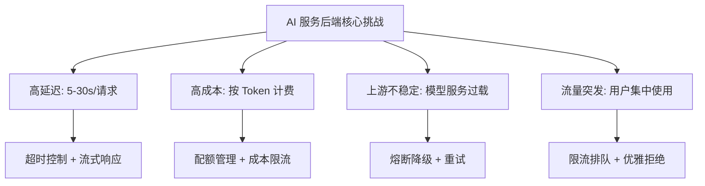
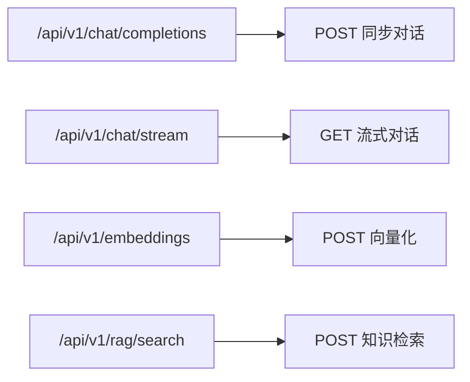
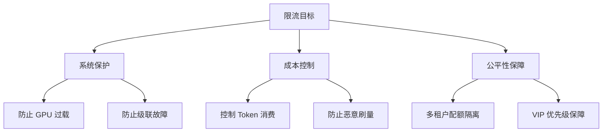
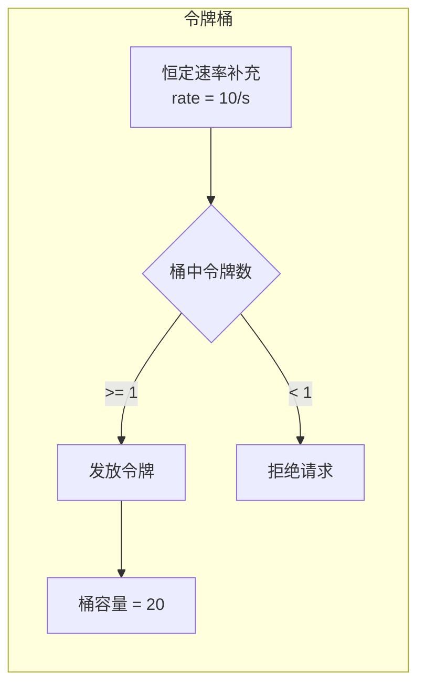
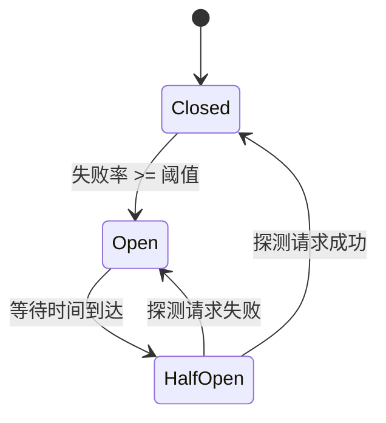
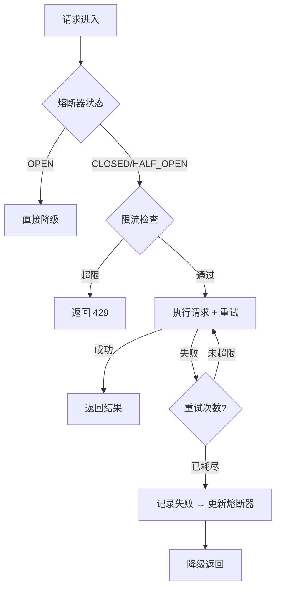
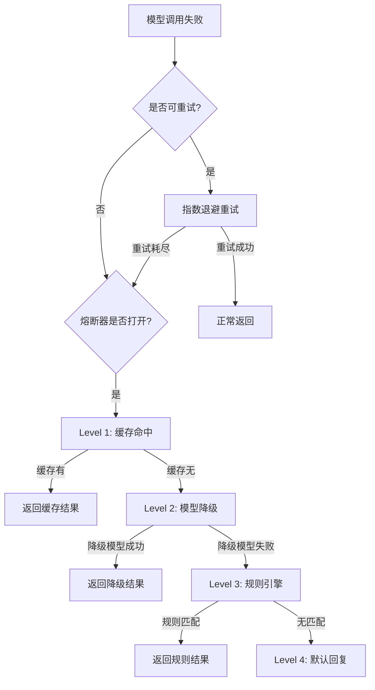
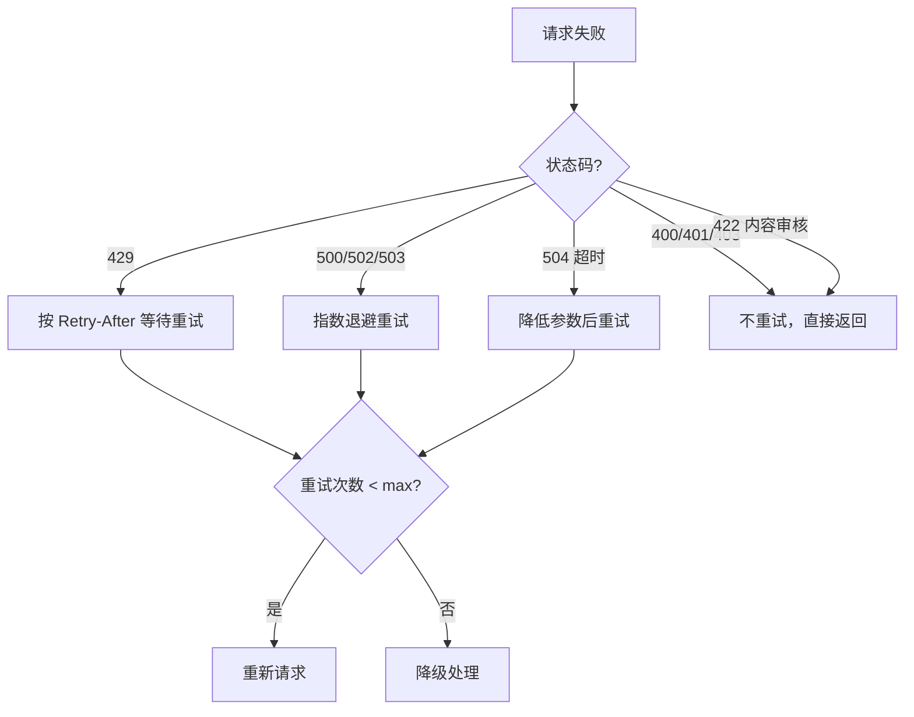

---
title: API 设计与限流熔断
description: RESTful API 设计规范、限流策略、熔断降级、重试机制——构建健壮的 AI 服务后端
date: 2026-06-05T10:00:00+08:00
lastmod: 2026-06-05T10:00:00+08:00
weight: 17
tags:
  - 大模型
  - API设计
  - 限流
  - 熔断
  - 后端工程
categories:
  - 后端与AI工程
  - 技术分享
math: true
mermaid: true
photos:
  - https://d-sketon.top/img/backwebp/bg2.webp
---

## 引言

一个能跑通 Demo 的 AI 服务，和一个能在生产环境中稳定运行的 AI 服务之间，隔着 API 设计、流量控制、容错降级三道关卡。大模型服务与传统 Web 服务有本质差异：单次请求耗时动辄数秒到数十秒、成本与 Token 消耗直接挂钩、上游模型服务自身的稳定性不可控。这些特性使得**限流、熔断、重试**不再是可选项，而是 AI 服务后端的"生命支持系统"。



本文将围绕"如何构建一个健壮的 AI 服务后端"展开，从 API 设计规范出发，深入限流算法、熔断模式、重试策略的原理与 Spring Boot 实现。

## AI API 设计规范

### 与传统 RESTful API 的差异

AI API 在几个关键维度上与传统 CRUD API 不同，这些差异直接影响设计决策：

| 维度 | 传统 API | AI API |
|------|---------|--------|
| **响应时间** | < 500ms | 2-30s |
| **响应方式** | 一次性 JSON | 流式 Token 输出 |
| **成本模型** | 按请求次数 | 按 Token 数量 |
| **幂等性** | 易保证 | 难（模型输出不确定） |
| **错误特征** | 业务逻辑错误 | 速率限制、上下文超限、内容审核 |

### URL 设计



核心设计原则：

1. **版本化**：URL 中包含版本号 `/api/v1/`，便于不兼容变更时平滑迁移
2. **动作语义**：对话用 `POST /chat/completions`，流式用 `GET /chat/stream`（SSE 约定 GET）
3. **资源导向**：`/embeddings`、`/rag/search` 表达资源而非动词

### 请求与响应格式

```json
// POST /api/v1/chat/completions
// Request
{
  "model": "gpt-4o",
  "messages": [
    {"role": "system", "content": "你是技术助手"},
    {"role": "user", "content": "解释 RAG 原理"}
  ],
  "temperature": 0.7,
  "max_tokens": 2048,
  "stream": false
}

// Response 200 OK
{
  "id": "chatcmpl-abc123",
  "model": "gpt-4o",
  "choices": [{
    "message": {"role": "assistant", "content": "RAG 是..."},
    "finish_reason": "stop"
  }],
  "usage": {
    "prompt_tokens": 45,
    "completion_tokens": 312,
    "total_tokens": 357
  },
  "created_at": "2026-06-05T10:00:00Z"
}
```

### SSE 流式协议

Server-Sent Events（SSE）是 AI 流式输出的标准协议。相比 WebSocket，SSE 更简单，基于 HTTP，天然支持断线重连：

```http
GET /api/v1/chat/stream?question=hello HTTP/1.1
Accept: text/event-stream

---

HTTP/1.1 200 OK
Content-Type: text/event-stream
Cache-Control: no-cache
Connection: keep-alive

data: {"token": "你", "index": 0}

data: {"token": "好", "index": 1}

data: {"token": "！", "index": 2}

data: [DONE]
```

每个 `data:` 行是一个事件，空行分隔。`[DONE]` 标记流结束。

```java
import org.springframework.web.bind.annotation.*;
import org.springframework.http.MediaType;
import org.springframework.web.servlet.mvc.method.annotation.SseEmitter;
import reactor.core.publisher.Flux;

@RestController
@RequestMapping("/api/v1/chat")
public class ChatApiController {

    private final ChatService chatService;

    public ChatApiController(ChatService chatService) {
        this.chatService = chatService;
    }

    /**
     * SSE 流式接口（Flux 方式）
     */
    @GetMapping(value = "/stream", produces = MediaType.TEXT_EVENT_STREAM_VALUE)
    public Flux<ChatChunk> stream(@RequestParam String question) {
        return chatService.streamChat(question)
                .map(token -> new ChatChunk(token, 0))
                .concatWith(Flux.just(ChatChunk.done()));
    }

    /**
     * SSE 流式接口（SseEmitter 方式，适用于 MVC）
     */
    @PostMapping("/stream-emitter")
    public SseEmitter streamEmitter(@RequestBody ChatRequest request) {
        SseEmitter emitter = new SseEmitter(120_000L); // 2 分钟超时

        chatService.streamChat(request.question())
                .doOnNext(token -> {
                    try {
                        emitter.send(SseEmitter.event()
                                .data(new ChatChunk(token, 0)));
                    } catch (IOException e) {
                        emitter.completeWithError(e);
                    }
                })
                .doOnComplete(emitter::complete)
                .doOnError(emitter::completeWithError)
                .subscribe();

        return emitter;
    }

    public record ChatRequest(String question) {}
    public record ChatChunk(String token, int index) {
        public static ChatChunk done() {
            return new ChatChunk("[DONE]", -1);
        }
    }
}
```

### 错误码体系

AI API 需要一套完整的错误码体系，帮助客户端区分错误类型并采取不同策略：

| HTTP 状态码 | error 字段 | 含义 | 客户端策略 |
|------------|-----------|------|-----------|
| 400 | `invalid_request` | 请求格式错误 | 修正后重发 |
| 400 | `context_length_exceeded` | 上下文超限 | 截断历史再发 |
| 401 | `authentication_failed` | API Key 无效 | 检查密钥配置 |
| 422 | `content_filtered` | 内容审核拦截 | 修改输入内容 |
| 429 | `rate_limit_exceeded` | 速率限制 | 按 Retry-After 等待 |
| 429 | `quota_exceeded` | 配额耗尽 | 升级套餐或等待 |
| 503 | `model_overloaded` | 模型过载 | 指数退避重试 |
| 504 | `timeout` | 请求超时 | 降低 max_tokens 重试 |

```java
import org.springframework.http.HttpStatus;

public enum AiErrorCode {
    INVALID_REQUEST(HttpStatus.BAD_REQUEST, "invalid_request", "请求参数错误"),
    CONTEXT_LENGTH_EXCEEDED(HttpStatus.BAD_REQUEST, "context_length_exceeded", "上下文长度超限"),
    AUTHENTICATION_FAILED(HttpStatus.UNAUTHORIZED, "authentication_failed", "认证失败"),
    CONTENT_FILTERED(HttpStatus.UNPROCESSABLE_ENTITY, "content_filtered", "内容被审核拦截"),
    RATE_LIMIT_EXCEEDED(HttpStatus.TOO_MANY_REQUESTS, "rate_limit_exceeded", "请求速率超限"),
    QUOTA_EXCEEDED(HttpStatus.TOO_MANY_REQUESTS, "quota_exceeded", "配额已耗尽"),
    MODEL_OVERLOADED(HttpStatus.SERVICE_UNAVAILABLE, "model_overloaded", "模型服务过载"),
    TIMEOUT(HttpStatus.GATEWAY_TIMEOUT, "timeout", "请求超时");

    private final HttpStatus status;
    private final String code;
    private final String message;

    AiErrorCode(HttpStatus status, String code, String message) {
        this.status = status;
        this.code = code;
        this.message = message;
    }

    public ErrorResponse toResponse() {
        return new ErrorResponse(this.code, this.message);
    }

    public record ErrorResponse(String error, String message) {}
}
```

## 限流策略

### 为什么 AI 服务需要限流

AI 服务的限流不仅是保护系统，更是**成本控制**的核心手段：



### 限流维度

AI 服务通常需要**多维度限流**：

| 维度 | 说明 | 示例 |
|------|------|------|
| **全局** | 整个服务的总并发 | 最大 500 并发 |
| **租户** | 按用户/组织隔离 | 免费 10 RPM，付费 100 RPM |
| **模型** | 按模型类型区分 | GPT-4o 50 RPM，mini 200 RPM |
| **Token** | 按 Token 吞吐量 | 10K TPM |

### 令牌桶算法实现

令牌桶是 AI API 限流的首选算法。它既能控制平均速率，又允许合理的突发流量：



使用 Resilience4j 实现令牌桶限流：

```java
import io.github.resilience4j.ratelimiter.RateLimiter;
import io.github.resilience4j.ratelimiter.RateLimiterConfig;
import io.github.resilience4j.ratelimiter.RateLimiterRegistry;
import org.springframework.stereotype.Service;

import java.time.Duration;

@Service
public class RateLimitService {

    private final RateLimiterRegistry registry;

    public RateLimitService() {
        this.registry = RateLimiterRegistry.of(RateLimiterConfig.custom()
                .limitForPeriod(10)                           // 每周期许可数
                .limitRefreshPeriod(Duration.ofSeconds(1))    // 周期 1 秒
                .timeoutDuration(Duration.ofSeconds(5))       // 获取许可超时
                .build());
    }

    /**
     * 按用户维度限流
     */
    public <T> T executeWithLimit(String userId, java.util.function.Supplier<T> action) {
        RateLimiter limiter = registry.rateLimiter("user-" + userId);
        return RateLimiter.decorateSupplier(limiter, action).get();
    }
}
```

### 滑动窗口实现

滑动窗口提供更精确的限流控制，适合需要严格限制的场景：

```java
import java.util.concurrent.ConcurrentLinkedDeque;
import java.time.Instant;

/**
 * 滑动窗口限流器：线程安全
 */
public class SlidingWindowRateLimiter {

    private final int maxRequests;
    private final long windowMillis;
    private final ConcurrentLinkedDeque<Long> timestamps = new ConcurrentLinkedDeque<>();

    public SlidingWindowRateLimiter(int maxRequests, long windowSeconds) {
        this.maxRequests = maxRequests;
        this.windowMillis = windowSeconds * 1000;
    }

    public boolean tryAcquire() {
        long now = System.currentTimeMillis();
        long cutoff = now - windowMillis;

        // 清除过期时间戳
        while (!timestamps.isEmpty() && timestamps.peekFirst() < cutoff) {
            timestamps.pollFirst();
        }

        if (timestamps.size() < maxRequests) {
            timestamps.addLast(now);
            return true;
        }
        return false;
    }

    /**
     * 获取需要等待的毫秒数
     */
    public long waitTimeMillis() {
        if (timestamps.isEmpty() || timestamps.size() < maxRequests) {
            return 0;
        }
        Long oldest = timestamps.peekFirst();
        return Math.max(0, oldest + windowMillis - System.currentTimeMillis());
    }
}
```

### Sentinel 实现多维限流

阿里巴巴的 Sentinel 提供了强大的流量治理能力，特别适合多维度限流场景：

```java
import com.alibaba.csp.sentinel.annotation.SentinelResource;
import com.alibaba.csp.sentinel.slots.block.BlockException;
import org.springframework.stereotype.Service;

@Service
public class SentinelChatService {

    /**
     * 基于 Sentinel 的限流 + 降级
     */
    @SentinelResource(
        value = "chatCompletion",
        blockHandler = "handleBlock",
        fallback = "handleFallback"
    )
    public String chat(String userId, String model, String question) {
        // 实际的模型调用
        return doChat(model, question);
    }

    /**
     * 限流后降级处理
     */
    public String handleBlock(String userId, String model, String question, BlockException ex) {
        return "{\"error\": \"rate_limit\", \"message\": \"当前请求过多，请稍后再试\"}";
    }

    /**
     * 异常后兜底
     */
    public String handleFallback(String userId, String model, String question, Throwable e) {
        return "{\"error\": \"service_unavailable\", \"message\": \"服务暂时不可用\"}";
    }

    private String doChat(String model, String question) {
        // ...
        return "回答内容";
    }
}
```

Sentinel 规则配置（Nacos 动态推送）：

```java
import com.alibaba.csp.sentinel.slots.block.flow.FlowRule;
import com.alibaba.csp.sentinel.slots.block.flow.FlowRuleManager;
import java.util.ArrayList;
import java.util.List;

public class SentinelRuleConfig {

    public static void initRules() {
        List<FlowRule> rules = new ArrayList<>();

        // 全局限流：500 QPS
        FlowRule globalRule = new FlowRule();
        globalRule.setResource("chatCompletion");
        globalRule.setCount(500);
        globalRule.setGrade(RuleConstant.FLOW_GRADE_QPS);
        rules.add(globalRule);

        // 按用户限流（通过参数索引）
        FlowRule userRule = new FlowRule();
        userRule.setResource("chatCompletion");
        userRule.setLimitApp("default");
        userRule.setCount(10);
        userRule.setGrade(RuleConstant.FLOW_GRADE_QPS);
        userRule.setParamIdx(0); // 第 0 个参数 userId
        rules.add(userRule);

        FlowRuleManager.loadRules(rules);
    }
}
```

### 限流算法对比

| 算法 | 突发流量 | 精度 | 内存 | 适用场景 |
|------|---------|------|------|---------|
| 固定窗口 | 边界突刺 | 低 | O(1) | 简单限流 |
| 滑动窗口 | 受限 | 高 | O(n) | 精确限流 |
| 令牌桶 | 允许（桶容量内） | 中高 | O(1) | **AI API（推荐）** |
| 漏桶 | 不允许 | 高 | O(1) | 流量整形 |

## 熔断降级

### Circuit Breaker 模式

当上游模型服务持续不可用时，继续发送请求只会加剧问题（雪崩效应）。**熔断器**（Circuit Breaker）通过自动"切断"请求流，让系统有时间恢复：



三种状态说明：

| 状态 | 行为 | 转换条件 |
|------|------|---------|
| **CLOSED**（关闭） | 正常放行所有请求 | 失败率超阈值 → OPEN |
| **OPEN**（打开） | 直接拒绝所有请求，走降级 | 等待计时结束 → HALF_OPEN |
| **HALF_OPEN**（半开） | 放行少量探测请求 | 探测成功 → CLOSED；失败 → OPEN |

### Resilience4j 熔断实现

```java
import io.github.resilience4j.circuitbreaker.CircuitBreaker;
import io.github.resilience4j.circuitbreaker.CircuitBreakerConfig;
import io.github.resilience4j.circuitbreaker.CircuitBreakerRegistry;
import io.github.resilience4j.decorators.Decorators;
import io.github.resilience4j.ratelimiter.RateLimiter;
import io.vavr.control.Try;

import java.time.Duration;
import java.util.function.Supplier;

@Service
public class CircuitBreakerChatService {

    private final CircuitBreaker circuitBreaker;
    private final ChatClient chatClient;

    public CircuitBreakerChatService(ChatClient chatClient) {
        this.chatClient = chatClient;
        this.circuitBreaker = CircuitBreaker.of("ai-service",
                CircuitBreakerConfig.custom()
                        .failureRateThreshold(50)             // 失败率阈值 50%
                        .slowCallRateThreshold(60)            // 慢调用率阈值 60%
                        .slowCallDurationThreshold(Duration.ofSeconds(10)) // 慢调用标准
                        .waitDurationInOpenState(Duration.ofSeconds(30))   // OPEN 持续时间
                        .permittedNumberOfCallsInHalfOpenState(3)          // 半开探测请求数
                        .slidingWindowSize(20)                // 滑动窗口大小
                        .minimumNumberOfCalls(10)             // 最少调用数才计算
                        .build()
        );
    }

    /**
     * 带熔断保护的对话调用
     */
    public String chatWithProtection(String question) {
        Supplier<String> supplier = () -> chatClient.prompt()
                .user(question)
                .call()
                .content();

        Supplier<String> protectedSupplier = Decorators.ofSupplier(supplier)
                .withCircuitBreaker(circuitBreaker)
                .withFallback(java.util.List.of(Exception.class),
                        e -> "服务暂时不可用，已触发降级保护。")
                .decorate();

        return protectedSupplier.get();
    }

    /**
     * 监听熔断器状态变化
     */
    public void registerListeners() {
        circuitBreaker.getEventPublisher()
                .onStateTransition(e -> {
                    log.warn("熔断器状态变更: {} -> {}",
                            e.getStateTransition().getFromState(),
                            e.getStateTransition().getToState());
                })
                .onCallNotPermitted(e -> {
                    log.warn("请求被熔断器拒绝");
                })
                .onError(e -> {
                    log.error("调用失败，当前失败率: {}%",
                            e.getCircuitBreaker().getMetrics().getFailureRate());
                });
    }
}
```

### 熔断 + 限流 + 重试组合

在生产环境中，这三者通常组合使用，形成多层防护：



```java
@Service
public class ProtectedAiService {

    private final CircuitBreaker circuitBreaker;
    private final RateLimiter rateLimiter;
    private final ChatClient chatClient;

    public ProtectedAiService(ChatClient.Builder builder) {
        this.chatClient = builder.build();

        // 熔断器
        this.circuitBreaker = CircuitBreaker.of("ai-chat",
                CircuitBreakerConfig.custom()
                        .failureRateThreshold(50)
                        .waitDurationInOpenState(Duration.ofSeconds(30))
                        .slidingWindowSize(20)
                        .build());

        // 限流器：10 QPS
        this.rateLimiter = RateLimiter.of("ai-chat",
                RateLimiterConfig.custom()
                        .limitForPeriod(10)
                        .limitRefreshPeriod(Duration.ofSeconds(1))
                        .timeoutDuration(Duration.ofSeconds(3))
                        .build());
    }

    @Retryable(
        retryFor = {TransientException.class},
        maxAttempts = 3,
        backoff = @Backoff(delay = 1000, multiplier = 2)
    )
    @RateLimiter(name = "ai-chat")
    @CircuitBreaker(name = "ai-chat", fallbackMethod = "fallback")
    public String protectedChat(String question) {
        return chatClient.prompt()
                .user(question)
                .call()
                .content();
    }

    /**
     * 熔断降级方法
     */
    public String fallback(String question, Exception e) {
        // 1. 尝试缓存
        String cached = cache.getIfPresent(question);
        if (cached != null) {
            return cached;
        }

        // 2. 返回默认提示
        return "AI 服务当前不可用，您的请求已排队，请稍后重试。";
    }
}
```

> **注解方案**：使用 `@CircuitBreaker`、`@RateLimiter` 注解需要引入 `resilience4j-spring-boot3` 依赖并配合 `@EnableAspectJAutoProxy`。

### 降级策略设计

降级不是"返回错误"，而是"提供替代方案"。AI 服务的降级策略应分级设计：



```java
@Service
public class FallbackChain {

    private final ChatClient primaryClient;
    private final ChatClient fallbackClient;
    private final Cache<String, String> semanticCache;
    private final RuleEngine ruleEngine;

    public String execute(String question) {
        // Level 0: 规则引擎快速通道
        String ruleAnswer = ruleEngine.match(question);
        if (ruleAnswer != null) {
            return ruleAnswer;
        }

        // Level 1: 语义缓存
        String cached = semanticCache.getIfPresent(question);
        if (cached != null) {
            return cached;
        }

        try {
            // Level 2: 主模型
            String answer = callWithRetry(primaryClient, question);
            semanticCache.put(question, answer);
            return answer;
        } catch (Exception primaryError) {
            try {
                // Level 3: 降级模型
                String fallback = callWithRetry(fallbackClient, question);
                return fallback;
            } catch (Exception fallbackError) {
                // Level 4: 默认回复
                return "抱歉，AI 服务暂时繁忙，请稍后重试。";
            }
        }
    }

    @Retryable(maxAttempts = 3,
               backoff = @Backoff(delay = 1000, multiplier = 2, maxDelay = 10000),
               retryFor = TransientException.class)
    private String callWithRetry(ChatClient client, String question) {
        return client.prompt().user(question).call().content();
    }
}
```

## 重试机制

### 什么情况应该重试

并非所有错误都适合重试。错误分为两类：

| 错误类型 | 示例 | 是否重试 | 原因 |
|---------|------|---------|------|
| **瞬时错误** | 429、503、超时、网络抖动 | ✅ 重试 | 下次可能成功 |
| **永久错误** | 400、401、403、422 | ❌ 不重试 | 重试也不会成功 |



### 指数退避

指数退避的核心思想：每次重试等待时间按指数增长，避免重试风暴：

$$
\text{wait}_n = \min(\text{base} \times 2^n + \text{jitter}, \text{maxDelay})
$$

```java
import java.util.Random;

/**
 * 指数退避计算器
 */
public class ExponentialBackoff {

    private final long baseDelayMs;
    private final long maxDelayMs;
    private final double jitterRatio;
    private final Random random = new Random();

    public ExponentialBackoff(long baseDelayMs, long maxDelayMs, double jitterRatio) {
        this.baseDelayMs = baseDelayMs;
        this.maxDelayMs = maxDelayMs;
        this.jitterRatio = jitterRatio;
    }

    /**
     * 计算第 n 次重试的等待时间（毫秒）
     */
    public long getDelay(int attempt) {
        long exponential = (long) (baseDelayMs * Math.pow(2, attempt));
        long capped = Math.min(exponential, maxDelayMs);
        long jitter = (long) (capped * jitterRatio * random.nextDouble());
        return capped + jitter;
    }
}

// 使用示例：base=1s, max=60s, jitter=10%
ExponentialBackoff backoff = new ExponentialBackoff(1000, 60000, 0.1);
// 第 0 次: ~1000ms
// 第 1 次: ~2000ms
// 第 2 次: ~4000ms
// 第 3 次: ~8000ms
// 第 4 次: ~16000ms
// 第 5 次: ~32000ms
// 第 6 次: ~60000ms (capped)
```

### Spring Retry 注解化

```java
import org.springframework.retry.annotation.Backoff;
import org.springframework.retry.annotation.Retryable;
import org.springframework.retry.annotation.Recover;
import org.springframework.stereotype.Service;

@Service
public class RetryableChatService {

    /**
     * 可重试的模型调用
     */
    @Retryable(
        retryFor = {TransientAiException.class},
        noRetryFor = {PermanentAiException.class},
        maxAttempts = 4,
        backoff = @Backoff(
            delay = 1000,          // 初始延迟 1s
            multiplier = 2.0,      // 指数倍数
            maxDelay = 30000,      // 最大延迟 30s
            random = true          // 添加随机性
        )
    )
    public String chatWithRetry(String question) {
        return callModel(question);
    }

    /**
     * 重试耗尽后的恢复方法
     * 方法签名必须与原方法一致（参数 + 返回值），追加一个 Exception 参数
     */
    @Recover
    public String recover(TransientAiException e, String question) {
        log.error("模型调用重试耗尽，执行降级。问题: {}", question, e);
        return "服务暂时不可用，请稍后重试。";
    }

    private String callModel(String question) {
        try {
            return chatClient.prompt()
                    .user(question)
                    .call()
                    .content();
        } catch (Exception e) {
            if (isTransient(e)) {
                throw new TransientAiException("瞬时错误", e);
            }
            throw new PermanentAiException("永久错误", e);
        }
    }

    private boolean isTransient(Exception e) {
        String msg = e.getMessage();
        return msg != null && (msg.contains("429") || msg.contains("503"));
    }
}
```

### 自定义重试模板

对于需要更精细控制的场景，可以使用 `RetryTemplate`：

```java
import org.springframework.retry.RetryCallback;
import org.springframework.retry.RetryContext;
import org.springframework.retry.backoff.ExponentialBackOffPolicy;
import org.springframework.retry.policy.SimpleRetryPolicy;
import org.springframework.retry.support.RetryTemplate;
import org.springframework.stereotype.Component;

@Component
public class AiRetryTemplate {

    private final RetryTemplate retryTemplate;

    public AiRetryTemplate() {
        this.retryTemplate = RetryTemplate.builder()
                .maxAttempts(4)
                .exponentialBackoff(1000, 2.0, 30000)
                .retryOn(TransientAiException.class)
                .traversingCauses()
                .build();

        // 注册监听器，记录重试日志
        retryTemplate.registerListener(new org.springframework.retry.RetryListener() {
            @Override
            public <T, E extends Throwable> void onError(
                    RetryContext context, RetryCallback<T, E> callback,
                    Throwable throwable) {
                log.warn("第 {} 次重试失败: {}",
                        context.getRetryCount(), throwable.getMessage());
            }
        });
    }

    public <T> T execute(RetryCallback<T, Exception> action) throws Exception {
        return retryTemplate.execute(action);
    }
}

// 使用
@Service
public class ChatService {

    private final AiRetryTemplate retryTemplate;
    private final ChatClient chatClient;

    public String chat(String question) throws Exception {
        return retryTemplate.execute(context -> {
            // 可从 context 获取重试次数
            int attempt = context.getRetryCount();
            log.debug("第 {} 次尝试调用模型", attempt + 1);
            return chatClient.prompt()
                    .user(question)
                    .call()
                    .content();
        });
    }
}
```

## 完整示例：健壮的 AI API 端点

整合所有组件，构建一个生产可用的 AI 对话端点：

```java
package com.example.aiapi.controller;

import com.example.aiapi.dto.*;
import com.example.aiapi.service.*;
import io.github.resilience4j.circuitbreaker.annotation.CircuitBreaker;
import io.github.resilience4j.ratelimiter.annotation.RateLimiter;
import org.springframework.http.MediaType;
import org.springframework.web.bind.annotation.*;
import reactor.core.publisher.Flux;

@RestController
@RequestMapping("/api/v1/chat")
public class RobustChatController {

    private final ProtectedAiService aiService;

    public RobustChatController(ProtectedAiService aiService) {
        this.aiService = aiService;
    }

    /**
     * 同步对话：限流 + 熔断 + 重试
     */
    @PostMapping("/completions")
    @RateLimiter(name = "chat-api", fallbackMethod = "rateLimitFallback")
    @CircuitBreaker(name = "chat-api", fallbackMethod = "circuitBreakerFallback")
    public ApiResponse<ChatResult> completions(@RequestBody ChatRequest request) {
        String answer = aiService.protectedChat(request.question());
        return ApiResponse.success(new ChatResult(answer, "gpt-4o"));
    }

    /**
     * 流式对话
     */
    @GetMapping(value = "/stream", produces = MediaType.TEXT_EVENT_STREAM_VALUE)
    @RateLimiter(name = "chat-stream")
    public Flux<String> stream(@RequestParam String question) {
        return aiService.streamChat(question);
    }

    // ============ 降级方法 ============

    public ApiResponse<ChatResult> rateLimitFallback(ChatRequest request, Throwable t) {
        return ApiResponse.error(429, "rate_limit",
                "请求过于频繁，请稍后再试", null);
    }

    public ApiResponse<ChatResult> circuitBreakerFallback(ChatRequest request, Throwable t) {
        return ApiResponse.error(503, "circuit_open",
                "AI 服务暂时不可用，已触发熔断保护", null);
    }

    // ============ DTO ============

    public record ChatRequest(String question, String model) {}
    public record ChatResult(String answer, String model) {}

    public static class ApiResponse<T> {
        private boolean success;
        private T data;
        private ErrorInfo error;

        public static <T> ApiResponse<T> success(T data) {
            ApiResponse<T> r = new ApiResponse<>();
            r.success = true;
            r.data = data;
            return r;
        }

        public static <T> ApiResponse<T> error(int code, String type, String message, T data) {
            ApiResponse<T> r = new ApiResponse<>();
            r.success = false;
            r.error = new ErrorInfo(code, type, message);
            r.data = data;
            return r;
        }

        public record ErrorInfo(int code, String type, String message) {}
    }
}
```

## 监控与告警

健壮的服务需要完善的可观测性。关键指标：

| 指标 | 含义 | 告警阈值 |
|------|------|---------|
| `ai.request.total` | 请求总数 | - |
| `ai.request.success_rate` | 成功率 | < 95% |
| `ai.request.p99_latency` | P99 延迟 | > 15s |
| `ai.retry.count` | 重试次数 | > 总请求 20% |
| `ai.circuit.state` | 熔断器状态 | = OPEN |
| `ai.rate_limit.rejected` | 限流拒绝数 | > 50/min |
| `ai.token.usage` | Token 消耗 | 日预算 80% |

## 最佳实践清单

| 场景 | 推荐策略 |
|------|---------|
| **对话 API** | 令牌桶限流 + 熔断 + 指数退避重试 + SSE 流式 |
| **批量处理** | 漏桶限流 + 信号量并发控制 + 失败队列 |
| **内部服务调用** | 熔断 + 重试，限流可放宽 |
| **开放平台 API** | 多维限流（用户/模型/Token）+ 配额管理 |
| **高优 VIP** | 独立限流配额 + 优先级队列 |

通用原则：

1. **快速失败优于长时间等待**：宁可快速返回错误，也不要让请求无限堆积
2. **限流是预防，熔断是保护，重试是治疗**：三者协同，不可互相替代
3. **降级要有意义**：降级返回的内容必须对用户有用，而非空数据
4. **抖动是必须的**：多实例部署时，无抖动的退避会导致同步重试风暴
5. **监控驱动调参**：根据实际指标数据调整阈值，而非拍脑袋

## 结语

API 设计、限流、熔断、重试，构成了 AI 服务后端的"韧性四件套"。

**API 设计**定义了服务的契约——清晰的 URL、规范的请求响应格式、完整的错误码体系，让客户端能正确调用并优雅处理异常。

**限流**是系统的"减压阀"——令牌桶算法在控制平均速率的同时允许合理突发，多维限流（用户/模型/Token）确保资源公平分配。

**熔断**是系统的"保险丝"——当上游持续故障时主动切断请求流，防止雪崩，半开探测机制让系统自动恢复。

**重试**是系统的"自愈力"——区分瞬时错误与永久错误，指数退避 + 随机抖动避免重试风暴。

四者协同，才能让 AI 服务在面对流量突发、上游故障、资源瓶颈时，依然保持可预测的行为和可接受的体验。下一篇我们将探讨 AI 应用的异步处理与消息队列，解决长耗时任务和事件驱动架构的问题。

## 参考文献

1. Resilience4j Documentation. https://resilience4j.readme.io/
2. Sentinel GitHub. https://github.com/alibaba/Sentinel
3. Spring Retry. https://spring.io/projects/spring-retry
4. Microsoft - Circuit Breaker Pattern. https://learn.microsoft.com/en-us/azure/architecture/patterns/circuit-breaker
5. Google SRE Book - Handling Overload. https://sre.google/sre-book/handling-overload/
6. RFC 6585 - Additional HTTP Status Codes. IETF, 2012.
