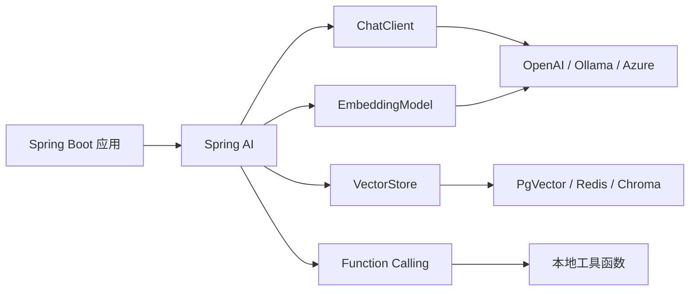
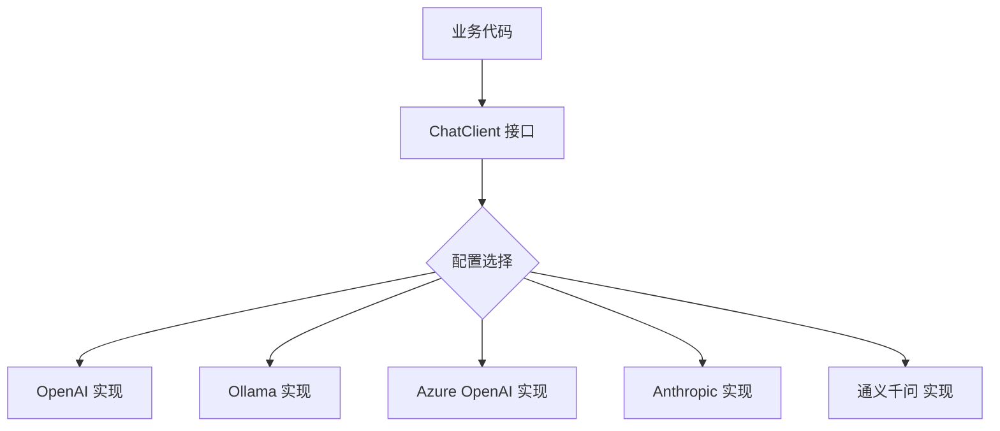
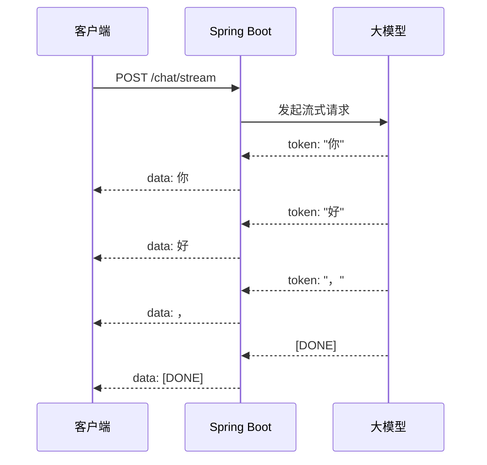
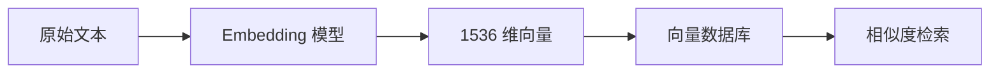
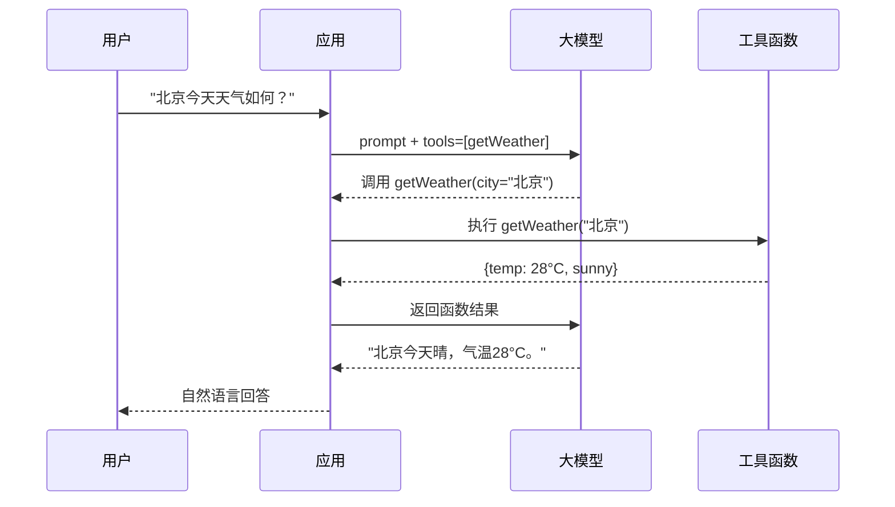
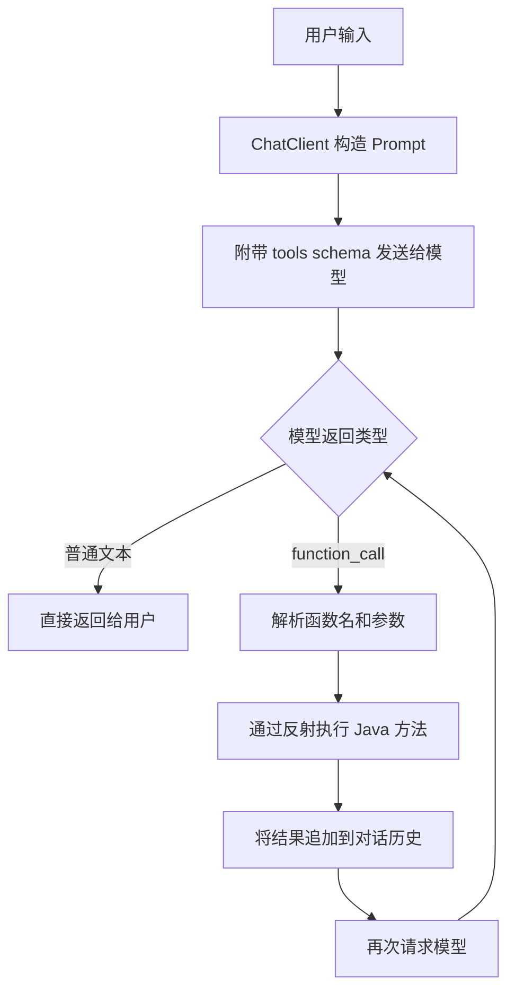
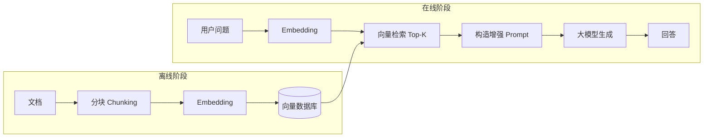

## 引言

当 Java 开发者面对大模型应用开发时，往往会遇到一个尴尬的局面：几乎所有前沿的 AI SDK、示例和教程都围绕 Python 生态（LangChain、LlamaIndex、OpenAI SDK），而企业级生产系统却大量运行在 Spring Boot 上。开发者不得不在 Python 微服务和 Java 主业务系统之间架设一层胶水代码，徒增运维复杂度。

**Spring AI** 的出现正是为了弥合这一鸿沟。它将 Spring 生态成熟的工程实践（依赖注入、自动配置、Starter 机制、可观测性）带入 AI 应用开发，让 Java 开发者能用熟悉的方式集成各类大模型、向量数据库和 RAG 流程。



本文将从零开始，完整实践 SpringAI 的集成路径：项目搭建 → ChatClient 基础调用 → 流式响应 → Embedding 与向量存储 → Function Calling → RAG 检索增强，最终组装出一个生产可用的 Controller 服务。

## SpringAI 框架概述

### 设计理念

SpringAI 的核心设计理念是**可移植性**（Portability）与**抽象统一**（Abstraction）。正如 Spring Data 统一了不同数据库的访问方式，SpringAI 统一了不同 AI 模型提供商的调用接口：

| 抽象接口 | 作用 | 对应概念 |
|---------|------|---------|
| `ChatModel` | 文本对话生成 | OpenAI Chat / Anthropic Messages |
| `ChatClient` | 流畅的对话客户端 | 类似 RestTemplate 的 Fluent API |
| `EmbeddingModel` | 文本向量化 | text-embedding / bge-embedding |
| `VectorStore` | 向量存储与检索 | Pinecone / PgVector / Redis |
| `ImageModel` | 图像生成 | DALL-E / Stable Diffusion |
| `AudioModel` | 语音合成 / 识别 | TTS / Whisper |

通过这套抽象，切换模型提供商只需修改依赖和配置，无需改动业务代码：



### 版本说明

本文基于 **Spring Boot 3.3.x + Spring AI 1.0.x** 编写。Spring AI 从 1.0 开始提供稳定的 GA 版本，要求 JDK 17+。

## 项目搭建

### 创建项目

使用 Spring Initializr 创建项目，选择以下依赖：

- Spring Web（提供 REST 控制器）
- Spring AI OpenAI Starter（或按需选择其他模型 Starter）

### Maven 依赖

```xml
<project xmlns="http://maven.apache.org/POM/4.0.0"
         xmlns:xsi="http://www.w3.org/2001/XMLSchema-instance"
         xsi:schemaLocation="http://maven.apache.org/POM/4.0.0
         https://maven.apache.org/xsd/maven-4.0.0.xsd">
    <modelVersion>4.0.0</modelVersion>

    <parent>
        <groupId>org.springframework.boot</groupId>
        <artifactId>spring-boot-starter-parent</artifactId>
        <version>3.3.0</version>
        <relativePath/>
    </parent>

    <groupId>com.example</groupId>
    <artifactId>springai-demo</artifactId>
    <version>0.0.1-SNAPSHOT</version>

    <properties>
        <java.version>17</java.version>
        <spring-ai.version>1.0.0</spring-ai.version>
    </properties>

    <dependencies>
        <!-- Spring Boot Web -->
        <dependency>
            <groupId>org.springframework.boot</groupId>
            <artifactId>spring-boot-starter-web</artifactId>
        </dependency>

        <!-- Spring AI OpenAI Starter -->
        <dependency>
            <groupId>org.springframework.ai</groupId>
            <artifactId>spring-ai-openai-spring-boot-starter</artifactId>
        </dependency>

        <!-- 向量数据库：PgVector -->
        <dependency>
            <groupId>org.springframework.ai</groupId>
            <artifactId>spring-ai-pgvector-store-spring-boot-starter</artifactId>
        </dependency>

        <!-- Spring Retry：用于重试机制 -->
        <dependency>
            <groupId>org.springframework.retry</groupId>
            <artifactId>spring-retry</artifactId>
        </dependency>

        <dependency>
            <groupId>org.springframework.boot</groupId>
            <artifactId>spring-boot-starter-test</artifactId>
            <scope>test</scope>
        </dependency>
    </dependencies>

    <!-- Spring AI BOM -->
    <dependencyManagement>
        <dependencies>
            <dependency>
                <groupId>org.springframework.ai</groupId>
                <artifactId>spring-ai-bom</artifactId>
                <version>${spring-ai.version}</version>
                <type>pom</type>
                <scope>import</scope>
            </dependency>
        </dependencies>
    </dependencyManagement>

    <repositories>
        <repository>
            <id>spring-milestones</id>
            <name>Spring Milestones</name>
            <url>https://repo.spring.io/milestone</url>
            <snapshots><enabled>false</enabled></snapshots>
        </repository>
    </repositories>
</project>
```

> **提示**：Spring AI 的发布包在 Spring Milestone 仓库中，需要额外添加 `spring-milestones` 仓库。

### 配置文件

```yaml
# application.yml
spring:
  ai:
    openai:
      api-key: ${OPENAI_API_KEY}        # 从环境变量读取，不要硬编码
      base-url: https://api.openai.com   # 可替换为兼容 API 地址
      chat:
        options:
          model: gpt-4o
          temperature: 0.7
          max-tokens: 2048
      embedding:
        options:
          model: text-embedding-3-small
    vectorstore:
      pgvector:
        index-type: HNSW
        distance-type: COSINE_DISTANCE
        dimensions: 1536
  datasource:
    url: jdbc:postgresql://localhost:5432/springai
    username: ${DB_USER}
    password: ${DB_PASSWORD}
  jpa:
    hibernate:
      ddl-auto: update

server:
  port: 8080
```

### 替换为国产模型

如果使用通义千问、智谱等国产模型，只需替换 Starter 和配置。以下以兼容 OpenAI 接口的方案为例：

```yaml
spring:
  ai:
    openai:
      api-key: ${DASHSCOPE_API_KEY}
      base-url: https://dashscope.aliyuncs.com/compatible-mode
      chat:
        options:
          model: qwen-plus
```

这种"兼容模式"是国产模型走向 OpenAI API 兼容的事实标准，让 Spring AI 的 OpenAI Starter 可以无缝对接。

## ChatClient 基础调用

### ChatClient vs ChatModel

SpringAI 提供两种调用模型的方式：

| 特性 | `ChatModel` | `ChatClient` |
|------|------------|-------------|
| **风格** | 命令式，直接传参 | Fluent Builder 链式调用 |
| **角色** | 底层接口 | 高层封装（推荐） |
| **系统提示** | 手动拼接 messages | `.system()` 方法 |
| **默认配置** | 无 | 支持全局默认值 |
| **输出类型** | 始终返回 String | 支持结构化输出（Bean / List） |

**实践建议**：业务代码统一使用 `ChatClient`，它在可读性和可维护性上显著优于直接操作 `ChatModel`。

### 同步调用

```java
import org.springframework.ai.chat.client.ChatClient;
import org.springframework.stereotype.Service;

@Service
public class ChatService {

    private final ChatClient chatClient;

    // Spring AI 自动注入 ChatClient.Builder
    public ChatService(ChatClient.Builder builder) {
        this.chatClient = builder
                .defaultSystem("你是一个专业的技术助手，回答简洁准确。")
                .build();
    }

    /**
     * 基础同步调用
     */
    public String ask(String question) {
        return chatClient.prompt()
                .user(question)
                .call()
                .content();
    }

    /**
     * 带参数控制的调用
     */
    public String askWithOptions(String question, double temperature) {
        return chatClient.prompt()
                .system("你是一个创意写作助手。")
                .user(question)
                .options(org.springframework.ai.chat.prompt.ChatOptionsBuilder
                        .builder()
                        .temperature(temperature)
                        .maxTokens(1024)
                        .build())
                .call()
                .content();
    }
}
```

### 结构化输出

SpringAI 的一个强大特性是直接将模型输出映射为 Java 对象，无需手动解析 JSON：

```java
/**
 * 结构化输出 DTO
 */
public record SentimentResult(
    String sentiment,    // positive / negative / neutral
    double confidence,
    String summary
) {}

@Service
public class AnalysisService {

    private final ChatClient chatClient;

    public AnalysisService(ChatClient.Builder builder) {
        this.chatClient = builder.build();
    }

    /**
     * 情感分析：直接返回结构化对象
     */
    public SentimentResult analyzeSentiment(String text) {
        return chatClient.prompt()
                .system("""
                    分析用户输入文本的情感倾向。
                    返回 JSON 格式：sentiment(positive/negative/neutral)、
                    confidence(0-1)、summary(简短说明)。
                    """)
                .user(text)
                .call()
                .entity(SentimentResult.class);
    }

    /**
     * 返回列表：提取关键要点
     */
    public List<String> extractKeyPoints(String article) {
        return chatClient.prompt()
                .system("从文章中提取 3-5 个关键要点，每点一句话。")
                .user(article)
                .call()
                .entity(new org.springframework.core.ParameterizedTypeReference<>() {});
    }
}
```

### 流式响应

流式响应（Streaming）是 AI 应用的核心体验。大模型生成文本需要数秒到数十秒，流式输出让用户逐字看到结果，大幅降低感知延迟：



```java
import org.springframework.web.bind.annotation.*;
import org.springframework.http.MediaType;
import reactor.core.publisher.Flux;

@RestController
@RequestMapping("/api/chat")
public class ChatController {

    private final ChatService chatService;

    public ChatController(ChatService chatService) {
        this.chatService = chatService;
    }

    /**
     * 同步接口
     */
    @PostMapping("/ask")
    public ChatResponse ask(@RequestBody ChatRequest request) {
        String answer = chatService.ask(request.question());
        return new ChatResponse(answer);
    }

    /**
     * 流式接口：返回 SSE（Server-Sent Events）流
     */
    @GetMapping(value = "/stream", produces = MediaType.TEXT_EVENT_STREAM_VALUE)
    public Flux<String> stream(@RequestParam String question) {
        return chatService.streamAsk(question);
    }

    public record ChatRequest(String question) {}
    public record ChatResponse(String answer) {}
}
```

在 `ChatService` 中实现流式调用：

```java
import reactor.core.publisher.Flux;

@Service
public class ChatService {

    private final ChatClient chatClient;

    // ... 构造方法同上

    /**
     * 流式调用：返回 Flux<String>
     */
    public Flux<String> streamAsk(String question) {
        return chatClient.prompt()
                .user(question)
                .stream()
                .content();
    }
}
```

> **注意**：流式响应要求使用 WebFlux 或 Spring MVC 的异步支持。Spring Boot 3.x 的 Spring MVC 原生支持返回 `Fllux` 作为 SSE 流。

## Embedding 模型集成

### 向量化原理

Embedding（嵌入）是将文本映射为高维向量的过程，使得语义相近的文本在向量空间中距离也相近。这是 RAG（检索增强生成）和语义搜索的基础。

$$
\text{similarity}(A, B) = \cos(\theta) = \frac{\vec{A} \cdot \vec{B}}{|\vec{A}| \times |\vec{B}|}
$$



### EmbeddingModel 使用

```java
import org.springframework.ai.embedding.EmbeddingModel;
import org.springframework.ai.embedding.EmbeddingResponse;
import org.springframework.stereotype.Service;

@Service
public class EmbeddingService {

    private final EmbeddingModel embeddingModel;

    public EmbeddingService(EmbeddingModel embeddingModel) {
        this.embeddingModel = embeddingModel;
    }

    /**
     * 单文本向量化
     */
    public float[] embed(String text) {
        return embeddingModel.embed(text);
    }

    /**
     * 批量向量化
     */
    public EmbeddingResponse embedBatch(List<String> texts) {
        return embeddingModel.embedForResponse(texts);
    }

    /**
     * 计算两段文本的余弦相似度
     */
    public double similarity(String textA, String textB) {
        float[] vecA = embeddingModel.embed(textA);
        float[] vecB = embeddingModel.embed(textB);
        return cosineSimilarity(vecA, vecB);
    }

    private double cosineSimilarity(float[] a, float[] b) {
        double dot = 0, normA = 0, normB = 0;
        for (int i = 0; i < a.length; i++) {
            dot += a[i] * b[i];
            normA += a[i] * a[i];
            normB += b[i] * b[i];
        }
        return dot / (Math.sqrt(normA) * Math.sqrt(normB));
    }
}
```

## Function Calling / Tool 实现

### 什么是 Function Calling

Function Calling 让大模型能够"调用"外部函数。模型本身不执行代码，而是根据用户意图决定**应该调用哪个函数、传什么参数**，由应用层执行后将结果返回给模型。



### 定义工具函数

SpringAI 提供了 `@Tool` 注解（或使用函数式注册），让定义工具变得非常简洁：

```java
import org.springframework.ai.tool.annotation.Tool;
import org.springframework.ai.tool.annotation.ToolParam;
import org.springframework.stereotype.Component;

@Component
public class WeatherTools {

    /**
     * 查询天气（模拟实现）
     */
    @Tool(description = "查询指定城市的当前天气信息")
    public WeatherInfo getWeather(
            @ToolParam(description = "城市名称，如：北京、上海") String city
    ) {
        // 实际项目中调用天气 API
        return mockWeather(city);
    }

    /**
     * 查询多日天气预报
     */
    @Tool(description = "查询指定城市未来几天的天气预报")
    public List<WeatherInfo> getForecast(
            @ToolParam(description = "城市名称") String city,
            @ToolParam(description = "预报天数，1-7") int days
    ) {
        return mockForecast(city, days);
    }

    public record WeatherInfo(String city, double temp, String condition) {}

    private WeatherInfo mockWeather(String city) {
        return new WeatherInfo(city, 25.0 + Math.random() * 10, "晴");
    }

    private List<WeatherInfo> mockForecast(String city, int days) {
        return java.util.stream.IntStream.range(0, days)
                .mapToObj(i -> new WeatherInfo(city, 20.0 + i, "多云"))
                .toList();
    }
}
```

### 在 ChatClient 中使用工具

```java
@Service
public class ToolChatService {

    private final ChatClient chatClient;
    private final WeatherTools weatherTools;

    public ToolChatService(
            ChatClient.Builder builder,
            WeatherTools weatherTools
    ) {
        this.weatherTools = weatherTools;
        this.chatClient = builder.build();
    }

    /**
     * 带工具的对话：模型自动决定是否调用天气查询
     */
    public String chatWithTools(String userMessage) {
        return chatClient.prompt()
                .user(userMessage)
                .tools(weatherTools)       // 注册工具
                .call()
                .content();
    }
}
```

### 工具调用流程详解

当注册了工具后，SpringAI 的处理流程如下：



模型可能进行**多轮工具调用**。例如用户问"对比北京和上海的天气"，模型可能连续调用两次 `getWeather`，再综合生成回答。

### 更多工具示例：数据库查询

```java
@Component
public class DatabaseTools {

    private final JdbcTemplate jdbcTemplate;

    public DatabaseTools(JdbcTemplate jdbcTemplate) {
        this.jdbcTemplate = jdbcTemplate;
    }

    @Tool(description = "查询订单总数和总金额")
    public OrderStats queryOrderStats(
            @ToolParam(description = "开始日期 yyyy-MM-dd") String startDate,
            @ToolParam(description = "结束日期 yyyy-MM-dd") String endDate
    ) {
        Map<String, Object> result = jdbcTemplate.queryForMap(
                """
                SELECT COUNT(*) as total_orders, COALESCE(SUM(amount), 0) as total_amount
                FROM orders WHERE order_date BETWEEN ? AND ?
                """,
                startDate, endDate
        );
        return new OrderStats(
                ((Number) result.get("total_orders")).longValue(),
                ((Number) result.get("total_amount")).doubleValue()
        );
    }

    public record OrderStats(long totalOrders, double totalAmount) {}
}
```

## RAG 集成

### RAG 架构回顾

RAG（Retrieval-Augmented Generation）通过检索外部知识来增强模型回答，是解决模型知识过时和幻觉问题的关键手段。



### 文档加载与分块

```java
import org.springframework.ai.document.Document;
import org.springframework.ai.transformer.splitter.TextSplitter;
import org.springframework.ai.reader.tika.TikaDocumentReader;
import org.springframework.core.io.Resource;
import java.util.List;

@Service
public class DocumentIngestService {

    private final VectorStore vectorStore;
    private final EmbeddingModel embeddingModel;

    public DocumentIngestService(VectorStore vectorStore, EmbeddingModel embeddingModel) {
        this.vectorStore = vectorStore;
        this.embeddingModel = embeddingModel;
    }

    /**
     * 加载并入库文档
     */
    public int ingest(Resource resource) {
        // 1. 使用 Tika 读取多种格式（PDF、Word、TXT 等）
        TikaDocumentReader reader = new TikaDocumentReader(resource);
        List<Document> documents = reader.get();

        // 2. 添加元数据
        documents.forEach(doc -> {
            doc.getMetadata().put("source", resource.getFilename());
            doc.getMetadata().put("ingestedAt", java.time.Instant.now().toString());
        });

        // 3. 分块
        TextSplitter splitter = new TokenTextSplitter(
                800,   // 每块最大 token 数
                200,   // 最小块大小
                20,    // 每块 token 数的安全余量
                10000, // 单文档最大 token 数
                true
        );
        List<Document> chunks = splitter.apply(documents);

        // 4. 写入向量数据库
        vectorStore.add(chunks);

        return chunks.size();
    }
}
```

### 检索增强生成

```java
import org.springframework.ai.vectorstore.SearchRequest;

@Service
public class RagService {

    private final ChatClient chatClient;
    private final VectorStore vectorStore;

    public RagService(ChatClient.Builder builder, VectorStore vectorStore) {
        this.chatClient = builder
                .defaultSystem("""
                    你是一个知识库问答助手。请根据提供的参考信息回答用户问题。
                    如果参考信息中没有答案，请明确告知"根据现有资料无法回答"。
                    回答时请引用信息来源。
                    """)
                .build();
        this.vectorStore = vectorStore;
    }

    /**
     * RAG 问答
     */
    public RagAnswer answer(String question) {
        // 1. 向量检索 Top-5 相关文档
        List<Document> docs = vectorStore.similaritySearch(
                SearchRequest.builder()
                        .query(question)
                        .topK(5)
                        .similarityThreshold(0.7)
                        .build()
        );

        // 2. 拼接上下文
        String context = docs.stream()
                .map(Document::getText)
                .collect(Collectors.joining("\n\n---\n\n"));

        // 3. 构造增强 Prompt 并调用模型
        String answer = chatClient.prompt()
                .user(u -> u.text("""
                    参考信息：
                    {context}

                    问题：{question}
                    """)
                    .param("context", context)
                    .param("question", question))
                .call()
                .content();

        return new RagAnswer(answer, docs.size());
    }

    public record RagAnswer(String answer, int sourcesCount) {}
}
```

### VectorStore 实现对比

| 向量数据库 | 优势 | 适用场景 |
|-----------|------|---------|
| **PgVector** | 复用 PostgreSQL 生态，事务支持 | 中小规模，已有 PG 基础设施 |
| **Redis** | 低延迟，内存级速度 | 实时推荐、缓存场景 |
| **Chroma** | 轻量，开发友好 | 开发测试、原型验证 |
| **Milvus** | 分布式，亿级向量 | 大规模生产环境 |
| **Pinecone** | 全托管，免运维 | 不想维护基础设施 |

切换 VectorStore 只需修改依赖和配置，业务代码完全不变：

```yaml
# 切换为 Redis 向量存储
spring:
  ai:
    vectorstore:
      redis:
        index: spring-ai-index
        prefix: "doc:"
```

## 完整 Controller 示例

将前面的能力组装成一个完整的 REST API 服务：

```java
package com.example.springai.controller;

import com.example.springai.service.*;
import org.springframework.ai.document.Document;
import org.springframework.ai.vectorstore.SearchRequest;
import org.springframework.core.io.FileSystemResource;
import org.springframework.http.MediaType;
import org.springframework.web.bind.annotation.*;
import org.springframework.web.multipart.MultipartFile;
import reactor.core.publisher.Flux;

import java.io.IOException;
import java.nio.file.Files;
import java.nio.file.Path;
import java.util.List;
import java.util.Map;
import java.util.stream.Collectors;

@RestController
@RequestMapping("/api/ai")
public class AiController {

    private final ChatService chatService;
    private final ToolChatService toolChatService;
    private final RagService ragService;
    private final DocumentIngestService ingestService;

    public AiController(
            ChatService chatService,
            ToolChatService toolChatService,
            RagService ragService,
            DocumentIngestService ingestService
    ) {
        this.chatService = chatService;
        this.toolChatService = toolChatService;
        this.ragService = ragService;
        this.ingestService = ingestService;
    }

    // ============ 对话 ============

    @PostMapping("/chat")
    public Map<String, String> chat(@RequestBody Map<String, String> body) {
        String answer = chatService.ask(body.get("question"));
        return Map.of("answer", answer);
    }

    @GetMapping(value = "/chat/stream", produces = MediaType.TEXT_EVENT_STREAM_VALUE)
    public Flux<String> chatStream(@RequestParam String question) {
        return chatService.streamAsk(question);
    }

    // ============ 工具调用 ============

    @PostMapping("/chat/tools")
    public Map<String, String> chatWithTools(@RequestBody Map<String, String> body) {
        String answer = toolChatService.chatWithTools(body.get("question"));
        return Map.of("answer", answer);
    }

    // ============ RAG ============

    @PostMapping("/rag/ask")
    public RagService.RagAnswer ragAsk(@RequestBody Map<String, String> body) {
        return ragService.answer(body.get("question"));
    }

    @PostMapping("/rag/ingest")
    public Map<String, Object> ingest(@RequestParam("file") MultipartFile file)
            throws IOException {
        Path temp = Files.createTempFile("ingest-", ".tmp");
        file.transferTo(temp.toFile());
        int chunks = ingestService.ingest(new FileSystemResource(temp));
        Files.deleteIfExists(temp);
        return Map.of("fileName", file.getOriginalFilename(), "chunks", chunks);
    }

    // ============ 结构化输出 ============

    @PostMapping("/analyze/sentiment")
    public AnalysisService.SentimentResult sentiment(@RequestBody Map<String, String> body) {
        return analysisService.analyzeSentiment(body.get("text"));
    }
}
```

## 错误处理与重试

### 全局异常处理

大模型 API 调用可能遇到各类异常：网络超时、速率限制（429）、模型过载（503）、上下文超限（400）等。需要统一处理：

```java
import org.springframework.http.HttpStatus;
import org.springframework.http.ResponseEntity;
import org.springframework.web.bind.annotation.ExceptionHandler;
import org.springframework.web.bind.annotation.RestControllerAdvice;

import java.util.Map;

@RestControllerAdvice
public class AiExceptionHandler {

    /**
     * 非法参数异常（如上下文超限）
     */
    @ExceptionHandler(IllegalArgumentException.class)
    public ResponseEntity<Map<String, Object>> handleIllegalArg(IllegalArgumentException e) {
        return ResponseEntity.status(HttpStatus.BAD_REQUEST)
                .body(Map.of(
                        "error", "invalid_request",
                        "message", e.getMessage()
                ));
    }

    /**
     * 速率限制
     */
    @ExceptionHandler(RateLimitException.class)
    public ResponseEntity<Map<String, Object>> handleRateLimit(RateLimitException e) {
        return ResponseEntity.status(HttpStatus.TOO_MANY_REQUESTS)
                .header("Retry-After", String.valueOf(e.getRetryAfterSeconds()))
                .body(Map.of(
                        "error", "rate_limit_exceeded",
                        "message", "请求过于频繁，请稍后重试",
                        "retryAfter", e.getRetryAfterSeconds()
                ));
    }

    /**
     * 模型服务不可用
     */
    @ExceptionHandler(ModelUnavailableException.class)
    public ResponseEntity<Map<String, Object>> handleModelUnavailable(ModelUnavailableException e) {
        return ResponseEntity.status(HttpStatus.SERVICE_UNAVAILABLE)
                .body(Map.of(
                        "error", "model_unavailable",
                        "message", "AI 服务暂时不可用，请稍后重试"
                ));
    }

    /**
     * 兜底处理
     */
    @ExceptionHandler(Exception.class)
    public ResponseEntity<Map<String, Object>> handleGeneric(Exception e) {
        return ResponseEntity.status(HttpStatus.INTERNAL_SERVER_ERROR)
                .body(Map.of(
                        "error", "internal_error",
                        "message", "服务器内部错误"
                ));
    }
}
```

### Spring Retry 集成

使用 Spring Retry 实现自动重试，特别适合处理 429 和 503 这类瞬时错误：

```java
import org.springframework.retry.annotation.Backoff;
import org.springframework.retry.annotation.Retryable;
import org.springframework.stereotype.Service;

@Service
public class ResilientChatService {

    private final ChatClient chatClient;

    public ResilientChatService(ChatClient.Builder builder) {
        this.chatClient = builder.build();
    }

    /**
     * 自动重试：最多 3 次，指数退避
     */
    @Retryable(
        retryFor = {TransientAiException.class},
        maxAttempts = 3,
        backoff = @Backoff(delay = 1000, multiplier = 2.0, maxDelay = 10000)
    )
    public String askWithRetry(String question) {
        try {
            return chatClient.prompt()
                    .user(question)
                    .call()
                    .content();
        } catch (Exception e) {
            if (isTransient(e)) {
                throw new TransientAiException("模型暂时不可用", e);
            }
            throw e;
        }
    }

    /**
     * 重试耗尽后的降级方法
     */
    @org.springframework.retry.annotation.Recover
    public String recover(TransientAiException e, String question) {
        return "抱歉，AI 服务当前繁忙，请稍后再试。您的问题已记录，我们会尽快处理。";
    }

    private boolean isTransient(Exception e) {
        String msg = e.getMessage();
        return msg != null && (
                msg.contains("429") ||
                msg.contains("503") ||
                msg.contains("timeout") ||
                msg.contains("overloaded")
        );
    }
}

/**
 * 自定义瞬时异常
 */
public class TransientAiException extends RuntimeException {
    public TransientAiException(String message, Throwable cause) {
        super(message, cause);
    }
}
```

要启用 Spring Retry，需要在启动类上添加注解：

```java
import org.springframework.boot.SpringApplication;
import org.springframework.boot.autoconfigure.SpringBootApplication;
import org.springframework.retry.annotation.EnableRetry;

@SpringBootApplication
@EnableRetry
public class SpringAiApplication {
    public static void main(String[] args) {
        SpringApplication.run(SpringAiApplication.class, args);
    }
}
```

### 降级策略对比

| 降级策略 | 实现方式 | 适用场景 |
|---------|---------|---------|
| **默认回复** | 返回固定文案 | 非关键路径，如闲聊 |
| **缓存命中** | 查询历史回答缓存 | 相同问题重复出现 |
| **模型降级** | GPT-4o → GPT-4o-mini | 降低成本和延迟 |
| **规则引擎** | 回退到关键词匹配 | 简单查询场景 |

```java
@Service
public class FallbackChatService {

    private final ChatClient primaryClient;
    private final ChatClient fallbackClient;
    private final Cache<String, String> cache; // 使用 Caffeine 或 Spring Cache

    public FallbackChatService(
            ChatClient.Builder builder,
            org.springframework.cache.CacheManager cacheManager
    ) {
        this.primaryClient = builder.build();
        // 降级模型
        this.fallbackClient = builder
                .defaultOptions(org.springframework.ai.chat.prompt.ChatOptionsBuilder
                        .builder().model("gpt-4o-mini").build())
                .build();
        this.cache = Caffeine.newBuilder()
                .maximumSize(10000)
                .expireAfterWrite(1, java.util.concurrent.TimeUnit.HOURS)
                .build();
    }

    public String chat(String question) {
        // 1. 缓存命中
        String cached = cache.getIfPresent(question);
        if (cached != null) {
            return cached;
        }

        // 2. 主模型
        try {
            String answer = primaryClient.prompt()
                    .user(question)
                    .call()
                    .content();
            cache.put(question, answer);
            return answer;
        } catch (Exception e) {
            // 3. 降级模型
            try {
                return fallbackClient.prompt()
                        .user(question)
                        .call()
                        .content();
            } catch (Exception e2) {
                // 4. 默认回复
                return "服务暂时不可用，请稍后再试。";
            }
        }
    }
}
```

## 可观测性

SpringAI 与 Micrometer 深度集成，自动记录每次模型调用的指标和链路追踪：

```yaml
# application.yml
management:
  endpoints:
    web:
      exposure:
        include: health,info,metrics,prometheus
  metrics:
    tags:
      application: springai-demo
  tracing:
    sampling:
      probability: 1.0  # 开发环境全量采样
```

关键监控指标：

| 指标 | 含义 | 告警阈值 |
|------|------|---------|
| `spring.ai.chat.tokens.usage` | Token 使用量 | 日用量超预算 80% |
| `spring.ai.chat.duration` | 模型调用耗时 | P99 > 10s |
| `spring.ai.chat.errors` | 调用错误率 | > 5% |
| `spring.ai.embedding.duration` | 向量化耗时 | P99 > 2s |

## 最佳实践总结

| 实践 | 说明 |
|------|------|
| **统一使用 ChatClient** | 比直接操作 ChatModel 更清晰、可维护 |
| **结构化输出优先** | 用 `.entity()` 直接映射 Java 对象，避免手动 JSON 解析 |
| **流式响应必备** | SSE 流式输出是 AI 应用的基础体验 |
| **密钥不硬编码** | 使用环境变量或密钥管理服务 |
| **重试 + 降级** | 瞬时错误自动重试，重试耗尽优雅降级 |
| **监控 Token 消耗** | Token 是成本的核心度量 |
| **VectorStore 可插拔** | 开发用 Chroma，生产用 PgVector / Milvus |

## 结语

SpringAI 将 Spring 生态的工程成熟度带入了 AI 应用开发领域。通过统一的抽象层（`ChatClient`、`EmbeddingModel`、`VectorStore`），Java 开发者可以在不切换技术栈的前提下，构建出与 Python 生态同样丰富的 AI 应用。

本文完整覆盖了 SpringAI 的核心能力链路：从基础的同步/流式 ChatClient 调用，到结构化输出与 Function Calling，再到 RAG 的文档入库与检索增强，最后以错误处理、重试降级和可观测性收尾。这套技术栈的组合，足以支撑大多数企业级 AI 应用的后端需求。

下一篇我们将从"集成"走向"健壮"，探讨 AI 服务的 API 设计规范、限流熔断策略与重试机制。

## 参考文献

1. Spring AI Official Documentation. https://docs.spring.io/spring-ai/reference/
2. Spring AI GitHub Repository. https://github.com/spring-projects/spring-ai
3. OpenAI API Reference. https://platform.openai.com/docs/api-reference
4. Function Calling Guide. https://platform.openai.com/docs/guides/function-calling
5. PgVector Documentation. https://github.com/pgvector/pgvector
6. Spring Retry Project. https://spring.io/projects/spring-retry
