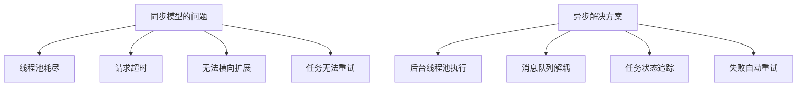
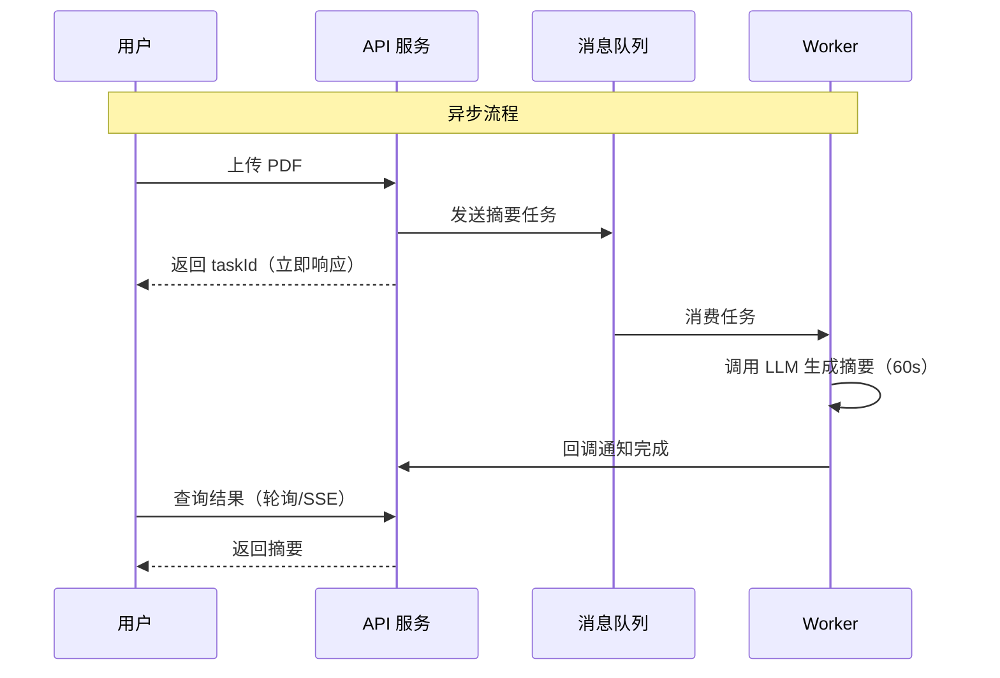
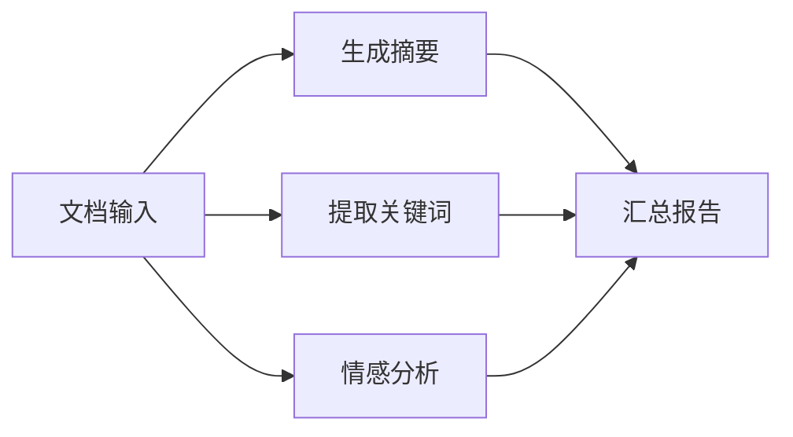
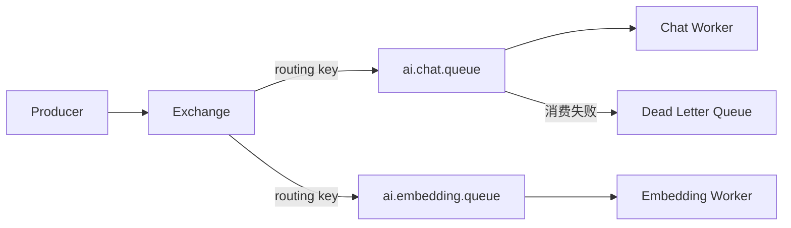
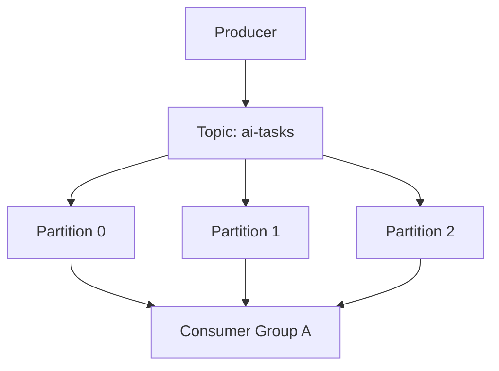
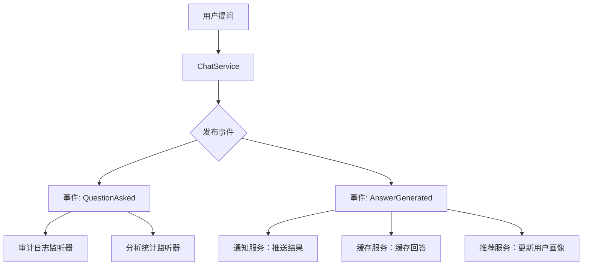
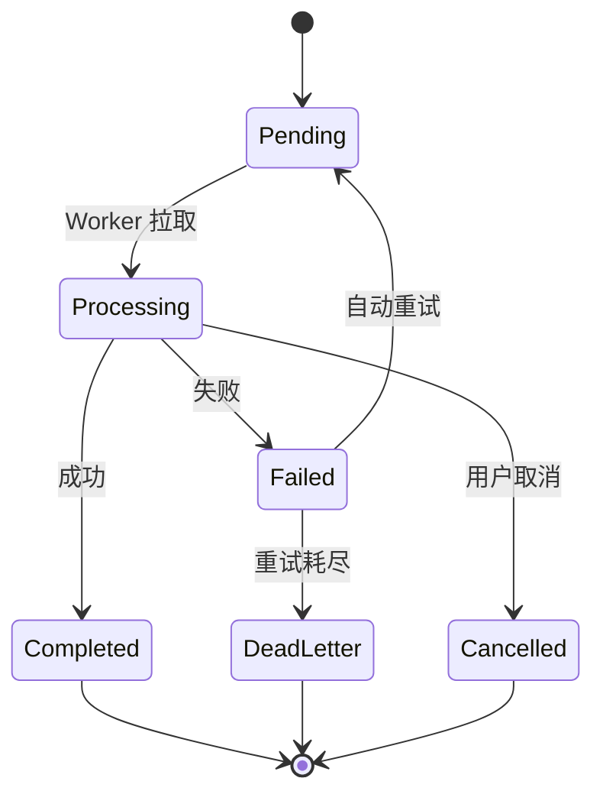
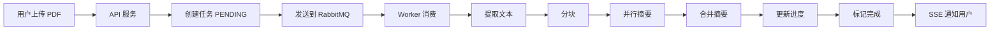
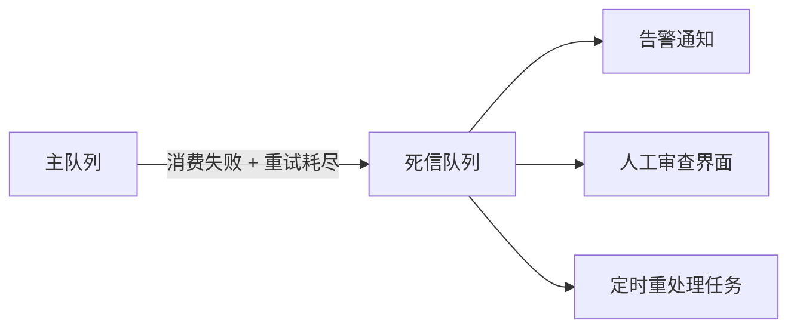

---
title: 异步处理与消息队列
description: 事件驱动架构、消息队列集成、异步任务编排——AI 应用的异步处理实践
date: 2026-06-10T10:00:00+08:00
lastmod: 2026-06-10T10:00:00+08:00
weight: 18
tags:
  - 大模型
  - 异步处理
  - 消息队列
  - 事件驱动
  - 后端工程
categories:
  - 后端与AI工程
  - 技术分享
math: true
mermaid: true
photos:
  - https://d-sketon.top/img/backwebp/bg3.webp
---

## 引言

大模型应用中，"慢"是常态。一次文本生成可能耗时 5-30 秒，一次文档摘要可能需要 1 分钟，一次批量向量化可能持续数分钟。如果所有这些操作都在 HTTP 请求线程中同步执行，服务器线程池将在几秒内被耗尽，系统陷入瘫痪。

这就是 AI 应用必须引入异步处理的根本原因：**将耗时的 AI 操作从请求线程中剥离，放到后台异步执行，通过消息队列或事件机制协调结果**。



本文将从 Spring 的基础异步机制出发，逐步深入消息队列集成、事件驱动架构和长任务处理，构建完整的 AI 应用异步处理方案。

## 为什么 AI 应用需要异步处理

### 同步 vs 异步：场景对比

考虑一个典型场景：用户上传一份 50 页的 PDF，要求生成摘要。

| 方案 | 流程 | 问题 |
|------|------|------|
| **同步** | 用户等待 → 服务器处理 60s → 返回 | 连接超时、用户体验差、线程占用 |
| **异步** | 立即返回任务 ID → 后台处理 → 用户轮询/SSE 通知 | 体验好、可扩展、可重试 |



### 异步处理的核心价值

1. **快速响应**：用户无需等待，立即获得任务追踪句柄
2. **资源隔离**：AI 计算与 Web 请求使用不同线程池，互不影响
3. **削峰填谷**：消息队列缓存突发任务，Worker 按固定速率消费
4. **可靠重试**：任务持久化在队列中，失败可自动重试
5. **可扩展**：Worker 可独立扩缩容，按需增加处理节点

## Spring 异步基础

### @Async 注解

Spring 提供的最简单的异步机制是 `@Async` 注解。被注解的方法将在独立线程中执行：

```java
import org.springframework.scheduling.annotation.Async;
import org.springframework.scheduling.annotation.EnableAsync;
import org.springframework.stereotype.Service;

@Service
@EnableAsync
public class AsyncSummaryService {

    private final ChatClient chatClient;

    public AsyncSummaryService(ChatClient.Builder builder) {
        this.chatClient = builder.build();
    }

    /**
     * 异步生成摘要：立即返回，后台执行
     */
    @Async
    public CompletableFuture<String> generateSummary(String documentId, String content) {
        String summary = chatClient.prompt()
                .system("请将以下文档内容总结为 300 字以内的摘要。")
                .user(content)
                .call()
                .content();

        // 保存结果到数据库
        saveSummary(documentId, summary);
        return CompletableFuture.completedFuture(summary);
    }
}
```

### 自定义线程池

默认情况下 `@Async` 使用 `SimpleAsyncTaskExecutor`，它每次都创建新线程，不适合生产环境。必须配置专用线程池：

```java
import org.springframework.context.annotation.Bean;
import org.springframework.context.annotation.Configuration;
import org.springframework.scheduling.concurrent.ThreadPoolTaskExecutor;

import java.util.concurrent.Executor;
import java.util.concurrent.ThreadPoolExecutor;

@Configuration
@EnableAsync
public class AsyncConfig {

    /**
     * AI 任务专用线程池
     */
    @Bean("aiTaskExecutor")
    public Executor aiTaskExecutor() {
        ThreadPoolTaskExecutor executor = new ThreadPoolTaskExecutor();
        executor.setCorePoolSize(10);          // 核心线程数
        executor.setMaxPoolSize(50);           // 最大线程数
        executor.setQueueCapacity(200);        // 队列容量
        executor.setKeepAliveSeconds(60);      // 空闲线程存活时间
        executor.setThreadNamePrefix("ai-task-");
        // 拒绝策略：由调用线程执行（背压）
        executor.setRejectedExecutionHandler(new ThreadPoolExecutor.CallerRunsPolicy());
        // 优雅关闭：等待任务完成
        executor.setWaitForTasksToCompleteOnShutdown(true);
        executor.setAwaitTerminationSeconds(120);
        executor.initialize();
        return executor;
    }

    /**
     * 向量化任务专用线程池（IO 密集型，可更多线程）
     */
    @Bean("embeddingExecutor")
    public Executor embeddingExecutor() {
        ThreadPoolTaskExecutor executor = new ThreadPoolTaskExecutor();
        executor.setCorePoolSize(20);
        executor.setMaxPoolSize(100);
        executor.setQueueCapacity(500);
        executor.setThreadNamePrefix("embedding-");
        executor.setRejectedExecutionHandler(new ThreadPoolExecutor.CallerRunsPolicy());
        executor.initialize();
        return executor;
    }
}
```

使用指定线程池：

```java
@Async("aiTaskExecutor")
public CompletableFuture<String> generateSummary(String docId, String content) {
    // 在 ai-task- 线程池中执行
}

@Async("embeddingExecutor")
public CompletableFuture<float[]> embed(String text) {
    // 在 embedding- 线程池中执行
}
```

### CompletableFuture 编排

`CompletableFuture` 是 Java 异步编程的核心工具，支持任务串联、组合和异常处理：

```java
import java.util.concurrent.CompletableFuture;
import java.util.List;
import java.util.stream.Collectors;

@Service
public class DocumentAnalysisService {

    private final ChatClient chatClient;
    private final EmbeddingModel embeddingModel;
    private final Executor aiTaskExecutor;

    /**
     * 并行执行多个 AI 分析任务，最后汇总
     */
    public CompletableFuture<AnalysisReport> analyze(String document) {
        // 三个任务并行执行
        CompletableFuture<String> summaryFuture = CompletableFuture.supplyAsync(
                () -> generateSummary(document), aiTaskExecutor);

        CompletableFuture<List<String>> keywordsFuture = CompletableFuture.supplyAsync(
                () -> extractKeywords(document), aiTaskExecutor);

        CompletableFuture<Sentiment> sentimentFuture = CompletableFuture.supplyAsync(
                () -> analyzeSentiment(document), aiTaskExecutor);

        // 等待全部完成，汇总结果
        return CompletableFuture.allOf(summaryFuture, keywordsFuture, sentimentFuture)
                .thenApply(v -> new AnalysisReport(
                        summaryFuture.join(),
                        keywordsFuture.join(),
                        sentimentFuture.join()
                ));
    }

    /**
     * 链式编排：摘要 → 翻译 → 保存
     */
    public CompletableFuture<String> summarizeTranslateAndSave(
            String document, String targetLang
    ) {
        return CompletableFuture
                .supplyAsync(() -> generateSummary(document), aiTaskExecutor)
                .thenApplyAsync(summary -> translate(summary, targetLang), aiTaskExecutor)
                .thenApplyAsync(translated -> {
                    saveResult(translated);
                    return translated;
                }, aiTaskExecutor)
                .exceptionally(ex -> {
                    log.error("分析链路失败", ex);
                    return "处理失败: " + ex.getMessage();
                });
    }

    private record AnalysisReport(
            String summary,
            List<String> keywords,
            Sentiment sentiment
    ) {}

    public enum Sentiment { POSITIVE, NEGATIVE, NEUTRAL }

    // ... 省略具体实现
}
```



## 消息队列集成

### 为什么需要消息队列

`@Async` + `CompletableFuture` 解决了单机异步问题，但在以下场景下力不从心：

| 场景 | @Async 的局限 | 消息队列的优势 |
|------|-------------|--------------|
| **服务重启** | 内存中的任务丢失 | 任务持久化在磁盘 |
| **横向扩展** | 只能单机执行 | 多节点消费同一队列 |
| **流量削峰** | 队列满则拒绝 | 消息可堆积等待 |
| **任务重试** | 需手动实现 | DLQ + 自动重试 |
| **跨服务调用** | 无法跨进程 | 天然跨服务解耦 |

### RabbitMQ 集成

RabbitMQ 是 AI 应用中最常用的消息队列之一，支持灵活的路由和可靠投递。



#### 配置

```java
import org.springframework.amqp.core.*;
import org.springframework.amqp.rabbit.connection.ConnectionFactory;
import org.springframework.amqp.rabbit.core.RabbitTemplate;
import org.springframework.amqp.support.converter.Jackson2JsonMessageConverter;
import org.springframework.context.annotation.Bean;
import org.springframework.context.annotation.Configuration;

@Configuration
public class RabbitMqConfig {

    public static final String AI_EXCHANGE = "ai.exchange";
    public static final String CHAT_QUEUE = "ai.chat.queue";
    public static final String CHAT_ROUTING_KEY = "ai.chat";
    public static final String CHAT_DLQ = "ai.chat.dlq";

    /**
     * 主交换机
     */
    @Bean
    public TopicExchange aiExchange() {
        return ExchangeBuilder.topicExchange(AI_EXCHANGE)
                .durable(true)
                .build();
    }

    /**
     * 聊天任务队列（带死信路由）
     */
    @Bean
    public Queue chatQueue() {
        return QueueBuilder.durable(CHAT_QUEUE)
                .withArgument("x-dead-letter-exchange", AI_EXCHANGE)
                .withArgument("x-dead-letter-routing-key", "ai.chat.dlq")
                .withArgument("x-message-ttl", 300000) // 消息 5 分钟过期
                .build();
    }

    /**
     * 死信队列：处理失败的任务
     */
    @Bean
    public Queue chatDeadLetterQueue() {
        return QueueBuilder.durable(CHAT_DLQ).build();
    }

    @Bean
    public Binding chatBinding() {
        return BindingBuilder.bind(chatQueue())
                .to(aiExchange())
                .with(CHAT_ROUTING_KEY);
    }

    @Bean
    public Binding dlqBinding() {
        return BindingBuilder.bind(chatDeadLetterQueue())
                .to(aiExchange())
                .with("ai.chat.dlq");
    }

    /**
     * JSON 序列化的 RabbitTemplate
     */
    @Bean
    public RabbitTemplate rabbitTemplate(ConnectionFactory factory) {
        RabbitTemplate template = new RabbitTemplate(factory);
        template.setMessageConverter(new Jackson2JsonMessageConverter());
        // 发布确认
        template.setConfirmCallback((correlation, ack, cause) -> {
            if (!ack) {
                log.error("消息发送失败: {}", cause);
            }
        });
        return template;
    }
}
```

#### 生产者

```java
import org.springframework.amqp.rabbit.core.RabbitTemplate;
import org.springframework.stereotype.Service;

import java.util.UUID;

@Service
public class AiTaskProducer {

    private final RabbitTemplate rabbitTemplate;

    public AiTaskProducer(RabbitTemplate rabbitTemplate) {
        this.rabbitTemplate = rabbitTemplate;
    }

    /**
     * 发送聊天任务到队列
     */
    public String submitChatTask(ChatTask task) {
        String taskId = UUID.randomUUID().toString();
        task.setTaskId(taskId);
        task.setCreatedAt(java.time.Instant.now());

        rabbitTemplate.convertAndSend(
                RabbitMqConfig.AI_EXCHANGE,
                RabbitMqConfig.CHAT_ROUTING_KEY,
                task
        );

        log.info("已提交聊天任务: {}", taskId);
        return taskId;
    }

    public record ChatTask(
            String taskId,
            String userId,
            String question,
            String model,
            java.time.Instant createdAt
    ) {
        public void setTaskId(String id) {}
        public void setCreatedAt(java.time.Instant t) {}
    }
}
```

#### 消费者

```java
import org.springframework.amqp.rabbit.annotation.RabbitListener;
import org.springframework.amqp.support.AmqpHeaders;
import org.springframework.messaging.handler.annotation.Header;
import org.springframework.stereotype.Component;

@Component
public class AiTaskConsumer {

    private final ChatClient chatClient;
    private final TaskResultService resultService;

    @RabbitListener(
        queues = RabbitMqConfig.CHAT_QUEUE,
        concurrency = "3-10",            // 动态并发消费者数
        retryTemplate = "aiRetryTemplate"
    )
    public void handleChatTask(
            AiTaskProducer.ChatTask task,
            @Header(AmqpHeaders.DELIVERY_TAG) long deliveryTag,
            org.springframework.amqp.core.Channel channel
    ) throws java.io.IOException {
        try {
            log.info("处理任务: {}", task.taskId());

            // 调用模型
            String answer = chatClient.prompt()
                    .user(task.question())
                    .call()
                    .content();

            // 保存结果
            resultService.saveResult(task.taskId(), answer);

            // 手动 ACK
            channel.basicAck(deliveryTag, false);

        } catch (Exception e) {
            log.error("任务处理失败: {}", task.taskId(), e);
            // NACK + requeue=false → 进入死信队列
            channel.basicNack(deliveryTag, false, false);
        }
    }
}
```

### Kafka 集成

对于高吞吐场景（如日志分析、批量向量化），Kafka 是更合适的选择：



```java
import org.springframework.kafka.annotation.KafkaListener;
import org.springframework.kafka.core.KafkaTemplate;
import org.springframework.stereotype.Service;

@Service
public class KafkaAiService {

    private final KafkaTemplate<String, Object> kafkaTemplate;

    /**
     * 发送批量向量化任务
     */
    public void submitBatchEmbedding(String batchId, List<String> documents) {
        for (int i = 0; i < documents.size(); i++) {
            EmbeddingTask task = new EmbeddingTask(
                    batchId, i, documents.size(), documents.get(i)
            );
            // 按 batchId 分区，保证同一批次顺序处理
            kafkaTemplate.send("ai-embedding-tasks", batchId, task);
        }
    }

    /**
     * 消费向量化任务
     */
    @KafkaListener(
        topics = "ai-embedding-tasks",
        groupId = "embedding-workers",
        concurrency = "6"
    )
    public void handleEmbeddingTask(
            EmbeddingTask task,
            org.apache.kafka.clients.consumer.ConsumerRecord<String, EmbeddingTask> record
    ) {
        float[] vector = embeddingModel.embed(task.content());
        vectorStore.add(List.of(new Document(task.content(),
                Map.of("batchId", task.batchId(),
                       "index", task.index()))));

        // 批次最后一条 → 发送完成事件
        if (task.index() == task.total() - 1) {
            eventPublisher.publish(new BatchCompleted(task.batchId()));
        }
    }

    public record EmbeddingTask(
            String batchId,
            int index,
            int total,
            String content
    ) {}
}
```

### RabbitMQ vs Kafka 选型

| 维度 | RabbitMQ | Kafka |
|------|----------|-------|
| **吞吐量** | 万级 TPS | 百万级 TPS |
| **延迟** | 微秒级 | 毫秒级 |
| **消息模型** | 队列（点对点） | 日志（发布订阅） |
| **消息顺序** | 单队列有序 | 分区内有序 |
| **消息堆积** | 内存/磁盘有限 | 磁盘可海量堆积 |
| **适用场景** | 任务分发、RPC | 日志流、事件溯源 |
| **AI 场景** | 单文档处理、Agent 任务 | 批量向量化、日志分析 |

**选型建议**：大多数 AI 应用的任务分发场景（文档处理、对话生成）用 RabbitMQ 足够；如果涉及海量数据流式处理（如全网新闻向量化），选 Kafka。

## 事件驱动架构

### 领域事件

事件驱动架构（EDA）通过"事件"来解耦系统的各个组件。每个组件只负责发布事件或监听事件，不直接调用其他组件：



### Spring Events 实现

```java
import org.springframework.context.ApplicationEvent;
import org.springframework.context.event.EventListener;
import org.springframework.stereotype.Component;

/**
 * 领域事件定义
 */
public class AiEvents {

    /** 用户提问事件 */
    public record QuestionAskedEvent(
            String userId,
            String question,
            java.time.Instant timestamp
    ) {}

    /** 回答生成事件 */
    public record AnswerGeneratedEvent(
            String userId,
            String question,
            String answer,
            int tokensUsed,
            java.time.Instant timestamp
    ) {}

    /** 处理失败事件 */
    public record ProcessingFailedEvent(
            String taskId,
            String reason,
            java.time.Instant timestamp
    ) {}
}

/**
 * 事件发布者
 */
@Service
public class ChatService {

    private final ApplicationEventPublisher eventPublisher;
    private final ChatClient chatClient;

    public ChatResult chat(String userId, String question) {
        // 1. 发布提问事件
        eventPublisher.publishEvent(new AiEvents.QuestionAskedEvent(
                userId, question, java.time.Instant.now()
        ));

        // 2. 调用模型
        String answer = chatClient.prompt()
                .user(question)
                .call()
                .content();
        int tokens = 100; // 实际从响应中提取

        // 3. 发布回答事件
        eventPublisher.publishEvent(new AiEvents.AnswerGeneratedEvent(
                userId, question, answer, tokens, java.time.Instant.now()
        ));

        return new ChatResult(answer, tokens);
    }
}

/**
 * 事件监听者：各组件独立处理
 */
@Component
public class AiEventListeners {

    @EventListener
    @Async("aiTaskExecutor")
    public void onQuestionAsked(AiEvents.QuestionAskedEvent event) {
        // 审计日志
        auditLog.record(event.userId(), event.question());
    }

    @EventListener
    @Async("aiTaskExecutor")
    public void onAnswerGenerated(AiEvents.AnswerGeneratedEvent event) {
        // 更新用户 Token 使用统计
        usageService.recordUsage(event.userId(), event.tokensUsed());

        // 推送通知（如果是异步任务）
        notificationService.notify(event.userId(), event.answer());
    }

    @EventListener
    @Async("aiTaskExecutor")
    public void onProcessingFailed(AiEvents.ProcessingFailedEvent event) {
        // 告警
        alertService.sendAlert("AI 任务失败: " + event.taskId());
    }
}
```

### 事务事件

当业务操作和事件发布需要在同一事务中时，使用 `@TransactionalEventListener`：

```java
import org.springframework.transaction.event.TransactionPhase;
import org.springframework.transaction.event.TransactionalEventListener;

@Component
public class TransactionalAiListener {

    /**
     * 只在事务提交后才处理事件
     * 避免事务回滚后仍然发送通知的问题
     */
    @TransactionalEventListener(phase = TransactionPhase.AFTER_COMMIT)
    @Async("aiTaskExecutor")
    public void onAnswerGenerated(AiEvents.AnswerGeneratedEvent event) {
        // 事务已提交，安全地发送通知
        notificationService.send(event.userId(), event.answer());
    }
}
```

## 长任务处理

### 任务状态管理

AI 任务通常耗时长，需要完整的任务生命周期管理：



```java
import org.springframework.data.jpa.repository.JpaRepository;
import org.springframework.stereotype.Service;

/**
 * 任务实体
 */
@Entity
@Table(name = "ai_tasks")
public class AiTask {

    @Id
    private String taskId;

    @Enumerated(EnumType.STRING)
    private TaskStatus status;

    private String userId;
    private String type;           // chat / embedding / summary
    private String input;          // 输入内容（JSON）

    @Lob
    private String output;         // 输出结果

    private int retryCount;
    private int maxRetries = 3;

    private java.time.Instant createdAt;
    private java.time.Instant startedAt;
    private java.time.Instant completedAt;

    private String errorMessage;

    public enum TaskStatus {
        PENDING, PROCESSING, COMPLETED, FAILED, DEAD_LETTER, CANCELLED
    }

    // getter/setter 省略
}

/**
 * 任务服务
 */
@Service
public class TaskManagementService {

    private final AiTaskRepository taskRepository;

    /**
     * 创建任务
     */
    public String createTask(String userId, String type, String input) {
        AiTask task = new AiTask();
        task.setTaskId(UUID.randomUUID().toString());
        task.setUserId(userId);
        task.setType(type);
        task.setInput(input);
        task.setStatus(AiTask.TaskStatus.PENDING);
        task.setCreatedAt(java.time.Instant.now());
        taskRepository.save(task);
        return task.getTaskId();
    }

    /**
     * 更新任务状态
     */
    @Transactional
    public void markProcessing(String taskId) {
        AiTask task = taskRepository.findById(taskId).orElseThrow();
        task.setStatus(AiTask.TaskStatus.PROCESSING);
        task.setStartedAt(java.time.Instant.now());
        taskRepository.save(task);
    }

    @Transactional
    public void markCompleted(String taskId, String output) {
        AiTask task = taskRepository.findById(taskId).orElseThrow();
        task.setStatus(AiTask.TaskStatus.COMPLETED);
        task.setOutput(output);
        task.setCompletedAt(java.time.Instant.now());
        taskRepository.save(task);
    }

    @Transactional
    public void markFailed(String taskId, String error) {
        AiTask task = taskRepository.findById(taskId).orElseThrow();
        task.setRetryCount(task.getRetryCount() + 1);

        if (task.getRetryCount() >= task.getMaxRetries()) {
            task.setStatus(AiTask.TaskStatus.DEAD_LETTER);
        } else {
            task.setStatus(AiTask.TaskStatus.FAILED);
        }
        task.setErrorMessage(error);
        taskRepository.save(task);
    }

    /**
     * 查询任务状态
     */
    public AiTask getTask(String taskId) {
        return taskRepository.findById(taskId).orElseThrow();
    }
}
```

### 进度追踪

对于可拆分的长任务（如批量处理 100 篇文档），需要实时进度追踪：

```java
import org.springframework.data.redis.core.StringRedisTemplate;

@Service
public class ProgressTracker {

    private final StringRedisTemplate redis;

    /**
     * 更新任务进度
     */
    public void updateProgress(String taskId, int current, int total) {
        double percent = (double) current / total * 100;
        redis.opsForHash().put("task:progress:" + taskId, "current",
                String.valueOf(current));
        redis.opsForHash().put("task:progress:" + taskId, "total",
                String.valueOf(total));
        redis.opsForHash().put("task:progress:" + taskId, "percent",
                String.format("%.1f", percent));
        redis.opsForHash().put("task:progress:" + taskId, "updatedAt",
                java.time.Instant.now().toString());
    }

    /**
     * 获取进度
     */
    public TaskProgress getProgress(String taskId) {
        Map<Object, Object> raw = redis.opsForHash()
                .entries("task:progress:" + taskId);
        if (raw.isEmpty()) {
            return null;
        }
        return new TaskProgress(
                Integer.parseInt((String) raw.get("current")),
                Integer.parseInt((String) raw.get("total")),
                Double.parseDouble((String) raw.get("percent"))
        );
    }

    public record TaskProgress(int current, int total, double percent) {}
}
```

### SSE 进度推送

结合 SSE，实现实时进度推送：

```java
import org.springframework.web.servlet.mvc.method.annotation.SseEmitter;

@RestController
@RequestMapping("/api/v1/tasks")
public class TaskController {

    private final TaskManagementService taskService;
    private final ProgressTracker progressTracker;

    /**
     * 提交异步任务
     */
    @PostMapping
    public Map<String, String> submitTask(@RequestBody TaskRequest request) {
        String taskId = taskService.createTask(
                request.userId(), request.type(), request.input()
        );
        // 发送到消息队列
        taskProducer.submitChatTask(taskId, request);
        return Map.of("taskId", taskId);
    }

    /**
     * 查询任务状态
     */
    @GetMapping("/{taskId}")
    public AiTask getTask(@PathVariable String taskId) {
        return taskService.getTask(taskId);
    }

    /**
     * SSE 实时进度推送
     */
    @GetMapping(value = "/{taskId}/progress", produces = MediaType.TEXT_EVENT_STREAM_VALUE)
    public SseEmitter trackProgress(@PathVariable String taskId) {
        SseEmitter emitter = new SseEmitter(300_000L); // 5 分钟超时

        // 定时推送进度
        java.util.concurrent.ScheduledExecutorService scheduler =
                java.util.concurrent.Executors.newSingleThreadScheduledExecutor();

        java.util.concurrent.ScheduledFuture<?> future = scheduler.scheduleAtFixedRate(() -> {
            try {
                ProgressTracker.TaskProgress progress = progressTracker.getProgress(taskId);
                AiTask task = taskService.getTask(taskId);

                if (task.getStatus() == AiTask.TaskStatus.COMPLETED) {
                    emitter.send(SseEmitter.event()
                            .name("completed")
                            .data(Map.of("result", task.getOutput())));
                    emitter.complete();
                } else if (progress != null) {
                    emitter.send(SseEmitter.event()
                            .name("progress")
                            .data(progress));
                }
            } catch (Exception e) {
                emitter.completeWithError(e);
            }
        }, 0, 2, java.util.concurrent.TimeUnit.SECONDS);

        emitter.onCompletion(() -> {
            future.cancel(true);
            scheduler.shutdown();
        });
        emitter.onTimeout(() -> {
            future.cancel(true);
            scheduler.shutdown();
        });

        return emitter;
    }

    public record TaskRequest(String userId, String type, String input) {}
}
```

## 完整示例：文档摘要流水线

整合异步处理、消息队列、事件驱动和进度追踪，构建一个完整的文档摘要流水线：



```java
package com.example.aiapp.pipeline;

import org.springframework.amqp.rabbit.annotation.RabbitListener;
import org.springframework.stereotype.Component;

import java.util.List;
import java.util.concurrent.CompletableFuture;
import java.util.stream.Collectors;

@Component
public class SummaryPipeline {

    private final TaskManagementService taskService;
    private final ProgressTracker progressTracker;
    private final ChatClient chatClient;
    private final DocumentExtractor extractor;
    private final Executor aiTaskExecutor;

    /**
     * 消费摘要任务
     */
    @RabbitListener(queues = RabbitMqConfig.CHAT_QUEUE, concurrency = "3-5")
    public void processSummaryTask(SummaryMessage message) {
        String taskId = message.taskId();
        taskService.markProcessing(taskId);
        progressTracker.updateProgress(taskId, 0, 4);

        try {
            // Step 1: 提取文本
            String fullText = extractor.extract(message.fileUrl());
            progressTracker.updateProgress(taskId, 1, 4);

            // Step 2: 分块
            List<String> chunks = splitText(fullText, 3000);
            progressTracker.updateProgress(taskId, 2, 4);

            // Step 3: 并行摘要各块
            List<CompletableFuture<String>> futures = chunks.stream()
                    .map(chunk -> CompletableFuture.supplyAsync(
                            () -> summarizeChunk(chunk), aiTaskExecutor))
                    .toList();

            CompletableFuture.allOf(futures.toArray(new CompletableFuture[0])).join();
            List<String> partialSummaries = futures.stream()
                    .map(CompletableFuture::join)
                    .toList();

            progressTracker.updateProgress(taskId, 3, 4);

            // Step 4: 合并摘要
            String finalSummary = mergeSummaries(partialSummaries);

            // 完成
            taskService.markCompleted(taskId, finalSummary);
            progressTracker.updateProgress(taskId, 4, 4);

            log.info("摘要任务完成: {}", taskId);

        } catch (Exception e) {
            log.error("摘要任务失败: {}", taskId, e);
            taskService.markFailed(taskId, e.getMessage());
        }
    }

    private String summarizeChunk(String chunk) {
        return chatClient.prompt()
                .system("用 200 字总结以下内容的要点。")
                .user(chunk)
                .call()
                .content();
    }

    private String mergeSummaries(List<String> summaries) {
        String combined = String.join("\n\n", summaries);
        return chatClient.prompt()
                .system("将以下多段摘要整合为一篇连贯的综合摘要，不超过 500 字。")
                .user(combined)
                .call()
                .content();
    }

    private List<String> splitText(String text, int chunkSize) {
        List<String> chunks = new java.util.ArrayList<>();
        for (int i = 0; i < text.length(); i += chunkSize) {
            chunks.add(text.substring(i, Math.min(i + chunkSize, text.length())));
        }
        return chunks;
    }
}
```

## 死信队列与错误处理

### DLQ 设计

当任务重试次数耗尽后，消息进入死信队列（Dead Letter Queue），供人工或自动化处理：



```java
@Component
public class DeadLetterHandler {

    /**
     * 监听死信队列
     */
    @RabbitListener(queues = RabbitMqConfig.CHAT_DLQ)
    public void handleDeadLetter(
            AiTaskProducer.ChatTask task,
            org.springframework.amqp.core.Message message
    ) {
        // 获取失败次数
        Integer deathCount = (Integer) message.getMessageProperties()
                .getHeaders().get("x-death-count");

        log.error("任务进入死信队列: taskId={}, 重试次数={}",
                task.taskId(), deathCount);

        // 1. 记录到数据库供人工审查
        failedTaskRepository.save(new FailedTask(
                task.taskId(), task.question(), deathCount,
                java.time.Instant.now()
        ));

        // 2. 发送告警
        alertService.sendCriticalAlert(
                "AI 任务持续失败", "taskId=" + task.taskId()
        );

        // 3. 通知用户
        if (deathCount >= 3) {
            notificationService.notify(task.userId(),
                    "您的请求处理失败，请联系客服。");
        }
    }
}
```

## 最佳实践

| 实践 | 说明 |
|------|------|
| **线程池隔离** | AI 任务与 Web 请求使用独立线程池 |
| **队列容量有界** | 无界队列会导致 OOM，设置合理上限 |
| **幂等消费** | 消费者必须处理重复消息（可能重复投递） |
| **手动 ACK** | 处理成功后才确认，避免消息丢失 |
| **DLQ 必备** | 重试耗尽的消息进入死信队列，不能丢弃 |
| **进度可追踪** | 长任务必须有进度反馈机制 |
| **背压机制** | 消费不过来时，生产端应减速（限流/降级） |

### 幂等消费实现

```java
@RabbitListener(queues = RabbitMqConfig.CHAT_QUEUE)
public void handle(ChatTask task, Channel channel,
                   @Header(AmqpHeaders.DELIVERY_TAG) long tag) {
    // 幂等检查：是否已处理过
    if (idempotentRepository.exists(task.taskId())) {
        log.warn("重复消息，跳过: {}", task.taskId());
        channel.basicAck(tag, false);
        return;
    }

    try {
        processTask(task);
        idempotentRepository.markProcessed(task.taskId());
        channel.basicAck(tag, false);
    } catch (Exception e) {
        channel.basicNack(tag, false, false);
    }
}
```

## 结语

异步处理是 AI 应用从"能跑"到"能扛"的关键转变。

**Spring 异步**（`@Async` + `CompletableFuture`）解决了单机层面的请求阻塞问题，通过线程池隔离让 AI 计算不再拖累 Web 请求。`CompletableFuture` 的链式编排能力让多个 AI 任务可以并行执行、串联组合。

**消息队列**（RabbitMQ / Kafka）解决了分布式层面的可靠性和扩展性问题。任务持久化在队列中，即使服务重启也不丢失；Worker 可以独立扩缩容，按需增加处理能力；死信队列兜底所有无法处理的失败任务。

**事件驱动架构**通过领域事件实现了组件间的彻底解耦。提问、回答、失败等事件由各监听器独立处理，新增功能只需添加监听器，无需修改核心逻辑。

**长任务管理**通过任务状态机 + 进度追踪 + SSE 推送，让用户始终了解任务进展，将"等待"转化为"观察"。

这四层能力层层递进，共同构成了 AI 应用异步处理的完整方案。下一篇我们将聚焦配置管理与密钥安全，解决 AI 应用"最后一公里"的工程化问题。

## 参考文献

1. Spring Framework - Task Execution and Scheduling. https://docs.spring.io/spring-framework/reference/integration/scheduling.html
2. RabbitMQ Documentation. https://www.rabbitmq.com/documentation.html
3. Apache Kafka Documentation. https://kafka.apache.org/documentation/
4. Spring AMQP Reference. https://docs.spring.io/spring-amqp/docs/current/reference/html/
5. Martin Fowler - Event-Driven Architecture. https://martinfowler.com/articles/201701-event-driven.html
6. Java CompletableFuture Documentation. https://docs.oracle.com/en/java/javase/17/docs/api/java.base/java/util/concurrent/CompletableFuture.html
