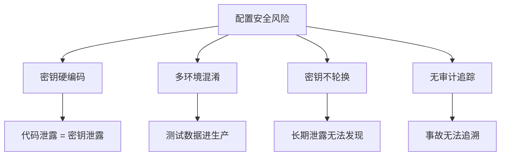
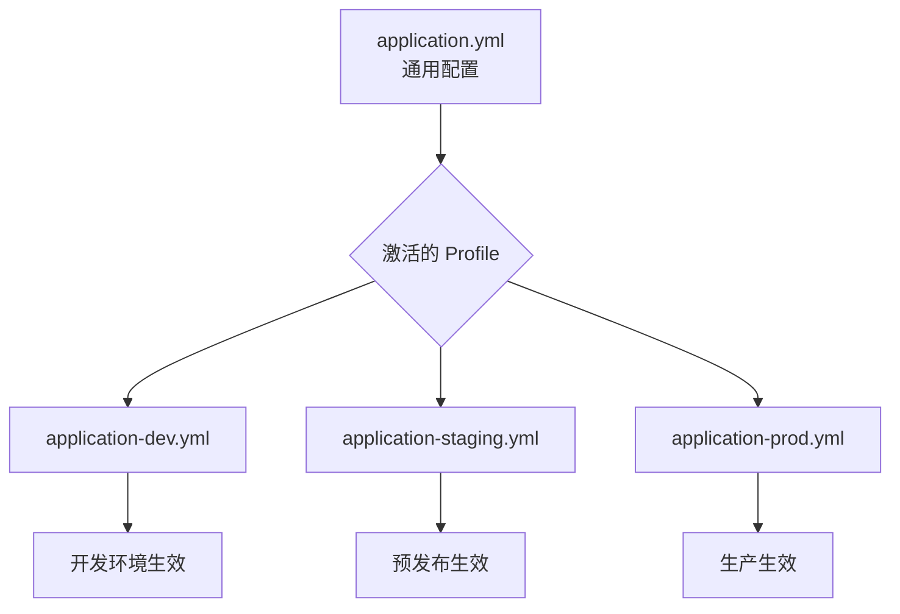
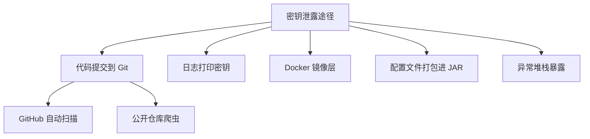
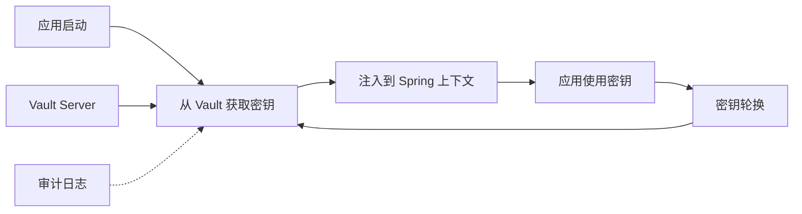
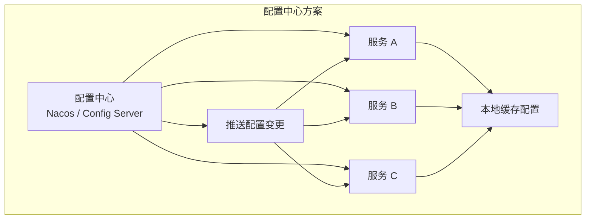
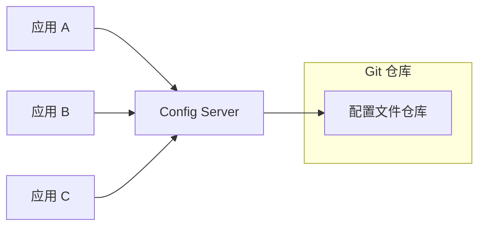
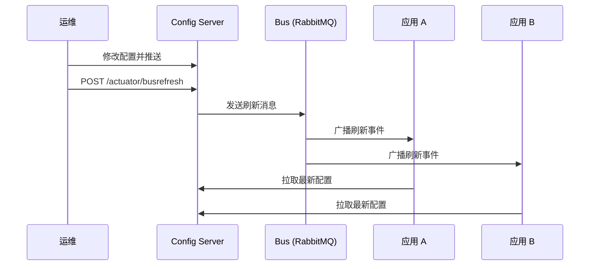
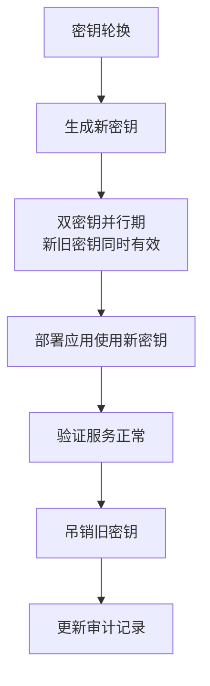

---
title: 配置管理与密钥安全
description: 多环境配置隔离、密钥安全管理、配置中心实践——AI 应用的配置工程化
date: 2026-06-15T10:00:00+08:00
lastmod: 2026-06-15T10:00:00+08:00
weight: 19
tags:
  - 大模型
  - 配置管理
  - 密钥安全
  - 后端工程
categories:
  - 后端与AI工程
  - 技术分享
math: true
mermaid: true
photos:
  - https://d-sketon.top/img/backwebp/bg4.webp
---

## 引言

在 AI 应用的所有工程实践中，配置管理与密钥安全往往是"最容易被忽视、却最容易引发灾难"的环节。一个泄露到 GitHub 的 OpenAI API Key，可能在几分钟内被脚本自动扫描到，并在数小时内消耗掉数千美元的配额。一个写死在代码里的数据库密码，会让一次代码泄露演变成全量数据泄露。



本文将系统讲解 AI 应用的配置工程化：多环境配置隔离、密钥安全管理、配置中心实践，以及密钥轮换与审计的最佳实践。

## 多环境配置

### 环境分层

AI 应用通常需要至少三套环境，每套环境的模型、数据和密钥完全隔离：

| 环境 | 用途 | 模型 | 数据 | 密钥 |
|------|------|------|------|------|
| **dev** | 本地开发 | 小模型 / Mock | 测试数据 | 开发专用 Key |
| **staging** | 预发布验证 | 真实模型（低配额） | 脱敏数据 | 预发布 Key |
| **prod** | 生产运行 | 生产模型 | 真实数据 | 生产 Key（最高权限） |

> **关键原则**：绝不共享密钥。dev 环境的 Key 不应有权访问生产数据，prod 环境的 Key 绝不出现在开发机器上。

### Spring Profiles

Spring Boot 通过 Profile 机制实现多环境配置隔离：



#### 基础配置（所有环境共享）

```yaml
# application.yml — 通用配置
spring:
  application:
    name: ai-service
  jpa:
    open-in-view: false
  jackson:
    default-property-inclusion: non_null

server:
  port: 8080

# AI 通用配置（不含密钥）
ai:
  models:
    primary: ${AI_PRIMARY_MODEL:gpt-4o}
    fallback: ${AI_FALLBACK_MODEL:gpt-4o-mini}
  retry:
    max-attempts: 3
    backoff-initial: 1000
    backoff-max: 30000
  rate-limit:
    enabled: true
```

#### 环境特定配置

```yaml
# application-dev.yml — 开发环境
spring:
  ai:
    openai:
      api-key: ${OPENAI_DEV_KEY}
      base-url: https://api.openai.com
      chat:
        options:
          model: gpt-4o-mini    # 开发用小模型省钱
          temperature: 0.9      # 开发环境可以更随机
  datasource:
    url: jdbc:postgresql://localhost:5432/ai_dev
    username: dev_user
    password: ${DB_DEV_PASSWORD}

logging:
  level:
    org.springframework.ai: DEBUG
    com.example.aiapp: DEBUG

# 开发环境关闭限流，方便调试
ai:
  rate-limit:
    enabled: false
```

```yaml
# application-staging.yml — 预发布环境
spring:
  ai:
    openai:
      api-key: ${OPENAI_STAGING_KEY}
      chat:
        options:
          model: gpt-4o
          temperature: 0.7
  datasource:
    url: jdbc:postgresql://staging-db:5432/ai_staging
    username: ${DB_STAGING_USER}
    password: ${DB_STAGING_PASSWORD}

logging:
  level:
    org.springframework.ai: INFO

ai:
  rate-limit:
    enabled: true
    rpm: 50    # 预发布限流较宽松
```

```yaml
# application-prod.yml — 生产环境
spring:
  ai:
    openai:
      api-key: ${OPENAI_PROD_KEY}
      chat:
        options:
          model: gpt-4o
          temperature: 0.3    # 生产环境偏确定性
          max-tokens: 2048
  datasource:
    url: jdbc:postgresql://prod-db-cluster:5432/ai_prod
    username: ${DB_PROD_USER}
    password: ${DB_PROD_PASSWORD}

logging:
  level:
    root: WARN
    com.example.aiapp: INFO
  # 生产环境不记录敏感信息

ai:
  rate-limit:
    enabled: true
    rpm: 500
```

#### 激活 Profile

```bash
# 方式 1: 命令行参数
java -jar ai-service.jar --spring.profiles.active=prod

# 方式 2: 环境变量（推荐）
export SPRING_PROFILES_ACTIVE=prod
java -jar ai-service.jar

# 方式 3: Docker
docker run -e SPRING_PROFILES_ACTIVE=prod ai-service:latest
```

```yaml
# docker-compose.yml
services:
  ai-service:
    image: ai-service:latest
    environment:
      - SPRING_PROFILES_ACTIVE=prod
      - OPENAI_PROD_KEY=${OPENAI_PROD_KEY}  # 从 .env 读取
      - DB_PROD_PASSWORD=${DB_PROD_PASSWORD}
    ports:
      - "8080:8080"
```

### 配置优先级

Spring Boot 的配置按以下优先级从高到低覆盖（高优先级覆盖低优先级）：

```mermaid
graph TD
    A[命令行参数<br/>--key=value] --> |最高| B[环境变量<br/>SPRING_*
    B --> C[application-{profile}.yml]
    C --> D[application.yml]
    D --> |最低| E[代码默认值]
```

> **实践建议**：密钥永远通过环境变量注入（最高优先级），永远不写进 yml 文件。

## 密钥安全管理

### 密钥泄露的常见途径



### 第一道防线：.gitignore

```gitignore
# .gitignore

# === 密钥与证书 ===
*.pem
*.key
*.p12
*.jks
.env
.env.*
!.env.example        # 允许提交模板，但不提交真实值

# === IDE 配置 ===
.idea/
*.iml
.vscode/
settings.xml         # Maven settings 可能含密码

# === 日志 ===
*.log
logs/

# === 构建产物 ===
target/
build/
*.jar
!gradle-wrapper.jar
```

### 第二道防线：环境变量注入

密钥通过环境变量注入，代码中用 `${}` 占位符引用：

```yaml
# application.yml
spring:
  ai:
    openai:
      api-key: ${OPENAI_API_KEY}    # 从环境变量读取

  datasource:
    password: ${DB_PASSWORD}        # 从环境变量读取
```

```java
// 或者通过 @Value 注解
@Value("${spring.ai.openai.api-key}")
private String apiKey;

// 通过 @ConfigurationProperties 批量绑定（推荐）
@ConfigurationProperties(prefix = "ai.providers")
public record AiProviderConfig(
    String openaiKey,
    String anthropicKey,
    String dashscopeKey
) {}
```

### 第三道防线：密钥管理服务

对于企业级应用，环境变量仍然不够安全（进程环境变量可被 `/proc/PID/environ` 读取）。生产环境应使用专业的密钥管理服务：



#### HashiCorp Vault 集成

```java
import org.springframework.vault.authentication.TokenAuthentication;
import org.springframework.vault.client.VaultEndpoint;
import org.springframework.vault.core.VaultTemplate;
import org.springframework.context.annotation.Bean;
import org.springframework.context.annotation.Configuration;

@Configuration
public class VaultConfig {

    @Bean
    public VaultTemplate vaultTemplate() {
        VaultEndpoint endpoint = VaultEndpoint.create();
        endpoint.setHost("vault.internal.company.com");
        endpoint.setPort(8200);
        endpoint.setScheme("https");

        // 使用 Kubernetes Service Account Token 认证
        String vaultToken = System.getenv("VAULT_TOKEN");

        return new VaultTemplate(endpoint, new TokenAuthentication(vaultToken));
    }
}
```

```java
@Service
public class VaultSecretService {

    private final VaultTemplate vaultTemplate;

    /**
     * 从 Vault 读取密钥
     */
    public String getSecret(String path) {
        return vaultTemplate.opsForVersionedKeyValue("secret")
                .get(path)
                .getData()
                .get("value")
                .toString();
    }

    /**
     * 安全地获取 OpenAI API Key
     */
    public String getOpenAiKey() {
        // 从 Vault 的 ai/openai 路径读取
        Map<String, Object> response = vaultTemplate.opsForVersionedKeyValue("secret")
                .get("ai/openai")
                .getData();
        return response.get("api-key").toString();
    }

    /**
     * 写入新密钥（用于密钥轮换）
     */
    public void rotateKey(String path, String newKey) {
        Map<String, String> data = Map.of("value", newKey);
        vaultTemplate.opsForVersionedKeyValue("secret")
                .put(path, data);
        log.info("密钥已轮换: {}", path);
    }
}
```

#### 动态密钥

Vault 支持**动态密钥**（Dynamic Secrets），每次申请生成临时凭据，用完即弃：

```java
/**
 * 获取临时数据库凭据（动态生成，有效期 1 小时）
 */
public DatabaseCredentials getTempDbCredentials() {
    Map<String, Object> response = vaultTemplate.opsForVersionedKeyValue("database")
            .read("creds/ai-app-role")
            .getData();

    return new DatabaseCredentials(
            response.get("username").toString(),
            response.get("password").toString()
    );
}
```

### 密钥管理方案对比

| 方案 | 安全等级 | 复杂度 | 适用场景 |
|------|---------|--------|---------|
| **硬编码** | ❌ 极低 | 最低 | 绝对禁止 |
| **环境变量** | ⭐⭐ 中 | 低 | 开发、小项目 |
| **.env 文件 + gitignore** | ⭐⭐ 中 | 低 | 本地开发 |
| **Spring Cloud Config 加密** | ⭐⭐⭐ 较高 | 中 | 中型项目 |
| **HashiCorp Vault** | ⭐⭐⭐⭐ 高 | 高 | 企业级生产 |
| **AWS Secrets Manager** | ⭐⭐⭐⭐ 高 | 中 | AWS 生态 |
| **Kubernetes Secrets** | ⭐⭐⭐ 较高 | 中 | K8s 环境 |

## 配置中心

### 为什么需要配置中心

当微服务数量增多时，本地配置文件的管理变得困难：

| 痛点 | 本地配置的问题 | 配置中心的解决 |
|------|-------------|--------------|
| **修改需重启** | 改配置要重新打包部署 | 热更新，无需重启 |
| **多节点同步** | N 个节点要逐一修改 | 中心化，一处修改处处生效 |
| **版本回滚** | 靠 Git 回滚 + 重新部署 | 配置中心自带版本历史 |
| **灰度发布** | 难以按节点区分配置 | 按环境/集群/标签推送 |



### Spring Cloud Config

Spring Cloud Config 是 Spring 官方的配置中心方案：



#### Config Server

```java
import org.springframework.boot.SpringApplication;
import org.springframework.boot.autoconfigure.SpringBootApplication;
import org.springframework.cloud.config.server.EnableConfigServer;

@SpringBootApplication
@EnableConfigServer
public class ConfigServerApplication {
    public static void main(String[] args) {
        SpringApplication.run(ConfigServerApplication.class, args);
    }
}
```

```yaml
# Config Server 的 application.yml
server:
  port: 8888

spring:
  cloud:
    config:
      server:
        git:
          uri: https://github.com/company/ai-config-repo
          username: ${GIT_USER}
          password: ${GIT_TOKEN}
          # 加密配置
          encrypt:
            enabled: true
```

#### Config Client

```yaml
# 应用端 bootstrap.yml
spring:
  cloud:
    config:
      uri: http://config-server:8888
      name: ai-service          # 对应配置文件名
      profile: ${SPRING_PROFILES_ACTIVE:dev}
      label: main               # Git 分支
      # 启动时必须连上配置中心，否则启动失败
      fail-fast: true
      retry:
        max-attempts: 6
        initial-interval: 1000
        max-interval: 3000
        multiplier: 1.2
```

#### 配置热刷新

```java
import org.springframework.cloud.context.config.annotation.RefreshScope;
import org.springframework.stereotype.Service;

@Service
@RefreshScope    // 配置变更时自动刷新
public class ChatService {

    @Value("${ai.models.primary}")
    private String primaryModel;

    @Value("${ai.rate-limit.rpm:100}")
    private int rateLimit;

    // 当配置中心推送变更时，这些字段自动更新
}
```

触发刷新（通过 Actuator 端点）：

```bash
curl -X POST http://ai-service:8080/actuator/refresh
```

结合 Spring Cloud Bus + RabbitMQ/Kafka，可以实现**集群广播刷新**：



### Nacos 配置中心

Nacos（阿里开源）集服务发现和配置中心于一体，在国内使用广泛：

```yaml
# application.yml
spring:
  cloud:
    nacos:
      config:
        server-addr: nacos:8848
        namespace: ${NAMESPACE:dev}
        group: AI_GROUP
        file-extension: yaml
        # 开启动态刷新
        refresh-enabled: true
```

```java
import com.alibaba.cloud.nacos.annotation.NacosConfigListener;
import org.springframework.cloud.context.config.annotation.RefreshScope;

@Service
@RefreshScope
public class ModelConfigService {

    /**
     * 监听特定配置变更
     */
    @NacosConfigListener(dataId = "ai-service.yaml", groupId = "AI_GROUP")
    public void onConfigChange(String config) {
        log.info("检测到配置变更，重新加载模型配置");
        reloadModelConfig();
    }

    private void reloadModelConfig() {
        // 重新初始化 ChatClient 等
    }
}
```

### 配置中心选型对比

| 维度 | Spring Cloud Config | Nacos | Apollo |
|------|--------------------|----|-------|
| **存储** | Git 仓库 | 内置数据库 | MySQL |
| **实时推送** | 需 Bus + MQ | 原生支持 | 原生支持 |
| **多环境** | Profile + 分支 | Namespace | Environment |
| **灰度发布** | 不支持 | 支持 | 支持 |
| **管理界面** | 无 | 自带 | 自带 |
| **适用场景** | Spring 生态纯度高 | 国内微服务 | 大型企业 |

## 加密配置

### 对称加密

对于不便使用 Vault 的小型项目，Spring Cloud Config 提供了对配置值加密的能力：

```bash
# 加密明文
curl http://config-server:8888/encrypt -d "sk-xxxxxxxxxxxx"
# 返回: AQBX...加密密文...

# 解密
curl http://config-server:8888/decrypt -d "AQBX..."
```

```yaml
# 配置文件中使用加密值（以 {cipher} 前缀标识）
spring:
  datasource:
    password: '{cipher}AQBX...加密密文...'
  ai:
    openai:
      api-key: '{cipher}AQBX...加密密文...'
```

需要配置加密密钥（JCE对称密钥）：

```yaml
# Config Server
encrypt:
  key: ${ENCRYPT_KEY}   # 从环境变量读取，不能提交到 Git
```

### 非对称加密

生产环境推荐使用 RSA 非对称加密：

```bash
# 生成密钥对
keytool -genkeypair -alias config-server-key \
       -keyalg RSA -keysize 4096 \
       -keystore config-server.jks \
       -storepass ${KEYSTORE_PASSWORD}
```

```yaml
encrypt:
  key-store:
    location: classpath:/config-server.jks
    password: ${KEYSTORE_PASSWORD}
    alias: config-server-key
    secret: ${KEY_SECRET}
```

## 密钥轮换

### 为什么需要轮换

即使密钥没有泄露，定期轮换也是安全最佳实践：

| 风险 | 说明 |
|------|------|
| **长期暴露** | 密钥使用时间越长，被泄露的概率越高 |
| **人员变动** | 离职员工可能持有旧密钥 |
| **未知泄露** | 密钥可能已被泄露但尚未发现 |
| **合规要求** | SOC2 / 等保要求定期轮换 |

### 轮换策略



```java
@Service
public class KeyRotationService {

    private final VaultSecretService vaultService;
    private final AiProviderConfig config;

    /**
     * 执行密钥轮换
     */
    public RotationResult rotateOpenAiKey() {
        // 1. 生成新密钥（通过 OpenAI API 或手动）
        String newKey = generateNewKey();

        // 2. 写入 Vault（旧密钥保留在 history 路径）
        String oldKey = vaultService.getSecret("ai/openai/api-key");
        vaultService.writeSecret("ai/openai/api-key-history", oldKey);
        vaultService.writeSecret("ai/openai/api-key", newKey);

        // 3. 触发应用刷新（通过 RefreshScope 或重启）
        publishRotationEvent();

        // 4. 等待验证期（如 24 小时）后吊销旧密钥
        scheduleOldKeyRevocation(oldKey, Duration.ofHours(24));

        return new RotationResult(
                "rotation-" + UUID.randomUUID(),
                java.time.Instant.now(),
                "24h 后吊销旧密钥"
        );
    }

    /**
     * 回滚：如果新密钥有问题，恢复旧密钥
     */
    public void rollback() {
        String historyKey = vaultService.getSecret("ai/openai/api-key-history");
        vaultService.writeSecret("ai/openai/api-key", historyKey);
        publishRotationEvent();
        log.warn("密钥已回滚到历史版本");
    }

    @Scheduled(cron = "0 0 2 1 * ?") // 每月 1 日凌晨 2 点
    public void scheduledRotation() {
        log.info("执行定期密钥轮换");
        rotateOpenAiKey();
    }

    private void publishRotationEvent() {
        eventPublisher.publishEvent(new KeyRotatedEvent("openai", java.time.Instant.now()));
    }
}
```

## 审计日志

### 密钥访问审计

所有密钥的读取和修改操作都应记录审计日志：

```java
import org.springframework.context.event.EventListener;
import org.springframework.stereotype.Component;

@Component
public class SecretAuditListener {

    /**
     * 监听密钥读取事件
     */
    @EventListener
    public void onSecretAccess(SecretAccessEvent event) {
        AuditLog log = AuditLog.builder()
                .eventType("SECRET_ACCESS")
                .actor(event.actor())           // 操作人/服务
                .resource(event.secretPath())   // 密钥路径
                .action("READ")
                .sourceIp(event.sourceIp())
                .timestamp(java.time.Instant.now())
                .status(event.success() ? "SUCCESS" : "DENIED")
                .build();
        auditRepository.save(log);
    }

    /**
     * 监听密钥修改事件
     */
    @EventListener
    public void onSecretModification(SecretModifiedEvent event) {
        AlertLevel level = event.action().equals("DELETE")
                ? AlertLevel.CRITICAL
                : AlertLevel.WARNING;

        auditRepository.save(AuditLog.builder()
                .eventType("SECRET_MODIFICATION")
                .actor(event.actor())
                .resource(event.secretPath())
                .action(event.action())       // CREATE / UPDATE / DELETE
                .timestamp(java.time.Instant.now())
                .build());

        // 修改操作触发告警
        alertService.send(level,
                "密钥变更告警: " + event.action() + " " + event.secretPath());
    }
}
```

### 审计日志查询

```java
@RestController
@RequestMapping("/api/admin/audit")
public class AuditController {

    @GetMapping("/secrets")
    public Page<AuditLog> querySecretAudit(
            @RequestParam(required = false) String secretPath,
            @RequestParam(required = false) String actor,
            @RequestParam(required = false) @DateTimeFormat(iso = ISO.DATE) LocalDate from,
            @RequestParam(required = false) @DateTimeFormat(iso = ISO.DATE) LocalDate to,
            Pageable pageable
    ) {
        // 只有管理员才能查看审计日志
        return auditRepository.querySecretAuditLogs(
                secretPath, actor, from, to, pageable
        );
    }
}
```

## .gitignore 与 Git Hooks 防护

### 预提交扫描

使用 Git pre-commit hook 自动扫描代码中的密钥：

```bash
#!/bin/bash
# .git/hooks/pre-commit

# 使用 truffleHog 或 detect-secrets 扫描
if command -v detect-secrets &> /dev/null; then
    detect-secrets-hook --baseline .secrets.baseline $(git diff --cached --name-only)
    if [ $? -ne 0 ]; then
        echo "❌ 检测到可能的密钥泄露！请检查上述文件。"
        echo "   如果是误报，请运行: detect-secrets scan --baseline .secrets.baseline"
        exit 1
    fi
fi

echo "✅ 密钥扫描通过"
```

### 常见密钥模式

```python
# detect-secrets 配置示例
{
    "version": "1.0.0",
    "plugins_used": [
        {"name": "OpenAIDetector"},      # OpenAI API Key: sk-*
        {"name": "AWSKeyDetector"},       # AWS: AKIA*
        {"name": "PrivateKeyDetector"},   # RSA private keys
        {"name": "BasicAuthDetector"},    # http://user:pass@
        {"name": "KeywordDetector"}       # password=, secret=, token=
    ],
    "filters_used": [
        {"path": "src/test/**"},          # 排除测试目录
        {"path": "*.example"}             # 排除示例文件
    ]
}
```

## 最佳实践清单

| 实践 | 说明 |
|------|------|
| **密钥永不硬编码** | 所有密钥通过环境变量或密钥服务注入 |
| **.gitignore 必备** | `.env`、`*.key`、`*.pem` 必须在忽略列表 |
| **Profile 隔离** | dev/staging/prod 配置和密钥完全隔离 |
| **生产用 Vault** | 生产环境的密钥由专业密钥管理服务保管 |
| **定期轮换** | 至少每 90 天轮换一次 API Key |
| **全量审计** | 所有密钥读写操作记录审计日志 |
| **配置热更新** | 使用配置中心实现不停机修改配置 |
| **Git 钩子扫描** | 提交前自动扫描密钥泄露 |
| **最小权限** | 每个 Key 只授予必要的最小权限 |
| **双密钥过渡** | 轮换时新旧密钥并行，验证后再吊销旧的 |

### 密钥安全检查清单

```
□ 所有 API Key 使用 ${} 环境变量引用，无硬编码
□ .gitignore 包含 .env、*.key、*.pem
□ Git 历史中没有提交过密钥（用 git log -p 检查）
生产环境：
□ 密钥存储在 Vault 或云厂商密钥服务中
□ 配置了定期轮换计划（≥ 90 天）
□ 开启了审计日志
□ 密钥访问有告警通知
□ 使用了最小权限原则（API Key 限定模型、配额）
```

## 结语

配置管理与密钥安全是 AI 应用工程化的"最后一公里"，也是最容易被轻视的一环。

**多环境配置**通过 Spring Profiles 实现了 dev/staging/prod 的彻底隔离。不同环境使用不同模型、不同数据、不同密钥，配置通过优先级机制灵活覆盖，确保开发环境的失误不会影响生产。

**密钥安全**遵循"纵深防御"原则——.gitignore 阻止密钥进入版本库、环境变量避免密钥出现在代码中、Vault 等密钥管理服务为生产环境提供企业级保护、定期轮换限制密钥泄露的影响窗口、审计日志让所有操作可追溯。

**配置中心**解决了分布式环境下的配置同步问题。一处修改、处处生效的热更新能力，让限流参数、模型选择等运营配置可以实时调整，无需重新部署。

三者结合，加上 Git Hooks 的预提交扫描和最小权限原则，构成了 AI 应用配置安全的完整防线。记住：安全不是一蹴而就的功能，而是贯穿开发、部署、运维全流程的纪律。

## 参考文献

1. Spring Boot Externalized Configuration. https://docs.spring.io/spring-boot/docs/current/reference/html/features.html#features.external-config
2. HashiCorp Vault Documentation. https://developer.hashicorp.com/vault/docs
3. Spring Cloud Config Reference. https://docs.spring.io/spring-cloud-config/docs/current/reference/html/
4. Nacos Documentation. https://nacos.io/zh-cn/docs/what-is-nacos.html
5. OWASP - Cryptographic Storage Cheat Sheet. https://cheatsheetseries.owasp.org/cheatsheets/Cryptographic_Storage_Cheat_Sheet.html
6. detect-secrets Tool. https://github.com/Yelp/detect-secrets
7. AWS Secrets Manager. https://docs.aws.amazon.com/secretsmanager/
