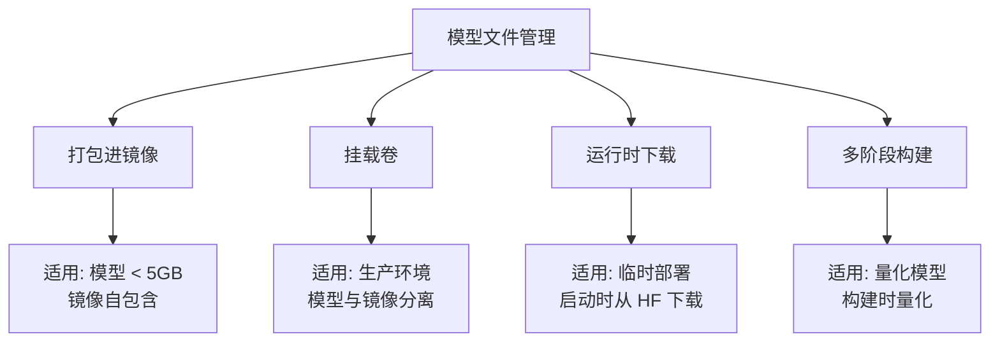
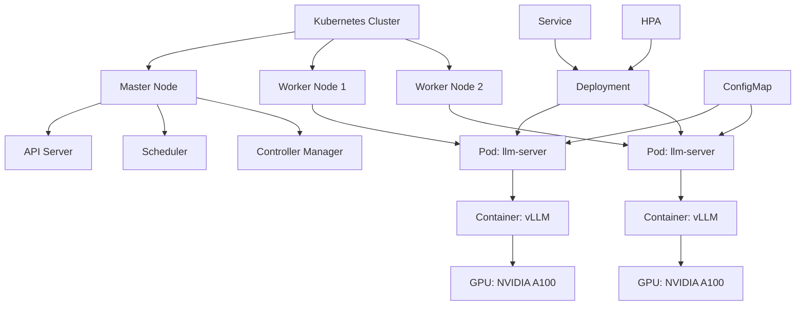
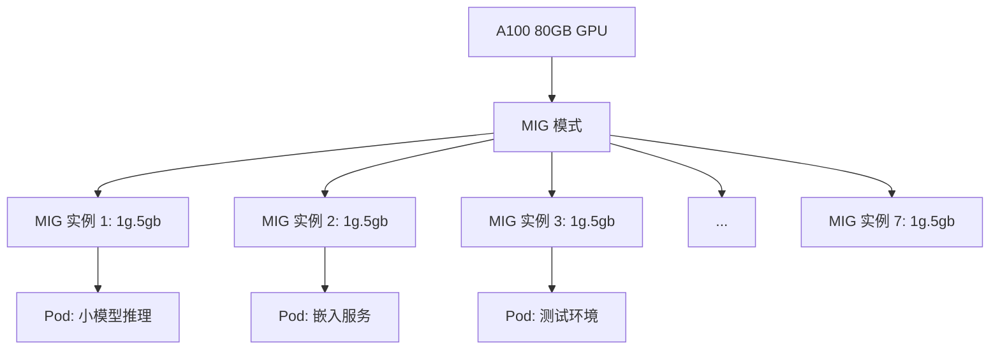

## 引言

容器化部署是大模型从开发环境走向生产环境的必经之路。大模型的部署面临独特的挑战：动辄数十 GB 的模型文件、对 GPU 硬件的强依赖、不均匀的计算负载、漫长的模型加载时间。传统的应用部署方式难以高效应对这些问题。

Docker 提供了环境隔离和一致性保障，让"一次构建、处处运行"成为现实；Kubernetes 则提供了集群编排、弹性伸缩和自愈能力，是大规模生产部署的标准方案。两者的结合构成了现代大模型部署的基础设施。

本文将从 Docker 单机部署出发，逐步深入到 Kubernetes 集群部署，涵盖 GPU 调度、弹性伸缩、生产实践等核心主题，提供完整的 YAML 配置和 Dockerfile 示例。

## Docker 基础

### GPU 镜像选择

大模型部署必须使用支持 GPU 的基础镜像。NVIDIA 提供了官方的 CUDA 镜像：

| 镜像 | 说明 | 大小 | 适用场景 |
|------|------|------|---------|
| `nvidia/cuda:12.1.0-runtime-ubuntu22.04` | 仅运行时 | ~3GB | 仅推理（推荐） |
| `nvidia/cuda:12.1.0-cudnn8-runtime-ubuntu22.04` | + cuDNN | ~4GB | 推理（含 cuDNN） |
| `nvidia/cuda:12.1.0-devel-ubuntu22.04` | 开发环境 | ~6GB | 编译/开发 |
| `pytorch/pytorch:2.3.0-cuda12.1-cudnn8-runtime` | PyTorch 运行时 | ~8GB | PyTorch 推理 |

**选择原则**：
- 生产推理：使用 `runtime` 变体，体积小、攻击面小
- 需要 cuDNN：选择带 `cudnn8` 的变体
- 开发调试：使用 `devel` 变体

### NVIDIA Container Toolkit

在 Docker 中使用 GPU，必须安装 NVIDIA Container Toolkit：

```bash
# Ubuntu/Debian 安装
# 1. 添加 GPG key
curl -fsSL https://nvidia.github.io/libnvidia-container/gpgkey \
    | sudo gpg --dearmor -o /usr/share/keyrings/nvidia-container-toolkit-keyring.gpg

# 2. 添加仓库
curl -s -L https://nvidia.github.io/libnvidia-container/stable/deb/nvidia-container-toolkit.list \
    | sed 's#deb https://#deb [signed-by=/usr/share/keyrings/nvidia-container-toolkit-keyring.gpg] https://#g' \
    | sudo tee /etc/apt/sources.list.d/nvidia-container-toolkit.list

# 3. 安装
sudo apt-get update
sudo apt-get install -y nvidia-container-toolkit

# 4. 配置 Docker
sudo nvidia-ctk runtime configure --runtime=docker
sudo systemctl restart docker

# 5. 验证 GPU 是否可用
docker run --rm --gpus all nvidia/cuda:12.1.0-base-ubuntu22.04 nvidia-smi
```

### Dockerfile 编写

```dockerfile
# ============ 基础推理 Dockerfile ============
FROM nvidia/cuda:12.1.0-cudnn8-runtime-ubuntu22.04

# 设置环境变量
ENV DEBIAN_FRONTEND=noninteractive
ENV PYTHONUNBUFFERED=1
ENV PYTHONDONTWRITEBYTECODE=1
ENV PIP_NO_CACHE_DIR=1
ENV TRANSFORMERS_CACHE=/models/cache
ENV HF_HOME=/models/cache

# 安装系统依赖
RUN apt-get update && apt-get install -y \
    python3 \
    python3-pip \
    git \
    curl \
    && rm -rf /var/lib/apt/lists/* \
    && ln -s /usr/bin/python3 /usr/bin/python

WORKDIR /app

# 安装 Python 依赖（利用层缓存）
COPY requirements.txt .
RUN pip install --no-cache-dir -r requirements.txt

# 复制应用代码
COPY src/ ./src/

# 健康检查
HEALTHCHECK --interval=30s --timeout=10s --retries=3 \
    CMD curl -f http://localhost:8000/health || exit 1

EXPOSE 8000

CMD ["python", "-m", "uvicorn", "src.main:app", \
     "--host", "0.0.0.0", "--port", "8000", \
     "--workers", "1"]
```

```text
# requirements.txt
torch==2.3.0
transformers==4.44.0
accelerate==0.33.0
fastapi==0.111.0
uvicorn==0.30.0
vllm==0.5.0
pydantic==2.7.0
```

### 多阶段构建

多阶段构建可以显著减小最终镜像体积——构建阶段包含编译工具和源码，最终阶段只包含运行时所需文件：

```dockerfile
# ============ 多阶段构建 ============

# ---- 阶段 1: 模型构建 ----
FROM nvidia/cuda:12.1.0-cudnn8-devel-ubuntu22.04 AS builder

RUN apt-get update && apt-get install -y python3 python3-pip git
RUN ln -s /usr/bin/python3 /usr/bin/python

WORKDIR /build

# 安装量化工具
RUN pip install auto-gptq autoawq transformers torch accelerate

# 复制量化脚本
COPY scripts/quantize.py .

# 执行量化（在构建时完成，运行时无需量化）
RUN python quantize.py \
    --model meta-llama/Meta-Llama-3.1-8B-Instruct \
    --method awq \
    --output /models/quantized

# ---- 阶段 2: 运行时 ----
FROM nvidia/cuda:12.1.0-cudnn8-runtime-ubuntu22.04 AS runtime

RUN apt-get update && apt-get install -y python3 python3-pip curl \
    && rm -rf /var/lib/apt/lists/* \
    && ln -s /usr/bin/python3 /usr/bin/python

WORKDIR /app

# 仅安装运行时依赖
RUN pip install vllm==0.5.0 uvicorn fastapi

# 从构建阶段复制量化后的模型
COPY --from=builder /models/quantized /models/llama-3.1-8b-awq

# 复制应用代码
COPY src/ ./src/

EXPOSE 8000

CMD ["python", "-m", "vllm.entrypoints.openai.api_server", \
     "--model", "/models/llama-3.1-8b-awq", \
     "--quantization", "awq", \
     "--port", "8000"]
```

### docker-compose 编排

```yaml
# docker-compose.yml
version: "3.8"

services:
  llm-server:
    build:
      context: .
      dockerfile: Dockerfile
    container_name: llm-server
    restart: unless-stopped
    ports:
      - "8000:8000"
    volumes:
      # 挂载模型文件（避免打包进镜像）
      - model_data:/models
      # 挂载配置文件
      - ./config:/app/config:ro
    environment:
      - MODEL_PATH=/models/llama-3.1-8b-awq
      - QUANTIZATION=awq
      - GPU_MEMORY_UTILIZATION=0.9
      - MAX_MODEL_LEN=8192
      - API_KEY=sk-your-secret-key
    deploy:
      resources:
        reservations:
          devices:
            - driver: nvidia
              capabilities: [gpu]
              count: 1    # GPU 数量
        limits:
          memory: 32G    # 内存限制
    healthcheck:
      test: ["CMD", "curl", "-f", "http://localhost:8000/health"]
      interval: 30s
      timeout: 10s
      retries: 3
      start_period: 120s  # 模型加载需要时间
    logging:
      driver: json-file
      options:
        max-size: "100m"
        max-file: "3"

  # Nginx 反向代理
  nginx:
    image: nginx:alpine
    container_name: nginx-proxy
    restart: unless-stopped
    ports:
      - "80:80"
    volumes:
      - ./nginx.conf:/etc/nginx/nginx.conf:ro
    depends_on:
      llm-server:
        condition: service_healthy

volumes:
  model_data:
    driver: local
    driver_opts:
      type: none
      o: bind
      device: /data/models  # 本地模型目录
```

```bash
# 启动服务
docker-compose up -d

# 查看日志
docker-compose logs -f llm-server

# 进入容器调试
docker-compose exec llm-server bash

# 停止服务
docker-compose down
```

### 模型文件管理策略

大模型文件通常达到数十 GB，如何管理这些文件是一个重要问题：

| 策略 | 优点 | 缺点 | 适用场景 |
|------|------|------|---------|
| 打包进镜像 | 自包含、版本一致 | 镜像体积大、推送慢 | 模型较小（<5GB） |
| 挂载卷 | 镜像小、模型共享 | 需要额外管理模型文件 | 生产推荐 |
| 运行时下载 | 镜像最小 | 启动慢、依赖网络 | 临时部署 |
| 多阶段构建 | 镜像适中 | 构建复杂 | 量化模型 |



## Kubernetes 基础

### 核心概念

Kubernetes（K8s）是容器编排的标准平台。大模型部署涉及的核心概念：



| K8s 概念 | 说明 | 大模型场景 |
|---------|------|----------|
| **Pod** | 最小调度单元 | 包含模型容器 + GPU 资源 |
| **Deployment** | 管理 Pod 副本 | 控制模型实例数量 |
| **Service** | 网络服务抽象 | 负载均衡多个模型实例 |
| **ConfigMap** | 配置管理 | 存储模型路径、参数等 |
| **Secret** | 敏感信息 | 存储 API Key |
| **PersistentVolume** | 持久化存储 | 存储模型文件 |
| **HPA** | 水平 Pod 自动伸缩 | 根据负载自动扩缩 |

### Pod 与 Deployment

```yaml
# llm-deployment.yaml
apiVersion: apps/v1
kind: Deployment
metadata:
  name: llm-server
  namespace: llm-serving
  labels:
    app: llm-server
spec:
  replicas: 2                    # 初始副本数
  selector:
    matchLabels:
      app: llm-server
  strategy:
    type: RollingUpdate          # 滚动更新
    rollingUpdate:
      maxSurge: 1                # 滚动更新时最多多出 1 个 Pod
      maxUnavailable: 0          # 滚动更新时不允许减少 Pod
  template:
    metadata:
      labels:
        app: llm-server
    spec:
      # 节点选择器：调度到有 GPU 的节点
      nodeSelector:
        accelerator: nvidia-gpu
      
      # 容忍 GPU 节点的污点
      tolerations:
        - key: nvidia.com/gpu
          operator: Exists
          effect: NoSchedule
      
      # 优雅终止等待时间
      terminationGracePeriodSeconds: 300
      
      containers:
        - name: llm-server
          image: registry.example.com/llm-server:latest
          imagePullPolicy: IfNotPresent
          
          ports:
            - containerPort: 8000
              name: http
          
          # GPU 资源请求
          resources:
            limits:
              nvidia.com/gpu: 1           # 请求 1 块 GPU
              memory: "32Gi"
              cpu: "8"
            requests:
              nvidia.com/gpu: 1
              memory: "16Gi"
              cpu: "4"
          
          # 环境变量
          env:
            - name: MODEL_PATH
              value: /models/llama-3.1-8b-awq
            - name: QUANTIZATION
              value: awq
            - name: GPU_MEMORY_UTILIZATION
              value: "0.9"
            - name: API_KEY
              valueFrom:
                secretKeyRef:
                  name: llm-secrets
                  key: api-key
          
          # 模型文件挂载
          volumeMounts:
            - name: model-storage
              mountPath: /models
              readOnly: true
            - name: dshm           # 共享内存（PyTorch DataLoader 需要）
              mountPath: /dev/shm
          
          # 存活检查
          livenessProbe:
            httpGet:
              path: /health
              port: 8000
            initialDelaySeconds: 120   # 模型加载需要时间
            periodSeconds: 30
            failureThreshold: 3
          
          # 就绪检查
          readinessProbe:
            httpGet:
              path: /ready
              port: 8000
            initialDelaySeconds: 60
            periodSeconds: 10
            failureThreshold: 5
          
          # 启动检查（等待模型加载完成）
          startupProbe:
            httpGet:
              path: /ready
              port: 8000
            periodSeconds: 10
            failureThreshold: 30    # 最多等 5 分钟
      
      volumes:
        - name: model-storage
          persistentVolumeClaim:
            claimName: model-pvc
        - name: dshm
          emptyDir:
            medium: Memory
            sizeLimit: 2Gi
```

### Service

```yaml
# llm-service.yaml
apiVersion: v1
kind: Service
metadata:
  name: llm-server
  namespace: llm-serving
spec:
  type: ClusterIP
  selector:
    app: llm-server
  ports:
    - port: 80
      targetPort: 8000
      name: http
  # 会话保持（可选，多轮对话场景）
  sessionAffinity: ClientIP
  sessionAffinityConfig:
    clientIP:
      timeoutSeconds: 3600
```

### ConfigMap 与 Secret

```yaml
# config-map.yaml
apiVersion: v1
kind: ConfigMap
metadata:
  name: llm-config
  namespace: llm-serving
data:
  config.yaml: |
    model:
      path: /models/llama-3.1-8b-awq
      quantization: awq
      max_model_len: 8192
    server:
      port: 8000
      workers: 1
      gpu_memory_utilization: 0.9
    sampling:
      default_temperature: 0.7
      default_top_p: 0.9
      default_max_tokens: 512

---
# secret.yaml
apiVersion: v1
kind: Secret
metadata:
  name: llm-secrets
  namespace: llm-serving
type: Opaque
stringData:
  api-key: sk-your-secret-api-key
  hf-token: hf_your_huggingface_token
```

### PersistentVolume 模型存储

```yaml
# pv-pvc.yaml
---
apiVersion: v1
kind: PersistentVolume
metadata:
  name: model-pv
spec:
  capacity:
    storage: 200Gi
  accessModes:
    - ReadOnlyMany         # 多个 Pod 同时只读挂载
  persistentVolumeReclaimPolicy: Retain
  nfs:
    server: 10.0.0.100     # NFS 服务器地址
    path: /data/models     # 共享模型目录
  storageClassName: nfs

---
apiVersion: v1
kind: PersistentVolumeClaim
metadata:
  name: model-pvc
  namespace: llm-serving
spec:
  accessModes:
    - ReadOnlyMany
  resources:
    requests:
      storage: 200Gi
  storageClassName: nfs
```

## GPU 调度

### NVIDIA Device Plugin

Kubernetes 调度 GPU 需要 NVIDIA Device Plugin，它负责向 K8s 上报 GPU 资源信息：

```bash
# 安装 NVIDIA Device Plugin（DaemonSet 方式）
kubectl create -f https://raw.githubusercontent.com/NVIDIA/k8s-device-plugin/v0.14.5/nvidia-device-plugin.yml

# 验证 GPU 节点
kubectl describe node <gpu-node-name> | grep -A 10 "Allocated resources"

# 预期输出:
# Allocated resources:
#   (Total limits may be over 100 percent, i.e., overcommitted.)
#   Resource           Requests  Limits
#   --------           --------  ------
#   nvidia.com/gpu     0         0
```

### GPU 资源请求

```yaml
# 在 Pod 中请求 GPU
spec:
  containers:
    - name: llm-server
      resources:
        limits:
          nvidia.com/gpu: 1    # 请求 1 块 GPU
```

### GPU 共享与时间分片

Kubernetes 默认一个 GPU 只能分配给一个 Pod。但通过 GPU 时间分片（Time-Slicing）或 MIG（Multi-Instance GPU），可以实现 GPU 共享：

```yaml
# NVIDIA Device Plugin 时间分片配置
# config.yaml
version: v1
sharing:
  timeSlicing:
    resources:
      - name: nvidia.com/gpu
        replicas: 4        # 每块 GPU 虚拟为 4 个
flags:
  migStrategy: none
```

```yaml
# 使用共享 GPU（注意：共享 GPU 无法实现隔离，可能互相影响）
resources:
  limits:
    nvidia.com/gpu: 1      # 实际获得 1/4 块 GPU 的时间片
```

### MIG（Multi-Instance GPU）

A100/H100 支持 MIG，可将一块物理 GPU 分割为多个隔离的实例：

```bash
# 在 GPU 节点上启用 MIG
sudo nvidia-smi -i 0 -mig 1
sudo nvidia-smi mig -cgi 19,19,19,19,19,19,19 -C  # 创建 7 个 1g.5gb 实例

# 查看 MIG 实例
nvidia-smi mig -lgi
```



### GPU 节点标签与污点

```bash
# 给 GPU 节点打标签
kubectl label nodes gpu-node-1 accelerator=nvidia-gpu
kubectl label nodes gpu-node-1 gpu-type=A100
kubectl label nodes gpu-node-1 gpu-memory=80GB

# 添加污点，防止非 GPU 任务调度到 GPU 节点
kubectl taint nodes gpu-node-1 nvidia.com/gpu=true:NoSchedule
```

## 弹性伸缩

### HPA（水平 Pod 自动伸缩）

HPA 根据 CPU/GPU 利用率或自定义指标自动调整 Pod 数量：

```yaml
# llm-hpa.yaml
apiVersion: autoscaling/v2
kind: HorizontalPodAutoscaler
metadata:
  name: llm-server-hpa
  namespace: llm-serving
spec:
  scaleTargetRef:
    apiVersion: apps/v1
    kind: Deployment
    name: llm-server
  minReplicas: 2              # 最小副本数
  maxReplicas: 10             # 最大副本数
  metrics:
    # 基于 CPU 利用率
    - type: Resource
      resource:
        name: cpu
        target:
          type: Utilization
          averageUtilization: 70
    
    # 基于自定义指标（需要 Prometheus Adapter）
    - type: Pods
      pods:
        metric:
          name: gpu_utilization    # 自定义 GPU 利用率指标
        target:
          type: AverageValue
          averageValue: "80"       # GPU 利用率超过 80% 时扩容
    
    # 基于请求队列长度
    - type: Pods
      pods:
        metric:
          name: request_queue_length   # 请求队列长度
        target:
          type: AverageValue
          averageValue: "10"           # 平均队列超过 10 时扩容
  
  # 扩缩容策略
  behavior:
    scaleUp:
      stabilizationWindowSeconds: 60   # 扩容冷却时间
      policies:
        - type: Pods
          value: 2                     # 每次最多增加 2 个 Pod
          periodSeconds: 60
    scaleDown:
      stabilizationWindowSeconds: 300  # 缩容冷却时间（5分钟）
      policies:
        - type: Pods
          value: 1                     # 每次最多减少 1 个 Pod
          periodSeconds: 120
```

### 自定义指标

大模型服务的弹性伸缩不能仅依赖 CPU/内存指标，需要自定义 GPU 和推理相关的指标：

```yaml
# Prometheus Adapter 配置: prometheus-adapter-config.yaml
apiVersion: v1
kind: ConfigMap
metadata:
  name: prometheus-adapter-config
  namespace: monitoring
data:
  config.yaml: |
    rules:
      # GPU 利用率指标
      - seriesQuery: 'gpu_utilization{namespace!="",pod!=""}'
        resources:
          overrides:
            namespace: {resource: "namespace"}
            pod: {resource: "pod"}
        name:
          matches: "^(.*)"
          as: "gpu_utilization"
        metricsQuery: 'avg(gpu_utilization{namespace="<<.Namespace>>",pod=~"<<.PodName>>.*"}) by (pod)'
      
      # 请求队列长度
      - seriesQuery: 'llm_request_queue_length{namespace!=""}'
        resources:
          overrides:
            namespace: {resource: "namespace"}
            pod: {resource: "pod"}
        name:
          as: "request_queue_length"
        metricsQuery: 'avg(llm_request_queue_length{namespace="<<.Namespace>>",pod=~"<<.PodName>>.*"})'
```


### VPA（垂直 Pod 自动伸缩）

当无法水平扩展（如单 GPU 资源已满）时，VPA 可以自动调整 Pod 的资源请求：

```yaml
apiVersion: autoscaling.k8s.io/v1
kind: VerticalPodAutoscaler
metadata:
  name: llm-server-vpa
  namespace: llm-serving
spec:
  targetRef:
    apiVersion: "apps/v1"
    kind: Deployment
    name: llm-server
  updatePolicy:
    updateMode: "Auto"    # Off / Initial / Auto
  resourcePolicy:
    containerPolicies:
      - containerName: llm-server
        minAllowed:
          cpu: 4
          memory: 16Gi
        maxAllowed:
          cpu: 16
          memory: 64Gi
```

## 生产实践

### 完整部署清单

将所有组件整合为完整的部署方案：

```yaml
# ============ 命名空间 ============
apiVersion: v1
kind: Namespace
metadata:
  name: llm-serving
  labels:
    name: llm-serving

---
# ============ Secret ============
apiVersion: v1
kind: Secret
metadata:
  name: llm-secrets
  namespace: llm-serving
type: Opaque
stringData:
  api-key: sk-your-api-key
  hf-token: hf_your_token

---
# ============ ConfigMap ============
apiVersion: v1
kind: ConfigMap
metadata:
  name: llm-config
  namespace: llm-serving
data:
  MODEL_PATH: /models/llama-3.1-8b-awq
  QUANTIZATION: awq
  MAX_MODEL_LEN: "8192"
  GPU_MEMORY_UTILIZATION: "0.9"

---
# ============ PVC ============
apiVersion: v1
kind: PersistentVolumeClaim
metadata:
  name: model-pvc
  namespace: llm-serving
spec:
  accessModes:
    - ReadOnlyMany
  storageClassName: nfs
  resources:
    requests:
      storage: 200Gi

---
# ============ Deployment ============
apiVersion: apps/v1
kind: Deployment
metadata:
  name: llm-server
  namespace: llm-serving
spec:
  replicas: 2
  selector:
    matchLabels:
      app: llm-server
  template:
    metadata:
      labels:
        app: llm-server
      annotations:
        prometheus.io/scrape: "true"
        prometheus.io/port: "8000"
        prometheus.io/path: "/metrics"
    spec:
      nodeSelector:
        accelerator: nvidia-gpu
      tolerations:
        - key: nvidia.com/gpu
          operator: Exists
          effect: NoSchedule
      terminationGracePeriodSeconds: 300
      containers:
        - name: llm-server
          image: registry.example.com/llm-server:v1.0.0
          ports:
            - containerPort: 8000
          envFrom:
            - configMapRef:
                name: llm-config
            - secretRef:
                name: llm-secrets
          resources:
            limits:
              nvidia.com/gpu: 1
              memory: "32Gi"
            requests:
              nvidia.com/gpu: 1
              memory: "16Gi"
          volumeMounts:
            - name: model-storage
              mountPath: /models
              readOnly: true
            - name: dshm
              mountPath: /dev/shm
          livenessProbe:
            httpGet:
              path: /health
              port: 8000
            initialDelaySeconds: 120
            periodSeconds: 30
          readinessProbe:
            httpGet:
              path: /ready
              port: 8000
            initialDelaySeconds: 60
            periodSeconds: 10
          startupProbe:
            httpGet:
              path: /ready
              port: 8000
            periodSeconds: 10
            failureThreshold: 30
      volumes:
        - name: model-storage
          persistentVolumeClaim:
            claimName: model-pvc
        - name: dshm
          emptyDir:
            medium: Memory
            sizeLimit: 2Gi

---
# ============ Service ============
apiVersion: v1
kind: Service
metadata:
  name: llm-server
  namespace: llm-serving
spec:
  selector:
    app: llm-server
  ports:
    - port: 80
      targetPort: 8000

---
# ============ Ingress ============
apiVersion: networking.k8s.io/v1
kind: Ingress
metadata:
  name: llm-ingress
  namespace: llm-serving
  annotations:
    nginx.ingress.kubernetes.io/proxy-body-size: "100m"
    nginx.ingress.kubernetes.io/proxy-read-timeout: "300"
    nginx.ingress.kubernetes.io/proxy-buffering: "off"   # SSE 流式必须关闭
spec:
  tls:
    - hosts:
        - api.llm.example.com
      secretName: llm-tls
  rules:
    - host: api.llm.example.com
      http:
        paths:
          - path: /
            pathType: Prefix
            backend:
              service:
                name: llm-server
                port:
                  number: 80

---
# ============ HPA ============
apiVersion: autoscaling/v2
kind: HorizontalPodAutoscaler
metadata:
  name: llm-server-hpa
  namespace: llm-serving
spec:
  scaleTargetRef:
    apiVersion: apps/v1
    kind: Deployment
    name: llm-server
  minReplicas: 2
  maxReplicas: 8
  metrics:
    - type: Resource
      resource:
        name: cpu
        target:
          type: Utilization
          averageUtilization: 70
  behavior:
    scaleDown:
      stabilizationWindowSeconds: 300
```

### 滚动更新与回滚

```bash
# 更新镜像
kubectl set image deployment/llm-server \
    llm-server=registry.example.com/llm-server:v1.1.0 \
    -n llm-serving

# 查看滚动更新状态
kubectl rollout status deployment/llm-server -n llm-serving

# 查看更新历史
kubectl rollout history deployment/llm-server -n llm-serving

# 回滚到上一版本
kubectl rollout undo deployment/llm-server -n llm-serving

# 回滚到指定版本
kubectl rollout undo deployment/llm-server \
    --to-revision=2 -n llm-serving
```

### 日志收集

```yaml
# Fluent Bit DaemonSet 配置（采集容器日志）
apiVersion: apps/v1
kind: DaemonSet
metadata:
  name: fluent-bit
  namespace: llm-serving
spec:
  selector:
    matchLabels:
      app: fluent-bit
  template:
    metadata:
      labels:
        app: fluent-bit
    spec:
      containers:
        - name: fluent-bit
          image: fluent/fluent-bit:3.0
          volumeMounts:
            - name: varlog
              mountPath: /var/log
            - name: varlibdockercontainers
              mountPath: /var/lib/docker/containers
              readOnly: true
            - name: config
              mountPath: /fluent-bit/etc/
      volumes:
        - name: varlog
          hostPath:
            path: /var/log
        - name: varlibdockercontainers
          hostPath:
            path: /var/lib/docker/containers
        - name: config
          configMap:
            name: fluent-bit-config
```

### 监控告警

```yaml
# Prometheus ServiceMonitor
apiVersion: monitoring.coreos.com/v1
kind: ServiceMonitor
metadata:
  name: llm-server-monitor
  namespace: llm-serving
spec:
  selector:
    matchLabels:
      app: llm-server
  endpoints:
    - port: http
      path: /metrics
      interval: 15s

---
# PrometheusRule - 告警规则
apiVersion: monitoring.coreos.com/v1
kind: PrometheusRule
metadata:
  name: llm-alerts
  namespace: llm-serving
spec:
  groups:
    - name: llm-serving
      rules:
        - alert: LLMHighGPUUtilization
          expr: gpu_utilization > 0.95
          for: 5m
          labels:
            severity: warning
          annotations:
            summary: "GPU 利用率过高"
            description: "Pod {{ $labels.pod }} GPU 利用率超过 95% 持续 5 分钟"
        
        - alert: LLMHighLatency
          expr: histogram_quantile(0.95, llm_request_latency_seconds_bucket) > 5
          for: 2m
          labels:
            severity: critical
          annotations:
            summary: "请求延迟过高"
            description: "P95 延迟超过 5 秒"
        
        - alert: LLMPodCrashLooping
          expr: rate(kube_pod_container_status_restarts_total{namespace="llm-serving"}[5m]) > 0
          for: 5m
          labels:
            severity: critical
          annotations:
            summary: "Pod 反复重启"
            description: "{{ $labels.pod }} 在 5 分钟内多次重启"
        
        - alert: LLMServiceDown
          expr: up{namespace="llm-serving"} == 0
          for: 1m
          labels:
            severity: critical
          annotations:
            summary: "服务不可用"
            description: "{{ $labels.pod }} 健康检查失败"
```

### PodDisruptionBudget

在维护期间确保最小可用副本数：

```yaml
apiVersion: policy/v1
kind: PodDisruptionBudget
metadata:
  name: llm-server-pdb
  namespace: llm-serving
spec:
  minAvailable: 1              # 至少保持 1 个 Pod 可用
  selector:
    matchLabels:
      app: llm-server
```

## CI/CD 流水线

### GitOps 部署流程


### GitHub Actions 示例

```yaml
# .github/workflows/deploy.yml
name: Build and Deploy

on:
  push:
    branches: [main]
    paths:
      - 'src/**'
      - 'Dockerfile'
      - 'requirements.txt'

jobs:
  build-and-push:
    runs-on: gpu-runner
    steps:
      - uses: actions/checkout@v4
      
      - name: Set up Docker Buildx
        uses: docker/setup-buildx-action@v3
      
      - name: Login to Registry
        uses: docker/login-action@v3
        with:
          registry: registry.example.com
          username: ${{ secrets.REGISTRY_USER }}
          password: ${{ secrets.REGISTRY_PASS }}
      
      - name: Build and Push
        uses: docker/build-push-action@v5
        with:
          context: .
          push: true
          tags: |
            registry.example.com/llm-server:${{ github.sha }}
            registry.example.com/llm-server:latest
          cache-from: type=registry,ref=registry.example.com/llm-server:cache
          cache-to: type=registry,ref=registry.example.com/llm-server:cache,mode=max
  
  deploy:
    needs: build-and-push
    runs-on: ubuntu-latest
    steps:
      - uses: actions/checkout@v4
      
      - name: Update deployment image
        run: |
          sed -i "s|registry.example.com/llm-server:.*|registry.example.com/llm-server:${{ github.sha }}|g" \
              k8s/deployment.yaml
      
      - name: Commit changes
        run: |
          git config user.name "CI Bot"
          git config user.email "ci@example.com"
          git add k8s/deployment.yaml
          git commit -m "deploy: update image to ${{ github.sha }}"
          git push
```

## 故障排查指南

### 常见问题与解决方案

| 问题 | 可能原因 | 解决方案 |
|------|---------|---------|
| Pod 一直 Pending | GPU 资源不足 | 检查节点 GPU 数量、增加节点 |
| Pod CrashLoopBackOff | 模型加载失败 | 检查模型路径、显存是否足够 |
| OOMKilled | 显存不足 | 减小 `gpu_memory_utilization`、使用量化 |
| 启动极慢 | 模型文件未缓存 | 使用 PVC 挂载预下载的模型 |
| 服务不就绪 | 健康检查失败 | 增加 `startupProbe` 的 `failureThreshold` |
| GPU 未被发现 | Device Plugin 未安装 | 安装 NVIDIA Device Plugin |
| 节点不被调度 | 污点未容忍 | 添加对应的 toleration |

```bash
# 常用排查命令
# 查看 Pod 状态
kubectl get pods -n llm-serving -o wide

# 查看 Pod 详情（事件信息）
kubectl describe pod <pod-name> -n llm-serving

# 查看 Pod 日志
kubectl logs <pod-name> -n llm-serving -f

# 查看节点 GPU 资源
kubectl describe node <node-name> | grep -A 5 "nvidia.com/gpu"

# 查看 GPU 使用情况（在节点上执行）
nvidia-smi
watch -n 1 nvidia-smi

# 进入 Pod 调试
kubectl exec -it <pod-name> -n llm-serving -- bash
```

## 结语

容器化部署是大模型从实验室走向大规模生产的关键基础设施。Docker 提供了环境一致性和便携性，Kubernetes 提供了编排、调度和自愈能力，两者的结合让大模型部署变得可管理、可扩展、可观测。

回顾本文的核心实践：Docker 层面，选择合适的 GPU 基础镜像、编写高效的 Dockerfile、通过多阶段构建减小镜像体积、用 docker-compose 实现单机编排；Kubernetes 层面，通过 Deployment 管理 Pod 副本、配置 GPU 资源请求和健康检查、使用 HPA 实现弹性伸缩、通过 ConfigMap/Secret/PVC 管理配置和存储。

大模型的容器化部署有其特殊性——巨大的模型文件、GPU 硬件依赖、漫长的加载时间——这些都需要在架构设计中特别关注。通过模型文件与镜像分离、GPU 感知调度、合理的健康检查配置等手段，可以构建出稳定高效的模型服务平台。

随着 K8s 生态对 AI/ML 工作负载的持续优化（如 GPU 共享、Volcano 批调度、KubeRay 等项目），容器化部署将变得更加高效和灵活，成为大模型基础设施的标准范式。

---

**参考文献**：

1. Docker Documentation. https://docs.docker.com
2. Kubernetes Documentation. https://kubernetes.io/docs
3. NVIDIA Container Toolkit. https://docs.nvidia.com/datacenter/cloud-native/container-toolkit
4. NVIDIA GPU Operator. https://github.com/NVIDIA/gpu-operator
5. NVIDIA Device Plugin for Kubernetes. https://github.com/NVIDIA/k8s-device-plugin
6. Kubernetes Horizontal Pod Autoscaler. https://kubernetes.io/docs/tasks/run-application/horizontal-pod-autoscale
7. Prometheus Monitoring. https://prometheus.io
8. ArgoCD - GitOps Continuous Delivery. https://argo-cd.readthedocs.io
