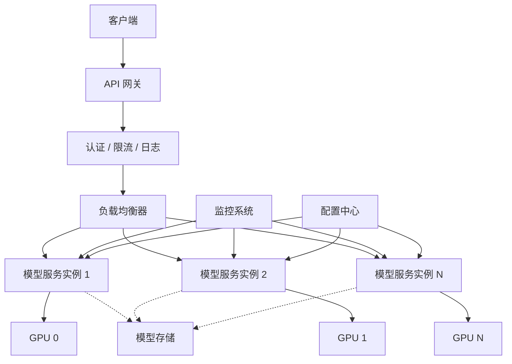
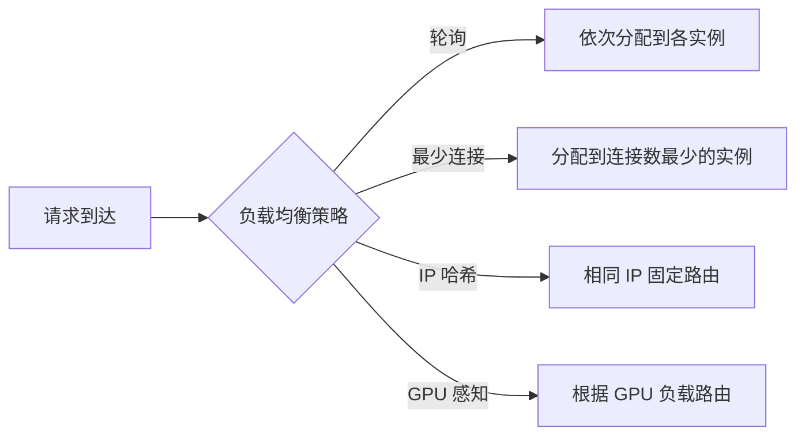
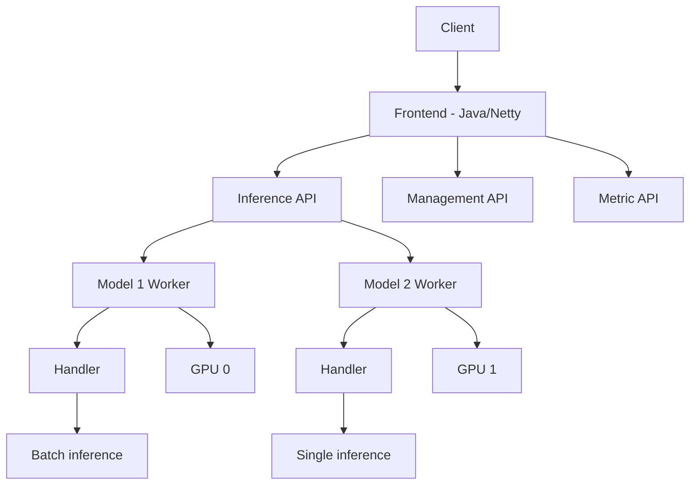

---
title: 模型服务化封装：FastAPI、TorchServe 与 OpenAI 兼容接口
description: 从模型文件到生产级 API 服务，三大服务化框架的完整实践
date: 2026-06-01T10:00:00+08:00
lastmod: 2026-06-01T10:00:00+08:00
weight: 22
tags:
  - 大模型
  - 服务化
  - FastAPI
  - TorchServe
  - OpenAI兼容
categories:
  - 模型部署与推理优化
  - 技术分享
math: true
mermaid: true
photos:
  - https://d-sketon.top/img/backwebp/bg3.webp
---

## 引言

大模型在本地跑通只是第一步，要让它真正服务于业务，需要将模型封装为标准化的 API 服务。模型服务化涉及一系列工程问题：如何处理高并发请求？如何实现流式输出？如何保证服务的可用性和可观测性？如何设计与主流生态兼容的 API 接口？

一个优秀的模型服务需要具备以下能力：

1. **高性能**——低延迟、高吞吐，充分利用 GPU 资源
2. **高可用**——健康检查、故障恢复、优雅关闭
3. **可扩展**——水平扩展、负载均衡
4. **标准化**——API 接口兼容主流生态（如 OpenAI API）
5. **可观测**——完善的日志、指标和追踪

本文将深入讲解三大服务化方案——FastAPI、TorchServe 和 OpenAI 兼容接口设计，涵盖从架构设计到完整代码实现的全部内容。

## 服务化架构设计

### 整体架构

一个生产级的模型服务架构通常包含多个层次：



### 核心组件职责

| 组件 | 职责 | 技术选型 |
|------|------|---------|
| API 网关 | 认证、限流、路由 | Nginx, Kong, Traefik |
| 负载均衡 | 请求分发 | HAProxy, Nginx, Envoy |
| 模型服务 | 模型推理 | FastAPI, TorchServe, vLLM |
| 模型存储 | 模型文件管理 | NFS, S3, 本地存储 |
| 监控系统 | 指标采集与告警 | Prometheus + Grafana |
| 配置中心 | 配置管理 | Consul, etcd |

### 负载均衡策略



对于大模型服务，**最少连接**和 **GPU 感知**策略最为有效。因为不同请求的生成长度差异巨大，简单的轮询可能导致某些实例积压大量长请求。

### 健康检查机制

健康检查是保证服务可用性的基础：

- **存活检查（Liveness）**：服务进程是否存活，失败则重启
- **就绪检查（Readiness）**：模型是否加载完毕、GPU 是否可用，失败则暂时从负载均衡中摘除
- **深度检查**：发送测试请求验证推理是否正常

```python
# 健康检查端点设计
from fastapi import FastAPI
import torch
import time

app = FastAPI()

# 服务状态
class ServiceState:
    model_loaded = False
    gpu_available = torch.cuda.is_available()
    start_time = time.time()
    last_inference_time = None

state = ServiceState()

@app.get("/health")
async def health():
    """存活检查"""
    return {"status": "alive"}

@app.get("/ready")
async def ready():
    """就绪检查"""
    if not state.model_loaded:
        return {"status": "not_ready", "reason": "model not loaded"}, 503
    if not state.gpu_available:
        return {"status": "not_ready", "reason": "GPU not available"}, 503
    return {"status": "ready"}

@app.get("/health/deep")
async def deep_health():
    """深度健康检查"""
    try:
        # 发送一个简单的推理请求验证
        test_input = "hello"
        # model.generate(test_input)  # 实际推理
        state.last_inference_time = time.time()
        return {
            "status": "healthy",
            "gpu_memory": f"{torch.cuda.memory_allocated() / 1024**3:.2f} GB",
            "uptime": f"{time.time() - state.start_time:.0f}s",
        }
    except Exception as e:
        return {"status": "unhealthy", "error": str(e)}, 503
```

### 优雅关闭

当服务需要更新或缩容时，优雅关闭确保正在处理的请求不会被中断：

```python
import signal
import asyncio
from contextlib import asynccontextmanager

# 优雅关闭管理
class GracefulShutdown:
    def __init__(self):
        self.active_requests = 0
        self.shutdown_event = asyncio.Event()
    
    def increment(self):
        self.active_requests += 1
    
    def decrement(self):
        self.active_requests -= 1
        if self.active_requests == 0:
            self.shutdown_event.set()

shutdown_manager = GracefulShutdown()

@asynccontextmanager
async def lifespan(app: FastAPI):
    # 启动时
    print("服务启动中...")
    # model = load_model()  # 加载模型
    yield
    # 关闭时
    print("等待活跃请求完成...")
    # 等待活跃请求完成（最多等 60 秒）
    try:
        await asyncio.wait_for(shutdown_manager.shutdown_event.wait(), timeout=60)
    except asyncio.TimeoutError:
        print("超时，强制关闭")
    print("释放资源...")
    # 释放模型资源、关闭连接等

app = FastAPI(lifespan=lifespan)
```

## FastAPI 实践

FastAPI 是构建模型 API 服务的首选框架，具有高性能（基于 Starlette + Uvicorn）、原生异步支持、自动文档生成等优势。

### 基础服务搭建

```python
from fastapi import FastAPI, HTTPException
from pydantic import BaseModel, Field
from typing import Optional, List
import torch
from transformers import AutoTokenizer, AutoModelForCausalLM
import asyncio
import time
import uuid

app = FastAPI(
    title="LLM Serving API",
    description="基于 FastAPI 的大模型推理服务",
    version="1.0.0",
)

# ============ 数据模型定义 ============

class Message(BaseModel):
    role: str = Field(..., description="角色: system/user/assistant")
    content: str = Field(..., description="消息内容")

class ChatRequest(BaseModel):
    model: str = Field(..., description="模型名称")
    messages: List[Message] = Field(..., description="对话消息列表")
    temperature: Optional[float] = Field(0.7, ge=0, le=2)
    top_p: Optional[float] = Field(0.9, ge=0, le=1)
    max_tokens: Optional[int] = Field(512, ge=1, le=8192)
    stream: Optional[bool] = Field(False, description="是否流式输出")
    stop: Optional[List[str]] = Field(None, description="停止词")

class Choice(BaseModel):
    index: int
    message: Message
    finish_reason: str

class Usage(BaseModel):
    prompt_tokens: int
    completion_tokens: int
    total_tokens: int

class ChatResponse(BaseModel):
    id: str
    object: str = "chat.completion"
    created: int
    model: str
    choices: List[Choice]
    usage: Usage

# ============ 模型加载 ============

class ModelServer:
    def __init__(self):
        self.model = None
        self.tokenizer = None
        self.device = "cuda" if torch.cuda.is_available() else "cpu"
        self.loaded = False
    
    def load(self, model_path: str):
        print(f"加载模型: {model_path}")
        self.tokenizer = AutoTokenizer.from_pretrained(
            model_path, trust_remote_code=True
        )
        self.model = AutoModelForCausalLM.from_pretrained(
            model_path,
            torch_dtype=torch.float16,
            device_map="auto",
            trust_remote_code=True,
        )
        self.model.eval()
        self.loaded = True
        print(f"模型加载完成，设备: {self.device}")
    
    @torch.inference_mode()
    async def generate(self, messages, temperature, top_p, max_tokens, stop):
        # 应用聊天模板
        text = self.tokenizer.apply_chat_template(
            messages, tokenize=False, add_generation_prompt=True
        )
        inputs = self.tokenizer(text, return_tensors="pt").to(self.device)
        input_length = inputs["input_ids"].shape[1]
        
        # 在线程池中执行推理（避免阻塞事件循环）
        loop = asyncio.get_event_loop()
        outputs = await loop.run_in_executor(
            None,
            lambda: self.model.generate(
                **inputs,
                max_new_tokens=max_tokens,
                temperature=temperature,
                top_p=top_p,
                do_sample=temperature > 0,
                pad_token_id=self.tokenizer.eos_token_id,
            )
        )
        
        generated = outputs[0][input_length:]
        response_text = self.tokenizer.decode(generated, skip_special_tokens=True)
        
        # 处理停止词
        if stop:
            for s in stop:
                if s in response_text:
                    response_text = response_text.split(s)[0]
        
        return response_text, len(generated)

server = ModelServer()

# ============ API 端点 ============

@app.on_event("startup")
async def startup():
    server.load("./models/llama-3.1-8b")

@app.post("/v1/chat/completions", response_model=ChatResponse)
async def chat_completions(request: ChatRequest):
    if not server.loaded:
        raise HTTPException(status_code=503, detail="模型尚未加载完成")
    
    start_time = time.time()
    
    messages = [{"role": m.role, "content": m.content} for m in request.messages]
    
    try:
        response_text, completion_tokens = await server.generate(
            messages=messages,
            temperature=request.temperature,
            top_p=request.top_p,
            max_tokens=request.max_tokens,
            stop=request.stop,
        )
    except Exception as e:
        raise HTTPException(status_code=500, detail=str(e))
    
    # 构建响应
    prompt_tokens = len(server.tokenizer.encode(
        server.tokenizer.apply_chat_template(
            messages, tokenize=False, add_generation_prompt=True
        )
    ))
    
    return ChatResponse(
        id=f"chatcmpl-{uuid.uuid4().hex[:8]}",
        created=int(time.time()),
        model=request.model,
        choices=[Choice(
            index=0,
            message=Message(role="assistant", content=response_text),
            finish_reason="stop",
        )],
        usage=Usage(
            prompt_tokens=prompt_tokens,
            completion_tokens=completion_tokens,
            total_tokens=prompt_tokens + completion_tokens,
        ),
    )
```

### SSE 流式输出

流式输出（Server-Sent Events）是大模型 API 的核心特性，让用户逐 token 看到生成内容，显著提升用户体验：

```python
from fastapi.responses import StreamingResponse
import json
import asyncio

@app.post("/v1/chat/completions/stream")
async def chat_completions_stream(request: ChatRequest):
    """SSE 流式聊天接口"""
    
    async def generate_stream():
        # 应用聊天模板
        messages = [{"role": m.role, "content": m.content} for m in request.messages]
        text = server.tokenizer.apply_chat_template(
            messages, tokenize=False, add_generation_prompt=True
        )
        inputs = server.tokenizer(text, return_tensors="pt").to(server.device)
        input_length = inputs["input_ids"].shape[1]
        
        # 逐 token 生成
        past_key_values = None
        generated_tokens = []
        
        for i in range(request.max_tokens):
            # 生成下一个 token
            with torch.inference_mode():
                outputs = server.model(
                    **inputs if past_key_values is None else 
                    {"input_ids": inputs["input_ids"][:, -1:].to(server.device)},
                    past_key_values=past_key_values,
                    use_cache=True,
                )
            
            logits = outputs.logits[:, -1, :]
            
            # 采样
            if request.temperature > 0:
                probs = torch.softmax(logits / request.temperature, dim=-1)
                next_token = torch.multinomial(probs, num_samples=1)
            else:
                next_token = torch.argmax(logits, dim=-1, keepdim=True)
            
            past_key_values = outputs.past_key_values
            generated_tokens.append(next_token.item())
            
            # 检查停止条件
            token_text = server.tokenizer.decode([next_token.item()])
            
            # 检查 EOS
            if next_token.item() == server.tokenizer.eos_token_id:
                finish_reason = "stop"
                # 发送最后一个 chunk
                chunk = {
                    "id": f"chatcmpl-{uuid.uuid4().hex[:8]}",
                    "object": "chat.completion.chunk",
                    "created": int(time.time()),
                    "model": request.model,
                    "choices": [{"index": 0, "delta": {}, "finish_reason": finish_reason}],
                }
                yield f"data: {json.dumps(chunk)}\n\n"
                break
            
            # 发送 chunk
            chunk = {
                "id": f"chatcmpl-{uuid.uuid4().hex[:8]}",
                "object": "chat.completion.chunk",
                "created": int(time.time()),
                "model": request.model,
                "choices": [{"index": 0, "delta": {"content": token_text}, "finish_reason": None}],
            }
            yield f"data: {json.dumps(chunk)}\n\n"
            
            # 让出控制权，允许网络发送
            await asyncio.sleep(0)
        
        # 发送结束标记
        yield "data: [DONE]\n\n"
    
    return StreamingResponse(
        generate_stream(),
        media_type="text/event-stream",
        headers={
            "Cache-Control": "no-cache",
            "Connection": "keep-alive",
            "X-Accel-Buffering": "no",  # Nginx 禁用缓冲
        },
    )
```

### Pydantic 请求校验

FastAPI 利用 Pydantic 进行自动的请求校验，确保输入合法性：

```python
from pydantic import BaseModel, Field, validator
from typing import Optional, List, Literal

class CompletionRequest(BaseModel):
    """文本补全请求"""
    model: str = Field(..., min_length=1, max_length=100)
    prompt: str = Field(..., min_length=1, max_length=100000)
    temperature: float = Field(0.7, ge=0, le=2)
    top_p: float = Field(0.9, ge=0, le=1)
    max_tokens: int = Field(256, ge=1, le=4096)
    frequency_penalty: float = Field(0, ge=-2, le=2)
    presence_penalty: float = Field(0, ge=-2, le=2)
    stream: bool = False
    n: int = Field(1, ge=1, le=4, description="生成数量")
    
    @validator("prompt")
    def validate_prompt(cls, v):
        if not v.strip():
            raise ValueError("prompt 不能为空")
        return v

class EmbeddingRequest(BaseModel):
    """嵌入请求"""
    model: str
    input: List[str] = Field(..., min_items=1, max_items=100)
    encoding_format: Literal["float", "base64"] = "float"

class EmbeddingResponse(BaseModel):
    object: str = "list"
    data: List[dict]
    model: str
    usage: dict
```

### 中间件

中间件用于处理认证、日志、限流等横切关注点：

```python
from fastapi import Request, Response
from fastapi.middleware.cors import CORSMiddleware
import time
import logging

# 日志中间件
@app.middleware("http")
async def logging_middleware(request: Request, call_next):
    start_time = time.time()
    
    # 请求日志
    logging.info(
        f"Request: {request.method} {request.url.path} "
        f"from {request.client.host}"
    )
    
    response = await call_next(request)
    
    # 响应日志
    duration = time.time() - start_time
    logging.info(
        f"Response: {response.status_code} "
        f"in {duration:.3f}s"
    )
    
    # 添加响应头
    response.headers["X-Response-Time"] = f"{duration:.3f}s"
    
    return response

# CORS 中间件
app.add_middleware(
    CORSMiddleware,
    allow_origins=["*"],
    allow_credentials=True,
    allow_methods=["*"],
    allow_headers=["*"],
)

# API Key 认证中间件
from fastapi.security import APIKeyHeader
from fastapi import Security, HTTPException

api_key_header = APIKeyHeader(name="Authorization")

VALID_API_KEYS = {"sk-key1", "sk-key2"}

async def verify_api_key(api_key: str = Security(api_key_header)):
    if api_key.startswith("Bearer "):
        api_key = api_key[7:]
    if api_key not in VALID_API_KEYS:
        raise HTTPException(status_code=401, detail="Invalid API Key")
    return api_key

# 在需要认证的路由上添加依赖
@app.post("/v1/chat/completions")
async def chat_completions(
    request: ChatRequest,
    api_key: str = Security(verify_api_key),
):
    ...
```

### 限流

```python
from slowapi import Limiter
from slowapi.util import get_remote_address
from slowapi.errors import RateLimitExceeded

limiter = Limiter(key_func=get_remote_address)

@app.post("/v1/chat/completions")
@limiter.limit("60/minute")  # 每分钟 60 次请求
async def chat_completions(request: Request, body: ChatRequest):
    ...

# 基于 Token 的限流
class TokenBucket:
    """令牌桶限流器"""
    def __init__(self, rate: float, capacity: int):
        self.rate = rate          # 令牌生成速率 (tokens/s)
        self.capacity = capacity   # 桶容量
        self.tokens = capacity
        self.last_time = time.time()
    
    def consume(self, n=1):
        now = time.time()
        elapsed = now - self.last_time
        self.tokens = min(self.capacity, self.tokens + elapsed * self.rate)
        self.last_time = now
        
        if self.tokens >= n:
            self.tokens -= n
            return True
        return False

# 每个 API Key 对应一个令牌桶
token_buckets = {}

def get_rate_limiter(api_key: str):
    if api_key not in token_buckets:
        # 默认: 每秒 10 个请求的速率，桶容量 20
        token_buckets[api_key] = TokenBucket(rate=10, capacity=20)
    return token_buckets[api_key]
```

### 启动服务

```bash
# 使用 Uvicorn 启动（单 worker）
uvicorn main:app --host 0.0.0.0 --port 8000 --workers 1

# 使用 Gunicorn + Uvicorn workers 启动（多 worker）
gunicorn main:app \
    -w 4 \
    -k uvicorn.workers.UvicornWorker \
    --bind 0.0.0.0:8000 \
    --timeout 120 \
    --graceful-timeout 60

# 开启自动重载（开发模式）
uvicorn main:app --reload --port 8000
```

> **注意**：由于模型占用大量 GPU 显存，通常每个 GPU 只能运行一个模型实例。多 worker 模式下，建议使用多 GPU（每个 worker 绑定一张 GPU），或使用 vLLM 等支持内部并发的推理引擎。

## TorchServe 实践

TorchServe 是 PyTorch 官方的模型服务框架，专为 PyTorch 模型优化，支持模型版本管理、批处理、多模型管理等企业级特性。

### 架构概览



### Handler 编写

Handler 是 TorchServe 的核心，定义了如何预处理输入、调用模型和后处理输出：

```python
# llm_handler.py
import os
import json
import torch
from transformers import AutoTokenizer, AutoModelForCausalLM
from ts.torch_handler.base_handler import BaseHandler

class LLMHandler(BaseHandler):
    """大语言模型推理 Handler"""
    
    def __init__(self):
        super().__init__()
        self.initialized = False
        self.tokenizer = None
        self.model = None
        self.device = None
    
    def initialize(self, context):
        """初始化模型"""
        properties = context.system_properties
        model_dir = properties.get("model_dir")
        self.device = torch.device(
            "cuda:" + str(properties.get("gpu_id"))
            if torch.cuda.is_available() and "gpu_id" in properties
            else "cpu"
        )
        
        # 加载模型
        self.tokenizer = AutoTokenizer.from_pretrained(
            model_dir, trust_remote_code=True
        )
        self.model = AutoModelForCausalLM.from_pretrained(
            model_dir,
            torch_dtype=torch.float16,
            device_map=self.device,
            trust_remote_code=True,
        )
        self.model.eval()
        
        self.initialized = True
        print(f"模型初始化完成，设备: {self.device}")
    
    def preprocess(self, data):
        """预处理：解析请求数据"""
        messages = []
        for row in data:
            input_data = row.get("data") or row.get("body")
            if isinstance(input_data, (bytes, bytearray)):
                input_data = json.loads(input_data)
            
            messages.append(input_data.get("messages", []))
        
        return messages
    
    @torch.inference_mode()
    def inference(self, messages_list, *args, **kwargs):
        """推理"""
        results = []
        
        for messages in messages_list:
            # 应用聊天模板
            text = self.tokenizer.apply_chat_template(
                messages, tokenize=False, add_generation_prompt=True
            )
            inputs = self.tokenizer(text, return_tensors="pt").to(self.device)
            input_length = inputs["input_ids"].shape[1]
            
            # 生成
            outputs = self.model.generate(
                **inputs,
                max_new_tokens=kwargs.get("max_tokens", 512),
                temperature=kwargs.get("temperature", 0.7),
                top_p=kwargs.get("top_p", 0.9),
                do_sample=True,
                pad_token_id=self.tokenizer.eos_token_id,
            )
            
            generated = outputs[0][input_length:]
            response = self.tokenizer.decode(generated, skip_special_tokens=True)
            results.append(response)
        
        return results
    
    def postprocess(self, inference_output):
        """后处理：格式化输出"""
        responses = []
        for text in inference_output:
            responses.append(json.dumps({
                "response": text,
                "model": "llama-3.1-8b",
            }))
        return responses
    
    def handle(self, data, context):
        """处理请求（整合 preprocess → inference → postprocess）"""
        messages_list = self.preprocess(data)
        
        # 获取生成参数
        params = {}
        if data and isinstance(data[0].get("body"), dict):
            params = {
                k: v for k, v in data[0]["body"].items()
                if k in ("max_tokens", "temperature", "top_p")
            }
        
        results = self.inference(messages_list, **params)
        return self.postprocess(results)
```

### 配置文件

```properties
# config.properties
inference_address=http://0.0.0.0:8080
management_address=http://0.0.0.0:8081
metrics_address=http://0.0.0.0:8082

# 模型配置
# num_workers 建议等于 GPU 数量
# max_batch_size: 批处理大小
default_service_handler=llm_handler:handle
load_models=all

# GPU 配置
number_of_gpu=1

# 批处理配置
batch_size=4
max_batch_delay=50
```

### 模型打包与部署

```bash
# 1. 保存模型到指定目录
python -c "
from transformers import AutoTokenizer, AutoModelForCausalLM
model = AutoModelForCausalLM.from_pretrained('meta-llama/Meta-Llama-3.1-8B-Instruct')
tokenizer = AutoTokenizer.from_pretrained('meta-llama/Meta-Llama-3.1-8B-Instruct')
model.save_pretrained('./model_store/llama-3.1-8b')
tokenizer.save_pretrained('./model_store/llama-3.1-8b')
"

# 2. 创建模型配置文件
cat > model_store/llama-3.1-8b/MAR-INF/MANIFEST.json << 'EOF'
{
  "createdOn": "2026-06-01",
  "runtime": "python",
  "model": {
    "modelName": "llama-3.1-8b",
    "serializedFile": "model.safetensors",
    "handler": "llm_handler.py",
    "extensions": [
      {
        "name": "tokenizer",
        "implementation": "transformers"
      }
    ]
  }
}
EOF

# 3. 启动 TorchServe
torchserve --start \
    --model-store ./model_store \
    --ts-config config.properties \
    --models llama-3.1-8b.mar

# 4. 注册模型
curl -X POST "http://localhost:8081/models?url=llama-3.1-8b.mar&initial_workers=1&synchronous=true"

# 5. 推理调用
curl -X POST "http://localhost:8080/predictions/llama-3.1-8b" \
    -H "Content-Type: application/json" \
    -d '{"messages": [{"role": "user", "content": "你好"}], "max_tokens": 256}'
```

### 批处理配置

TorchServe 的批处理通过动态批处理（Dynamic Batching）实现，在设定的时间窗口内收集多个请求组成一个 batch：

```properties
# 批处理参数
batch_size=8                 # 最大批大小
max_batch_delay=100          # 最大等待时间(ms)
response_timeout=120         # 响应超时(s)
```

| 参数 | 说明 | 推荐值 |
|------|------|--------|
| `batch_size` | 单次推理的最大请求数 | 4-16 |
| `max_batch_delay` | 凑批等待时间 | 50-200ms |
| `response_timeout` | 单请求超时 | 60-300s |

批处理的核心权衡：更大的 `batch_size` 提高吞吐量但增加延迟；更大的 `max_batch_delay` 更容易凑满 batch 但等待时间更长。

## OpenAI 兼容接口设计

OpenAI API 已成为大模型服务的事实标准。实现 OpenAI 兼容接口可以让你的服务无缝对接所有支持 OpenAI API 的客户端和工具链。

### 兼容接口全景

```mermaid
graph TD
    A[OpenAI 兼容 API] --> B[/v1/chat/completions]
    A --> C[/v1/completions]
    A --> D[/v1/embeddings]
    A --> E[/v1/models]
    A --> F[/v1/files]
    
    B --> B1[支持: 流式/非流式]
    B --> B2[支持: 函数调用]
    B --> B3[支持: 多轮对话]
    
    C --> C1[文本补全]
    D --> D1[向量嵌入]
    E --> E1[模型列表]
```

### 完整的 OpenAI 兼容 API 实现

```python
from fastapi import FastAPI, HTTPException, Security
from fastapi.security import APIKeyHeader
from fastapi.responses import StreamingResponse, JSONResponse
from pydantic import BaseModel, Field
from typing import Optional, List, Dict, Any, Union
import json
import time
import uuid
import asyncio

app = FastAPI(title="OpenAI Compatible API", version="1.0.0")

# ============ 数据结构（严格匹配 OpenAI API）============

class FunctionDef(BaseModel):
    name: str
    description: Optional[str] = None
    parameters: Optional[Dict[str, Any]] = None

class ToolDef(BaseModel):
    type: str = "function"
    function: FunctionDef

class Message(BaseModel):
    role: str
    content: Optional[Union[str, List[Dict]]] = None
    name: Optional[str] = None
    tool_calls: Optional[List[Dict]] = None
    tool_call_id: Optional[str] = None

class ChatCompletionRequest(BaseModel):
    model: str
    messages: List[Message]
    temperature: Optional[float] = 0.7
    top_p: Optional[float] = 1.0
    n: Optional[int] = 1
    stream: Optional[bool] = False
    stop: Optional[Union[str, List[str]]] = None
    max_tokens: Optional[int] = None
    presence_penalty: Optional[float] = 0
    frequency_penalty: Optional[float] = 0
    logit_bias: Optional[Dict[str, float]] = None
    user: Optional[str] = None
    tools: Optional[List[ToolDef]] = None
    tool_choice: Optional[Union[str, Dict]] = None
    response_format: Optional[Dict[str, str]] = None
    seed: Optional[int] = None

class CompletionRequest(BaseModel):
    model: str
    prompt: Union[str, List[str]]
    temperature: Optional[float] = 0.7
    top_p: Optional[float] = 1.0
    n: Optional[int] = 1
    stream: Optional[bool] = False
    max_tokens: Optional[int] = 16
    stop: Optional[Union[str, List[str]]] = None

class EmbeddingRequest(BaseModel):
    model: str
    input: Union[str, List[str]]
    encoding_format: Optional[str] = "float"
    dimensions: Optional[int] = None

# ============ API 端点 ============

# /v1/models - 列出可用模型
@app.get("/v1/models")
async def list_models():
    return {
        "object": "list",
        "data": [
            {
                "id": "llama-3.1-8b",
                "object": "model",
                "created": 1700000000,
                "owned_by": "local",
            },
            {
                "id": "llama-3.1-70b",
                "object": "model",
                "created": 1700000000,
                "owned_by": "local",
            },
        ],
    }

# /v1/chat/completions - 聊天补全
@app.post("/v1/chat/completions")
async def chat_completions(request: ChatCompletionRequest):
    if request.stream:
        return StreamingResponse(
            _stream_chat_completion(request),
            media_type="text/event-stream",
        )
    
    # 非流式
    response_text, prompt_tokens, completion_tokens = await _generate_chat(request)
    
    return {
        "id": f"chatcmpl-{uuid.uuid4().hex[:29]}",
        "object": "chat.completion",
        "created": int(time.time()),
        "model": request.model,
        "choices": [{
            "index": 0,
            "message": {"role": "assistant", "content": response_text},
            "finish_reason": "stop",
        }],
        "usage": {
            "prompt_tokens": prompt_tokens,
            "completion_tokens": completion_tokens,
            "total_tokens": prompt_tokens + completion_tokens,
        },
    }

async def _stream_chat_completion(request: ChatCompletionRequest):
    """流式生成 SSE 数据"""
    chat_id = f"chatcmpl-{uuid.uuid4().hex[:29]}"
    
    # 模拟逐 token 输出
    # 实际实现中调用模型的逐 token 生成
    tokens = ["你好", "！", "我是", "一个", "AI", "助手", "。"]
    
    # 首个 chunk（仅返回 role）
    first_chunk = {
        "id": chat_id,
        "object": "chat.completion.chunk",
        "created": int(time.time()),
        "model": request.model,
        "choices": [{
            "index": 0,
            "delta": {"role": "assistant", "content": ""},
            "finish_reason": None,
        }],
    }
    yield f"data: {json.dumps(first_chunk)}\n\n"
    
    # 逐 token 发送
    for token in tokens:
        chunk = {
            "id": chat_id,
            "object": "chat.completion.chunk",
            "created": int(time.time()),
            "model": request.model,
            "choices": [{
                "index": 0,
                "delta": {"content": token},
                "finish_reason": None,
            }],
        }
        yield f"data: {json.dumps(chunk)}\n\n"
        await asyncio.sleep(0.05)  # 模拟生成延迟
    
    # 结束 chunk
    end_chunk = {
        "id": chat_id,
        "object": "chat.completion.chunk",
        "created": int(time.time()),
        "model": request.model,
        "choices": [{
            "index": 0,
            "delta": {},
            "finish_reason": "stop",
        }],
    }
    yield f"data: {json.dumps(end_chunk)}\n\n"
    yield "data: [DONE]\n\n"

# /v1/completions - 文本补全
@app.post("/v1/completions")
async def completions(request: CompletionRequest):
    prompts = [request.prompt] if isinstance(request.prompt, str) else request.prompt
    results = await asyncio.gather(*[_generate_completion(p, request) for p in prompts])
    
    choices = []
    for i, (text, pt, ct) in enumerate(results):
        choices.append({
            "index": i,
            "text": text,
            "finish_reason": "stop",
        })
    
    total_prompt = sum(r[1] for r in results)
    total_completion = sum(r[2] for r in results)
    
    return {
        "id": f"cmpl-{uuid.uuid4().hex[:29]}",
        "object": "text_completion",
        "created": int(time.time()),
        "model": request.model,
        "choices": choices,
        "usage": {
            "prompt_tokens": total_prompt,
            "completion_tokens": total_completion,
            "total_tokens": total_prompt + total_completion,
        },
    }

# /v1/embeddings - 向量嵌入
@app.post("/v1/embeddings")
async def embeddings(request: EmbeddingRequest):
    inputs = [request.input] if isinstance(request.input, str) else request.input
    
    # 模拟嵌入生成
    data = []
    for i, text in enumerate(inputs):
        # 实际调用嵌入模型
        embedding = [0.001 * j for j in range(1024)]  # 模拟
        data.append({
            "object": "embedding",
            "index": i,
            "embedding": embedding,
        })
    
    return {
        "object": "list",
        "data": data,
        "model": request.model,
        "usage": {
            "prompt_tokens": sum(len(t.split()) for t in inputs),
            "total_tokens": sum(len(t.split()) for t in inputs),
        },
    }

# 占位实现
async def _generate_chat(request):
    return "这是模拟回复", 10, 20

async def _generate_completion(prompt, request):
    return "这是模拟补全", len(prompt.split()), 10
```

### 客户端兼容性验证

实现 OpenAI 兼容接口后，所有支持 OpenAI API 的工具都可以直接使用：

```python
# 使用 OpenAI SDK
from openai import OpenAI

client = OpenAI(
    base_url="http://localhost:8000/v1",
    api_key="sk-your-key",
)

# 聊天
response = client.chat.completions.create(
    model="llama-3.1-8b",
    messages=[{"role": "user", "content": "你好"}],
)
print(response.choices[0].message.content)

# 嵌入
embedding = client.embeddings.create(
    model="bge-large-zh",
    input="大模型服务化",
)
print(len(embedding.data[0].embedding))

# 流式
for chunk in client.chat.completions.create(
    model="llama-3.1-8b",
    messages=[{"role": "user", "content": "讲个故事"}],
    stream=True,
):
    print(chunk.choices[0].delta.content or "", end="")
```

```bash
# 使用 curl
curl http://localhost:8000/v1/chat/completions \
    -H "Content-Type: application/json" \
    -H "Authorization: Bearer sk-your-key" \
    -d '{
        "model": "llama-3.1-8b",
        "messages": [{"role": "user", "content": "你好"}],
        "stream": true
    }'
```

```python
# 使用 LangChain
from langchain_openai import ChatOpenAI

llm = ChatOpenAI(
    base_url="http://localhost:8000/v1",
    api_key="sk-your-key",
    model="llama-3.1-8b",
)
response = llm.invoke("解释什么是 RAG")
print(response.content)
```

## API 网关

### Nginx 反向代理配置

```nginx
# nginx.conf
upstream llm_backend {
    # 最少连接策略
    least_conn;
    
    server 10.0.0.1:8000 max_fails=3 fail_timeout=30s;
    server 10.0.0.2:8000 max_fails=3 fail_timeout=30s;
    server 10.0.0.3:8000 max_fails=3 fail_timeout=30s;
    
    # 保持长连接
    keepalive 32;
}

server {
    listen 80;
    server_name api.llm-service.com;
    
    # SSE 流式支持（关键配置）
    proxy_http_version 1.1;
    proxy_set_header Connection "";
    proxy_buffering off;          # 禁用缓冲，确保流式输出
    proxy_cache off;              # 禁用缓存
    proxy_read_timeout 300s;      # 长超时，支持长文本生成
    
    # 限流
    limit_req_zone $binary_remote_addr zone=api:10m rate=60r/m;
    
    # 健康检查
    location /health {
        proxy_pass http://llm_backend;
        access_log off;
    }
    
    # API 路由
    location /v1/ {
        limit_req zone=api burst=10 nodelay;
        
        proxy_pass http://llm_backend;
        proxy_set_header Host $host;
        proxy_set_header X-Real-IP $remote_addr;
        proxy_set_header X-Forwarded-For $proxy_add_x_forwarded_for;
        proxy_set_header X-Forwarded-Proto $scheme;
        proxy_set_header Authorization $http_authorization;
    }
    
    # 日志格式
    log_format llm_log '$remote_addr - $remote_user [$time_local] '
                        '"$request" $status $body_bytes_sent '
                        '"$http_referer" "$http_user_agent" '
                        'rt=$request_time uct=$upstream_connect_time '
                        'uht=$upstream_header_time urt=$upstream_response_time';
    access_log /var/log/nginx/llm_access.log llm_log;
}
```

### 认证与限流

```python
# JWT 认证中间件
import jwt
from datetime import datetime, timedelta

SECRET_KEY = "your-secret-key"
ALGORITHM = "HS256"

def create_token(user_id: str, plan: str = "free") -> str:
    payload = {
        "sub": user_id,
        "plan": plan,
        "exp": datetime.utcnow() + timedelta(hours=24),
    }
    return jwt.encode(payload, SECRET_KEY, algorithm=ALGORITHM)

def verify_token(token: str) -> dict:
    try:
        return jwt.decode(token, SECRET_KEY, algorithms=[ALGORITHM])
    except jwt.ExpiredSignatureError:
        raise HTTPException(status_code=401, detail="Token expired")
    except jwt.InvalidTokenError:
        raise HTTPException(status_code=401, detail="Invalid token")

# 基于用户等级的限流
RATE_LIMITS = {
    "free": {"rpm": 20, "tpm": 10000},      # 每分钟 20 请求，10000 token
    "pro": {"rpm": 100, "tpm": 100000},
    "enterprise": {"rpm": 1000, "tpm": 1000000},
}
```

## 框架对比

| 特性 | FastAPI | TorchServe | vLLM Server |
|------|---------|------------|-------------|
| **灵活性** | 极高（完全自定义） | 中（需遵循 Handler 规范） | 低（固定 API 格式） |
| **开发效率** | 中（需编写较多代码） | 中 | 高（开箱即用） |
| **性能** | 高 | 高 | 极高 |
| **批处理** | 需自行实现 | 内置动态批处理 | 内置 Continuous Batching |
| **模型管理** | 需自行实现 | 内置版本管理 | 单模型 |
| **流式输出** | 原生 SSE 支持 | 支持 | 支持 |
| **监控** | 需自行集成 | 内置 Metrics API | 内置 |
| **适用场景** | 定制化服务 | PyTorch 模型服务 | 高吞吐量标准服务 |

### 选型建议

| 场景 | 推荐方案 |
|------|---------|
| 快速原型 / 自定义 API | FastAPI |
| 企业级 PyTorch 模型服务 | TorchServe |
| 高吞吐量标准服务 | vLLM Server |
| 需要多模型管理 | TorchServe |
| 需要深度定制 | FastAPI + vLLM 后端 |

## 生产实践清单

### 性能优化

```python
# 1. 模型预热
@app.on_event("startup")
async def warmup():
    """服务启动时预热模型"""
    test_input = "hello"
    for _ in range(3):
        await server.generate([{"role": "user", "content": test_input}], 0.7, 0.9, 32, None)
    print("模型预热完成")

# 2. 请求队列管理
import asyncio
from asyncio import Queue

class RequestQueue:
    def __init__(self, max_concurrent=4):
        self.semaphore = asyncio.Semaphore(max_concurrent)
        self.queue = Queue()
    
    async def process(self, request):
        async with self.semaphore:
            return await handle_request(request)

# 3. 连接池优化
import httpx

async def get_http_client():
    async with httpx.AsyncClient(
        limits=httpx.Limits(max_connections=100, max_keepalive_connections=20),
        timeout=httpx.Timeout(30.0),
    ) as client:
        yield client
```

### 可观测性

```python
# Prometheus 指标
from prometheus_client import Counter, Histogram, Gauge

# 定义指标
REQUEST_COUNT = Counter(
    "llm_requests_total", "Total requests", ["model", "status"]
)
REQUEST_LATENCY = Histogram(
    "llm_request_latency_seconds", "Request latency", ["model"]
)
TOKENS_GENERATED = Counter(
    "llm_tokens_generated_total", "Total tokens generated", ["model"]
)
GPU_MEMORY = Gauge(
    "llm_gpu_memory_bytes", "GPU memory usage", ["gpu_id"]
)

# 在请求处理中记录指标
@app.post("/v1/chat/completions")
async def chat_completions(request: ChatCompletionRequest):
    start = time.time()
    try:
        result = await _handle_request(request)
        REQUEST_COUNT.labels(model=request.model, status="success").inc()
        TOKENS_GENERATED.labels(model=request.model).inc(result["usage"]["completion_tokens"])
        return result
    except Exception as e:
        REQUEST_COUNT.labels(model=request.model, status="error").inc()
        raise
    finally:
        REQUEST_LATENCY.labels(model=request.model).observe(time.time() - start)

# 暴露指标端点
@app.get("/metrics")
async def metrics():
    from prometheus_client import generate_latest
    return Response(generate_latest(), media_type="text/plain")
```

### Dockerfile

```dockerfile
# Dockerfile
FROM nvidia/cuda:12.1.0-runtime-ubuntu22.04

RUN apt-get update && apt-get install -y python3 python3-pip
RUN ln -s /usr/bin/python3 /usr/bin/python

WORKDIR /app

# 安装依赖
COPY requirements.txt .
RUN pip install --no-cache-dir -r requirements.txt

# 复制代码
COPY . .

# 预下载模型（可选，也可以运行时挂载）
# RUN python -c "from transformers import AutoModelForCausalLM; AutoModelForCausalLM.from_pretrained('...')"

EXPOSE 8000

CMD ["gunicorn", "main:app", \
     "-w", "1", \
     "-k", "uvicorn.workers.UvicornWorker", \
     "--bind", "0.0.0.0:8000", \
     "--timeout", "300"]
```

## 结语

模型服务化是将大模型从实验室推向生产的关键一步。一个优秀的模型服务需要在性能、可用性、可扩展性和标准化之间取得平衡。

FastAPI 提供了最大的灵活性，适合需要深度定制的场景；TorchServe 专为 PyTorch 生态设计，内置了批处理、版本管理等企业级特性；OpenAI 兼容接口则是连接生态的桥梁，让你的服务能与所有主流工具链无缝对接。

在实际项目中，推荐采用**分层架构**：底层使用 vLLM 等高性能推理引擎，中层用 FastAPI 封装 OpenAI 兼容 API，上层用 Nginx/Kong 做网关和负载均衡。这样的架构既保证了性能，又提供了充分的灵活性。

随着大模型应用规模的扩大，服务化的挑战将从单机性能转向集群调度、多模型路由、GPU 资源池化等更复杂的方向。掌握本文的基础实践，将为应对这些进阶挑战打下坚实的基础。

---

**参考文献**：

1. FastAPI Documentation. https://fastapi.tiangolo.com
2. TorchServe Documentation. https://pytorch.org/serve
3. OpenAI API Reference. https://platform.openai.com/docs/api-reference
4. vLLM Documentation. https://docs.vllm.ai
5. Uvicorn Documentation. https://www.uvicorn.org
6. Pydantic Documentation. https://docs.pydantic.dev
7. Prometheus Monitoring. https://prometheus.io
