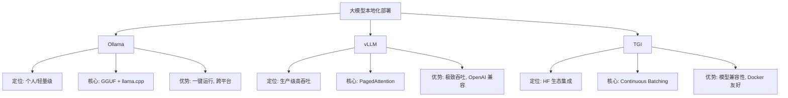
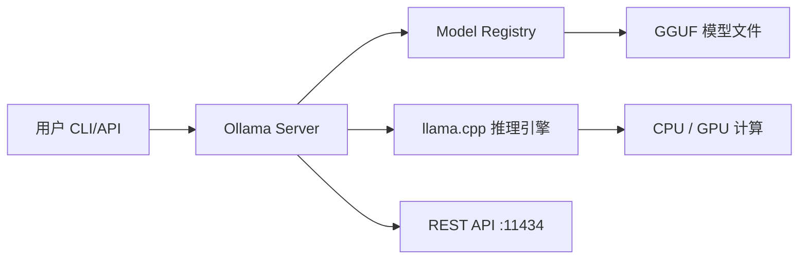
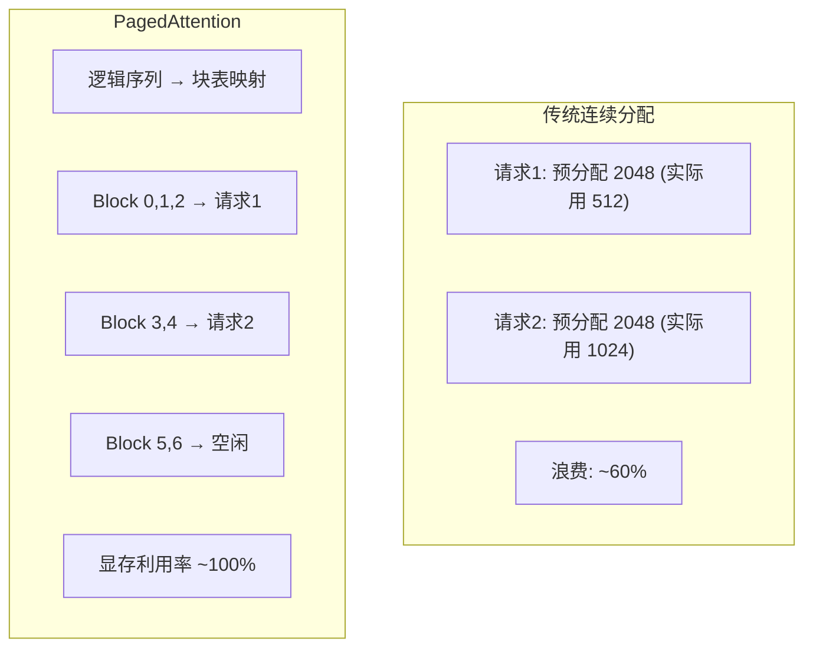
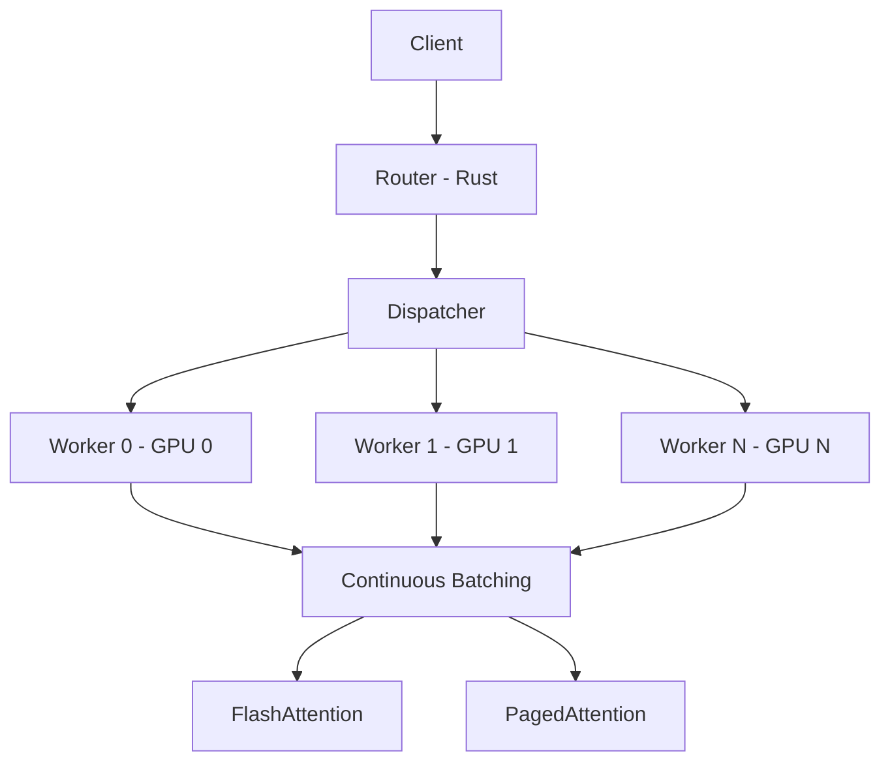
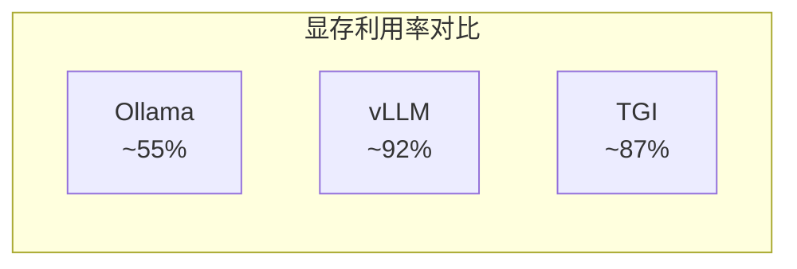
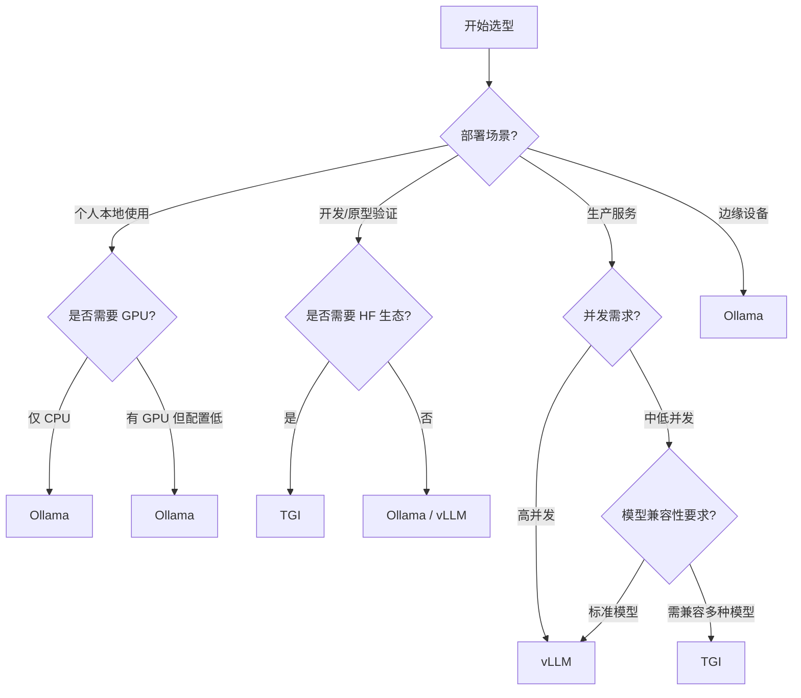

---
title: 模型本地化部署：Ollama、vLLM 与 TGI
description: 三大本地化部署方案对比与实践，从消费级 GPU 到生产级服务
date: 2026-05-25T10:00:00+08:00
lastmod: 2026-05-25T10:00:00+08:00
weight: 20
tags:
  - 大模型
  - 本地部署
  - Ollama
  - vLLM
  - TGI
categories:
  - 模型部署与推理优化
  - 技术分享
math: true
mermaid: true
photos:
  - https://d-sketon.top/img/backwebp/bg1.webp
---

## 引言

随着开源大语言模型的快速发展，越来越多的团队和个人希望在本地环境中部署大模型。本地化部署不仅可以降低 API 调用成本，还能保障数据隐私、减少网络延迟，并为定制化微调提供基础。然而，面对众多的部署工具和框架，如何选择合适的方案成为了一个关键问题。

目前，大模型本地化部署领域形成了三大主流方案，各自面向不同的使用场景和用户群体：

1. **Ollama**——面向个人开发者和轻量级场景，一键运行、开箱即用
2. **vLLM**——面向高吞吐量生产服务，PagedAttention 加持、性能卓越
3. **TGI（Text Generation Inference）**——HuggingFace 官方出品，与 HF 生态深度集成

本文将从架构原理、安装部署、API 调用到性能基准，全面对比这三大方案，并提供详细的选型决策指南。

## 三大方案全景对比

在深入每个方案之前，先通过一张架构图了解它们各自的定位：



### 核心特性对比表

| 特性 | Ollama | vLLM | TGI |
|------|--------|------|-----|
| **开发方** | Ollama Inc. | UC Berkeley | HuggingFace |
| **底层引擎** | llama.cpp | 自研（PyTorch） | 自研（Rust + PyTorch） |
| **量化格式** | GGUF | AWQ / GPTQ / FP8 | GPTQ / AWQ / BitsAndBytes |
| **GPU 支持** | 部分（层卸载） | 完整（CUDA） | 完整（CUDA） |
| **CPU 推理** | 原生支持 | 不支持 | 不支持 |
| **OpenAI 兼容** | 是 | 是 | 是 |
| **PagedAttention** | 否 | 是 | 是 |
| **Continuous Batching** | 否 | 是 | 是 |
| **张量并行** | 否 | 是 | 是 |
| **部署复杂度** | 极低 | 中 | 中 |
| **最大吞吐量** | 低 | 极高 | 高 |
| **典型场景** | 本地体验、开发调试 | 生产 API 服务 | HF 生态生产服务 |

### 硬件需求对比

| 部署方案 | 7B 模型最低要求 | 13B 模型推荐 | 70B 模型推荐 |
|---------|---------------|-------------|-------------|
| Ollama（CPU） | 16GB 内存 | 32GB 内存 | 不推荐 |
| Ollama（GPU） | 6GB 显存 | 12GB 显存 | 2×48GB 显存 |
| vLLM | 8GB 显存 | 16GB 显存 | 2×80GB 显存 |
| TGI | 8GB 显存 | 16GB 显存 | 2×80GB 显存 |

## Ollama 实践

Ollama 是目前最简单的本地大模型运行方案。它将模型权重、参数配置和提示词模板打包成一个统一的"模型"概念，用户只需一条命令即可下载并运行。

### 架构设计



Ollama 的核心设计理念是**极简**：它隐藏了模型格式、量化级别、上下文长度等技术细节，让用户像安装软件一样安装模型。

### 安装与快速开始

**macOS / Linux 安装**：

```bash
# 一键安装脚本
curl -fsSL https://ollama.com/install.sh | sh

# 验证安装
ollama --version
```

**Windows 安装**：

从 [ollama.com/download](https://ollama.com/download) 下载安装包，双击运行即可。

**Docker 安装**：

```bash
# CPU 版本
docker run -d -v ollama:/root/.ollama -p 11434:11434 --name ollama ollama/ollama

# GPU 版本（需要 NVIDIA Container Toolkit）
docker run -d --gpus=all -v ollama:/root/.ollama -p 11434:11434 --name ollama ollama/ollama
```

### 模型拉取与运行

```bash
# 拉取并运行模型（首次会自动下载）
ollama run llama3.1:8b

# 仅下载不运行
ollama pull qwen2.5:7b

# 查看已安装的模型
ollama list

# 查看运行中的模型
ollama ps

# 删除模型
ollama rm llama3.1:8b
```

Ollama 内置了常用模型的模型库（Registry），支持自动选择适合当前硬件的量化级别：

```bash
# 不同参数量的模型
ollama run llama3.1:8b       # Meta Llama 3.1 8B
ollama run qwen2.5:14b       # 通义千问 2.5 14B
ollama run mistral:7b        # Mistral 7B
ollama run phi3:14b          # Microsoft Phi-3 14B
ollama run gemma2:9b         # Google Gemma 2 9B
ollama run deepseek-r1:7b    # DeepSeek-R1 7B

# 嵌入模型
ollama pull nomic-embed-text
```

### REST API 调用

Ollama 在后台启动了一个 HTTP 服务（默认端口 11434），提供完整的 REST API：

```bash
# 生成补全
curl http://localhost:11434/api/generate -d '{
  "model": "llama3.1:8b",
  "prompt": "为什么天空是蓝色的？",
  "stream": false
}'
```

**Python 客户端调用**：

```python
import requests

# 非流式生成
response = requests.post(
    "http://localhost:11434/api/generate",
    json={
        "model": "llama3.1:8b",
        "prompt": "用 Python 实现一个二分查找",
        "stream": False,
    },
)
result = response.json()
print(result["response"])
```

**聊天接口（多轮对话）**：

```python
import requests

response = requests.post(
    "http://localhost:11434/api/chat",
    json={
        "model": "llama3.1:8b",
        "messages": [
            {"role": "system", "content": "你是一个专业的 Python 开发者"},
            {"role": "user", "content": "解释装饰器的原理"},
        ],
        "stream": True,  # 流式响应
    },
    stream=True,
)

for line in response.iter_lines():
    if line:
        import json
        chunk = json.loads(line)
        if "message" in chunk:
            print(chunk["message"]["content"], end="", flush=True)
```

**使用 OpenAI SDK 调用**：

```python
from openai import OpenAI

client = OpenAI(
    base_url="http://localhost:11434/v1",
    api_key="ollama",  # Ollama 不校验 key，任意值即可
)

response = client.chat.completions.create(
    model="llama3.1:8b",
    messages=[
        {"role": "user", "content": "解释什么是 RAG"},
    ],
    temperature=0.7,
)

print(response.choices[0].message.content)
```

### Modelfile 自定义模型

Ollama 支持通过 `Modelfile`（类似 Dockerfile）自定义模型，可以调整系统提示词、参数、温度等：

```dockerfile
# Modelfile 示例：创建一个中文编程助手
FROM llama3.1:8b

# 设置系统提示词
SYSTEM """
你是一个专业的中文编程助手。请遵循以下规则：
1. 始终使用中文回答
2. 代码示例需要添加详细注释
3. 解释要通俗易懂
"""

# 调整生成参数
PARAMETER temperature 0.3
PARAMETER top_p 0.9
PARAMETER num_ctx 8192
PARAMETER stop "<|im_end|>"

# 设置聊天模板
TEMPLATE """
{{ if .System }}<|im_start|>system
{{ .System }}<|im_end|>
{{ end }}<|im_start|>user
{{ .Prompt }}<|im_end|>
<|im_start|>assistant
"""
```

```bash
# 从 Modelfile 创建自定义模型
ollama create my-coder -f Modelfile

# 运行自定义模型
ollama run my-coder

# 查看模型信息
ollama show my-coder
```

### 导入 GGUF 模型

如果模型不在 Ollama 官方库中，可以导入本地的 GGUF 文件：

```dockerfile
# Modelfile for custom GGUF
FROM ./models/my-model-q4_k_m.gguf

PARAMETER temperature 0.7
PARAMETER num_ctx 4096
```

```bash
ollama create my-custom-model -f Modelfile
ollama run my-custom-model
```

## vLLM 实践

vLLM 是由加州大学伯克利分校开发的高性能推理引擎，其核心创新 PagedAttention 实现了接近理论极限的显存利用率和吞吐量。vLLM 是目前生产环境中最流行的大模型服务方案。

### PagedAttention 原理回顾

传统推理引擎为每个请求预分配一段连续的 KV Cache 空间，导致大量显存浪费（内部碎片和外部碎片可达 60%-80%）。vLLM 的 PagedAttention 借鉴操作系统的虚拟内存管理，将 KV Cache 分成固定大小的块（block），按需分配：



PagedAttention 带来的优势不仅是显存利用率的提升，还使得 Continuous Batching（连续批处理）和 Prefix Caching（前缀缓存）等高级特性成为可能。

### 安装

```bash
# pip 安装（推荐）
pip install vllm

# 从源码安装（获取最新特性）
pip install vllm --pre --extra-index-url https://wheels.vllm.ai/nightly

# 验证安装
python -c "import vllm; print(vllm.__version__)"
```

### 离线批量推理

vLLM 提供了 Python API 用于离线批量推理场景：

```python
from vllm import LLM, SamplingParams

# 初始化模型
llm = LLM(
    model="meta-llama/Meta-Llama-3.1-8B-Instruct",
    tensor_parallel_size=1,       # 张量并行数
    gpu_memory_utilization=0.9,   # GPU 显存利用率
    max_model_len=8192,           # 最大上下文长度
    enable_prefix_caching=True,   # 启用前缀缓存
    trust_remote_code=True,
)

# 设置采样参数
sampling_params = SamplingParams(
    temperature=0.7,
    top_p=0.9,
    max_tokens=512,
    stop=["<|eot_id|>"],
)

# 批量推理
prompts = [
    "请解释什么是 PagedAttention",
    "写一个 Python 实现的快速排序算法",
    "总结《三体》的核心思想",
]

# 使用聊天模板
messages_list = [
    [{"role": "user", "content": p}] for p in prompts
]
outputs = llm.chat(messages_list, sampling_params)

for output in outputs:
    print(f"Response: {output.outputs[0].text}\n")
```

### 启动 OpenAI 兼容 API 服务

vLLM 内置了 OpenAI 兼容的 API 服务器，可以直接替代 OpenAI API：

```bash
# 基本启动
python -m vllm.entrypoints.openai.api_server \
    --model meta-llama/Meta-Llama-3.1-8B-Instruct \
    --port 8000 \
    --tensor-parallel-size 1

# 高级配置启动
python -m vllm.entrypoints.openai.api_server \
    --model meta-llama/Meta-Llama-3.1-8B-Instruct \
    --port 8000 \
    --tensor-parallel-size 2 \
    --gpu-memory-utilization 0.92 \
    --max-model-len 8192 \
    --enable-prefix-caching \
    --quantization awq \
    --served-model-name llama-3.1-8b \
    --api-key sk-your-secret-key \
    --allow-credentials
```

**客户端调用**：

```python
from openai import OpenAI

client = OpenAI(
    base_url="http://localhost:8000/v1",
    api_key="sk-your-secret-key",
)

# 聊天补全
response = client.chat.completions.create(
    model="llama-3.1-8b",
    messages=[
        {"role": "system", "content": "你是一个专业的技术写作助手"},
        {"role": "user", "content": "写一篇关于容器化的技术博客大纲"},
    ],
    temperature=0.7,
    max_tokens=1024,
    stream=True,  # 流式输出
)

for chunk in response:
    if chunk.choices[0].delta.content:
        print(chunk.choices[0].delta.content, end="", flush=True)
```

### 批量推理与嵌入服务

```python
# 批量嵌入推理
from vllm import LLM

embed_model = LLM(
    model="BAAI/bge-large-zh-v1.5",
    task="embed",  # 指定任务为嵌入
)

texts = [
    "大模型推理优化技术",
    "PagedAttention 的原理与应用",
    "Kubernetes 集群管理最佳实践",
]

embeddings = embed_model.embed(texts)
for text, emb in zip(texts, embeddings):
    print(f"Text: {text}, Embedding dim: {len(emb.outputs.embedding)}")
```

### 性能调优参数

vLLM 提供了丰富的参数用于性能调优：

| 参数 | 说明 | 推荐值 |
|------|------|--------|
| `gpu_memory_utilization` | GPU 显存利用率上限 | 0.85-0.92 |
| `max_model_len` | 最大上下文长度 | 根据业务需求 |
| `tensor_parallel_size` | 张量并行数 | GPU 数量 |
| `enable_prefix_caching` | 前缀缓存 | True（多轮对话） |
| `enable_chunked_prefill` | 分块预填充 | True（长 prompt） |
| `max_num_seqs` | 最大并发序列数 | 128-256 |
| `swap_space` | CPU 交换空间（GB） | 4-16 |

## TGI 实践

TGI（Text Generation Inference）是 HuggingFace 推出的推理服务框架，最大的优势是与 HuggingFace 生态的深度集成，支持几乎所有的 Transformers 模型。

### 架构概览



TGI 的 Router 层使用 Rust 编写，负责请求调度和负载均衡；Worker 层使用 PyTorch，负责实际的模型推理。

### Docker 部署

TGI 推荐使用 Docker 部署，这是最简单可靠的方式：

```bash
# 拉取 TGI 镜像
docker pull ghcr.io/huggingface/text-generation-inference:latest

# 启动 TGI 服务
docker run --gpus all \
    -v /data/models:/data \
    -p 8080:80 \
    ghcr.io/huggingface/text-generation-inference:latest \
    --model-id meta-llama/Meta-Llama-3.1-8B-Instruct \
    --num-shard 1 \
    --max-input-length 4096 \
    --max-total-tokens 8192 \
    --quantize awq \
    --port 80
```

**关键启动参数**：

| 参数 | 说明 | 示例 |
|------|------|------|
| `--model-id` | 模型 ID 或本地路径 | `meta-llama/Meta-Llama-3.1-8B-Instruct` |
| `--num-shard` | 张量并行数（GPU 数） | `1`, `2`, `4` |
| `--max-input-length` | 最大输入长度 | `4096` |
| `--max-total-tokens` | 最大总 token 数 | `8192` |
| `--quantize` | 量化方式 | `awq`, `gptq`, `bitsandbytes` |
| `--max-batch-size` | 最大批大小 | `128` |
| `--revision` | 模型版本 | `main` |

### 流式响应调用

```python
import requests

# 流式生成
response = requests.post(
    "http://localhost:8080/v1/chat/completions",
    json={
        "model": "meta-llama/Meta-Llama-3.1-8B-Instruct",
        "messages": [
            {"role": "user", "content": "解释 Kubernetes 的核心概念"}
        ],
        "max_tokens": 512,
        "stream": True,
    },
    stream=True,
)

for line in response.iter_lines():
    if line:
        line_str = line.decode("utf-8")
        if line_str.startswith("data: "):
            print(line_str[6:], end="", flush=True)
```

**使用 TGI 原生 API**：

```python
import requests

# TGI 原生 /generate 接口
response = requests.post(
    "http://localhost:8080/generate",
    json={
        "inputs": "请用中文解释什么是 Docker",
        "parameters": {
            "max_new_tokens": 512,
            "temperature": 0.7,
            "top_p": 0.9,
            "do_sample": True,
            "repetition_penalty": 1.1,
        },
    },
)

print(response.json()["generated_text"])
```

### docker-compose 部署

```yaml
# docker-compose.yml
version: "3.8"

services:
  tgi:
    image: ghcr.io/huggingface/text-generation-inference:latest
    container_name: tgi-server
    restart: unless-stopped
    ports:
      - "8080:80"
    volumes:
      - model_data:/data
    environment:
      - HUGGING_FACE_HUB_TOKEN=hf_your_token_here
    command: >
      --model-id meta-llama/Meta-Llama-3.1-8B-Instruct
      --num-shard 1
      --max-input-length 4096
      --max-total-tokens 8192
      --quantize awq
    deploy:
      resources:
        reservations:
          devices:
            - driver: nvidia
              capabilities: [gpu]

volumes:
  model_data:
```

```bash
docker-compose up -d
```

## 性能基准对比

在相同硬件条件下（单张 A100 80GB），对三大方案进行性能基准测试。测试模型为 Llama-3.1-8B-Instruct，输入 512 token，输出 256 token。

### 吞吐量对比

| 方案 | 量化 | 并发=1 (tokens/s) | 并发=8 (tokens/s) | 并发=32 (tokens/s) | 并发=64 (tokens/s) |
|------|------|-------------------|-------------------|-------------------|-------------------|
| Ollama | Q4_K_M | 45 | 120 | 180 | — |
| vLLM | AWQ INT4 | 85 | 950 | 2800 | 3800 |
| vLLM | FP16 | 70 | 720 | 2100 | 3100 |
| TGI | AWQ | 80 | 880 | 2500 | 3400 |
| TGI | FP16 | 65 | 680 | 2000 | 2900 |

### 延迟对比

| 方案 | TTFT @ 并发=1 (ms) | TTFT @ 并发=32 (ms) | TPOT @ 并发=1 (ms) | TPOT @ 并发=32 (ms) |
|------|--------------------|--------------------|--------------------|--------------------|
| Ollama | 280 | 1200 | 22 | 178 |
| vLLM | 45 | 180 | 12 | 11 |
| TGI | 55 | 220 | 13 | 13 |

### 显存利用率

| 方案 | 模型显存 | KV Cache 显存 | 总显存占用 | 利用率 |
|------|---------|-------------|----------|--------|
| Ollama | 5.2 GB | 动态分配 | ~8 GB | ~55% |
| vLLM | 4.8 GB | 65 GB（PagedAttention） | ~72 GB | ~92% |
| TGI | 4.8 GB | 60 GB | ~68 GB | ~87% |



**结论分析**：

- **vLLM 在吞吐量上遥遥领先**，高并发场景下吞吐量是 Ollama 的 20 倍以上，这得益于 PagedAttention 和 Continuous Batching 的组合优化
- **Ollama 在单请求延迟上表现尚可**，但高并发下性能急剧下降，不适合生产服务
- **TGI 的性能介于两者之间**，与 HF 生态的兼容性是其最大优势
- **显存利用率方面 vLLM 最优**，PagedAttention 几乎消除了显存浪费

## 选型决策指南

### 决策流程图



### 分场景推荐

| 场景 | 推荐方案 | 理由 |
|------|---------|------|
| 个人电脑本地体验 | Ollama | 一键安装、CPU 友好、模型库丰富 |
| 开发调试/快速原型 | Ollama 或 vLLM | Ollama 更简单，vLLM 更接近生产 |
| 生产 API 服务（高并发） | vLLM | 吞吐量最高、OpenAI 兼容 |
| 生产 API 服务（HF 生态） | TGI | 模型兼容性好、Docker 友好 |
| RAG 应用 | vLLM | Prefix Caching 加速共享前缀 |
| 多模型服务 | TGI | Router 支持多模型路由 |
| 离线批量推理 | vLLM | 批量推理性能最优 |
| CPU/边缘设备 | Ollama | 原生 CPU 支持、资源占用低 |

### 综合建议

1. **如果你是个人开发者**：从 Ollama 开始，它是最简单的入门方案。一条命令就能在笔记本上运行大模型。

2. **如果你要构建生产服务**：vLLM 是首选。它的 PagedAttention 和 Continuous Batching 技术在高并发场景下优势巨大，且 OpenAI 兼容 API 让迁移成本极低。

3. **如果你的团队深度使用 HuggingFace 生态**：TGI 是自然的选择。它支持几乎所有 Transformers 模型，与 HF Hub 无缝集成。

4. **混合方案**：在实际项目中，可以使用 Ollama 做本地开发，vLLM 做生产部署。两者都兼容 OpenAI API 格式，代码几乎无需修改。

## 高级部署技巧

### 模型预加载与缓存

在生产环境中，避免每次启动都从远端下载模型：

```bash
# 预先下载模型到本地
huggingface-cli download meta-llama/Meta-Llama-3.1-8B-Instruct \
    --local-dir /data/models/llama-3.1-8b

# vLLM 使用本地模型路径
python -m vllm.entrypoints.openai.api_server \
    --model /data/models/llama-3.1-8b \
    --port 8000
```

### 多 GPU 张量并行

当单卡显存不足以容纳整个模型时，使用张量并行：

```bash
# vLLM 双卡张量并行
python -m vllm.entrypoints.openai.api_server \
    --model meta-llama/Meta-Llama-3.1-70B-Instruct \
    --tensor-parallel-size 2 \
    --gpu-memory-utilization 0.92

# TGI 双卡
docker run --gpus all \
    -v /data/models:/data \
    -p 8080:80 \
    ghcr.io/huggingface/text-generation-inference:latest \
    --model-id meta-llama/Meta-Llama-3.1-70B-Instruct \
    --num-shard 2
```

### 健康检查与监控

```python
# vLLM 健康检查
import requests

# 健康检查端点
health = requests.get("http://localhost:8000/health")
if health.status_code == 200:
    print("vLLM 服务正常")

# 获取模型信息
models = requests.get("http://localhost:8000/v1/models")
for model in models.json()["data"]:
    print(f"Model: {model['id']}")
```

### Ollama 服务化管理

```bash
# 创建 systemd 服务（Linux）
sudo systemctl edit ollama.service

# 设置环境变量
[Service]
Environment="OLLAMA_HOST=0.0.0.0:11434"
Environment="OLLAMA_MAX_LOADED_MODELS=4"
Environment="OLLAMA_NUM_PARALLEL=4"

# 重启生效
sudo systemctl restart ollama
```

## 结语

大模型本地化部署已经从复杂的工程问题发展为成熟的技术方案。Ollama、vLLM 和 TGI 三大方案各有定位，覆盖了从个人体验到生产服务的完整场景。

回顾三个方案的核心特点：Ollama 胜在极简易用，让任何人都能在本地运行大模型；vLLM 胜在极致性能，PagedAttention 技术带来了数量级的吞吐量提升；TGI 胜在生态兼容，是 HuggingFace 用户的首选。

在实际项目中，不必拘泥于单一方案。理解每种工具的优势和局限，根据场景灵活选择甚至组合使用，才是工程实践的智慧。随着推理技术的持续进步（如投机解码、FP8 量化、更高效的注意力机制），本地化部署的性能和体验将持续提升，让大模型真正普惠每一个应用场景。

---

**参考文献**：

1. Kwon W, et al. Efficient Memory Management for Large Language Model Serving with PagedAttention. SOSP 2023.
2. Ollama Documentation. https://github.com/ollama/ollama
3. vLLM Documentation. https://docs.vllm.ai
4. HuggingFace TGI Documentation. https://huggingface.co/docs/text-generation-inference
5. Gerganov G. llama.cpp: Port of Facebook's LLaMA model in C/C++. https://github.com/ggerganov/llama.cpp
6. Lin J, et al. AWQ: Activation-aware Weight Quantization for LLM Compression and Acceleration. MLSys 2024.
