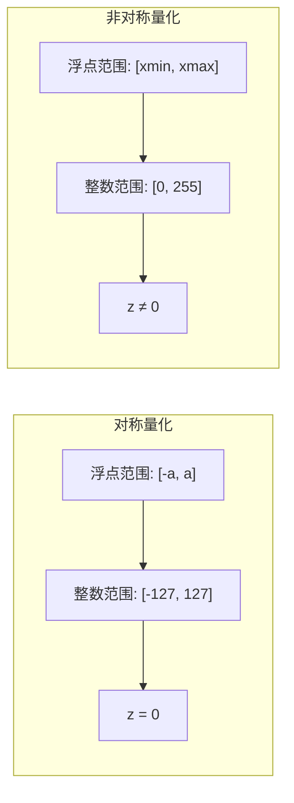
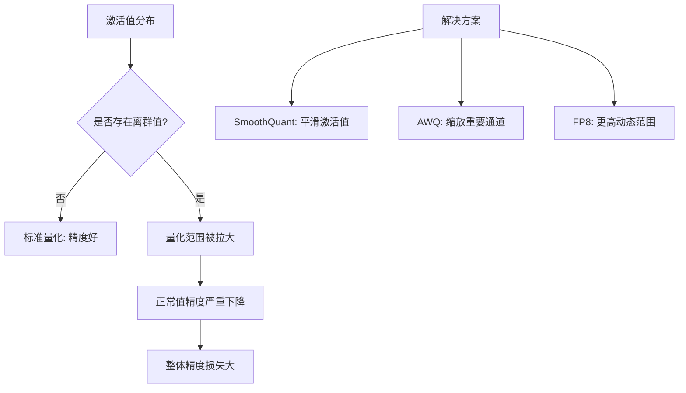
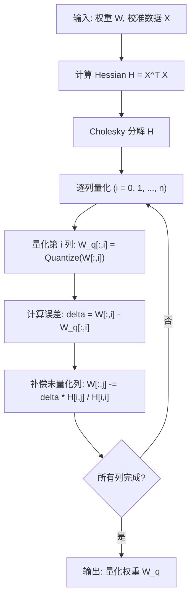
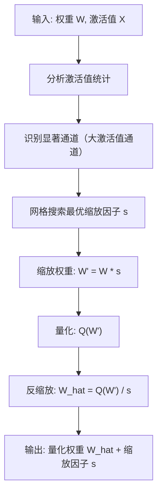
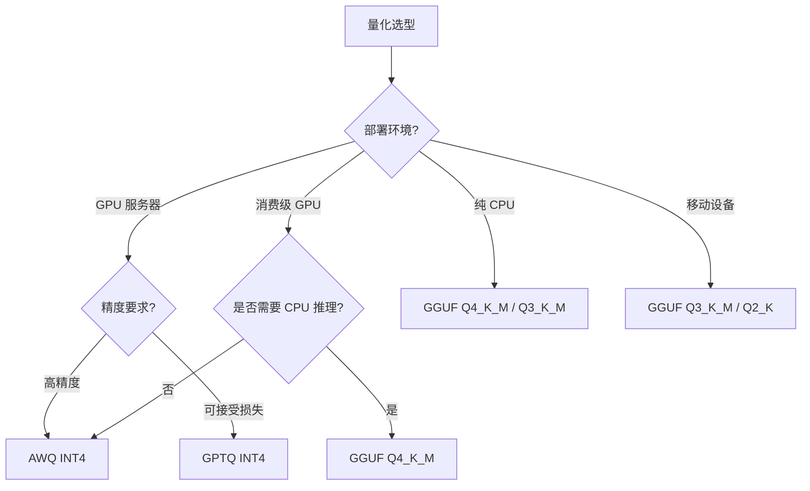

---
title: 模型量化技术：INT4/INT8、GPTQ 与 AWQ
description: 从量化原理到 GPTQ、AWQ 实操，全面掌握大模型量化压缩技术
date: 2026-05-30T10:00:00+08:00
lastmod: 2026-05-30T10:00:00+08:00
weight: 21
tags:
  - 大模型
  - 量化
  - GPTQ
  - AWQ
  - INT4
categories:
  - 模型部署与推理优化
  - 技术分享
math: true
mermaid: true
photos:
  - https://d-sketon.top/img/backwebp/bg2.webp
---

## 引言

大语言模型的参数量从数十亿到数千亿不等，一个 70B 参数的模型仅权重就需要约 140GB 的 FP16 存储空间。庞大的显存需求将大模型限制在了少数拥有顶级 GPU 集群的机构手中。模型量化技术通过将高精度浮点数映射到低精度整数，在不显著损失精度的前提下大幅压缩模型体积，是大模型走向普及的关键技术。

量化带来的收益是多方面的：显存占用减少 50%-75%，推理吞吐量提升 2-4 倍，能耗降低，部署门槛大幅下降。一个经过 INT4 量化的 70B 模型可以在单张 80GB 的 A100 上运行，而原始 FP16 版本则需要两张。

本文将从量化的数学原理出发，深入讲解 INT8/INT4 量化方案，重点剖析 GPTQ 和 AWQ 两大主流算法，并涵盖 GGUF 格式和完整的实操流程。

## 量化数学原理

### 什么是量化

量化本质上是将连续的浮点数值域映射到离散的整数数值域。对于从浮点 $x$ 到整数 $x_q$ 的量化过程，核心公式为：

$$
x_q = \text{round}\left(\frac{x}{s}\right) + z
$$

反量化（将整数恢复为浮点的近似值）：

$$
\hat{x} = s \cdot (x_q - z)
$$

其中：
- $s$ 是**缩放因子（Scale）**，控制浮点域到整数域的映射比例
- $z$ 是**零点（Zero Point）**，确保浮点的 0 能精确映射到某个整数值
- $\text{round}(\cdot)$ 是四舍五入函数

### 对称量化与非对称量化

根据量化范围是否以零为中心，分为对称量化和非对称量化两种模式。

**对称量化**：量化范围以 0 为中心，零点 $z = 0$。

$$
s = \frac{\max(|x|)}{2^{b-1} - 1}, \quad z = 0
$$

对于 INT8 对称量化，整数范围为 $[-127, 127]$。对称量化计算简单，适合近似对称分布的权重。

**非对称量化**：量化范围不对称，零点 $z \neq 0$。

$$
s = \frac{x_{\max} - x_{\min}}{2^b - 1}, \quad z = \text{round}\left(\frac{-x_{\min}}{s}\right)
$$

非对称量化适合分布不对称的数据，如经过 ReLU 激活后的值（全部为非负）。



### 量化误差分析

量化不可避免地引入误差。对于单个值，量化误差为：

$$
e = x - \hat{x} = x - s \cdot (x_q - z)
$$

量化误差的来源包括：
1. **截断误差**：round 函数引入的舍入误差，最大为 $s/2$
2. **截断溢出**：超出量化范围的值被截断（clamp）
3. **分布失配**：缩放因子选择不当导致大量值被压缩到很小的范围

降低量化误差的关键策略是选择合适的缩放因子，使量化范围尽可能覆盖数据的实际分布。

### 每通道量化 vs 每张量量化

根据缩放因子的粒度，量化可分为：

| 方式 | 缩放因子数量 | 精度 | 额外存储 | 适用场景 |
|------|------------|------|---------|---------|
| 每张量量化 | 1 个 | 最低 | 无 | 简单部署 |
| 每通道量化 | 每行/列 1 个 | 高 | 少量 | 大多数场景 |
| 每组量化 | 每 N 个元素 1 个 | 最高 | 较多 | 极低比特量化 |

大模型量化通常采用每通道（per-channel）或每分组（per-group）量化，以获得更好的精度。

## INT8 与 INT4 量化方案

### INT8 量化

INT8 量化将 FP16 权重压缩到 8 位整数，显存占用减半。由于现代 GPU（如 A100、H100）拥有高效的 INT8 Tensor Core，INT8 量化不仅能减少显存，还能获得实际的推理加速。

**仅权重量化（Weight-Only）**：只量化权重，激活值保持 FP16（W8A16 方案）。实现简单，精度损失小，但无法利用 INT8 算力加速。

**权重激活联合量化（W8A8）**：同时量化权重和激活值。需要处理激活值的动态范围问题（激活值分布随输入变化），通常需要校准数据来确定激活值的量化范围。

```python
# INT8 对称量化示例
import numpy as np

def quantize_int8_symmetric(tensor):
    """对称 INT8 量化"""
    max_val = np.max(np.abs(tensor))
    scale = max_val / 127.0
    quantized = np.round(tensor / scale).clip(-127, 127).astype(np.int8)
    return quantized, scale

def dequantize_int8(quantized, scale):
    """反量化"""
    return quantized.astype(np.float32) * scale

# 示例
weights = np.random.randn(128, 256).astype(np.float32)
q_weights, scale = quantize_int8_symmetric(weights)
reconstructed = dequantize_int8(q_weights, scale)

# 计算量化误差
error = np.mean((weights - reconstructed) ** 2)
print(f"原始大小: {weights.nbytes} bytes")
print(f"量化后大小: {q_weights.nbytes} bytes")
print(f"压缩比: {weights.nbytes / q_weights.nbytes:.1f}x")
print(f"均方误差: {error:.6f}")
```

### INT4 量化

INT4 量化将权重压缩到 4 位整数，显存占用仅为 FP16 的 1/4。然而，INT4 只有 16 个离散值（$[-8, 7]$），量化粒度极粗，需要更精细的算法来控制精度损失。

INT4 量化的核心挑战：
1. **表达力极低**：仅 16 个离散值，对于分布范围大的权重，精度损失严重
2. **离群值问题**：少数极端值会拉伸量化范围，压缩正常值的精度
3. **硬件支持有限**：并非所有 GPU 都有 INT4 算力支持

解决这些挑战的方案就是 GPTQ 和 AWQ 等高级量化算法。

```python
# INT4 对称量化示例
def quantize_int4_symmetric(tensor, group_size=128):
    """分组对称 INT4 量化"""
    original_shape = tensor.shape
    # 重塑为分组形式
    flat = tensor.reshape(-1, group_size)
    
    scales = np.max(np.abs(flat), axis=1, keepdims=True) / 7.0
    quantized = np.round(flat / scales).clip(-8, 7).astype(np.int8)
    
    return quantized.reshape(original_shape), scales

# INT4 每组量化
weights = np.random.randn(1024, 1024).astype(np.float32)
q_weights, scales = quantize_int4_symmetric(weights, group_size=128)

print(f"原始大小: {weights.nbytes} bytes (FP32)")
print(f"INT4 等效大小: {weights.size * 4 / 8} bytes")
print(f"压缩比: {weights.nbytes / (weights.size * 4 / 8):.1f}x")
```

### 激活值量化的挑战

权重是静态的，量化范围在部署前就能确定。但激活值随输入动态变化，且存在**离群值**问题——少数通道的激活值远大于其他通道，导致量化范围被拉大，正常通道的精度严重下降。



SmoothQuant 通过数学等价变换，将激活值的离群值"迁移"到权重上，使得激活值分布更均匀，从而实现高质量的 W8A8 量化：

$$
y = (x \cdot s) \cdot \left(\frac{W}{s}\right) = x', W'
$$

选择缩放因子 $s$ 使得 $x' = x \cdot s$ 的离群值被抑制，$W' = W / s$ 的分布仍然可控。

## GPTQ 量化

### 算法原理

GPTQ（Generalized Post-Training Quantization）是一种基于二阶信息的训练后权重量化方法。其核心思想是逐列量化权重矩阵，利用 Hessian 矩阵的信息来补偿量化误差。

GPTQ 要解决的优化问题是最小化量化前后的输出差异：

$$
\arg\min_{\hat{W}} \| XW - X\hat{W} \|_F^2
$$

其中 $X$ 是校准数据（calibration data）通过该层的输入，$W$ 是原始权重，$\hat{W}$ 是量化后的权重。

### Hessian 矩阵的作用

将目标函数展开，量化误差可以表示为：

$$
E = \| X(W - \hat{W}) \|_F^2 = \sum_i (W_{:,i} - \hat{W}_{:,i})^T H (W_{:,i} - \hat{W}_{:,i})
$$

其中 $H = X^T X$ 是 Hessian 矩阵（实际上是输入的 Gram 矩阵）。Hessian 矩阵编码了每个权重对输出的重要性——Hessian 对角线元素越大，说明该权重对输出影响越大，量化时越需要小心。

### 逐列量化与误差补偿

GPTQ 的量化过程：

1. 计算 Hessian 矩阵 $H = X^T X$
2. 对 $H$ 进行 Cholesky 分解，提高数值稳定性
3. 逐列量化权重：
   - 量化第 $i$ 列权重 $W_{:,i}$
   - 计算量化误差 $\delta_i = W_{:,i} - \hat{W}_{:,i}$
   - 将误差的"影响"补偿到尚未量化的列上：

$$
W_{:,j} \leftarrow W_{:,j} - \frac{\delta_i \cdot H_{i,j}}{H_{i,i}}, \quad j > i
$$

这一步是 GPTQ 的精髓——通过更新未量化的权重来补偿当前列的量化误差，使得总体输出误差最小化。



### GPTQ 的特点

| 特性 | 说明 |
|------|------|
| 量化方案 | W4A16（仅权重量化，激活保持 FP16） |
| 最低位宽 | INT4，甚至 INT3 |
| 校准数据需求 | 约 128 条样本 |
| 量化速度 | 较快（70B 模型约 4 小时） |
| 精度保持 | INT4 下良好 |
| 硬件要求 | GPU（量化过程） |
| 主要工具 | AutoGPTQ |

### AutoGPTQ 实操

AutoGPTQ 是 GPTQ 量化的主流工具库，支持自动化的量化流程：

```bash
# 安装 AutoGPTQ
pip install auto-gptq
# 如需 CUDA 加速
pip install auto-gptq --extra-index-url https://huggingface.github.io/autogptq-index/whl/cu121/
```

**量化脚本**：

```python
from auto_gptq import AutoGPTQForCausalLM, BaseQuantizeConfig
from transformers import AutoTokenizer

# 1. 配置量化参数
quantize_config = BaseQuantizeConfig(
    bits=4,                # 量化位宽: 4
    group_size=128,        # 分组大小: 每 128 个权重共享一个缩放因子
    desc_act=False,        # 是否按激活值降序排列列（True 精度更高但更慢）
    sym=True,              # 对称量化
)

model_id = "meta-llama/Meta-Llama-3.1-8B-Instruct"
tokenizer = AutoTokenizer.from_pretrained(model_id)

# 2. 准备校准数据
# 使用通用文本作为校准数据
calibration_texts = [
    "人工智能是计算机科学的一个分支，它致力于研究、开发用于模拟、延伸和扩展人的智能的理论、方法、技术及应用系统。",
    "机器学习是人工智能的核心，是使计算机具有智能的根本途径。",
    "深度学习是机器学习中一种基于对数据进行表征学习的方法。",
    "自然语言处理是人工智能和语言学领域的分支学科，探讨如何处理和运用自然语言。",
    # ... 需要约 128-1024 条多样化的文本
]

# 转换为模型输入格式
def encode_texts(texts, tokenizer, max_length=2048):
    examples = []
    for text in texts:
        tokenized = tokenizer(
            text,
            return_tensors="pt",
            max_length=max_length,
            truncation=True,
            padding=False,
        )
        examples.append({"input_ids": tokenized["input_ids"]})
    return examples

calibration_data = encode_texts(calibration_texts, tokenizer)

# 3. 加载模型并量化
model = AutoGPTQForCausalLM.from_pretrained(
    model_id,
    quantize_config,
    trust_remote_code=True,
)

model.quantify(calibration_data, batch_size=4)

# 4. 保存量化模型
output_dir = "./models/llama-3.1-8b-gptq-int4"
model.save_quantized(output_dir, use_safetensors=True)
tokenizer.save_pretrained(output_dir)

print(f"量化模型已保存到 {output_dir}")
```

**加载和使用量化模型**：

```python
from auto_gptq import AutoGPTQForCausalLM
from transformers import AutoTokenizer

# 加载量化模型
model = AutoGPTQForCausalLM.from_quantized(
    "./models/llama-3.1-8b-gptq-int4",
    device="cuda:0",
    use_safetensors=True,
    trust_remote_code=True,
)
tokenizer = AutoTokenizer.from_pretrained("./models/llama-3.1-8b-gptq-int4")

# 推理
inputs = tokenizer("解释什么是大模型量化", return_tensors="pt").to("cuda:0")
outputs = model.generate(**inputs, max_new_tokens=256)
print(tokenizer.decode(outputs[0], skip_special_tokens=True))
```

**使用 vLLM 加载 GPTQ 模型**：

```bash
# vLLM 直接加载 GPTQ 量化模型
python -m vllm.entrypoints.openai.api_server \
    --model ./models/llama-3.1-8b-gptq-int4 \
    --quantization gptq \
    --port 8000
```

## AWQ 量化

### 算法原理

AWQ（Activation-aware Weight Quantization）是一种激活感知的权重量化方法。其核心洞察是：**并非所有权重都同等重要，与显著激活值（大激活值）对应的权重对量化误差更敏感。**

AWQ 不依赖反向传播或梯度计算，而是通过分析激活值的统计特性来识别"重要"权重，并引入每通道缩放因子来保护这些权重。

### 通道缩放策略

AWQ 的核心操作是对每通道引入一个缩放因子 $s$：

$$
W' = W \cdot s, \quad \hat{W} = \text{Quantize}(W') / s
$$

通过将重要通道的权重放大（$s > 1$），再量化后再缩小，可以减少这些通道的相对量化误差。直觉是：量化误差与值的绝对大小成正比，放大后的权重在量化后相对误差更小。

选择缩放因子 $s$ 的目标是使量化前后的输出差异最小：

$$
s^* = \arg\min_s \| (XW) - (X \cdot (Q(W \cdot s) / s)) \|_F^2
$$

AWQ 通过网格搜索（grid search）在候选缩放因子中选择最优值，候选值基于激活值的统计分布生成：

$$
s_j = \left(\frac{\max(|X_j|)^\alpha}{\max(|W_j|)}\right)^{1/2}
$$

其中 $\alpha \in [0, 1]$ 是搜索参数，$j$ 是通道索引。



### AWQ vs GPTQ 对比

| 特性 | GPTQ | AWQ |
|------|------|-----|
| 核心思想 | 二阶误差补偿 | 激活感知通道缩放 |
| 量化方案 | W4A16 | W4A16 |
| 是否需要反向传播 | 否 | 否 |
| 校准数据需求 | 128+ 条 | 128+ 条 |
| 量化速度 | 中等 | 快 |
| INT4 精度 | 良好 | 优秀 |
| 泛化能力 | 好 | 优秀 |
| 量化一致性 | 可能不一致 | 一致性好 |
| 推理速度 | 依赖实现 | 依赖实现 |

AWQ 在 INT4 量化下通常比 GPTQ 精度更高，且量化结果的一致性更好（不同批次的量化结果稳定）。此外，AWQ 的量化速度通常比 GPTQ 更快，因为它不需要逐列的误差补偿计算。

### AutoAWQ 实操

```bash
# 安装 AutoAWQ
pip install autoawq
```

**量化脚本**：

```python
from awq import AutoAWQForCausalLM
from transformers import AutoTokenizer

model_id = "meta-llama/Meta-Llama-3.1-8B-Instruct"
output_dir = "./models/llama-3.1-8b-awq-int4"

# 1. 加载模型和 tokenizer
model = AutoAWQForCausalLM.from_pretrained(
    model_id,
    device_map="auto",
    trust_remote_code=True,
)
tokenizer = AutoTokenizer.from_pretrained(model_id, trust_remote_code=True)

# 2. 配置量化参数
quant_config = {
    "zero_point": True,       # 使用零点（非对称量化）
    "q_group_size": 128,      # 分组大小
    "w_bit": 4,               # 权重量化位宽
    "version": "GEMM",        # 量化版本: GEMM 或 GEMV
}

# 3. 准备校准数据
# AWQ 自带了一些常用数据集的校准数据
from awq.utils.calib_data import get_calib_dataset

calib_data = get_calib_dataset(
    "pileval",               # 校准数据集
    tokenizer=tokenizer,
    n_samples=128,           # 校准样本数
    block_size=512,          # 每个样本的 token 数
)

# 也可以使用自定义数据
# custom_texts = ["你的自定义校准文本..."]
# calib_data = [tokenizer(text, return_tensors="pt") for text in custom_texts]

# 4. 执行量化
model.quantize(
    tokenizer,
    quant_config=quant_config,
    calib_data=calib_data,
)

# 5. 保存量化模型
model.save_quantized(output_dir)
tokenizer.save_pretrained(output_dir)

print(f"AWQ 量化模型已保存到 {output_dir}")
print(f"量化配置: {quant_config}")
```

**加载和使用 AWQ 量化模型**：

```python
from awq import AutoAWQForCausalLM
from transformers import AutoTokenizer

# 加载 AWQ 量化模型
model = AutoAWQForCausalLM.from_quantized(
    "./models/llama-3.1-8b-awq-int4",
    device_map="auto",
    fuse_layers=True,  # 融合算子加速推理
)
tokenizer = AutoTokenizer.from_pretrained("./models/llama-3.1-8b-awq-int4")

# 推理
messages = [{"role": "user", "content": "解释 AWQ 量化的原理"}]
text = tokenizer.apply_chat_template(messages, tokenize=False, add_generation_prompt=True)
inputs = tokenizer(text, return_tensors="pt").to("cuda:0")

outputs = model.generate(**inputs, max_new_tokens=256, do_sample=True, temperature=0.7)
print(tokenizer.decode(outputs[0], skip_special_tokens=True))
```

**使用 vLLM 加载 AWQ 模型**：

```bash
python -m vllm.entrypoints.openai.api_server \
    --model ./models/llama-3.1-8b-awq-int4 \
    --quantization awq \
    --port 8000
```

## GGUF 格式

### GGUF 与 llama.cpp 生态

GGUF（GPT-Generated Unified Format）是 llama.cpp 生态使用的模型格式，其前身是 GGML 格式。GGUF 的最大特点是支持在 CPU 上运行量化模型，并支持 GPU/CPU 混合推理，非常适合消费级硬件和边缘设备。

GGUF 的关键优势：
- **跨平台**：支持 Windows、Linux、macOS（包括 Apple Silicon）
- **零依赖**：llama.cpp 是纯 C/C++ 实现，无 Python 依赖
- **灵活的量化级别**：从 Q2 到 Q8 多种选择
- **混合推理**：支持将部分层卸载到 GPU，其余在 CPU 计算

### GGUF 量化级别

| 量化级别 | 位宽 | 相对大小 | 质量评估 | 推荐场景 |
|---------|------|---------|---------|---------|
| Q8_0 | 8-bit | ~53% | 几乎无损 | 高质量推理 |
| Q6_K | 6-bit | ~40% | 高质量 | 质量优先 |
| Q5_K_M | 5-bit | ~34% | 优秀 | 质量与体积平衡 |
| Q5_1 | 5-bit | ~35% | 良好 | 通用 |
| Q4_K_M | 4-bit | ~28% | 良好 | **最常用** |
| Q4_0 | 4-bit | ~27% | 可接受 | 速度优先 |
| Q3_K_M | 3-bit | ~21% | 有损失 | 显存紧张 |
| Q2_K | 2-bit | ~16% | 损失较大 | 极限压缩 |

GGUF 采用**块量化（Block Quantization）**策略，将权重分成小块（如 32 个元素一组），每块保存自己的缩放因子和可选的零点，从而更好地适应权重的局部分布差异。

### GGUF 量化实操

```bash
# 1. 克隆 llama.cpp
git clone https://github.com/ggerganov/llama.cpp
cd llama.cpp

# 2. 将 HuggingFace 模型转换为 GGUF 格式
python convert_hf_to_gguf.py \
    ./models/llama-3.1-8b-hf \
    --outfile ./models/llama-3.1-8b.gguf \
    --outtype f16  # 先转换为 FP16 的 GGUF

# 3. 量化为不同级别
./llama-quantize \
    ./models/llama-3.1-8b.gguf \
    ./models/llama-3.1-8b-Q4_K_M.gguf \
    Q4_K_M

./llama-quantize \
    ./models/llama-3.1-8b.gguf \
    ./models/llama-3.1-8b-Q5_K_M.gguf \
    Q5_K_M

./llama-quantize \
    ./models/llama-3.1-8b.gguf \
    ./models/llama-3.1-8b-Q8_0.gguf \
    Q8_0

# 4. 查看量化后文件大小
ls -lh ./models/llama-3.1-8b-Q*.gguf
```

**使用 Ollama 导入 GGUF**：

```dockerfile
# 创建 Modelfile
FROM ./models/llama-3.1-8b-Q4_K_M.gguf

TEMPLATE """{{ if .System }}<|im_start|>system
{{ .System }}<|im_end|>
{{ end }}<|im_start|>user
{{ .Prompt }}<|im_end|>
<|im_start|>assistant
"""

PARAMETER stop "<|im_end|>"
PARAMETER stop "<|endoftext|>"
PARAMETER num_ctx 8192
```

```bash
ollama create my-llama -f Modelfile
ollama run my-llama
```

## 量化效果全面对比

### 精度对比

在多个基准测试上（MMLU、HumanEval、GSM8K 等），不同量化方法的表现：

| 量化方法 | 位宽 | MMLU | HumanEval | GSM8K | 平均保持率 |
|---------|------|------|-----------|-------|----------|
| FP16（基准） | 16 | 73.0 | 72.5 | 82.0 | 100% |
| INT8 对称 | 8 | 72.8 | 72.0 | 81.5 | 99.5% |
| GPTQ | 4 | 70.5 | 68.0 | 77.0 | 95.5% |
| AWQ | 4 | 71.2 | 70.0 | 78.5 | 96.5% |
| GGUF Q8_0 | 8 | 72.9 | 72.0 | 81.8 | 99.6% |
| GGUF Q4_K_M | 4 | 70.0 | 67.5 | 75.5 | 94.8% |
| GGUF Q3_K_M | 3 | 66.5 | 62.0 | 70.0 | 89.5% |
| GPTQ | 3 | 65.0 | 60.0 | 67.5 | 87.0% |

### 显存占用对比

以 Llama-3.1-8B 为例：

| 量化方法 | 模型大小 | 显存占用 | 可运行硬件 |
|---------|---------|---------|----------|
| FP16 | 16.0 GB | ~18 GB | A100 40GB+ |
| INT8 | 8.0 GB | ~10 GB | RTX 3090/4090 |
| GPTQ INT4 | 4.5 GB | ~6.5 GB | RTX 3060 12GB+ |
| AWQ INT4 | 4.5 GB | ~6.5 GB | RTX 3060 12GB+ |
| GGUF Q4_K_M | 4.4 GB | ~6 GB | RTX 3060 / CPU 16GB |
| GGUF Q3_K_M | 3.3 GB | ~5 GB | RTX 2060 / CPU 8GB |

### 推理速度对比

| 量化方法 | 生成速度 (tokens/s) | 相对加速比 |
|---------|--------------------|----------| 
| FP16（基准） | 45 | 1.0x |
| INT8 W8A8 | 72 | 1.6x |
| GPTQ INT4 | 65 | 1.4x |
| AWQ INT4 | 68 | 1.5x |
| GGUF Q4_K_M (GPU) | 55 | 1.2x |
| GGUF Q4_K_M (CPU) | 12 | 0.27x |

> 注：推理速度受多种因素影响（GPU 型号、推理框架、batch size 等），上表为单卡 A100 上的参考数据。

## 选型决策矩阵



| 使用场景 | 推荐方案 | 理由 |
|---------|---------|------|
| 生产 GPU 服务 | AWQ INT4 + vLLM | 精度最佳，推理框架支持好 |
| 追求极致推理速度 | INT8 W8A8 + TensorRT-LLM | 可利用 INT8 Tensor Core |
| 消费级 GPU 本地使用 | GGUF Q4_K_M + llama.cpp/Ollama | 灵活的 GPU/CPU 混合推理 |
| CPU 推理 | GGUF Q4_K_M / Q3_K_M | llama.cpp 的 CPU 优化最好 |
| 边缘/移动设备 | GGUF Q3_K_M / Q2_K | 体积最小，资源占用低 |
| 需要最高精度 | INT8 或 GGUF Q8_0 | 几乎无损 |
| 快速实验 | BitsAndBytes INT4 | 一行代码加载，无需校准 |

## 高级量化技巧

### 量化感知训练（QAT）

训练后量化（PTQ）在极低比特（INT2/INT3）下精度损失明显。量化感知训练（QAT）在训练过程中模拟量化效果，让模型适应量化误差：

```python
# 伪代码：QAT 训练流程
import torch
import torch.nn as nn

class QuantAwareLinear(nn.Module):
    def __init__(self, in_features, out_features, bits=4):
        super().__init__()
        self.weight = nn.Parameter(torch.randn(out_features, in_features))
        self.bits = bits
        # 可学习的缩放因子
        self.weight_scale = nn.Parameter(torch.ones(out_features))

    def forward(self, x):
        # 训练时模拟量化（伪量化）
        if self.training:
            scale = self.weight_scale.abs().view(-1, 1)
            # 前向传播使用量化-反量化后的权重
            w_q = self._fake_quantize(self.weight, scale)
        else:
            # 推理时使用真实量化
            w_q = self._real_quantize(self.weight, scale)
        return x @ w_q.t()

    def _fake_quantize(self, w, scale):
        qmax = 2 ** (self.bits - 1) - 1
        w_scaled = w / scale
        w_clipped = w_scaled.clamp(-qmax, qmax)
        w_rounded = w_clipped.round()
        return w_rounded * scale  # 反量化回浮点
```

### 混合精度量化

并非所有层对量化都同样敏感。注意力层和 MLP 层的最后一层投影通常更敏感。混合精度策略对不同层使用不同的量化精度：

```python
# 混合精度量化配置示例
mixed_precision_config = {
    "model.layers.0.self_attn.q_proj": {"bits": 8},  # 敏感层用 INT8
    "model.layers.0.self_attn.k_proj": {"bits": 8},
    "model.layers.0.self_attn.v_proj": {"bits": 8},
    "model.layers.0.self_attn.o_proj": {"bits": 8},
    "model.layers.0.mlp.gate_proj": {"bits": 4},     # 非敏感层用 INT4
    "model.layers.0.mlp.down_proj": {"bits": 4},
    "model.layers.0.mlp.up_proj": {"bits": 4},
    # ... 其他层类似
}
```

### KV Cache 量化

除了权重量化，KV Cache 的量化也能显著减少推理时的显存占用：

```python
# vLLM 中启用 KV Cache 量化
from vllm import LLM

llm = LLM(
    model="meta-llama/Meta-Llama-3.1-8B-Instruct",
    quantization="awq",
    kv_cache_dtype="int8",  # 或 "fp8"
    gpu_memory_utilization=0.9,
)
```

KV Cache INT8 量化几乎无损，可将 KV Cache 显存占用减半，显著提升长上下文场景的并发能力。

## 结语

模型量化是大模型落地不可或缺的技术。从数学原理上理解量化的本质——浮点到整数的映射及其误差控制——是掌握各种量化方法的基础。

回顾本文的核心内容：INT8 量化成熟稳定，是精度优先场景的首选；GPTQ 利用 Hessian 矩阵的二阶信息进行误差补偿，在 INT4 下取得了良好的精度；AWQ 通过激活感知的通道缩放，在 INT4 下实现了更优的精度和更好的泛化；GGUF 格式凭借灵活的量化级别和跨平台能力，成为消费级硬件部署的标准选择。

在实际项目中，量化的选择不是非此即彼的。理解每种方法的原理、优势和局限，根据模型规模、硬件条件、精度要求和部署场景综合决策，才能获得最佳的工程效果。随着 FP8 量化、更先进的 QAT 技术以及专用硬件（如 NPU、TPU）的发展，量化的精度和效率将持续提升，让大模型在更多场景中发挥价值。

---

**参考文献**：

1. Frantar E, et al. GPTQ: Accurate Post-Training Quantization for Generative Pre-trained Transformers. ICLR 2023.
2. Lin J, et al. AWQ: Activation-aware Weight Quantization for LLM Compression and Acceleration. MLSys 2024.
3. Xiao G, et al. SmoothQuant: Accurate and Efficient Post-Training Quantization for Large Language Models. ICML 2023.
4. Dettmers T, et al. LLM.int8(): 8-bit Matrix Multiplication for Transformers at Scale. NeurIPS 2022.
5. Gerganov G. llama.cpp: Port of Facebook's LLaMA model in C/C++. https://github.com/ggerganov/llama.cpp
6. AutoGPTQ Documentation. https://github.com/PanQiWei/AutoGPTQ
7. AutoAWQ Documentation. https://github.com/casper-hansen/AutoAWQ
8. Jacob B, et al. Quantization and Training of Neural Networks for Efficient Integer-Arithmetic-Only Inference. CVPR 2018.
