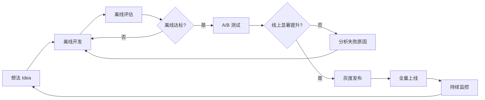
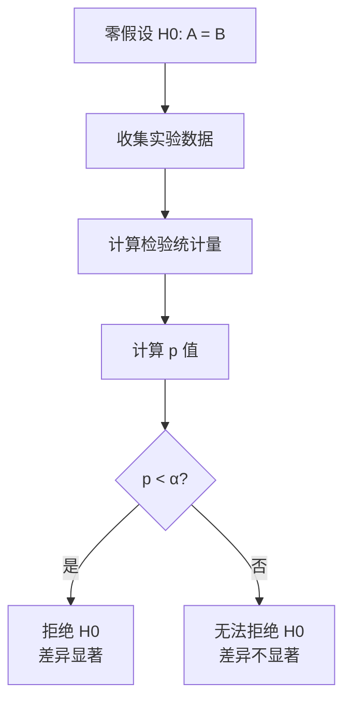
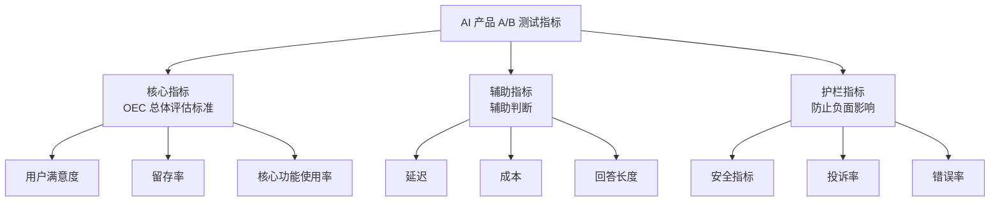
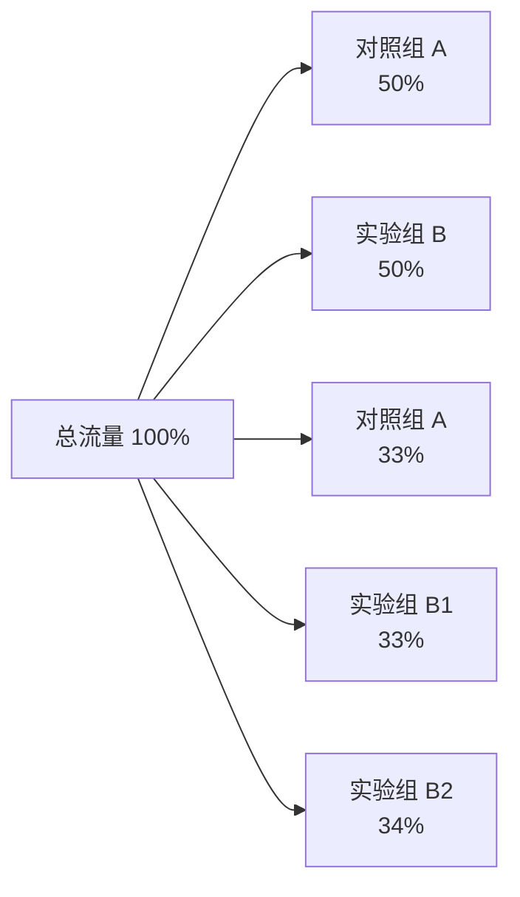
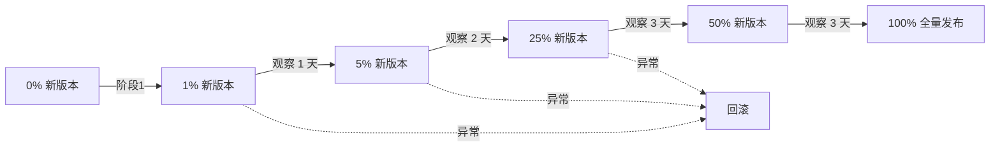
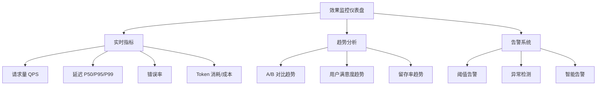
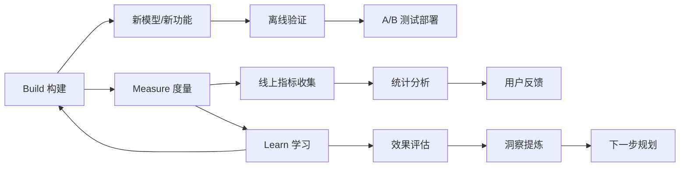

---
title: A/B 测试与持续迭代流程
description: 在线实验设计、效果监控、灰度发布——AI 产品的数据驱动迭代方法论
date: 2026-06-10T10:00:00+08:00
lastmod: 2026-06-10T10:00:00+08:00
weight: 26
tags:
  - 大模型
  - AB测试
  - 效果监控
  - 迭代流程
categories:
  - 数据与评估
  - 技术分享
math: true
mermaid: true
photos:
  - https://d-sketon.top/img/backwebp/bg3.webp
---

## 引言

在 AI 产品开发中，一个永恒的难题是：**我们怎么知道新版本真的更好了？** 离线评估指标（如准确率、ROUGE 分数）的提升，并不总是能转化为线上用户体验的改善。一个在 MMLU 上得分更高的模型，可能因为回答过于冗长而让用户感到厌烦；一个在基准测试上表现平平的模型，可能因为回答更贴近用户直觉而获得更高的满意度。

这就是 A/B 测试存在的意义——它是在真实用户环境中验证改进效果的金标准。Google、Meta、字节跳动等科技巨头每天同时运行数千个 A/B 测试，每一个产品决策背后都有数据支撑。



对于 AI 产品而言，A/B 测试面临着独特的挑战：模型输出具有非确定性、用户体验高度主观、效果可能随时间衰减。本文将从统计学基础出发，系统讲解 AI 产品 A/B 测试的设计、执行和分析方法。

## A/B 测试统计学基础

### 假设检验

A/B 测试的统计学核心是**假设检验（Hypothesis Testing）**。其逻辑是：

1. **建立零假设（$H_0$）**：新版本（B）与旧版本（A）没有差异
2. **建立备择假设（$H_1$）**：新版本与旧版本有差异
3. **收集数据**，计算在 $H_0$ 成立的前提下，观察到当前差异（或更大差异）的概率
4. **如果概率很低**（低于显著性水平 $\alpha$），则拒绝 $H_0$，认为差异是真实的



### p 值

p 值（p-value）是在零假设成立的前提下，观察到当前结果或更极端结果的概率。p 值越小，越有理由认为差异不是随机波动造成的。

> **常见误解**：p 值不是"零假设为真的概率"。正确的理解是：**如果零假设为真，出现当前观测结果的概率**。

```python
import numpy as np
from scipy import stats


def two_proportion_z_test(success_a, size_a, success_b, size_b, alpha=0.05):
    """
    双比例 Z 检验：比较两个组 conversion rate 是否显著不同
    
    Args:
        success_a: A 组成功数
        size_a: A 组总数
        success_b: B 组成功数
        size_b: B 组总数
        alpha: 显著性水平
    """
    p_a = success_a / size_a
    p_b = success_b / size_b
    
    # 合并比例（零假设下两组来自同一分布）
    p_pool = (success_a + success_b) / (size_a + size_b)
    
    # 标准误
    se = np.sqrt(p_pool * (1 - p_pool) * (1/size_a + 1/size_b))
    
    if se == 0:
        return 0.0, 1.0
    
    # Z 统计量
    z = (p_b - p_a) / se
    
    # 双侧 p 值
    p_value = 2 * (1 - stats.norm.cdf(abs(z)))
    
    # 结果解读
    print(f"A 组: {success_a}/{size_a} = {p_a:.4f}")
    print(f"B 组: {success_b}/{size_b} = {p_b:.4f}")
    print(f"绝对提升: {p_b - p_a:+.4f} ({(p_b - p_a)/p_a*100:+.1f}%)")
    print(f"Z 统计量: {z:.4f}")
    print(f"p 值: {p_value:.6f}")
    
    if p_value < alpha:
        direction = "提升" if p_b > p_a else "下降"
        print(f"结论: B 组显著{direction} (p < {alpha})")
    else:
        print(f"结论: 无显著差异 (p >= {alpha})")
    
    return z, p_value


# 示例：A 组 10000 用户中 1500 点击，B 组 10000 用户中 1650 点击
two_proportion_z_test(1500, 10000, 1650, 10000)
```

### 第一类与第二类错误

假设检验中存在两类错误：

|  | $H_0$ 为真 | $H_1$ 为真 |
|------|------|------|
| **不拒绝 $H_0$** | 正确决策 ($1-\alpha$) | **第二类错误 ($\beta$)** |
| **拒绝 $H_0$** | **第一类错误 ($\alpha$)** | 正确决策 ($1-\beta$，即功效) |

- **第一类错误（$\alpha$，假阳性）**：差异其实不存在，但实验结论认为存在。相当于"误报"。通常设 $\alpha = 0.05$。
- **第二类错误（$\beta$，假阴性）**：差异其实存在，但实验未能检测到。相当于"漏报"。通常设 $\beta = 0.20$，对应功效 $1-\beta = 0.80$。

```python
import matplotlib.pyplot as plt


def visualize_errors():
    """可视化第一类和第二类错误"""
    fig, ax = plt.subplots(figsize=(10, 5))
    
    x = np.linspace(-4, 8, 500)
    
    # H0 分布（无差异）
    h0 = stats.norm.pdf(x, loc=0, scale=1)
    # H1 分布（有差异，均值为 3）
    h1 = stats.norm.pdf(x, loc=3, scale=1)
    
    ax.plot(x, h0, label="H0 分布（无差异）", color="blue")
    ax.plot(x, h1, label="H1 分布（有差异）", color="red")
    
    # 临界值（α=0.05, 单侧）
    critical = stats.norm.ppf(0.95)
    
    # 第一类错误区域
    x_alpha = x[x > critical]
    ax.fill_between(x_alpha, stats.norm.pdf(x_alpha, 0, 1),
                    alpha=0.3, color="blue", label=f"α（第一类错误）= 0.05")
    
    # 第二类错误区域
    x_beta = x[(x < critical)]
    mask = x_beta
    ax.fill_between(mask, stats.norm.pdf(mask, 3, 1),
                    alpha=0.3, color="red", label=f"β（第二类错误）≈ 0.09")
    
    ax.axvline(critical, color="black", linestyle="--", label=f"临界值 = {critical:.2f}")
    ax.set_xlabel("检验统计量")
    ax.set_ylabel("概率密度")
    ax.set_title("假设检验中的两类错误")
    ax.legend()
    plt.tight_layout()
    plt.savefig("hypothesis_errors.png", dpi=150)
    plt.show()


visualize_errors()
```

### 功效分析与样本量计算

实验功效（Power）是正确检测到真实差异的概率（$1 - \beta$）。功效越高，实验越可靠。但高功效需要更大的样本量。

对于比较两个比例（如转化率）的 A/B 测试，所需样本量的计算公式为：

$$
n = \frac{(z_{\alpha/2} + z_{\beta})^2 \cdot [p_1(1-p_1) + p_2(1-p_2)]}{(p_2 - p_1)^2}
$$

其中 $p_1$ 是基线转化率，$p_2$ 是期望的改进后转化率。

```python
from scipy.stats import norm
import math


def calculate_sample_size(baseline_rate, min_detectable_effect,
                           alpha=0.05, power=0.80, two_sided=True):
    """
    计算 A/B 测试所需样本量
    
    Args:
        baseline_rate: 基线转化率（A 组）
        min_detectable_effect: 最小可检测效应（绝对值或相对值）
        alpha: 显著性水平
        power: 统计功效
        two_sided: 是否双侧检验
    
    Returns:
        每组所需样本量
    """
    p1 = baseline_rate
    p2 = baseline_rate + min_detectable_effect
    
    if p2 <= 0 or p2 >= 1:
        raise ValueError("目标转化率必须在 (0, 1) 范围内")
    
    if two_sided:
        z_alpha = norm.ppf(1 - alpha / 2)
    else:
        z_alpha = norm.ppf(1 - alpha)
    z_beta = norm.ppf(power)
    
    # 样本量公式
    numerator = (z_alpha + z_beta) ** 2 * (p1 * (1 - p1) + p2 * (1 - p2))
    denominator = (p2 - p1) ** 2
    
    n = math.ceil(numerator / denominator)
    
    print("=" * 50)
    print("A/B 测试样本量计算")
    print("=" * 50)
    print(f"基线转化率:        {p1:.4f} ({p1:.1%})")
    print(f"目标转化率:        {p2:.4f} ({p2:.1%})")
    print(f"最小可检测效应:    {min_detectable_effect:.4f} ({min_detectable_effect/p1*100:.1f}% 相对提升)")
    print(f"显著性水平 (α):    {alpha}")
    print(f"统计功效 (1-β):    {power}")
    print(f"检验类型:          {'双侧' if two_sided else '单侧'}")
    print(f"{'='*50}")
    print(f"每组所需样本量:    {n:,}")
    print(f"总样本量:          {n * 2:,}")
    
    return n


# 示例计算
n = calculate_sample_size(
    baseline_rate=0.15,         # 当前转化率 15%
    min_detectable_effect=0.02, # 想检测到至少 2% 的绝对提升
    alpha=0.05,
    power=0.80,
)
```

```
输出示例:
==================================================
A/B 测试样本量计算
==================================================
基线转化率:        0.1500 (15.0%)
目标转化率:        0.1700 (17.0%)
最小可检测效应:    0.0200 (13.3% 相对提升)
显著性水平 (α):    0.05
统计功效 (1-β):    0.80
检验类型:          双侧
==================================================
每组所需样本量:    6,032
总样本量:          12,064
```

> **关键洞察**：最小可检测效应（MDE）越小，所需样本量越大（且呈平方关系）。想检测 1% 的提升需要的样本量是检测 2% 的 4 倍。因此，合理设置 MDE 至关重要——既不能太大（漏掉有价值的改进），也不能太小（实验成本过高）。

### 连续指标的样本量计算

当评估指标是连续变量（如平均回答时长、用户评分）而非比例时，样本量计算有所不同：

```python
def sample_size_continuous(baseline_mean, baseline_std, min_detectable_delta,
                            alpha=0.05, power=0.80):
    """
    连续指标的样本量计算
    
    Args:
        baseline_mean: 基线均值
        baseline_std: 基线标准差
        min_detectable_delta: 最小可检测差异（绝对值）
    """
    z_alpha = norm.ppf(1 - alpha / 2)
    z_beta = norm.ppf(power)
    
    n = 2 * ((z_alpha + z_beta) * baseline_std / min_detectable_delta) ** 2
    n = math.ceil(n)
    
    print(f"基线均值:          {baseline_mean:.2f}")
    print(f"基线标准差:        {baseline_std:.2f}")
    print(f"最小可检测差异:    {min_detectable_delta:.2f}")
    print(f"每组所需样本量:    {n:,}")
    return n


# 示例：评估平均回答满意度评分（1-5 分）
# 当前平均 3.8 分，标准差 0.9，希望检测到 0.1 分的提升
sample_size_continuous(3.8, 0.9, 0.1)
```

## AI 产品 A/B 测试设计

### 指标体系

AI 产品的 A/B 测试需要设计多维度的指标体系，避免"只看一个数字"的片面判断。



| 指标类型 | 示例指标 | 作用 |
|----------|----------|------|
| 核心指标（OEC） | 用户满意度、7 日留存率、任务完成率 | 决定实验成败 |
| 辅助指标 | 响应延迟、Token 成本、回答长度 | 帮助理解结果 |
| 护栏指标 | 安全拒绝率、投诉率、幻觉率 | 确保不损害体验 |

```python
from dataclasses import dataclass, field
from typing import List


@dataclass
class ExperimentMetrics:
    """实验指标配置"""
    
    @dataclass
    class Metric:
        name: str
        metric_type: str       # "primary", "secondary", "guardrail"
        direction: str         # "increase" or "decrease"
        threshold: float = None  # 护栏指标的阈值
    
    @staticmethod
    def default_ai_metrics():
        """AI 产品默认指标集"""
        return [
            ExperimentMetrics.Metric(
                name="user_satisfaction",
                metric_type="primary",
                direction="increase",
            ),
            ExperimentMetrics.Metric(
                name="task_completion_rate",
                metric_type="primary",
                direction="increase",
            ),
            ExperimentMetrics.Metric(
                name="day7_retention",
                metric_type="primary",
                direction="increase",
            ),
            ExperimentMetrics.Metric(
                name="avg_response_latency_ms",
                metric_type="secondary",
                direction="decrease",
            ),
            ExperimentMetrics.Metric(
                name="avg_token_cost",
                metric_type="secondary",
                direction="decrease",
            ),
            ExperimentMetrics.Metric(
                name="hallucination_rate",
                metric_type="guardrail",
                direction="decrease",
                threshold=0.05,
            ),
            ExperimentMetrics.Metric(
                name="safety_rejection_rate",
                metric_type="guardrail",
                direction="decrease",
                threshold=0.10,
            ),
        ]
```

### 流量分配

A/B 测试需要将用户随机分配到不同实验组。分配策略需要考虑公平性（各组用户特征均衡）和一致性（同一用户始终在同一组）。



```python
import hashlib


class TrafficSplitter:
    """流量分配器"""
    
    def __init__(self, experiment_id, variants):
        """
        Args:
            experiment_id: 实验唯一 ID
            variants: 变体配置 {"A": 0.5, "B": 0.5}
        """
        self.experiment_id = experiment_id
        self.variants = variants
        # 累积分布
        self._cumulative = []
        cumulative = 0
        for name, ratio in variants.items():
            cumulative += ratio
            self._cumulative.append((name, cumulative))
    
    def assign(self, user_id):
        """
        为用户分配实验组
        使用哈希确保：同一用户始终分到同一组
        """
        # 使用实验 ID + 用户 ID 的哈希
        hash_input = f"{self.experiment_id}:{user_id}"
        hash_value = hashlib.md5(hash_input.encode()).hexdigest()
        # 取前 8 位作为 0-1 之间的均匀分布
        bucket = int(hash_value[:8], 16) / 0xFFFFFFFF
        
        # 找到对应的变体
        for name, threshold in self._cumulative:
            if bucket < threshold:
                return name
        
        return self._cumulative[-1][0]  # 兜底
    
    def verify_balance(self, user_ids):
        """验证流量分配的均衡性"""
        from collections import Counter
        assignments = [self.assign(uid) for uid in user_ids]
        counts = Counter(assignments)
        
        total = len(user_ids)
        print(f"流量分配验证 (共 {total} 用户):")
        for variant, count in sorted(counts.items()):
            expected = self.variants[variant]
            actual = count / total
            deviation = abs(actual - expected) / expected * 100
            status = "✓" if deviation < 5 else "✗"
            print(f"  {variant}: {count} ({actual:.2%}, 期望 {expected:.2%}, 偏差 {deviation:.1f}%) {status}")
        
        return counts


# 使用示例
splitter = TrafficSplitter("exp_001", {"control": 0.5, "treatment": 0.5})

# 模拟 10000 个用户
import random
user_ids = [f"user_{i}" for i in range(10000)]
splitter.verify_balance(user_ids)
```

### 实验周期

实验周期的确定需要考虑两个因素：**统计显著性所需的样本量**和**周期效应**（如工作日与周末的行为差异）。

```python
def calculate_experiment_duration(required_sample_size, daily_traffic, 
                                   traffic_allocation=1.0, min_days=7):
    """
    计算实验所需周期
    
    Args:
        required_sample_size: 每组所需样本量
        daily_traffic: 每日总流量
        traffic_allocation: 分配给实验的流量比例
        min_days: 最少实验天数（至少覆盖一个完整周期）
    """
    daily_per_group = daily_traffic * traffic_allocation / 2
    required_days = math.ceil(required_sample_size / daily_per_group)
    required_days = max(required_days, min_days)
    
    # 向上取整到完整的周
    required_days = math.ceil(required_days / 7) * 7
    
    print(f"每组所需样本量:    {required_sample_size:,}")
    print(f"每日每组流量:      {daily_per_group:,.0f}")
    print(f"计算所需天数:      {required_sample_size / daily_per_group:.1f} 天")
    print(f"建议实验周期:      {required_days} 天 ({required_days // 7} 周)")
    
    return required_days


# 示例：需要每组 6000 样本，每日 5000 流量
calculate_experiment_duration(6000, 5000, traffic_allocation=0.5)
```

## 灰度发布与回滚策略

### 灰度发布

灰度发布（Canary Release）是逐步将新版本推送给更多用户的过程，用于在真实环境中验证稳定性，降低风险。



```python
import time
from enum import Enum


class RolloutStatus(Enum):
    PENDING = "pending"
    RUNNING = "running"
    COMPLETED = "completed"
    ROLLED_BACK = "rolled_back"
    PAUSED = "paused"


class CanaryRollout:
    """灰度发布管理器"""
    
    def __init__(self, experiment_id, rollout_steps=None):
        self.experiment_id = experiment_id
        self.current_step = 0
        self.status = RolloutStatus.PENDING
        
        # 默认灰度步骤
        self.rollout_steps = rollout_steps or [
            {"percentage": 0.01, "duration_hours": 24, "min_sample": 500},
            {"percentage": 0.05, "duration_hours": 48, "min_sample": 2000},
            {"percentage": 0.25, "duration_hours": 72, "min_sample": 10000},
            {"percentage": 0.50, "duration_hours": 72, "min_sample": 20000},
            {"percentage": 1.00, "duration_hours": 0, "min_sample": 0},
        ]
    
    def check_health(self, metrics):
        """
        健康检查：判断是否可以继续灰度
        
        Args:
            metrics: 当前阶段的监控指标
        """
        checks = []
        
        # 错误率检查
        error_rate = metrics.get("error_rate", 0)
        if error_rate > 0.05:  # 错误率超过 5%
            checks.append(("error_rate", False, f"错误率 {error_rate:.2%} 超过阈值 5%"))
        else:
            checks.append(("error_rate", True, f"错误率 {error_rate:.2%} 正常"))
        
        # 延迟检查
        latency = metrics.get("p99_latency_ms", 0)
        if latency > 5000:  # P99 延迟超过 5 秒
            checks.append(("latency", False, f"P99 延迟 {latency}ms 超过阈值 5000ms"))
        else:
            checks.append(("latency", True, f"P99 延迟 {latency}ms 正常"))
        
        # 核心指标检查
        primary_metric = metrics.get("primary_metric_delta", 0)
        if primary_metric < -0.02:  # 核心指标下降超过 2%
            checks.append(("primary_metric", False, f"核心指标下降 {primary_metric:.2%}"))
        else:
            checks.append(("primary_metric", True, f"核心指标变化 {primary_metric:+.2%}"))
        
        # 护栏指标检查
        guardrail = metrics.get("guardrail_metric", 0)
        if guardrail > 0.10:
            checks.append(("guardrail", False, f"护栏指标 {guardrail:.2%} 超过阈值 10%"))
        else:
            checks.append(("guardrail", True, f"护栏指标 {guardrail:.2%} 正常"))
        
        all_passed = all(c[1] for c in checks)
        
        print(f"\n{'✓' if all_passed else '✗'} 健康检查 ({'通过' if all_passed else '失败'})")
        for name, passed, message in checks:
            print(f"  {'✓' if passed else '✗'} {name}: {message}")
        
        return all_passed
    
    def advance_or_rollback(self, metrics):
        """决定推进灰度还是回滚"""
        if self.current_step >= len(self.rollout_steps):
            print("灰度已完成，无需推进")
            return
        
        if self.check_health(metrics):
            self.current_step += 1
            if self.current_step >= len(self.rollout_steps):
                self.status = RolloutStatus.COMPLETED
                print(f"\n>>> 全量发布完成！")
            else:
                self.status = RolloutStatus.RUNNING
                pct = self.rollout_steps[self.current_step]["percentage"]
                print(f"\n>>> 推进到阶段 {self.current_step + 1}: {pct:.0%} 流量")
        else:
            self.status = RolloutStatus.ROLLED_BACK
            print(f"\n!!! 健康检查失败，执行回滚 !!!")
            self.current_step = 0


# 模拟灰度发布
rollout = CanaryRollout("exp_001")

# 阶段 1 的指标（健康）
metrics_1 = {
    "error_rate": 0.01,
    "p99_latency_ms": 1200,
    "primary_metric_delta": 0.03,
    "guardrail_metric": 0.02,
}
rollout.advance_or_rollback(metrics_1)

# 阶段 2 的指标（异常）
metrics_2 = {
    "error_rate": 0.08,
    "p99_latency_ms": 6800,
    "primary_metric_delta": -0.05,
    "guardrail_metric": 0.12,
}
rollout.advance_or_rollback(metrics_2)
```

### 自动回滚机制

```python
class AutoRollback:
    """自动回滚触发器"""
    
    TRIGGER_RULES = {
        "error_rate_spike": {
            "metric": "error_rate",
            "threshold": 0.10,
            "comparison": ">",
            "window_minutes": 5,
            "action": "immediate_rollback",
        },
        "latency_degradation": {
            "metric": "p99_latency_ms",
            "threshold": 10000,
            "comparison": ">",
            "window_minutes": 10,
            "action": "pause_and_alert",
        },
        "guardrail_breach": {
            "metric": "complaint_rate",
            "threshold": 0.05,
            "comparison": ">",
            "window_minutes": 30,
            "action": "pause_and_alert",
        },
    }
    
    @classmethod
    def evaluate(cls, current_metrics, historical_metrics):
        """评估是否需要触发回滚"""
        triggers = []
        
        for rule_name, rule in cls.TRIGGER_RULES.items():
            metric_name = rule["metric"]
            threshold = rule["threshold"]
            current = current_metrics.get(metric_name, 0)
            baseline = historical_metrics.get(metric_name, 0)
            
            # 检查是否超过阈值
            breached = False
            if rule["comparison"] == ">" and current > threshold:
                breached = True
            elif rule["comparison"] == "<" and current < threshold:
                breached = True
            
            # 检查是否比基线显著恶化
            if baseline > 0 and current > baseline * 2:
                breached = True
            
            if breached:
                triggers.append({
                    "rule": rule_name,
                    "metric": metric_name,
                    "current": current,
                    "threshold": threshold,
                    "baseline": baseline,
                    "action": rule["action"],
                })
        
        return triggers
```

## 效果监控仪表盘

### 监控指标设计



```python
import pandas as pd
import numpy as np
from datetime import datetime, timedelta


class ExperimentDashboard:
    """实验监控仪表盘数据生成"""
    
    def __init__(self, experiment_id, start_date, end_date):
        self.experiment_id = experiment_id
        self.start_date = start_date
        self.end_date = end_date
    
    def compute_daily_metrics(self, raw_events):
        """
        从原始事件计算每日指标
        
        Args:
            raw_events: DataFrame, 包含 user_id, variant, timestamp, 
                       satisfaction, latency_ms, is_error 等列
        """
        daily = raw_events.groupby([
            pd.to_datetime(raw_events["timestamp"]).dt.date,
            "variant"
        ]).agg(
            users=("user_id", "nunique"),
            requests=("user_id", "count"),
            avg_satisfaction=("satisfaction", "mean"),
            avg_latency=("latency_ms", "mean"),
            p95_latency=("latency_ms", lambda x: np.percentile(x, 95)),
            p99_latency=("latency_ms", lambda x: np.percentile(x, 99)),
            error_rate=("is_error", "mean"),
        ).reset_index()
        
        daily.rename(columns={"timestamp": "date"})
        return daily
    
    def compute_cumulative_metrics(self, daily_metrics):
        """计算累积指标"""
        cumulative = daily_metrics.copy()
        cumulative["cum_users"] = cumulative.groupby("variant")["users"].cumsum()
        cumulative["cum_requests"] = cumulative.groupby("variant")["requests"].cumsum()
        
        # 累积加权平均满意度
        cumulative["cum_satisfaction"] = (
            cumulative.groupby("variant")
            .apply(lambda g: np.average(
                g["avg_satisfaction"], weights=g["users"]
            ))
            .reset_index(level=0, drop=True)
        )
        
        return cumulative
    
    def generate_summary(self, daily_metrics):
        """生成实验摘要"""
        summary = daily_metrics.groupby("variant").agg(
            total_users=("users", "sum"),
            avg_satisfaction=("avg_satisfaction", "mean"),
            avg_latency=("avg_latency", "mean"),
            avg_error_rate=("error_rate", "mean"),
        )
        
        print("=" * 60)
        print(f"实验摘要: {self.experiment_id}")
        print(f"周期: {self.start_date} ~ {self.end_date}")
        print("=" * 60)
        print(summary.to_string())
        
        # 计算提升
        if len(summary) == 2:
            variants = summary.index.tolist()
            control = summary.loc[variants[0]]
            treatment = summary.loc[variants[1]]
            
            print(f"\n--- 提升分析 ---")
            for metric in ["avg_satisfaction", "avg_latency", "avg_error_rate"]:
                delta = treatment[metric] - control[metric]
                rel = delta / control[metric] * 100 if control[metric] != 0 else 0
                print(f"  {metric}: {delta:+.4f} ({rel:+.1f}%)")
        
        return summary


# 模拟实验数据
np.random.seed(42)
dates = pd.date_range("2026-06-01", periods=14, freq="D")
events = []

for date in dates:
    for variant in ["control", "treatment"]:
        n_users = np.random.randint(800, 1200)
        for _ in range(n_users):
            is_treatment = variant == "treatment"
            events.append({
                "user_id": f"u_{np.random.randint(0, 100000)}",
                "variant": variant,
                "timestamp": date + timedelta(hours=np.random.randint(0, 24)),
                "satisfaction": np.random.normal(
                    3.9 if is_treatment else 3.7, 0.8
                ),
                "latency_ms": np.random.exponential(
                    1500 if is_treatment else 1800
                ),
                "is_error": np.random.random() < (
                    0.02 if is_treatment else 0.04
                ),
            })

df = pd.DataFrame(events)
dashboard = ExperimentDashboard("exp_001", "2026-06-01", "2026-06-14")
daily = dashboard.compute_daily_metrics(df)
dashboard.generate_summary(daily)
```

### 实时监控与告警

```python
class RealTimeMonitor:
    """实时监控与告警"""
    
    def __init__(self, alert_rules=None):
        self.alert_rules = alert_rules or self._default_rules()
        self.alert_history = []
    
    @staticmethod
    def _default_rules():
        return [
            {
                "name": "error_rate_high",
                "metric": "error_rate",
                "operator": ">",
                "threshold": 0.05,
                "window_minutes": 5,
                "severity": "critical",
            },
            {
                "name": "latency_p99_high",
                "metric": "p99_latency_ms",
                "operator": ">",
                "threshold": 5000,
                "window_minutes": 10,
                "severity": "warning",
            },
            {
                "name": "satisfaction_drop",
                "metric": "satisfaction",
                "operator": "<",
                "threshold": 3.0,
                "window_minutes": 30,
                "severity": "critical",
            },
        ]
    
    def check_alerts(self, current_metrics):
        """检查告警规则"""
        triggered = []
        
        for rule in self.alert_rules:
            metric = rule["metric"]
            if metric not in current_metrics:
                continue
            
            value = current_metrics[metric]
            threshold = rule["threshold"]
            operator = rule["operator"]
            
            breached = (
                (operator == ">" and value > threshold) or
                (operator == "<" and value < threshold)
            )
            
            if breached:
                alert = {
                    "rule_name": rule["name"],
                    "severity": rule["severity"],
                    "metric": metric,
                    "current_value": value,
                    "threshold": threshold,
                    "timestamp": datetime.now().isoformat(),
                    "message": f"[{rule['severity'].upper()}] {rule['name']}: "
                               f"{metric}={value:.4f} {operator} {threshold}",
                }
                triggered.append(alert)
                self.alert_history.append(alert)
        
        return triggered
    
    def send_alert(self, alert):
        """发送告警（示例）"""
        print(f"\n{'!'*50}")
        print(f"告警: {alert['message']}")
        print(f"时间: {alert['timestamp']}")
        print(f"{'!'*50}")
        
        if alert["severity"] == "critical":
            print(">>> 执行自动回滚 <<<")
        elif alert["severity"] == "warning":
            print(">>> 发送通知给值班工程师 <<<")


# 模拟实时监控
monitor = RealTimeMonitor()

# 正常指标
normal_metrics = {"error_rate": 0.02, "p99_latency_ms": 1200, "satisfaction": 3.8}
alerts = monitor.check_alerts(normal_metrics)
print(f"正常状态告警数: {len(alerts)}")

# 异常指标
abnormal_metrics = {"error_rate": 0.08, "p99_latency_ms": 6500, "satisfaction": 2.8}
alerts = monitor.check_alerts(abnormal_metrics)
for alert in alerts:
    monitor.send_alert(alert)
```

## 持续迭代闭环

### Build-Measure-Learn 循环

精益创业的 Build-Measure-Learn 循环同样适用于 AI 产品的持续迭代。每一次迭代都是一个完整的假设验证过程。



```python
from dataclasses import dataclass, field
from datetime import datetime
from typing import Optional
from enum import Enum


class ExperimentStatus(Enum):
    DRAFT = "draft"
    RUNNING = "running"
    COMPLETED = "completed"
    ABORTED = "aborted"


class Decision(Enum):
    SHIP = "ship"             # 上线
    ITERATE = "iterate"       # 继续改进
    KILL = "kill"             # 放弃
    INCONCLUSIVE = "inconclusive"  # 无法确定


@dataclass
class Experiment:
    """A/B 测试实验记录"""
    id: str
    hypothesis: str                    # 假设
    variant_description: str           # 变体描述
    primary_metric: str                # 核心指标
    target_effect: float               # 目标提升
    sample_size: int                   # 样本量
    status: ExperimentStatus = ExperimentStatus.DRAFT
    start_date: Optional[str] = None
    end_date: Optional[str] = None
    result: Optional[dict] = None
    decision: Optional[Decision] = None
    learnings: Optional[str] = None


class ExperimentTracker:
    """实验管理追踪器"""
    
    def __init__(self):
        self.experiments = []
    
    def create(self, hypothesis, variant_desc, primary_metric, target_effect, sample_size):
        """创建新实验"""
        exp_id = f"exp_{len(self.experiments) + 1:04d}"
        exp = Experiment(
            id=exp_id,
            hypothesis=hypothesis,
            variant_description=variant_desc,
            primary_metric=primary_metric,
            target_effect=target_effect,
            sample_size=sample_size,
        )
        self.experiments.append(exp)
        print(f"创建实验 {exp_id}: {hypothesis}")
        return exp
    
    def start(self, exp_id):
        """启动实验"""
        exp = self._get(exp_id)
        exp.status = ExperimentStatus.RUNNING
        exp.start_date = datetime.now().isoformat()
        print(f"启动实验 {exp_id}")
    
    def complete(self, exp_id, result, decision, learnings=""):
        """完成实验"""
        exp = self._get(exp_id)
        exp.status = ExperimentStatus.COMPLETED
        exp.end_date = datetime.now().isoformat()
        exp.result = result
        exp.decision = decision
        exp.learnings = learnings
        
        print(f"\n{'='*50}")
        print(f"实验 {exp_id} 完成")
        print(f"{'='*50}")
        print(f"假设: {exp.hypothesis}")
        print(f"决策: {decision.value}")
        print(f"结果: {result}")
        if learnings:
            print(f"洞察: {learnings}")
    
    def summary(self):
        """汇总所有实验"""
        print(f"\n{'='*60}")
        print(f"实验汇总 (共 {len(self.experiments)} 个)")
        print(f"{'='*60}")
        
        for exp in self.experiments:
            status_icon = {
                ExperimentStatus.DRAFT: "○",
                ExperimentStatus.RUNNING: "◐",
                ExperimentStatus.COMPLETED: "●",
                ExperimentStatus.ABORTED: "✗",
            }.get(exp.status, "?")
            
            decision_str = f" -> {exp.decision.value}" if exp.decision else ""
            print(f"  {status_icon} {exp.id}: {exp.hypothesis[:50]}...{decision_str}")
        
        # 统计
        completed = [e for e in self.experiments if e.status == ExperimentStatus.COMPLETED]
        shipped = [e for e in completed if e.decision == Decision.SHIP]
        killed = [e for e in completed if e.decision == Decision.KILL]
        
        if completed:
            print(f"\n  完成率: {len(completed)}/{len(self.experiments)}")
            print(f"  上线率: {len(shipped)}/{len(completed)} ({len(shipped)/len(completed):.0%})")
            print(f"  放弃率: {len(killed)}/{len(completed)} ({len(killed)/len(completed):.0%})")
    
    def _get(self, exp_id):
        for exp in self.experiments:
            if exp.id == exp_id:
                return exp
        raise ValueError(f"实验 {exp_id} 不存在")


# 使用示例：模拟一个迭代周期
tracker = ExperimentTracker()

# 迭代 1：尝试更长的上下文窗口
exp1 = tracker.create(
    hypothesis="将上下文窗口从 4K 扩展到 8K 可以提升长文档问答的准确率",
    variant_desc="8K context window",
    primary_metric="long_doc_qa_accuracy",
    target_effect=0.05,
    sample_size=5000,
)
tracker.start("exp_0001")
tracker.complete(
    "exp_0001",
    result={"control": 0.72, "treatment": 0.78, "p_value": 0.003},
    decision=Decision.SHIP,
    learnings="8K 上下文显著提升长文档 QA 准确率 +6%，延迟增加可接受",
)

# 迭代 2：尝试不同的系统提示词
exp2 = tracker.create(
    hypothesis="使用结构化系统提示词可以减少幻觉率",
    variant_desc="Structured system prompt with grounding instructions",
    primary_metric="hallucination_rate",
    target_effect=-0.03,
    sample_size=8000,
)
tracker.start("exp_0002")
tracker.complete(
    "exp_0002",
    result={"control": 0.08, "treatment": 0.06, "p_value": 0.12},
    decision=Decision.INCONCLUSIVE,
    learnings="幻觉率有下降趋势但未达统计显著，可能需要更大样本量",
)

tracker.summary()
```

### 知识沉淀

每次实验的洞察都应该被沉淀为团队知识资产，避免重复踩坑：

```python
class LearningsRepository:
    """实验洞察知识库"""
    
    def __init__(self):
        self.learnings = []
    
    def add(self, experiment_id, category, insight, evidence=None):
        """添加洞察"""
        entry = {
            "experiment_id": experiment_id,
            "category": category,
            "insight": insight,
            "evidence": evidence,
            "date": datetime.now().isoformat(),
        }
        self.learnings.append(entry)
    
    def search(self, keyword=None, category=None):
        """搜索洞察"""
        results = self.learnings
        if keyword:
            results = [l for l in results if keyword.lower() in l["insight"].lower()]
        if category:
            results = [l for l in results if l["category"] == category]
        return results
    
    def get_categories(self):
        """获取所有洞察类别"""
        return list(set(l["category"] for l in self.learnings))
```

## AI 特有的 A/B 测试挑战

### 模型非确定性

大模型的输出具有随机性（即使 temperature=0，不同硬件/框架版本也可能产生微小差异），这给 A/B 测试带来了额外噪声。

```python
import numpy as np


def account_for_variance(model_a_scores, model_b_scores, n_bootstrap=10000):
    """
    使用 Bootstrap 方法评估模型差异的置信区间
    适用于非正态分布或方差未知的情况
    """
    diffs = []
    n = min(len(model_a_scores), len(model_b_scores))
    
    for _ in range(n_bootstrap):
        # 有放回重采样
        idx = np.random.choice(n, size=n, replace=True)
        diff = np.mean(model_b_scores[idx]) - np.mean(model_a_scores[idx])
        diffs.append(diff)
    
    ci_lower = np.percentile(diffs, 2.5)
    ci_upper = np.percentile(diffs, 97.5)
    mean_diff = np.mean(diffs)
    
    # 计算差异大于 0 的概率
    prob_positive = np.mean(np.array(diffs) > 0)
    
    print(f"Bootstrap 差异分析 ({n_bootstrap} 次重采样)")
    print(f"  平均差异: {mean_diff:+.4f}")
    print(f"  95% 置信区间: [{ci_lower:+.4f}, {ci_upper:+.4f}]")
    print(f"  P(B > A): {prob_positive:.1%}")
    
    if ci_lower > 0:
        print(f"  结论: B 显著优于 A")
    elif ci_upper < 0:
        print(f"  结论: B 显著差于 A")
    else:
        print(f"  结论: 无法确定显著性")
    
    return mean_diff, (ci_lower, ci_upper)


# 模拟数据：模型 B 略好于 A，但方差较大
np.random.seed(42)
scores_a = np.random.normal(3.7, 0.9, 500)
scores_b = np.random.normal(3.8, 0.9, 500)

account_for_variance(scores_a, scores_b)
```

### 新鲜度效应

用户对新功能的新鲜感可能导致短期指标虚高，随着时间推移效应衰减。对策是延长实验周期并观察长期趋势。

```python
def check_novelty_effect(daily_metrics, variant_col="variant", 
                          metric_col="satisfaction", day_col="day"):
    """检测新鲜度效应"""
    pivot = daily_metrics.pivot_table(
        index=day_col, columns=variant_col, values=metric_col
    )
    
    # 计算每日差异
    if "treatment" in pivot.columns and "control" in pivot.columns:
        pivot["delta"] = pivot["treatment"] - pivot["control"]
        
        # 前半段 vs 后半段差异
        midpoint = len(pivot) // 2
        early_avg = pivot["delta"][:midpoint].mean()
        late_avg = pivot["delta"][midpoint:].mean()
        
        print(f"前半段平均差异: {early_avg:+.4f}")
        print(f"后半段平均差异: {late_avg:+.4f}")
        
        if abs(early_avg) > abs(late_avg) * 1.5:
            print("⚠ 警告: 可能存在新鲜度效应，建议延长实验周期")
        else:
            print("✓ 未检测到明显的新鲜度效应")
        
        return pivot
```

### 综合实验框架

将上述所有组件整合为一个完整的 A/B 测试框架：

```python
class ABTestFramework:
    """完整的 A/B 测试框架"""
    
    def __init__(self):
        self.tracker = ExperimentTracker()
        self.learnings = LearningsRepository()
    
    def design_experiment(self, hypothesis, baseline_rate, mde, 
                          daily_traffic, alpha=0.05, power=0.80):
        """设计实验"""
        # 计算样本量
        n = calculate_sample_size(baseline_rate, mde, alpha, power)
        
        # 计算实验周期
        duration = calculate_experiment_duration(n, daily_traffic)
        
        # 创建实验记录
        exp = self.tracker.create(
            hypothesis=hypothesis,
            variant_desc="",
            primary_metric="",
            target_effect=mde,
            sample_size=n,
        )
        
        print(f"\n实验设计完成:")
        print(f"  ID: {exp.id}")
        print(f"  样本量: {n} / 组")
        print(f"  周期: {duration} 天")
        
        return exp
    
    def analyze_results(self, exp_id, control_data, treatment_data):
        """分析实验结果"""
        exp = self.tracker._get(exp_id)
        
        # 统计检验
        z, p_value = two_proportion_z_test(
            int(control_data["success"]), int(control_data["total"]),
            int(treatment_data["success"]), int(treatment_data["total"]),
        )
        
        # 决策
        if p_value < 0.05:
            delta = (treatment_data["success"] / treatment_data["total"] - 
                     control_data["success"] / control_data["total"])
            decision = Decision.SHIP if delta > 0 else Decision.KILL
        else:
            decision = Decision.INCONCLUSIVE
        
        result = {
            "control_rate": control_data["success"] / control_data["total"],
            "treatment_rate": treatment_data["success"] / treatment_data["total"],
            "p_value": p_value,
            "effect_size": delta if 'delta' in dir() else 0,
        }
        
        self.tracker.complete(exp_id, result, decision)
        return decision


# 使用完整框架
framework = ABTestFramework()

# 设计实验
exp = framework.design_experiment(
    hypothesis="新模型版本可以提升用户满意度评分",
    baseline_rate=0.75,      # 当前 75% 满意
    mde=0.03,                # 想检测 3% 的提升
    daily_traffic=10000,
)
```

## 结语

A/B 测试是 AI 产品数据驱动迭代的核心方法论。与离线评估相比，A/B 测试能直接衡量改进对真实用户体验的影响，是验证"改进是否有效"的最终标准。回顾本文的核心要点：

1. **统计学基础**是 A/B 测试的根基——理解假设检验、p 值、功效分析和样本量计算，才能设计出可靠的实验
2. **指标体系**需要多层次设计——核心指标决定成败，辅助指标帮助理解，护栏指标防止负面影响
3. **灰度发布**是降低风险的利器——逐步放量、健康检查、自动回滚三位一体
4. **效果监控**需要实时性和持续性——及时发现异常，避免负面影响扩大
5. **持续迭代闭环**（Build-Measure-Learn）是 AI 产品进步的引擎——每一次实验都是一次学习
6. **AI 特有的挑战**需要特殊处理——模型非确定性需要 Bootstrap 方法，新鲜度效应需要长期观察

最终，A/B 测试的目的不仅是验证假设，更是建立一种**数据驱动的决策文化**。当每一个产品决策都有数据支撑时，团队就能避免"凭感觉"的陷阱，持续做出真正有价值的改进。

---

**参考文献**：

1. Kohavi R, et al. Trustworthy Online Controlled Experiments: A Practical Guide to A/B Testing. Cambridge University Press, 2020.
2. Deng A, et al. Improving the Sensitivity of Online Controlled Experiments by Utilizing Pre-Experiment Data. WSDM 2013.
3. Ries E. The Lean Startup: How Today's Entrepreneurs Use Continuous Innovation. Crown Business, 2011.
4. Botezatu A, et al. The Unexpected Effects of Online Machine Learning Model Updates. KDD 2019.
5. Gupta S, et al. Top Challenges from the First Practical Online Controlled Experiments Summit. SIGKDD 2019.
6. Thomke E. Experimentation Matters: Unlocking the Potential of New Technologies for Innovation. Harvard Business Review Press, 2003.
7. Efron B, Tibshirani R J. An Introduction to the Bootstrap. Chapman & Hall, 1993.
