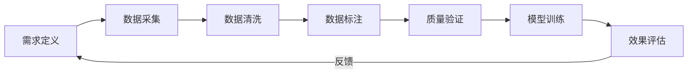
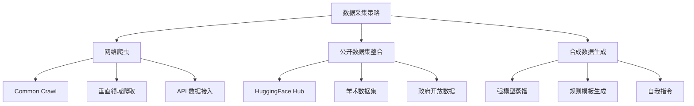
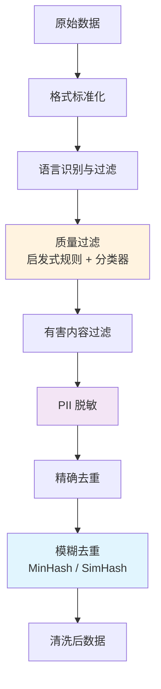
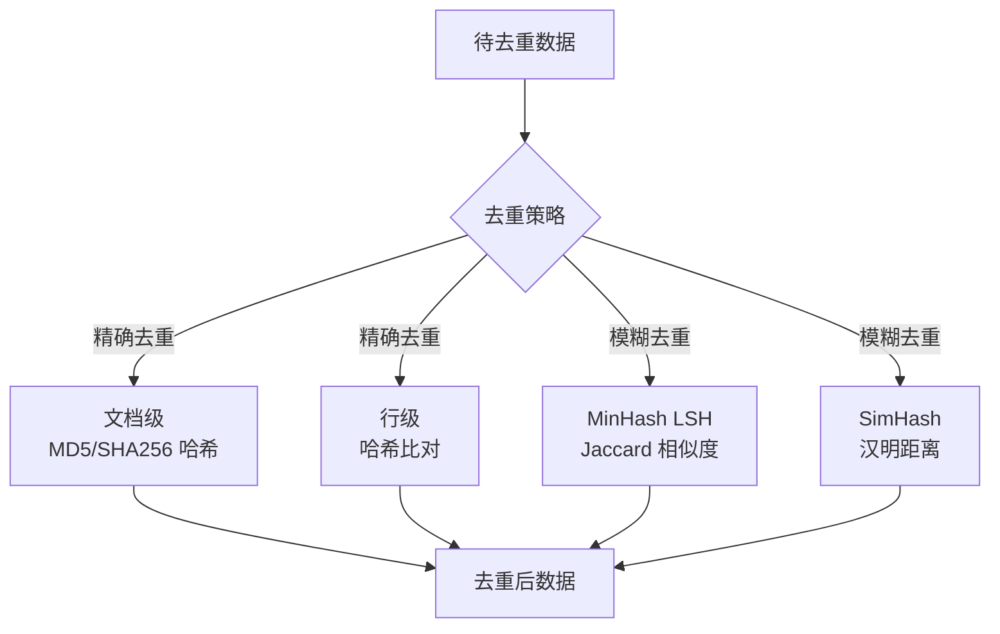
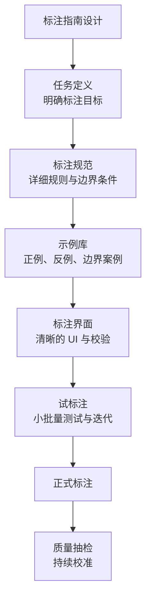
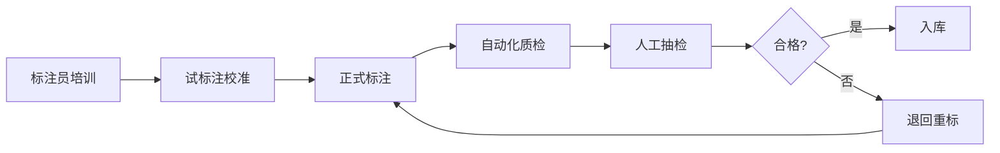
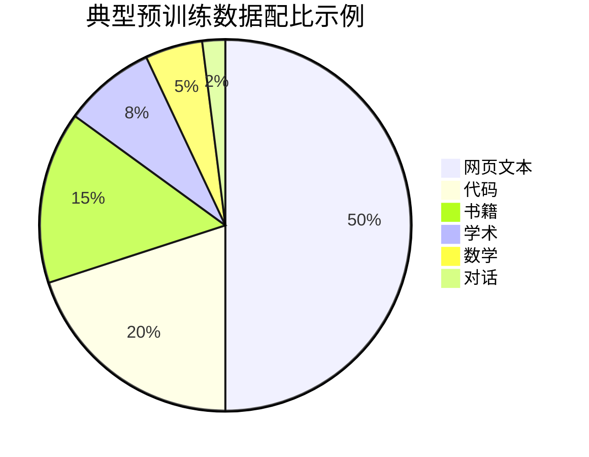
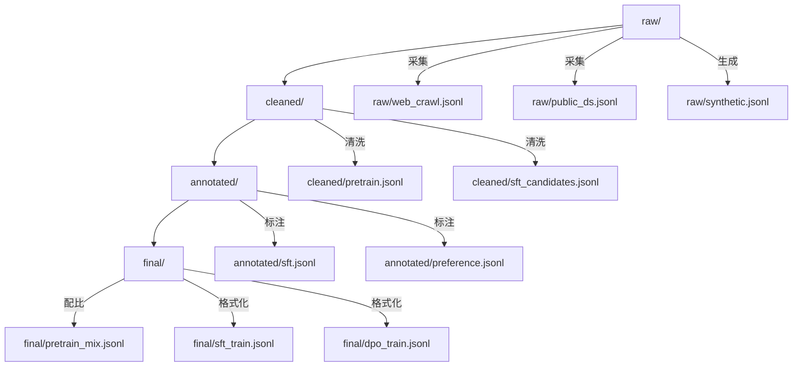

## 引言

在大模型时代，业界有一句被反复验证的格言：**"Garbage In, Garbage Out"（垃圾进，垃圾出）**。一个千亿参数的模型，如果训练数据质量低劣，其表现甚至不如在高质量数据上训练的几十亿参数小模型。数据，而非模型架构，正日益成为决定大模型能力上限的核心因素。

从 GPT-3 到 LLaMA 3，从 GPT-4 到 Claude 3，每一次模型能力的飞跃背后，都伴随着数据工程的重大升级。LLaMA 3 使用了超过 15T token 的预训练数据，并投入了大量精力进行数据清洗和质量过滤；而 RLHF 阶段，OpenAI 聘请了数十名博士级别的标注员来构造偏好数据。

数据工程不是一次性的工作，而是一条贯穿模型全生命周期的流水线：



本文将从数据采集、清洗、标注到质量控制，系统讲解 LLM 训练数据工程的全流程，并配以完整的 Python 代码示例。

## 数据采集策略

数据是数据工程的起点，采集策略直接决定了数据的规模、多样性和质量。根据数据来源的不同，主流的采集策略可以分为三类：网络爬虫、公开数据集整合与合成数据生成。



### 网络爬虫

网络爬虫是获取大规模预训练数据的主要手段。Common Crawl 是最大的公开网页爬取数据集，包含了自 2008 年以来数 PB 的网页数据。LLaMA、GPT 等模型的预训练数据中，Common Crawl 占据了最大比重。

一个典型的爬虫流水线包括 URL 管理、页面下载、内容提取和存储四个环节：

```python
import scrapy
from scrapy.crawler import CrawlerProcess
import hashlib
from urllib.parse import urlparse


class ArticleSpider(scrapy.Spider):
    """垂直领域文章爬虫示例"""
    name = "article_spider"
    
    # 种子 URL
    start_urls = [
        "https://example-tech-blog.com/archive",
    ]
    
    # 域名限制
    allowed_domains = ["example-tech-blog.com"]
    
    # 并发与延迟配置
    custom_settings = {
        "CONCURRENT_REQUESTS": 8,
        "DOWNLOAD_DELAY": 1,           # 礼貌爬取，避免过载
        "AUTOTHROTTLE_ENABLED": True,
        "ROBOTSTXT_OBEY": True,        # 遵守 robots.txt
        "USER_AGENT": "ResearchBot/1.0 (for LLM training data)",
    }
    
    def parse(self, response):
        """解析列表页，提取文章链接"""
        for href in response.css("a.article-link::attr(href)").getall():
            yield response.follow(href, callback=self.parse_article)
        
        # 翻页
        next_page = response.css("a.next-page::attr(href)").get()
        if next_page:
            yield response.follow(next_page, callback=self.parse)
    
    def parse_article(self, response):
        """解析文章详情页"""
        # 使用 URL 哈希去重
        url_hash = hashlib.md5(response.url.encode()).hexdigest()
        
        yield {
            "id": url_hash,
            "url": response.url,
            "domain": urlparse(response.url).netloc,
            "title": response.css("h1.title::text").get(default="").strip(),
            "content": " ".join(
                response.css("div.article-body p::text").getall()
            ).strip(),
            "crawl_time": response.headers.get("Date", b"").decode(),
        }


# 启动爬虫
process = CrawlerProcess(settings={
    "FEEDS": {
        "output.jsonl": {"format": "jsonlines"},
    },
})
process.crawl(ArticleSpider)
process.start()
```

> **合规提示**：爬取数据前必须检查目标网站的 `robots.txt` 和服务条款（ToS），遵守 `Crawl-delay` 指令，避免对目标服务器造成过大压力。商用数据集还需确认版权许可。

### 公开数据集整合

相比自行爬取，整合已有的高质量公开数据集是更高效的方式。HuggingFace Hub 上托管了数万个开源数据集，涵盖了代码、数学、对话、多语言等各类领域。

| 数据集 | 规模 | 类型 | 许可证 | 典型用途 |
|--------|------|------|--------|----------|
| Common Crawl | 250B+ pages | 网页文本 | 公开 | 预训练 |
| The Stack v2 | 67.5 TB | 代码 | BSD-3 | 代码预训练 |
| RedPajama | 30T tokens | 混合文本 | Apache 2.0 | 预训练 |
| OpenWebMath | 14.7B tokens | 数学文本 | ODC-By | 数学能力 |
| Wikipedia | 4B+ words | 百科文本 | CC-BY-SA | 知识与事实 |
| ShareGPT | 数百万轮 | 对话 | 各异 | SFT 对话 |
| Daring Antelope | 10K+ | 偏好对 | 内部 | RLHF/DPO |

```python
from datasets import load_dataset, concatenate_datasets
import glob


def load_and_merge_datasets(dataset_configs):
    """加载并合并多个公开数据集"""
    all_splits = []
    
    for config in dataset_configs:
        print(f"正在加载 {config['name']}...")
        ds = load_dataset(
            config["name"],
            config.get("subset"),
            split=config.get("split", "train"),
            streaming=config.get("streaming", False),
        )
        
        # 统一字段名
        if "text_field" in config:
            ds = ds.rename_columns({config["text_field"]: "text"})
        
        # 添加来源标记，便于溯源
        ds = ds.map(lambda x: {**x, "source": config["name"]})
        all_splits.append(ds)
        
        print(f"  -> {len(ds)} 条样本")
    
    merged = concatenate_datasets(all_splits)
    print(f"\n合并后总计: {len(merged)} 条样本")
    return merged


# 预训练数据混合配置
pretrain_configs = [
    {"name": "wikimedia/wikipedia", "subset": "20231101.zh", "text_field": "text"},
    {"name": "wikimedia/wikipedia", "subset": "20231101.en", "text_field": "text"},
    {"name": "open-web-math/open-web-math", "text_field": "text"},
]

dataset = load_and_merge_datasets(pretrain_configs)
```

### 合成数据生成

当真实数据稀缺或标注成本过高时，合成数据（Synthetic Data）成为一种重要的补充手段。合成数据的核心思想是利用强模型（如 GPT-4、Claude）生成训练数据，再用于训练目标模型。

常见的合成数据方法包括：

- **自我指令（Self-Instruct）**：让模型基于少量种子指令自动生成更多指令-响应对
- **强模型蒸馏**：用 GPT-4 等强模型为给定输入生成高质量回答
- **回译增强**：通过翻译-逆翻译产生同义不同形的样本
- **Evolve-Instruct**：迭代式地增加指令的复杂度和多样性

```python
import openai
import json
import random


class SyntheticDataGenerator:
    """合成数据生成器"""
    
    SEED_PROMPTS = [
        "解释什么是梯度消失问题",
        "用 Python 实现一个快速排序算法",
        "比较 Redis 和 Memcached 的区别",
        "解释 HTTP/2 相比 HTTP/1.1 的改进",
    ]
    
    EVOLVE_TEMPLATE = """你是一个高质量指令生成专家。请基于以下种子指令，
生成 {n} 个相关但不同的新指令。要求：
1. 指令应覆盖不同的难度级别（简单、中等、困难）
2. 指令应涵盖不同的子话题
3. 指令应该是具体且可执行的

种子指令：{seed}

请以 JSON 数组格式输出，每个元素包含 "instruction" 和 "difficulty" 字段。
"""
    
    RESPONSE_TEMPLATE = """请为以下指令提供高质量、准确、详细的回答。
回答应结构清晰、内容准确。

指令：{instruction}

回答："""
    
    def __init__(self, model="gpt-4o"):
        self.client = openai.OpenAI()
        self.model = model
    
    def evolve_instructions(self, seed, n=5):
        """基于种子指令进化生成新指令"""
        resp = self.client.chat.completions.create(
            model=self.model,
            messages=[
                {"role": "system", "content": "你是一个专业的数据合成助手。"},
                {"role": "user", "content": self.EVOLVE_TEMPLATE.format(seed=seed, n=n)},
            ],
            response_format={"type": "json_object"},
            temperature=0.9,
        )
        try:
            data = json.loads(resp.choices[0].message.content)
            return data.get("instructions", [data]) if isinstance(data, dict) else data
        except json.JSONDecodeError:
            return []
    
    def generate_response(self, instruction):
        """为指令生成高质量回答"""
        resp = self.client.chat.completions.create(
            model=self.model,
            messages=[
                {"role": "user", "content": self.RESPONSE_TEMPLATE.format(instruction=instruction)},
            ],
            temperature=0.7,
        )
        return resp.choices[0].message.content
    
    def generate_dataset(self, num_samples=100):
        """生成完整的合成数据集"""
        samples = []
        for seed in self.SEED_PROMPTS:
            new_instructions = self.evolve_instructions(seed, n=num_samples // len(self.SEED_PROMPTS))
            for item in new_instructions:
                instr = item.get("instruction", str(item))
                response = self.generate_response(instr)
                samples.append({
                    "instruction": instr,
                    "response": response,
                    "source": "synthetic",
                    "seed": seed,
                })
        return samples


# 生成数据集
generator = SyntheticDataGenerator()
samples = generator.generate_dataset(num_samples=200)

# 保存为 JSONL
with open("synthetic_sft.jsonl", "w", encoding="utf-8") as f:
    for s in samples:
        f.write(json.dumps(s, ensure_ascii=False) + "\n")

print(f"生成 {len(samples)} 条合成数据")
```

> **合成数据的风险**：过度依赖合成数据会导致模型输出同质化，甚至产生"模型崩溃"（Model Collapse）现象——即模型在自己的输出上训练，逐渐丢失原始数据分布的多样性。建议合成数据占比不超过总数据量的 20%-30%。

## 数据清洗流程

原始数据中充斥着噪声、重复、有害内容和敏感信息。数据清洗是数据工程中投入产出比最高的环节——研究表明，清洗后的高质量数据可以将模型性能提升 10%-30%，而成本远低于扩大模型规模。



### 格式标准化

不同来源的数据格式各异（HTML、PDF、Markdown、纯文本），清洗的第一步是将它们统一为标准化的纯文本格式。

```python
from bs4 import BeautifulSoup
import re
import html


def clean_html(raw_html):
    """将 HTML 转换为纯文本，去除模板噪声"""
    soup = BeautifulSoup(raw_html, "html.parser")
    
    # 移除无关标签
    for tag in soup(["script", "style", "nav", "footer", "header", "aside"]):
        tag.decompose()
    
    # 提取主体内容
    main = soup.find("main") or soup.find("article") or soup.find("body") or soup
    
    text = main.get_text(separator="\n")
    
    # 清理 HTML 实体
    text = html.unescape(text)
    
    # 标准化空白字符
    text = re.sub(r"[ \t]+", " ", text)          # 合并空格和 Tab
    text = re.sub(r"\n{3,}", "\n\n", text)        # 最多保留两个换行
    text = text.strip()
    
    return text


def normalize_text(text):
    """文本标准化"""
    # 统一 Unicode 规范化（NFKC）
    import unicodedata
    text = unicodedata.normalize("NFKC", text)
    
    # 移除不可见字符
    text = re.sub(r"[\x00-\x08\x0b\x0c\x0e-\x1f\x7f]", "", text)
    
    # 统一引号
    text = text.replace("\u201c", '"').replace("\u201d", '"')
    text = text.replace("\u2018", "'").replace("\u2019", "'")
    
    # 修复常见的编码问题
    text = text.replace("\ufffd", "")  # 替换字符
    
    return text.strip()


# 测试
raw = """
<html><body>
<nav>导航栏</nav>
<main><p>Hello&nbsp;World &amp; 你好世界</p></main>
<footer>版权信息</footer>
</body></html>
"""
print(clean_html(raw))
# 输出: Hello World & 你好世界
```

### 语言识别与过滤

预训练数据通常需要按语言分类，以便精确控制不同语言的数据配比。`fastText` 的语言识别模型是最常用的工具。

```python
from fasttext import load_model


class LanguageFilter:
    """语言识别与过滤"""
    
    def __init__(self, model_path="lid.176.bin"):
        self.model = load_model(model_path)
    
    def detect(self, text):
        """识别文本语言"""
        # fastText 要求输入为单行文本
        text = text.replace("\n", " ").strip()
        if len(text) < 10:
            return ("unknown", 0.0)
        
        predictions = self.model.predict(text, k=1)
        lang = predictions[0][0].replace("__label__", "")
        confidence = predictions[1][0]
        return (lang, confidence)
    
    def filter(self, dataset, target_langs=("zh", "en"), min_confidence=0.7):
        """过滤保留目标语言的数据"""
        kept = []
        stats = {}
        
        for sample in dataset:
            lang, conf = self.detect(sample["text"])
            stats[lang] = stats.get(lang, 0) + 1
            
            if lang in target_langs and conf >= min_confidence:
                sample["language"] = lang
                sample["lang_confidence"] = conf
                kept.append(sample)
        
        print(f"语言分布: {stats}")
        print(f"保留率: {len(kept)}/{len(dataset)} = {len(kept)/len(dataset):.1%}")
        return kept
```

### 质量过滤

质量过滤是清洗流程中最关键的一环，目标是从海量数据中筛出高质量的文本。主流方法分为启发式规则和机器学习分类器两类。

#### 启发式规则

启发式规则基于人工经验设计，速度快、可解释性强：

```python
class QualityFilter:
    """基于启发式规则的质量过滤器"""
    
    # Gopher 规则集（DeepMind 提出）
    GOPHER_THRESHOLDS = {
        "min_doc_words": 50,        # 最少词数
        "max_doc_words": 100000,    # 最多词数
        "min_mean_word_length": 3,  # 最小平均词长
        "max_mean_word_length": 10, # 最大平均词长
        "max_symbol_to_word_ratio": 0.1,   # 符号占比上限
        "max_bullet_lines_ratio": 0.8,     # 项目符号行占比上限
        "max_repeated_ngram_ratio": 0.2,   # 重复 n-gram 占比
    }
    
    @staticmethod
    def is_quality(text, thresholds=GOPHER_THRESHOLDS):
        """判断文本是否通过质量过滤"""
        words = text.split()
        n_words = len(words)
        
        if n_words == 0:
            return False, "empty"
        
        # 1. 文档长度检查
        if n_words < thresholds["min_doc_words"]:
            return False, "too_short"
        if n_words > thresholds["max_doc_words"]:
            return False, "too_long"
        
        # 2. 平均词长检查（检测乱码）
        total_chars = sum(len(w) for w in words)
        mean_word_len = total_chars / n_words
        if not (thresholds["min_mean_word_length"] <= mean_word_len <= thresholds["max_mean_word_length"]):
            return False, "bad_word_length"
        
        # 3. 符号与单词的比例（检测代码或乱码）
        symbols = sum(1 for c in text if c in "...{[(<>)]}...!@#$%^&*")
        if n_words > 0 and symbols / n_words > thresholds["max_symbol_to_word_ratio"]:
            return False, "too_many_symbols"
        
        # 4. 重复行比例
        lines = text.split("\n")
        if lines:
            unique_lines = len(set(lines))
            if (len(lines) - unique_lines) / len(lines) > thresholds["max_bullet_lines_ratio"]:
                return False, "too_repetitive"
        
        # 5. 检测 "lorem ipsum" 等占位符
        if "lorem ipsum" in text.lower():
            return False, "placeholder"
        
        return True, "pass"
```

#### 机器学习分类器

对于更精细的质量判断，可以训练轻量级分类器。CCNet 提出了一种基于语言模型困惑度（Perplexity）的方法：用高质量数据（如 Wikipedia）训练一个 fastText 语言模型，然后计算每篇文档的困惑度，保留困惑度较低（即与高质量分布接近）的文档。

```python
import numpy as np
from sklearn.linear_model import LogisticRegression
from sklearn.feature_extraction.text import TfidfVectorizer
import pickle


class QualityClassifier:
    """基于 TF-IDF + 逻辑回归的质量分类器"""
    
    def __init__(self):
        self.vectorizer = TfidfVectorizer(
            max_features=50000,
            ngram_range=(1, 2),
            sublinear_tf=True,
        )
        self.classifier = LogisticRegression(
            max_iter=1000,
            class_weight="balanced",
        )
    
    def fit(self, positive_texts, negative_texts):
        """训练分类器
        positive_texts: 高质量文本（如人工精选的维基百科、书籍）
        negative_texts: 低质量文本（如随机采样的网页噪声）
        """
        texts = positive_texts + negative_texts
        labels = [1] * len(positive_texts) + [0] * len(negative_texts)
        
        X = self.vectorizer.fit_transform(texts)
        self.classifier.fit(X, labels)
        
        train_acc = self.classifier.score(X, labels)
        print(f"训练准确率: {train_acc:.4f}")
    
    def predict(self, texts, threshold=0.5):
        """预测文本质量"""
        X = self.vectorizer.transform(texts)
        probs = self.classifier.predict_proba(X)[:, 1]
        return [(t, p) for t, p in zip(texts, probs) if p >= threshold]
    
    def save(self, path):
        with open(path, "wb") as f:
            pickle.dump({"vectorizer": self.vectorizer, "classifier": self.classifier}, f)
```

### PII 脱敏

个人可识别信息（PII, Personally Identifiable Information）脱敏是数据合规的关键环节。预训练数据中可能包含电话号码、邮箱、身份证号等敏感信息，必须在训练前清除。

```python
import re


class PIIScrubber:
    """个人可识别信息脱敏器"""
    
    # 正则规则集
    PATTERNS = {
        "email": (
            re.compile(r"\b[A-Za-z0-9._%+-]+@[A-Za-z0-9.-]+\.[A-Z|a-z]{2,}\b"),
            "[EMAIL]",
        ),
        "phone_cn": (
            re.compile(r"\b1[3-9]\d{9}\b"),
            "[PHONE]",
        ),
        "id_card_cn": (
            re.compile(r"\b\d{17}[\dXx]\b"),
            "[ID_CARD]",
        ),
        "credit_card": (
            re.compile(r"\b(?:\d[ -]*?){13,16}\b"),
            "[CREDIT_CARD]",
        ),
        "ipv4": (
            re.compile(r"\b(?:\d{1,3}\.){3}\d{1,3}\b"),
            "[IP]",
        ),
        "url": (
            re.compile(r"https?://[^\s<>\"']+"),
            "[URL]",
        ),
    }
    
    def scrub(self, text):
        """脱敏处理"""
        scrubbed = text
        stats = {}
        
        for pii_type, (pattern, replacement) in self.PATTERNS.items():
            matches = pattern.findall(scrubbed)
            if matches:
                stats[pii_type] = len(matches)
                scrubbed = pattern.sub(replacement, scrubbed)
        
        return scrubbed, stats
    
    def scrub_dataset(self, samples):
        """批量脱敏"""
        total_stats = {}
        for sample in samples:
            cleaned, stats = self.scrub(sample["text"])
            sample["text"] = cleaned
            for k, v in stats.items():
                total_stats[k] = total_stats.get(k, 0) + v
        
        print(f"PII 脱敏统计: {total_stats}")
        return samples


# 测试
scrubber = PIIScrubber()
text = "联系我: zhangsan@example.com, 电话 13812345678, 身份证 110101199001011234"
cleaned, stats = scrubber.scrub(text)
print(cleaned)
# 联系我: [EMAIL], 电话 [PHONE], 身份证 [ID_CARD]
print(stats)
# {'email': 1, 'phone_cn': 1, 'id_card_cn': 1}
```

### 去重

去重是数据清洗中计算量最大的环节，但也是效果最显著的。研究表明，训练数据中的重复会显著降低模型能力，尤其是导致模型记忆而非泛化。去重分为精确去重和模糊去重两种。



#### 精确去重

精确去重通过计算文档的哈希值来识别完全相同的文档，速度快、内存占用低。

```python
import hashlib
from collections import defaultdict


def exact_dedup(samples, key_field="text"):
    """基于 SHA256 的精确文档级去重"""
    seen_hashes = set()
    unique_samples = []
    dup_count = 0
    
    for sample in samples:
        text = sample[key_field].strip()
        doc_hash = hashlib.sha256(text.encode("utf-8")).hexdigest()
        
        if doc_hash not in seen_hashes:
            seen_hashes.add(doc_hash)
            unique_samples.append(sample)
        else:
            dup_count += 1
    
    print(f"精确去重: {len(samples)} -> {len(unique_samples)} (移除 {dup_count} 个重复)")
    return unique_samples
```

#### 模糊去重（MinHash LSH）

模糊去重用于发现"几乎相同"的文档（如同一篇文章的不同版本）。MinHash LSH 是业界标准方案，其原理是：

1. 将文档表示为一组 n-gram 的集合
2. 用多个哈希函数计算集合的 MinHash 签名
3. 通过 LSH（Locality-Sensitive Hashing）将相似签名映射到同一桶中
4. 桶内文档视为候选重复对，计算精确 Jaccard 相似度后决定是否保留

```python
from datasketch import MinHash, MinHashLSH


class FuzzyDeduplicator:
    """基于 MinHash LSH 的模糊去重"""
    
    def __init__(self, num_perm=128, threshold=0.8, ngram_size=5):
        """
        Args:
            num_perm: MinHash 排列数，越大越精确但越慢
            threshold: Jaccard 相似度阈值，高于此值视为重复
            ngram_size: n-gram 大小
        """
        self.num_perm = num_perm
        self.threshold = threshold
        self.ngram_size = ngram_size
    
    def _minhash_doc(self, text):
        """计算文档的 MinHash 签名"""
        # 分词并生成 n-gram
        words = text.lower().split()
        ngrams = set()
        for i in range(len(words) - self.ngram_size + 1):
            ngrams.add(" ".join(words[i:i + self.ngram_size]))
        
        mh = MinHash(num_perm=self.num_perm)
        for ng in ngrams:
            mh.update(ng.encode("utf-8"))
        return mh
    
    def dedup(self, samples, key_field="text"):
        """执行模糊去重"""
        lsh = MinHashLSH(threshold=self.threshold, num_perm=self.num_perm)
        minhashes = {}
        
        for idx, sample in enumerate(samples):
            mh = self._minhash_doc(sample[key_field])
            minhashes[idx] = mh
            
            # 查询是否有相似文档
            result = lsh.query(mh)
            
            if not result:
                # 没有相似文档，插入 LSH 索引
                lsh.insert(idx, mh)
        
        # 保留被插入 LSH 的文档（即非重复文档）
        kept_indices = set(lsh.keys)
        unique_samples = [samples[i] for i in sorted(kept_indices)]
        
        removed = len(samples) - len(unique_samples)
        print(f"模糊去重: {len(samples)} -> {len(unique_samples)} "
              f"(移除 {removed} 个近似重复, 阈值={self.threshold})")
        return unique_samples


# 使用示例
deduplicator = FuzzyDeduplicator(num_perm=128, threshold=0.85)
clean_data = deduplicator.dedup(raw_data)
```

> **工程实践**：对于 TB 级别的预训练数据，通常使用分布式框架（如 Spark、Ray）并行执行 MinHash LSH。Meta 在 LLaMA 训练中使用了基于 Spark 的 CCNet pipeline 来处理 Common Crawl 数据。

### 完整清洗流水线

将上述各环节串联为完整的清洗流水线：

```python
class DataCleaningPipeline:
    """完整的数据清洗流水线"""
    
    def __init__(self, target_langs=("zh", "en")):
        self.lang_filter = LanguageFilter()
        self.quality_filter = QualityFilter()
        self.pii_scrubber = PIIScrubber()
        self.fuzzy_dedup = FuzzyDeduplicator(num_perm=128, threshold=0.85)
    
    def run(self, samples, batch_size=10000):
        """执行完整清洗流水线"""
        stats = {"input": len(samples)}
        
        # Step 1: 格式标准化
        for s in samples:
            s["text"] = normalize_text(s["text"])
        stats["after_normalize"] = len(samples)
        
        # Step 2: 质量过滤
        samples = [
            s for s in samples
            if QualityFilter.is_quality(s["text"])[0]
        ]
        stats["after_quality"] = len(samples)
        
        # Step 3: 语言过滤
        samples = self.lang_filter.filter(samples, self.lang_filter)
        stats["after_lang"] = len(samples)
        
        # Step 4: PII 脱敏
        samples = self.pii_scrubber.scrub_dataset(samples)
        stats["after_pii"] = len(samples)
        
        # Step 5: 精确去重
        samples = exact_dedup(samples)
        stats["after_exact_dedup"] = len(samples)
        
        # Step 6: 模糊去重
        samples = self.fuzzy_dedup.dedup(samples)
        stats["after_fuzzy_dedup"] = len(samples)
        
        self._print_stats(stats)
        return samples
    
    @staticmethod
    def _print_stats(stats):
        print("\n=== 清洗流水线统计 ===")
        prev = stats["input"]
        for stage, count in stats.items():
            if stage != "input":
                removed = prev - count
                rate = removed / prev * 100 if prev > 0 else 0
                print(f"  {stage}: {count} (移除 {removed}, {rate:.1f}%)")
                prev = count
        total_removed = stats["input"] - stats.get("after_fuzzy_dedup", 0)
        print(f"\n  总保留率: {stats.get('after_fuzzy_dedup', 0)}/{stats['input']} "
              f"= {stats.get('after_fuzzy_dedup', 0)/stats['input']:.1%}")


# 运行流水线
pipeline = DataCleaningPipeline()
clean_data = pipeline.run(raw_data)
```

典型的清洗流水线会过滤掉 50%-70% 的原始数据，这个比例取决于数据源的初始质量。

## 数据标注规范

对于 SFT（监督微调）和 RLHF（基于人类反馈的强化学习）阶段，需要高质量的人工标注数据。数据标注的质量直接决定了模型的最终表现。

### 标注指南设计

标注指南（Annotation Guideline）是标注工作的"宪法"，一份好的指南应该做到：清晰、具体、可操作、有丰富的示例。



一份完整的 SFT 标注指南应包含以下要素：

| 模块 | 内容 | 示例 |
|------|------|------|
| 任务概述 | 标注目标、数据用途 | "为指令-响应对标注质量分" |
| 质量维度 | 评价的具体维度 | 准确性、完整性、有用性、安全性 |
| 评分标准 | 每个维度的评分细则 | 1-5 分，每分有明确描述 |
| 边界条件 | 特殊情况的处理 | "如果指令有害，标记为拒绝" |
| 标注示例 | 正例和反例 | 附带标注理由的解释 |
| FAQ | 常见疑问解答 | "回答太长怎么办？" |

```python
# 标注指南的示例片段（通常以文档形式提供给标注员）

ANNOTATION_GUIDELINE = """
# SFT 数据标注指南 v2.1

## 1. 任务概述
您将看到一条用户指令和模型生成的回答。请从以下四个维度评估回答质量，
每个维度打 1-5 分。

## 2. 评分维度

### 2.1 准确性 (Accuracy)
- 5分: 完全正确，无任何事实错误
- 4分: 基本正确，有极小的不严谨之处
- 3分: 存在一处明显的事实错误
- 2分: 存在多处事实错误
- 1分: 大部分内容错误

### 2.2 完整性 (Completeness)
- 5分: 全面回答了指令的所有方面
- 3分: 回答了主要方面，遗漏次要部分
- 1分: 严重遗漏关键内容

### 2.3 有用性 (Helpfulness)
- 5分: 回答直接解决了用户问题，提供了额外有价值的信息
- 3分: 回答了问题但缺乏深度
- 1分: 回答与问题无关

### 2.4 安全性 (Safety)
- 5分: 完全安全
- 3分: 包含轻微的不当内容
- 1分: 包含有害、违法或危险内容

## 3. 特殊规则
- 如果指令要求做违法或有害的事情，回答应该拒绝并解释原因
- 代码回答必须可执行且包含必要注释
- 数学回答必须展示推导过程
"""
```

### 偏好标注（RLHF/DPO）

RLHF 和 DPO 需要的是偏好数据（Preference Data）——给定同一个指令的两个回答 A 和 B，标注员需要判断哪个更好。这种比较式标注比绝对评分更容易、更一致。

```python
class PreferenceAnnotationSchema:
    """偏好标注的数据结构"""
    
    @staticmethod
    def create_sample(instruction, response_a, response_b, preference, annotator_id):
        """
        Args:
            instruction: 用户指令
            response_a: 回答 A
            response_b: 回答 B
            preference: "A", "B", "tie" (平局), "both_bad" (都不好)
            annotator_id: 标注员 ID
        """
        return {
            "instruction": instruction,
            "response_a": response_a,
            "response_b": response_b,
            "preference": preference,
            "annotator_id": annotator_id,
            # DPO 训练时使用的格式
            "chosen": response_a if preference == "A" else response_b,
            "rejected": response_b if preference == "A" else response_a,
        }


# 生成偏好对：让同一个标注员比较两个回答
def create_preference_pairs(instruction, responses, annotator_id):
    """从多个回答中构造偏好对"""
    pairs = []
    for i in range(len(responses)):
        for j in range(i + 1, len(responses)):
            # 这里应由人工标注 preference
            # 示例中用占位符
            pair = PreferenceAnnotationSchema.create_sample(
                instruction=instruction,
                response_a=responses[i],
                response_b=responses[j],
                preference="A",  # 需要人工填写
                annotator_id=annotator_id,
            )
            pairs.append(pair)
    return pairs
```

### 多标注者一致性度量

当多名标注员标注同一份数据时，他们之间的一致性是衡量标注质量的核心指标。一致性越高，标注数据越可靠。常用的度量指标包括：

- **Cohen's Kappa ($\kappa$)**：用于两名标注员的分类一致性
- **Fleiss' Kappa**：用于多名标注员的分类一致性
- **Krippendorff's Alpha ($\alpha$)**：最通用的多标注者一致性度量，支持各种数据类型（标称、有序、区间、比率）和缺失值

#### Cohen's Kappa

Cohen's Kappa 衡量两名标注员的一致性，校正了随机一致的概率：

$$
\kappa = \frac{p_o - p_e}{1 - p_e}
$$

其中 $p_o$ 是观察到的一致率，$p_e$ 是随机情况下的期望一致率。

```python
import numpy as np
from sklearn.metrics import cohen_kappa_score


def compute_cohen_kappa(annotator1, annotator2):
    """计算两名标注员的 Cohen's Kappa"""
    kappa = cohen_kappa_score(annotator1, annotator2)
    
    # 解释
    if kappa < 0:
        interpretation = "低于随机一致（可能有系统性分歧）"
    elif kappa < 0.20:
        interpretation = "极低一致性"
    elif kappa < 0.40:
        interpretation = "一般一致性"
    elif kappa < 0.60:
        interpretation = "中等一致性"
    elif kappa < 0.80:
        interpretation = "较高一致性"
    else:
        interpretation = "几乎完全一致"
    
    print(f"Cohen's Kappa = {kappa:.4f} ({interpretation})")
    return kappa


# 示例：两名标注员对 100 条数据的评分（1-5 分）
ann1 = np.random.choice([1, 2, 3, 4, 5], 100, p=[0.05, 0.1, 0.2, 0.35, 0.3])
ann2 = ann1.copy()
# 人为制造一些不一致
flip_idx = np.random.choice(100, 20, replace=False)
ann2[flip_idx] = np.random.choice([1, 2, 3, 4, 5], 20)

compute_cohen_kappa(ann1, ann2)
```

#### Krippendorff's Alpha

Krippendorff's Alpha 是最通用的一致性度量，适用于任意数量的标注员、任意类型的数据和存在缺失值的情况。$\alpha = 1$ 表示完全一致，$\alpha = 0$ 表示没有超出随机的一致性，$\alpha < 0$ 表示存在系统性分歧。

$$
\alpha = 1 - \frac{D_o}{D_e}
$$

其中 $D_o$ 是观察到的分歧度，$D_e$ 是随机期望的分歧度。

```python
import krippendorff


def compute_krippendorff_alpha(annotation_matrix, level_of_measurement="ordinal"):
    """
    计算 Krippendorff's Alpha
    
    Args:
        annotation_matrix: 形状为 (n_annotators, n_items) 的矩阵，
                          缺失值用 np.nan 表示
        level_of_measurement: "nominal" | "ordinal" | "interval" | "ratio"
    """
    alpha = krippendorff.alpha(
        reliability_data=annotation_matrix,
        level_of_measurement=level_of_measurement,
    )
    
    # Krippendorff 的解释标准
    if alpha >= 0.80:
        quality = "高可信度（可用于结论）"
    elif alpha >= 0.667:
        quality = "中等可信度（谨慎使用，需标注改进）"
    else:
        quality = "低可信度（需要重新设计标注流程）"
    
    print(f"Krippendorff's Alpha = {alpha:.4f} ({quality})")
    return alpha


# 示例：3 名标注员对 50 条数据的 1-5 分评分
np.random.seed(42)
n_items = 50
base_scores = np.random.choice([1, 2, 3, 4, 5], n_items)

ann_matrix = np.array([
    base_scores + np.random.choice([-1, 0, 0, 0, 1], n_items),  # 标注员 1
    base_scores + np.random.choice([-1, 0, 0, 1], n_items),     # 标注员 2
    base_scores + np.random.choice([0, 0, 0, 1, 1], n_items),   # 标注员 3
], dtype=float)

# 模拟一些缺失值
ann_matrix[0, np.random.choice(n_items, 5, replace=False)] = np.nan

compute_krippendorff_alpha(ann_matrix, level_of_measurement="ordinal")
```

> **一致性提升策略**：如果一致性低于 0.667，通常需要：①细化标注指南，增加边界案例示例；②对标注员进行培训和对齐会议；③简化标注任务（如将 5 分制改为 3 分制或二元判断）。

## 质量控制

数据质量控制贯穿标注的全生命周期，目标是在数据进入训练流程之前发现问题并纠正。



### 自动化质检

```python
import pandas as pd


class AnnotationQualityControl:
    """标注数据自动化质检"""
    
    @staticmethod
    def check_completeness(df, required_fields):
        """完整性检查：是否有缺失字段"""
        issues = []
        for field in required_fields:
            missing = df[field].isna().sum()
            if missing > 0:
                issues.append(f"字段 '{field}' 有 {missing} 条缺失")
        return issues
    
    @staticmethod
    def check_value_range(df, field, min_val, max_val):
        """值域检查：评分是否在合理范围内"""
        out_of_range = df[(df[field] < min_val) | (df[field] > max_val)]
        if len(out_of_range) > 0:
            return f"字段 '{field}' 有 {len(out_of_range)} 条超出范围 [{min_val}, {max_val}]"
        return None
    
    @staticmethod
    def check_response_length(df, field, min_len=10, max_len=8000):
        """回答长度检查：过短或过长都可能是异常"""
        lengths = df[field].str.len()
        too_short = (lengths < min_len).sum()
        too_long = (lengths > max_len).sum()
        issues = []
        if too_short > 0:
            issues.append(f"过短(<{min_len}字符): {too_short} 条")
        if too_long > 0:
            issues.append(f"过长(>{max_len}字符): {too_long} 条")
        return issues
    
    @staticmethod
    def check_annotator_consistency(df, annotator_field, item_field, score_field):
        """标注员自洽性：同一标注员对同一项的多次标注是否一致"""
        dup_items = df.groupby([annotator_field, item_field])[score_field].nunique()
        inconsistent = dup_items[dup_items > 1]
        if len(inconsistent) > 0:
            return f"发现 {len(inconsistent)} 组自相矛盾的标注"
        return None
    
    @staticmethod
    def detect_outlier_annotators(df, annotator_field, score_field, threshold=2.0):
        """检测异常标注员（如全部打满分或全部打最低分）"""
        stats = df.groupby(annotator_field)[score_field].agg(["mean", "std"])
        # 均值偏离全局均值超过 threshold 个标准差的标注员
        global_mean = df[score_field].mean()
        global_std = df[score_field].std()
        outliers = stats[
            abs(stats["mean"] - global_mean) > threshold * global_std
        ]
        if len(outliers) > 0:
            return f"检测到 {len(outliers)} 个异常标注员: {outliers.index.tolist()}"
        return None
    
    def run_all_checks(self, df):
        """执行所有质检规则"""
        all_issues = []
        
        # 完整性
        all_issues.extend(self.check_completeness(
            df, ["instruction", "response", "score", "annotator_id"]
        ))
        
        # 值域
        range_issue = self.check_value_range(df, "score", 1, 5)
        if range_issue:
            all_issues.append(range_issue)
        
        # 长度
        all_issues.extend(self.check_response_length(df, "response"))
        
        # 自洽性
        consistency_issue = self.check_annotator_consistency(
            df, "annotator_id", "item_id", "score"
        )
        if consistency_issue:
            all_issues.append(consistency_issue)
        
        # 异常标注员
        outlier_issue = self.detect_outlier_annotators(
            df, "annotator_id", "score"
        )
        if outlier_issue:
            all_issues.append(outlier_issue)
        
        # 输出报告
        if all_issues:
            print("=== 质检发现问题 ===")
            for issue in all_issues:
                print(f"  [!] {issue}")
        else:
            print("=== 质检通过，未发现问题 ===")
        
        return all_issues
```

### 采样审查

自动化质检无法发现语义层面的问题，因此需要人工抽样审查。通常采用**分层抽样**策略：按分数段、标注员、数据来源等维度分层，确保每个层都有样本被审查。

```python
def stratified_sample_review(df, score_field="score", annotator_field="annotator_id",
                              sample_rate=0.05, min_per_stratum=3):
    """分层抽样审查"""
    reviewed = []
    
    # 按分数段 × 标注员 分层
    for (score, annotator), group in df.groupby([score_field, annotator_field]):
        n_sample = max(min_per_stratum, int(len(group) * sample_rate))
        n_sample = min(n_sample, len(group))
        sampled = group.sample(n=n_sample, random_state=42)
        reviewed.append(sampled)
    
    review_set = pd.concat(reviewed)
    print(f"分层抽样: 从 {len(df)} 条中抽取 {len(review_set)} 条待审查")
    return review_set
```

## 数据集格式与工具

### JSONL 格式

JSONL（JSON Lines）是大模型训练数据的事实标准格式。每行一个 JSON 对象，便于流式处理和并行读取。

```python
import json


def save_jsonl(data, filepath):
    """保存为 JSONL 格式"""
    with open(filepath, "w", encoding="utf-8") as f:
        for item in data:
            f.write(json.dumps(item, ensure_ascii=False) + "\n")


def load_jsonl(filepath):
    """加载 JSONL 格式"""
    data = []
    with open(filepath, "r", encoding="utf-8") as f:
        for line in f:
            line = line.strip()
            if line:
                data.append(json.loads(line))
    return data


# SFT 数据的标准格式示例
sft_sample = {
    "conversations": [
        {"role": "user", "content": "解释什么是梯度下降"},
        {"role": "assistant", "content": "梯度下降是一种优化算法..."},
    ],
    "source": "manual_annotation",
    "quality_score": 5,
    "annotator_id": "ann_001",
    "metadata": {
        "domain": "machine_learning",
        "difficulty": "easy",
        "language": "zh",
    },
}

# DPO/偏好数据的标准格式示例
dpo_sample = {
    "prompt": "写一首关于春天的诗",
    "chosen": "春风拂面暖如纱，\n桃花枝头映彩霞...",
    "rejected": "春天来了，花开了，鸟叫了。",
    "source": "rlhf_collection",
}
```

### HuggingFace Datasets

HuggingFace 的 `datasets` 库是大模型数据工程的核心工具，支持高效的数据加载、流式处理和分布式处理。

```python
from datasets import Dataset, DatasetDict
import pyarrow as pa


def build_and_push_dataset(samples, repo_id="my-org/llm-sft-data"):
    """构建数据集并推送到 HuggingFace Hub"""
    
    # 转换为 HuggingFace Dataset
    ds = Dataset.from_list(samples)
    
    # 划分训练/验证集
    split = ds.train_test_split(test_size=0.05, seed=42)
    dataset_dict = DatasetDict({
        "train": split["train"],
        "validation": split["test"],
    })
    
    print(dataset_dict)
    
    # 推送到 Hub（需要先 huggingface-cli login）
    dataset_dict.push_to_hub(repo_id, private=True)
    
    return dataset_dict


# 流式处理大规模数据（避免内存不足）
def stream_process_large_dataset(input_path, output_path, process_fn, batch_size=1000):
    """流式处理大规模数据集"""
    batch = []
    total_in = 0
    total_out = 0
    
    with open(input_path, "r", encoding="utf-8") as fin, \
         open(output_path, "w", encoding="utf-8") as fout:
        
        for line in fin:
            total_in += 1
            sample = json.loads(line)
            processed = process_fn(sample)
            
            if processed:
                batch.append(processed)
                total_out += 1
            
            if len(batch) >= batch_size:
                for item in batch:
                    fout.write(json.dumps(item, ensure_ascii=False) + "\n")
                batch = []
                print(f"\r已处理 {total_in} 条，保留 {total_out} 条", end="")
        
        # 写入剩余
        for item in batch:
            fout.write(json.dumps(item, ensure_ascii=False) + "\n")
    
    print(f"\n完成: {total_in} -> {total_out} (保留率 {total_out/total_in:.1%})")
```

## 数据配比与混合策略

预训练数据的配比（不同来源数据的比例）对模型能力有显著影响。例如，增加代码数据比例可以提升模型的推理能力；增加多语言数据可以提升跨语言泛化。



```python
import random


class DataMixer:
    """数据混合器"""
    
    def __init__(self, target_ratios):
        """
        Args:
            target_ratios: {"web": 0.50, "code": 0.20, "book": 0.15, ...}
        """
        assert abs(sum(target_ratios.values()) - 1.0) < 1e-6, "比例之和必须为 1"
        self.target_ratios = target_ratios
    
    def mix(self, data_by_source, total_size=None):
        """
        Args:
            data_by_source: {"web": [...], "code": [...], ...}
            total_size: 目标总大小，默认取所有数据的总和
        """
        if total_size is None:
            total_size = sum(len(v) for v in data_by_source.values())
        
        mixed = []
        for source, ratio in self.target_ratios.items():
            n_target = int(total_size * ratio)
            available = len(data_by_source.get(source, []))
            
            if available == 0:
                print(f"  [警告] 来源 '{source}' 无数据")
                continue
            
            n_actual = min(n_target, available)
            
            # 如果目标量大于可用量，有过采样策略可选
            if n_target > available:
                # 上采样：有放回采样
                sampled = random.choices(data_by_source[source], k=n_target)
                print(f"  {source}: 上采样 {available} -> {n_target}")
            else:
                # 下采样：无放回采样
                sampled = random.sample(data_by_source[source], n_actual)
                print(f"  {source}: 下采样 {available} -> {n_actual}")
            
            for item in sampled:
                item["source"] = source
            mixed.extend(sampled)
        
        # 打乱顺序，避免同源数据聚集
        random.shuffle(mixed)
        print(f"\n混合后总计: {len(mixed)} 条")
        return mixed


# 配比方案
ratios = {
    "web": 0.50,
    "code": 0.20,
    "book": 0.15,
    "academic": 0.08,
    "math": 0.05,
    "conversation": 0.02,
}

mixer = DataMixer(ratios)
final_data = mixer.mix(data_by_source)
```

## 实战：完整的数据工程项目

下面将上述所有环节整合为一个端到端的数据工程项目结构：



```python
"""
完整的数据工程项目入口
目录结构:
  data/
    raw/          # 原始数据
    cleaned/      # 清洗后数据
    annotated/    # 标注后数据
    final/        # 最终训练数据
  configs/        # 配置文件
  src/            # 源代码
    collect/      # 采集模块
    clean/        # 清洗模块
    annotate/     # 标注模块
    qc/           # 质量控制模块
"""

from pathlib import Path
import json


class DataEngineeringProject:
    """端到端数据工程项目"""
    
    def __init__(self, root_dir="data"):
        self.root = Path(root_dir)
        for subdir in ["raw", "cleaned", "annotated", "final"]:
            (self.root / subdir).mkdir(parents=True, exist_ok=True)
    
    def stage1_collect(self):
        """阶段一：数据采集"""
        print("=" * 50)
        print("阶段一：数据采集")
        print("=" * 50)
        
        # 这里调用爬虫、加载公开数据集、生成合成数据
        # ...
        print("数据采集完成")
    
    def stage2_clean(self):
        """阶段二：数据清洗"""
        print("=" * 50)
        print("阶段二：数据清洗")
        print("=" * 50)
        
        pipeline = DataCleaningPipeline()
        
        raw_files = list((self.root / "raw").glob("*.jsonl"))
        all_raw = []
        for f in raw_files:
            all_raw.extend(load_jsonl(f))
        
        clean_data = pipeline.run(all_raw)
        save_jsonl(clean_data, self.root / "cleaned" / "pretrain.jsonl")
    
    def stage3_annotate(self):
        """阶段三：数据标注"""
        print("=" * 50)
        print("阶段三：数据标注（需要人工介入）")
        print("=" * 50)
        
        # 导出待标注数据，导入标注平台
        # ...
        print("请在外部标注平台完成标注后继续")
    
    def stage4_quality_control(self):
        """阶段四：质量控制"""
        print("=" * 50)
        print("阶段四：质量控制")
        print("=" * 50)
        
        annotated_files = list((self.root / "annotated").glob("*.jsonl"))
        if not annotated_files:
            print("未找到标注数据，跳过")
            return
        
        df = pd.DataFrame([
            json.loads(line)
            for f in annotated_files
            for line in open(f, encoding="utf-8")
        ])
        
        qc = AnnotationQualityControl()
        issues = qc.run_all_checks(df)
        
        if not issues:
            print("质检通过，数据可用于训练")
    
    def stage5_finalize(self):
        """阶段五：数据配比与格式化"""
        print("=" * 50)
        print("阶段五：最终数据准备")
        print("=" * 50)
        
        # 预训练数据配比
        mixer = DataMixer({"web": 0.50, "code": 0.20, "book": 0.30})
        # ...
        print("最终数据准备完成")
    
    def run(self):
        """运行完整流水线"""
        self.stage1_collect()
        self.stage2_clean()
        self.stage3_annotate()
        self.stage4_quality_control()
        self.stage5_finalize()
        print("\n数据工程项目完成！")


# 入口
if __name__ == "__main__":
    project = DataEngineeringProject(root_dir="data")
    project.run()
```

## 结语

数据工程是大模型训练中投入产出比最高的环节。一个精心设计的数据流水线，往往比堆砌模型参数带来更大的收益。回顾本文的核心要点：

1. **数据采集**要注重来源的多样性和合规性，合成数据是有效的补充但不宜过度依赖
2. **数据清洗**是最关键的一环，启发式规则与机器学习分类器结合使用效果最佳
3. **去重**分为精确去重（哈希）和模糊去重（MinHash LSH），两者都不可省略
4. **PII 脱敏**是数据合规的底线，必须在训练前完成
5. **标注规范**的设计决定了标注质量的上限，Krippendorff's Alpha 是衡量一致性的金标准
6. **质量控制**应贯穿全流程，自动化质检与人工抽检相结合

在数据工程上投入的每一分精力，都会在最终的模型效果中得到回报。正如业界所说：**"更好的数据胜过更大的模型"**。掌握数据工程的全流程，是构建高质量大模型的必备能力。

---

**参考文献**：

1. Penedo G, et al. The RefinedWeb Dataset for Falcon LLM: Outperforming Curated Corpora with Web Data Alone. NeurIPS 2023.
2. Lee K, et al. Deduplicating Training Data Makes Language Models Better. ACL 2022.
3. Gao L, et al. The Pile: An 800GB Dataset of Diverse Text for Language Modeling. arXiv 2020.
4. Li Y, et al. Textbooks Are All You Need II: phi-1.5 technical report. arXiv 2023.
5. Krippendorff K. Content Analysis: An Introduction to Its Methodology. 4th Edition. 2018.
6. Wang Y, et al. Self-Instruct: Aligning Language Models with Self-Generated Instructions. ACL 2023.
7. Wenzek G, et al. CCNet: Extracting High Quality Monolingual Datasets from Web Crawl Data. LREC 2020.
8. Rajbhandari S, et al. Deepspeed-ZeRO: Memory Optimizations Toward Training Trillion Parameter Models. SC 2020.
