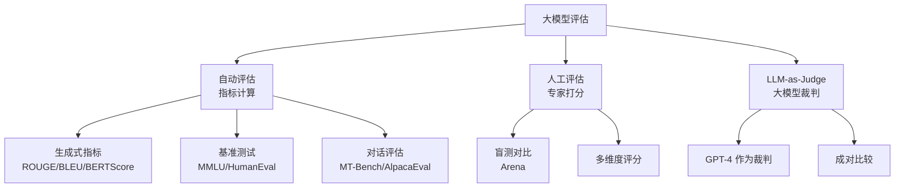
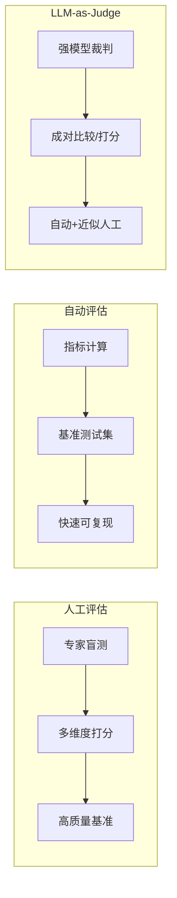
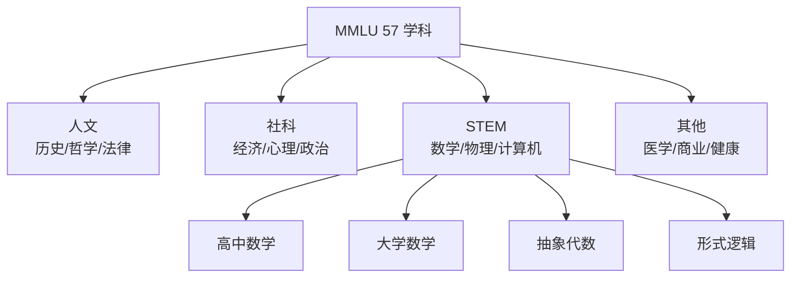
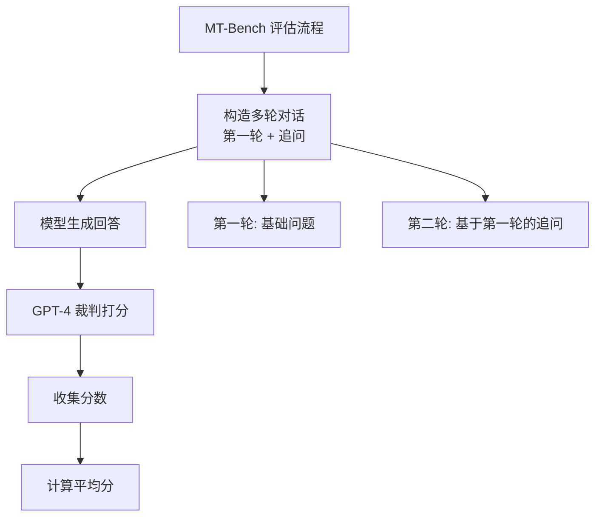
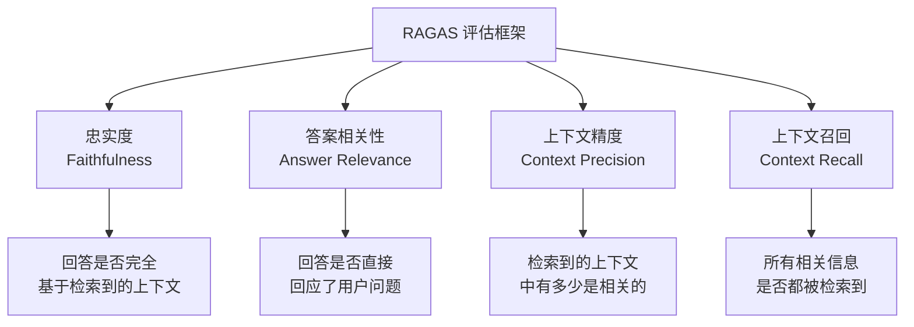
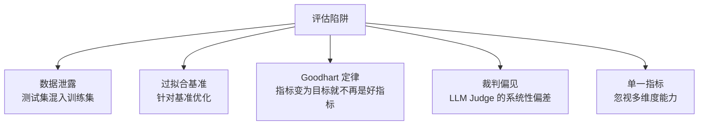
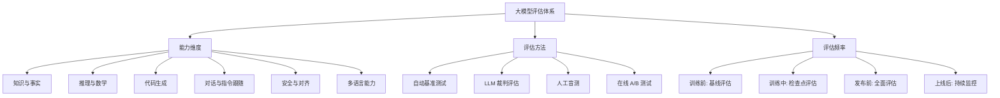

---
title: 评估体系与基准测试
description: ROUGE、BLEU、MT-Bench 等主流评估指标原理与实践，构建科学的大模型评估体系
date: 2026-06-05T10:00:00+08:00
lastmod: 2026-06-05T10:00:00+08:00
weight: 25
tags:
  - 大模型
  - 评估指标
  - ROUGE
  - BLEU
  - MT-Bench
categories:
  - 数据与评估
  - 技术分享
math: true
mermaid: true
photos:
  - https://d-sketon.top/img/backwebp/bg2.webp
---

## 引言

"如果你不能衡量它，你就不能改进它。" 这句管理学的经典格言在大模型领域同样适用。评估（Evaluation）是模型迭代的核心驱动力——没有科学的评估体系，我们就无法判断一个改进是否有效，无法比较不同方案的优劣，也无法向决策者证明投入的价值。

然而，大模型的评估远比传统机器学习困难。传统分类任务有准确率、F1 等标准指标，但大模型生成的是开放式文本，正确答案不唯一，质量判断高度主观。一个模型可能在数学推理上表现优异，却在创意写作上不尽如人意；另一个模型可能回答更流畅，但事实准确性存疑。



本文将系统讲解大模型评估的方法论，从生成式指标的数学原理到对话评估基准的实践，再到 RAG 评估框架，帮助读者建立完整的评估知识体系。

## 评估方法论

### 评估范式的演进

大模型评估经历了从"任务专用指标"到"通用能力基准"再到"LLM 裁判"的三次范式转变：

| 阶段 | 代表方法 | 优势 | 局限 |
|------|----------|------|------|
| 1.0 任务专用 | BLEU（翻译）、ROUGE（摘要） | 客观、可复现 | 无法评估开放式生成 |
| 2.0 多任务基准 | MMLU、BIG-Bench | 覆盖面广 | 数据泄露、过拟合 |
| 3.0 对话评估 | MT-Bench、Arena Elo | 贴近真实使用场景 | 依赖人工/强模型 |
| 4.0 LLM 裁判 | GPT-4 Judge | 自动、可扩展 | 裁判偏见、成本 |

### 人工评估 vs 自动评估 vs LLM-as-Judge

三种评估方法各有优劣，实践中通常组合使用：



**人工评估**是质量最高的评估方式，但成本高、速度慢、难以规模化。LMSYS Chatbot Arena 是目前最权威的人工评估平台，采用 Elo 评分系统对模型进行排名。

**自动评估**使用预定义的指标和测试集，速度快、可复现，但难以捕捉生成文本的细微质量差异。

**LLM-as-Judge** 用强模型（如 GPT-4）作为裁判评估其他模型的输出，兼顾了自动化和质量，但存在裁判偏见（如偏好冗长回答、偏好自身风格）。

## 生成式评估指标

生成式评估指标用于衡量生成文本与参考文本之间的相似度，是文本生成任务的基础评估工具。

### BLEU

BLEU（Bilingual Evaluation Understudy）是机器翻译领域最经典的自动评估指标，由 IBM 于 2002 年提出。其核心思想是：**生成文本中与参考文本匹配的 n-gram 比例越高，质量越好**。

#### 原理

BLEU 的计算分为两步：

**第一步：n-gram 精确度（Precision）**

对于 n-gram，计算生成文本中有多少 n-gram 出现在参考文本中。但直接使用精确度会导致"作弊"——生成文本可以反复重复一个正确的 n-gram 来提高分数。因此 BLEU 使用**修正的 n-gram 精确度（Modified n-gram Precision）**：

$$
p_n = \frac{\sum_{c \in \text{Candidates}} \sum_{\text{n-gram} \in c} \min\left(\text{Count}_{\text{clip}}, \text{Count}\right)}{\sum_{c \in \text{Candidates}} \sum_{\text{n-gram} \in c} \text{Count}}
$$

其中 $\text{Count}_{\text{clip}}$ 是该 n-gram 在参考文本中出现的最大次数，确保不会因为重复而虚高。

**第二步：短文本惩罚（Brevity Penalty, BP）**

修正的精确度仍然可以被"作弊"——生成文本越短，越容易让所有 n-gram 都匹配。为此引入短文本惩罚：

$$
\text{BP} = \begin{cases} 1 & \text{if } c > r \\ e^{(1-r/c)} & \text{if } c \leq r \end{cases}
$$

其中 $c$ 是生成文本长度，$r$ 是参考文本的有效长度。

**最终 BLEU 分数**：

$$
\text{BLEU} = \text{BP} \cdot \exp\left(\sum_{n=1}^{N} w_n \log p_n\right)
$$

通常取 $N=4$，$w_n = \frac{1}{4}$，记为 BLEU-4。

```python
from collections import Counter
import math


def compute_bleu(candidate, references, max_n=4, weights=None):
    """
    从零实现 BLEU 分数
    
    Args:
        candidate: 候选翻译（token 列表）
        references: 参考翻译列表（每个是 token 列表）
        max_n: 最大 n-gram 长度
        weights: n-gram 权重
    """
    if weights is None:
        weights = [1.0 / max_n] * max_n
    
    candidate = candidate.split() if isinstance(candidate, str) else candidate
    references = [r.split() if isinstance(r, str) else r for r in references]
    
    # Step 1: 计算修正的 n-gram 精确度
    precisions = []
    for n in range(1, max_n + 1):
        # 提取候选文本的 n-gram
        cand_ngrams = Counter(
            tuple(candidate[i:i+n]) for i in range(len(candidate) - n + 1)
        )
        
        # 对每个参考文本取最大出现次数
        max_ref_counts = Counter()
        for ref in references:
            ref_ngrams = Counter(
                tuple(ref[i:i+n]) for i in range(len(ref) - n + 1)
            )
            for ngram, count in ref_ngrams.items():
                max_ref_counts[ngram] = max(max_ref_counts[ngram], count)
        
        # 修正：取 min(候选计数, 参考最大计数)
        clipped_count = sum(
            min(count, max_ref_counts.get(ngram, 0))
            for ngram, count in cand_ngrams.items()
        )
        total_count = sum(cand_ngrams.values())
        
        if total_count == 0:
            precisions.append(0)
        else:
            precisions.append(clipped_count / total_count)
    
    # Step 2: 几何平均
    if min(precisions) > 0:
        log_precision = sum(w * math.log(p) for w, p in zip(weights, precisions))
        geo_mean = math.exp(log_precision)
    else:
        geo_mean = 0.0
    
    # Step 3: 短文本惩罚
    cand_len = len(candidate)
    # 有效参考长度：最接近候选长度的参考长度
    ref_lens = [len(r) for r in references]
    ref_len = min(ref_lens, key=lambda x: abs(x - cand_len))
    
    if cand_len > ref_len:
        bp = 1.0
    elif cand_len == 0:
        bp = 0.0
    else:
        bp = math.exp(1 - ref_len / cand_len)
    
    bleu = bp * geo_mean
    return bleu


# 测试
candidate = "the cat is on the mat"
references = ["the cat is on the mat", "there is a cat on the mat"]

bleu_score = compute_bleu(candidate, references)
print(f"BLEU-4 = {bleu_score:.4f}")

# 使用 NLTK 验证
from nltk.translate.bleu_score import sentence_bleu, SmoothingFunction
smoothie = SmoothingFunction().method1
nltk_bleu = sentence_bleu(
    [r.split() for r in references],
    candidate.split(),
    smoothing_function=smoothie,
)
print(f"NLTK BLEU-4 = {nltk_bleu:.4f}")
```

> **BLEU 的局限**：BLEU 完全基于表面词汇匹配，无法识别同义表达。"猫坐在垫子上"和"垫子上坐着一只猫"意思相同，但 BLEU 分数可能很低。此外，BLEU 对中文等非空格分隔语言需要先分词。

### ROUGE

ROUGE（Recall-Oriented Understudy for Gisting Evaluation）是文本摘要领域最常用的指标，与 BLEU 不同，它**以召回率为核心**——关注参考文本中的关键信息是否被生成文本覆盖。

#### ROUGE-N

ROUGE-N 衡量 n-gram 的召回率：

$$
\text{ROUGE-N} = \frac{\sum_{S \in \text{References}} \sum_{\text{n-gram} \in S} \text{Count}_{\text{match}}(\text{n-gram})}{\sum_{S \in \text{References}} \sum_{\text{n-gram} \in S} \text{Count}(\text{n-gram})}
$$

#### ROUGE-L

ROUGE-L 基于最长公共子序列（LCS, Longest Common Subsequence），能更好地捕捉句子结构层面的相似度：

$$
\text{ROUGE-L} = F_l = \frac{(1 + \beta^2) \cdot R_l \cdot P_l}{R_l + \beta^2 \cdot P_l}
$$

其中 $R_l = \frac{\text{LCS}(X, Y)}{m}$，$P_l = \frac{\text{LCS}(X, Y)}{n}$，$m$ 和 $n$ 分别是参考文本和生成文本的长度。

```python
from rouge_chinese import Rouge  # 中文 ROUGE
import jieba


def compute_rouge(candidate, references):
    """计算中文 ROUGE 分数（需先分词）"""
    # 中文需要分词
    cand_tokens = " ".join(jieba.cut(candidate))
    
    results = []
    for ref in references:
        ref_tokens = " ".join(jieba.cut(ref))
        rouge = Rouge()
        scores = rouge.get_scores(cand_tokens, ref_tokens)[0]
        results.append(scores)
    
    # 取多个参考的最大值
    best = {}
    for key in results[0]:
        best[key] = {
            metric: max(r[key][metric] for r in results)
            for metric in ["p", "r", "f"]
        }
    
    return best


# 测试
candidate = "大语言模型通过预训练和微调获得强大的语言理解能力"
references = [
    "大语言模型经过预训练与微调后具备强大的语言理解能力",
    "预训练和微调使大语言模型拥有出色的语言理解能力",
]

scores = compute_rouge(candidate, references)
for metric, values in scores.items():
    print(f"{metric}: P={values['p']:.4f} R={values['r']:.4f} F={values['f']:.4f}")
```

| 指标 | 核心思想 | 关注方向 | 主要应用 | 局限性 |
|------|----------|----------|----------|--------|
| BLEU | n-gram 精确度 | 精确率 | 机器翻译 | 无法评估语义 |
| ROUGE-N | n-gram 召回率 | 召回率 | 文本摘要 | 无法评估流畅性 |
| ROUGE-L | 最长公共子序列 | F 值 | 文本摘要 | 对词序敏感 |
| METEOR | 对齐+同义词 | F 值+惩罚 | 翻译/摘要 | 需要同义词库 |

### BERTScore

BERTScore 利用预训练语言模型（如 BERT）的嵌入来计算生成文本与参考文本的语义相似度，克服了 BLEU/ROUGE 仅依赖表面匹配的局限。

```python
from bert_score import score


def compute_bertscore(candidates, references, model_type="bert-base-chinese"):
    """
    计算 BERTScore
    
    Args:
        candidates: 生成文本列表
        references: 参考文本列表
        model_type: 使用的预训练模型
    """
    P, R, F1 = score(
        candidates,
        references,
        model_type=model_type,
        lang="zh",
        verbose=True,
    )
    
    print(f"\nBERTScore (mean):")
    print(f"  Precision: {P.mean().item():.4f}")
    print(f"  Recall:    {R.mean().item():.4f}")
    print(f"  F1:        {F1.mean().item():.4f}")
    
    return {"P": P, "R": R, "F1": F1}


# 测试
candidates = [
    "大语言模型通过预训练获得强大的语言能力",
    "人工智能正在改变我们的生活方式",
]
references = [
    "预训练使大语言模型具备出色的语言理解能力",
    "AI 技术正在深刻影响人类的生活",
]

compute_bertscore(candidates, references)
```

BERTScore 的优势在于能识别同义表达——即使词汇不完全匹配，只要语义接近就能获得高分。其原理是对每个 token 计算上下文嵌入，然后通过余弦相似度找到最佳匹配：

$$
P_{\text{BERT}} = \frac{1}{|\hat{x}|} \sum_{\hat{x}_j \in \hat{x}} \max_{x_i \in x} \mathbf{e}_{x_i}^\top \mathbf{e}_{\hat{x}_j}
$$

其中 $\mathbf{e}_{x_i}$ 和 $\mathbf{e}_{\hat{x}_j}$ 分别是参考文本和生成文本中 token 的嵌入向量。

## 知识与推理基准

### MMLU

MMLU（Massive Multitask Language Understanding）是目前最广泛使用的知识评估基准，包含 57 个学科的多选题，覆盖人文、社科、STEM 等领域。



```python
import json
from datasets import load_dataset


def evaluate_mmlu(model, num_fewshot=5):
    """评估模型在 MMLU 上的表现"""
    ds = load_dataset("cais/mmlu", "all", split="test")
    
    correct = 0
    total = 0
    results_by_subject = {}
    
    for item in ds:
        subject = item["subject"]
        question = item["question"]
        choices = item["choices"]
        answer = item["answer"]  # 0=A, 1=B, 2=C, 3=D
        
        # 构造 prompt（Few-shot 格式）
        prompt = format_mmlu_question(question, choices)
        
        # 获取模型预测
        prediction = model.generate(prompt)
        pred_idx = parse_choice(prediction)  # 解析为 0-3
        
        if pred_idx == answer:
            correct += 1
            results_by_subject.setdefault(subject, {"correct": 0, "total": 0})
            results_by_subject[subject]["correct"] += 1
        
        results_by_subject.setdefault(subject, {"correct": 0, "total": 0})
        results_by_subject[subject]["total"] += 1
        total += 1
    
    accuracy = correct / total
    print(f"MMLU 总准确率: {accuracy:.4f}")
    
    # 按学科输出
    print("\n各学科准确率:")
    for subject, stats in sorted(results_by_subject.items()):
        acc = stats["correct"] / stats["total"]
        print(f"  {subject}: {acc:.4f} ({stats['correct']}/{stats['total']})")
    
    return accuracy


def format_mmlu_question(question, choices):
    """格式化 MMLU 题目"""
    letters = ["A", "B", "C", "D"]
    options = "\n".join(f"{l}. {c}" for l, c in zip(letters, choices))
    return f"Question: {question}\n\n{options}\n\nAnswer:"


def parse_choice(text):
    """从模型输出中解析选项"""
    text = text.strip().upper()
    for i, letter in enumerate(["A", "B", "C", "D"]):
        if text.startswith(letter):
            return i
    return -1  # 无法解析
```

> **数据泄露风险**：MMLU 的题目来自公开考试和教材，大模型的预训练数据中可能包含了这些题目，导致评估分数虚高。建议使用动态更新的基准（如 LiveBench）来缓解这一问题。

### 其他主流知识基准

| 基准 | 领域 | 题型 | 题量 | 特点 |
|------|------|------|------|------|
| MMLU | 综合知识 | 多选 | 14,042 | 57 学科覆盖 |
| C-Eval | 中文综合 | 多选 | 13,948 | 中文知识评估 |
| CMMLU | 中文综合 | 多选 | 11,528 | 中文多任务 |
| AGIEval | 中英综合 | 多选/填空 | 8,062 | 标准化考试 |
| BIG-Bench | 综合能力 | 多样 | 204 任务 | 社区共建 |
| BBH | 推理 | 多样 | 23 任务 | BIG-Bench 难题子集 |

## 代码评估

### HumanEval 与 Pass@k

HumanEval 是 OpenAI 提出的代码生成评估基准，包含 164 个 Python 编程问题。评估指标 Pass@k 衡量模型在前 k 个采样中至少有一个通过所有测试用例的概率。

#### Pass@k 原理

给定一个问题，模型生成 $n$ 个候选解（$n \geq k$），其中 $c$ 个通过了测试。Pass@k 的无偏估计为：

$$
\text{Pass@k} = 1 - \frac{\binom{n-c}{k}}{\binom{n}{k}}
$$

这个公式的含义是：从 $n$ 个候选中随机选 $k$ 个，至少有一个正确的概率。当 $c < k$ 时，分子为 0，Pass@k = 1。

```python
import numpy as np
from collections import namedtuple


Problem = namedtuple("Problem", ["task_id", "prompt", "entry_point", "test"])


def pass_at_k(n, c, k):
    """
    计算 Pass@k 的无偏估计
    
    Args:
        n: 生成的候选总数
        c: 通过的候选数
        k: 选取的候选数
    """
    if n - c < k:
        return 1.0
    # 使用对数避免数值溢出
    from math import comb
    return 1.0 - comb(n - c, k) / comb(n, k)


def evaluate_humaneval(model, problems, n_samples=10, k_values=(1, 5, 10)):
    """
    评估模型在 HumanEval 上的 Pass@k
    
    Args:
        model: 代码生成模型
        problems: HumanEval 问题列表
        n_samples: 每个问题的采样数
        k_values: 要计算的 k 值
    """
    results = {k: [] for k in k_values}
    
    for problem in problems:
        # 为每个问题生成 n_samples 个候选解
        candidates = []
        for _ in range(n_samples):
            code = model.generate(problem.prompt, temperature=0.8)
            candidates.append(code)
        
        # 执行测试，统计通过数
        passed = 0
        for code in candidates:
            if run_code_tests(code, problem.test, problem.entry_point):
                passed += 1
        
        # 计算 Pass@k
        for k in k_values:
            score = pass_at_k(n_samples, passed, k)
            results[k].append(score)
    
    # 汇总
    for k in k_values:
        mean_score = np.mean(results[k])
        print(f"Pass@{k}: {mean_score:.4f}")
    
    return results


def run_code_tests(code, test_code, entry_point):
    """执行代码并运行测试用例"""
    try:
        # 创建隔离的执行环境
        namespace = {}
        full_code = code + "\n" + test_code + f"\ncheck({entry_point})"
        exec(full_code, namespace)
        return True
    except Exception:
        return False


# 数值示例
print("Pass@k 示例:")
print(f"  n=10, c=3, k=1: {pass_at_k(10, 3, 1):.4f}")
print(f"  n=10, c=3, k=5: {pass_at_k(10, 3, 5):.4f}")
print(f"  n=10, c=8, k=1: {pass_at_k(10, 8, 1):.4f}")
```

> **安全提示**：执行模型生成的代码存在安全风险。生产环境中应使用沙箱（如 Docker 容器、gVisor）隔离执行环境，限制网络和文件系统访问。

### 其他代码评估基准

| 基准 | 语言 | 题量 | 特点 |
|------|------|------|------|
| HumanEval | Python | 164 | 函数级生成 |
| MBPP | Python | 974 | 入门级编程 |
| CodeContests | 多语言 | ~13K | 竞赛编程 |
| MultiPL-E | 18 语言 | 2,952 | 多语言扩展 |
| LiveCodeBench | 多语言 | 持续更新 | 防数据泄露 |
| SWE-bench | Python | 2,294 | 真实 GitHub Issue 修复 |

## 对话评估基准

对话评估是大模型时代最重要的评估范式，因为模型的最终使用场景是对话交互。与知识基准不同，对话评估关注的是模型回答的"有用性"和"自然度"，而非简单的正确性。

### MT-Bench

MT-Bench（Multi-Turn Benchmark）由 LMSYS 提出，包含 80 道多轮对话题目，覆盖 8 个类别：写作、推理、数学、编程、提取、STEM、人文、角色扮演。评估使用 GPT-4 作为裁判，对模型的每一轮回答打 1-10 分。



```python
import openai
import json


class MTBenchEvaluator:
    """MT-Bench 评估器（GPT-4 as Judge）"""
    
    JUDGE_PROMPT = """你是一个公正的评估专家。请对以下 AI 助手的回答进行评分。

评分标准（1-10 分）：
- 10分: 完美回答，准确、全面、有帮助
- 8-9分: 优秀，有极小瑕疵
- 6-7分: 良好，基本满足需求
- 4-5分: 一般，有明显不足
- 1-3分: 差，回答错误或无关

用户问题: {question}

AI 助手的回答: {answer}

参考答案（如有）: {reference}

请先简要分析回答的优缺点，然后在最后一行输出分数，格式为: [分数]
"""
    
    def __init__(self, judge_model="gpt-4o"):
        self.client = openai.OpenAI()
        self.judge_model = judge_model
    
    def judge_single(self, question, answer, reference=""):
        """让 GPT-4 对单个回答打分"""
        prompt = self.JUDGE_PROMPT.format(
            question=question,
            answer=answer,
            reference=reference,
        )
        
        resp = self.client.chat.completions.create(
            model=self.judge_model,
            messages=[{"role": "user", "content": prompt}],
            temperature=0.0,
        )
        
        text = resp.choices[0].message.content
        # 解析最后一行的分数
        score = self._parse_score(text)
        return score, text
    
    def _parse_score(self, text):
        """从裁判输出中解析分数"""
        import re
        # 匹配 [分数] 或 [score] 格式
        match = re.search(r'\[(\d+(?:\.\d+)?)\]', text)
        if match:
            return float(match.group(1))
        # 回退：提取最后一个数字
        numbers = re.findall(r'\d+', text)
        return float(numbers[-1]) if numbers else 0.0
    
    def evaluate_conversation(self, questions, model_answers):
        """评估多轮对话"""
        scores = []
        for q, a in zip(questions, model_answers):
            score, reasoning = self.judge_single(q, a)
            scores.append(score)
            print(f"  Q: {q[:50]}...")
            print(f"  Score: {score}/10")
            print(f"  Reasoning: {reasoning[:100]}...")
            print()
        
        avg = sum(scores) / len(scores)
        print(f"平均分: {avg:.2f}/10")
        return avg


# 使用示例
evaluator = MTBenchEvaluator()

questions = [
    "请用通俗易懂的语言解释什么是量子纠缠",
    "基于你刚才的解释，量子纠缠在通信领域有什么潜在应用？",
]
answers = [
    "量子纠缠是指两个粒子之间存在一种特殊的关联...",
    "基于量子纠缠的特性，量子通信可以实现绝对安全的信息传输...",
]

evaluator.evaluate_conversation(questions, answers)
```

### AlpacaEval

AlpacaEval 是一个快速的自动评估方法，使用 GPT-4 对模型回答与参考回答（通常是 Text-Davinci-003）进行成对比较，计算胜率（Win Rate）。

```python
class AlpacaEvaluator:
    """AlpacaEval 评估器"""
    
    COMPARISON_PROMPT = """你是一个公正的裁判。以下是一个用户问题和两个 AI 助手的回答。
请判断哪个回答更好。

用户问题: {instruction}

回答 A: {output_a}
回答 B: {output_b}

请选择更好的回答（A 或 B），或者判为平局（Tie）。
如果难以判断，请选择信息更丰富、更准确的回答。

请先简要分析两个回答的差异，然后在最后一行输出: [A] 或 [B] 或 [Tie]
"""
    
    def __init__(self, judge_model="gpt-4o"):
        self.client = openai.OpenAI()
        self.judge_model = judge_model
    
    def pairwise_compare(self, instruction, output_a, output_b):
        """成对比较"""
        prompt = self.COMPARISON_PROMPT.format(
            instruction=instruction,
            output_a=output_a,
            output_b=output_b,
        )
        
        resp = self.client.chat.completions.create(
            model=self.judge_model,
            messages=[{"role": "user", "content": prompt}],
            temperature=0.0,
        )
        
        text = resp.choices[0].message.content
        winner = self._parse_winner(text)
        return winner
    
    def _parse_winner(self, text):
        import re
        match = re.search(r'\[(A|B|Tie)\]', text)
        return match.group(1) if match else "Tie"
    
    def compute_win_rate(self, instructions, model_outputs, baseline_outputs):
        """计算模型相对基线的胜率"""
        wins = 0
        ties = 0
        n = len(instructions)
        
        for inst, model_out, baseline_out in zip(instructions, model_outputs, baseline_outputs):
            # 随机化顺序，消除位置偏见
            import random
            if random.random() > 0.5:
                winner = self.pairwise_compare(inst, model_out, baseline_out)
                if winner == "A":
                    wins += 1
                elif winner == "Tie":
                    ties += 1
            else:
                winner = self.pairwise_compare(inst, baseline_out, model_out)
                if winner == "B":
                    wins += 1
                elif winner == "Tie":
                    ties += 1
        
        win_rate = wins / n
        adjusted_win_rate = (wins + 0.5 * ties) / n  # 平局计半胜
        
        print(f"胜率: {win_rate:.2%}")
        print(f"调整后胜率（平局计半）: {adjusted_win_rate:.2%}")
        return win_rate
```

### Chatbot Arena Elo

LMSYS Chatbot Arena 是目前最具公信力的大模型排名系统。它采用**盲测**方式：用户输入一个提示词后，两个匿名模型分别生成回答，用户选择更好的一个。系统使用 **Elo 评分系统**（国际象棋使用的排名方法）来更新模型分数。

```python
def expected_score(rating_a, rating_b):
    """计算 Elo 预期得分"""
    return 1.0 / (1.0 + 10 ** ((rating_b - rating_a) / 400))


def update_elo(rating_a, rating_b, actual_score, k=32):
    """
    更新 Elo 评分
    
    Args:
        rating_a: 模型 A 的当前评分
        rating_b: 模型 B 的当前评分
        actual_score: A 的实际得分（1=胜, 0.5=平, 0=负）
        k: K 因子，控制评分变化幅度
    """
    expected_a = expected_score(rating_a, rating_b)
    new_rating_a = rating_a + k * (actual_score - expected_a)
    new_rating_b = rating_b + k * ((1 - actual_score) - (1 - expected_a))
    return new_rating_a, new_rating_b


# 模拟 Arena 排名
ratings = {
    "GPT-4o": 1300,
    "Claude-3.5": 1280,
    "Gemini-1.5": 1250,
    "Llama-3-70B": 1200,
    "Qwen-2-72B": 1180,
}

# 模拟一场对决: Claude-3.5 vs Llama-3-70B, Claude 胜
ra, rb = update_elo(ratings["Claude-3.5"], ratings["Llama-3-70B"], actual_score=1.0)
ratings["Claude-3.5"] = round(ra)
ratings["Llama-3-70B"] = round(rb)

print("更新后排名:")
for model, rating in sorted(ratings.items(), key=lambda x: -x[1]):
    print(f"  {model}: {rating}")
```

### 对话评估基准对比

| 基准 | 方法 | 评委 | 规模 | 优势 | 局限 |
|------|------|------|------|------|------|
| MT-Bench | 多轮打分 | GPT-4 | 80 题 | 多轮深度评估 | 题量小 |
| AlpacaEval 2.0 | 成对比较 | GPT-4 | 805 题 | 快速、与人工高度相关 | 依赖 GPT-4 |
| Chatbot Arena | 盲测 Elo | 真实用户 | 持续收集 | 最贴近真实使用 | 不可复现 |
| FastChat | 成对比较 | GPT-4 | 可扩展 | 开源框架 | 裁判偏见 |

## RAG 评估

检索增强生成（RAG）系统需要专门的评估框架，因为其质量同时取决于检索和生成两个环节。RAGAS（RAG Assessment）是目前最流行的 RAG 评估框架，从三个核心维度评估 RAG 系统。



### 忠实度（Faithfulness）

忠实度衡量生成答案中的每个陈述是否都能在检索到的上下文中找到依据。高忠实度意味着模型没有"幻觉"——所有信息都有据可查。

$$
\text{Faithfulness} = \frac{\text{能被上下文支撑的陈述数}}{\text{答案中的总陈述数}}
$$

### 答案相关性（Answer Relevance）

答案相关性衡量回答与用户问题的相关程度。高相关性意味着回答紧扣问题，没有跑题或冗余。

### 上下文精度与召回

- **上下文精度**：检索到的文档中，相关文档的排名是否靠前
- **上下文召回**：所有需要的信息是否都被检索到

```python
from ragas import evaluate
from ragas.metrics import (
    faithfulness,
    answer_relevancy,
    context_precision,
    context_recall,
)
from datasets import Dataset


def evaluate_rag_system(questions, answers, contexts, ground_truths):
    """
    使用 RAGAS 评估 RAG 系统
    
    Args:
        questions: 用户问题列表
        answers: RAG 系统生成的答案列表
        contexts: 检索到的上下文列表（每个问题是文档列表）
        ground_truths: 参考答案列表
    """
    # 构建评估数据集
    eval_data = {
        "question": questions,
        "answer": answers,
        "contexts": contexts,
        "ground_truth": ground_truths,
    }
    dataset = Dataset.from_dict(eval_data)
    
    # 执行评估
    results = evaluate(
        dataset=dataset,
        metrics=[
            faithfulness,
            answer_relevancy,
            context_precision,
            context_recall,
        ],
    )
    
    # 输出结果
    print("=" * 50)
    print("RAG 系统评估结果")
    print("=" * 50)
    for metric, value in results.items():
        print(f"  {metric}: {value:.4f}")
    
    # 详细分析
    print("\n逐条分析:")
    df = results.to_pandas()
    for idx, row in df.iterrows():
        print(f"\n  Q{idx+1}: {row['question'][:60]}...")
        print(f"    忠实度:     {row['faithfulness']:.2f}")
        print(f"    答案相关性: {row['answer_relevancy']:.2f}")
        print(f"    上下文精度: {row['context_precision']:.2f}")
        print(f"    上下文召回: {row['context_recall']:.2f}")
    
    return results


# 手动实现忠实度评估（不依赖 LLM 的简化版）
def faithfulness_check(answer, contexts):
    """
    简化的忠实度检查：检查答案中的句子是否与上下文有足够重叠
    
    注意：完整版需要 LLM 将答案分解为原子陈述并逐一验证
    """
    import numpy as np
    from sklearn.feature_extraction.text import TfidfVectorizer
    from sklearn.metrics.pairwise import cosine_similarity
    
    answer_sentences = answer.split("。")
    answer_sentences = [s.strip() for s in answer_sentences if s.strip()]
    
    context_text = " ".join(contexts)
    
    vectorizer = TfidfVectorizer()
    all_texts = answer_sentences + [context_text]
    tfidf_matrix = vectorizer.fit_transform(all_texts)
    
    supported = 0
    for i in range(len(answer_sentences)):
        sim = cosine_similarity(tfidf_matrix[i:i+1], tfidf_matrix[-1:])[0][0]
        if sim > 0.3:  # 相似度阈值
            supported += 1
    
    faithfulness = supported / len(answer_sentences) if answer_sentences else 0
    return faithfulness


# 测试
answer = "大语言模型是一种基于 Transformer 架构的 AI 模型。它通过预训练学习语言规律。"
contexts = [
    "大语言模型（LLM）是一种基于 Transformer 架构的人工智能模型。",
    "LLM 通过在海量文本上预训练来学习语言的统计规律和世界知识。",
]
score = faithfulness_check(answer, contexts)
print(f"忠实度（简化版）: {score:.2f}")
```

### RAG 评估指标解读

| 指标 | 衡量目标 | 高分含义 | 低分含义 |
|------|----------|----------|----------|
| 忠实度 | 答案有无幻觉 | 答案有据可查 | 存在幻觉 |
| 答案相关性 | 是否切题 | 回答紧扣问题 | 跑题或冗余 |
| 上下文精度 | 检索质量 | 相关文档排名靠前 | 噪声文档多 |
| 上下文召回 | 检索完整性 | 需要的信息都检索到了 | 信息遗漏 |

> **诊断策略**：如果忠实度低但上下文召回高，说明生成模型有幻觉问题；如果忠实度高但答案相关性低，说明检索结果虽然准确但与问题不匹配；如果上下文召回低，说明检索器需要优化。

## 评估陷阱与最佳实践

### 常见评估陷阱



#### 1. 数据泄露

大模型的预训练数据来自互联网爬取，很可能包含了 MMLU、HumanEval 等基准的题目。这导致评估分数虚高，无法反映真实能力。

**对策**：
- 使用持续更新的基准（如 LiveBench、LiveCodeBench）
- 构造私有测试集，不公开发布
- 使用成员推理检测（Membership Inference）评估泄露程度

#### 2. LLM 裁判偏见

使用 GPT-4 作为裁判时存在系统性偏见：

- **位置偏见**：倾向于选择第一个或最后一个回答
- **长度偏见**：倾向于选择更长的回答
- **风格偏见**：倾向于选择与自身风格相似的回答

**对策**：

```python
def debiased_comparison(judge_fn, instruction, answer_a, answer_b):
    """去偏见的成对比较：交换位置后取平均"""
    # 原始顺序
    result_1 = judge_fn(instruction, answer_a, answer_b)
    
    # 交换顺序
    result_2 = judge_fn(instruction, answer_b, answer_a)
    # 翻转结果
    if result_2 == "A":
        result_2 = "B"
    elif result_2 == "B":
        result_2 = "A"
    
    # 如果两次一致，结果可信
    if result_1 == result_2:
        return result_1
    else:
        return "Tie"  # 不一致则判平
```

#### 3. Goodhart 定律

"当一个指标变成目标时，它就不再是一个好指标。" 如果团队过度追求 MMLU 分数，模型可能会在 MMLU 上过拟合，但实际能力并没有提升。

**对策**：使用多维度的评估矩阵，而非单一分数。

### 评估最佳实践

```python
class EvaluationBestPractices:
    """评估最佳实践清单"""
    
    CHECKLIST = {
        "数据安全": [
            "检查测试集是否出现在训练数据中",
            "使用 N-gram 重叠检测数据泄露",
            "维护私有评估集",
        ],
        "评估设计": [
            "使用多维评估矩阵（知识、推理、代码、安全）",
            "结合自动评估和人工评估",
            "定期更新评估基准",
        ],
        "统计分析": [
            "报告置信区间和统计显著性",
            "进行多次实验取平均",
            "关注方差而不仅是均值",
        ],
        "可复现性": [
            "固定随机种子",
            "记录评估的完整配置",
            "开源评估代码和脚本",
        ],
    }
    
    @classmethod
    def print_checklist(cls):
        for category, items in cls.CHECKLIST.items():
            print(f"\n{category}:")
            for item in items:
                print(f"  [ ] {item}")


EvaluationBestPractices.print_checklist()
```

### 统计显著性检验

在比较两个模型时，不能仅看平均分的差异，还需要进行统计显著性检验，确认差异不是随机波动。

```python
from scipy import stats
import numpy as np


def compare_models(scores_a, scores_b, alpha=0.05):
    """
    比较两个模型的评估分数是否显著不同
    
    Args:
        scores_a: 模型 A 在各题上的得分
        scores_b: 模型 B 在各题上的得分
        alpha: 显著性水平
    """
    # 配对 t 检验（适用于同一测试集上的配对比较）
    t_stat, p_value = stats.ttest_rel(scores_a, scores_b)
    
    mean_diff = np.mean(scores_a) - np.mean(scores_b)
    
    print(f"模型 A 平均分: {np.mean(scores_a):.4f}")
    print(f"模型 B 平均分: {np.mean(scores_b):.4f}")
    print(f"差值: {mean_diff:.4f}")
    print(f"t 统计量: {t_stat:.4f}")
    print(f"p 值: {p_value:.6f}")
    
    if p_value < alpha:
        winner = "A" if mean_diff > 0 else "B"
        print(f"结论: 模型 {winner} 显著优于对方 (p < {alpha})")
    else:
        print(f"结论: 两者无显著差异 (p >= {alpha})")
    
    return p_value


# 示例：比较两个模型在 100 道题上的表现
np.random.seed(42)
model_a_scores = np.random.binomial(1, 0.75, 100).astype(float)  # 75% 准确率
model_b_scores = np.random.binomial(1, 0.70, 100).astype(float)  # 70% 准确率

compare_models(model_a_scores, model_b_scores)
```

## 综合评估体系设计

一个成熟的大模型评估体系应该是多维度、多层次的：



```python
class ComprehensiveEvaluation:
    """综合评估框架"""
    
    DIMENSIONS = {
        "知识与事实": {
            "benchmarks": ["MMLU", "C-Eval", "TriviaQA"],
            "weight": 0.2,
        },
        "推理与数学": {
            "benchmarks": ["GSM8K", "MATH", "BBH"],
            "weight": 0.2,
        },
        "代码生成": {
            "benchmarks": ["HumanEval", "MBPP", "LiveCodeBench"],
            "weight": 0.15,
        },
        "对话能力": {
            "benchmarks": ["MT-Bench", "AlpacaEval"],
            "weight": 0.2,
        },
        "安全与对齐": {
            "benchmarks": ["ToxiGen", "TruthfulQA", "AdvBench"],
            "weight": 0.15,
        },
        "多语言": {
            "benchmarks": ["MGSM", "XQuAD"],
            "weight": 0.1,
        },
    }
    
    def run_full_evaluation(self, model):
        """运行全面评估"""
        all_scores = {}
        
        for dimension, config in self.DIMENSIONS.items():
            print(f"\n{'='*40}")
            print(f"评估维度: {dimension} (权重: {config['weight']:.0%})")
            print(f"{'='*40}")
            
            dim_scores = []
            for benchmark in config["benchmarks"]:
                score = self._run_benchmark(model, benchmark)
                dim_scores.append(score)
                all_scores[f"{dimension}/{benchmark}"] = score
            
            avg = sum(dim_scores) / len(dim_scores)
            all_scores[f"{dimension}/average"] = avg
            print(f"  维度平均: {avg:.4f}")
        
        # 计算加权总分
        weighted_total = sum(
            all_scores[f"{d}/average"] * c["weight"]
            for d, c in self.DIMENSIONS.items()
        )
        all_scores["综合得分"] = weighted_total
        
        print(f"\n{'='*40}")
        print(f"综合得分: {weighted_total:.4f}")
        print(f"{'='*40}")
        
        return all_scores
    
    def _run_benchmark(self, model, benchmark):
        """运行单个基准测试（占位）"""
        # 实际实现中调用对应的评估逻辑
        import random
        return random.uniform(0.5, 0.9)
```

## 结语

评估是大模型迭代的核心驱动力。一套科学的评估体系不仅能告诉我们"模型有多好"，更能指引"下一步该往哪里走"。回顾本文的核心要点：

1. **没有万能指标**——不同任务需要不同的评估方法，组合使用自动评估、LLM 裁判和人工评估才能全面覆盖
2. **生成式指标**（BLEU、ROUGE、BERTScore）适合有参考答案的任务，但对开放式生成力不从心
3. **对话评估基准**（MT-Bench、AlpacaEval、Arena）更贴近真实使用场景，是当前的主流方向
4. **代码评估**使用 Pass@k 指标，通过实际执行测试用例来判断正确性
5. **RAG 评估**需要同时关注检索质量和生成质量，RAGAS 框架提供了系统化的方法
6. **警惕评估陷阱**——数据泄露、裁判偏见、Goodhart 定律都会导致评估失真

最重要的是，评估不是一次性工作，而是贯穿模型全生命周期的持续过程。建立完善的评估体系，是构建可靠 AI 产品的基础。

---

**参考文献**：

1. Papineni K, et al. BLEU: a Method for Automatic Evaluation of Machine Translation. ACL 2002.
2. Lin C Y. ROUGE: A Package for Automatic Evaluation of Summaries. ACL 2004.
3. Zhang T, et al. BERTScore: Evaluating Text Generation with BERT. ICLR 2020.
4. Zheng L, et al. Judging LLM-as-a-Judge with MT-Bench and Chatbot Arena. NeurIPS 2023.
5. Dubois Y, et al. AlpacaFarm: A Simulation Framework for Methods that Learn from Human Feedback. NeurIPS 2023.
6. Chen M, et al. Evaluating Large Language Models Trained on Code. arXiv 2021.
7. Hendrycks D, et al. Measuring Massive Multitask Language Understanding. ICLR 2021.
8. Es S, et al. RAGAS: Automated Evaluation of Retrieval Augmented Generation. EACL 2024.
9. Chiang W L, et al. Chatbot Arena: An Open Platform for Evaluating LLMs by Human Preference. arXiv 2024.
