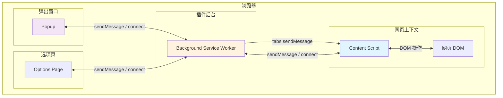
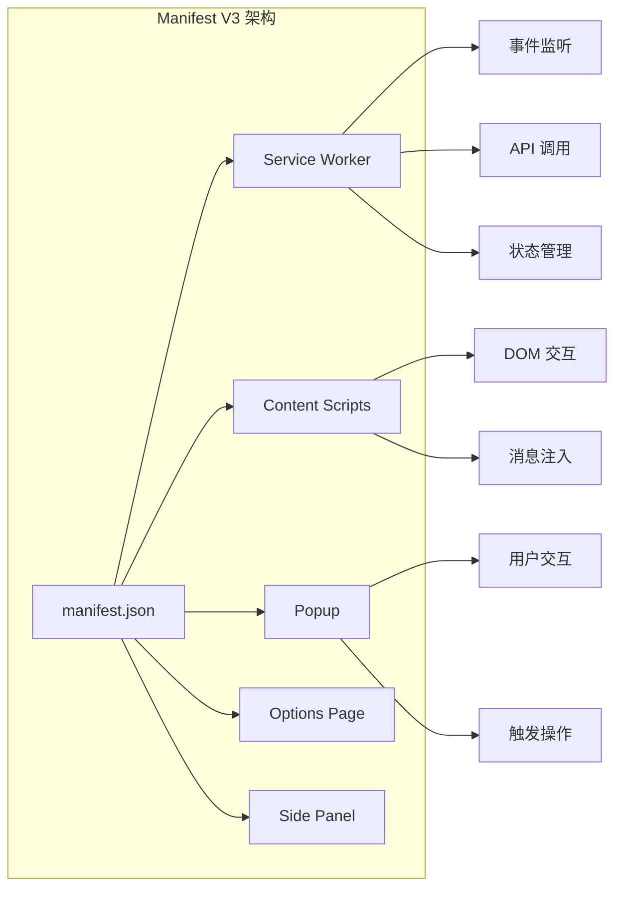
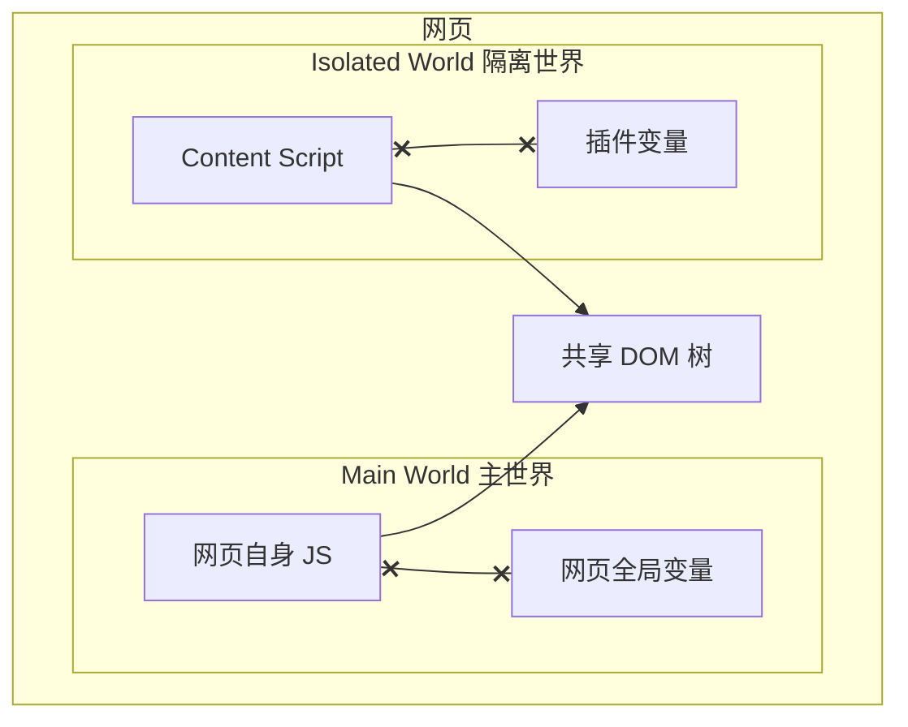
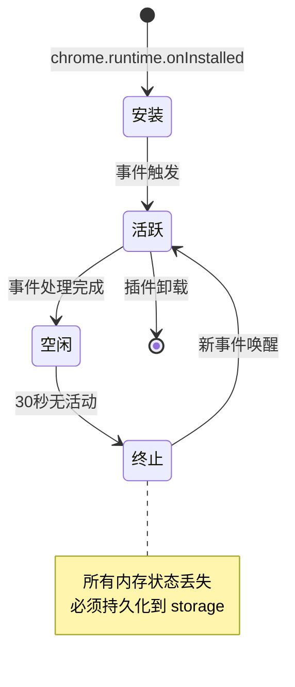
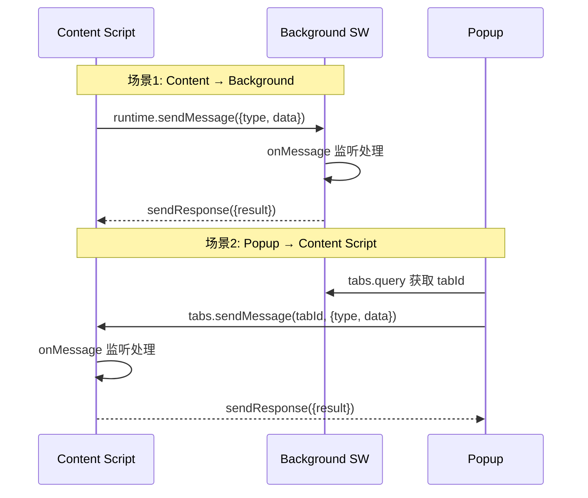
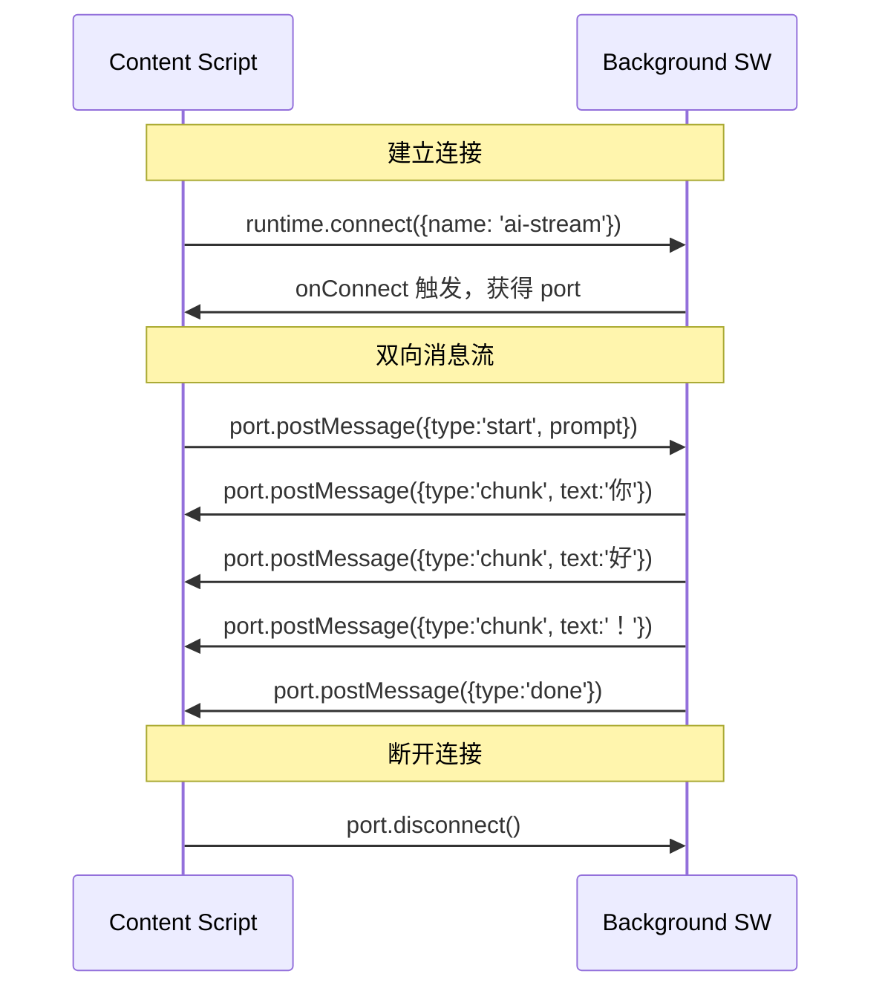
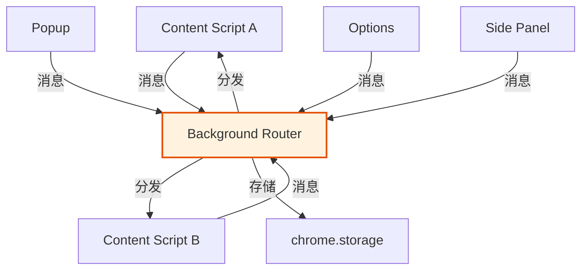
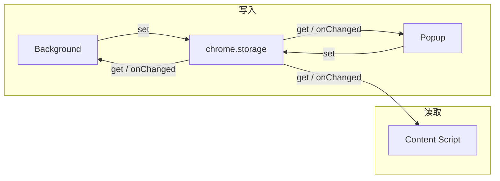
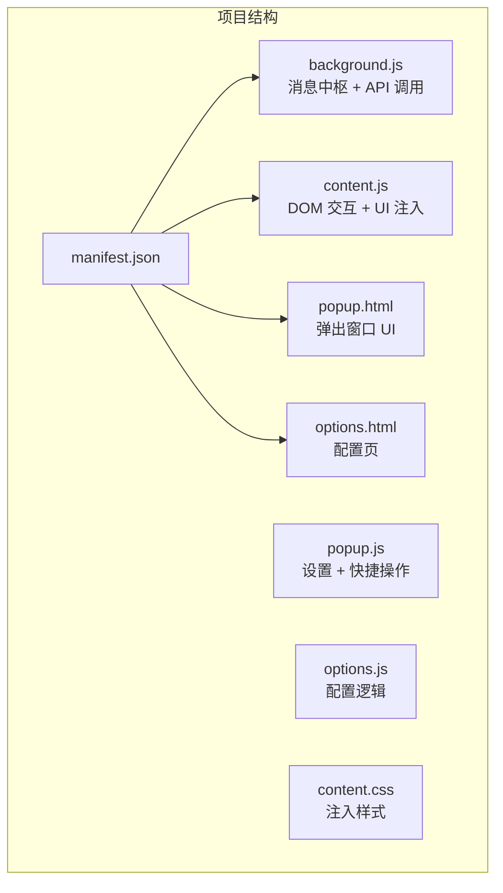

## 引言

当你想在浏览器中集成 AI 能力——比如选中网页文本一键翻译、右键调用 LLM 总结长文、或者在任意页面注入 AI 对话窗口——Chrome Extension 是最自然的载体。然而，插件的开发难点不在于 UI，而在于**通信**。

一个 Chrome Extension 由多个独立运行环境组成：`content script` 运行在网页上下文中，`background service worker` 运行在后台，`popup` 运行在弹出窗口中。它们各自拥有独立的 JavaScript 枒、独立的 DOM、独立的生命周期。如何在这些隔离的环境之间高效、可靠地传递数据和协调行为，是插件开发的核心命题。



本文将从 Manifest V3 架构出发，深入剖析每一个通信通道的原理、API 用法和实战技巧，最后通过一个完整的 AI 插件案例串联所有知识点。

## Manifest V3 架构概览

### 从 V2 到 V3 的演进

Manifest V3 是 Chrome 扩展平台的重大架构变革，其核心变化围绕**安全性**和**性能**展开：

| 特性 | Manifest V2 | Manifest V3 |
|------|-------------|-------------|
| **后台脚本** | Background Page（持久页面） | Service Worker（事件驱动，可休眠） |
| **网络请求** | `webRequest`（可阻塞） | `declarativeNetRequest`（声明式） |
| **远程代码** | 允许 `eval` 和远程脚本 | 禁止，所有代码必须打包 |
| **CSP** | 可配置 `unsafe-eval` | 严格限制，不允许 `unsafe-eval` |
| **Promise** | 主要用 Callback | 全面支持 Promise |
| **Service Worker 生命周期** | 持久运行 | 30 秒空闲后终止 |

### 核心组件架构



一个典型的 `manifest.json` 配置如下：

```json
{
  "manifest_version": 3,
  "name": "AI Assistant Extension",
  "version": "1.0.0",
  "description": "在任意网页中调用 AI 能力",

  "background": {
    "service_worker": "background.js",
    "type": "module"
  },

  "content_scripts": [
    {
      "matches": ["<all_urls>"],
      "js": ["content.js"],
      "css": ["content.css"],
      "run_at": "document_idle"
    }
  ],

  "action": {
    "default_popup": "popup.html",
    "default_icon": {
      "16": "icons/icon16.png",
      "48": "icons/icon48.png",
      "128": "icons/icon128.png"
    }
  },

  "permissions": [
    "activeTab",
    "contextMenus",
    "storage",
    "scripting"
  ],

  "host_permissions": [
    "https://*/*",
    "http://*/*"
  ],

  "options_page": "options.html"
}
```

## Content Script 与页面交互

### Content Script 的运行环境

Content Script 是注入到网页中的 JavaScript，它运行在一个**隔离世界（Isolated World）**中。这意味着它与网页自身的 JavaScript 共享 DOM，但不共享变量和函数。



这种设计带来了两个重要特性：

1. **DOM 共享**：Content Script 可以自由读写网页 DOM
2. **JS 隔离**：Content Script 的变量不会污染网页，网页的变量也不会干扰插件

### DOM 操作实践

```javascript
// content.js - Content Script 操作网页 DOM

// 1. 获取用户选中的文本
function getSelectedText() {
  const selection = window.getSelection();
  return selection ? selection.toString().trim() : '';
}

// 2. 在选中位置附近创建 AI 结果浮层
function createResultBubble(text, position) {
  // 移除已有的浮层
  const existing = document.getElementById('ai-result-bubble');
  if (existing) existing.remove();

  const bubble = document.createElement('div');
  bubble.id = 'ai-result-bubble';
  bubble.style.cssText = `
    position: fixed;
    left: ${position.x}px;
    top: ${position.y}px;
    max-width: 400px;
    padding: 16px;
    background: #ffffff;
    border: 1px solid #e0e0e0;
    border-radius: 12px;
    box-shadow: 0 8px 32px rgba(0,0,0,0.12);
    z-index: 2147483647;
    font-family: -apple-system, sans-serif;
    font-size: 14px;
    line-height: 1.6;
    color: #1a1a1a;
  `;
  bubble.textContent = text;
  document.body.appendChild(bubble);

  // 点击其他区域关闭
  setTimeout(() => {
    const handler = (e) => {
      if (!bubble.contains(e.target)) {
        bubble.remove();
        document.removeEventListener('click', handler);
      }
    };
    document.addEventListener('click', handler);
  }, 100);
}

// 3. 监听鼠标释放事件（选中文本后）
document.addEventListener('mouseup', (event) => {
  const text = getSelectedText();
  if (text.length < 2) return;

  // 发送到 background 请求 AI 处理
  chrome.runtime.sendMessage(
    { type: 'SELECTION_AI', text: text },
    (response) => {
      if (response && response.success) {
        createResultBubble(response.data, {
          x: event.clientX + 10,
          y: event.clientY + 10,
        });
      }
    }
  );
});
```

### 向网页主世界注入脚本

有时需要与网页自身的 JavaScript 交互（例如调用网页的 API），这时需要将脚本注入到 **Main World**：

```javascript
// 方式一：通过 manifest 配置注入 Main World（MV3 支持）
// manifest.json
{
  "content_scripts": [{
    "matches": ["https://example.com/*"],
    "world": "MAIN",       // 注入到主世界
    "js": ["main-world.js"]
  }]
}

// 方式二：通过 scripting API 动态注入
chrome.scripting.executeScript({
  target: { tabId: tabId },
  world: 'MAIN',
  func: () => {
    // 此处运行在网页主世界，可以访问网页变量
    console.log('网页的 jQuery 版本:', window.jQuery?.fn?.jquery);
  }
});
```

### CustomEvent 桥接两种世界

由于隔离世界之间不能直接通信，但共享 DOM，可以通过 CustomEvent 桥接：

```javascript
// content.js（Isolated World）- 发送消息到网页
function sendToPage(type, data) {
  window.dispatchEvent(new CustomEvent('ai-extension-message', {
    detail: { type, data }
  }));
}

// 监听网页发来的消息
window.addEventListener('page-to-extension', (event) => {
  const { type, data } = event.detail;
  console.log('收到网页消息:', type, data);
  // 转发给 background
  chrome.runtime.sendMessage({ type: `PAGE_${type}`, data });
});

// injected.js（Main World）- 网页侧监听
window.addEventListener('ai-extension-message', (event) => {
  console.log('网页收到插件消息:', event.detail);
});

// 网页侧发送消息给插件
function sendToExtension(type, data) {
  window.dispatchEvent(new CustomEvent('page-to-extension', {
    detail: { type, data }
  }));
}
```

## Background Service Worker

### 生命周期管理

Service Worker 是事件驱动的，Chrome 会在空闲时终止它，有事件时重新唤醒。这是 MV3 与 V2 最大的区别：



**关键原则**：绝不能依赖 Service Worker 的内存状态。所有状态必须持久化到 `chrome.storage`。

```javascript
// background.js - Service Worker 最佳实践

// 安装/更新时初始化
chrome.runtime.onInstalled.addListener(async (details) => {
  if (details.reason === 'install') {
    console.log('插件首次安装');
    // 初始化默认配置
    await chrome.storage.local.set({
      settings: {
        apiKey: '',
        model: 'gpt-4o',
        language: 'zh-CN',
        autoTranslate: false,
      },
      stats: {
        totalCalls: 0,
        totalTokens: 0,
      }
    });
    // 创建右键菜单
    createContextMenus();
  } else if (details.reason === 'update') {
    console.log(`插件更新到 ${details.previousVersion}`);
    // 执行数据迁移
    await migrateData(details.previousVersion);
  }
});

// Service Worker 即将休眠前保存状态
chrome.runtime.onSuspend?.addListener(() => {
  // 如果有未保存的状态，在这里持久化
  console.log('Service Worker 即将休眠');
});

// 右键菜单创建
function createContextMenus() {
  chrome.contextMenus.removeAll(() => {
    chrome.contextMenus.create({
      id: 'ai-explain',
      title: '用 AI 解释选中内容',
      contexts: ['selection'],
    });
    chrome.contextMenus.create({
      id: 'ai-translate',
      title: '用 AI 翻译选中内容',
      contexts: ['selection'],
    });
    chrome.contextMenus.create({
      id: 'ai-summarize',
      title: '总结整个页面',
      contexts: ['page'],
    });
  });
}

async function migrateData(oldVersion) {
  // 版本迁移逻辑
  const data = await chrome.storage.local.get(null);
  // ... 迁移逻辑
}
```

### 事件监听模式

Service Worker 的一切行为都由事件驱动：

```javascript
// background.js - 事件监听

// 监听快捷键
chrome.commands.onCommand.addListener(async (command) => {
  console.log(`快捷键触发: ${command}`);
  const [tab] = await chrome.tabs.query({ active: true, currentWindow: true });
  if (!tab) return;

  switch (command) {
    case 'ai-popup':
      chrome.action.openPopup?.();
      break;
    case 'translate-selection':
      chrome.tabs.sendMessage(tab.id, { type: 'TRIGGER_TRANSLATE' });
      break;
  }
});

// 监听标签页更新
chrome.tabs.onUpdated.addListener((tabId, changeInfo, tab) => {
  if (changeInfo.status === 'complete' && tab.url) {
    console.log(`页面加载完成: ${tab.url}`);
    // 可以在这里触发页面分析
  }
});

// 监听右键菜单点击
chrome.contextMenus.onClicked.addListener(async (info, tab) => {
  const selectedText = info.selectionText || '';
  const action = info.menuItemId;

  // 向 content script 发送指令
  chrome.tabs.sendMessage(tab.id, {
    type: 'CONTEXT_MENU_ACTION',
    action: action,
    text: selectedText,
  });
});
```

## 消息通信 API 详解

### 一次性消息：sendMessage

最基础的通信方式是 `chrome.runtime.sendMessage`（插件内部）和 `chrome.tabs.sendMessage`（发给特定标签页的 content script）。



**Background 端监听消息**：

```javascript
// background.js - 消息处理中心

// 统一的消息路由
const messageHandlers = {
  SELECTION_AI: handleSelectionAI,
  PAGE_SUMMARIZE: handlePageSummarize,
  GET_SETTINGS: handleGetSettings,
  SAVE_SETTINGS: handleSaveSettings,
  CALL_LLM: handleCallLLM,
};

chrome.runtime.onMessage.addListener((message, sender, sendResponse) => {
  console.log('收到消息:', message.type, '来自:', sender);

  const handler = messageHandlers[message.type];
  if (!handler) {
    sendResponse({ success: false, error: `Unknown message type: ${message.type}` });
    return false; // 同步响应
  }

  // 异步处理：必须返回 true 保持消息通道开放
  handler(message, sender)
    .then((result) => sendResponse({ success: true, data: result }))
    .catch((error) => {
      console.error(`处理 ${message.type} 失败:`, error);
      sendResponse({ success: false, error: error.message });
    });

  return true; // 表示将异步调用 sendResponse
});

// --- 消息处理函数 ---

async function handleSelectionAI(message, sender) {
  const { text } = message;
  const { settings } = await chrome.storage.local.get('settings');

  const result = await callLLM({
    model: settings.model,
    messages: [
      { role: 'system', content: '你是一个简洁的助手，用中文回答。' },
      { role: 'user', content: `请解释以下内容：\n\n${text}` },
    ],
  });

  // 更新统计
  await updateStats(result.usage);

  return {
    answer: result.content,
    model: settings.model,
  };
}

async function handlePageSummarize(message, sender) {
  const tabId = sender.tab?.id;
  if (!tabId) throw new Error('无法确定标签页');

  // 向 content script 请求页面内容
  const pageContent = await chrome.tabs.sendMessage(tabId, {
    type: 'GET_PAGE_CONTENT',
  });

  const result = await callLLM({
    messages: [
      { role: 'system', content: '总结以下网页内容的要点，不超过 5 条。' },
      { role: 'user', content: pageContent.content.substring(0, 8000) },
    ],
  });

  return { summary: result.content };
}

async function handleGetSettings() {
  const { settings } = await chrome.storage.local.get('settings');
  return settings;
}

async function handleSaveSettings(message) {
  await chrome.storage.local.set({ settings: message.settings });
  return { saved: true };
}

async function handleCallLLM(message) {
  const result = await callLLM(message.payload);
  await updateStats(result.usage);
  return result;
}

// --- 工具函数 ---

async function callLLM({ model, messages, maxTokens = 1024 }) {
  const { settings } = await chrome.storage.local.get('settings');
  if (!settings.apiKey) throw new Error('请先在设置中配置 API Key');

  const response = await fetch('https://api.openai.com/v1/chat/completions', {
    method: 'POST',
    headers: {
      'Content-Type': 'application/json',
      'Authorization': `Bearer ${settings.apiKey}`,
    },
    body: JSON.stringify({ model, messages, max_tokens: maxTokens }),
  });

  if (!response.ok) {
    const error = await response.text();
    throw new Error(`API 错误 ${response.status}: ${error}`);
  }

  const data = await response.json();
  return {
    content: data.choices[0].message.content,
    usage: data.usage,
    model: data.model,
  };
}

async function updateStats(usage) {
  const { stats } = await chrome.storage.local.get('stats');
  stats.totalCalls += 1;
  stats.totalTokens += usage?.total_tokens || 0;
  await chrome.storage.local.set({ stats });
}
```

**Content Script 发送消息**：

```javascript
// content.js - 消息发送与接收

// 封装消息发送为 Promise
function sendMessage(message) {
  return new Promise((resolve, reject) => {
    chrome.runtime.sendMessage(message, (response) => {
      if (chrome.runtime.lastError) {
        reject(new Error(chrome.runtime.lastError.message));
      } else if (response?.success) {
        resolve(response.data);
      } else {
        reject(new Error(response?.error || '未知错误'));
      }
    });
  });
}

// 使用示例
async function explainSelection(text) {
  try {
    showLoading();
    const result = await sendMessage({
      type: 'SELECTION_AI',
      text: text,
    });
    showResult(result.answer);
  } catch (error) {
    showError(error.message);
  }
}

// 接收来自 background / popup 的消息
chrome.runtime.onMessage.addListener((message, sender, sendResponse) => {
  switch (message.type) {
    case 'GET_PAGE_CONTENT':
      sendResponse({
        success: true,
        content: document.body.innerText,
        title: document.title,
        url: location.href,
      });
      return false;

    case 'CONTEXT_MENU_ACTION':
      handleContextMenuAction(message.action, message.text);
      sendResponse({ success: true });
      return false;

    case 'TRIGGER_TRANSLATE':
      const text = window.getSelection()?.toString() || '';
      if (text) explainSelection(text);
      sendResponse({ success: true });
      return false;

    default:
      sendResponse({ success: false, error: 'Unknown type' });
      return false;
  }
});

function handleContextMenuAction(action, text) {
  const actionMap = {
    'ai-explain': '解释',
    'ai-translate': '翻译',
  };
  console.log(`执行 ${actionMap[action] || action}: ${text.substring(0, 50)}...`);
  explainSelection(text);
}
```

**Popup 发送消息**：

```javascript
// popup.js - Popup 页面逻辑

document.addEventListener('DOMContentLoaded', () => {
  loadSettings();
  bindEvents();
});

async function loadSettings() {
  const response = await chrome.runtime.sendMessage({ type: 'GET_SETTINGS' });
  if (response.success) {
    document.getElementById('model').value = response.data.model;
    document.getElementById('apiKey').value = response.data.apiKey;
  }
}

function bindEvents() {
  // 保存设置
  document.getElementById('save').addEventListener('click', async () => {
    const settings = {
      model: document.getElementById('model').value,
      apiKey: document.getElementById('apiKey').value,
      language: 'zh-CN',
    };
    const response = await chrome.runtime.sendMessage({
      type: 'SAVE_SETTINGS',
      settings: settings,
    });
    showToast(response.success ? '保存成功' : '保存失败');
  });

  // 总结当前页面
  document.getElementById('summarize').addEventListener('click', async () => {
    const [tab] = await chrome.tabs.query({ active: true, currentWindow: true });
    const response = await chrome.tabs.sendMessage(tab.id, {
      type: 'SUMMARIZE_PAGE',
    });
    // ... 显示结果
  });
}

function showToast(msg) {
  const toast = document.createElement('div');
  toast.textContent = msg;
  toast.className = 'toast';
  document.body.appendChild(toast);
  setTimeout(() => toast.remove(), 2000);
}
```

### sendMessage 的常见陷阱

| 陷阱 | 现象 | 解决方案 |
|------|------|---------|
| **异步响应未返回 true** | `sendResponse` 不生效 | `onMessage` 回调 `return true` |
| **接收端未注册** | `Could not establish connection` | 确保 content script 已注入 |
| **Service Worker 已休眠** | 消息无响应 | SW 会自动唤醒，无需特殊处理 |
| **多标签页广播** | 不知发给哪个标签 | 用 `tabs.query` 精确定位 |
| **消息序列化** | 无法发送函数/DOM 节点 | 只能发送可 JSON 序列化的数据 |

## 长连接 Port 通信

### 为什么需要 Port

`sendMessage` 是一次性的，适合请求-响应模式。但有些场景需要持续的、双向的通信流：

- AI 流式输出（Server-Sent Events 转发）
- 实时状态同步（加载进度、心跳检测）
- 多次交互的会话场景

这时就需要 **Port 通信**（`chrome.runtime.connect` / `chrome.tabs.connect`）。



### Port 通信实现

**Content Script 端**：

```javascript
// content.js - Port 客户端

class AIStreamClient {
  constructor() {
    this.port = null;
    this.buffer = '';
  }

  connect() {
    this.port = chrome.runtime.connect({ name: 'ai-stream' });

    this.port.onMessage.addListener((msg) => {
      switch (msg.type) {
        case 'chunk':
          this.buffer += msg.text;
          this.updateUI(this.buffer);
          break;
        case 'done':
          this.onComplete?.(this.buffer);
          this.port = null;
          break;
        case 'error':
          this.onError?.(msg.error);
          this.port = null;
          break;
      }
    });

    this.port.onDisconnect.addListener(() => {
      console.log('Port 连接断开');
      this.port = null;
    });
  }

  send(prompt) {
    if (!this.port) this.connect();
    this.buffer = '';
    this.port.postMessage({ type: 'start', prompt });
  }

  updateUI(text) {
    const el = document.getElementById('ai-streaming-output');
    if (el) el.textContent = text;
  }
}

// 使用
const client = new AIStreamClient();
client.onComplete = (fullText) => {
  console.log('AI 回复完成:', fullText);
};
```

**Background Service Worker 端**：

```javascript
// background.js - Port 服务端

chrome.runtime.onConnect.addListener((port) => {
  if (port.name !== 'ai-stream') return;

  console.log('Port 连接建立:', port.name);

  port.onMessage.addListener(async (msg) => {
    if (msg.type !== 'start') return;

    try {
      const { settings } = await chrome.storage.local.get('settings');

      // 调用 LLM 流式 API
      const response = await fetch('https://api.openai.com/v1/chat/completions', {
        method: 'POST',
        headers: {
          'Content-Type': 'application/json',
          'Authorization': `Bearer ${settings.apiKey}`,
        },
        body: JSON.stringify({
          model: settings.model,
          messages: [
            { role: 'system', content: '你是一个有帮助的助手。' },
            { role: 'user', content: msg.prompt },
          ],
          stream: true,  // 开启流式输出
        }),
      });

      const reader = response.body.getReader();
      const decoder = new TextDecoder();

      while (true) {
        const { done, value } = await reader.read();
        if (done) break;

        const chunk = decoder.decode(value);
        const lines = chunk.split('\n').filter((l) => l.startsWith('data: '));

        for (const line of lines) {
          const data = line.slice(6);
          if (data === '[DONE]') {
            port.postMessage({ type: 'done' });
            return;
          }
          const json = JSON.parse(data);
          const text = json.choices[0]?.delta?.content || '';
          if (text) {
            port.postMessage({ type: 'chunk', text });
          }
        }
      }
    } catch (error) {
      port.postMessage({ type: 'error', error: error.message });
    }
  });

  port.onDisconnect.addListener(() => {
    console.log('客户端断开 Port 连接');
    // 清理资源
  });
});
```

### sendMessage vs Port 对比

| 维度 | sendMessage | Port（connect） |
|------|-------------|-----------------|
| **通信模式** | 一次性请求-响应 | 持续双向连接 |
| **适用场景** | 配置读取、单次操作 | 流式输出、实时同步 |
| **生命周期** | 消息处理完即结束 | 直到显式 disconnect |
| **性能开销** | 每次创建新通道 | 复用同一通道 |
| **背压控制** | 无 | 无（需自行实现） |
| **断线感知** | lastError 检查 | onDisconnect 事件 |
| **Service Worker 唤醒** | 每次消息自动唤醒 | 连接保持期间不会休眠 |

> **注意**：Port 连接会阻止 Service Worker 休眠。长时间持有 Port 可能导致资源浪费，应在不需要时及时 `disconnect()`。

## 多组件协调模式

### Background 作为消息中枢

在复杂插件中，Background Service Worker 通常扮演**消息路由中枢**的角色，所有组件之间不直接通信，而是通过 Background 中转：



```javascript
// background.js - 消息路由器

class MessageRouter {
  constructor() {
    this.handlers = new Map();
    this.setupListeners();
  }

  register(type, handler) {
    this.handlers.set(type, handler);
  }

  setupListeners() {
    chrome.runtime.onMessage.addListener((msg, sender, sendResponse) => {
      const handler = this.handlers.get(msg.type);
      if (!handler) {
        sendResponse({ success: false, error: 'No handler' });
        return false;
      }

      handler(msg, sender)
        .then((data) => sendResponse({ success: true, data }))
        .catch((err) => sendResponse({ success: false, error: err.message }));

      return true;
    });
  }

  // 广播消息到所有标签页的 content script
  async broadcast(type, data) {
    const tabs = await chrome.tabs.query({});
    const results = await Promise.allSettled(
      tabs.map((tab) =>
        chrome.tabs.sendMessage(tab.id, { type, data }).catch(() => null)
      )
    );
    return results;
  }

  // 发送给特定标签页
  async sendToTab(tabId, type, data) {
    return chrome.tabs.sendMessage(tabId, { type, data });
  }
}

const router = new MessageRouter();

// 注册处理器
router.register('AI_QUERY', async (msg) => { /* ... */ });
router.register('GET_PAGE_INFO', async (msg, sender) => {
  return { url: sender.tab?.url, title: sender.tab?.title };
});
```

### chrome.storage 作为共享状态

除了消息通信，`chrome.storage` 是另一个重要的跨组件数据共享机制：



```javascript
// 所有组件共享的 storage 操作

// 写入
async function saveState(key, value) {
  await chrome.storage.local.set({ [key]: value });
}

// 读取
async function loadState(key, defaultValue = null) {
  const result = await chrome.storage.local.get(key);
  return result[key] ?? defaultValue;
}

// 监听变化（所有组件自动同步）
chrome.storage.onChanged.addListener((changes, area) => {
  if (area !== 'local') return;

  for (const [key, { oldValue, newValue }] of Object.entries(changes)) {
    console.log(`Storage 变更: ${key}`, { from: oldValue, to: newValue });

    switch (key) {
      case 'settings':
        onSettingsChange(newValue);
        break;
      case 'theme':
        applyTheme(newValue);
        break;
    }
  }
});
```

| 存储区域 | 容量 | 同步 | 生命周期 |
|---------|------|------|---------|
| `chrome.storage.local` | 10 MB | 否 | 持久 |
| `chrome.storage.sync` | 100 KB | 是（跨设备） | 持久 |
| `chrome.storage.session` | 10 MB | 否（SW 重启清除） | 会话级 |
| `chrome.storage.managed` | 由管理员设定 | 否 | 企业策略 |

## AI 插件实战：选中文本→调用 LLM→注入结果

### 完整项目结构



### 完整 manifest.json

```json
{
  "manifest_version": 3,
  "name": "AI Web Assistant",
  "version": "1.0.0",
  "description": "在任意网页选中文本，一键调用 AI 解释、翻译、总结",

  "background": {
    "service_worker": "background.js",
    "type": "module"
  },

  "content_scripts": [{
    "matches": ["<all_urls>"],
    "js": ["content.js"],
    "css": ["content.css"],
    "run_at": "document_idle"
  }],

  "action": {
    "default_popup": "popup.html",
    "default_title": "AI Web Assistant"
  },

  "options_page": "options.html",

  "permissions": [
    "activeTab",
    "contextMenus",
    "storage",
    "scripting"
  ],

  "host_permissions": [
    "https://*/*"
  ],

  "commands": {
    "ai-explain": {
      "suggested_key": { "default": "Alt+E" },
      "description": "用 AI 解释选中文本"
    },
    "ai-translate": {
      "suggested_key": { "default": "Alt+T" },
      "description": "用 AI 翻译选中文本"
    }
  },

  "icons": {
    "16": "icons/icon16.png",
    "48": "icons/icon48.png",
    "128": "icons/icon128.png"
  }
}
```

### 完整 background.js

```javascript
// background.js - AI 插件后台核心

// ============ 初始化 ============

chrome.runtime.onInstalled.addListener(() => {
  // 初始化默认配置
  chrome.storage.sync.get('settings', (data) => {
    if (!data.settings) {
      chrome.storage.sync.set({
        settings: {
          apiKey: '',
          baseURL: 'https://api.openai.com/v1',
          model: 'gpt-4o-mini',
          systemPrompt: '你是一个专业、简洁的 AI 助手。',
        },
      });
    }
  });

  // 创建右键菜单
  chrome.contextMenus.create({
    id: 'ai-explain',
    title: 'AI 解释: "%s"',
    contexts: ['selection'],
  });
  chrome.contextMenus.create({
    id: 'ai-translate',
    title: 'AI 翻译: "%s"',
    contexts: ['selection'],
  });
  chrome.contextMenus.create({
    id: 'ai-rewrite',
    title: 'AI 润色: "%s"',
    contexts: ['selection'],
  });
});

// ============ 消息处理 ============

chrome.runtime.onMessage.addListener((msg, sender, sendResponse) => {
  const handlers = {
    AI_REQUEST: handleAIRequest,
    STREAM_REQUEST: handleStreamRequest,
    GET_SETTINGS: handleGetSettings,
  };

  const handler = handlers[msg.type];
  if (!handler) {
    sendResponse({ success: false, error: `未知消息类型: ${msg.type}` });
    return false;
  }

  handler(msg, sender)
    .then((data) => sendResponse({ success: true, data }))
    .catch((err) => sendResponse({ success: false, error: err.message }));

  return true;
});

// ============ 右键菜单 ============

chrome.contextMenus.onClicked.addListener(async (info, tab) => {
  const text = info.selectionText;
  if (!text) return;

  const prompts = {
    'ai-explain': `请用简洁的中文解释以下内容：\n\n${text}`,
    'ai-translate': `请将以下内容翻译成中文：\n\n${text}`,
    'ai-rewrite': `请润色以下文字，使其更专业流畅：\n\n${text}`,
  };

  try {
    const result = await callLLM(prompts[info.menuItemId]);
    chrome.tabs.sendMessage(tab.id, {
      type: 'SHOW_RESULT',
      result: result.content,
    });
  } catch (error) {
    chrome.tabs.sendMessage(tab.id, {
      type: 'SHOW_ERROR',
      error: error.message,
    });
  }
});

// ============ 快捷键 ============

chrome.commands.onCommand.addListener(async (command) => {
  const [tab] = await chrome.tabs.query({ active: true, currentWindow: true });
  if (!tab) return;
  chrome.tabs.sendMessage(tab.id, { type: `CMD_${command}` });
});

// ============ 核心逻辑 ============

async function handleAIRequest(msg) {
  const result = await callLLM(msg.prompt);
  return result;
}

async function handleStreamRequest(msg, sender) {
  // 通过 Port 处理流式请求
  // （见上文 Port 通信章节）
  return { status: 'stream_started' };
}

async function handleGetSettings() {
  const { settings } = await chrome.storage.sync.get('settings');
  return settings;
}

async function callLLM(userPrompt) {
  const { settings } = await chrome.storage.sync.get('settings');
  if (!settings.apiKey) throw new Error('请先在设置中配置 API Key');

  const response = await fetch(`${settings.baseURL}/chat/completions`, {
    method: 'POST',
    headers: {
      'Content-Type': 'application/json',
      'Authorization': `Bearer ${settings.apiKey}`,
    },
    body: JSON.stringify({
      model: settings.model,
      messages: [
        { role: 'system', content: settings.systemPrompt },
        { role: 'user', content: userPrompt },
      ],
      temperature: 0.7,
    }),
  });

  if (!response.ok) {
    const errText = await response.text();
    throw new Error(`API ${response.status}: ${errText}`);
  }

  const data = await response.json();
  return {
    content: data.choices[0].message.content,
    model: data.model,
    usage: data.usage,
  };
}
```

### 完整 content.js

```javascript
// content.js - 页面交互核心

// ============ UI 组件 ============

function createFloatingPanel() {
  let panel = document.getElementById('ai-assistant-panel');
  if (panel) return panel;

  panel = document.createElement('div');
  panel.id = 'ai-assistant-panel';
  panel.innerHTML = `
    <div class="ai-panel-header">
      <span class="ai-panel-title">AI 助手</span>
      <button class="ai-panel-close">&times;</button>
    </div>
    <div class="ai-panel-body">
      <div class="ai-panel-loading" style="display:none;">
        <div class="ai-spinner"></div>
        <span>AI 正在思考...</span>
      </div>
      <div class="ai-panel-result"></div>
    </div>
  `;

  document.body.appendChild(panel);

  panel.querySelector('.ai-panel-close').addEventListener('click', () => {
    panel.style.display = 'none';
  });

  return panel;
}

function showPanel(x, y) {
  const panel = createFloatingPanel();
  panel.style.left = `${Math.min(x, window.innerWidth - 420)}px`;
  panel.style.top = `${Math.min(y, window.innerHeight - 300)}px`;
  panel.style.display = 'block';
  return panel;
}

function showLoading() {
  const panel = createFloatingPanel();
  panel.querySelector('.ai-panel-loading').style.display = 'flex';
  panel.querySelector('.ai-panel-result').textContent = '';
}

function showResult(text) {
  const panel = createFloatingPanel();
  panel.querySelector('.ai-panel-loading').style.display = 'none';
  panel.querySelector('.ai-panel-result').textContent = text;
}

function showError(error) {
  const panel = createFloatingPanel();
  panel.querySelector('.ai-panel-loading').style.display = 'none';
  const resultEl = panel.querySelector('.ai-panel-result');
  resultEl.innerHTML = `<span style="color:#d32f2f;">错误: ${error}</span>`;
}

// ============ 消息通信 ============

function sendMessage(message) {
  return new Promise((resolve, reject) => {
    chrome.runtime.sendMessage(message, (response) => {
      if (chrome.runtime.lastError) {
        reject(new Error(chrome.runtime.lastError.message));
      } else {
        resolve(response);
      }
    });
  });
}

// ============ 事件绑定 ============

// 选中文本后显示操作按钮
let selectionBubble = null;

document.addEventListener('mouseup', (e) => {
  // 移除上一次的气泡
  if (selectionBubble) {
    selectionBubble.remove();
    selectionBubble = null;
  }

  const text = window.getSelection()?.toString().trim();
  if (text.length < 2) return;

  // 创建操作气泡
  selectionBubble = document.createElement('div');
  selectionBubble.className = 'ai-selection-bubble';
  selectionBubble.innerHTML = `
    <button data-action="explain">解释</button>
    <button data-action="translate">翻译</button>
    <button data-action="rewrite">润色</button>
  `;

  const rect = window.getSelection().getRangeAt(0).getBoundingClientRect();
  selectionBubble.style.left = `${rect.left + window.scrollX}px`;
  selectionBubble.style.top = `${rect.bottom + window.scrollY + 8}px`;

  selectionBubble.querySelectorAll('button').forEach((btn) => {
    btn.addEventListener('click', async () => {
      const action = btn.dataset.action;
      const prompts = {
        explain: `请用简洁的中文解释：\n\n${text}`,
        translate: `请翻译成中文：\n\n${text}`,
        rewrite: `请润色使其更专业：\n\n${text}`,
      };

      showPanel(e.clientX, e.clientY);
      showLoading();

      try {
        const response = await sendMessage({
          type: 'AI_REQUEST',
          prompt: prompts[action],
        });
        if (response.success) {
          showResult(response.data.content);
        } else {
          showError(response.error);
        }
      } catch (err) {
        showError(err.message);
      }

      selectionBubble?.remove();
      selectionBubble = null;
    });
  });

  document.body.appendChild(selectionBubble);
});

// 接收 background 消息
chrome.runtime.onMessage.addListener((msg, sender, sendResponse) => {
  switch (msg.type) {
    case 'SHOW_RESULT':
      showPanel(window.innerWidth - 420, 100);
      showResult(msg.result);
      sendResponse({ success: true });
      break;
    case 'SHOW_ERROR':
      showPanel(window.innerWidth - 420, 100);
      showError(msg.error);
      sendResponse({ success: true });
      break;
    case 'CMD_ai-explain':
    case 'CMD_ai-translate':
      const text = window.getSelection()?.toString().trim();
      if (text) {
        const action = msg.type.includes('explain') ? '解释' : '翻译';
        showPanel(100, 100);
        showLoading();
        sendMessage({
          type: 'AI_REQUEST',
          prompt: `请${action}：\n\n${text}`,
        }).then((resp) => {
          resp.success ? showResult(resp.data.content) : showError(resp.error);
        });
      }
      sendResponse({ success: true });
      break;
  }
  return false;
});
```

### 注入样式 content.css

```css
/* content.css - AI 助手浮层样式 */

#ai-assistant-panel {
  display: none;
  position: absolute;
  width: 400px;
  max-height: 350px;
  background: #ffffff;
  border-radius: 12px;
  box-shadow: 0 12px 40px rgba(0, 0, 0, 0.15);
  z-index: 2147483647;
  font-family: -apple-system, BlinkMacSystemFont, "Segoe UI", sans-serif;
  overflow: hidden;
}

.ai-panel-header {
  display: flex;
  justify-content: space-between;
  align-items: center;
  padding: 12px 16px;
  background: linear-gradient(135deg, #667eea 0%, #764ba2 100%);
  color: #fff;
}

.ai-panel-title { font-size: 14px; font-weight: 600; }
.ai-panel-close {
  background: none; border: none; color: #fff;
  font-size: 20px; cursor: pointer; line-height: 1;
}

.ai-panel-body {
  padding: 16px;
  max-height: 280px;
  overflow-y: auto;
}

.ai-panel-result {
  font-size: 14px;
  line-height: 1.7;
  color: #333;
  white-space: pre-wrap;
}

.ai-panel-loading {
  display: flex;
  align-items: center;
  gap: 8px;
  color: #666;
  font-size: 13px;
}

.ai-spinner {
  width: 16px; height: 16px;
  border: 2px solid #e0e0e0;
  border-top-color: #667eea;
  border-radius: 50%;
  animation: ai-spin 0.8s linear infinite;
}

@keyframes ai-spin { to { transform: rotate(360deg); } }

.ai-selection-bubble {
  position: absolute;
  display: flex;
  gap: 4px;
  padding: 4px;
  background: #333;
  border-radius: 8px;
  z-index: 2147483647;
  box-shadow: 0 4px 12px rgba(0,0,0,0.2);
}

.ai-selection-bubble button {
  padding: 4px 10px;
  background: none;
  border: none;
  color: #fff;
  font-size: 12px;
  cursor: pointer;
  border-radius: 4px;
}

.ai-selection-bubble button:hover {
  background: rgba(255,255,255,0.2);
}
```

## 调试技巧

### 各组件的调试入口

| 组件 | 调试方式 |
|------|---------|
| **Popup** | 右键插件图标 → "检查弹出内容" |
| **Background SW** | `chrome://extensions` → 插件详情 → "Service Worker" |
| **Content Script** | 网页 DevTools → Sources → Content Scripts |
| **Options Page** | 直接打开 options.html → F12 |

### 常见错误排查

```javascript
// 错误1: Could not establish connection. Receiving end does not exist.
// 原因: content script 未注入或页面刷新后丢失
// 解决: 检查 manifest matches 配置，确保页面匹配

// 错误2: The message port closed before a response was received.
// 原因: onMessage 未 return true，或处理时间超过限制
// 解决: 异步处理时 return true

// 错误3: Unchecked runtime.lastError
// 原因: 调用回调 API 后未检查 lastError
// 解决: 回调中检查 chrome.runtime.lastError

chrome.runtime.sendMessage(msg, (response) => {
  if (chrome.runtime.lastError) {
    // 必须检查
    console.error(chrome.runtime.lastError.message);
    return;
  }
  // 处理 response
});
```

## 性能优化建议

1. **减少消息频率**：合并短消息，避免高频通信
2. **使用 Port 代替高频 sendMessage**：减少通道创建开销
3. **合理使用 storage.session**：临时数据不需要持久化
4. **及时清理 Port**：不用时主动 disconnect
5. **Content Script 按需注入**：使用 `chrome.scripting.executeScript` 动态注入，而非全局 matches

## 结语

Chrome Extension 的通信机制看似复杂，实则遵循清晰的分层模型：**DOM 层用 Content Script 操作、逻辑层由 Background 统筹、交互层靠 Popup/Options 呈现**。三者通过 `sendMessage`（一次性消息）和 `connect`（长连接 Port）两条主线串联。

掌握以下要点即可应对绝大多数插件开发场景：

- **理解隔离世界**：Content Script 与网页共享 DOM 但隔离 JS
- **善用消息中枢**：Background 作为路由中心，避免组件间直接耦合
- **管理 SW 生命周期**：所有状态持久化到 storage，不依赖内存
- **选择合适的通信方式**：简单请求用 sendMessage，流式/持续通信用 Port
- **注意异步陷阱**：onMessage 返回 true 保持通道开放

将这些通信机制与 LLM API 结合，就能构建出强大的浏览器内 AI 助手——从选中文本即时解释，到整页内容智能总结，再到流式对话注入，一切尽在掌握。

## 参考文献

1. Chrome Extensions Manifest V3 Documentation. https://developer.chrome.com/docs/extensions/mv3/intro/
2. Chrome Extensions Messaging. https://developer.chrome.com/docs/extensions/mv3/messaging/
3. Content Scripts. https://developer.chrome.com/docs/extensions/mv3/content_scripts/
4. Service Worker Lifecycle. https://developer.chrome.com/docs/extensions/mv3/service_workers/
5. chrome.storage API. https://developer.chrome.com/docs/extensions/reference/storage/
6. chrome.scripting API. https://developer.chrome.com/docs/extensions/reference/scripting/
